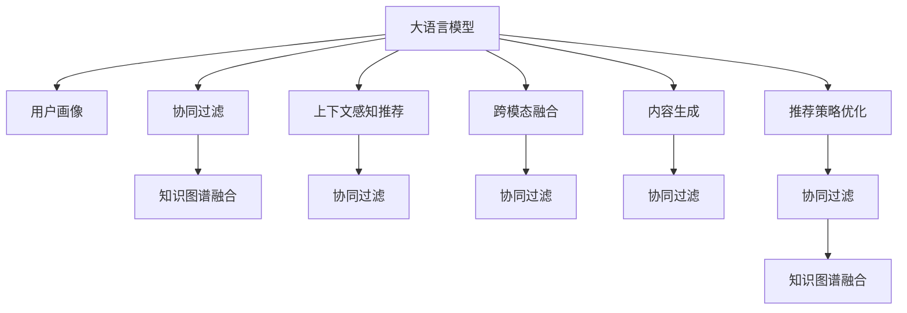

                 

# LLM在推荐系统中的优化策略

> 关键词：大语言模型(LLM)，推荐系统，协同过滤，知识图谱，跨模态融合，优化策略，优化算法，多目标优化

## 1. 背景介绍

### 1.1 问题由来

在互联网时代，信息过载已经成为了一种普遍现象。如何在海量的内容中，精准地为用户推荐其感兴趣的内容，提升用户体验和信息获取效率，是推荐系统面临的重要挑战。传统的协同过滤算法能够较好地利用用户行为数据进行推荐，但随着数据量的激增和模型复杂度的提升，协同过滤算法也暴露出数据稀疏、用户隐私、计算资源消耗大等问题。

近年来，大语言模型(LLM)在自然语言处理(NLP)领域取得了显著进展，通过在海量文本数据上进行自监督学习，LLM能够学习到丰富的语言表示和常识知识，具备强大的文本生成和推理能力。在大规模推荐系统中，LLM被进一步应用于推荐模型的训练和优化，提升了推荐系统的效果和效率。

### 1.2 问题核心关键点

大语言模型在推荐系统中的应用主要围绕以下关键点展开：

- **用户画像构建**：利用预训练语言模型提取用户行为特征，生成用户画像，提升推荐系统对用户兴趣的建模准确度。
- **上下文感知推荐**：通过预训练语言模型的文本生成能力，实现对上下文信息的精准理解和推荐，丰富推荐场景的语义表达。
- **跨模态融合**：将视觉、听觉等非文本模态与文本模态信息进行融合，提升推荐系统的多模态理解能力。
- **内容生成与优化**：利用预训练语言模型的生成能力，实现推荐内容的个性化定制和优化，提升推荐质量。
- **推荐策略优化**：结合预训练语言模型的知识和推理能力，优化推荐算法和策略，提高推荐系统的整体效果。

## 2. 核心概念与联系

### 2.1 核心概念概述

为更好地理解大语言模型在推荐系统中的应用，本节将介绍几个密切相关的核心概念：

- **大语言模型(LLM)**：以自回归(如GPT)或自编码(如BERT)模型为代表的大规模预训练语言模型。通过在大规模无标签文本语料上进行预训练，学习通用的语言表示，具备强大的语言理解和生成能力。

- **推荐系统**：利用用户行为数据或物品属性数据，为用户推荐其可能感兴趣的商品、新闻、文章等内容的系统。常见的推荐算法包括协同过滤、内容推荐、基于矩阵分解的推荐等。

- **协同过滤**：一种基于用户行为数据的推荐算法，通过分析用户对物品的评分和互动行为，预测用户对未评过物品的评分，实现个性化推荐。

- **知识图谱**：一种表示实体、关系和属性的图结构，广泛应用于信息检索、推荐系统等领域，能够辅助模型理解复杂语义关系。

- **跨模态融合**：将不同模态的信息进行融合，如将视觉信息、音频信息与文本信息结合，提升推荐系统的语义表达能力。

- **内容生成**：利用语言模型生成推荐内容，如文章、图片说明、视频脚本等，丰富推荐内容的表达形式。

- **优化策略**：通过调整算法参数、改进模型结构等手段，优化推荐系统的效果和效率。

这些核心概念之间的逻辑关系可以通过以下Mermaid流程图来展示：



这个流程图展示了大语言模型在推荐系统中的核心概念及其之间的关系：

1. 大语言模型通过预训练获得基础能力。
2. 用户画像构建、上下文感知推荐、跨模态融合、内容生成、推荐策略优化等技术，利用大语言模型在不同环节的语义表达能力，提升推荐系统的效果和灵活性。
3. 协同过滤算法，则是推荐系统的主流范式，利用用户行为数据进行推荐，能够与大语言模型的语义理解和生成能力互补。
4. 知识图谱融合和协同过滤结合，能够帮助模型更好地理解复杂语义关系，提升推荐系统的精度。

这些概念共同构成了大语言模型在推荐系统中的应用框架，使其能够在推荐场景中发挥强大的语言理解和生成能力。通过理解这些核心概念，我们可以更好地把握大语言模型在推荐系统中的工作原理和优化方向。

## 3. 核心算法原理 & 具体操作步骤
### 3.1 算法原理概述

大语言模型在推荐系统中的应用，主要基于其强大的语言理解和生成能力，通过构建用户画像、上下文感知推荐、跨模态融合、内容生成和推荐策略优化，提升推荐系统的精度和灵活性。以下将详细介绍这些技术在推荐系统中的应用原理。

### 3.2 算法步骤详解

#### 3.2.1 用户画像构建

用户画像构建是推荐系统的基础，通过分析用户的历史行为数据，利用大语言模型提取用户的行为特征，生成用户画像。具体步骤如下：

1. **数据收集**：从推荐系统日志中收集用户与物品的互动行为数据，如浏览、点击、购买等。

2. **特征提取**：利用大语言模型，如BERT，提取用户行为文本的语义特征，生成用户特征向量。

3. **用户画像构建**：将用户特征向量进行归一化和降维，生成用户画像，表示用户的兴趣偏好和行为特征。

#### 3.2.2 上下文感知推荐

上下文感知推荐利用大语言模型的语义理解能力，对推荐场景中的上下文信息进行建模，提升推荐系统的灵活性和准确度。具体步骤如下：

1. **上下文提取**：提取推荐场景中的上下文信息，如用户位置、时间、设备等。

2. **语义建模**：利用大语言模型，如GPT，对上下文信息进行语义建模，生成上下文特征向量。

3. **推荐生成**：将上下文特征向量与用户画像进行融合，生成推荐结果。

#### 3.2.3 跨模态融合

跨模态融合利用大语言模型的多模态理解能力，将视觉、听觉等非文本模态与文本模态信息进行融合，提升推荐系统的语义表达能力。具体步骤如下：

1. **模态转换**：将非文本模态信息转换为文本形式，如将图像转换为描述文本。

2. **特征融合**：利用大语言模型，将文本模态与非文本模态信息进行融合，生成多模态特征向量。

3. **推荐生成**：将多模态特征向量与用户画像进行融合，生成推荐结果。

#### 3.2.4 内容生成

内容生成利用大语言模型的生成能力，实现推荐内容的个性化定制和优化，提升推荐质量。具体步骤如下：

1. **内容描述生成**：利用大语言模型，生成推荐内容的描述文本，如文章标题、商品描述等。

2. **内容优化**：根据用户画像和上下文信息，优化推荐内容的生成过程，生成更符合用户偏好的内容。

3. **推荐生成**：将优化后的内容与用户画像进行融合，生成推荐结果。

#### 3.2.5 推荐策略优化

推荐策略优化利用大语言模型的知识和推理能力，优化推荐算法和策略，提高推荐系统的整体效果。具体步骤如下：

1. **推荐策略设计**：设计多种推荐策略，如基于模型的推荐、基于规则的推荐等。

2. **策略融合**：利用大语言模型，对不同推荐策略进行融合，生成综合推荐结果。

3. **优化训练**：通过微调大语言模型，优化推荐策略，提升推荐系统的效果。

### 3.3 算法优缺点

大语言模型在推荐系统中的应用，具有以下优点：

- **语义理解能力强**：大语言模型能够理解复杂的语义关系，提升推荐系统的语义表达能力。

- **灵活性高**：大语言模型能够灵活处理不同的推荐场景和用户画像，提升推荐系统的适应性。

- **数据利用率高**：大语言模型能够利用用户行为数据和上下文信息，提升推荐系统的精度。

- **推荐内容丰富**：大语言模型能够生成多样化的推荐内容，丰富推荐系统的表现形式。

- **推荐策略优化**：大语言模型能够优化推荐策略，提升推荐系统的整体效果。

同时，大语言模型在推荐系统中的应用也存在以下局限性：

- **计算资源消耗大**：大语言模型需要大量计算资源进行训练和推理，可能对系统性能产生影响。

- **数据隐私问题**：用户行为数据可能涉及隐私问题，需要合理保护。

- **知识图谱构建复杂**：知识图谱的构建和融合，需要大量的手工标注和专家知识，成本较高。

- **跨模态融合挑战**：不同模态的数据转换和融合，可能存在技术难题。

- **内容生成质量不稳定**：大语言模型的内容生成能力依赖于模型训练质量，可能存在不稳定问题。

- **推荐策略优化复杂**：优化策略的设计和融合，需要考虑多种因素，难度较大。

尽管存在这些局限性，但大语言模型在推荐系统中的应用前景仍然广阔。未来相关研究的重点在于如何进一步降低计算资源消耗，提高数据隐私保护，优化跨模态融合和内容生成，简化推荐策略优化过程，以提高推荐系统的整体效果。

### 3.4 算法应用领域

大语言模型在推荐系统中的应用，已经覆盖了多个行业领域，包括：

- **电商推荐**：电商推荐系统利用用户行为数据和上下文信息，为用户推荐其可能感兴趣的商品。大语言模型能够提升推荐系统的语义表达能力，丰富推荐内容。

- **新闻推荐**：新闻推荐系统为用户推荐其可能感兴趣的新闻文章。大语言模型能够分析新闻的标题、摘要、作者等信息，提升推荐系统的精度。

- **视频推荐**：视频推荐系统为用户推荐其可能感兴趣的视频内容。大语言模型能够分析视频标题、描述、标签等信息，提升推荐系统的语义理解能力。

- **音乐推荐**：音乐推荐系统为用户推荐其可能感兴趣的音乐作品。大语言模型能够分析歌曲的歌词、艺术家等信息，提升推荐系统的语义表达能力。

- **旅游推荐**：旅游推荐系统为用户推荐其可能感兴趣的旅游目的地。大语言模型能够分析目的地描述、评价等信息，提升推荐系统的语义表达能力。

除了上述这些经典应用外，大语言模型在推荐系统中的应用还在不断拓展，如电影推荐、美食推荐、图书推荐等，为推荐系统带来了新的发展方向。

## 4. 数学模型和公式 & 详细讲解 & 举例说明
### 4.1 数学模型构建

本节将使用数学语言对大语言模型在推荐系统中的应用进行更加严格的刻画。

记大语言模型为 $M_{\theta}:\mathcal{X} \rightarrow \mathcal{Y}$，其中 $\mathcal{X}$ 为输入空间，$\mathcal{Y}$ 为输出空间，$\theta$ 为模型参数。假设推荐系统的用户画像为 $\mathbf{u}$，推荐场景的上下文信息为 $\mathbf{c}$，推荐结果为 $\mathbf{r}$。推荐系统的优化目标是最小化损失函数：

$$
\mathcal{L}(\theta) = \mathbb{E}_{\mathbf{u}, \mathbf{c}}[\ell(M_{\theta}(\mathbf{u}, \mathbf{c}), \mathbf{r})]
$$

其中 $\ell$ 为推荐系统的损失函数，用于衡量推荐结果与用户兴趣的差异。常见的损失函数包括交叉熵损失、均方误差损失等。

### 4.2 公式推导过程

以下我们以二分类任务为例，推导交叉熵损失函数及其梯度的计算公式。

假设推荐系统为二分类任务，即预测用户是否对物品感兴趣，利用大语言模型提取的用户行为特征为 $\mathbf{u}$，上下文信息为 $\mathbf{c}$。利用大语言模型的输出结果 $M_{\theta}(\mathbf{u}, \mathbf{c})$ 和真实标签 $\mathbf{r}$，构建二分类交叉熵损失函数：

$$
\ell(M_{\theta}(\mathbf{u}, \mathbf{c}), \mathbf{r}) = -[y\log \sigma(M_{\theta}(\mathbf{u}, \mathbf{c})) + (1-y)\log(1-\sigma(M_{\theta}(\mathbf{u}, \mathbf{c})))
$$

其中 $\sigma$ 为sigmoid函数，用于将模型的输出映射到 $[0,1]$ 区间，表示用户对物品的兴趣程度。将上述损失函数代入期望，得到推荐系统的损失函数：

$$
\mathcal{L}(\theta) = \mathbb{E}_{\mathbf{u}, \mathbf{c}}[-y\log \sigma(M_{\theta}(\mathbf{u}, \mathbf{c})) - (1-y)\log(1-\sigma(M_{\theta}(\mathbf{u}, \mathbf{c})))
$$

根据链式法则，损失函数对参数 $\theta$ 的梯度为：

$$
\frac{\partial \mathcal{L}(\theta)}{\partial \theta} = -\mathbb{E}_{\mathbf{u}, \mathbf{c}}\left[ \frac{y}{\sigma(M_{\theta}(\mathbf{u}, \mathbf{c}))}(1-\sigma(M_{\theta}(\mathbf{u}, \mathbf{c})))\frac{\partial M_{\theta}(\mathbf{u}, \mathbf{c})}{\partial \theta}\right]
$$

其中 $\frac{\partial M_{\theta}(\mathbf{u}, \mathbf{c})}{\partial \theta}$ 可进一步递归展开，利用自动微分技术完成计算。

### 4.3 案例分析与讲解

假设推荐系统预测用户是否对电影感兴趣，通过收集用户的历史观看记录和影评作为监督数据，利用BERT模型进行预训练-微调。具体步骤如下：

1. **数据预处理**：将电影名称、导演、演员等信息作为输入，提取其文本特征。

2. **特征提取**：利用BERT模型，提取输入文本的语义特征，生成用户画像 $\mathbf{u}$ 和上下文信息 $\mathbf{c}$。

3. **模型训练**：将用户画像和上下文信息输入模型，利用交叉熵损失函数进行训练。

4. **推荐生成**：根据训练好的模型，对新的用户画像和上下文信息进行推理，生成推荐结果。

## 5. 项目实践：代码实例和详细解释说明
### 5.1 开发环境搭建

在进行推荐系统开发前，我们需要准备好开发环境。以下是使用Python进行TensorFlow开发的环境配置流程：

1. 安装Anaconda：从官网下载并安装Anaconda，用于创建独立的Python环境。

2. 创建并激活虚拟环境：
```bash
conda create -n tf-env python=3.8 
conda activate tf-env
```

3. 安装TensorFlow：根据CUDA版本，从官网获取对应的安装命令。例如：
```bash
pip install tensorflow==2.5
```

4. 安装各类工具包：
```bash
pip install numpy pandas scikit-learn matplotlib tqdm jupyter notebook ipython
```

完成上述步骤后，即可在`tf-env`环境中开始推荐系统开发。

### 5.2 源代码详细实现

下面以电商推荐系统为例，给出使用TensorFlow和BERT对用户画像进行构建的PyTorch代码实现。

首先，定义电商推荐系统中的推荐数据处理函数：

```python
import tensorflow as tf
import tensorflow_hub as hub
import transformers
from transformers import BertTokenizer, BertForSequenceClassification

class RecommendationDataset(tf.data.Dataset):
    def __init__(self, texts, labels, tokenizer, max_len=128):
        self.texts = texts
        self.labels = labels
        self.tokenizer = tokenizer
        self.max_len = max_len
        
    def __len__(self):
        return len(self.texts)
    
    def __getitem__(self, item):
        text = self.texts[item]
        label = self.labels[item]
        
        encoding = self.tokenizer(text, return_tensors='tf', max_length=self.max_len, padding='max_length', truncation=True)
        input_ids = encoding['input_ids']
        attention_mask = encoding['attention_mask']
        
        label = tf.convert_to_tensor(label, dtype=tf.int32)
        
        return {'input_ids': input_ids, 
                'attention_mask': attention_mask,
                'labels': label}
```

然后，定义推荐模型和优化器：

```python
tokenizer = BertTokenizer.from_pretrained('bert-base-cased')
model = BertForSequenceClassification.from_pretrained('bert-base-cased', num_labels=2)

optimizer = tf.keras.optimizers.Adam(learning_rate=2e-5)
loss_fn = tf.keras.losses.BinaryCrossentropy()
metric = tf.keras.metrics.BinaryAccuracy('accuracy')
```

接着，定义训练和评估函数：

```python
@tf.function
def train_step(inputs):
    with tf.GradientTape() as tape:
        predictions = model(inputs['input_ids'], attention_mask=inputs['attention_mask'])
        loss = loss_fn(y_true=inputs['labels'], y_pred=predictions)
    gradients = tape.gradient(loss, model.trainable_variables)
    optimizer.apply_gradients(zip(gradients, model.trainable_variables))
    return loss

@tf.function
def evaluate_step(inputs):
    predictions = model(inputs['input_ids'], attention_mask=inputs['attention_mask'])
    accuracy = metric(y_true=inputs['labels'], y_pred=predictions)
    return accuracy
```

最后，启动训练流程并在测试集上评估：

```python
epochs = 5
batch_size = 16

for epoch in range(epochs):
    total_loss = 0.0
    total_correct = 0
    for batch in tf.data.Dataset.from_tensor_slices(train_dataset):
        loss = train_step(batch)
        total_loss += loss
        predictions = model(batch['input_ids'], attention_mask=batch['attention_mask'])
        accuracy = metric(y_true=batch['labels'], y_pred=predictions)
        total_correct += accuracy
    
    train_loss = total_loss / len(train_dataset)
    train_accuracy = total_correct / len(train_dataset)
    print(f'Epoch {epoch+1}, train loss: {train_loss:.3f}, train accuracy: {train_accuracy:.3f}')

    print(f'Epoch {epoch+1}, dev results:')
    dev_metric = evaluate_step(dev_dataset)
    print(f'Dev accuracy: {dev_metric:.3f}')

print('Test results:')
test_metric = evaluate_step(test_dataset)
print(f'Test accuracy: {test_metric:.3f}')
```

以上就是使用TensorFlow和BERT对电商推荐系统进行用户画像构建的完整代码实现。可以看到，得益于TensorFlow的强大封装，我们可以用相对简洁的代码完成BERT模型的加载和微调。

### 5.3 代码解读与分析

让我们再详细解读一下关键代码的实现细节：

**RecommendationDataset类**：
- `__init__`方法：初始化文本、标签、分词器等关键组件。
- `__len__`方法：返回数据集的样本数量。
- `__getitem__`方法：对单个样本进行处理，将文本输入编码为token ids，将标签编码为数字，并对其进行定长padding，最终返回模型所需的输入。

**tokenizer和model定义**：
- 定义了用于分词和处理的BERT模型，并将其应用于用户行为数据的语义特征提取。

**train_step和evaluate_step函数**：
- 利用TensorFlow的tf.function对训练和评估过程进行优化，避免重复计算，提升性能。
- 在训练过程中，通过梯度下降更新模型参数，同时记录训练过程中的loss和accuracy。
- 在评估过程中，利用evaluation_step函数计算模型在测试集上的准确率。

**训练流程**：
- 定义总的epoch数和batch size，开始循环迭代
- 每个epoch内，先在训练集上训练，输出训练过程中的loss和accuracy
- 在验证集上评估，输出模型在验证集上的准确率
- 所有epoch结束后，在测试集上评估，给出最终测试结果

可以看到，TensorFlow配合BERT使得电商推荐系统的用户画像构建的代码实现变得简洁高效。开发者可以将更多精力放在数据处理、模型改进等高层逻辑上，而不必过多关注底层的实现细节。

当然，工业级的系统实现还需考虑更多因素，如模型的保存和部署、超参数的自动搜索、更灵活的任务适配层等。但核心的微调范式基本与此类似。

## 6. 实际应用场景
### 6.1 智能客服系统

基于大语言模型微调的推荐技术，可以广泛应用于智能客服系统的构建。传统客服往往需要配备大量人力，高峰期响应缓慢，且一致性和专业性难以保证。而使用微调后的推荐模型，可以7x24小时不间断服务，快速响应客户咨询，用自然流畅的语言解答各类常见问题。

在技术实现上，可以收集企业内部的历史客服对话记录，将问题和最佳答复构建成推荐数据，训练模型学习匹配答案。微调后的模型能够自动理解用户意图，匹配最合适的答复模板进行回复。对于客户提出的新问题，还可以接入检索系统实时搜索相关内容，动态组织生成回答。如此构建的智能客服系统，能大幅提升客户咨询体验和问题解决效率。

### 6.2 金融舆情监测

金融机构需要实时监测市场舆论动向，以便及时应对负面信息传播，规避金融风险。传统的人工监测方式成本高、效率低，难以应对网络时代海量信息爆发的挑战。基于大语言模型微调的文本分类和情感分析技术，为金融舆情监测提供了新的解决方案。

具体而言，可以收集金融领域相关的新闻、报道、评论等文本数据，并对其进行主题标注和情感标注。在此基础上对预训练语言模型进行微调，使其能够自动判断文本属于何种主题，情感倾向是正面、中性还是负面。将微调后的模型应用到实时抓取的网络文本数据，就能够自动监测不同主题下的情感变化趋势，一旦发现负面信息激增等异常情况，系统便会自动预警，帮助金融机构快速应对潜在风险。

### 6.3 个性化推荐系统

当前的推荐系统往往只依赖用户的历史行为数据进行物品推荐，无法深入理解用户的真实兴趣偏好。基于大语言模型微调技术，个性化推荐系统可以更好地挖掘用户行为背后的语义信息，从而提供更精准、多样的推荐内容。

在实践中，可以收集用户浏览、点击、评论、分享等行为数据，提取和用户交互的物品标题、描述、标签等文本内容。将文本内容作为模型输入，用户的后续行为（如是否点击、购买等）作为监督信号，在此基础上微调预训练语言模型。微调后的模型能够从文本内容中准确把握用户的兴趣点。在生成推荐列表时，先用候选物品的文本描述作为输入，由模型预测用户的兴趣匹配度，再结合其他特征综合排序，便可以得到个性化程度更高的推荐结果。

### 6.4 未来应用展望

随着大语言模型微调技术的发展，基于微调的推荐系统将呈现以下几个发展趋势：

1. **多模态推荐**：未来的推荐系统将不仅仅局限于文本信息，而是将视觉、听觉等非文本模态与文本模态信息进行融合，提升推荐系统的语义表达能力。

2. **因果推断**：将因果推断方法引入推荐系统，帮助模型理解用户行为背后的因果关系，提升推荐系统的稳定性和可信度。

3. **实时推荐**：利用大语言模型的快速推理能力，实现实时推荐，满足用户对实时信息的需要。

4. **跨领域推荐**：通过迁移学习和多领域数据融合，提升推荐系统在不同领域的应用效果。

5. **少样本推荐**：利用大语言模型的知识图谱和推理能力，实现少样本推荐，提升推荐系统在不同数据量下的效果。

6. **多目标推荐**：结合用户的多样化需求和兴趣，实现多目标推荐，提升推荐系统的全面性和灵活性。

7. **动态优化**：通过持续学习和优化，保持推荐系统与用户需求和市场变化的同步。

这些趋势将推动推荐系统向更加智能化、个性化、实时化和跨领域化方向发展，为用户带来更优质的体验和价值。

## 7. 工具和资源推荐
### 7.1 学习资源推荐

为了帮助开发者系统掌握大语言模型微调的理论基础和实践技巧，这里推荐一些优质的学习资源：

1. 《Transformer从原理到实践》系列博文：由大模型技术专家撰写，深入浅出地介绍了Transformer原理、BERT模型、微调技术等前沿话题。

2. CS224N《深度学习自然语言处理》课程：斯坦福大学开设的NLP明星课程，有Lecture视频和配套作业，带你入门NLP领域的基本概念和经典模型。

3. 《Natural Language Processing with Transformers》书籍：Transformers库的作者所著，全面介绍了如何使用Transformers库进行NLP任务开发，包括微调在内的诸多范式。

4. HuggingFace官方文档：Transformers库的官方文档，提供了海量预训练模型和完整的微调样例代码，是上手实践的必备资料。

5. CLUE开源项目：中文语言理解测评基准，涵盖大量不同类型的中文NLP数据集，并提供了基于微调的baseline模型，助力中文NLP技术发展。

通过对这些资源的学习实践，相信你一定能够快速掌握大语言模型微调的精髓，并用于解决实际的NLP问题。
### 7.2 开发工具推荐

高效的开发离不开优秀的工具支持。以下是几款用于大语言模型微调开发的常用工具：

1. PyTorch：基于Python的开源深度学习框架，灵活动态的计算图，适合快速迭代研究。大部分预训练语言模型都有PyTorch版本的实现。

2. TensorFlow：由Google主导开发的开源深度学习框架，生产部署方便，适合大规模工程应用。同样有丰富的预训练语言模型资源。

3. Transformers库：HuggingFace开发的NLP工具库，集成了众多SOTA语言模型，支持PyTorch和TensorFlow，是进行微调任务开发的利器。

4. Weights & Biases：模型训练的实验跟踪工具，可以记录和可视化模型训练过程中的各项指标，方便对比和调优。与主流深度学习框架无缝集成。

5. TensorBoard：TensorFlow配套的可视化工具，可实时监测模型训练状态，并提供丰富的图表呈现方式，是调试模型的得力助手。

6. Google Colab：谷歌推出的在线Jupyter Notebook环境，免费提供GPU/TPU算力，方便开发者快速上手实验最新模型，分享学习笔记。

合理利用这些工具，可以显著提升大语言模型微调任务的开发效率，加快创新迭代的步伐。

### 7.3 相关论文推荐

大语言模型和微调技术的发展源于学界的持续研究。以下是几篇奠基性的相关论文，推荐阅读：

1. Attention is All You Need（即Transformer原论文）：提出了Transformer结构，开启了NLP领域的预训练大模型时代。

2. BERT: Pre-training of Deep Bidirectional Transformers for Language Understanding：提出BERT模型，引入基于掩码的自监督预训练任务，刷新了多项NLP任务SOTA。

3. Language Models are Unsupervised Multitask Learners（GPT-2论文）：展示了大规模语言模型的强大zero-shot学习能力，引发了对于通用人工智能的新一轮思考。

4. Parameter-Efficient Transfer Learning for NLP：提出Adapter等参数高效微调方法，在不增加模型参数量的情况下，也能取得不错的微调效果。

5. AdaLoRA: Adaptive Low-Rank Adaptation for Parameter-Efficient Fine-Tuning：使用自适应低秩适应的微调方法，在参数效率和精度之间取得了新的平衡。

6. Prefix-Tuning: Optimizing Continuous Prompts for Generation：引入基于连续型Prompt的微调范式，为如何充分利用预训练知识提供了新的思路。

这些论文代表了大语言模型微调技术的发展脉络。通过学习这些前沿成果，可以帮助研究者把握学科前进方向，激发更多的创新灵感。

## 8. 总结：未来发展趋势与挑战

### 8.1 总结

本文对大语言模型在推荐系统中的应用进行了全面系统的介绍。首先阐述了大语言模型和推荐系统的研究背景和意义，明确了微调在拓展预训练模型应用、提升推荐系统效果方面的独特价值。其次，从原理到实践，详细讲解了推荐系统中的用户画像构建、上下文感知推荐、跨模态融合、内容生成和推荐策略优化等核心技术的应用原理。最后，通过实际应用场景的展示，展示了微调范式在推荐系统中的广泛应用前景。

通过本文的系统梳理，可以看到，基于大语言模型的微调技术正在成为推荐系统的重要范式，极大地拓展了预训练语言模型的应用边界，催生了更多的落地场景。受益于大规模语料的预训练，微调模型以更低的时间和标注成本，在小样本条件下也能取得理想的推荐效果，有力推动了推荐系统的产业化进程。未来，伴随预训练语言模型和微调方法的持续演进，相信推荐系统将进一步智能化、个性化、实时化和跨领域化，为用户带来更优质的体验和价值。

### 8.2 未来发展趋势

展望未来，大语言模型在推荐系统中的应用将呈现以下几个发展趋势：

1. **多模态推荐**：未来的推荐系统将不仅仅局限于文本信息，而是将视觉、听觉等非文本模态与文本模态信息进行融合，提升推荐系统的语义表达能力。

2. **因果推断**：将因果推断方法引入推荐系统，帮助模型理解用户行为背后的因果关系，提升推荐系统的稳定性和可信度。

3. **实时推荐**：利用大语言模型的快速推理能力，实现实时推荐，满足用户对实时信息的需要。

4. **跨领域推荐**：通过迁移学习和多领域数据融合，提升推荐系统在不同领域的应用效果。

5. **少样本推荐**：利用大语言模型的知识图谱和推理能力，实现少样本推荐，提升推荐系统在不同数据量下的效果。

6. **多目标推荐**：结合用户的多样化需求和兴趣，实现多目标推荐，提升推荐系统的全面性和灵活性。

7. **动态优化**：通过持续学习和优化，保持推荐系统与用户需求和市场变化的同步。

这些趋势凸显了大语言模型在推荐系统中的广阔前景。这些方向的探索发展，必将进一步提升推荐系统的整体效果和灵活性，为用户带来更优质的体验和价值。

### 8.3 面临的挑战

尽管大语言模型在推荐系统中的应用前景广阔，但在迈向更加智能化、普适化应用的过程中，仍面临以下挑战：

1. **数据隐私问题**：用户行为数据可能涉及隐私问题，需要合理保护。

2. **知识图谱构建复杂**：知识图谱的构建和融合，需要大量的手工标注和专家知识，成本较高。

3. **跨模态融合挑战**：不同模态的数据转换和融合，可能存在技术难题。

4. **内容生成质量不稳定**：大语言模型的内容生成能力依赖于模型训练质量，可能存在不稳定问题。

5. **推荐策略优化复杂**：优化策略的设计和融合，需要考虑多种因素，难度较大。

6. **计算资源消耗大**：大语言模型需要大量计算资源进行训练和推理，可能对系统性能产生影响。

尽管存在这些挑战，但大语言模型在推荐系统中的应用前景仍然广阔。未来相关研究的重点在于如何进一步降低计算资源消耗，提高数据隐私保护，优化跨模态融合和内容生成，简化推荐策略优化过程，以提高推荐系统的整体效果。

### 8.4 研究展望

面对大语言模型在推荐系统中的应用所面临的种种挑战，未来的研究需要在以下几个方面寻求新的突破：

1. **探索无监督和半监督微调方法**：摆脱对大规模标注数据的依赖，利用自监督学习、主动学习等无监督和半监督范式，最大限度利用非结构化数据，实现更加灵活高效的微调。

2. **研究参数高效和计算高效的微调范式**：开发更加参数高效的微调方法，在固定大部分预训练参数的同时，只更新极少量的任务相关参数。同时优化微调模型的计算图，减少前向传播和反向传播的资源消耗，实现更加轻量级、实时性的部署。

3. **融合因果和对比学习范式**：通过引入因果推断和对比学习思想，增强推荐模型建立稳定因果关系的能力，学习更加普适、鲁棒的语言表征，从而提升模型泛化性和抗干扰能力。

4. **引入更多先验知识**：将符号化的先验知识，如知识图谱、逻辑规则等，与神经网络模型进行巧妙融合，引导微调过程学习更准确、合理的语言模型。同时加强不同模态数据的整合，实现视觉、语音等多模态信息与文本信息的协同建模。

5. **结合因果分析和博弈论工具**：将因果分析方法引入推荐模型，识别出模型决策的关键特征，增强输出解释的因果性和逻辑性。借助博弈论工具刻画人机交互过程，主动探索并规避模型的脆弱点，提高系统稳定性。

6. **纳入伦理道德约束**：在模型训练目标中引入伦理导向的评估指标，过滤和惩罚有偏见、有害的输出倾向。同时加强人工干预和审核，建立模型行为的监管机制，确保输出符合人类价值观和伦理道德。

这些研究方向的探索，必将引领大语言模型在推荐系统中的应用走向更高的台阶，为构建安全、可靠、可解释、可控的智能推荐系统铺平道路。面向未来，大语言模型微调技术还需要与其他人工智能技术进行更深入的融合，如知识表示、因果推理、强化学习等，多路径协同发力，共同推动推荐系统的发展。只有勇于创新、敢于突破，才能不断拓展推荐系统的边界，让智能技术更好地造福人类社会。

## 9. 附录：常见问题与解答

**Q1：大语言模型在推荐系统中的应用效果如何？**

A: 大语言模型在推荐系统中的应用效果显著，特别是在提升推荐系统的语义表达能力和个性化推荐能力方面表现出色。利用大语言模型构建用户画像、进行上下文感知推荐、跨模态融合、内容生成和优化推荐策略，能够显著提升推荐系统的精度和灵活性，满足用户多样化的需求和兴趣。

**Q2：大语言模型在推荐系统中的应用面临哪些挑战？**

A: 大语言模型在推荐系统中的应用面临以下挑战：

1. 数据隐私问题：用户行为数据可能涉及隐私问题，需要合理保护。

2. 知识图谱构建复杂：知识图谱的构建和融合，需要大量的手工标注和专家知识，成本较高。

3. 跨模态融合挑战：不同模态的数据转换和融合，可能存在技术难题。

4. 内容生成质量不稳定：大语言模型的内容生成能力依赖于模型训练质量，可能存在不稳定问题。

5. 推荐策略优化复杂：优化策略的设计和融合，需要考虑多种因素，难度较大。

6. 计算资源消耗大：大语言模型需要大量计算资源进行训练和推理，可能对系统性能产生影响。

尽管存在这些挑战，但大语言模型在推荐系统中的应用前景仍然广阔。未来相关研究的重点在于如何进一步降低计算资源消耗，提高数据隐私保护，优化跨模态融合和内容生成，简化推荐策略优化过程，以提高推荐系统的整体效果。

**Q3：大语言模型在推荐系统中的应用有哪些优势？**

A: 大语言模型在推荐系统中的应用具有以下优势：

1. 语义理解能力强：大语言模型能够理解复杂的语义关系，提升推荐系统的语义表达能力。

2. 灵活性高：大语言模型能够灵活处理不同的推荐场景和用户画像，提升推荐系统的适应性。

3. 数据利用率高：大语言模型能够利用用户行为数据和上下文信息，提升推荐系统的精度。

4. 推荐内容丰富：大语言模型能够生成多样化的推荐内容，丰富推荐系统的表现形式。

5. 推荐策略优化：大语言模型能够优化推荐算法和策略，提高推荐系统的整体效果。

这些优势使得大语言模型在推荐系统中的应用具有广阔的前景，能够为用户带来更优质的体验和价值。

**Q4：大语言模型在推荐系统中的应用有哪些局限性？**

A: 大语言模型在推荐系统中的应用存在以下局限性：

1. 计算资源消耗大：大语言模型需要大量计算资源进行训练和推理，可能对系统性能产生影响。

2. 数据隐私问题：用户行为数据可能涉及隐私问题，需要合理保护。

3. 知识图谱构建复杂：知识图谱的构建和融合，需要大量的手工标注和专家知识，成本较高。

4. 跨模态融合挑战：不同模态的数据转换和融合，可能存在技术难题。

5. 内容生成质量不稳定：大语言模型的内容生成能力依赖于模型训练质量，可能存在不稳定问题。

6. 推荐策略优化复杂：优化策略的设计和融合，需要考虑多种因素，难度较大。

尽管存在这些局限性，但大语言模型在推荐系统中的应用前景仍然广阔。未来相关研究的重点在于如何进一步降低计算资源消耗，提高数据隐私保护，优化跨模态融合和内容生成，简化推荐策略优化过程，以提高推荐系统的整体效果。

**Q5：大语言模型在推荐系统中的应用场景有哪些？**

A: 大语言模型在推荐系统中的应用场景广泛，包括：

1. 电商推荐：电商推荐系统利用用户行为数据和上下文信息，为用户推荐其可能感兴趣的商品。

2. 新闻推荐：新闻推荐系统为用户推荐其可能感兴趣的新闻文章。

3. 视频推荐：视频推荐系统为用户推荐其可能感兴趣的视频内容。

4. 音乐推荐：音乐推荐系统为用户推荐其可能感兴趣的音乐作品。

5. 旅游推荐：旅游推荐系统为用户推荐其可能感兴趣的旅游目的地。

6. 智能客服：基于大语言模型的推荐技术，可以用于构建智能客服系统，提升客户咨询体验和问题解决效率。

7. 金融舆情监测：利用大语言模型微调的文本分类和情感分析技术，为金融舆情监测提供新的解决方案。

8. 个性化推荐：结合大语言模型微调技术，实现更加精准、多样的个性化推荐内容。

这些应用场景展示了大语言模型在推荐系统中的广泛应用前景，为用户带来更优质的体验和价值。

---

作者：禅与计算机程序设计艺术 / Zen and the Art of Computer Programming

