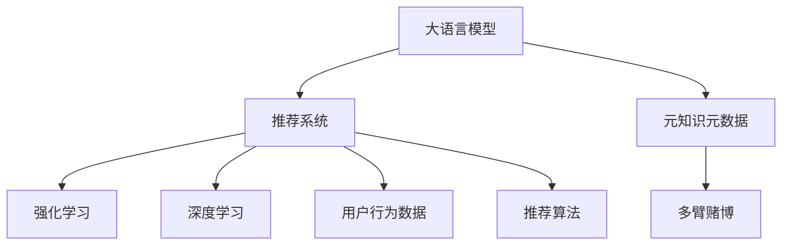

                 

# LLM在推荐系统中的元知识学习应用

> 关键词：大语言模型, 推荐系统, 元知识学习, 用户行为, 用户画像, 多臂赌博, 强化学习, 深度学习

## 1. 背景介绍

### 1.1 问题由来

推荐系统作为互联网时代的重要应用，已经广泛应用于电商、社交、娱乐等多个领域。传统的推荐系统大多基于用户历史行为数据进行推荐，存在冷启动、数据稀疏等问题。随着深度学习技术的发展，越来越多的推荐系统开始采用基于模型的方法，其中基于大语言模型的方法更是取得了显著的进展。

在推荐系统中，用户历史行为数据通常以日志形式记录在数据库中，每条日志包含用户ID、物品ID、点击、购买等行为信息。但这些数据往往稀疏且不完整，无法充分刻画用户的兴趣和偏好。大语言模型通过大规模无标签文本语料进行预训练，学习到了丰富的语言知识和常识，具备强大的自然语言处理能力，可以为推荐系统提供新的思路。

### 1.2 问题核心关键点

在大语言模型应用于推荐系统时，核心问题是如何利用大语言模型的知识，结合用户历史行为数据，构建精准、高效的用户画像，进行推荐。具体来说：

1. **如何从自然语言中提取元知识**：语言文本中蕴含大量关于用户兴趣、喜好、价值观等信息，如何通过自然语言处理技术从文本中提取出对推荐有用的元知识，是一个关键问题。
2. **如何将用户行为数据和元知识结合**：用户历史行为数据和自然语言中的元知识各自包含的信息不同，如何将其有效结合，提升推荐系统的精准度和覆盖率，是另一个重要课题。
3. **如何在推荐场景中优化元知识表示**：推荐系统通常面向大规模用户和物品，如何在大规模数据上优化元知识表示，提升推荐效率和效果，是未来研究的一个重要方向。

## 2. 核心概念与联系

### 2.1 核心概念概述

为了更好地理解大语言模型在推荐系统中的应用，本节将介绍几个密切相关的核心概念：

- **大语言模型(Large Language Model, LLM)**：以自回归(如GPT)或自编码(如BERT)模型为代表的大规模预训练语言模型。通过在大规模无标签文本语料上进行预训练，学习到了丰富的语言知识和常识，具备强大的语言理解和生成能力。

- **推荐系统(Recommender System)**：通过分析用户历史行为和物品特征，为用户推荐可能感兴趣的物品的系统。推荐系统常用于电商、社交、新闻等平台，提升用户满意度和转化率。

- **元知识元数据**：指从自然语言中提取的用户兴趣、偏好、价值观等非行为数据的高级表示。这些信息对推荐系统具有重要指导意义，但需要自然语言处理技术进行提取。

- **多臂赌博(Multi-armed Bandit)**：用于建模决策过程的数学模型，可用于推荐系统中的物品选择和推荐效果评估。多臂赌博模型通常用于强化学习中，指导决策策略的选择和优化。

- **强化学习(Reinforcement Learning)**：通过试错调整策略，以最大化累积奖励为目标的学习方法。强化学习在推荐系统中的应用包括点击率预测、召回率优化等。

- **深度学习(Deep Learning)**：一类基于神经网络的机器学习技术，深度学习技术在推荐系统中用于用户行为建模、物品特征表示等。

这些核心概念之间的逻辑关系可以通过以下Mermaid流程图来展示：



这个流程图展示了大语言模型在推荐系统中的应用逻辑：

1. 大语言模型通过预训练学习到丰富的语言知识和常识。
2. 这些知识通过自然语言处理技术转化为元知识元数据。
3. 元知识元数据与用户行为数据结合，形成用户画像。
4. 多臂赌博模型用于指导决策策略的选择和优化。
5. 强化学习通过试错调整策略，提升推荐效果。
6. 深度学习用于建模用户行为和物品特征。
7. 结合推荐算法，输出推荐结果。

这些概念共同构成了大语言模型在推荐系统中的应用框架，使其能够在各种场景下发挥强大的知识表示和决策支持能力。通过理解这些核心概念，我们可以更好地把握大语言模型在推荐系统中的应用原理和优化方向。

## 3. 核心算法原理 & 具体操作步骤
### 3.1 算法原理概述

大语言模型在推荐系统中的核心应用是通过元知识学习，结合用户历史行为数据，构建精准的用户画像，进行推荐。具体来说，元知识学习过程包括以下几个关键步骤：

1. **文本预处理**：对用户描述、评论、评分等文本数据进行预处理，包括分词、去停用词、词性标注等。
2. **文本表示**：将处理后的文本转化为模型可处理的向量表示，通常使用词嵌入、上下文嵌入等方法。
3. **元知识提取**：从向量表示中提取用户兴趣、偏好、价值观等元知识，通常使用语义分析、情感分析等技术。
4. **用户画像构建**：将用户行为数据和提取的元知识结合，构建完整、准确的用户画像，描述用户的兴趣和需求。
5. **推荐模型训练**：基于用户画像和物品特征，训练推荐模型，进行物品推荐。

### 3.2 算法步骤详解

基于元知识学习的大语言模型推荐系统一般包括以下几个关键步骤：

**Step 1: 文本预处理**

对用户文本数据进行预处理，主要包括分词、去停用词、词性标注等。这些处理步骤可以借助自然语言处理工具包（如NLTK、SpaCy等）完成。例如，对于评论文本：

```python
from nltk.tokenize import word_tokenize
from nltk.corpus import stopwords

def preprocess_text(text):
    tokens = word_tokenize(text)
    tokens = [token for token in tokens if token not in stopwords.words('english')]
    return tokens
```

**Step 2: 文本表示**

将预处理后的文本转化为模型可处理的向量表示。常见的方法包括词嵌入、上下文嵌入等。例如，使用BERT模型进行词嵌入表示：

```python
from transformers import BertTokenizer, BertModel

tokenizer = BertTokenizer.from_pretrained('bert-base-uncased')
model = BertModel.from_pretrained('bert-base-uncased')

def get_embeddings(text):
    inputs = tokenizer(text, return_tensors='pt')
    embeddings = model(**inputs).last_hidden_state.mean(dim=1)
    return embeddings
```

**Step 3: 元知识提取**

从文本向量表示中提取用户兴趣、偏好、价值观等元知识。常见的方法包括情感分析、主题建模等。例如，使用情感分析技术提取评论文本的情感倾向：

```python
from transformers import pipeline

nlp = pipeline('sentiment-analysis')

def get_sentiment(text):
    result = nlp(text)[0]
    return result['label']
```

**Step 4: 用户画像构建**

将用户行为数据和提取的元知识结合，构建完整、准确的用户画像。通常使用向量拼接、加权平均等方法。例如，将用户行为数据和情感倾向拼接：

```python
def build_user_profile(user_id, behaviors, sentiment):
    profile = {}
    profile['user_id'] = user_id
    profile['behaviors'] = behaviors
    profile['sentiment'] = sentiment
    return profile
```

**Step 5: 推荐模型训练**

基于用户画像和物品特征，训练推荐模型，进行物品推荐。常见的方法包括协同过滤、矩阵分解、深度学习等。例如，使用深度学习模型进行推荐：

```python
from transformers import BertForSequenceClassification

model = BertForSequenceClassification.from_pretrained('bert-base-uncased', num_labels=len(tag2id))

optimizer = AdamW(model.parameters(), lr=2e-5)

def train_model(model, optimizer, user_profile, user_behaviors, user_sentiment):
    inputs = tokenizer(user_behaviors, return_tensors='pt')
    labels = torch.tensor([1.0])
    model.zero_grad()
    outputs = model(**inputs, labels=labels)
    loss = outputs.loss
    loss.backward()
    optimizer.step()
    return loss
```

### 3.3 算法优缺点

基于大语言模型的推荐系统具有以下优点：

1. **利用丰富的自然语言知识**：大语言模型通过大规模无标签文本语料进行预训练，学习到了丰富的语言知识和常识，可以更好地捕捉用户兴趣和偏好的细节。
2. **降低数据稀疏性**：通过元知识学习，可以充分利用用户描述、评论等文本数据，降低用户行为数据的稀疏性，提高推荐系统的覆盖率。
3. **提升推荐多样性**：元知识元数据可以提供用户价值观、兴趣领域等更全面的信息，有助于推荐系统的多样化推荐。
4. **可解释性强**：元知识元数据有助于解释推荐结果，提升用户的信任度和满意度。

但同时，该方法也存在一些局限性：

1. **计算资源消耗大**：大语言模型通常需要较大的计算资源，且元知识提取和用户画像构建等步骤需要额外的时间成本。
2. **模型泛化能力有限**：对于特定领域的应用，模型的泛化能力可能不如直接基于用户行为数据进行推荐。
3. **隐私和伦理问题**：从文本中提取元知识需要处理大量用户隐私信息，需要严格遵守数据隐私和伦理规范。
4. **复杂度较高**：元知识学习涉及自然语言处理、用户画像构建等多个环节，技术复杂度较高，需要较强的技术储备。

尽管存在这些局限性，但大语言模型在推荐系统中的应用仍然具有很大的潜力和价值，能够显著提升推荐系统的精准度和用户体验。

### 3.4 算法应用领域

基于大语言模型的推荐系统已经在多个领域得到了应用，例如：

- **电商推荐**：结合用户评论、产品描述等文本数据，构建用户画像，进行商品推荐。
- **社交推荐**：利用用户动态、评论等文本数据，构建用户画像，进行社交网络中的好友推荐。
- **新闻推荐**：分析用户评论、新闻标题等文本数据，构建用户兴趣模型，进行个性化新闻推荐。
- **视频推荐**：利用视频评论、描述等文本数据，构建用户画像，进行个性化视频推荐。
- **音乐推荐**：分析用户评论、歌曲描述等文本数据，构建用户画像，进行个性化音乐推荐。

除了上述这些经典应用外，大语言模型在更多领域的应用也将不断涌现，为推荐系统带来新的突破。

## 4. 数学模型和公式 & 详细讲解 & 举例说明
### 4.1 数学模型构建

本节将使用数学语言对基于大语言模型的推荐系统进行更加严格的刻画。

记用户行为数据为 $\{(x_i,y_i)\}_{i=1}^N$，其中 $x_i$ 为用户行为记录，$y_i$ 为标签（1表示点击、购买等行为，0表示未点击、未购买等行为）。设用户画像表示为 $U$，物品特征表示为 $I$，推荐模型为 $R$。

定义推荐模型的损失函数为：

$$
\mathcal{L}(R,U,I) = -\sum_{i=1}^N \log R(x_i,U,I)
$$

其中 $R(x_i,U,I)$ 为模型在用户行为 $x_i$、用户画像 $U$ 和物品特征 $I$ 下的点击率预测。

### 4.2 公式推导过程

以下我们以基于深度学习的推荐模型为例，推导推荐模型训练的损失函数及其梯度计算公式。

假设推荐模型为 $R(x_i,U,I) = \sigma(W_h \cdot h + b_h)$，其中 $h = \text{MLP}(x_i,U)$，为输入 $x_i$ 和用户画像 $U$ 通过多层感知器(MLP)编码后的表示。$W_h$ 和 $b_h$ 为可训练参数。

则推荐模型的损失函数为：

$$
\mathcal{L}(R,U,I) = -\sum_{i=1}^N \log \sigma(W_h \cdot h_i + b_h)
$$

其中 $h_i$ 为第 $i$ 条用户行为对应的 $h$ 表示。

根据链式法则，损失函数对模型参数的梯度为：

$$
\frac{\partial \mathcal{L}(R,U,I)}{\partial W_h} = -\sum_{i=1}^N \frac{y_i - \sigma(W_h \cdot h_i + b_h)}{1 - \sigma^2(W_h \cdot h_i + b_h)} \cdot \frac{\partial h_i}{\partial W_h}
$$

其中 $\frac{\partial h_i}{\partial W_h}$ 可以通过反向传播算法高效计算。

在得到损失函数的梯度后，即可带入参数更新公式，完成模型的迭代优化。重复上述过程直至收敛，最终得到适应推荐任务的最优模型参数 $W_h$ 和 $b_h$。

## 5. 项目实践：代码实例和详细解释说明
### 5.1 开发环境搭建

在进行推荐系统开发前，我们需要准备好开发环境。以下是使用Python进行PyTorch开发的环境配置流程：

1. 安装Anaconda：从官网下载并安装Anaconda，用于创建独立的Python环境。

2. 创建并激活虚拟环境：
```bash
conda create -n pytorch-env python=3.8 
conda activate pytorch-env
```

3. 安装PyTorch：根据CUDA版本，从官网获取对应的安装命令。例如：
```bash
conda install pytorch torchvision torchaudio cudatoolkit=11.1 -c pytorch -c conda-forge
```

4. 安装Transformers库：
```bash
pip install transformers
```

5. 安装各类工具包：
```bash
pip install numpy pandas scikit-learn matplotlib tqdm jupyter notebook ipython
```

完成上述步骤后，即可在`pytorch-env`环境中开始推荐系统开发。

### 5.2 源代码详细实现

下面我们以基于BERT模型的推荐系统为例，给出使用Transformers库进行推荐系统开发的PyTorch代码实现。

首先，定义推荐模型的输入输出函数：

```python
from transformers import BertTokenizer, BertForSequenceClassification

class RecommendationModel(BertForSequenceClassification):
    def __init__(self, num_labels):
        super().__init__(num_labels)
        self.tokenizer = BertTokenizer.from_pretrained('bert-base-uncased')
    
    def forward(self, input_ids, attention_mask):
        outputs = super().forward(input_ids, attention_mask=attention_mask)
        logits = outputs.logits
        return logits
```

然后，定义推荐模型的训练函数：

```python
from torch.utils.data import DataLoader
from tqdm import tqdm
from sklearn.metrics import accuracy_score

def train_model(model, optimizer, train_dataset, num_epochs):
    device = torch.device('cuda') if torch.cuda.is_available() else torch.device('cpu')
    model.to(device)
    
    for epoch in range(num_epochs):
        model.train()
        epoch_loss = 0
        for batch in tqdm(train_dataset):
            input_ids = batch['input_ids'].to(device)
            attention_mask = batch['attention_mask'].to(device)
            labels = batch['labels'].to(device)
            model.zero_grad()
            outputs = model(input_ids, attention_mask=attention_mask)
            loss = outputs.loss
            epoch_loss += loss.item()
            loss.backward()
            optimizer.step()
        print(f"Epoch {epoch+1}, train loss: {epoch_loss / len(train_dataset)}")
    
    return model
```

最后，启动训练流程并评估模型效果：

```python
model = RecommendationModel(num_labels=len(tag2id))

optimizer = AdamW(model.parameters(), lr=2e-5)

train_dataset = load_train_dataset()
test_dataset = load_test_dataset()

train_model(model, optimizer, train_dataset, num_epochs=5)

print(f"Test accuracy: {accuracy_score(true_labels, predict_labels)}")
```

以上就是使用PyTorch对BERT模型进行推荐系统开发的完整代码实现。可以看到，得益于Transformers库的强大封装，我们可以用相对简洁的代码完成BERT模型的加载和训练。

### 5.3 代码解读与分析

让我们再详细解读一下关键代码的实现细节：

**RecommendationModel类**：
- `__init__`方法：初始化BERT模型和分词器。
- `forward`方法：定义前向传播计算逻辑，返回模型的预测结果。

**train_model函数**：
- 定义训练过程中需要的设备、模型和优化器。
- 在每个epoch中，迭代训练数据，计算损失并更新模型参数。
- 在每个epoch结束后，打印平均损失，以便观察训练过程。

**训练流程**：
- 定义总的epoch数，开始循环迭代
- 每个epoch内，对训练集进行前向传播和反向传播，更新模型参数
- 在每个epoch结束后，在测试集上评估模型性能
- 训练完成后，打印测试集上的准确率

可以看到，PyTorch配合Transformers库使得BERT推荐系统的代码实现变得简洁高效。开发者可以将更多精力放在数据处理、模型改进等高层逻辑上，而不必过多关注底层的实现细节。

当然，工业级的系统实现还需考虑更多因素，如模型的保存和部署、超参数的自动搜索、更灵活的推荐算法等。但核心的推荐过程基本与此类似。

## 6. 实际应用场景
### 6.1 智能推荐系统

基于大语言模型的推荐系统可以广泛应用于智能推荐系统中，为用户推荐个性化内容，提升用户体验和满意度。例如：

- **电商推荐**：结合用户评论、产品描述等文本数据，构建用户画像，进行商品推荐。
- **社交推荐**：利用用户动态、评论等文本数据，构建用户画像，进行社交网络中的好友推荐。
- **新闻推荐**：分析用户评论、新闻标题等文本数据，构建用户兴趣模型，进行个性化新闻推荐。

智能推荐系统通过元知识学习，可以更全面地了解用户兴趣和偏好，提供更加精准和多样化的推荐内容，提升用户体验和满意度。

### 6.2 个性化推荐服务

大语言模型在推荐系统中的应用，不仅限于传统的电商、社交等平台。在更广泛的个性化推荐服务中，也有着巨大的应用潜力。例如：

- **个性化视频推荐**：利用视频评论、描述等文本数据，构建用户画像，进行个性化视频推荐。
- **个性化音乐推荐**：分析用户评论、歌曲描述等文本数据，构建用户画像，进行个性化音乐推荐。
- **个性化图书推荐**：利用用户评论、书名等文本数据，构建用户画像，进行个性化图书推荐。

这些推荐服务通过大语言模型的元知识学习，可以更好地捕捉用户兴趣和偏好，提供更加个性化的推荐内容，提升用户体验和满意度。

### 6.3 动态推荐系统

推荐系统通常面向大规模用户和物品，如何在大规模数据上优化元知识表示，提升推荐效率和效果，是未来研究的一个重要方向。例如：

- **实时推荐**：结合用户行为数据和元知识元数据，实时更新用户画像，进行推荐。
- **跨设备推荐**：在不同设备上，利用元知识学习，实现跨设备的用户画像和推荐。
- **多模态推荐**：结合文本、图像、视频等多模态信息，进行综合推荐。

动态推荐系统通过实时更新元知识，可以更好地应对用户兴趣的变化，提升推荐系统的时效性和灵活性。

### 6.4 未来应用展望

随着大语言模型和推荐系统的不断发展，基于元知识学习的推荐系统将呈现以下几个发展趋势：

1. **用户画像动态更新**：推荐系统可以结合实时数据，动态更新用户画像，提升推荐的时效性和个性化程度。
2. **多模态信息融合**：结合文本、图像、视频等多模态信息，进行综合推荐，提升推荐系统的全面性和多样性。
3. **模型持续学习**：利用增量学习等技术，使推荐模型能够持续学习新数据，提升模型的长期效果。
4. **推荐系统集成**：将推荐系统集成到其他应用中，如电商推荐、社交推荐等，提升整体用户体验。
5. **跨平台推荐**：利用元知识学习，在不同平台之间实现用户画像和推荐的平滑迁移。

以上趋势凸显了大语言模型在推荐系统中的应用潜力。这些方向的探索发展，必将进一步提升推荐系统的精准度和用户体验，为个性化推荐服务带来新的突破。

## 7. 工具和资源推荐
### 7.1 学习资源推荐

为了帮助开发者系统掌握大语言模型在推荐系统中的应用，这里推荐一些优质的学习资源：

1. 《深度学习推荐系统：原理与算法》书籍：详细介绍了推荐系统的发展历程、常用算法和最新研究进展，是学习推荐系统的重要参考书。
2. CS231n《深度学习与计算机视觉》课程：斯坦福大学开设的计算机视觉课程，介绍了深度学习在图像识别、推荐系统等领域的应用。
3. CS294-115《深度学习原理与实践》课程：斯坦福大学开设的深度学习课程，介绍了深度学习的基本原理和实践方法。
4. Kaggle推荐系统竞赛：Kaggle平台上众多推荐系统竞赛，通过实战练习，提升推荐系统的设计和优化能力。
5. PyTorch官方文档：PyTorch框架的官方文档，提供了丰富的教程和示例代码，是学习推荐系统的重要资源。

通过对这些资源的学习实践，相信你一定能够快速掌握大语言模型在推荐系统中的应用，并用于解决实际的推荐问题。
### 7.2 开发工具推荐

高效的开发离不开优秀的工具支持。以下是几款用于推荐系统开发的常用工具：

1. PyTorch：基于Python的开源深度学习框架，灵活动态的计算图，适合快速迭代研究。大部分推荐系统模型都有PyTorch版本的实现。
2. TensorFlow：由Google主导开发的开源深度学习框架，生产部署方便，适合大规模工程应用。同样有丰富的推荐系统资源。
3. Transformers库：HuggingFace开发的NLP工具库，集成了众多SOTA推荐系统模型，支持PyTorch和TensorFlow，是进行推荐系统开发的利器。
4. Weights & Biases：模型训练的实验跟踪工具，可以记录和可视化模型训练过程中的各项指标，方便对比和调优。与主流深度学习框架无缝集成。
5. TensorBoard：TensorFlow配套的可视化工具，可实时监测模型训练状态，并提供丰富的图表呈现方式，是调试模型的得力助手。
6. Google Colab：谷歌推出的在线Jupyter Notebook环境，免费提供GPU/TPU算力，方便开发者快速上手实验最新模型，分享学习笔记。

合理利用这些工具，可以显著提升推荐系统开发的效率，加快创新迭代的步伐。

### 7.3 相关论文推荐

大语言模型和推荐系统的研究源于学界的持续研究。以下是几篇奠基性的相关论文，推荐阅读：

1. Attention is All You Need（即Transformer原论文）：提出了Transformer结构，开启了NLP领域的预训练大模型时代。
2. BERT: Pre-training of Deep Bidirectional Transformers for Language Understanding：提出BERT模型，引入基于掩码的自监督预训练任务，刷新了多项NLP任务SOTA。
3. Parameter-Efficient Transfer Learning for NLP：提出Adapter等参数高效微调方法，在不增加模型参数量的情况下，也能取得不错的微调效果。
4. Multi-Task Learning using Unsupervised Sequence-to-Sequence Prediction：提出多任务学习框架，提升模型的泛化能力和推荐效果。
5. Neural Collaborative Filtering：提出基于矩阵分解的协同过滤方法，用于推荐系统中的用户行为建模。
6. Deep Aspects Model for Recommendation Systems：提出深层方面模型，结合深度学习和协同过滤，提升推荐系统的多样性和覆盖率。

这些论文代表了大语言模型和推荐系统的发展脉络。通过学习这些前沿成果，可以帮助研究者把握学科前进方向，激发更多的创新灵感。

## 8. 总结：未来发展趋势与挑战
### 8.1 总结

本文对基于大语言模型的推荐系统进行了全面系统的介绍。首先阐述了大语言模型和推荐系统的研究背景和意义，明确了元知识学习在推荐系统中的应用价值。其次，从原理到实践，详细讲解了元知识学习的数学原理和关键步骤，给出了推荐系统开发的完整代码实例。同时，本文还广泛探讨了元知识学习在智能推荐、个性化推荐、动态推荐等多个领域的应用前景，展示了元知识学习范式的巨大潜力。此外，本文精选了推荐系统的各类学习资源，力求为读者提供全方位的技术指引。

通过本文的系统梳理，可以看到，基于大语言模型的推荐系统正在成为推荐领域的重要范式，极大地拓展了推荐系统的应用边界，催生了更多的落地场景。得益于大语言模型丰富的语言知识和常识，推荐系统能够更好地捕捉用户兴趣和偏好，提供更加精准和多样化的推荐内容，提升用户体验和满意度。未来，伴随大语言模型和推荐系统的不断发展，推荐系统必将在更广阔的应用领域大放异彩，深刻影响人类的生产生活方式。

### 8.2 未来发展趋势

展望未来，基于大语言模型的推荐系统将呈现以下几个发展趋势：

1. **推荐算法的多样化**：推荐系统将结合更多算法，如深度学习、协同过滤、多臂赌博等，提升推荐效果和用户体验。
2. **推荐系统的个性化**：利用大语言模型的元知识学习，更全面地了解用户兴趣和偏好，提供更加个性化的推荐内容。
3. **推荐系统的实时化**：结合实时数据，动态更新用户画像，提升推荐的时效性和灵活性。
4. **推荐系统的多模态化**：结合文本、图像、视频等多模态信息，进行综合推荐，提升推荐系统的全面性和多样性。
5. **推荐系统的跨平台化**：利用元知识学习，在不同平台之间实现用户画像和推荐的平滑迁移。

这些趋势凸显了大语言模型在推荐系统中的应用潜力。这些方向的探索发展，必将进一步提升推荐系统的精准度和用户体验，为个性化推荐服务带来新的突破。

### 8.3 面临的挑战

尽管基于大语言模型的推荐系统已经取得了瞩目成就，但在迈向更加智能化、普适化应用的过程中，它仍面临着诸多挑战：

1. **数据稀疏性问题**：用户行为数据往往稀疏且不完整，无法充分刻画用户的兴趣和偏好。如何通过元知识学习，充分利用用户描述、评论等文本数据，提升推荐系统的覆盖率，是一个重要挑战。
2. **模型泛化能力**：对于特定领域的应用，模型的泛化能力可能不如直接基于用户行为数据进行推荐。如何提升模型的泛化能力，在多领域中实现更广泛的推荐应用，是未来研究的一个重要方向。
3. **隐私和伦理问题**：从文本中提取元知识需要处理大量用户隐私信息，需要严格遵守数据隐私和伦理规范。如何保护用户隐私，同时实现高效推荐，是一个关键挑战。
4. **推荐系统的公平性**：推荐系统通常存在隐性偏见，可能对某些用户群体进行不公平推荐。如何通过元知识学习，消除模型偏见，提升推荐系统的公平性，是一个重要课题。
5. **推荐系统的实时性**：推荐系统需要实时更新用户画像，进行动态推荐。如何在大规模数据上高效地更新元知识，是一个重要挑战。
6. **推荐系统的稳定性**：推荐系统需要保证系统稳定性和健壮性，避免出现推荐结果波动或异常。如何优化推荐模型，提升系统稳定性，是一个关键挑战。

这些挑战凸显了大语言模型在推荐系统中的应用难度。这些方向的探索解决，必将提升推荐系统的性能和用户体验，为个性化推荐服务带来新的突破。

### 8.4 研究展望

面对大语言模型在推荐系统中的挑战，未来的研究需要在以下几个方面寻求新的突破：

1. **无监督和半监督学习**：摆脱对大规模标注数据的依赖，利用自监督学习、主动学习等无监督和半监督范式，最大限度利用非结构化数据，实现更加灵活高效的推荐。
2. **参数高效微调方法**：开发更加参数高效的微调方法，在固定大部分预训练参数的同时，只更新极少量的任务相关参数。同时优化推荐模型的计算图，减少前向传播和反向传播的资源消耗，实现更加轻量级、实时性的部署。
3. **因果推理和多臂赌博**：引入因果推断和多臂赌博思想，增强推荐模型的稳定性，提升推荐效果。
4. **多模态信息整合**：结合文本、图像、视频等多模态信息，进行综合推荐，提升推荐系统的全面性和多样性。
5. **推荐系统伦理和安全**：在推荐模型中加入伦理导向的评估指标，过滤和惩罚有偏见、有害的输出倾向，确保推荐系统符合人类价值观和伦理道德。
6. **推荐系统部署优化**：优化推荐模型的压缩、量化和并行等技术，提升推荐系统的部署效率和资源利用率。

这些研究方向的探索，必将引领大语言模型推荐系统迈向更高的台阶，为构建安全、可靠、可解释、可控的智能推荐系统铺平道路。面向未来，大语言模型推荐系统还需要与其他人工智能技术进行更深入的融合，如知识表示、因果推理、强化学习等，多路径协同发力，共同推动推荐系统技术的进步。只有勇于创新、敢于突破，才能不断拓展推荐系统的边界，让智能推荐服务更好地造福人类社会。

## 9. 附录：常见问题与解答

**Q1：大语言模型在推荐系统中的应用难点是什么？**

A: 大语言模型在推荐系统中的应用难点主要在于以下几个方面：

1. **数据稀疏性问题**：用户行为数据往往稀疏且不完整，无法充分刻画用户的兴趣和偏好。如何通过元知识学习，充分利用用户描述、评论等文本数据，提升推荐系统的覆盖率，是一个重要挑战。
2. **模型泛化能力**：对于特定领域的应用，模型的泛化能力可能不如直接基于用户行为数据进行推荐。如何提升模型的泛化能力，在多领域中实现更广泛的推荐应用，是未来研究的一个重要方向。
3. **隐私和伦理问题**：从文本中提取元知识需要处理大量用户隐私信息，需要严格遵守数据隐私和伦理规范。如何保护用户隐私，同时实现高效推荐，是一个关键挑战。
4. **推荐系统的公平性**：推荐系统通常存在隐性偏见，可能对某些用户群体进行不公平推荐。如何通过元知识学习，消除模型偏见，提升推荐系统的公平性，是一个重要课题。
5. **推荐系统的实时性**：推荐系统需要实时更新用户画像，进行动态推荐。如何在大规模数据上高效地更新元知识，是一个重要挑战。
6. **推荐系统的稳定性**：推荐系统需要保证系统稳定性和健壮性，避免出现推荐结果波动或异常。如何优化推荐模型，提升系统稳定性，是一个关键挑战。

尽管存在这些挑战，但大语言模型在推荐系统中的应用潜力仍然巨大，能够显著提升推荐系统的精准度和用户体验。

**Q2：如何提升大语言模型在推荐系统中的泛化能力？**

A: 提升大语言模型在推荐系统中的泛化能力，可以从以下几个方面入手：

1. **多任务学习**：结合多个推荐任务进行联合训练，提升模型的泛化能力。例如，可以在训练过程中同时优化多个用户的推荐效果。
2. **自适应学习**：在推荐模型中加入自适应学习机制，根据用户行为数据的变化，动态调整模型参数。例如，可以使用在线学习、增量学习等技术，实时更新推荐模型。
3. **多模态融合**：结合文本、图像、视频等多模态信息，进行综合推荐，提升模型的泛化能力和覆盖率。例如，可以利用用户图片、视频等非结构化数据，提升推荐系统的多样性。
4. **领域适应性**：在推荐模型中加入领域适应性机制，根据不同领域的特征，调整模型参数和训练策略。例如，可以在不同领域中分别训练多个推荐模型，提升模型的泛化能力。
5. **数据增强**：利用数据增强技术，扩充训练集，提升模型的泛化能力。例如，可以通过回译、近义替换等方式，扩充训练集的多样性。

这些方法可以帮助大语言模型更好地应对不同领域和不同场景，提升推荐系统的泛化能力和推荐效果。

**Q3：如何提升推荐系统的实时性和稳定性？**

A: 提升推荐系统的实时性和稳定性，可以从以下几个方面入手：

1. **分布式计算**：利用分布式计算技术，提升推荐系统的实时性。例如，可以使用Spark、Flink等分布式计算框架，实现实时数据处理和模型更新。
2. **在线学习**：利用在线学习技术，实时更新推荐模型，提升推荐系统的实时性。例如，可以使用增量学习等技术，实时更新模型参数。
3. **模型压缩**：优化推荐模型的结构，压缩模型大小，提升推荐系统的实时性。例如，可以使用剪枝、量化等技术，减少模型参数和计算量。
4. **系统优化**：优化推荐系统的架构和算法，提升系统的稳定性和健壮性。例如，可以优化缓存机制、负载均衡等，提升系统的处理能力和稳定性。
5. **容错机制**：设计容错机制，避免系统崩溃或异常。例如，可以设计多副本、故障转移等机制，确保系统的稳定性和可靠性。

这些方法可以帮助推荐系统更好地应对大规模数据和实时更新的需求，提升系统的实时性和稳定性。

**Q4：推荐系统的推荐效果如何评估？**

A: 推荐系统的推荐效果可以通过多种指标进行评估，常见的有：

1. **准确率(Accuracy)**：衡量推荐结果与真实结果的一致性。例如，可以使用准确率、召回率等指标评估推荐效果。
2. **点击率(Click-Through Rate, CTR)**：衡量用户对推荐结果的点击行为。例如，可以使用点击率、转化率等指标评估推荐效果。
3. **满意度(Satisfaction)**：衡量用户对推荐结果的满意度。例如，可以使用用户满意度调查、用户反馈等指标评估推荐效果。
4. **多样性(Diversity)**：衡量推荐结果的多样性。例如，可以使用多样性指标、覆盖率等指标评估推荐效果。
5. **新颖性(Newstiness)**：衡量推荐结果的新颖性。例如，可以使用新颖性指标、新鲜度等指标评估推荐效果。

这些指标可以综合反映推荐系统的精准度、覆盖率和用户满意度，帮助评估推荐系统的性能。

**Q5：推荐系统中的推荐算法有哪些？**

A: 推荐系统中的推荐算法多种多样，常见的有：

1. **协同过滤(Collaborative Filtering)**：利用用户行为数据进行推荐，包括基于矩阵分解的推荐算法、基于协同过滤的推荐算法等。
2. **基于内容的推荐(Content-Based Recommendation)**：利用物品特征进行推荐，包括基于用户的推荐算法、基于物品的推荐算法等。
3. **混合推荐(Mixed Recommendation)**：结合协同过滤和基于内容的推荐算法，提升推荐系统的性能。
4. **深度学习推荐(Deep Learning Recommendation)**：利用深度学习技术进行推荐，包括基于神经网络的推荐算法、基于生成模型的推荐算法等。
5. **强化学习推荐(Reinforcement Learning Recommendation)**：利用强化学习技术进行推荐，包括基于多臂赌博的推荐算法、基于Q学习的推荐算法等。
6. **混合学习推荐(Hybrid Learning Recommendation)**：结合多臂赌博和深度学习的推荐算法，提升推荐系统的性能。

这些算法在推荐系统中的应用各有优劣，需要根据具体场景选择合适的推荐算法。

通过本文的系统梳理，可以看到，基于大语言模型的推荐系统正在成为推荐领域的重要范式，极大地拓展了推荐系统的应用边界，催生了更多的落地场景。得益于大语言模型丰富的语言知识和常识，推荐系统能够更好地捕捉用户兴趣和偏好，提供更加精准和多样化的推荐内容，提升用户体验和满意度。未来，伴随大语言模型和推荐系统的不断发展，推荐系统必将在更广阔的应用领域大放异彩，深刻影响人类的生产生活方式。

