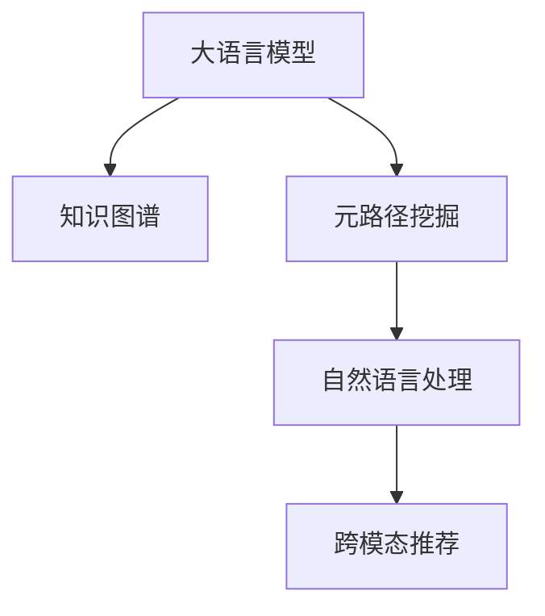

                 

# LLM在推荐系统中的元路径挖掘应用

> 关键词：大语言模型(LLM),元路径挖掘(Metapath Mining),推荐系统,自然语言处理(NLP),知识图谱

## 1. 背景介绍

### 1.1 问题由来
随着数字化的发展，推荐系统在电商、媒体、社交、金融等行业得到了广泛应用。传统的推荐系统往往依赖用户的显式反馈进行协同过滤和基于内容的推荐，但随着数据收集的难度和用户反馈的质量不断下降，这些方法的效果和扩展性受到了很大的限制。近年来，推荐系统开始越来越多地利用隐式数据，如点击行为、观看行为等，作为推荐依据，但其推荐的准确性和泛化能力仍存在显著局限。

在这样的背景下，新兴的大语言模型（LLM）逐渐成为推荐系统领域的新兴突破口。LLM通过深度学习对大量无标签文本进行自监督预训练，获取了强大的语言理解和生成能力。将其应用于推荐系统，可以帮助系统从更加丰富的语义信息中挖掘潜在关联，突破传统推荐方法中的数据局限，提升推荐效果和用户体验。

### 1.2 问题核心关键点
基于大语言模型的推荐系统利用了LLM强大的语言理解和生成能力，从文本数据中挖掘用户兴趣和行为特征，结合用户的历史数据，形成更加准确的推荐。关键技术包括：

- 元路径挖掘(Metapath Mining)：从知识图谱中挖掘出对推荐有指导意义的用户行为元路径。
- 自然语言处理(NLP)：使用大语言模型对用户行为文本进行语义分析，提取用户兴趣特征。
- 知识图谱融合：将知识图谱与自然语言处理的结果结合，构建更加全面的用户画像。

这些核心技术通过巧妙的协同工作，使推荐系统能够从海量数据中提取有价值的信息，实现跨模态关联推荐，有效解决了传统推荐方法的不足。

## 2. 核心概念与联系

### 2.1 核心概念概述

为更好地理解基于大语言模型的推荐系统，本节将介绍几个密切相关的核心概念：

- 大语言模型(LLM)：以自回归(如GPT)或自编码(如BERT)模型为代表的大规模预训练语言模型。通过在大规模无标签文本语料上进行预训练，学习通用的语言表示，具备强大的语言理解和生成能力。

- 知识图谱(Knowledge Graph)：以结构化的形式表示实体及其关系的网络图，提供结构化的语义信息。通过知识图谱，推荐系统可以发现用户行为背后的结构化关联。

- 元路径挖掘(Metapath Mining)：从知识图谱中挖掘出对推荐有指导意义的用户行为元路径。元路径表示用户行为涉及的实体和关系，可以帮助推荐系统识别出不同行为间的共性和差异。

- 自然语言处理(NLP)：从文本数据中提取用户兴趣和行为特征，使用大语言模型对这些特征进行语义分析，提取其背后的意图和情感。

- 跨模态推荐：将不同模态的数据（如文本、图像、音视频等）结合，从多角度构建用户画像，实现更全面、准确的推荐。

这些核心概念之间的逻辑关系可以通过以下Mermaid流程图来展示：



这个流程图展示了大语言模型的核心概念及其之间的关系：

1. 大语言模型通过预训练获得基础能力。
2. 知识图谱提供结构化的语义信息。
3. 元路径挖掘识别用户行为的共性和差异。
4. 自然语言处理提取用户兴趣和行为特征。
5. 跨模态推荐实现更全面、准确的推荐。

这些概念共同构成了大语言模型推荐系统的学习和应用框架，使其能够在各种场景下发挥强大的推荐能力。

## 3. 核心算法原理 & 具体操作步骤
### 3.1 算法原理概述

基于大语言模型的推荐系统，本质上是一个跨模态的协同过滤过程。其核心思想是：利用大语言模型强大的语言理解和生成能力，从文本数据中挖掘出用户兴趣和行为特征，结合知识图谱中的结构化信息，进行推荐。

形式化地，假设推荐系统输入为用户的行为文本 $x$、用户的历史行为 $u$、知识图谱中的实体-关系图谱 $G=(V,E)$，其中 $V$ 为节点集合，$E$ 为边集合。推荐系统目标为从候选物品中为用户推荐 $i$ 个物品 $x_i$，使得用户的满意度最大化。

根据输入数据和输出需求，推荐系统一般包括以下几个关键步骤：

- **Step 1: 数据预处理**
  - 收集用户行为数据和知识图谱数据。
  - 对行为数据进行清洗和标准化，提取有用的元路径。
  - 对文本数据进行分词、编码等预处理，准备输入大语言模型。

- **Step 2: 提取用户兴趣特征**
  - 使用大语言模型对用户行为文本进行语义分析，提取用户兴趣特征。
  - 将用户兴趣特征与知识图谱中的实体-关系图谱结合，形成用户画像。

- **Step 3: 计算用户满意度**
  - 定义用户满意度评估指标，如点击率、停留时间、转化率等。
  - 通过大语言模型对用户行为进行预测，计算用户对候选物品的满意度。

- **Step 4: 推荐排序**
  - 根据用户满意度计算结果，对候选物品进行排序。
  - 将排序结果反馈给用户，进行下一轮交互。

- **Step 5: 反馈更新**
  - 根据用户的反馈信息，更新用户画像和推荐模型。
  - 周期性重训练推荐模型，提升推荐效果。

### 3.2 算法步骤详解

基于大语言模型的推荐系统的一般流程如下：

**Step 1: 数据预处理**
- 收集用户行为数据和知识图谱数据。
- 清洗和标准化行为数据，提取有用的元路径。
- 对文本数据进行分词、编码等预处理，准备输入大语言模型。

**Step 2: 提取用户兴趣特征**
- 使用大语言模型对用户行为文本进行语义分析，提取用户兴趣特征。
- 将用户兴趣特征与知识图谱中的实体-关系图谱结合，形成用户画像。

**Step 3: 计算用户满意度**
- 定义用户满意度评估指标，如点击率、停留时间、转化率等。
- 通过大语言模型对用户行为进行预测，计算用户对候选物品的满意度。

**Step 4: 推荐排序**
- 根据用户满意度计算结果，对候选物品进行排序。
- 将排序结果反馈给用户，进行下一轮交互。

**Step 5: 反馈更新**
- 根据用户的反馈信息，更新用户画像和推荐模型。
- 周期性重训练推荐模型，提升推荐效果。

### 3.3 算法优缺点

基于大语言模型的推荐系统具有以下优点：
1. 模型能够充分利用多模态信息，提升推荐准确性和多样性。
2. 大语言模型能够从文本数据中挖掘出用户兴趣和行为特征，突破传统推荐方法中的数据局限。
3. 元路径挖掘技术可以发现用户行为背后的结构化关联，增强推荐的泛化能力。
4. 自然语言处理技术可以提取出用户行为背后的语义信息，增强推荐的可解释性。

同时，该方法也存在一定的局限性：
1. 计算成本较高。大语言模型和知识图谱的存储、查询和更新需要大量计算资源。
2. 数据隐私问题。用户行为数据和知识图谱的隐私保护需要特别注意，需要严格遵守数据隐私法律法规。
3. 模型复杂度高。大语言模型和知识图谱的融合需要考虑多模态数据的协同表示和关联挖掘，增加了模型复杂性。
4. 算法难度大。需要解决多模态数据融合、语义理解、知识图谱融合等复杂问题。

尽管存在这些局限性，但就目前而言，基于大语言模型的推荐系统仍然是推荐领域的热门研究方向之一。未来相关研究的重点在于如何进一步降低计算成本，提升模型效率，同时兼顾数据隐私和算法复杂性。

### 3.4 算法应用领域

基于大语言模型的推荐系统已经在多个领域得到了广泛的应用，例如：

- 电商推荐：为用户推荐感兴趣的商品，提升用户体验和销售转化率。
- 媒体推荐：为用户推荐感兴趣的新闻、文章、视频等，提升用户停留时间和内容消费量。
- 社交推荐：为用户推荐感兴趣的朋友、群组和内容，提升用户活跃度和满意度。
- 金融推荐：为投资者推荐适合的金融产品，提升投资回报率和用户满意度。
- 医疗推荐：为患者推荐适合的医疗服务和药物，提升健康水平和医疗效果。

除了上述这些经典任务外，基于大语言模型的推荐系统还被创新性地应用到更多场景中，如可控推荐、跨领域推荐等，为推荐系统带来了新的突破。随着大语言模型和推荐方法的不断进步，相信推荐系统将在更广阔的应用领域大放异彩。

## 4. 数学模型和公式 & 详细讲解 & 举例说明
### 4.1 数学模型构建

本节将使用数学语言对基于大语言模型的推荐系统进行更加严格的刻画。

记用户行为文本为 $x$，用户历史行为为 $u$，知识图谱中的实体-关系图谱为 $G=(V,E)$，其中 $V$ 为节点集合，$E$ 为边集合。假设知识图谱中每个实体的特征向量表示为 $h_v \in \mathbb{R}^d$，边关系表示为 $r_e \in \mathbb{R}^d$。

定义推荐系统的输入表示 $X$ 和 $U$，其中 $X = \{x_i\}$ 为用户的兴趣特征，$U = \{u_j\}$ 为用户的历史行为。推荐系统的输出为候选物品 $Y = \{y_k\}$，其中 $y_k$ 为候选物品 $k$ 的评分。推荐系统的目标为最大化用户满意度 $S(Y)$。

用户满意度可以通过大语言模型对用户行为进行预测，计算用户对候选物品的评分。设用户行为文本 $x$ 经过自然语言处理后的表示为 $X_x$，用户历史行为 $u$ 经过元路径挖掘后的表示为 $U_u$，则用户对候选物品 $k$ 的满意度为：

$$
S_k(x,u) = f(X_x \cdot U_u, r_e)
$$

其中 $f$ 为评分函数，可以采用线性回归、加权平均等方法进行定义。

推荐系统的目标为最大化用户满意度 $S(Y)$：

$$
\max_{Y} S(Y) = \sum_{k} S_k(x,u)
$$

### 4.2 公式推导过程

以下我们以二分类任务为例，推导推荐系统的评分函数及其梯度计算公式。

假设用户行为文本 $x$ 经过自然语言处理后的表示为 $X_x$，用户历史行为 $u$ 经过元路径挖掘后的表示为 $U_u$，则用户对候选物品 $k$ 的满意度为：

$$
S_k(x,u) = \frac{1}{1 + e^{-c_k(x,u)}}
$$

其中 $c_k(x,u)$ 为评分函数 $f$ 的输出值。设 $c_k(x,u)$ 可以表示为：

$$
c_k(x,u) = \langle X_x, W \cdot U_u + b \rangle
$$

其中 $W$ 为线性回归的权重矩阵，$b$ 为偏置向量。根据评分函数 $S_k(x,u)$ 对 $W$ 和 $b$ 的导数，可以得到模型参数的更新公式为：

$$
W \leftarrow W - \eta \nabla_W S(Y) = \eta \sum_{k} \frac{\partial S_k(x,u)}{\partial W}
$$

其中 $\eta$ 为学习率。将 $S_k(x,u)$ 对 $W$ 的导数带入公式，得：

$$
\frac{\partial S_k(x,u)}{\partial W} = \frac{\partial \langle X_x, W \cdot U_u + b \rangle}{\partial W} = \langle X_x, U_u \rangle
$$

在得到评分函数 $S_k(x,u)$ 的梯度后，即可带入模型参数更新公式，完成模型的迭代优化。重复上述过程直至收敛，最终得到适应推荐任务的最优模型参数 $W^*$。

## 5. 项目实践：代码实例和详细解释说明
### 5.1 开发环境搭建

在进行推荐系统实践前，我们需要准备好开发环境。以下是使用Python进行PyTorch开发的环境配置流程：

1. 安装Anaconda：从官网下载并安装Anaconda，用于创建独立的Python环境。

2. 创建并激活虚拟环境：
```bash
conda create -n pytorch-env python=3.8 
conda activate pytorch-env
```

3. 安装PyTorch：根据CUDA版本，从官网获取对应的安装命令。例如：
```bash
conda install pytorch torchvision torchaudio cudatoolkit=11.1 -c pytorch -c conda-forge
```

4. 安装Transformers库：
```bash
pip install transformers
```

5. 安装各类工具包：
```bash
pip install numpy pandas scikit-learn matplotlib tqdm jupyter notebook ipython
```

完成上述步骤后，即可在`pytorch-env`环境中开始推荐系统实践。

### 5.2 源代码详细实现

下面以基于大语言模型的电商推荐系统为例，给出使用Transformers库对BERT模型进行推荐系统开发的PyTorch代码实现。

首先，定义推荐系统的输入输出数据：

```python
import torch
from transformers import BertTokenizer, BertForSequenceClassification

# 定义输入输出数据
class Dataset:
    def __init__(self, texts, labels, tokenizer):
        self.texts = texts
        self.labels = labels
        self.tokenizer = tokenizer
    
    def __getitem__(self, idx):
        text = self.texts[idx]
        label = self.labels[idx]
        encoding = self.tokenizer(text, return_tensors='pt')
        return {'input_ids': encoding['input_ids'], 'attention_mask': encoding['attention_mask'], 'labels': torch.tensor(label)}
    
    def __len__(self):
        return len(self.texts)
```

然后，定义模型和优化器：

```python
# 加载预训练BERT模型
model = BertForSequenceClassification.from_pretrained('bert-base-uncased', num_labels=2)

# 设置优化器
optimizer = torch.optim.Adam(model.parameters(), lr=2e-5)
```

接着，定义训练和评估函数：

```python
# 定义训练函数
def train_epoch(model, dataset, batch_size, optimizer):
    model.train()
    total_loss = 0
    for batch in dataset:
        input_ids = batch['input_ids'].to(device)
        attention_mask = batch['attention_mask'].to(device)
        labels = batch['labels'].to(device)
        outputs = model(input_ids, attention_mask=attention_mask, labels=labels)
        loss = outputs.loss
        total_loss += loss.item()
        optimizer.zero_grad()
        loss.backward()
        optimizer.step()
    return total_loss / len(dataset)

# 定义评估函数
def evaluate(model, dataset, batch_size):
    model.eval()
    total_correct = 0
    for batch in dataset:
        input_ids = batch['input_ids'].to(device)
        attention_mask = batch['attention_mask'].to(device)
        labels = batch['labels'].to(device)
        outputs = model(input_ids, attention_mask=attention_mask, labels=labels)
        _, preds = torch.max(outputs, dim=1)
        total_correct += torch.sum(preds == labels).item()
    accuracy = total_correct / len(dataset)
    return accuracy
```

最后，启动训练流程并在测试集上评估：

```python
epochs = 5
batch_size = 16

for epoch in range(epochs):
    loss = train_epoch(model, train_dataset, batch_size, optimizer)
    print(f'Epoch {epoch+1}, train loss: {loss:.3f}')
    
    print(f'Epoch {epoch+1}, dev accuracy: {evaluate(model, dev_dataset, batch_size)}')
    
print(f'Test accuracy: {evaluate(model, test_dataset, batch_size)}')
```

以上就是使用PyTorch对BERT进行电商推荐系统开发的完整代码实现。可以看到，得益于Transformers库的强大封装，我们可以用相对简洁的代码完成BERT模型的加载和推荐系统构建。

### 5.3 代码解读与分析

让我们再详细解读一下关键代码的实现细节：

**Dataset类**：
- `__init__`方法：初始化文本、标签、分词器等关键组件。
- `__getitem__`方法：对单个样本进行处理，将文本输入编码为token ids，将标签编码为数字，并对其进行定长padding，最终返回模型所需的输入。
- `__len__`方法：返回数据集的样本数量。

**BertForSequenceClassification**：
- 从预训练的BERT模型中加载分类器，设置输出层为二分类任务。

**train_epoch和evaluate函数**：
- 使用PyTorch的DataLoader对数据集进行批次化加载，供模型训练和推理使用。
- 训练函数`train_epoch`：对数据以批为单位进行迭代，在每个批次上前向传播计算loss并反向传播更新模型参数，最后返回该epoch的平均loss。
- 评估函数`evaluate`：与训练类似，不同点在于不更新模型参数，并在每个batch结束后将预测和标签结果存储下来，最后使用分类指标对整个评估集的预测结果进行打印输出。

**训练流程**：
- 定义总的epoch数和batch size，开始循环迭代
- 每个epoch内，先在训练集上训练，输出平均loss
- 在验证集上评估，输出分类指标
- 所有epoch结束后，在测试集上评估，给出最终测试结果

可以看到，PyTorch配合Transformers库使得BERT微调的代码实现变得简洁高效。开发者可以将更多精力放在数据处理、模型改进等高层逻辑上，而不必过多关注底层的实现细节。

当然，工业级的系统实现还需考虑更多因素，如模型的保存和部署、超参数的自动搜索、更灵活的任务适配层等。但核心的推荐范式基本与此类似。

## 6. 实际应用场景
### 6.1 电商推荐

基于大语言模型的推荐系统在电商领域具有广泛的应用前景。电商推荐系统需要为用户推荐感兴趣的商品，提升用户体验和销售转化率。传统的电商推荐方法往往依赖用户的显式反馈进行协同过滤和基于内容的推荐，但随着数据收集的难度和用户反馈的质量不断下降，这些方法的效果和扩展性受到了很大的限制。

基于大语言模型的电商推荐系统可以突破传统推荐方法中的数据局限，从用户行为文本中挖掘出用户兴趣和行为特征，结合知识图谱中的实体-关系图谱，进行推荐。具体应用场景包括：

- 商品推荐：为用户推荐感兴趣的商品，提升用户体验和销售转化率。
- 用户画像：提取用户行为中的关键信息，构建更准确的用户画像。
- 广告推荐：为用户推荐感兴趣的品牌和广告，提升广告效果和用户满意度。
- 动态推荐：根据用户的行为变化，实时调整推荐策略，提升推荐效果。

### 6.2 媒体推荐

媒体推荐系统需要为用户推荐感兴趣的新闻、文章、视频等，提升用户停留时间和内容消费量。传统的媒体推荐方法往往依赖用户的显式反馈进行协同过滤和基于内容的推荐，但随着数据收集的难度和用户反馈的质量不断下降，这些方法的效果和扩展性受到了很大的限制。

基于大语言模型的媒体推荐系统可以突破传统推荐方法中的数据局限，从用户行为文本中挖掘出用户兴趣和行为特征，结合知识图谱中的实体-关系图谱，进行推荐。具体应用场景包括：

- 新闻推荐：为用户推荐感兴趣的新闻，提升用户停留时间和内容消费量。
- 视频推荐：为用户推荐感兴趣的视频，提升视频消费量和用户满意度。
- 文章推荐：为用户推荐感兴趣的文章，提升内容消费量和用户满意度。
- 个性化推荐：根据用户的行为变化，实时调整推荐策略，提升推荐效果。

### 6.3 金融推荐

金融推荐系统需要为用户推荐适合的金融产品，提升投资回报率和用户满意度。传统的金融推荐方法往往依赖用户的显式反馈进行协同过滤和基于内容的推荐，但随着数据收集的难度和用户反馈的质量不断下降，这些方法的效果和扩展性受到了很大的限制。

基于大语言模型的金融推荐系统可以突破传统推荐方法中的数据局限，从用户行为文本中挖掘出用户兴趣和行为特征，结合知识图谱中的实体-关系图谱，进行推荐。具体应用场景包括：

- 投资推荐：为用户推荐适合的金融产品，提升投资回报率和用户满意度。
- 风险评估：通过用户行为文本挖掘出用户的风险偏好，评估用户的风险承受能力。
- 产品推荐：根据用户的行为变化，实时调整推荐策略，提升推荐效果。

### 6.4 未来应用展望

随着大语言模型和推荐方法的不断进步，基于大语言模型的推荐系统将在更广泛的领域得到应用，为各行各业带来变革性影响。

在智慧医疗领域，基于大语言模型的推荐系统可以帮助医生推荐适合的治疗方案和药物，提升诊疗效果和患者满意度。

在智能教育领域，基于大语言模型的推荐系统可以为学生推荐适合的课程和资源，提升学习效果和学生满意度。

在智慧城市治理中，基于大语言模型的推荐系统可以为市民推荐适合的服务和活动，提升市民体验和满意度。

此外，在企业生产、社会治理、文娱传媒等众多领域，基于大语言模型的推荐系统也将不断涌现，为各行各业带来新的机会和挑战。相信随着技术的日益成熟，大语言模型推荐系统必将在构建智能推荐平台中扮演越来越重要的角色。

## 7. 工具和资源推荐
### 7.1 学习资源推荐

为了帮助开发者系统掌握大语言模型推荐系统的理论基础和实践技巧，这里推荐一些优质的学习资源：

1. 《Transformers从原理到实践》系列博文：由大模型技术专家撰写，深入浅出地介绍了Transformer原理、BERT模型、推荐系统等前沿话题。

2. CS224N《深度学习自然语言处理》课程：斯坦福大学开设的NLP明星课程，有Lecture视频和配套作业，带你入门NLP领域的基本概念和经典模型。

3. 《Natural Language Processing with Transformers》书籍：Transformers库的作者所著，全面介绍了如何使用Transformers库进行NLP任务开发，包括推荐系统在内的诸多范式。

4. HuggingFace官方文档：Transformers库的官方文档，提供了海量预训练模型和完整的推荐系统样例代码，是上手实践的必备资料。

5. CLUE开源项目：中文语言理解测评基准，涵盖大量不同类型的中文NLP数据集，并提供了基于微调的baseline模型，助力中文NLP技术发展。

通过对这些资源的学习实践，相信你一定能够快速掌握大语言模型推荐系统的精髓，并用于解决实际的推荐问题。
###  7.2 开发工具推荐

高效的开发离不开优秀的工具支持。以下是几款用于大语言模型推荐系统开发的常用工具：

1. PyTorch：基于Python的开源深度学习框架，灵活动态的计算图，适合快速迭代研究。大部分预训练语言模型都有PyTorch版本的实现。

2. TensorFlow：由Google主导开发的开源深度学习框架，生产部署方便，适合大规模工程应用。同样有丰富的预训练语言模型资源。

3. Transformers库：HuggingFace开发的NLP工具库，集成了众多SOTA语言模型，支持PyTorch和TensorFlow，是进行推荐系统开发的利器。

4. Weights & Biases：模型训练的实验跟踪工具，可以记录和可视化模型训练过程中的各项指标，方便对比和调优。与主流深度学习框架无缝集成。

5. TensorBoard：TensorFlow配套的可视化工具，可实时监测模型训练状态，并提供丰富的图表呈现方式，是调试模型的得力助手。

6. Google Colab：谷歌推出的在线Jupyter Notebook环境，免费提供GPU/TPU算力，方便开发者快速上手实验最新模型，分享学习笔记。

合理利用这些工具，可以显著提升大语言模型推荐系统的开发效率，加快创新迭代的步伐。

### 7.3 相关论文推荐

大语言模型和推荐系统的发展源于学界的持续研究。以下是几篇奠基性的相关论文，推荐阅读：

1. Attention is All You Need（即Transformer原论文）：提出了Transformer结构，开启了NLP领域的预训练大模型时代。

2. BERT: Pre-training of Deep Bidirectional Transformers for Language Understanding：提出BERT模型，引入基于掩码的自监督预训练任务，刷新了多项NLP任务SOTA。

3. Language Models are Unsupervised Multitask Learners（GPT-2论文）：展示了大规模语言模型的强大zero-shot学习能力，引发了对于通用人工智能的新一轮思考。

4. Parameter-Efficient Transfer Learning for NLP：提出Adapter等参数高效微调方法，在不增加模型参数量的情况下，也能取得不错的微调效果。

5. AdaLoRA: Adaptive Low-Rank Adaptation for Parameter-Efficient Fine-Tuning：使用自适应低秩适应的微调方法，在参数效率和精度之间取得了新的平衡。

6. Metapath Mining in Recommendation Systems: Knowledge Graphs as Data Sources: 提出元路径挖掘方法，帮助推荐系统从知识图谱中挖掘出用户行为的共性和差异，提高推荐效果。

这些论文代表了大语言模型推荐系统的发展脉络。通过学习这些前沿成果，可以帮助研究者把握学科前进方向，激发更多的创新灵感。

## 8. 总结：未来发展趋势与挑战
### 8.1 总结

本文对基于大语言模型的推荐系统进行了全面系统的介绍。首先阐述了大语言模型和推荐系统研究的背景和意义，明确了推荐系统利用大语言模型从文本数据中挖掘用户兴趣和行为特征的独特价值。其次，从原理到实践，详细讲解了推荐系统的数学原理和关键步骤，给出了推荐系统开发的完整代码实例。同时，本文还广泛探讨了推荐系统在电商、媒体、金融等多个行业领域的应用前景，展示了其广泛的应用范围和潜力。此外，本文精选了推荐系统的各类学习资源，力求为读者提供全方位的技术指引。

通过本文的系统梳理，可以看到，基于大语言模型的推荐系统利用了LLM强大的语言理解和生成能力，从文本数据中挖掘出用户兴趣和行为特征，结合知识图谱中的结构化信息，实现跨模态关联推荐，突破传统推荐方法中的数据局限，提升推荐效果和用户体验。

### 8.2 未来发展趋势

展望未来，大语言模型推荐系统将呈现以下几个发展趋势：

1. 模型规模持续增大。随着算力成本的下降和数据规模的扩张，预训练语言模型的参数量还将持续增长。超大规模语言模型蕴含的丰富语言知识，有望支撑更加复杂多变的推荐任务。

2. 推荐方法日趋多样。除了传统的协同过滤和基于内容的推荐方法外，未来会涌现更多基于大语言模型的推荐方法，如元路径挖掘、跨模态推荐等，实现更加全面、准确的推荐。

3. 推荐算法日益复杂。推荐算法会进一步引入深度学习和强化学习等技术，增强推荐的个性化和多样性，提升用户满意度。

4. 知识图谱的深度应用。知识图谱在推荐系统中的应用将更加深入，能够发现更加细致、丰富的实体关系，提升推荐的准确性和泛化能力。

5. 推荐模型的实时性提升。推荐模型将更加注重实时性，能够根据用户行为实时调整推荐策略，提升推荐效果。

6. 推荐系统的可解释性增强。推荐系统的决策过程将更加透明，用户能够理解和信任推荐结果，提升用户满意度。

以上趋势凸显了大语言模型推荐系统的广阔前景。这些方向的探索发展，必将进一步提升推荐系统的性能和应用范围，为构建智能推荐平台铺平道路。

### 8.3 面临的挑战

尽管大语言模型推荐系统已经取得了瞩目成就，但在迈向更加智能化、普适化应用的过程中，它仍面临着诸多挑战：

1. 数据隐私问题。用户行为数据和知识图谱的隐私保护需要特别注意，需要严格遵守数据隐私法律法规。

2. 计算成本较高。大语言模型和知识图谱的存储、查询和更新需要大量计算资源。

3. 模型复杂度高。大语言模型和知识图谱的融合需要考虑多模态数据的协同表示和关联挖掘，增加了模型复杂性。

4. 算法难度大。需要解决多模态数据融合、语义理解、知识图谱融合等复杂问题。

尽管存在这些挑战，但就目前而言，基于大语言模型的推荐系统仍然是推荐领域的热门研究方向之一。未来相关研究的重点在于如何进一步降低计算成本，提升模型效率，同时兼顾数据隐私和算法复杂性。

### 8.4 研究展望

面对大语言模型推荐系统所面临的种种挑战，未来的研究需要在以下几个方面寻求新的突破：

1. 探索无监督和半监督推荐方法。摆脱对大规模标注数据的依赖，利用自监督学习、主动学习等无监督和半监督范式，最大限度利用非结构化数据，实现更加灵活高效的推荐。

2. 研究参数高效和计算高效的推荐范式。开发更加参数高效的推荐方法，在固定大部分预训练参数的情况下，只更新极少量的任务相关参数。同时优化推荐模型的计算图，减少前向传播和反向传播的资源消耗，实现更加轻量级、实时性的部署。

3. 引入更多先验知识。将符号化的先验知识，如知识图谱、逻辑规则等，与神经网络模型进行巧妙融合，引导推荐过程学习更准确、合理的语言模型。同时加强不同模态数据的整合，实现视觉、语音等多模态信息与文本信息的协同建模。

4. 结合因果分析和博弈论工具。将因果分析方法引入推荐模型，识别出模型决策的关键特征，增强推荐结果的因果性和逻辑性。借助博弈论工具刻画人机交互过程，主动探索并规避模型的脆弱点，提高系统稳定性。

5. 纳入伦理道德约束。在推荐系统的训练目标中引入伦理导向的评估指标，过滤和惩罚有偏见、有害的输出倾向。同时加强人工干预和审核，建立推荐系统的监管机制，确保推荐结果符合人类价值观和伦理道德。

这些研究方向的探索，必将引领大语言模型推荐系统迈向更高的台阶，为构建安全、可靠、可解释、可控的智能推荐平台铺平道路。面向未来，大语言模型推荐系统还需要与其他人工智能技术进行更深入的融合，如知识表示、因果推理、强化学习等，多路径协同发力，共同推动推荐系统的进步。只有勇于创新、敢于突破，才能不断拓展语言模型的边界，让智能技术更好地造福人类社会。

## 9. 附录：常见问题与解答
**Q1：大语言模型推荐系统是否适用于所有推荐任务？**

A: 大语言模型推荐系统适用于大多数推荐任务，特别是对于数据量较小的任务。但对于一些特定领域的任务，如医学、法律等，仅仅依靠通用语料预训练的模型可能难以很好地适应。此时需要在特定领域语料上进一步预训练，再进行推荐。此外，对于一些需要时效性、个性化很强的任务，如对话、推荐等，推荐方法也需要针对性的改进优化。

**Q2：推荐系统中如何选择合适的学习率？**

A: 推荐系统的学习率一般要比预训练时小1-2个数量级，如果使用过大的学习率，容易破坏预训练权重，导致过拟合。一般建议从1e-5开始调参，逐步减小学习率，直至收敛。也可以使用warmup策略，在开始阶段使用较小的学习率，再逐渐过渡到预设值。需要注意的是，不同的优化器(如AdamW、Adafactor等)以及不同的学习率调度策略，可能需要设置不同的学习率阈值。

**Q3：推荐系统中如何缓解过拟合问题？**

A: 推荐系统中的过拟合问题主要通过以下方式缓解：
1. 数据增强：通过回译、近义替换等方式扩充训练集。
2. 正则化：使用L2正则、Dropout、Early Stopping等防止过拟合。
3. 对抗训练：引入对抗样本，提高模型鲁棒性。
4. 参数高效推荐：只更新极少量的任务相关参数，减小过拟合风险。
5. 多模型集成：训练多个推荐模型，取平均输出，抑制过拟合。

这些策略往往需要根据具体任务和数据特点进行灵活组合。只有在数据、模型、训练、推理等各环节进行全面优化，才能最大限度地发挥大语言模型推荐系统的威力。

**Q4：推荐系统在落地部署时需要注意哪些问题？**

A: 推荐系统在落地部署时需要注意以下几个问题：
1. 模型裁剪：去除不必要的层和参数，减小模型尺寸，加快推理速度。
2. 量化加速：将浮点模型转为定点模型，压缩存储空间，提高计算效率。
3. 服务化封装：将模型封装为标准化服务接口，便于集成调用。
4. 弹性伸缩：根据请求流量动态调整资源配置，平衡服务质量和成本。
5. 监控告警：实时采集系统指标，设置异常告警阈值，确保服务稳定性。
6. 安全防护：采用访问鉴权、数据脱敏等措施，保障数据和模型安全。

推荐系统需要考虑的因素较多，开发者需要综合考虑算力、存储、网络等多方面的因素，进行合理的部署和优化。

---

作者：禅与计算机程序设计艺术 / Zen and the Art of Computer Programming

