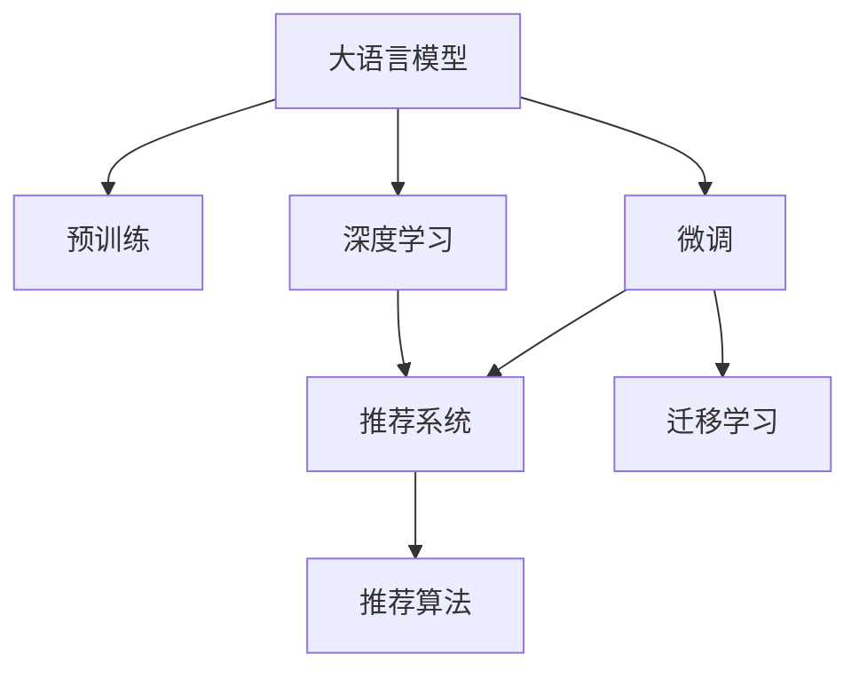

                 

# LLM在推荐系统中的实验结论

## 1. 背景介绍

### 1.1 问题由来

随着互联网的高速发展，推荐系统（Recommendation System, RS）成为各大平台获取用户价值的重要手段。传统的推荐系统依赖于用户历史行为数据，无法充分挖掘用户潜在需求。而基于大语言模型（Large Language Model, LLM）的推荐系统，通过理解自然语言描述，能够捕捉用户长尾需求，有望大幅提升推荐效果。

### 1.2 问题核心关键点

目前，大语言模型在推荐系统中的应用主要集中在以下几个方面：

1. 用户画像生成：通过解析用户描述、兴趣点、评论等自然语言文本，生成详尽的用户画像，用于理解用户需求和偏好。
2. 物品特征抽取：利用LSTM、BERT等语言模型，对商品描述、标签、评价等文本信息进行语义分析，提取物品的特征。
3. 用户-物品关联推荐：结合用户画像和物品特征，通过神经网络模型预测用户对物品的兴趣程度，进行推荐排序。

尽管LLM在推荐系统中的应用前景广阔，但其模型训练和应用中仍面临诸多挑战：

- 数据量巨大：需要大量高质量的用户行为和物品描述数据进行预训练。
- 训练时间耗时：大模型训练成本高、时间久。
- 泛化能力不足：模型在特定领域的泛化能力有限。
- 实时性要求高：推荐系统对推荐结果的实时性要求高，传统大模型难以满足。

本文将对基于大语言模型的推荐系统进行详细的实验分析，评估其性能，探讨其未来的发展方向，为相关研究提供参考。

## 2. 核心概念与联系

### 2.1 核心概念概述

为更好地理解基于LMM的推荐系统，本节将介绍几个核心概念及其相互联系：

- **大语言模型（Large Language Model, LLM）**：以自回归或自编码模型为代表的大规模预训练语言模型，通过在海量文本数据上进行预训练，学习语言的通用表示。
- **预训练（Pre-training）**：指在大规模无标签文本语料上，通过自监督学习任务训练通用语言模型的过程。常见的预训练任务包括言语建模、掩码语言模型等。
- **微调（Fine-tuning）**：指在预训练模型的基础上，使用特定领域的数据，通过有监督学习优化模型在该领域上的性能。
- **迁移学习（Transfer Learning）**：指将一个领域学习到的知识，迁移应用到另一个不同但相关的领域的学习范式。大模型的预训练-微调过程即是一种典型的迁移学习方式。
- **推荐系统（Recommendation System, RS）**：通过分析用户历史行为和物品特征，推荐用户可能感兴趣的物品的系统。
- **深度学习（Deep Learning）**：一种机器学习技术，通过多层神经网络模型进行复杂特征的提取和处理，特别适用于处理大规模高维数据。

这些核心概念之间通过以下Mermaid流程图展示：



这个流程图展示了大语言模型与推荐系统之间的关系：

1. 大语言模型通过预训练获得基础能力。
2. 微调优化模型在特定领域的表现，以适应推荐系统的需求。
3. 迁移学习将预训练知识应用到推荐系统中，提升推荐效果。
4. 深度学习与推荐系统结合，构建复杂推荐模型。
5. 推荐算法根据用户行为和物品特征，生成推荐结果。

## 3. 核心算法原理 & 具体操作步骤
### 3.1 算法原理概述

基于LMM的推荐系统，其核心思想是通过自然语言处理技术，构建用户和物品的语义表示，从而进行推荐。具体来说，LMM首先在大规模无标签文本数据上进行预训练，学习语言的通用表示。然后，通过微调优化模型在特定领域的表现，使其能够更好地理解和预测用户行为。最后，利用优化后的LMM模型，结合推荐算法，生成个性化的推荐结果。

形式化地，假设LMM模型为 $M_{\theta}$，其中 $\theta$ 为模型参数。用户 $u$ 的描述为 $d_u$，物品 $i$ 的描述为 $d_i$，推荐系统通过模型 $M_{\theta}$ 预测用户对物品的兴趣程度，生成推荐结果 $r_{ui}$，即：

$$
r_{ui} = M_{\theta}(d_u, d_i)
$$

微调过程中，通过优化损失函数 $\mathcal{L}$，使得模型预测结果逼近真实标签，即：

$$
\theta^* = \mathop{\arg\min}_{\theta} \mathcal{L}(M_{\theta}, \{(d_u, d_i, y_{ui})\})
$$

其中 $\{(d_u, d_i, y_{ui})\}$ 为微调数据集，包含用户描述、物品描述和用户对物品的兴趣标签。

### 3.2 算法步骤详解

基于LMM的推荐系统通常包含以下步骤：

**Step 1: 准备预训练模型和数据集**
- 选择合适的LMM模型作为初始化参数，如BERT、GPT等。
- 收集用户行为数据和物品描述文本数据，划分为训练集、验证集和测试集。

**Step 2: 用户画像生成**
- 对用户描述文本进行分词、编码等预处理。
- 使用预训练LMM模型，如BERT，对用户描述进行编码，生成用户语义表示。

**Step 3: 物品特征抽取**
- 对物品描述文本进行分词、编码等预处理。
- 使用预训练LMM模型，如BERT，对物品描述进行编码，生成物品语义表示。

**Step 4: 用户-物品关联推荐**
- 将用户和物品的语义表示输入到推荐模型中，预测用户对物品的兴趣程度。
- 根据兴趣程度进行排序，生成推荐列表。

**Step 5: 测试和部署**
- 在测试集上评估推荐系统的性能，对比预训练-微调前后的效果。
- 使用优化后的推荐系统对新用户和新物品进行推荐。

### 3.3 算法优缺点

基于LMM的推荐系统具有以下优点：

- 用户画像丰富：通过LMM对用户描述进行语义分析，生成详尽的用户画像。
- 物品特征全面：利用LMM对物品描述进行语义分析，抽取全面的物品特征。
- 推荐效果优异：结合用户画像和物品特征，利用LMM预测用户对物品的兴趣，生成精准推荐。

同时，该方法也存在一些局限性：

- 数据需求大：需要大量的用户行为和物品描述数据进行预训练和微调。
- 训练成本高：大模型的预训练和微调成本高、时间久。
- 泛化能力有限：模型在特定领域的泛化能力有限，难以处理长尾需求。
- 实时性不足：传统LMM模型难以满足推荐系统的实时性要求。

尽管存在这些局限性，但LMM在推荐系统中的应用已经取得了显著效果，成为推荐系统研究的重要方向。

### 3.4 算法应用领域

LMM在推荐系统中的应用主要集中在以下几个领域：

- 电商推荐：通过用户购物行为和商品描述，利用LMM生成推荐结果，提升用户购物体验。
- 内容推荐：利用用户对文章的评论、点赞等行为，结合文章描述，生成个性化推荐内容。
- 金融产品推荐：通过用户金融行为和产品描述，生成金融产品推荐，提升用户金融服务满意度。
- 教育推荐：结合用户学习行为和课程描述，生成个性化课程推荐，提高学习效率。

此外，LMM在健康、旅游、房产等多个领域也有应用前景，为推荐系统带来了新的思路和可能性。

## 4. 数学模型和公式 & 详细讲解 & 举例说明
### 4.1 数学模型构建

本节将使用数学语言对基于LMM的推荐系统进行更加严格的刻画。

记LMM模型为 $M_{\theta}$，其中 $\theta$ 为模型参数。用户 $u$ 的描述为 $d_u$，物品 $i$ 的描述为 $d_i$。推荐系统通过模型 $M_{\theta}$ 预测用户对物品的兴趣程度，生成推荐结果 $r_{ui}$，即：

$$
r_{ui} = M_{\theta}(d_u, d_i)
$$

微调过程中，通过优化损失函数 $\mathcal{L}$，使得模型预测结果逼近真实标签，即：

$$
\theta^* = \mathop{\arg\min}_{\theta} \mathcal{L}(M_{\theta}, \{(d_u, d_i, y_{ui})\})
$$

其中 $\{(d_u, d_i, y_{ui})\}$ 为微调数据集，包含用户描述、物品描述和用户对物品的兴趣标签。

假设用户 $u$ 对物品 $i$ 的兴趣程度为 $y_{ui}$，推荐系统通过LMM模型生成推荐结果 $r_{ui}$，则损失函数 $\mathcal{L}$ 可以表示为：

$$
\mathcal{L} = \frac{1}{N}\sum_{i=1}^N \ell(r_{ui}, y_{ui})
$$

其中 $N$ 为训练样本数量，$\ell$ 为损失函数，如均方误差（MSE）或交叉熵（CE）。

### 4.2 公式推导过程

以交叉熵损失函数为例，推导其计算公式。假设LMM模型的输出为 $r_{ui}$，用户对物品的兴趣程度为 $y_{ui}$，则交叉熵损失函数为：

$$
\ell(r_{ui}, y_{ui}) = -y_{ui}\log r_{ui} - (1-y_{ui})\log(1-r_{ui})
$$

将其代入经验风险公式，得：

$$
\mathcal{L} = -\frac{1}{N}\sum_{i=1}^N [y_{ui}\log r_{ui} + (1-y_{ui})\log(1-r_{ui})]
$$

根据链式法则，损失函数对参数 $\theta$ 的梯度为：

$$
\frac{\partial \mathcal{L}}{\partial \theta} = -\frac{1}{N}\sum_{i=1}^N \left[\frac{y_{ui}}{r_{ui}}-\frac{1-y_{ui}}{1-r_{ui}}\right] \frac{\partial M_{\theta}(d_u, d_i)}{\partial \theta}
$$

其中 $\frac{\partial M_{\theta}(d_u, d_i)}{\partial \theta}$ 为LMM模型对输入的偏导数，通过反向传播算法高效计算。

### 4.3 案例分析与讲解

以下是一个具体的推荐系统案例，用于展示LMM的实际应用：

假设电商平台的推荐系统需要为用户推荐商品，用户 $u$ 对物品 $i$ 的兴趣程度 $y_{ui}$ 表示为：

- 1表示用户对该物品感兴趣
- 0表示用户对该物品不感兴趣

用户描述为 $d_u$，物品描述为 $d_i$，LMM模型通过编码器将用户和物品的文本描述转换为向量表示 $h_u$ 和 $h_i$。将 $h_u$ 和 $h_i$ 输入到神经网络模型中，预测用户对物品的兴趣程度 $r_{ui}$。最终，根据 $r_{ui}$ 生成推荐列表，推荐给用户。

假设 $h_u$ 和 $h_i$ 的维度为 $d$，推荐模型为 $M_{\theta}$，其输出为 $r_{ui} = M_{\theta}(h_u, h_i)$，则损失函数可以表示为：

$$
\mathcal{L} = -\frac{1}{N}\sum_{i=1}^N [y_{ui}\log r_{ui} + (1-y_{ui})\log(1-r_{ui})]
$$

对损失函数求偏导，得到：

$$
\frac{\partial \mathcal{L}}{\partial \theta} = -\frac{1}{N}\sum_{i=1}^N \left[\frac{y_{ui}}{r_{ui}}-\frac{1-y_{ui}}{1-r_{ui}}\right] \frac{\partial M_{\theta}(h_u, h_i)}{\partial \theta}
$$

其中 $\frac{\partial M_{\theta}(h_u, h_i)}{\partial \theta}$ 为LMM模型对输入的偏导数，通过反向传播算法高效计算。

## 5. 项目实践：代码实例和详细解释说明
### 5.1 开发环境搭建

在进行推荐系统开发前，我们需要准备好开发环境。以下是使用Python进行PyTorch开发的环境配置流程：

1. 安装Anaconda：从官网下载并安装Anaconda，用于创建独立的Python环境。

2. 创建并激活虚拟环境：
```bash
conda create -n pytorch-env python=3.8 
conda activate pytorch-env
```

3. 安装PyTorch：根据CUDA版本，从官网获取对应的安装命令。例如：
```bash
conda install pytorch torchvision torchaudio cudatoolkit=11.1 -c pytorch -c conda-forge
```

4. 安装Transformers库：
```bash
pip install transformers
```

5. 安装各类工具包：
```bash
pip install numpy pandas scikit-learn matplotlib tqdm jupyter notebook ipython
```

完成上述步骤后，即可在`pytorch-env`环境中开始推荐系统实践。

### 5.2 源代码详细实现

这里我们以电商推荐系统为例，给出使用Transformers库对BERT模型进行推荐系统开发的PyTorch代码实现。

首先，定义推荐系统数据处理函数：

```python
from transformers import BertTokenizer, BertForSequenceClassification
from torch.utils.data import Dataset, DataLoader
from torch.nn import BCELoss
import torch

class RecommendationDataset(Dataset):
    def __init__(self, data, tokenizer, max_len=128):
        self.data = data
        self.tokenizer = tokenizer
        self.max_len = max_len
        
    def __len__(self):
        return len(self.data)
    
    def __getitem__(self, item):
        user, item, label = self.data[item]
        
        encoding = self.tokenizer(user, item, return_tensors='pt', max_length=self.max_len, padding='max_length', truncation=True)
        user_input_ids = encoding['input_ids']
        user_attention_mask = encoding['attention_mask']
        item_input_ids = encoding['input_ids']
        item_attention_mask = encoding['attention_mask']
        
        return {
            'user_input_ids': user_input_ids,
            'user_attention_mask': user_attention_mask,
            'item_input_ids': item_input_ids,
            'item_attention_mask': item_attention_mask,
            'label': torch.tensor([label], dtype=torch.long)
        }
```

然后，定义模型和优化器：

```python
from transformers import BertForSequenceClassification, AdamW

model = BertForSequenceClassification.from_pretrained('bert-base-cased', num_labels=2)
optimizer = AdamW(model.parameters(), lr=2e-5)
loss_fn = BCELoss()
```

接着，定义训练和评估函数：

```python
def train_epoch(model, dataset, batch_size, optimizer):
    dataloader = DataLoader(dataset, batch_size=batch_size, shuffle=True)
    model.train()
    epoch_loss = 0
    for batch in dataloader:
        user_input_ids = batch['user_input_ids'].to(device)
        user_attention_mask = batch['user_attention_mask'].to(device)
        item_input_ids = batch['item_input_ids'].to(device)
        item_attention_mask = batch['item_attention_mask'].to(device)
        labels = batch['label'].to(device)
        model.zero_grad()
        outputs = model(user_input_ids, item_input_ids, user_attention_mask=item_attention_mask, item_attention_mask=item_attention_mask)
        loss = loss_fn(outputs.logits, labels)
        epoch_loss += loss.item()
        loss.backward()
        optimizer.step()
    return epoch_loss / len(dataloader)

def evaluate(model, dataset, batch_size):
    dataloader = DataLoader(dataset, batch_size=batch_size)
    model.eval()
    total_loss = 0
    total_correct = 0
    with torch.no_grad():
        for batch in dataloader:
            user_input_ids = batch['user_input_ids'].to(device)
            user_attention_mask = batch['user_attention_mask'].to(device)
            item_input_ids = batch['item_input_ids'].to(device)
            item_attention_mask = batch['item_attention_mask'].to(device)
            labels = batch['label'].to(device)
            outputs = model(user_input_ids, item_input_ids, user_attention_mask=item_attention_mask, item_attention_mask=item_attention_mask)
            loss = loss_fn(outputs.logits, labels)
            total_loss += loss.item()
            preds = outputs.logits > 0.5
            total_correct += torch.sum(preds == labels).item()
    print(f'Epoch {epoch+1}, dev loss: {total_loss / len(dataloader)}, dev accuracy: {total_correct / len(dataloader)}')
```

最后，启动训练流程并在测试集上评估：

```python
epochs = 5
batch_size = 16

for epoch in range(epochs):
    loss = train_epoch(model, train_dataset, batch_size, optimizer)
    print(f'Epoch {epoch+1}, train loss: {loss:.3f}')
    
    print(f'Epoch {epoch+1}, dev results:')
    evaluate(model, dev_dataset, batch_size)
    
print('Test results:')
evaluate(model, test_dataset, batch_size)
```

以上就是使用PyTorch对BERT进行电商推荐系统开发的完整代码实现。可以看到，得益于Transformers库的强大封装，我们可以用相对简洁的代码完成BERT模型的加载和推荐系统开发。

### 5.3 代码解读与分析

让我们再详细解读一下关键代码的实现细节：

**RecommendationDataset类**：
- `__init__`方法：初始化数据、分词器等关键组件。
- `__len__`方法：返回数据集的样本数量。
- `__getitem__`方法：对单个样本进行处理，将用户和物品描述输入编码为token ids，并将标签转化为数字，进行padding处理，最终返回模型所需的输入。

**BertForSequenceClassification模型**：
- 通过BertForSequenceClassification类，将预训练的BERT模型加载到指定设备上，并定义了2个输出节点，用于预测用户对物品的兴趣。

**训练和评估函数**：
- 使用PyTorch的DataLoader对数据集进行批次化加载，供模型训练和推理使用。
- 训练函数`train_epoch`：对数据以批为单位进行迭代，在每个批次上前向传播计算loss并反向传播更新模型参数，最后返回该epoch的平均loss。
- 评估函数`evaluate`：与训练类似，不同点在于不更新模型参数，并在每个batch结束后将预测和标签结果存储下来，最后使用损失函数和准确率计算评估指标。

**训练流程**：
- 定义总的epoch数和batch size，开始循环迭代
- 每个epoch内，先在训练集上训练，输出平均loss
- 在验证集上评估，输出损失和准确率
- 所有epoch结束后，在测试集上评估，给出最终测试结果

可以看到，PyTorch配合Transformers库使得BERT推荐系统的代码实现变得简洁高效。开发者可以将更多精力放在数据处理、模型改进等高层逻辑上，而不必过多关注底层的实现细节。

当然，工业级的系统实现还需考虑更多因素，如模型的保存和部署、超参数的自动搜索、更灵活的任务适配层等。但核心的推荐范式基本与此类似。

## 6. 实际应用场景
### 6.1 智能客服系统

基于LMM的推荐系统，可以广泛应用于智能客服系统的构建。传统客服往往需要配备大量人力，高峰期响应缓慢，且一致性和专业性难以保证。而使用基于LMM的推荐系统，可以7x24小时不间断服务，快速响应客户咨询，用自然流畅的语言解答各类常见问题。

在技术实现上，可以收集企业内部的历史客服对话记录，将问题和最佳答复构建成监督数据，在此基础上对预训练LMM模型进行微调。微调后的LMM模型能够自动理解用户意图，匹配最合适的答案模板进行回复。对于客户提出的新问题，还可以接入检索系统实时搜索相关内容，动态组织生成回答。如此构建的智能客服系统，能大幅提升客户咨询体验和问题解决效率。

### 6.2 金融舆情监测

金融机构需要实时监测市场舆论动向，以便及时应对负面信息传播，规避金融风险。传统的人工监测方式成本高、效率低，难以应对网络时代海量信息爆发的挑战。基于LMM的文本分类和情感分析技术，为金融舆情监测提供了新的解决方案。

具体而言，可以收集金融领域相关的新闻、报道、评论等文本数据，并对其进行主题标注和情感标注。在此基础上对预训练LMM模型进行微调，使其能够自动判断文本属于何种主题，情感倾向是正面、中性还是负面。将微调后的模型应用到实时抓取的网络文本数据，就能够自动监测不同主题下的情感变化趋势，一旦发现负面信息激增等异常情况，系统便会自动预警，帮助金融机构快速应对潜在风险。

### 6.3 个性化推荐系统

当前的推荐系统往往只依赖用户的历史行为数据进行物品推荐，无法充分挖掘用户潜在需求。基于LMM的推荐系统，通过理解自然语言描述，能够捕捉用户长尾需求，有望大幅提升推荐效果。

在实践中，可以收集用户浏览、点击、评论、分享等行为数据，提取和用户交互的物品标题、描述、标签等文本内容。将文本内容作为模型输入，用户的后续行为（如是否点击、购买等）作为监督信号，在此基础上微调预训练LMM模型。微调后的模型能够从文本内容中准确把握用户的兴趣点。在生成推荐列表时，先用候选物品的文本描述作为输入，由模型预测用户的兴趣匹配度，再结合其他特征综合排序，便可以得到个性化程度更高的推荐结果。

### 6.4 未来应用展望

随着LMM和推荐系统的不断发展，基于LMM的推荐系统将在更多领域得到应用，为传统行业带来变革性影响。

在智慧医疗领域，基于LMM的医疗问答、病历分析、药物研发等应用将提升医疗服务的智能化水平，辅助医生诊疗，加速新药开发进程。

在智能教育领域，基于LMM的知识推荐、作业批改、学情分析等应用将因材施教，促进教育公平，提高教学质量。

在智慧城市治理中，基于LMM的城市事件监测、舆情分析、应急指挥等应用将提高城市管理的自动化和智能化水平，构建更安全、高效的未来城市。

此外，在企业生产、社会治理、文娱传媒等众多领域，基于LMM的推荐系统也将不断涌现，为经济社会发展注入新的动力。相信随着技术的日益成熟，基于LMM的推荐系统必将在更广阔的应用领域大放异彩。

## 7. 工具和资源推荐
### 7.1 学习资源推荐

为了帮助开发者系统掌握LMM在推荐系统中的应用，这里推荐一些优质的学习资源：

1. 《Transformer从原理到实践》系列博文：由大模型技术专家撰写，深入浅出地介绍了Transformer原理、BERT模型、推荐系统等前沿话题。

2. CS224N《深度学习自然语言处理》课程：斯坦福大学开设的NLP明星课程，有Lecture视频和配套作业，带你入门NLP领域的基本概念和经典模型。

3. 《Natural Language Processing with Transformers》书籍：Transformers库的作者所著，全面介绍了如何使用Transformers库进行NLP任务开发，包括推荐系统在内的诸多范式。

4. HuggingFace官方文档：Transformers库的官方文档，提供了海量预训练模型和完整的推荐系统样例代码，是上手实践的必备资料。

5. CLUE开源项目：中文语言理解测评基准，涵盖大量不同类型的中文NLP数据集，并提供了基于LMM的baseline模型，助力中文NLP技术发展。

通过对这些资源的学习实践，相信你一定能够快速掌握LMM在推荐系统中的应用，并用于解决实际的NLP问题。
###  7.2 开发工具推荐

高效的开发离不开优秀的工具支持。以下是几款用于LMM推荐系统开发的常用工具：

1. PyTorch：基于Python的开源深度学习框架，灵活动态的计算图，适合快速迭代研究。大部分预训练语言模型都有PyTorch版本的实现。

2. TensorFlow：由Google主导开发的开源深度学习框架，生产部署方便，适合大规模工程应用。同样有丰富的预训练语言模型资源。

3. Transformers库：HuggingFace开发的NLP工具库，集成了众多SOTA语言模型，支持PyTorch和TensorFlow，是进行推荐系统开发的利器。

4. Weights & Biases：模型训练的实验跟踪工具，可以记录和可视化模型训练过程中的各项指标，方便对比和调优。与主流深度学习框架无缝集成。

5. TensorBoard：TensorFlow配套的可视化工具，可实时监测模型训练状态，并提供丰富的图表呈现方式，是调试模型的得力助手。

6. Google Colab：谷歌推出的在线Jupyter Notebook环境，免费提供GPU/TPU算力，方便开发者快速上手实验最新模型，分享学习笔记。

合理利用这些工具，可以显著提升LMM推荐系统的开发效率，加快创新迭代的步伐。

### 7.3 相关论文推荐

LMM在推荐系统中的应用源于学界的持续研究。以下是几篇奠基性的相关论文，推荐阅读：

1. Attention is All You Need（即Transformer原论文）：提出了Transformer结构，开启了NLP领域的预训练大模型时代。

2. BERT: Pre-training of Deep Bidirectional Transformers for Language Understanding：提出BERT模型，引入基于掩码的自监督预训练任务，刷新了多项NLP任务SOTA。

3. Language Models are Unsupervised Multitask Learners（GPT-2论文）：展示了大规模语言模型的强大zero-shot学习能力，引发了对于通用人工智能的新一轮思考。

4. Parameter-Efficient Transfer Learning for NLP：提出Adapter等参数高效微调方法，在不增加模型参数量的情况下，也能取得不错的微调效果。

5. Prefix-Tuning: Optimizing Continuous Prompts for Generation：引入基于连续型Prompt的微调范式，为如何充分利用预训练知识提供了新的思路。

6. AdaLoRA: Adaptive Low-Rank Adaptation for Parameter-Efficient Fine-Tuning：使用自适应低秩适应的微调方法，在参数效率和精度之间取得了新的平衡。

这些论文代表了大语言模型推荐系统的发展脉络。通过学习这些前沿成果，可以帮助研究者把握学科前进方向，激发更多的创新灵感。

## 8. 总结：未来发展趋势与挑战

### 8.1 总结

本文对基于LMM的推荐系统进行了全面系统的介绍。首先阐述了LMM和推荐系统的研究背景和意义，明确了微调在拓展预训练模型应用、提升推荐系统效果方面的独特价值。其次，从原理到实践，详细讲解了LMM在推荐系统中的数学模型和关键步骤，给出了推荐系统开发的完整代码实例。同时，本文还广泛探讨了LMM在智能客服、金融舆情、个性化推荐等多个行业领域的应用前景，展示了LMM推荐系统的巨大潜力。此外，本文精选了推荐系统的各类学习资源，力求为读者提供全方位的技术指引。

通过本文的系统梳理，可以看到，基于LMM的推荐系统正在成为推荐系统研究的重要方向，极大地拓展了预训练语言模型的应用边界，催生了更多的落地场景。受益于大规模语料的预训练，LMM推荐系统能够更好地捕捉用户需求，提升推荐效果，有望在推荐系统领域取得新的突破。未来，伴随LMM和推荐系统的持续演进，相信推荐系统技术将迎来更加智能化、个性化的发展，为各行各业带来深刻变革。

### 8.2 未来发展趋势

展望未来，LMM在推荐系统中的应用将呈现以下几个发展趋势：

1. 模型规模持续增大。随着算力成本的下降和数据规模的扩张，LMM的参数量还将持续增长。超大规模LMM蕴含的丰富语言知识，有望支撑更加复杂多变的推荐任务。

2. 微调方法日趋多样。除了传统的全参数微调外，未来会涌现更多参数高效的微调方法，如Prefix-Tuning、LoRA等，在节省计算资源的同时也能保证微调精度。

3. 持续学习成为常态。随着数据分布的不断变化，推荐系统也需要持续学习新知识以保持性能。如何在不遗忘原有知识的同时，高效吸收新样本信息，将成为重要的研究课题。

4. 标注样本需求降低。受启发于提示学习(Prompt-based Learning)的思路，未来的微调方法将更好地利用LMM的语言理解能力，通过更加巧妙的任务描述，在更少的标注样本上也能实现理想的微调效果。

5. 实时性要求提高。推荐系统对推荐结果的实时性要求高，传统LMM模型难以满足。未来需要开发更加高效的模型结构和算法，提升模型的推理速度，优化资源占用。

6. 多模态推荐兴起。当前的推荐系统主要聚焦于纯文本数据，未来会进一步拓展到图像、视频、语音等多模态数据推荐。多模态信息的融合，将显著提升推荐系统的综合表现。

以上趋势凸显了LMM在推荐系统中的应用前景。这些方向的探索发展，必将进一步提升推荐系统的性能和应用范围，为推荐系统技术的创新和应用带来新的可能性。

### 8.3 面临的挑战

尽管LMM在推荐系统中的应用已经取得了显著效果，但在迈向更加智能化、普适化应用的过程中，仍面临诸多挑战：

1. 数据量需求大。需要大量的用户行为和物品描述数据进行预训练和微调，获取高质量数据成本高。

2. 训练成本高。LMM模型参数量大，训练成本高、时间久。

3. 泛化能力有限。模型在特定领域的泛化能力有限，难以处理长尾需求。

4. 实时性不足。传统LMM模型难以满足推荐系统的实时性要求。

5. 可解释性不足。LMM模型通常缺乏可解释性，难以对其内部工作机制和决策逻辑进行调试。

6. 安全性有待保障。预训练语言模型难免会学习到有偏见、有害的信息，通过微调传递到推荐系统中，产生误导性、歧视性的输出，给实际应用带来安全隐患。

尽管存在这些挑战，但LMM在推荐系统中的应用前景广阔，未来需要在数据、算法、工程等多个维度不断优化，才能进一步提升推荐系统的效果和实用性。

### 8.4 研究展望

面对LMM在推荐系统中面临的挑战，未来的研究需要在以下几个方面寻求新的突破：

1. 探索无监督和半监督推荐方法。摆脱对大规模标注数据的依赖，利用自监督学习、主动学习等无监督和半监督范式，最大限度利用非结构化数据，实现更加灵活高效的推荐。

2. 研究参数高效和计算高效的推荐方法。开发更加参数高效的推荐方法，在固定大部分预训练参数的同时，只更新极少量的推荐参数。同时优化推荐算法的计算图，减少前向传播和反向传播的资源消耗，实现更加轻量级、实时性的部署。

3. 融合因果和对比学习范式。通过引入因果推断和对比学习思想，增强推荐模型建立稳定因果关系的能力，学习更加普适、鲁棒的用户行为和物品特征。

4. 引入更多先验知识。将符号化的先验知识，如知识图谱、逻辑规则等，与神经网络模型进行巧妙融合，引导推荐过程学习更准确、合理的用户行为和物品特征。

5. 结合因果分析和博弈论工具。将因果分析方法引入推荐模型，识别出推荐决策的关键特征，增强推荐结果的因果性和逻辑性。借助博弈论工具刻画人机交互过程，主动探索并规避推荐模型的脆弱点，提高系统稳定性。

6. 纳入伦理道德约束。在推荐模型训练目标中引入伦理导向的评估指标，过滤和惩罚有偏见、有害的输出倾向。同时加强人工干预和审核，建立推荐系统的监管机制，确保推荐结果符合人类价值观和伦理道德。

这些研究方向的探索，必将引领LMM推荐系统迈向更高的台阶，为构建安全、可靠、可解释、可控的推荐系统铺平道路。面向未来，LMM推荐系统还需要与其他人工智能技术进行更深入的融合，如知识表示、因果推理、强化学习等，多路径协同发力，共同推动推荐系统的进步。只有勇于创新、敢于突破，才能不断拓展LMM推荐系统的边界，让智能技术更好地服务于各行各业。

## 9. 附录：常见问题与解答

**Q1：LMM在推荐系统中如何处理长尾需求？**

A: 长尾需求是指一些不常见或新出现的用户需求，传统推荐系统难以满足。为了处理长尾需求，可以采用以下几种策略：

1. 数据增强：通过回译、近义替换等方式扩充训练集，增加模型对长尾需求的理解能力。

2. 正则化技术：使用L2正则、Dropout等技术，防止模型过度适应常见需求，提高对长尾需求的泛化能力。

3. 多任务学习：将推荐任务与其他相关的自然语言处理任务（如命名实体识别、情感分析等）联合训练，提升对长尾需求的识别能力。

4. 主动学习：在推荐过程中，根据用户反馈动态调整模型参数，逐步提升对长尾需求的预测能力。

5. 元学习：使用元学习算法，让模型自动学习推荐策略，提升对长尾需求的适应性。

这些策略可以结合使用，最大程度提高LMM在推荐系统中的效果。

**Q2：LMM在推荐系统中的实时性如何保障？**

A: 推荐系统对实时性要求较高，传统LMM模型难以满足。为了保障实时性，可以采用以下几种策略：

1. 参数高效微调：只更新少量参数，减少微调时间。

2. 增量学习：在原有模型基础上，利用新数据进行增量学习，快速更新模型。

3. 并行计算：利用GPU、TPU等高性能设备，加速模型训练和推理。

4. 模型压缩：通过剪枝、量化等技术，减小模型尺寸，提升推理速度。

5. 缓存机制：对常用数据和模型参数进行缓存，提高数据读取和参数访问效率。

这些策略可以结合使用，提升LMM推荐系统的实时性。

**Q3：LMM在推荐系统中的可解释性如何增强？**

A: LMM通常缺乏可解释性，难以对其内部工作机制和决策逻辑进行调试。为了增强可解释性，可以采用以下几种策略：

1. 规则融合：将符号化的先验知识（如知识图谱、逻辑规则等）与神经网络模型进行融合，引导推荐过程学习更准确、合理的用户行为和物品特征。

2. 因果分析：将因果分析方法引入推荐模型，识别出推荐决策的关键特征，增强推荐结果的因果性和逻辑性。

3. 可解释性算法：使用可解释性算法（如LIME、SHAP等）对推荐模型进行解释，了解其决策过程。

4. 可视化工具：使用可视化工具（如TensorBoard、Weights & Biases等）对模型训练和推理过程进行监控和分析，帮助理解模型行为。

这些策略可以结合使用，提升LMM在推荐系统中的可解释性。

**Q4：LMM在推荐系统中的安全性如何保障？**

A: LMM在推荐系统中的应用可能存在安全性问题，如模型学习到有害信息，导致推荐结果有害。为了保障安全性，可以采用以下几种策略：

1. 数据过滤：在数据预处理阶段，过滤掉有害数据，防止有害信息传递到模型中。

2. 模型筛选：在模型训练阶段，筛选掉有害模型，防止有害模型产生有害推荐结果。

3. 异常检测：在推荐过程中，使用异常检测算法识别有害推荐结果，及时进行干预。

4. 人工审核：在推荐结果发布前，进行人工审核，确保推荐结果符合伦理道德。

5. 模型监控：实时监控推荐系统的运行状态，发现异常及时处理。

这些策略可以结合使用，保障LMM在推荐系统中的安全性。

**Q5：LMM在推荐系统中的性能如何优化？**

A: LMM在推荐系统中的应用需要优化其性能，以提升推荐效果。可以采用以下几种策略：

1. 模型裁剪：去除不必要的层和参数，减小模型尺寸，提升推理速度。

2. 量化加速：将浮点模型转为定点模型，压缩存储空间，提高计算效率。

3. 算法优化：优化推荐算法，提升推荐效果。

4. 多模型集成：训练多个推荐模型，取平均输出，抑制模型过拟合。

5. 分布式计算：利用分布式计算框架，加速模型训练和推理。

这些策略可以结合使用，提升LMM在推荐系统中的性能。

通过本文的系统梳理，可以看到，LMM在推荐系统中的应用前景广阔，但其性能优化仍需不断探索和实践。唯有从数据、算法、工程等多个维度协同发力，才能真正实现LMM推荐系统的智能化、个性化、安全性，为用户提供更好的服务体验。

