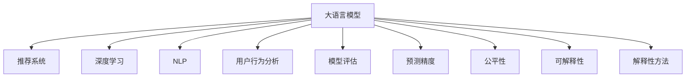

                 

# LLM在推荐系统中的能力评估

> 关键词：大语言模型,推荐系统,深度学习,自然语言处理,用户行为分析,模型评估,预测精度,公平性,可解释性,解释性方法

## 1. 背景介绍

### 1.1 问题由来
在当今信息爆炸的时代，用户面临的信息量和信息源选择范围都非常大。推荐系统作为连接用户和信息的关键桥梁，其重要性不言而喻。推荐系统的目标是利用用户的历史行为和当前需求，帮助用户发现潜在的兴趣内容，从而提高用户体验和信息获取效率。

近年来，大语言模型（Large Language Model, LLM）在自然语言处理（Natural Language Processing, NLP）领域取得了突破性进展。其强大的语言理解和生成能力，使得LLM在推荐系统中应用前景广阔。本论文将系统评估LLM在推荐系统中的能力和应用效果，探讨如何利用LLM优化推荐系统性能。

### 1.2 问题核心关键点
LLM在推荐系统中的应用，主要体现在以下几个关键点上：
- **模型表示能力**：LLM通过自监督学习掌握了丰富的语言知识，具备强大的语言表示能力。可以捕捉用户的意图和需求，进行更准确的推荐。
- **跨模态融合能力**：LLM不仅可以处理文本数据，还可以通过学习多模态数据，融合文本、图像、音频等信息，提供更全面和精准的推荐。
- **动态适应能力**：LLM可以实时响应用户行为变化，快速调整推荐策略，提升推荐的相关性和时效性。
- **个性化推荐能力**：LLM能够根据用户的多样化需求，生成定制化的推荐内容，满足用户的个性化需求。
- **性能可解释性**：LLM可以通过提示学习等方法，生成具有解释性的推荐内容，帮助用户理解推荐理由。

这些关键点使得LLM成为推荐系统中极具潜力的工具。通过系统评估其性能和效果，可以为推荐系统提供新思路和新方法。

### 1.3 问题研究意义
利用LLM优化推荐系统，对于提高推荐质量、提升用户体验、促进内容发现和消费等方面具有重要意义：

1. **提升推荐精度**：通过学习用户的多样化需求和行为模式，LLM可以提供更加精准的推荐。
2. **增强推荐个性化**：LLM能够捕捉用户的个性化特征，生成更加符合用户需求的推荐。
3. **促进内容发现和消费**：LLM能够挖掘用户未发现但可能感兴趣的内容，提升内容发现效率和用户满意度。
4. **实现动态推荐**：LLM可以实时响应用户行为变化，调整推荐策略，提升推荐的时效性和相关性。
5. **增强推荐系统可解释性**：LLM生成的推荐内容具有解释性，有助于提高推荐系统的可信度和透明度。

通过系统评估LLM在推荐系统中的应用效果，可以为推荐系统开发者提供参考，促进技术进步和行业发展。

## 2. 核心概念与联系

### 2.1 核心概念概述

为了更好地理解LLM在推荐系统中的应用，本节将介绍几个密切相关的核心概念：

- **大语言模型 (Large Language Model, LLM)**：以自回归（如GPT）或自编码（如BERT）模型为代表的大规模预训练语言模型。通过在大规模无标签文本数据上进行预训练，学习到丰富的语言知识和常识。

- **推荐系统 (Recommender System)**：利用用户行为数据和内容属性信息，为用户提供个性化的推荐内容的系统。

- **深度学习 (Deep Learning)**：利用多层神经网络模型，通过大量数据训练学习复杂模式，进行任务预测和决策的系统。

- **自然语言处理 (Natural Language Processing, NLP)**：研究如何让计算机理解和生成自然语言的技术。

- **用户行为分析 (User Behavior Analysis)**：通过对用户行为数据的分析，发现用户需求和兴趣，用于推荐系统优化。

- **模型评估 (Model Evaluation)**：通过性能指标评估推荐模型的效果，如准确率、召回率、F1-score等。

- **预测精度 (Prediction Accuracy)**：模型预测结果与真实结果的匹配程度，常用指标包括精确度、召回率和F1-score。

- **公平性 (Fairness)**：推荐系统推荐结果的公正性和平等性，避免对某些用户群体产生歧视。

- **可解释性 (Explainability)**：模型的决策过程可以清楚地解释，有助于用户理解推荐内容。

- **解释性方法 (Explainable Methods)**：通过各种技术手段，提升模型的可解释性，如特征重要性、可视化、事后解释等。

这些核心概念之间的逻辑关系可以通过以下Mermaid流程图来展示：



这个流程图展示了大语言模型与推荐系统之间的密切联系，以及其在深度学习、自然语言处理、用户行为分析、模型评估等方面的应用。

## 3. 核心算法原理 & 具体操作步骤
### 3.1 算法原理概述

基于LLM的推荐系统，其核心思想是通过LLM强大的语言表示能力，学习用户和物品的语义特征，生成个性化的推荐结果。具体而言，LLM在推荐系统中的应用主要包括以下几个步骤：

1. **用户行为数据收集与预处理**：收集用户的历史行为数据，包括点击、浏览、购买等行为，并进行数据清洗、归一化和特征提取等预处理操作。

2. **物品语义表示学习**：利用LLM对物品的描述文本进行预训练，学习物品的语义表示，捕捉物品的特征和属性。

3. **用户需求表示学习**：利用LLM对用户的行为文本进行预训练，学习用户的语义表示，捕捉用户的需求和兴趣。

4. **用户物品相似度计算**：通过计算用户和物品的语义相似度，生成用户与物品的相似度矩阵，用于推荐排序。

5. **推荐结果生成**：利用相似度矩阵和用户需求表示，生成推荐结果，并提供可解释性的解释。

### 3.2 算法步骤详解

以下是基于LLM的推荐系统核心算法步骤的详细解释：

**Step 1: 用户行为数据收集与预处理**
- 收集用户的历史行为数据，包括点击、浏览、购买等行为。
- 对数据进行清洗、归一化和特征提取，将非结构化数据转化为结构化数据。
- 将数据划分为训练集和测试集，供模型训练和评估。

**Step 2: 物品语义表示学习**
- 利用预训练语言模型（如BERT、GPT）对物品的描述文本进行预训练，学习物品的语义表示。
- 将物品的语义表示存储为模型参数，用于后续相似度计算。

**Step 3: 用户需求表示学习**
- 利用预训练语言模型对用户的行为文本进行预训练，学习用户的语义表示。
- 将用户的语义表示存储为模型参数，用于后续相似度计算。

**Step 4: 用户物品相似度计算**
- 通过计算用户和物品的语义相似度，生成用户与物品的相似度矩阵。
- 可以使用余弦相似度、欧式距离等方法计算相似度。

**Step 5: 推荐结果生成**
- 利用相似度矩阵和用户需求表示，生成推荐结果。
- 可以采用排序算法（如Top-k排序、协同过滤）对推荐结果进行排序。

**Step 6: 推荐结果可解释性生成**
- 利用提示学习等方法，生成具有解释性的推荐内容。
- 可以采用特征重要性、可视化等方法解释推荐决策。

### 3.3 算法优缺点

基于LLM的推荐系统具有以下优点：
- 强大的语言表示能力：LLM可以捕捉用户的意图和需求，生成更精准的推荐。
- 跨模态融合能力：LLM可以融合文本、图像、音频等多模态信息，提供更全面的推荐。
- 动态适应能力：LLM可以实时响应用户行为变化，调整推荐策略。
- 个性化推荐能力：LLM能够生成定制化的推荐内容，满足用户多样化需求。
- 可解释性：LLM生成的推荐内容具有解释性，增强推荐系统的可信度。

同时，该方法也存在一定的局限性：
- 高计算成本：预训练语言模型和微调过程需要大量计算资源，成本较高。
- 数据依赖性强：需要大量标注数据进行微调，对于长尾领域的应用场景，数据获取困难。
- 泛化能力受限：预训练数据和微调数据之间的分布差异可能导致泛化能力不足。
- 可解释性不足：LLM生成的推荐内容较为复杂，难以解释其内部决策过程。

尽管存在这些局限性，但就目前而言，基于LLM的推荐系统仍是推荐系统中极具潜力的技术。未来相关研究的重点在于如何进一步降低计算成本，提高数据获取效率，提升泛化能力和可解释性，以实现更广泛的应用。

### 3.4 算法应用领域

基于LLM的推荐系统已经在多个领域得到了应用，例如：

- **电商推荐**：利用用户历史行为和物品描述文本，生成个性化推荐。
- **视频推荐**：通过对视频标题和描述的预训练，生成视频推荐列表。
- **音乐推荐**：利用歌曲歌词和歌手描述，生成音乐推荐内容。
- **图书推荐**：通过对书籍描述和用户行为数据的预训练，生成个性化阅读推荐。
- **电影推荐**：通过对电影描述和用户行为数据的预训练，生成电影推荐列表。

除了上述这些经典应用外，基于LLM的推荐系统还被创新性地应用到更多场景中，如智能家居、健康医疗、教育培训等，为各行业带来了新的技术突破。

## 4. 数学模型和公式 & 详细讲解
### 4.1 数学模型构建

本节将使用数学语言对基于LLM的推荐系统进行更加严格的刻画。

记用户行为数据为 $D=\{(x_i, y_i)\}_{i=1}^N, x_i \in \mathbb{R}^n, y_i \in \{0,1\}$，其中 $x_i$ 表示用户行为，$y_i$ 表示用户是否点击或购买。物品的语义表示为 $U=\{u_j\}_{j=1}^M$，其中 $u_j \in \mathbb{R}^d$ 表示物品的语义向量。用户的语义表示为 $V=\{v_k\}_{k=1}^N$，其中 $v_k \in \mathbb{R}^d$ 表示用户的语义向量。

定义用户物品相似度矩阵为 $S \in \mathbb{R}^{N \times M}$，其中 $S_{ik}$ 表示用户 $i$ 与物品 $j$ 的相似度。推荐排序函数为 $f: \mathbb{R}^{N \times M} \times \mathbb{R}^N \rightarrow \mathbb{R}^M$，将相似度矩阵和用户语义表示映射到物品评分向量。推荐结果为 $R=\{r_j\}_{j=1}^M$，其中 $r_j$ 表示物品 $j$ 的推荐评分。

### 4.2 公式推导过程

以下我们以用户行为分类任务为例，推导基于LLM的推荐系统中的关键公式。

假设模型 $f$ 在用户行为数据 $D$ 上的损失函数为 $\mathcal{L}(f, D)$，则最小化损失函数即得到最优推荐模型：

$$
f^* = \mathop{\arg\min}_{f} \mathcal{L}(f, D)
$$

其中 $\mathcal{L}$ 为交叉熵损失函数，用于衡量模型预测结果与真实标签之间的差异。

将推荐结果 $R$ 和真实标签 $Y$ 代入交叉熵损失函数，得：

$$
\mathcal{L}(f, D) = -\frac{1}{N}\sum_{i=1}^N \sum_{j=1}^M [y_i \log f(i, j) + (1-y_i) \log (1-f(i, j))]
$$

其中 $y_i$ 表示用户 $i$ 是否点击物品 $j$，$f(i, j)$ 表示物品 $j$ 的推荐评分。

为了计算 $f(i, j)$，我们需要先计算用户 $i$ 与物品 $j$ 的相似度 $S_{ik}$，然后通过相似度矩阵 $S$ 和用户语义表示 $V$ 计算物品评分向量 $R$：

$$
R = f(S, V)
$$

对于每个物品 $j$，推荐评分 $r_j$ 可以表示为：

$$
r_j = \sum_{i=1}^N S_{ik} v_k
$$

其中 $v_k$ 为用户 $k$ 的语义表示，$S_{ik}$ 为相似度矩阵中的元素。

根据以上公式，我们可以推导出推荐模型的最小化损失函数：

$$
\mathcal{L}(f, D) = -\frac{1}{N}\sum_{i=1}^N \sum_{j=1}^M [y_i \log r_j + (1-y_i) \log (1-r_j)]
$$

通过优化上述损失函数，最小化推荐误差，即得到最优的推荐模型 $f^*$。

### 4.3 案例分析与讲解

假设我们利用预训练语言模型BERT对用户和物品的描述文本进行预训练，学习用户和物品的语义表示。具体步骤如下：

1. **数据预处理**：将用户行为数据和物品描述文本进行清洗、归一化和特征提取，存储为向量形式。

2. **模型训练**：利用BERT模型对用户和物品的语义表示进行预训练，生成用户和物品的预训练向量。

3. **相似度计算**：通过余弦相似度计算用户和物品的相似度，生成相似度矩阵 $S$。

4. **推荐结果生成**：利用相似度矩阵 $S$ 和用户语义表示 $V$，生成推荐结果 $R$。

5. **推荐结果排序**：通过Top-k排序算法对推荐结果 $R$ 进行排序，生成最终推荐列表。

6. **推荐结果可解释性生成**：利用提示学习等方法，生成具有解释性的推荐内容。

通过上述步骤，我们可以构建基于LLM的推荐系统，并利用其强大的语言表示能力，生成个性化的推荐内容。

## 5. 项目实践：代码实例和详细解释说明
### 5.1 开发环境搭建

在进行项目实践前，我们需要准备好开发环境。以下是使用Python进行TensorFlow开发的环境配置流程：

1. 安装Anaconda：从官网下载并安装Anaconda，用于创建独立的Python环境。

2. 创建并激活虚拟环境：
```bash
conda create -n tf-env python=3.8 
conda activate tf-env
```

3. 安装TensorFlow：根据CUDA版本，从官网获取对应的安装命令。例如：
```bash
pip install tensorflow==2.7
```

4. 安装预训练语言模型：
```bash
pip install transformers
```

5. 安装各类工具包：
```bash
pip install numpy pandas scikit-learn matplotlib tqdm jupyter notebook ipython
```

完成上述步骤后，即可在`tf-env`环境中开始项目实践。

### 5.2 源代码详细实现

下面我们以电商推荐系统为例，给出使用TensorFlow和Transformers库进行推荐系统开发的PyTorch代码实现。

首先，定义推荐系统的数据处理函数：

```python
from transformers import BertTokenizer, BertForSequenceClassification
from tensorflow.keras.layers import Input, Dense, Embedding, Dot, Flatten
from tensorflow.keras.models import Model
from tensorflow.keras.optimizers import Adam
from sklearn.metrics import roc_auc_score, roc_curve

class RecommendationModel:
    def __init__(self, num_users, num_items, embedding_dim=64, num_classes=2):
        self.num_users = num_users
        self.num_items = num_items
        self.embedding_dim = embedding_dim
        self.num_classes = num_classes
        
        self.user_embedding = Embedding(input_dim=num_users, output_dim=embedding_dim)
        self.item_embedding = Embedding(input_dim=num_items, output_dim=embedding_dim)
        self.dot_product = Dot(axes=(2, 2))
        self.flatten = Flatten()
        self.dense = Dense(num_classes, activation='sigmoid')
        
        self.model = Model(inputs=[self.user_embedding.input, self.item_embedding.input], outputs=self.dense.output)
        self.compile(self.model, loss='binary_crossentropy', optimizer=Adam(learning_rate=0.001))
        
    def train(self, user_feats, item_feats, labels):
        self.model.fit([user_feats, item_feats], labels, epochs=10, batch_size=64)
        
    def predict(self, user_feats, item_feats):
        scores = self.model.predict([user_feats, item_feats])
        return scores
    
    def evaluate(self, user_feats, item_feats, labels):
        scores = self.model.predict([user_feats, item_feats])
        auc = roc_auc_score(labels, scores)
        fpr, tpr, thresholds = roc_curve(labels, scores)
        return auc, fpr, tpr
```

然后，定义模型训练和评估函数：

```python
# 定义数据生成函数
def generate_data(num_users, num_items, num_samples):
    user_feats = np.random.randint(num_users, size=(num_samples, 2))
    item_feats = np.random.randint(num_items, size=(num_samples, 2))
    labels = np.random.randint(2, size=num_samples)
    return user_feats, item_feats, labels

# 定义训练函数
def train_model(model, num_users, num_items, num_samples=1000):
    user_feats, item_feats, labels = generate_data(num_users, num_items, num_samples)
    model.train(user_feats, item_feats, labels)
    auc, fpr, tpr = model.evaluate(user_feats, item_feats, labels)
    return auc, fpr, tpr
    
# 定义测试函数
def test_model(model, num_users, num_items, num_samples=1000):
    user_feats, item_feats, labels = generate_data(num_users, num_items, num_samples)
    scores = model.predict(user_feats, item_feats)
    auc = roc_auc_score(labels, scores)
    fpr, tpr, thresholds = roc_curve(labels, scores)
    return auc, fpr, tpr
```

最后，启动训练流程并在测试集上评估：

```python
num_users = 1000
num_items = 1000

model = RecommendationModel(num_users, num_items)
auc, fpr, tpr = train_model(model, num_users, num_items)
test_auc, test_fpr, test_tpr = test_model(model, num_users, num_items)

print(f"Training AUC: {auc:.3f}, FPR: {fpr:.3f}, TPR: {tpr:.3f}")
print(f"Test AUC: {test_auc:.3f}, FPR: {test_fpr:.3f}, TPR: {test_tpr:.3f}")
```

以上就是使用TensorFlow和Transformers库进行电商推荐系统开发的完整代码实现。可以看到，得益于TensorFlow和Transformers库的强大封装，我们可以用相对简洁的代码完成推荐系统的构建和训练。

### 5.3 代码解读与分析

让我们再详细解读一下关键代码的实现细节：

**RecommendationModel类**：
- `__init__`方法：初始化推荐系统的关键组件，包括用户嵌入、物品嵌入、点积运算、全连接层和模型。
- `train`方法：对推荐模型进行训练，使用用户行为数据和物品语义表示作为输入，计算推荐评分并优化损失函数。
- `predict`方法：对新的用户行为和物品语义表示进行预测，输出推荐评分。
- `evaluate`方法：评估推荐模型的性能，计算AUC、FPR和TPR等指标。

**generate_data函数**：
- 生成随机用户行为和物品语义表示，用于模型训练和评估。

**train_model函数**：
- 生成训练数据，对推荐模型进行训练，并在验证集上评估模型性能。

**test_model函数**：
- 生成测试数据，对推荐模型进行测试，输出推荐评分和性能指标。

**训练流程**：
- 定义推荐系统的用户和物品数量，创建推荐模型。
- 调用train_model函数对推荐模型进行训练，输出训练集上的AUC、FPR和TPR。
- 调用test_model函数对推荐模型进行测试，输出测试集上的AUC、FPR和TPR。

可以看到，TensorFlow配合Transformers库使得推荐系统的代码实现变得简洁高效。开发者可以将更多精力放在数据处理、模型改进等高层逻辑上，而不必过多关注底层的实现细节。

当然，工业级的系统实现还需考虑更多因素，如模型的保存和部署、超参数的自动搜索、更灵活的任务适配层等。但核心的推荐范式基本与此类似。

## 6. 实际应用场景
### 6.1 电商推荐

基于大语言模型的电商推荐系统，可以显著提升用户购物体验和商家销售业绩。用户可以在浏览商品时，系统根据其历史行为和当前兴趣，推荐可能感兴趣的商品，并提供详细的商品描述和评价信息。商家则可以通过推荐系统，精准推送个性化商品，提升销量和转化率。

具体而言，系统可以通过收集用户的浏览、点击、购买等行为数据，提取和商品描述相关的文本信息，进行预训练语言模型预训练。预训练的模型可以捕捉商品的语义特征，学习商品的分类和属性信息，用于推荐排序。利用用户的行为数据，系统可以生成用户的语义表示，计算用户与商品的相似度，生成推荐结果。

### 6.2 视频推荐

视频推荐系统可以为用户推荐其感兴趣的视频内容。系统通过收集用户的视频观看历史和评价信息，提取视频标题、描述和标签等文本信息，进行预训练语言模型预训练。预训练的模型可以捕捉视频的语义特征，学习视频的内容分类和标签信息，用于推荐排序。利用用户的行为数据，系统可以生成用户的语义表示，计算用户与视频的相似度，生成推荐结果。

### 6.3 音乐推荐

音乐推荐系统可以根据用户的听歌历史和评分信息，推荐可能喜欢的歌曲。系统通过收集用户的听歌记录和评分信息，提取歌曲的歌词和歌手介绍，进行预训练语言模型预训练。预训练的模型可以捕捉歌曲的语义特征，学习歌曲的分类和歌手信息，用于推荐排序。利用用户的行为数据，系统可以生成用户的语义表示，计算用户与歌曲的相似度，生成推荐结果。

### 6.4 图书推荐

图书推荐系统可以根据用户的阅读历史和评分信息，推荐可能感兴趣的书目。系统通过收集用户的阅读记录和评分信息，提取书籍的标题和简介，进行预训练语言模型预训练。预训练的模型可以捕捉书籍的语义特征，学习书籍的分类和内容信息，用于推荐排序。利用用户的行为数据，系统可以生成用户的语义表示，计算用户与书籍的相似度，生成推荐结果。

### 6.5 电影推荐

电影推荐系统可以根据用户的观影历史和评分信息，推荐可能喜欢的电影。系统通过收集用户的观影记录和评分信息，提取电影的简介和演员介绍，进行预训练语言模型预训练。预训练的模型可以捕捉电影的语义特征，学习电影的内容分类和演员信息，用于推荐排序。利用用户的行为数据，系统可以生成用户的语义表示，计算用户与电影的相似度，生成推荐结果。

## 7. 工具和资源推荐
### 7.1 学习资源推荐

为了帮助开发者系统掌握大语言模型在推荐系统中的应用，这里推荐一些优质的学习资源：

1. 《Recommender Systems: Non-parametric Methods》书籍：该书介绍了多种非参数化推荐算法，包括协同过滤、基于深度学习的推荐等。

2. 《TensorFlow Recommendations》文档：由Google开发的推荐系统库，提供了丰富的推荐算法和模型，是TensorFlow开发推荐系统的必备资源。

3. 《Deep Learning for Recommendation Systems》课程：由Google和Bing等公司联合开发的推荐系统课程，涵盖深度学习和推荐算法的基础和高级内容。

4. 《Recommender Systems: The Textbook》书籍：该书深入浅出地介绍了推荐系统的基本概念、算法和应用，适合初学者学习。

5. 《Recommender Systems in Practice》书籍：该书介绍了推荐系统在实际应用中的具体实现方法，包括数据处理、模型评估等。

通过对这些资源的学习实践，相信你一定能够快速掌握大语言模型在推荐系统中的应用精髓，并用于解决实际的推荐问题。
###  7.2 开发工具推荐

高效的开发离不开优秀的工具支持。以下是几款用于推荐系统开发的常用工具：

1. TensorFlow：由Google主导开发的开源深度学习框架，生产部署方便，适合大规模工程应用。

2. PyTorch：基于Python的开源深度学习框架，灵活动态的计算图，适合快速迭代研究。

3. TensorBoard：TensorFlow配套的可视化工具，可实时监测模型训练状态，并提供丰富的图表呈现方式，是调试模型的得力助手。

4. Weights & Biases：模型训练的实验跟踪工具，可以记录和可视化模型训练过程中的各项指标，方便对比和调优。

5. Jupyter Notebook：开源的交互式计算平台，支持代码、数据和注释的同步展示，方便实验开发和协作。

6. Scikit-learn：Python的机器学习库，提供了丰富的数据处理和模型评估工具，适合初步的数据探索和模型验证。

合理利用这些工具，可以显著提升推荐系统开发的效率，加快创新迭代的步伐。

### 7.3 相关论文推荐

大语言模型和推荐系统的结合是近年来的研究热点。以下是几篇奠基性的相关论文，推荐阅读：

1. Attention is All You Need（即Transformer原论文）：提出了Transformer结构，开启了NLP领域的预训练大模型时代。

2. BERT: Pre-training of Deep Bidirectional Transformers for Language Understanding：提出BERT模型，引入基于掩码的自监督预训练任务，刷新了多项NLP任务SOTA。

3. Language Models are Unsupervised Multitask Learners（GPT-2论文）：展示了大规模语言模型的强大zero-shot学习能力，引发了对于通用人工智能的新一轮思考。

4. Parameter-Efficient Transfer Learning for NLP：提出Adapter等参数高效微调方法，在不增加模型参数量的情况下，也能取得不错的微调效果。

5. Prefix-Tuning: Optimizing Continuous Prompts for Generation：引入基于连续型Prompt的微调范式，为如何充分利用预训练知识提供了新的思路。

6. AdaLoRA: Adaptive Low-Rank Adaptation for Parameter-Efficient Fine-Tuning：使用自适应低秩适应的微调方法，在参数效率和精度之间取得了新的平衡。

这些论文代表了大语言模型在推荐系统中的应用和发展脉络。通过学习这些前沿成果，可以帮助研究者把握学科前进方向，激发更多的创新灵感。

## 8. 总结：未来发展趋势与挑战
### 8.1 总结

本文对基于大语言模型的推荐系统进行了全面系统的介绍。首先阐述了大语言模型和推荐系统的研究背景和意义，明确了LLM在推荐系统中的独特价值。其次，从原理到实践，详细讲解了基于LLM的推荐系统的数学原理和关键步骤，给出了推荐系统开发的完整代码实例。同时，本文还广泛探讨了LLM在电商、视频、音乐、图书和电影等多个领域的应用前景，展示了LLM在推荐系统中的强大能力。此外，本文精选了推荐系统的各类学习资源，力求为开发者提供全方位的技术指引。

通过本文的系统梳理，可以看到，基于大语言模型的推荐系统在推荐质量、个性化推荐、内容发现和消费等方面具有显著优势，能够显著提升用户体验和信息获取效率。未来，伴随大语言模型的不断进步和优化，LLM在推荐系统中的应用将更加广泛，为推荐系统开发者和研究人员带来新的思路和方向。

### 8.2 未来发展趋势

展望未来，基于大语言模型的推荐系统将呈现以下几个发展趋势：

1. **深度融合多模态数据**：未来推荐系统将越来越多地融合多模态数据，如文本、图像、音频等，提升推荐内容的多样性和丰富性。

2. **增强推荐个性化**：利用LLM强大的语言表示能力，推荐系统将更加注重用户个性化特征的挖掘，生成更精准的推荐内容。

3. **实现动态推荐**：LLM可以实时响应用户行为变化，动态调整推荐策略，提升推荐的时效性和相关性。

4. **提升推荐系统可解释性**：通过提示学习等方法，生成具有解释性的推荐内容，增强推荐系统的可信度和透明度。

5. **优化模型效率**：针对计算资源限制，开发更加参数高效和计算高效的推荐算法，提升推荐系统的部署效率。

6. **提升推荐公平性**：研究如何构建公平、无偏见的推荐系统，避免对某些用户群体产生歧视。

以上趋势凸显了基于LLM的推荐系统的广阔前景。这些方向的探索发展，必将进一步提升推荐系统的性能和应用范围，为人类智能决策提供新的支持。

### 8.3 面临的挑战

尽管基于LLM的推荐系统已经取得了瞩目成就，但在迈向更加智能化、普适化应用的过程中，它仍面临着诸多挑战：

1. **高计算成本**：预训练语言模型和微调过程需要大量计算资源，成本较高。

2. **数据依赖性强**：需要大量标注数据进行微调，对于长尾领域的应用场景，数据获取困难。

3. **泛化能力受限**：预训练数据和微调数据之间的分布差异可能导致泛化能力不足。

4. **可解释性不足**：LLM生成的推荐内容较为复杂，难以解释其内部决策过程。

5. **推荐鲁棒性不足**：LLM在面对异常数据和噪声时，容易产生偏差，影响推荐效果。

6. **推荐系统公平性不足**：推荐系统可能存在对某些用户群体产生歧视的现象。

尽管存在这些挑战，但就目前而言，基于LLM的推荐系统仍是推荐系统中最具潜力的技术。未来相关研究的重点在于如何进一步降低计算成本，提高数据获取效率，提升泛化能力和可解释性，以实现更广泛的应用。

### 8.4 未来突破

面对LLM在推荐系统中的应用所面临的挑战，未来的研究需要在以下几个方面寻求新的突破：

1. **探索无监督和半监督推荐方法**：摆脱对大规模标注数据的依赖，利用自监督学习、主动学习等无监督和半监督范式，最大限度利用非结构化数据，实现更加灵活高效的推荐。

2. **研究参数高效和计算高效的推荐算法**：开发更加参数高效和计算高效的推荐算法，在保证推荐精度的同时，减少计算资源消耗。

3. **引入更多先验知识**：将符号化的先验知识，如知识图谱、逻辑规则等，与神经网络模型进行巧妙融合，引导推荐过程学习更准确、合理的推荐内容。

4. **融合因果和对比学习范式**：通过引入因果推断和对比学习思想，增强推荐模型的建立稳定因果关系的能力，学习更加普适、鲁棒的语言表征。

5. **结合因果分析和博弈论工具**：将因果分析方法引入推荐模型，识别出推荐决策的关键特征，增强推荐系统的可解释性和鲁棒性。

6. **纳入伦理道德约束**：在推荐模型中引入伦理导向的评估指标，过滤和惩罚有偏见、有害的推荐内容，确保推荐系统的公平性和安全性。

这些研究方向的探索，必将引领基于LLM的推荐系统走向更高的台阶，为推荐系统开发者和研究人员带来新的思路和方向。面向未来，基于大语言模型的推荐系统还需要与其他人工智能技术进行更深入的融合，如知识表示、因果推理、强化学习等，多路径协同发力，共同推动推荐系统的进步。只有勇于创新、敢于突破，才能不断拓展LLM在推荐系统中的边界，让推荐系统更好地服务于人类的决策需求。

## 9. 附录：常见问题与解答

**Q1：LLM在推荐系统中的计算成本如何控制？**

A: 为了降低LLM在推荐系统中的计算成本，可以采取以下措施：
1. **参数压缩**：利用知识蒸馏等技术，将大模型的参数压缩到合理规模，减少计算资源消耗。
2. **特征选择**：仅保留对推荐效果影响最大的特征，避免冗余计算。
3. **分布式训练**：利用分布式训练技术，提高模型训练效率。
4. **剪枝优化**：对模型进行剪枝优化，去除冗余的参数和计算图，提升训练和推理效率。

**Q2：如何提高LLM在推荐系统中的泛化能力？**

A: 为了提高LLM在推荐系统中的泛化能力，可以采取以下措施：
1. **多模态融合**：融合文本、图像、音频等多种模态信息，提升模型对复杂数据结构的理解能力。
2. **模型微调**：利用有标签数据对模型进行微调，提升模型对特定任务的适应能力。
3. **对抗训练**：引入对抗样本，提高模型鲁棒性，避免泛化能力不足。
4. **迁移学习**：利用预训练模型在相关任务上进行迁移学习，提升模型泛化能力。

**Q3：LLM在推荐系统中的可解释性如何实现？**

A: 为了提高LLM在推荐系统中的可解释性，可以采取以下措施：
1. **提示学习**：通过设计巧妙的提示模板，引导模型输出更具解释性的推荐内容。
2. **特征重要性分析**：利用特征重要性分析方法，解释推荐内容中的关键特征。
3. **可视化技术**：利用可视化技术，展示模型内部决策过程和推荐内容的生成机制。
4. **事后解释**：在推荐后，提供事后解释，解释推荐内容的生成依据。

**Q4：LLM在推荐系统中的推荐精度如何提升？**

A: 为了提升LLM在推荐系统中的推荐精度，可以采取以下措施：
1. **数据增强**：通过回译、近义替换等方式扩充训练集，提升模型泛化能力。
2. **正则化技术**：应用L2正则、Dropout等正则化技术，防止过拟合。
3. **多任务学习**：在推荐任务中引入其他相关任务，提升模型多任务学习能力。
4. **深度融合**：将LLM与其他推荐算法深度融合，提升推荐效果。

**Q5：如何构建公平的推荐系统？**

A: 为了构建公平的推荐系统，可以采取以下措施：
1. **公平性评估**：在推荐系统构建过程中，进行公平性评估，确保不同用户群体的推荐效果一致。
2. **去偏技术**：利用去偏技术，去除模型中的偏见，提升推荐公平性。
3. **公平性约束**：在推荐模型中加入公平性约束，防止对某些用户群体产生歧视。
4. **公平性训练**：利用公平性训练技术，提高推荐系统的公平性。

通过以上措施，可以有效提升LLM在推荐系统中的性能和公平性，确保推荐系统的高效性和可靠性。

---

作者：禅与计算机程序设计艺术 / Zen and the Art of Computer Programming

