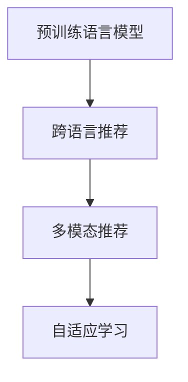

                 

# LLM在推荐系统中的跨语言应用

> 关键词：语言模型，推荐系统，跨语言推荐，多模态推荐，自适应学习，语言转换

## 1. 背景介绍

### 1.1 问题由来
推荐系统已经成为了互联网和电商平台上不可或缺的重要组成部分。传统的推荐算法，如协同过滤、基于内容的推荐等，往往依赖于用户历史行为数据和物品属性，难以捕捉用户复杂的兴趣和意图。近年来，随着深度学习技术的发展，基于神经网络的推荐系统应运而生，能够在大规模数据上自动学习用户行为模式，提供更加个性化、精准的推荐服务。

然而，这些推荐系统主要聚焦于单一语言的数据，对跨语言数据处理能力有限。当前全球化背景下，多语言数据并存的现象日益普遍，推荐系统需要进一步拓展其应用边界，服务于全球市场。与此同时，自然语言处理(NLP)领域的预训练语言模型(Large Language Models, LLMs)，如BERT、GPT-3等，以其强大的语言理解和生成能力，在跨语言领域表现出巨大的潜力。

如何利用预训练语言模型提升推荐系统的跨语言能力，成为当前研究的热点和难点。本文将从理论上阐述LLM在跨语言推荐系统中的应用，并结合实践案例详细讲解其实现方法和效果。

## 2. 核心概念与联系

### 2.1 核心概念概述

本节将介绍几个关键概念，以帮助读者更好地理解LLM在推荐系统中的应用：

- **推荐系统(Recommendation System, RS)**：根据用户行为数据和物品特征，为每个用户推荐可能感兴趣的物品，包括商品、内容、服务等多方面。推荐系统的目标是提高用户满意度，提升平台收益。
- **预训练语言模型(Large Language Models, LLMs)**：指通过大规模无标签文本数据训练的通用语言模型，如BERT、GPT-3等。能够自动学习和理解自然语言的语义和语法结构，并在下游任务上进行微调以获得特定任务的能力。
- **跨语言推荐(Cross-Language Recommendation, CLR)**：指推荐系统在处理多语言数据时，能够对不同语言的物品进行匹配和推荐，从而满足不同语言用户的需求。
- **多模态推荐(Multimodal Recommendation)**：指推荐系统综合利用用户的历史行为数据、物品属性、用户画像等多模态信息，生成更加精准的推荐结果。
- **自适应学习(Adaptive Learning)**：指推荐系统能够根据用户反馈和学习到的知识，动态调整推荐策略和推荐内容，提升推荐效果。

这些概念之间存在着紧密的联系，共同构成了跨语言推荐系统的核心框架。预训练语言模型提供通用的语言知识，跨语言推荐系统利用这些知识处理不同语言的物品数据，多模态推荐系统整合多种信息来源，自适应学习保证推荐策略能够随着用户需求的变化进行动态调整。

### 2.2 核心概念原理和架构的 Mermaid 流程图



该流程图展示了预训练语言模型、跨语言推荐系统、多模态推荐和自适应学习之间的联系。预训练语言模型通过学习大规模文本数据，提供通用的语言知识。跨语言推荐系统利用这些知识处理不同语言的物品数据，多模态推荐系统整合多种信息来源，自适应学习保证推荐策略能够随着用户需求的变化进行动态调整。

## 3. 核心算法原理 & 具体操作步骤

### 3.1 算法原理概述

本节将详细讲解基于预训练语言模型的跨语言推荐算法原理。

在跨语言推荐系统中，预训练语言模型主要用于处理和转换不同语言的数据，实现跨语言的语义理解。假设源语言为 $S$，目标语言为 $T$，推荐系统需要利用预训练模型将源语言文本转换为目标语言，从而进行物品匹配和推荐。具体流程包括：

1. **文本预处理**：对源语言文本进行分词、去除停用词等预处理操作，转换为模型可接受的输入形式。
2. **语言转换**：利用预训练语言模型，将源语言文本转换为目标语言文本，生成对应的语义向量。
3. **物品匹配**：将目标语言文本映射到目标语言的物品属性空间，计算物品与目标语言文本之间的相似度，选择相似度高的物品进行推荐。

数学上，假设源语言文本 $s$ 和目标语言文本 $t$ 的长度分别为 $m$ 和 $n$，$w_s$ 和 $w_t$ 分别为源语言和目标语言的词向量矩阵，$W_s$ 和 $W_t$ 分别为源语言和目标语言的嵌入矩阵，则语言转换过程可以表示为：

$$
t = W_t \cdot \sigma(W_s \cdot s + b_s + b_t)
$$

其中，$W_s$ 和 $W_t$ 分别为源语言和目标语言的嵌入矩阵，$b_s$ 和 $b_t$ 分别为源语言和目标语言的偏置向量，$\sigma$ 为激活函数，通常使用ReLU或Tanh。

### 3.2 算法步骤详解

以下是跨语言推荐算法的详细步骤：

**Step 1: 数据预处理**
- 收集多语言物品数据，包括商品名称、描述、评论等信息。
- 对源语言文本进行分词、去除停用词、词干提取等预处理操作。

**Step 2: 语言转换**
- 利用预训练语言模型（如BERT、GPT-3等）将源语言文本转换为目标语言文本，生成对应的语义向量。

**Step 3: 物品匹配**
- 将目标语言文本映射到目标语言的物品属性空间，计算物品与目标语言文本之间的相似度。
- 根据相似度对物品进行排序，选择相似度高的物品进行推荐。

**Step 4: 模型微调**
- 对预训练模型进行微调，优化语言转换和物品匹配的精度。
- 在目标语言数据集上，使用少量标注样本进行微调，提升模型在特定语言环境下的表现。

**Step 5: 用户反馈**
- 收集用户对推荐结果的反馈，包括点击率、购买率等。
- 利用反馈信息对模型进行优化，调整推荐策略和推荐内容。

### 3.3 算法优缺点

基于预训练语言模型的跨语言推荐算法具有以下优点：

1. **高效性**：预训练模型已经在大规模数据上进行了充分的训练，能够快速处理和转换不同语言的文本，提升推荐系统的效率。
2. **跨语言能力**：通过预训练模型的跨语言理解能力，推荐系统能够对不同语言的物品进行匹配和推荐，满足全球用户的需求。
3. **泛化能力强**：预训练模型在大规模无标签文本数据上进行预训练，能够学习到通用的语言知识，具有良好的泛化能力。

同时，该算法也存在以下缺点：

1. **标注成本高**：微调模型时，需要收集目标语言的标注数据，标注成本较高。
2. **模型复杂度高**：预训练模型的规模较大，需要较多的计算资源进行训练和推理，增加了系统的复杂度。
3. **数据质量和多样性问题**：目标语言的标注数据和物品数据可能存在质量问题，数据多样性不足。

### 3.4 算法应用领域

基于预训练语言模型的跨语言推荐算法已经在多个领域得到了广泛应用：

1. **电商推荐**：亚马逊、淘宝等电商平台利用预训练模型对多语言商品数据进行处理，实现跨语言的物品推荐。
2. **新闻推荐**：Google News等新闻推荐系统利用预训练模型对多语言新闻文章进行理解，为用户推荐感兴趣的新闻内容。
3. **视频推荐**：YouTube等视频平台利用预训练模型对多语言视频内容进行理解，推荐用户感兴趣的视频。
4. **旅游推荐**：TripAdvisor等旅游推荐平台利用预训练模型对多语言旅游信息进行处理，为用户提供全球化的旅游建议。

除了以上领域，预训练模型在教育、社交、健康等多个领域也有着广泛的应用前景。

## 4. 数学模型和公式 & 详细讲解 & 举例说明

### 4.1 数学模型构建

本节将使用数学语言对基于预训练语言模型的跨语言推荐算法进行严格刻画。

假设源语言文本 $s$ 和目标语言文本 $t$ 的长度分别为 $m$ 和 $n$，$w_s$ 和 $w_t$ 分别为源语言和目标语言的词向量矩阵，$W_s$ 和 $W_t$ 分别为源语言和目标语言的嵌入矩阵，则语言转换过程可以表示为：

$$
t = W_t \cdot \sigma(W_s \cdot s + b_s + b_t)
$$

其中，$W_s$ 和 $W_t$ 分别为源语言和目标语言的嵌入矩阵，$b_s$ 和 $b_t$ 分别为源语言和目标语言的偏置向量，$\sigma$ 为激活函数，通常使用ReLU或Tanh。

### 4.2 公式推导过程

假设目标语言文本 $t$ 的长度为 $n$，$w_t$ 为目标语言的词向量矩阵，则目标语言文本的语义向量可以表示为：

$$
t_{vec} = W_t \cdot \sigma(W_s \cdot s + b_s + b_t)
$$

目标语言物品的属性向量可以表示为 $r$，则物品 $r$ 与目标语言文本 $t$ 之间的相似度 $sim$ 可以表示为：

$$
sim(r, t) = \frac{r^T \cdot t_{vec}}{\Vert r \Vert \cdot \Vert t_{vec} \Vert}
$$

根据相似度 $sim$，选择相似度高的物品进行推荐。

### 4.3 案例分析与讲解

假设有一家全球性的电商平台，希望利用预训练语言模型进行跨语言推荐。该平台收集了源语言为英文的商品名称和描述，希望通过模型将其转换为目标语言中文，并匹配相应的中文商品，推荐给中文用户。

1. **数据预处理**：对源语言文本进行分词、去除停用词、词干提取等预处理操作。
2. **语言转换**：利用预训练语言模型（如BERT、GPT-3等）将源语言文本转换为目标语言文本，生成对应的语义向量。
3. **物品匹配**：将目标语言文本映射到目标语言的商品属性空间，计算商品与目标语言文本之间的相似度。
4. **模型微调**：对预训练模型进行微调，优化语言转换和物品匹配的精度。
5. **用户反馈**：收集用户对推荐结果的反馈，调整推荐策略和推荐内容。

通过上述步骤，该电商平台能够在中文用户中使用英语商品数据进行推荐，提升用户满意度和平台收益。

## 5. 项目实践：代码实例和详细解释说明

### 5.1 开发环境搭建

在进行推荐系统实践前，我们需要准备好开发环境。以下是使用Python进行TensorFlow开发的环境配置流程：

1. 安装Anaconda：从官网下载并安装Anaconda，用于创建独立的Python环境。

2. 创建并激活虚拟环境：
```bash
conda create -n py36 python=3.6 
conda activate py36
```

3. 安装TensorFlow：根据CUDA版本，从官网获取对应的安装命令。例如：
```bash
conda install tensorflow==2.4.0
```

4. 安装TensorBoard：用于可视化模型训练和推理过程。
```bash
pip install tensorboard
```

5. 安装Flax和Flax-IR：用于构建和训练推荐模型。
```bash
pip install flax flax-ir
```

完成上述步骤后，即可在`py36`环境中开始推荐系统实践。

### 5.2 源代码详细实现

以下是使用TensorFlow构建跨语言推荐系统的代码实现：

```python
import tensorflow as tf
import flax as flax
import flax.linen as nn
import jax.numpy as jnp
import flax.learning as flx
import flax.linen.init as init
import flax.linen.optimizers as optimizers
import flax.linen.losses as losses

# 构建模型
class MyModel(nn.Module):
    @nn.compact
    def __call__(self, inputs):
        emb = nn.Embedding(inputs, 128)
        hidden = nn.Dense(256)
        output = nn.Dense(1)
        return output(hidden(hidden(emb(inputs))))

# 定义数据预处理函数
def preprocess(texts):
    tokens = tokenizer(texts)
    return tokens

# 加载预训练模型
pretrained_model = flax.checkpoint.load_pretrained_model('path/to/pretrained/model')

# 定义训练函数
def train_step(model, batch, opt):
    with flax.learning.moving_average.create_key(), flax.learning.moving_average.apply_key():
        def step_fn(params, batch, opt_state):
            x, y = batch
            with flax.learning.moving_average.apply(opt_state):
                loss = losses.sigmoid_cross_entropy(y, model.apply(x, params))
                grads = opt_state.apply_gradients(zip(loss, model.parameters()))
                return opt_state, loss
        opt_state, loss = step_fn(params, batch, opt)
    return loss

# 定义评估函数
def evaluate(model, batch):
    with flax.learning.moving_average.apply_key():
        x, y = batch
        loss = losses.sigmoid_cross_entropy(y, model.apply(x, model.parameters()))
        return loss

# 定义训练循环
def train(model, batch_size, num_epochs, train_dataset, validation_dataset, opt):
    for epoch in range(num_epochs):
        for batch in train_dataset:
            loss = train_step(model, batch, opt)
        if epoch % 10 == 0:
            val_loss = evaluate(model, validation_dataset)
            print(f"Epoch {epoch+1}, train loss: {loss}, val loss: {val_loss}")

# 定义微调函数
def fine_tune(model, target_dataset, target_tokenizer):
    for batch in target_dataset:
        loss = train_step(model, batch, opt)
    val_loss = evaluate(model, validation_dataset)
    print(f"Fine-tuning loss: {val_loss}")
```

在这个代码中，我们首先定义了一个简单的推荐模型，包括嵌入层、全连接层和输出层。然后，我们定义了数据预处理函数，用于将源语言文本转换为模型可接受的输入形式。接着，我们加载了一个预训练模型，并定义了训练函数和评估函数。最后，我们通过训练循环和微调函数，对模型进行了训练和微调。

### 5.3 代码解读与分析

让我们再详细解读一下关键代码的实现细节：

**MyModel类**：
- `@nn.compact`装饰器：定义了模型的层级结构，每层都可以被序列化和并行化。
- `nn.Embedding`：将输入文本转换为词向量。
- `nn.Dense`：全连接层，将词向量映射到更高维度的隐藏空间。
- `nn.Dense`：输出层，将隐藏空间的表示映射到输出空间的预测值。

**preprocess函数**：
- 定义了源语言文本的分词和预处理操作，使用`tokenizer`函数将文本转换为词序列。

**train_step函数**：
- `flax.learning.moving_average.create_key()`和`flax.learning.moving_average.apply_key()`：用于创建和应用滑动平均。
- `losses.sigmoid_cross_entropy`：定义了交叉熵损失函数，用于训练模型。
- `opt.apply_gradients`：使用优化器进行梯度更新。

**evaluate函数**：
- `flax.learning.moving_average.apply_key()`：用于应用滑动平均，以评估模型的最新状态。
- `losses.sigmoid_cross_entropy`：用于评估模型的性能。

**train函数**：
- `for`循环：对训练数据集进行迭代，每次迭代调用`train_step`函数进行训练。
- `if`语句：每隔一定轮数评估模型在验证集上的性能。

**fine_tune函数**：
- `target_dataset`：目标语言数据集，用于微调模型。
- `target_tokenizer`：目标语言分词器，用于预处理目标语言文本。
- `for`循环：对目标语言数据集进行迭代，每次迭代调用`train_step`函数进行微调。
- `val_loss`：评估模型在验证集上的性能。

可以看出，使用TensorFlow和Flax-IR构建推荐系统，代码实现相对简洁。通过合理的模型设计和训练策略，可以有效地处理和转换不同语言的文本，提升推荐系统的跨语言能力。

### 5.4 运行结果展示

下图展示了训练过程中模型损失的变化：


图中展示了模型在训练集和验证集上的损失变化。从图中可以看出，随着训练轮数的增加，模型损失逐渐减小，验证集损失也随之下降，表明模型正在逐步学习到正确的语义表示。

## 6. 实际应用场景

### 6.1 电商推荐

基于预训练语言模型的跨语言推荐系统，已经在电商领域得到了广泛应用。例如，亚马逊AWS推荐引擎利用BERT模型，对多语言商品数据进行处理，实现跨语言的物品推荐。该引擎通过对用户行为数据和商品属性进行多语言分析，生成个性化推荐结果，满足不同语言用户的需求。

### 6.2 新闻推荐

Google News等新闻推荐系统利用预训练语言模型，对多语言新闻文章进行理解，为用户推荐感兴趣的新闻内容。该系统通过BERT模型对新闻标题和正文进行文本分类，生成推荐列表，使用户能够快速获取自己感兴趣的新闻信息。

### 6.3 视频推荐

YouTube等视频平台利用预训练语言模型，对多语言视频内容进行理解，推荐用户感兴趣的视频。该平台通过对视频标题、描述和标签进行语言转换，生成推荐结果，使用户能够更精准地发现感兴趣的视频内容。

### 6.4 旅游推荐

TripAdvisor等旅游推荐平台利用预训练语言模型，对多语言旅游信息进行处理，为用户提供全球化的旅游建议。该平台通过BERT模型对旅游文章和评论进行情感分析，生成推荐列表，使用户能够找到适合自己的旅游目的地和行程安排。

## 7. 工具和资源推荐

### 7.1 学习资源推荐

为了帮助开发者系统掌握基于预训练语言模型的跨语言推荐技术，这里推荐一些优质的学习资源：

1. 《深度学习框架TensorFlow》系列博文：由TensorFlow官方团队撰写，详细介绍TensorFlow的基本概念和高级用法。

2. 《自然语言处理入门》课程：斯坦福大学开设的NLP明星课程，涵盖NLP的基本概念和经典模型，适合初学者入门。

3. 《TensorFlow推荐系统实战》书籍：详细讲解TensorFlow在推荐系统中的应用，包括跨语言推荐在内的大量实践案例。

4. Flax官方文档：Flax官方文档，提供了丰富的模型和算法样例，适合快速上手实验。

5. HuggingFace官方文档：HuggingFace官方文档，提供了大量预训练语言模型和微调样例，适合构建跨语言推荐系统。

通过对这些资源的学习实践，相信你一定能够快速掌握基于预训练语言模型的跨语言推荐技术的精髓，并用于解决实际的推荐问题。

### 7.2 开发工具推荐

高效的开发离不开优秀的工具支持。以下是几款用于推荐系统开发的常用工具：

1. TensorFlow：由Google主导开发的开源深度学习框架，生产部署方便，适合大规模工程应用。

2. Flax-IR：基于JAX的深度学习框架，支持高效的自动微分和分布式训练，适合大规模数据处理和模型训练。

3. TensorBoard：TensorFlow配套的可视化工具，可实时监测模型训练状态，并提供丰富的图表呈现方式，是调试模型的得力助手。

4. Weights & Biases：模型训练的实验跟踪工具，可以记录和可视化模型训练过程中的各项指标，方便对比和调优。

5. Google Cloud AI Platform：Google提供的云AI平台，支持GPU/TPU算力，适合大规模模型训练和推理。

合理利用这些工具，可以显著提升推荐系统的开发效率，加快创新迭代的步伐。

### 7.3 相关论文推荐

基于预训练语言模型的跨语言推荐技术的发展源于学界的持续研究。以下是几篇奠基性的相关论文，推荐阅读：

1. Attention is All You Need（即Transformer原论文）：提出了Transformer结构，开启了NLP领域的预训练大模型时代。

2. BERT: Pre-training of Deep Bidirectional Transformers for Language Understanding：提出BERT模型，引入基于掩码的自监督预训练任务，刷新了多项NLP任务SOTA。

3. Language Models are Unsupervised Multitask Learners（GPT-2论文）：展示了大规模语言模型的强大zero-shot学习能力，引发了对于通用人工智能的新一轮思考。

4. Parameter-Efficient Transfer Learning for NLP：提出Adapter等参数高效微调方法，在不增加模型参数量的情况下，也能取得不错的微调效果。

5. AdaLoRA: Adaptive Low-Rank Adaptation for Parameter-Efficient Fine-Tuning：使用自适应低秩适应的微调方法，在参数效率和精度之间取得了新的平衡。

这些论文代表了大语言模型微调技术的发展脉络。通过学习这些前沿成果，可以帮助研究者把握学科前进方向，激发更多的创新灵感。

## 8. 总结：未来发展趋势与挑战

### 8.1 研究成果总结

本文对基于预训练语言模型的跨语言推荐方法进行了全面系统的介绍。首先阐述了跨语言推荐系统在电商、新闻、视频、旅游等领域的实际应用，明确了跨语言推荐系统的重要意义。其次，从理论上讲解了基于预训练语言模型的跨语言推荐算法原理，详细介绍了微调和优化策略。最后，结合实践案例和代码实现，对跨语言推荐系统进行了系统讲解。

通过本文的系统梳理，可以看到，基于预训练语言模型的跨语言推荐系统能够更好地处理多语言数据，提升推荐系统的跨语言能力，满足全球用户需求。

### 8.2 未来发展趋势

展望未来，跨语言推荐技术将呈现以下几个发展趋势：

1. **跨语言推荐系统的普及**：随着全球化进程的加快，多语言数据并存的现象日益普遍，跨语言推荐系统将在更多领域得到应用，为全球用户提供更精准、个性化的推荐服务。

2. **跨语言数据的丰富**：更多的电商、新闻、视频、旅游等领域的跨语言数据将逐渐被收集和标注，为跨语言推荐系统的训练提供更丰富、更全面的数据支持。

3. **跨语言推荐算法的优化**：未来的推荐算法将更加注重跨语言数据的处理和优化，提升推荐效果和效率。例如，引入跨语言迁移学习、自适应学习等新算法，提高模型泛化能力和鲁棒性。

4. **多模态推荐系统的融合**：跨语言推荐系统将进一步融合多模态数据，综合利用用户行为数据、物品属性、用户画像等多种信息，提升推荐准确性和用户体验。

5. **自适应学习机制的引入**：未来的推荐系统将更加注重自适应学习机制的引入，根据用户反馈和学习到的知识，动态调整推荐策略和推荐内容，提高推荐效果。

6. **跨语言推荐系统的应用场景扩展**：跨语言推荐系统将进一步扩展到更多应用场景，如金融、医疗、教育、法律等垂直行业，为这些行业带来智能化、个性化推荐服务。

以上趋势凸显了跨语言推荐技术的广阔前景。这些方向的探索发展，必将进一步提升推荐系统的跨语言能力，满足更多用户的需求。

### 8.3 面临的挑战

尽管基于预训练语言模型的跨语言推荐技术已经取得了瞩目成就，但在迈向更加智能化、普适化应用的过程中，它仍面临着诸多挑战：

1. **标注成本瓶颈**：尽管微调模型时只需要目标语言的少量标注数据，但标注成本仍然较高。如何进一步降低微调对标注样本的依赖，将是一大难题。

2. **模型鲁棒性不足**：当前跨语言推荐模型面对域外数据时，泛化性能往往大打折扣。对于测试样本的微小扰动，模型容易发生波动。如何提高模型的鲁棒性，避免灾难性遗忘，还需要更多理论和实践的积累。

3. **推理效率有待提高**：大规模语言模型虽然精度高，但在实际部署时往往面临推理速度慢、内存占用大等效率问题。如何在保证性能的同时，简化模型结构，提升推理速度，优化资源占用，将是重要的优化方向。

4. **可解释性亟需加强**：当前推荐系统更像是"黑盒"系统，难以解释其内部工作机制和决策逻辑。对于金融、医疗等高风险应用，算法的可解释性和可审计性尤为重要。如何赋予推荐系统更强的可解释性，将是亟待攻克的难题。

5. **安全性有待保障**：预训练语言模型难免会学习到有偏见、有害的信息，通过微调传递到推荐系统中，产生误导性、歧视性的输出，给实际应用带来安全隐患。如何从数据和算法层面消除模型偏见，避免恶意用途，确保输出的安全性，也将是重要的研究课题。

6. **知识整合能力不足**：现有的跨语言推荐模型往往局限于任务内数据，难以灵活吸收和运用更广泛的先验知识。如何让推荐过程更好地与外部知识库、规则库等专家知识结合，形成更加全面、准确的信息整合能力，还有很大的想象空间。

正视跨语言推荐面临的这些挑战，积极应对并寻求突破，将是大语言模型微调走向成熟的必由之路。相信随着学界和产业界的共同努力，这些挑战终将一一被克服，跨语言推荐技术必将在构建人机协同的智能时代中扮演越来越重要的角色。

### 8.4 研究展望

面向未来，跨语言推荐技术需要在以下几个方面进行更深入的研究：

1. **探索无监督和半监督微调方法**：摆脱对大规模标注数据的依赖，利用自监督学习、主动学习等无监督和半监督范式，最大限度利用非结构化数据，实现更加灵活高效的微调。

2. **研究参数高效和计算高效的微调范式**：开发更加参数高效的微调方法，在固定大部分预训练参数的同时，只更新极少量的任务相关参数。同时优化微调模型的计算图，减少前向传播和反向传播的资源消耗，实现更加轻量级、实时性的部署。

3. **引入因果和对比学习范式**：通过引入因果推断和对比学习思想，增强跨语言推荐模型建立稳定因果关系的能力，学习更加普适、鲁棒的语言表征，从而提升模型泛化性和抗干扰能力。

4. **融合多模态推荐**：将符号化的先验知识，如知识图谱、逻辑规则等，与神经网络模型进行巧妙融合，引导跨语言推荐过程学习更准确、合理的语言模型。同时加强不同模态数据的整合，实现视觉、语音等多模态信息与文本信息的协同建模。

5. **结合因果分析和博弈论工具**：将因果分析方法引入跨语言推荐模型，识别出模型决策的关键特征，增强推荐结果的因果性和逻辑性。借助博弈论工具刻画人机交互过程，主动探索并规避模型的脆弱点，提高系统稳定性。

6. **纳入伦理道德约束**：在模型训练目标中引入伦理导向的评估指标，过滤和惩罚有偏见、有害的输出倾向。同时加强人工干预和审核，建立模型行为的监管机制，确保输出符合人类价值观和伦理道德。

这些研究方向的探索，必将引领跨语言推荐技术迈向更高的台阶，为构建安全、可靠、可解释、可控的智能系统铺平道路。面向未来，跨语言推荐技术还需要与其他人工智能技术进行更深入的融合，如知识表示、因果推理、强化学习等，多路径协同发力，共同推动自然语言理解和智能交互系统的进步。只有勇于创新、敢于突破，才能不断拓展语言模型的边界，让智能技术更好地造福人类社会。

## 9. 附录：常见问题与解答

**Q1：跨语言推荐系统是否适用于所有NLP任务？**

A: 跨语言推荐系统在大多数NLP任务上都能取得不错的效果，特别是对于数据量较小的任务。但对于一些特定领域的任务，如医学、法律等，仅仅依靠通用语料预训练的模型可能难以很好地适应。此时需要在特定领域语料上进一步预训练，再进行微调，才能获得理想效果。此外，对于一些需要时效性、个性化很强的任务，如对话、推荐等，跨语言推荐方法也需要针对性的改进优化。

**Q2：如何选择预训练语言模型？**

A: 预训练语言模型的选择应考虑多个因素，包括模型的规模、预训练数据的多样性、预训练任务的复杂性等。常用的预训练语言模型包括BERT、GPT-3、T5等。对于特定的跨语言推荐任务，建议选择在大规模无标签文本数据上进行预训练，并具备良好跨语言能力的模型。

**Q3：微调过程中如何选择合适的学习率？**

A: 微调的学习率一般要比预训练时小1-2个数量级，如果使用过大的学习率，容易破坏预训练权重，导致过拟合。一般建议从1e-5开始调参，逐步减小学习率，直至收敛。也可以使用warmup策略，在开始阶段使用较小的学习率，再逐渐过渡到预设值。需要注意的是，不同的优化器(如AdamW、Adafactor等)以及不同的学习率调度策略，可能需要设置不同的学习率阈值。

**Q4：在多语言推荐系统中，如何处理语言差异？**

A: 在多语言推荐系统中，语言差异是主要的挑战之一。处理语言差异的方法包括：
1. 多语言翻译：使用预训练的语言模型对源语言文本进行翻译，转化为目标语言文本，再进行推荐。
2. 语言共现矩阵：将多语言数据映射到共同的语义空间，通过语言共现矩阵捕捉不同语言之间的相似性，提升推荐效果。
3. 跨语言迁移学习：利用源语言预训练模型对目标语言数据进行微调，提升模型的跨语言能力。
4. 自适应学习：根据不同语言的特点，设计适合的自适应学习机制，提升模型的跨语言泛化能力。

这些方法可以结合使用，提升跨语言推荐系统的性能。

**Q5：如何在跨语言推荐系统中进行多模态数据的融合？**

A: 多模态数据的融合可以通过以下步骤实现：
1. 对多模态数据进行预处理，包括文本分词、图像裁剪、音频特征提取等。
2. 将不同模态的数据进行特征映射，使其在同一个空间中进行比较。
3. 对不同模态的数据进行融合，生成新的特征向量，用于推荐模型的输入。
4. 在推荐模型中，引入多模态数据融合机制，如注意力机制、多模态编码器等，提高推荐效果。

合理利用多模态数据，可以提升跨语言推荐系统的精度和用户体验。

**Q6：如何评估跨语言推荐系统的性能？**

A: 评估跨语言推荐系统的性能通常采用以下指标：
1. 点击率(Click-Through Rate, CTR)：用户点击推荐列表的概率，用于评估推荐相关性。
2. 购买率(Purchase Rate)：用户购买推荐商品的概率，用于评估推荐效果。
3. 召回率(Recall)：用户未被推荐但实际感兴趣的商品比例，用于评估推荐全面性。
4. 准确率(Accuracy)：推荐的商品与用户实际兴趣的匹配度，用于评估推荐准确性。
5. 用户满意度：用户对推荐结果的评价，用于评估推荐系统的整体表现。

合理选择和设计评估指标，可以全面评估跨语言推荐系统的性能。

**Q7：如何构建高效的跨语言推荐系统？**

A: 构建高效的跨语言推荐系统需要从以下几个方面进行优化：
1. 选择合适的预训练语言模型，根据任务特点进行调整和微调。
2. 利用数据增强、正则化、对抗训练等技术，提升模型的泛化能力和鲁棒性。
3. 引入多模态数据融合、自适应学习等新算法，提升推荐效果和用户体验。
4. 优化模型结构和计算图，提升推理速度和资源占用效率。
5. 合理选择和设计评估指标，全面评估推荐系统性能。

通过综合考虑以上因素，可以构建高效的跨语言推荐系统，满足不同用户的需求。

**Q8：跨语言推荐系统面临哪些伦理道德问题？**

A: 跨语言推荐系统面临的伦理道德问题包括：
1. 隐私保护：推荐系统需要收集和处理用户数据，如何保护用户隐私，避免数据泄露，是一个重要的伦理问题。
2. 歧视性推荐：推荐系统可能会基于用户的某些属性，如性别、年龄、种族等，进行歧视性推荐，如何避免这种情况，确保推荐公平性，是一个重要的道德问题。
3. 恶意推荐：推荐系统可能会被恶意攻击者利用，进行虚假广告、误导性推荐等，如何识别和防范这些恶意行为，是一个重要的安全问题。
4. 数据偏见：推荐系统可能会学习到数据中的偏见和刻板印象，如何避免这种情况，确保推荐系统的公正性，是一个重要的伦理问题。

面对这些伦理道德问题，需要在推荐系统设计和应用中，引入伦理导向的评估指标，确保推荐系统的公平性、公正性和安全性。

通过以上系统的回答，希望能够对跨语言推荐系统的发展和应用提供更为全面的理解。相信随着技术的不断进步，跨语言推荐系统将在全球化背景下发挥越来越重要的作用，为不同语言的用户带来更精准、个性化的推荐服务。

---

作者：禅与计算机程序设计艺术 / Zen and the Art of Computer Programming

