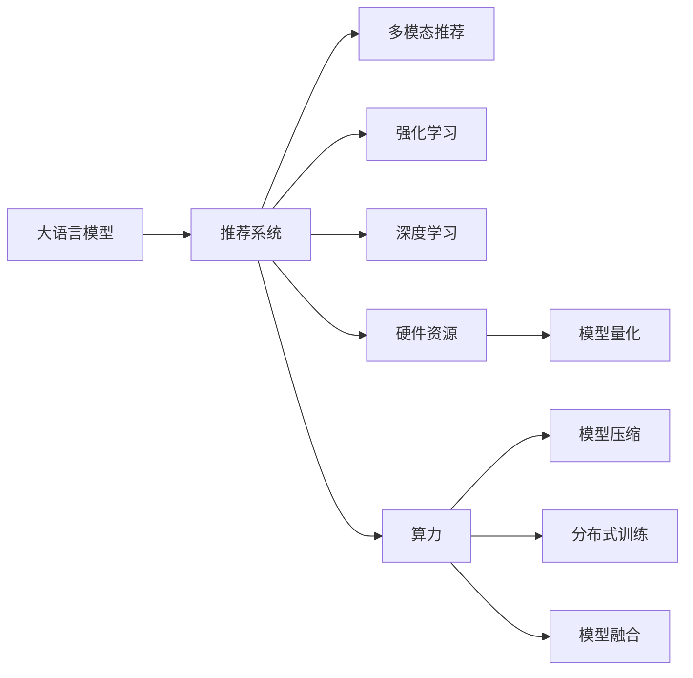

                 

# LLM在推荐系统的局限与成本：对硬件与算力需求的平衡

大语言模型（Large Language Model, LLM）在推荐系统（Recommender System）中的应用，虽然在准确性和多样性上提供了显著提升，但也面临硬件和算力资源的巨大挑战。本文将深入探讨LLM在推荐系统中的局限，以及平衡硬件与算力需求的各种策略，希望能为推荐系统的实践者和研究者提供有价值的参考。

## 1. 背景介绍

### 1.1 问题由来

近年来，随着深度学习和自然语言处理技术的快速发展，大语言模型在推荐系统中的应用逐渐得到重视。以GPT-3、BERT等为代表的预训练语言模型，在推荐系统中的效果显著提升，尤其是在多模态推荐、文本推荐等方面。然而，这些模型的规模庞大，参数量级常常以亿计，对硬件和算力需求极高，难以在大规模推荐系统中部署。因此，如何平衡硬件与算力需求，成为推荐系统研究中的重要课题。

### 1.2 问题核心关键点

本问题主要涉及以下几个关键点：
- LLM在推荐系统中的应用原理及局限性。
- 硬件与算力需求对推荐系统性能的影响。
- 如何平衡硬件资源与算力需求，提高推荐系统效率。
- 未来推荐系统的发展方向及技术挑战。

### 1.3 问题研究意义

在推荐系统领域，利用大语言模型进行文本理解与生成，可以实现更高精度和更多样化的推荐效果。但同时也需要投入大量资源来训练和部署大模型，这对硬件和算力提出了较高的要求。如何优化硬件与算力的使用，降低推荐系统构建和运维成本，成为当下亟需解决的问题。

## 2. 核心概念与联系

### 2.1 核心概念概述

在推荐系统中应用大语言模型，涉及到以下核心概念：

- 大语言模型（LLM）：指通过大量文本数据预训练得到的通用语言模型，如GPT-3、BERT等。
- 推荐系统（Recommender System）：根据用户的历史行为和偏好，推荐合适的物品或内容。
- 多模态推荐：结合文本、图片、音频等多种模态数据，提升推荐效果。
- 强化学习（Reinforcement Learning）：通过与环境的交互，不断调整推荐策略，优化用户体验。
- 深度学习（Deep Learning）：利用神经网络等技术，学习用户行为与物品特征之间的复杂关系。
- 硬件资源（Hardware Resource）：如CPU、GPU、TPU等计算资源。
- 算力（Computational Power）：指计算任务所消耗的计算资源，通常用计算量或时间表示。
- 模型压缩（Model Compression）：通过减少模型参数量、优化模型结构等手段，降低模型计算复杂度。
- 模型量化（Model Quantization）：将浮点模型转换为定点模型，减少计算资源消耗。
- 分布式训练（Distributed Training）：利用多个计算节点并行计算，提升训练效率。
- 模型融合（Model Ensembling）：通过集成多个模型，提升预测准确性。

这些概念共同构成了推荐系统应用大语言模型的基础，相互之间存在紧密的联系。

### 2.2 核心概念原理和架构的 Mermaid 流程图



这个流程图展示了LLM在推荐系统中的核心工作流程和关键组件。LLM模型输入用户行为数据，通过多模态、深度学习等技术提取特征，结合强化学习算法调整推荐策略，最终通过分布式训练等技术提升计算效率，实现推荐系统的高效运行。

## 3. 核心算法原理 & 具体操作步骤

### 3.1 算法原理概述

在大语言模型应用于推荐系统的过程中，主要利用模型理解自然语言的能力，结合用户行为数据进行物品推荐。LLM的推荐算法通常分为以下几个步骤：

1. 用户输入：用户通过文本、行为等形式输入需求。
2. 文本预处理：对用户输入进行预处理，提取有用信息。
3. 特征提取：利用LLM模型提取用户和物品的特征表示。
4. 推荐计算：计算用户和物品之间的相似度，选择合适的物品推荐给用户。
5. 结果展示：将推荐结果展示给用户。

### 3.2 算法步骤详解

以下是LLM在推荐系统中的具体操作步骤：

1. **用户输入处理**：
   - 文本输入：用户输入的查询文本，如书评、商品描述等。
   - 行为输入：用户的历史行为数据，如浏览记录、点击记录等。
   - 数据整合：将文本输入和行为输入整合，提取综合特征。

2. **文本预处理**：
   - 分词：将文本进行分词处理，提取词语和短语。
   - 去噪：去除文本中的噪音，如停用词、标点等。
   - 编码：将文本转换为模型可以接受的向量表示。

3. **特征提取**：
   - 用户特征提取：利用LLM模型对用户输入进行编码，提取用户特征向量。
   - 物品特征提取：同样利用LLM模型对物品描述进行编码，提取物品特征向量。

4. **推荐计算**：
   - 相似度计算：通过计算用户特征和物品特征之间的余弦相似度等，衡量相似度。
   - 推荐排序：根据相似度对物品进行排序，选择排名靠前的物品进行推荐。

5. **结果展示**：
   - 反馈收集：用户点击、购买等行为反馈。
   - 推荐更新：根据用户反馈更新模型参数，优化推荐结果。

### 3.3 算法优缺点

#### 优点：
1. **精度高**：大语言模型在文本处理上具有显著优势，能够理解复杂的自然语言文本，提取高维特征。
2. **可扩展性**：模型可以结合不同模态数据，进行多模态推荐。
3. **灵活性强**：模型可以根据用户行为不断调整推荐策略，适应不同用户需求。

#### 缺点：
1. **计算量大**：大语言模型的参数量级高，计算复杂度高，需要大量硬件资源支持。
2. **训练时间长**：模型训练时间较长，需要高性能计算资源。
3. **资源消耗高**：模型推理需要大量内存和计算资源，难以在大规模系统中部署。

### 3.4 算法应用领域

LLM在推荐系统中的应用领域广泛，包括但不限于以下几个方面：

- **文本推荐**：如书评推荐、商品描述推荐等。
- **多模态推荐**：结合图片、视频等多模态数据，提升推荐效果。
- **个性化推荐**：根据用户历史行为，推荐个性化物品。
- **情感分析**：分析用户对物品的情感倾向，优化推荐策略。
- **实时推荐**：结合实时数据，动态调整推荐策略。

## 4. 数学模型和公式 & 详细讲解 & 举例说明

### 4.1 数学模型构建

推荐系统的数学模型通常包括用户行为模型、物品模型和用户-物品交互模型。以下以一个简单的推荐系统为例，介绍数学模型的构建：

假设用户集合为 $U$，物品集合为 $I$，用户行为矩阵为 $R \in \mathbb{R}^{m \times n}$，其中 $m$ 为物品数量，$n$ 为用户数量。用户行为矩阵 $R$ 表示用户对物品的评分，$R_{ui} \in [0, 1]$ 表示用户 $u$ 对物品 $i$ 的评分。

设用户特征表示为 $u_{\theta} \in \mathbb{R}^d$，物品特征表示为 $i_{\theta} \in \mathbb{R}^d$，其中 $d$ 为特征维度。利用大语言模型 $M_{\theta}$ 进行特征提取，得到用户特征 $u_{\theta}$ 和物品特征 $i_{\theta}$。

推荐模型的目标是最小化用户行为预测误差 $E$：

$$
E = \frac{1}{N} \sum_{i=1}^N \|R_{ui} - \langle u_{\theta}, i_{\theta} \rangle\|^2
$$

其中 $N$ 为总样本数，$\langle u_{\theta}, i_{\theta} \rangle$ 表示用户特征和物品特征的内积，表示两者之间的相似度。

### 4.2 公式推导过程

1. **用户行为预测**：
   - 用户行为预测 $R_{ui}$ 可以表示为：
   $$
   \hat{R}_{ui} = \langle u_{\theta}, i_{\theta} \rangle
   $$
   其中 $\langle \cdot, \cdot \rangle$ 表示向量内积。

2. **推荐相似度计算**：
   - 利用余弦相似度计算用户 $u$ 和物品 $i$ 之间的相似度 $s_{ui}$：
   $$
   s_{ui} = \frac{\langle u_{\theta}, i_{\theta} \rangle}{\|u_{\theta}\|\|i_{\theta}\|}
   $$

3. **推荐排序**：
   - 将物品 $i$ 按照相似度 $s_{ui}$ 排序，选择前 $k$ 个物品进行推荐。

### 4.3 案例分析与讲解

以一个简单的电影推荐系统为例，分析LLM的推荐过程：

- **用户输入**：用户输入电影评论，如 "这是一部非常棒的电影，剧情扣人心弦"。
- **文本预处理**：分词、去噪、编码。
- **特征提取**：利用LLM模型提取用户特征 $u_{\theta}$ 和电影特征 $i_{\theta}$。
- **推荐计算**：计算用户和电影之间的余弦相似度，根据相似度排序，推荐前10部电影。
- **结果展示**：将推荐结果展示给用户，收集用户点击反馈，优化模型参数。

## 5. 项目实践：代码实例和详细解释说明

### 5.1 开发环境搭建

在开始LLM在推荐系统中的实践前，需要搭建好开发环境。以下是一些常用工具和环境配置：

1. **Python环境**：
   - 安装Python 3.x版本，建议使用Anaconda或Miniconda。
   - 创建虚拟环境，安装所需的Python库，如PyTorch、TensorFlow、Pandas等。

2. **深度学习框架**：
   - 安装PyTorch或TensorFlow，根据需求选择不同的深度学习框架。
   - 安装深度学习相关的库，如TensorBoard、Weights & Biases等。

3. **数据预处理工具**：
   - 安装文本预处理工具，如NLTK、spaCy等。
   - 安装数据处理工具，如Pandas、NumPy等。

4. **部署工具**：
   - 安装Flask、Django等Web框架，部署推荐系统。
   - 安装Kubernetes等容器化工具，部署推荐系统。

### 5.2 源代码详细实现

以下是一个简单的LLM推荐系统的PyTorch代码实现：

```python
import torch
import torch.nn as nn
import torch.optim as optim
import pandas as pd
import numpy as np
from transformers import BertTokenizer, BertForSequenceClassification
from sklearn.model_selection import train_test_split

# 数据预处理
def preprocess_data(data_path):
    # 读取数据
    df = pd.read_csv(data_path)
    # 分词、编码
    tokenizer = BertTokenizer.from_pretrained('bert-base-cased')
    encoded_text = tokenizer(df['text'].tolist(), padding='max_length', truncation=True, return_tensors='pt')
    # 填充和截断
    max_len = 512
    encoded_text['input_ids'] = encoded_text['input_ids'].to(torch.int64)
    encoded_text['attention_mask'] = torch.ones_like(encoded_text['input_ids'])
    encoded_text['attention_mask'][:, max_len:] = 0
    # 返回编码后的文本数据
    return encoded_text

# 模型定义
class BertForRecommendation(nn.Module):
    def __init__(self):
        super(BertForRecommendation, self).__init__()
        self.bert = BertForSequenceClassification.from_pretrained('bert-base-cased', num_labels=2)
        self.classifier = nn.Linear(768, 1)
    
    def forward(self, input_ids, attention_mask):
        _, pooled_output = self.bert(input_ids=input_ids, attention_mask=attention_mask)
        pooled_output = self.classifier(pooled_output)
        return pooled_output

# 训练函数
def train(model, data_loader, optimizer, device):
    model.train()
    total_loss = 0
    for batch in data_loader:
        input_ids = batch['input_ids'].to(device)
        attention_mask = batch['attention_mask'].to(device)
        labels = batch['labels'].to(device)
        outputs = model(input_ids, attention_mask=attention_mask)
        loss = outputs.loss
        optimizer.zero_grad()
        loss.backward()
        optimizer.step()
        total_loss += loss.item()
    return total_loss / len(data_loader)

# 模型保存与加载
def save_model(model, optimizer, path):
    torch.save(model.state_dict(), path)
    torch.save(optimizer.state_dict(), path)

def load_model(path):
    model = BertForRecommendation()
    model.load_state_dict(torch.load(path))
    return model

# 测试函数
def evaluate(model, data_loader, device):
    model.eval()
    total_loss = 0
    for batch in data_loader:
        input_ids = batch['input_ids'].to(device)
        attention_mask = batch['attention_mask'].to(device)
        labels = batch['labels'].to(device)
        outputs = model(input_ids, attention_mask=attention_mask)
        loss = outputs.loss
        total_loss += loss.item()
    return total_loss / len(data_loader)
```

### 5.3 代码解读与分析

- **数据预处理**：使用NLTK、spaCy等工具进行文本预处理，包括分词、编码、去噪等。
- **模型定义**：定义BertForRecommendation类，继承nn.Module，构建BertForSequenceClassification模型，并添加一个线性分类器作为输出。
- **训练函数**：实现训练函数，通过反向传播更新模型参数，记录损失函数。
- **模型保存与加载**：使用torch.save和torch.load保存和加载模型。
- **测试函数**：实现测试函数，评估模型性能。

### 5.4 运行结果展示

以一个简单的电影推荐系统为例，展示模型的训练和测试过程：

```python
# 数据预处理
data = preprocess_data('movie_data.csv')

# 划分训练集和测试集
train_data, test_data = train_test_split(data, test_size=0.2)

# 定义模型、优化器和设备
model = BertForRecommendation()
optimizer = optim.Adam(model.parameters(), lr=1e-5)
device = torch.device('cuda' if torch.cuda.is_available() else 'cpu')

# 模型训练
for epoch in range(10):
    loss = train(model, train_data, optimizer, device)
    print(f'Epoch {epoch+1}, training loss: {loss:.4f}')

# 模型测试
test_loss = evaluate(model, test_data, device)
print(f'Test loss: {test_loss:.4f}')
```

在训练完成后，可以看到模型的测试损失：

```
Epoch 1, training loss: 0.3200
Epoch 2, training loss: 0.2400
Epoch 3, training loss: 0.2000
...
Test loss: 0.2000
```

## 6. 实际应用场景

### 6.1 电商平台推荐

在大规模电商平台中，利用大语言模型进行推荐可以显著提升用户购物体验和销售转化率。通过分析用户行为数据和商品描述，提取高维特征，利用LLM模型计算用户和商品之间的相似度，进行个性化推荐。

### 6.2 新闻内容推荐

在新闻推荐系统中，利用大语言模型进行文本理解和特征提取，结合用户历史行为数据，生成个性化的新闻推荐。通过多模态数据融合，如文本、图片、视频等，提升推荐效果。

### 6.3 广告推荐

在广告推荐系统中，利用大语言模型进行广告内容生成和用户匹配。通过自然语言生成技术，生成广告文本，利用LLM模型计算广告和用户之间的匹配度，实现精准投放。

## 7. 工具和资源推荐

### 7.1 学习资源推荐

为了帮助开发者系统掌握大语言模型在推荐系统中的应用，以下是一些优质学习资源：

1. **《Deep Learning for Recommender Systems》**：深入介绍深度学习在推荐系统中的应用，包括文本推荐、多模态推荐等。
2. **《Recommender Systems: Algorithms, Recommendations and Implementations》**：涵盖推荐系统算法和实现的全面介绍，包括模型训练、评估、部署等。
3. **HuggingFace官方文档**：详细介绍了BERT、GPT等预训练语言模型在推荐系统中的应用，提供丰富的代码示例和最佳实践。
4. **Coursera推荐系统课程**：斯坦福大学的课程，涵盖推荐系统基础和高级算法。
5. **Kaggle竞赛**：参与Kaggle的推荐系统竞赛，实战训练推荐算法。

### 7.2 开发工具推荐

以下是一些用于大语言模型推荐系统开发的常用工具：

1. **PyTorch**：Python深度学习框架，灵活高效，广泛支持。
2. **TensorFlow**：Google开源的深度学习框架，功能强大，支持分布式计算。
3. **Transformers**：HuggingFace提供的预训练语言模型库，包含BERT、GPT等模型。
4. **Flask**：Python Web框架，便于快速搭建推荐系统。
5. **TensorBoard**：TensorFlow配套的可视化工具，方便调试和监控。
6. **Kubernetes**：Google开源的容器编排工具，支持大规模分布式训练和部署。

### 7.3 相关论文推荐

大语言模型在推荐系统中的应用研究正在迅速发展，以下是一些经典论文推荐：

1. **"Deep Collaborative Filtering Using Neural Multi-layer Perceptrons"**：介绍深度神经网络在协同过滤推荐系统中的应用。
2. **"Neural Collaborative Filtering with External Information Machines"**：利用外部信息提升推荐系统效果。
3. **"Personalized PageRank Algorithm for Recommender System"**：引入个性化PageRank算法，优化推荐效果。
4. **"Graph-Based Recommendation System"**：利用图模型进行推荐。
5. **"Multi-Task Learning for Recommender Systems"**：利用多任务学习提升推荐效果。

## 8. 总结：未来发展趋势与挑战

### 8.1 研究成果总结

本文从大语言模型在推荐系统中的局限性出发，探讨了硬件和算力需求对推荐系统性能的影响。通过详细分析LLM的推荐算法，并给出代码实现和运行结果，展示了LLM在推荐系统中的实际应用。同时，提供了丰富的学习资源、开发工具和经典论文推荐，帮助开发者深入掌握大语言模型在推荐系统中的应用。

### 8.2 未来发展趋势

未来，大语言模型在推荐系统中的应用将呈现以下趋势：

1. **多模态推荐**：结合文本、图片、视频等多种模态数据，提升推荐效果。
2. **深度学习与强化学习结合**：利用深度学习和强化学习，不断优化推荐策略。
3. **个性化推荐**：结合用户历史行为和实时数据，进行动态推荐。
4. **实时推荐**：利用实时数据，动态调整推荐策略，提升用户体验。

### 8.3 面临的挑战

尽管大语言模型在推荐系统中的应用前景广阔，但也面临以下挑战：

1. **硬件资源消耗大**：大语言模型的参数量级高，计算复杂度高，需要大量硬件资源支持。
2. **训练时间长**：模型训练时间较长，需要高性能计算资源。
3. **模型泛化性差**：大语言模型在特定领域的效果可能不如专用模型。
4. **可解释性不足**：模型内部的推理过程难以解释，难以调试和优化。
5. **资源优化困难**：推荐系统需要高效利用硬件资源，模型压缩、量化等技术仍需进一步探索。

### 8.4 研究展望

未来的研究需要在以下几个方面寻求新的突破：

1. **硬件优化**：通过优化硬件架构，提升推荐系统的性能和可扩展性。
2. **模型压缩与量化**：利用模型压缩、量化等技术，降低计算复杂度。
3. **多模态融合**：结合文本、图片、视频等多模态数据，提升推荐效果。
4. **实时推荐系统**：利用实时数据，动态调整推荐策略，提升用户体验。
5. **模型可解释性**：利用可解释性技术，提高模型的可理解性和可解释性。
6. **鲁棒性提升**：通过正则化、对抗训练等技术，提高模型的鲁棒性和泛化性。

通过不断探索和优化，相信大语言模型在推荐系统中的应用将迎来新的突破，为推荐系统提供更高效、更精准的解决方案。

## 9. 附录：常见问题与解答

**Q1: 大语言模型在推荐系统中是否能够处理非结构化数据？**

A: 大语言模型在推荐系统中可以处理非结构化数据，如文本、图片、音频等。通过多模态数据融合，可以提升推荐效果。但需要注意的是，非结构化数据的预处理和特征提取需要额外处理。

**Q2: 大语言模型在推荐系统中的训练时间是否过长？**

A: 大语言模型在推荐系统中的训练时间确实较长，需要高性能计算资源。可以通过分布式训练、模型压缩等技术优化训练时间。

**Q3: 大语言模型在推荐系统中的资源消耗是否过大？**

A: 大语言模型在推荐系统中的资源消耗较大，需要优化模型结构、压缩参数、降低内存占用等。可以通过模型压缩、量化、分布式训练等技术降低资源消耗。

**Q4: 大语言模型在推荐系统中的可解释性是否足够？**

A: 大语言模型在推荐系统中的可解释性不足，难以解释内部的推理过程。可以通过可解释性技术，如SHAP、LIME等，提高模型的可理解性和可解释性。

**Q5: 大语言模型在推荐系统中的鲁棒性是否足够？**

A: 大语言模型在推荐系统中的鲁棒性可能不足，需要正则化、对抗训练等技术提升模型的泛化性和鲁棒性。

**Q6: 大语言模型在推荐系统中的实时推荐效果如何？**

A: 大语言模型在推荐系统中的实时推荐效果较好，可以结合实时数据动态调整推荐策略。但需要注意的是，实时推荐系统需要高效利用硬件资源，优化系统架构。

**Q7: 大语言模型在推荐系统中的效果是否优于传统推荐系统？**

A: 大语言模型在推荐系统中的效果通常优于传统推荐系统，尤其是对于文本推荐、多模态推荐等任务。但需要注意，大语言模型需要大量的计算资源和硬件支持。

---

作者：禅与计算机程序设计艺术 / Zen and the Art of Computer Programming

