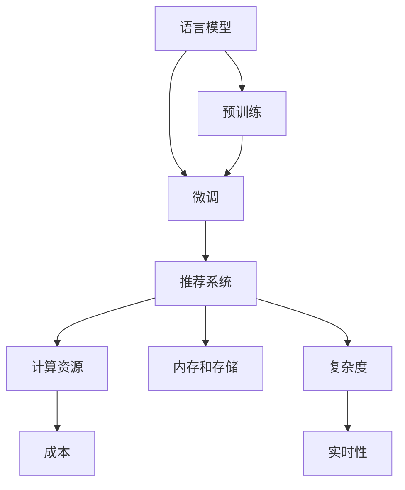

                 

# LLM在推荐系统的局限与成本：对硬件的需求

> 关键词：语言模型,推荐系统,硬件需求,成本,复杂度

## 1. 背景介绍

### 1.1 问题由来

随着人工智能技术的飞速发展，语言模型（Language Models, LMs）在自然语言处理（NLP）领域取得了显著进展。这些模型通过在大规模无标签文本数据上预训练，能够捕捉语言的广泛语义和结构信息，成为现代NLP应用的基础。其中，大规模语言模型（Large Language Models, LLMs）以其强大的泛化能力，广泛应用于文本生成、语义理解、问答系统、对话系统等场景。

在推荐系统中，尤其是基于内容的推荐系统（Content-based Recommendation Systems），也越来越多地引入语言模型。推荐系统旨在根据用户历史行为和系统对物品属性的理解，为用户推荐最相关的物品。传统的推荐算法包括协同过滤、基于内容的推荐、基于混合模型的方法等。然而，这些方法在面对新物品或数据稀疏等问题时，表现往往不尽如人意。近年来，语言模型开始被引入推荐系统，通过理解物品描述与用户偏好的语义关系，提升推荐系统的效果。

然而，虽然语言模型在推荐系统中的应用取得了一定的进展，但同时也暴露出了一些局限性，尤其是在硬件需求和成本方面。本文将深入探讨这些局限性，并提出一些潜在的解决方案。

### 1.2 问题核心关键点

在大规模推荐系统中使用语言模型时，主要面临以下几个关键问题：

- **计算资源需求高**：预训练和微调语言模型的过程需要大量的计算资源，包括高性能GPU、TPU等设备。
- **内存和存储需求大**：模型参数量大，需要大容量内存和存储进行模型训练和推理。
- **复杂度增加**：语言模型的引入增加了推荐系统的计算复杂度，可能对实时推荐系统的响应速度和效率产生影响。
- **可解释性不足**：语言模型的决策过程往往复杂难懂，难以提供清晰的推荐理由，影响用户信任度。

这些问题不仅增加了推荐系统的成本，也对系统的可扩展性和稳定性提出了新的挑战。本文将详细分析这些问题，并探讨如何通过技术手段降低硬件需求，优化系统成本，提升推荐系统的效果。

## 2. 核心概念与联系

### 2.1 核心概念概述

为了更好地理解语言模型在推荐系统中的局限与成本，本节将介绍几个核心概念：

- **语言模型（Language Model）**：通过在大规模无标签文本数据上预训练，学习语言的概率分布模型。常用于文本生成、语义理解、自动问答等NLP任务。
- **推荐系统（Recommendation System）**：根据用户的历史行为和系统对物品属性的理解，为用户推荐最相关的物品。常用于电商、视频、音乐、新闻等应用场景。
- **预训练（Pre-training）**：在大规模无标签数据上对模型进行预训练，学习通用的语言表示。
- **微调（Fine-tuning）**：在预训练模型的基础上，使用下游任务的少量标注数据进行微调，优化模型在特定任务上的性能。
- **模型压缩（Model Compression）**：通过剪枝、量化等技术，减小模型参数和计算复杂度。
- **硬件需求（Hardware Demand）**：指推荐系统中运行语言模型所需的计算资源、内存和存储资源。
- **成本（Cost）**：指推荐系统开发、部署和运行所需的经济投入，包括硬件、软件、人力资源等。

这些概念之间的逻辑关系可以通过以下Mermaid流程图来展示：



这个流程图展示了语言模型在推荐系统中的作用和影响，以及推荐系统运行所需的资源和成本。

## 3. 核心算法原理 & 具体操作步骤

### 3.1 算法原理概述

在推荐系统中使用语言模型，主要是通过理解物品描述与用户偏好的语义关系，提升推荐效果。具体而言，推荐系统通常包含以下几个步骤：

1. **用户建模**：通过用户的历史行为数据（如浏览、购买、评分等），学习用户偏好模型。
2. **物品建模**：通过物品的描述文本，使用语言模型学习物品属性和语义表示。
3. **用户-物品交互**：根据用户偏好模型和物品属性模型，预测用户对物品的评分或点击概率。
4. **推荐生成**：基于预测结果，为用户生成推荐列表。

其中，物品建模和用户-物品交互两个步骤中，语言模型起到了关键作用。物品建模通常通过在预训练语言模型的基础上进行微调，学习物品描述的语义表示。用户-物品交互则通过将用户偏好的语义表示与物品的语义表示进行匹配，预测用户对物品的偏好。

### 3.2 算法步骤详解

以下是语言模型在推荐系统中的具体实现步骤：

1. **数据准备**：收集物品的描述文本数据，并对其进行标注和处理，形成适合模型输入的格式。
2. **模型预训练**：在大规模无标签文本数据上对预训练语言模型进行预训练，学习语言的概率分布。
3. **模型微调**：在物品描述文本数据上对预训练语言模型进行微调，学习物品的语义表示。
4. **模型集成**：将微调后的语言模型与用户偏好模型进行集成，生成推荐结果。
5. **推荐评估**：对推荐结果进行评估，通过A/B测试等方法验证推荐系统的效果。

### 3.3 算法优缺点

使用语言模型进行推荐系统优化，具有以下优点：

- **提升推荐效果**：通过理解物品描述的语义，可以更准确地匹配用户偏好，提升推荐效果。
- **处理新物品**：语言模型可以很好地处理新物品或数据稀疏的情况，提升推荐系统的鲁棒性。
- **适应性强**：语言模型可以适应不同类型的物品描述，如文本、图片、音频等，具有较强的适应性。

然而，也存在一些缺点：

- **计算资源需求高**：预训练和微调语言模型需要大量的计算资源，对硬件要求较高。
- **内存和存储需求大**：模型参数量大，需要大容量内存和存储进行训练和推理。
- **复杂度增加**：语言模型的引入增加了推荐系统的计算复杂度，可能对实时推荐系统的响应速度产生影响。
- **可解释性不足**：语言模型的决策过程复杂，难以提供清晰的推荐理由，影响用户信任度。

### 3.4 算法应用领域

基于语言模型的推荐系统已经在多个领域得到了应用，例如：

- **电商推荐**：根据用户浏览和购买行为，为用户推荐商品。
- **视频推荐**：根据用户观看行为，为用户推荐视频内容。
- **音乐推荐**：根据用户听歌行为，为用户推荐音乐。
- **新闻推荐**：根据用户阅读行为，为用户推荐新闻内容。

此外，基于语言模型的推荐系统还应用于广告投放、社交媒体推荐、智能音箱等领域，为各类应用场景带来了新的推荐思路和方案。

## 4. 数学模型和公式 & 详细讲解 & 举例说明

### 4.1 数学模型构建

在推荐系统中使用语言模型，通常涉及以下几个数学模型：

1. **用户模型**：$P_u$，表示用户$u$对物品$i$的评分概率。
2. **物品模型**：$P_i$，表示物品$i$的语义表示。
3. **用户-物品交互模型**：$P_{ui}$，表示用户$u$对物品$i$的评分概率。

这些模型通常通过神经网络或语言模型进行建模。以下将以基于Transformer的神经网络为例，构建推荐系统中的数学模型。

### 4.2 公式推导过程

以下是基于Transformer的推荐系统的数学模型推导过程：

1. **用户模型**：
   - 假设用户$u$对物品$i$的评分概率为$P_u$，可以表示为：
   $$
   P_u = softmax(\langle \mathbf{U}_u, \mathbf{V}_i \rangle)
   $$
   其中$\mathbf{U}_u$和$\mathbf{V}_i$分别为用户$u$和物品$i$的向量表示。

2. **物品模型**：
   - 假设物品$i$的语义表示为$P_i$，可以表示为：
   $$
   P_i = softmax(\langle \mathbf{U}_i, \mathbf{V}_i \rangle)
   $$
   其中$\mathbf{U}_i$和$\mathbf{V}_i$分别为物品$i$的向量表示。

3. **用户-物品交互模型**：
   - 假设用户$u$对物品$i$的评分概率为$P_{ui}$，可以表示为：
   $$
   P_{ui} = softmax(\langle \mathbf{U}_u, \mathbf{V}_i \rangle)
   $$
   其中$\mathbf{U}_u$和$\mathbf{V}_i$分别为用户$u$和物品$i$的向量表示。

### 4.3 案例分析与讲解

以电商推荐系统为例，说明如何在推荐系统中使用语言模型。假设有一批新的商品需要推荐，每件商品都有对应的描述文本。可以先将这些文本进行分词和向量化处理，然后通过预训练语言模型（如BERT）进行微调，学习商品的语义表示。假设用户$u$的历史行为数据包括浏览过商品$i_1$、$i_2$、$i_3$，可以使用语言模型学习用户$u$对商品的评分概率，即：
$$
P_{u,i_1} = softmax(\langle \mathbf{U}_u, \mathbf{V}_{i_1} \rangle)
$$
$$
P_{u,i_2} = softmax(\langle \mathbf{U}_u, \mathbf{V}_{i_2} \rangle)
$$
$$
P_{u,i_3} = softmax(\langle \mathbf{U}_u, \mathbf{V}_{i_3} \rangle)
$$
其中$\mathbf{U}_u$为用户$u$的向量表示，$\mathbf{V}_{i_1}$、$\mathbf{V}_{i_2}$、$\mathbf{V}_{i_3}$分别为商品$i_1$、$i_2$、$i_3$的向量表示。

通过这些向量表示，可以计算用户$u$对新商品$i_4$的评分概率，即：
$$
P_{u,i_4} = softmax(\langle \mathbf{U}_u, \mathbf{V}_{i_4} \rangle)
$$
其中$\mathbf{V}_{i_4}$为商品$i_4$的向量表示。

最后，根据用户的历史评分数据和新商品的评分概率，为用户推荐最相关的商品。

## 5. 项目实践：代码实例和详细解释说明

### 5.1 开发环境搭建

在进行推荐系统开发前，我们需要准备好开发环境。以下是使用Python进行PyTorch开发的环境配置流程：

1. 安装Anaconda：从官网下载并安装Anaconda，用于创建独立的Python环境。

2. 创建并激活虚拟环境：
```bash
conda create -n pytorch-env python=3.8 
conda activate pytorch-env
```

3. 安装PyTorch：根据CUDA版本，从官网获取对应的安装命令。例如：
```bash
conda install pytorch torchvision torchaudio cudatoolkit=11.1 -c pytorch -c conda-forge
```

4. 安装Transformers库：
```bash
pip install transformers
```

5. 安装各类工具包：
```bash
pip install numpy pandas scikit-learn matplotlib tqdm jupyter notebook ipython
```

完成上述步骤后，即可在`pytorch-env`环境中开始推荐系统开发。

### 5.2 源代码详细实现

以下是一个基于BERT的电商推荐系统的代码实现示例：

```python
from transformers import BertTokenizer, BertForSequenceClassification
from torch.utils.data import Dataset
import torch
from sklearn.metrics import roc_auc_score

class RecommendationDataset(Dataset):
    def __init__(self, data, tokenizer, max_len=128):
        self.data = data
        self.tokenizer = tokenizer
        self.max_len = max_len
        
    def __len__(self):
        return len(self.data)
    
    def __getitem__(self, idx):
        text = self.data[idx]['item_description']
        item_id = self.data[idx]['item_id']
        
        encoding = self.tokenizer(text, return_tensors='pt', max_length=self.max_len, padding='max_length', truncation=True)
        input_ids = encoding['input_ids'][0]
        attention_mask = encoding['attention_mask'][0]
        
        return {'input_ids': input_ids, 
                'attention_mask': attention_mask,
                'item_id': item_id}

# 加载数据集
data = load_data('recommendation_data.json')

# 初始化tokenizer和模型
tokenizer = BertTokenizer.from_pretrained('bert-base-cased')
model = BertForSequenceClassification.from_pretrained('bert-base-cased', num_labels=num_classes)

# 创建dataset
dataset = RecommendationDataset(data, tokenizer)

# 设置优化器和学习率
optimizer = AdamW(model.parameters(), lr=2e-5)

# 训练模型
model.train()
for epoch in range(num_epochs):
    for batch in tqdm(dataset):
        input_ids = batch['input_ids'].to(device)
        attention_mask = batch['attention_mask'].to(device)
        item_id = batch['item_id'].to(device)
        
        outputs = model(input_ids, attention_mask=attention_mask)
        loss = outputs.loss
        loss.backward()
        optimizer.step()

# 评估模型
model.eval()
with torch.no_grad():
    eval_preds, eval_labels = [], []
    for batch in tqdm(dataset):
        input_ids = batch['input_ids'].to(device)
        attention_mask = batch['attention_mask'].to(device)
        item_id = batch['item_id'].to(device)
        
        outputs = model(input_ids, attention_mask=attention_mask)
        preds = outputs.logits.argmax(dim=2).to('cpu').tolist()
        labels = [item_id].to('cpu').tolist()
        for pred in preds:
            eval_preds.append(pred)
        for label in labels:
            eval_labels.append(label)
    
    auc_score = roc_auc_score(eval_labels, eval_preds)
    print(f"AUC Score: {auc_score}")
```

以上代码展示了如何使用BERT进行电商推荐系统的开发。首先，将电商商品的描述文本进行分词和向量化处理，然后使用预训练的BERT模型进行微调，学习商品的语义表示。在训练过程中，通过计算模型输出与真实标签的交叉熵损失，反向传播更新模型参数。最后，在测试集上评估模型性能，通过AUC评分指标衡量推荐效果。

### 5.3 代码解读与分析

下面是代码中几个关键部分的解读与分析：

**`RecommendationDataset`类**：
- 继承自`Dataset`类，定义了推荐数据集的读取和处理方式。
- `__init__`方法：初始化数据、tokenizer和max_len等参数。
- `__len__`方法：返回数据集的长度。
- `__getitem__`方法：对单个样本进行处理，将文本输入编码为token ids，并将item_id保存下来，方便后续使用。

**模型微调**：
- 使用BERT的`BertForSequenceClassification`类进行模型微调。
- 设置优化器和学习率，进行多轮训练，通过计算交叉熵损失更新模型参数。

**评估模型**：
- 在测试集上对模型进行评估，通过计算AUC评分指标，衡量推荐效果。
- 使用`roc_auc_score`函数计算AUC评分。

## 6. 实际应用场景

### 6.1 智能推荐引擎

基于大语言模型的推荐系统可以应用于智能推荐引擎的构建。智能推荐引擎能够根据用户的历史行为和偏好，推荐相关物品，提升用户体验。

在技术实现上，可以收集用户的历史行为数据，如浏览记录、购买记录等，使用预训练的语言模型进行微调，学习用户偏好的语义表示。同时，收集物品的描述文本数据，使用预训练的语言模型进行微调，学习物品属性的语义表示。在推荐时，根据用户和物品的语义表示进行匹配，预测用户对物品的评分，生成推荐列表。

### 6.2 个性化推荐

个性化推荐系统通过分析用户的历史行为和偏好，为用户推荐个性化的物品。在大语言模型的帮助下，个性化推荐系统可以更准确地理解用户偏好的语义，推荐更符合用户需求的物品。

具体而言，个性化推荐系统可以分为两类：基于协同过滤的推荐和基于内容的推荐。协同过滤通过分析用户行为数据，找到相似用户，推荐相似用户喜欢的物品。基于内容的推荐通过分析物品属性，找到与用户偏好相似的物品。在大语言模型的帮助下，这些推荐算法可以更好地处理文本型数据，提升推荐效果。

### 6.3 实时推荐

实时推荐系统能够根据用户的行为实时生成推荐，提升用户体验。在大语言模型的帮助下，实时推荐系统可以更准确地理解用户当前的偏好和需求，生成更相关的推荐。

具体而言，实时推荐系统通常需要快速响应用户的行为变化，生成新的推荐结果。在大语言模型的帮助下，实时推荐系统可以更好地处理动态变化的语义信息，提高推荐的实时性。

## 7. 工具和资源推荐

### 7.1 学习资源推荐

为了帮助开发者系统掌握大语言模型在推荐系统中的应用，这里推荐一些优质的学习资源：

1. **《推荐系统入门与实战》**：该书详细介绍了推荐系统的基本原理和经典算法，并提供了多个案例实现。
2. **《深度学习与推荐系统》**：该书由Google工程师编写，介绍了深度学习在推荐系统中的应用。
3. **《自然语言处理与推荐系统》**：该书将自然语言处理和推荐系统结合，介绍了多种基于语言模型的推荐算法。
4. **Kaggle推荐系统竞赛**：Kaggle平台上有很多推荐系统竞赛，可以参与其中学习推荐算法和模型。
5. **GitHub推荐系统项目**：GitHub上有很多优秀的推荐系统项目，可以参考其代码实现和算法优化。

通过这些资源的学习实践，相信你一定能够快速掌握大语言模型在推荐系统中的应用，并用于解决实际的推荐问题。

### 7.2 开发工具推荐

高效的开发离不开优秀的工具支持。以下是几款用于推荐系统开发的常用工具：

1. **PyTorch**：基于Python的开源深度学习框架，灵活动态的计算图，适合快速迭代研究。大部分预训练语言模型都有PyTorch版本的实现。
2. **TensorFlow**：由Google主导开发的开源深度学习框架，生产部署方便，适合大规模工程应用。同样有丰富的预训练语言模型资源。
3. **Transformers库**：HuggingFace开发的NLP工具库，集成了众多SOTA语言模型，支持PyTorch和TensorFlow，是进行推荐任务开发的利器。
4. **Weights & Biases**：模型训练的实验跟踪工具，可以记录和可视化模型训练过程中的各项指标，方便对比和调优。与主流深度学习框架无缝集成。
5. **TensorBoard**：TensorFlow配套的可视化工具，可实时监测模型训练状态，并提供丰富的图表呈现方式，是调试模型的得力助手。
6. **PyTorch Lightning**：PyTorch的轻量级应用框架，简化模型训练过程，提高开发效率。

合理利用这些工具，可以显著提升推荐系统的开发效率，加快创新迭代的步伐。

### 7.3 相关论文推荐

大语言模型和推荐系统的发展源于学界的持续研究。以下是几篇奠基性的相关论文，推荐阅读：

1. **《用深度学习进行协同过滤》**：该论文首次提出将深度学习应用于协同过滤推荐算法，提出了基于RNN的推荐模型。
2. **《基于协同过滤的推荐系统》**：该论文介绍了基于协同过滤的推荐系统，并提供了一些经典算法实现。
3. **《基于内容的推荐系统》**：该论文介绍了基于内容的推荐系统，并提供了一些经典算法实现。
4. **《深度学习在推荐系统中的应用》**：该论文详细介绍了深度学习在推荐系统中的应用，并提供了一些经典算法实现。
5. **《基于语言模型的推荐系统》**：该论文介绍了基于语言模型的推荐系统，并提供了一些经典算法实现。

这些论文代表了大语言模型在推荐系统中的应用进展，可以帮助研究者把握学科前进方向，激发更多的创新灵感。

## 8. 总结：未来发展趋势与挑战

### 8.1 总结

本文对基于语言模型的推荐系统进行了全面系统的介绍。首先阐述了推荐系统和语言模型的研究背景和意义，明确了语言模型在推荐系统中的应用价值。其次，从原理到实践，详细讲解了推荐系统的数学模型和核心算法，给出了推荐任务开发的完整代码实例。同时，本文还广泛探讨了语言模型在推荐系统中的应用场景，展示了语言模型带来的新思路和方案。

通过本文的系统梳理，可以看到，基于语言模型的推荐系统已经成为推荐系统的重要分支，极大地拓展了推荐系统的应用边界，带来了新的技术思路和创新灵感。

### 8.2 未来发展趋势

展望未来，基于语言模型的推荐系统将呈现以下几个发展趋势：

1. **推荐算法的深度化**：深度学习在推荐系统中的应用将更加广泛，基于深度学习模型的推荐算法将逐步取代传统推荐算法。
2. **推荐系统的智能化**：基于语言模型的推荐系统将更加智能化，能够更好地理解用户偏好的语义，生成更相关的推荐。
3. **推荐系统的个性化**：个性化推荐系统将更加个性化，能够根据用户的动态变化生成实时推荐。
4. **推荐系统的多样化**：推荐系统将不再局限于基于内容的推荐和协同过滤，将探索更多新的推荐算法和模型。
5. **推荐系统的可解释性**：推荐系统的决策过程将更加可解释，用户可以清楚地了解推荐理由，增强信任度。

以上趋势凸显了大语言模型在推荐系统中的广阔前景。这些方向的探索发展，必将进一步提升推荐系统的效果和应用范围，为推荐系统带来新的突破。

### 8.3 面临的挑战

尽管大语言模型在推荐系统中取得了一定的进展，但在迈向更加智能化、普适化应用的过程中，它仍面临着诸多挑战：

1. **计算资源瓶颈**：预训练和微调语言模型需要大量的计算资源，对硬件要求较高。如何降低硬件需求，优化模型性能，是未来亟待解决的问题。
2. **模型复杂度**：语言模型的引入增加了推荐系统的复杂度，可能对实时推荐系统的响应速度产生影响。如何简化模型，提高推理效率，是未来需要解决的问题。
3. **可解释性不足**：语言模型的决策过程复杂，难以提供清晰的推荐理由，影响用户信任度。如何提高模型的可解释性，是未来需要解决的问题。
4. **数据隐私保护**：推荐系统需要处理大量的用户数据，如何保护用户隐私，避免数据泄露，是未来需要解决的问题。

这些问题需要学界和产业界共同努力，通过技术手段进行解决，以进一步推动大语言模型在推荐系统中的应用。

### 8.4 研究展望

面对推荐系统面临的诸多挑战，未来的研究需要在以下几个方面寻求新的突破：

1. **模型压缩技术**：通过剪枝、量化等技术，减小模型参数和计算复杂度，降低硬件需求。
2. **低精度训练**：使用低精度数据类型进行训练，降低计算资源消耗，提高训练效率。
3. **多模态融合**：将视觉、听觉等模态的信息与文本信息进行融合，提升推荐系统的效果。
4. **可解释性增强**：使用可解释模型或技术，增强推荐系统的可解释性，提高用户信任度。
5. **隐私保护技术**：使用差分隐私、联邦学习等技术，保护用户数据隐私，避免数据泄露。

这些研究方向的探索，必将引领推荐系统迈向更高的台阶，为推荐系统带来新的突破。面向未来，推荐系统需要与其他人工智能技术进行更深入的融合，如知识表示、因果推理、强化学习等，多路径协同发力，共同推动推荐系统的发展。

## 9. 附录：常见问题与解答

**Q1：大语言模型在推荐系统中有哪些局限性？**

A: 大语言模型在推荐系统中的局限性主要体现在以下几个方面：

- **计算资源需求高**：预训练和微调语言模型需要大量的计算资源，包括高性能GPU、TPU等设备。
- **内存和存储需求大**：模型参数量大，需要大容量内存和存储进行模型训练和推理。
- **复杂度增加**：语言模型的引入增加了推荐系统的计算复杂度，可能对实时推荐系统的响应速度产生影响。
- **可解释性不足**：语言模型的决策过程复杂，难以提供清晰的推荐理由，影响用户信任度。

这些局限性对推荐系统的开发和部署带来了一定的挑战，需要在未来的研究中进行改进和优化。

**Q2：如何优化大语言模型在推荐系统中的性能？**

A: 优化大语言模型在推荐系统中的性能，可以从以下几个方面进行：

- **模型压缩技术**：通过剪枝、量化等技术，减小模型参数和计算复杂度，降低硬件需求。
- **低精度训练**：使用低精度数据类型进行训练，降低计算资源消耗，提高训练效率。
- **多模态融合**：将视觉、听觉等模态的信息与文本信息进行融合，提升推荐系统的效果。
- **可解释性增强**：使用可解释模型或技术，增强推荐系统的可解释性，提高用户信任度。
- **隐私保护技术**：使用差分隐私、联邦学习等技术，保护用户数据隐私，避免数据泄露。

通过这些优化措施，可以在保证推荐效果的同时，降低硬件需求，提升推荐系统的性能和用户体验。

**Q3：大语言模型在推荐系统中有哪些应用场景？**

A: 大语言模型在推荐系统中可以应用于以下几个场景：

- **智能推荐引擎**：根据用户的历史行为和偏好，推荐相关物品，提升用户体验。
- **个性化推荐**：分析用户的历史行为和偏好，为用户推荐个性化的物品。
- **实时推荐**：根据用户的行为实时生成推荐，提升用户体验。

这些应用场景可以进一步拓展推荐系统的应用边界，提升推荐效果。

**Q4：大语言模型在推荐系统中的计算资源需求高，如何解决？**

A: 解决大语言模型在推荐系统中的计算资源需求高问题，可以从以下几个方面进行：

- **模型压缩技术**：通过剪枝、量化等技术，减小模型参数和计算复杂度，降低硬件需求。
- **低精度训练**：使用低精度数据类型进行训练，降低计算资源消耗，提高训练效率。
- **分布式训练**：使用分布式训练技术，将训练任务分配到多个节点上，提高训练效率。
- **优化算法**：使用优化算法（如Adam、SGD等）进行模型训练，提高训练速度和精度。

通过这些技术手段，可以在保证推荐效果的同时，降低计算资源需求，优化大语言模型在推荐系统中的应用。

**Q5：大语言模型在推荐系统中的内存和存储需求大，如何解决？**

A: 解决大语言模型在推荐系统中的内存和存储需求大问题，可以从以下几个方面进行：

- **模型压缩技术**：通过剪枝、量化等技术，减小模型参数和计算复杂度，降低内存和存储需求。
- **混合精度训练**：使用混合精度训练技术，降低内存消耗，提高训练效率。
- **分布式存储**：使用分布式存储技术，将数据存储到多个节点上，降低存储需求。
- **数据压缩**：使用数据压缩技术，减小数据量，降低存储需求。

通过这些技术手段，可以在保证推荐效果的同时，降低内存和存储需求，优化大语言模型在推荐系统中的应用。

