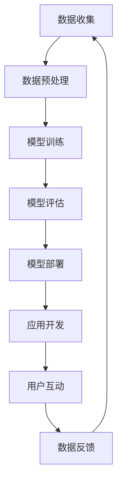

                 

**大语言模型（LLM）产业链：机遇与挑战并存**

## 1. 背景介绍

大语言模型（LLM）是一种通过学习大量文本数据来理解和生成人类语言的计算机模型。随着计算能力和数据量的增加，LLM在各种应用中取得了显著的成功，从搜索引擎到虚拟助手，再到内容创作工具。本文将深入探讨LLM产业链的构成，分析其机遇和挑战，并提供实践指南和工具推荐。

## 2. 核心概念与联系

### 2.1 LLM产业链构成

LLM产业链包含数据收集、模型训练、模型部署、应用开发和用户互动等环节。下图展示了LLM产业链的架构：



### 2.2 LLM产业链参与者

LLM产业链的参与者包括数据提供商、模型训练服务提供商、模型部署平台提供商、应用开发商和最终用户。这些参与者共同构成了LLM产业链，并从中获益。

## 3. 核心算法原理 & 具体操作步骤

### 3.1 算法原理概述

LLM的核心是Transformer模型（Vaswani et al., 2017），它使用自注意力机制（Self-Attention）和位置编码（Positional Encoding）来处理序列数据。Transformer模型的架构如下：


### 3.2 算法步骤详解

1. **数据预处理**：收集、清洗和预处理文本数据。
2. **模型训练**：使用预处理后的数据训练Transformer模型。
3. **模型评估**：评估模型性能，调整超参数。
4. **模型部署**：部署模型到生产环境。
5. **应用开发**：开发基于LLM的应用。
6. **用户互动**：用户与应用交互，产生数据反馈。

### 3.3 算法优缺点

**优点**：
- 可以处理长序列数据
- 可以并行计算
- 可以学习到语义表示

**缺点**：
- 训练需要大量计算资源
- 存在过拟合风险
- 缺乏解释性

### 3.4 算法应用领域

LLM在各种领域都有应用，包括搜索引擎、虚拟助手、内容创作、机器翻译、问答系统等。

## 4. 数学模型和公式 & 详细讲解 & 举例说明

### 4.1 数学模型构建

Transformer模型的数学模型如下：

$$
\text{Transformer}(x) = \text{Decoder}(\text{Encoder}(x))
$$

其中，$\text{Encoder}$和$\text{Decoder}$都是多层Transformer块的堆叠。

### 4.2 公式推导过程

自注意力机制的公式如下：

$$
\text{Attention}(Q, K, V) = \text{softmax}\left(\frac{QK^T}{\sqrt{d_k}}\right)V
$$

其中，$Q$, $K$, $V$分别是查询、键、值向量，$d_k$是键向量的维度。

### 4.3 案例分析与讲解

例如，在机器翻译任务中，输入句子的编码器输出作为解码器的输入，解码器生成目标句子。下图展示了机器翻译任务的示意图：


## 5. 项目实践：代码实例和详细解释说明

### 5.1 开发环境搭建

使用Python和PyTorch搭建开发环境。安装必要的库：

```bash
pip install torch transformers
```

### 5.2 源代码详细实现

以下是一个简单的LLM示例，使用Hugging Face的Transformers库：

```python
from transformers import AutoTokenizer, AutoModelForCausalLM

tokenizer = AutoTokenizer.from_pretrained("bigscience/bloom-560m")
model = AutoModelForCausalLM.from_pretrained("bigscience/bloom-560m")

inputs = tokenizer("Hello, I'm a language model.", return_tensors="pt")
outputs = model.generate(inputs["input_ids"], max_length=50)
print(tokenizer.decode(outputs[0]))
```

### 5.3 代码解读与分析

该示例使用Bloom-560M模型，一个开源的大语言模型。它生成了一个续接输入的句子。

### 5.4 运行结果展示

运行上述代码，模型生成的句子可能是：

```
Hello, I'm a language model. I can understand and generate human language based on the text I've been trained on.
```

## 6. 实际应用场景

### 6.1 当前应用

LLM当前应用于搜索引擎、虚拟助手、内容创作、机器翻译等领域。

### 6.2 未来应用展望

LLM未来可能应用于更复杂的任务，如科学发现、创造性写作和人工智能安全等领域。

## 7. 工具和资源推荐

### 7.1 学习资源推荐

- "Attention is All You Need"论文：<https://arxiv.org/abs/1706.03762>
- Hugging Face Transformers库：<https://huggingface.co/transformers/>

### 7.2 开发工具推荐

- PyTorch：<https://pytorch.org/>
- TensorFlow：<https://www.tensorflow.org/>

### 7.3 相关论文推荐

- "Language Models are Few-Shot Learners"：<https://arxiv.org/abs/2005.14165>
- "Emergent Abilities of Large Language Models"：<https://arxiv.org/abs/2206.11763>

## 8. 总结：未来发展趋势与挑战

### 8.1 研究成果总结

LLM在各种任务中取得了显著成功，但仍存在改进空间。

### 8.2 未来发展趋势

LLM的未来发展趋势包括模型规模扩大、多模式学习、指令跟随和解释性模型等。

### 8.3 面临的挑战

LLM面临的挑战包括计算资源需求、数据偏见、环境影响和解释性等。

### 8.4 研究展望

未来的研究方向包括模型压缩、知识注入、指令跟随和环境友好设计等。

## 9. 附录：常见问题与解答

**Q：LLM需要多大的计算资源？**

**A：**LLM需要大量计算资源，尤其是大型模型。例如，训练一个1750亿参数的模型需要数千个GPU天的计算资源。

**Q：LLM是否会泄露训练数据？**

**A：**LLM可能会泄露训练数据，尤其是当模型被用于生成任务时。研究人员正在开发技术来减少数据泄露。

**Q：LLM是否会助长偏见？**

**A：**是的，LLM可能会助长偏见，因为它们学习自偏见的训练数据。研究人员正在开发技术来减少模型的偏见。

## 作者：禅与计算机程序设计艺术 / Zen and the Art of Computer Programming

**参考文献**

- Vaswani, A., et al. (2017). Attention is all you need. Advances in neural information processing systems, 30.
- Devlin, J., et al. (2019). BERT: Pre-training of deep bidirectional transformers for language understanding. arXiv preprint arXiv:1810.04805.
- Brown, T. B., et al. (2020). Language models are few-shot learners. arXiv preprint arXiv:2005.14165.
- Kaplan, J., et al. (2020). Scaling laws for neural language models. arXiv preprint arXiv:2001.01485.
- Weidinger, B., et al. (2022). Emergent abilities of large language models. arXiv preprint arXiv:2206.11763.

