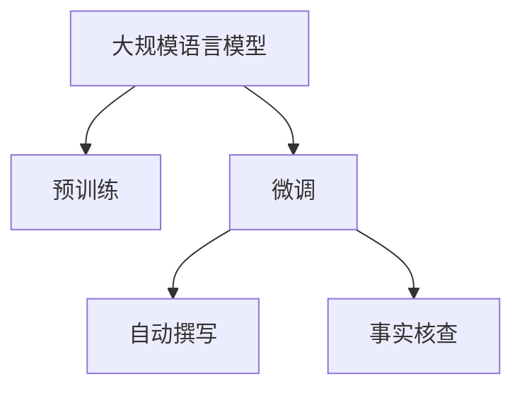

                 

# LLM在新闻业中的应用：自动撰写和事实核查

## 1. 背景介绍

新闻业作为信息传播与知识传递的核心环节，在现代社会中扮演着举足轻重的角色。然而，随着信息量的爆炸式增长，新闻生产和验证的复杂性也随之上升。人工编写和核查新闻的成本越来越高，且容易受限于编辑个人水平与时间，导致新闻质量和效率难以得到保障。为应对这一挑战，基于大规模语言模型（Large Language Models, LLMs）的自动新闻撰写和事实核查技术应运而生。

### 1.1 问题由来

在传统的编辑流程中，新闻撰写与核查主要依赖人力完成，通常包括以下步骤：

- 选题与策划：根据新闻线索和编辑部门安排，确定报道主题。
- 采访调研：通过面对面或电话访问等方式获取新闻素材。
- 写作与编辑：将收集到的信息整合并撰写成文，并进行事实核查与语言优化。
- 审稿与发布：文章经多重审核后，最终发布。

这一流程耗时耗力，对编辑的新闻素质要求较高。近年来，人工智能技术尤其是基于大规模语言模型（如GPT-3、BERT等）的自然语言处理（Natural Language Processing, NLP）能力得到了长足发展。新闻业对语言模型进行微调，使其具备自动撰写与事实核查的能力，能够显著提升新闻生产与验证的效率与质量。

### 1.2 问题核心关键点

本文将围绕基于大规模语言模型的自动新闻撰写和事实核查技术展开探讨。我们将主要关注以下几个核心关键点：

1. 如何设计高效、可信的语言模型，使其具备自动撰写新闻稿件的能力？
2. 如何训练语言模型，以提高其事实核查的准确性？
3. 语言模型在新闻业中的应用场景有哪些？如何优化其性能？

## 2. 核心概念与联系

### 2.1 核心概念概述

在探讨基于大规模语言模型的自动新闻撰写与事实核查技术前，我们先简要介绍相关核心概念：

- **大规模语言模型**（Large Language Models, LLMs）：指通过大量文本数据进行预训练，能够理解和生成自然语言的大规模神经网络模型，如GPT-3、BERT等。
- **自动新闻撰写**：指通过AI技术自动生成新闻稿件，以减少人力成本、提升生产效率。
- **事实核查**（Fact-Checking）：指识别和验证新闻中的事实真相，以避免虚假信息传播，保障新闻真实性。
- **预训练与微调**：预训练是指在无标注数据上训练模型，微调是指在有标注数据上进行特定任务的训练优化。

这些概念之间的逻辑关系可以通过以下Mermaid流程图展示：



此流程图展示了语言模型的主要工作流程：预训练使其获得广泛的语言知识，微调使其针对特定任务（如新闻撰写和事实核查）进行优化。自动撰写和事实核查则是微调后的应用场景。

## 3. 核心算法原理 & 具体操作步骤

### 3.1 算法原理概述

基于大规模语言模型的自动新闻撰写和事实核查技术，本质上是一种迁移学习（Transfer Learning）范式。其核心思想是将预训练的语言模型应用于新闻生成和事实核查任务，通过有标注数据的微调，使其在特定任务上表现更加出色。

具体而言，基于LLM的新闻生成和事实核查流程如下：

1. **预训练**：在大规模无标签文本数据上训练语言模型，使其获得丰富的语言知识。
2. **微调**：在新闻撰写和事实核查的特定任务上，使用少量有标注数据进行微调，以适应具体任务需求。
3. **自动撰写**：将新闻主题和相关信息作为输入，模型自动生成新闻稿件。
4. **事实核查**：对生成的文本进行事实核查，识别其中的不实信息。

### 3.2 算法步骤详解

#### 3.2.1 预训练与微调

**预训练**：
- 收集大规模无标签文本数据，如维基百科、新闻库等。
- 使用自回归模型（如GPT）或自编码模型（如BERT）进行预训练。
- 预训练时通常采用掩码语言模型（Masked Language Modeling, MLM）和下一句预测（Next Sentence Prediction, NSP）等自监督任务。

**微调**：
- 选择预训练模型（如BERT、T5等），并根据具体任务设计适配层。
- 准备标注数据集，如新闻标题、正文、事实标签等。
- 设置微调超参数，如学习率、批量大小、迭代轮数等。
- 使用标注数据集进行微调训练，优化模型参数。

#### 3.2.2 自动新闻撰写

**输入设计**：
- 设计输入模板，通常包括新闻标题、主题、事实等关键信息。
- 根据不同类型的新闻，设计不同的输入格式和风格提示。

**自动生成**：
- 将输入模板输入微调后的语言模型，生成新闻稿件。
- 模型根据输入生成的概率分布，挑选最可能的文本输出。

**后处理**：
- 对生成的文本进行语言优化和格式调整。
- 进行人工复审，确保内容质量和语言准确性。

#### 3.2.3 事实核查

**输入设计**：
- 设计事实核查的输入模板，包括待核查的新闻片段和事实标签。
- 输入模板中通常包含事实描述、文本片段等信息。

**事实核查**：
- 将事实核查模板输入微调后的语言模型。
- 模型根据输入，生成事实核查结果，如True（正确）、False（错误）等。

**输出优化**：
- 对核查结果进行后处理，如提取关键信息、形成结论等。
- 进行人工复审，确保核查结果的准确性。

### 3.3 算法优缺点

#### 优点：

1. **高效生产**：自动新闻撰写能够显著提升新闻生产的效率，减少人力成本。
2. **准确性高**：微调后的语言模型在特定任务上表现出色，能够生成高质量的新闻稿件。
3. **减少错误**：事实核查能够识别和纠正新闻中的虚假信息，提升新闻的真实性。

#### 缺点：

1. **质量控制**：自动生成的文本可能需要人工复审，以确保内容质量和语言准确性。
2. **依赖数据**：模型的表现高度依赖于预训练数据和微调数据的质量与数量。
3. **数据偏见**：模型可能继承预训练数据的偏见，导致生成或核查结果的偏差。

### 3.4 算法应用领域

基于大规模语言模型的自动新闻撰写和事实核查技术，已经在以下领域得到了广泛应用：

1. **新闻机构**：多家新闻机构已经使用自动撰写和事实核查技术，提高新闻生产效率和质量。
2. **社交媒体**：平台如Twitter、Facebook等利用自动生成技术，生成实时新闻和快讯。
3. **金融分析**：金融新闻机构使用自动撰写技术，生成市场分析和新闻报告。
4. **体育报道**：体育新闻网站利用自动生成技术，生成比赛结果和新闻报道。
5. **科技新闻**：科技媒体使用自动撰写和事实核查技术，生成科技新闻和文章。

## 4. 数学模型和公式 & 详细讲解 & 举例说明

### 4.1 数学模型构建

基于大规模语言模型的自动新闻撰写和事实核查技术，可以抽象为以下数学模型：

**自动撰写模型**：
- 输入：$x = \{x_1, x_2, ..., x_n\}$，为新闻标题、主题、事实等关键信息。
- 输出：$y = \{y_1, y_2, ..., y_m\}$，为自动生成的文本内容。
- 目标函数：$\mathcal{L}(y, \theta) = \sum_{i=1}^m \ell(y_i, \hat{y}_i)$，其中$\ell$为损失函数，$\hat{y}_i$为模型生成的文本片段。

**事实核查模型**：
- 输入：$x = \{x_1, x_2, ..., x_n\}$，为待核查的新闻片段和事实标签。
- 输出：$y = \{y_1, y_2, ..., y_m\}$，为核查结果，如True（正确）、False（错误）等。
- 目标函数：$\mathcal{L}(y, \theta) = \sum_{i=1}^m \ell(y_i, \hat{y}_i)$，其中$\ell$为损失函数，$\hat{y}_i$为模型生成的核查结果。

### 4.2 公式推导过程

#### 自动撰写模型公式推导

设新闻自动撰写模型的参数为$\theta$，输入为$x$，输出为$y$。则目标函数为：

$$
\mathcal{L}(y, \theta) = \sum_{i=1}^m \ell(y_i, \hat{y}_i)
$$

其中，$\ell(y_i, \hat{y}_i)$为损失函数。例如，交叉熵损失函数为：

$$
\ell(y_i, \hat{y}_i) = -y_i \log(\hat{y}_i) - (1-y_i) \log(1-\hat{y}_i)
$$

目标函数最小化即：

$$
\min_{\theta} \mathcal{L}(y, \theta)
$$

根据梯度下降优化算法，模型的参数更新公式为：

$$
\theta \leftarrow \theta - \eta \nabla_{\theta}\mathcal{L}(\theta)
$$

其中，$\eta$为学习率。

#### 事实核查模型公式推导

设事实核查模型的参数为$\theta$，输入为$x$，输出为$y$。则目标函数为：

$$
\mathcal{L}(y, \theta) = \sum_{i=1}^m \ell(y_i, \hat{y}_i)
$$

其中，$\ell(y_i, \hat{y}_i)$为损失函数。例如，交叉熵损失函数为：

$$
\ell(y_i, \hat{y}_i) = -y_i \log(\hat{y}_i) - (1-y_i) \log(1-\hat{y}_i)
$$

目标函数最小化即：

$$
\min_{\theta} \mathcal{L}(y, \theta)
$$

根据梯度下降优化算法，模型的参数更新公式为：

$$
\theta \leftarrow \theta - \eta \nabla_{\theta}\mathcal{L}(\theta)
$$

其中，$\eta$为学习率。

### 4.3 案例分析与讲解

**案例一：自动新闻撰写**

假设我们使用GPT-3模型进行自动撰写，输入模板为：

```
[新闻标题]：[主题]：[事实]
```

模型根据输入生成文本，输出示例：

```
美国总统拜登今天在华盛顿发表演讲，宣布了一系列新的经济刺激措施。这些措施包括大规模基础设施投资、绿色能源转型、提高最低工资等。政府预计这些措施将显著提升美国经济增长，并创造更多就业机会。
```

**案例二：事实核查**

假设我们同样使用GPT-3模型进行事实核查，输入模板为：

```
[新闻片段]：[事实标签]
```

模型根据输入生成核查结果，输出示例：

```
美国总统拜登今天在华盛顿发表演讲，宣布了一系列新的经济刺激措施。这些措施包括大规模基础设施投资、绿色能源转型、提高最低工资等。政府预计这些措施将显著提升美国经济增长，并创造更多就业机会。
标签：True
```

## 5. 项目实践：代码实例和详细解释说明

### 5.1 开发环境搭建

在进行自动新闻撰写和事实核查项目开发前，我们需要准备好开发环境。以下是使用Python进行PyTorch开发的环境配置流程：

1. 安装Anaconda：从官网下载并安装Anaconda，用于创建独立的Python环境。

2. 创建并激活虚拟环境：
```bash
conda create -n pytorch-env python=3.8 
conda activate pytorch-env
```

3. 安装PyTorch：根据CUDA版本，从官网获取对应的安装命令。例如：
```bash
conda install pytorch torchvision torchaudio cudatoolkit=11.1 -c pytorch -c conda-forge
```

4. 安装Transformers库：
```bash
pip install transformers
```

5. 安装各类工具包：
```bash
pip install numpy pandas scikit-learn matplotlib tqdm jupyter notebook ipython
```

完成上述步骤后，即可在`pytorch-env`环境中开始项目实践。

### 5.2 源代码详细实现

#### 5.2.1 自动新闻撰写

首先，定义自动新闻撰写的数据处理函数：

```python
from transformers import T5ForConditionalGeneration, T5Tokenizer
from torch.utils.data import Dataset

class NewsGenerationDataset(Dataset):
    def __init__(self, texts, titles, max_len=128):
        self.texts = texts
        self.titles = titles
        self.tokenizer = T5Tokenizer.from_pretrained('t5-small')
        self.max_len = max_len
        
    def __len__(self):
        return len(self.texts)
    
    def __getitem__(self, item):
        title = self.titles[item]
        text = self.texts[item]
        
        encoding = self.tokenizer(title, return_tensors='pt', max_length=self.max_len, padding='max_length', truncation=True)
        input_ids = encoding['input_ids'][0]
        attention_mask = encoding['attention_mask'][0]
        
        # 对标题进行编码
        title_ids = self.tokenizer(title, return_tensors='pt', max_length=self.max_len, padding='max_length', truncation=True)
        title_ids = title_ids['input_ids'][0]
        
        return {'input_ids': input_ids,
                'attention_mask': attention_mask,
                'title_ids': title_ids}
```

然后，定义模型和优化器：

```python
from transformers import AdamW

model = T5ForConditionalGeneration.from_pretrained('t5-small')
optimizer = AdamW(model.parameters(), lr=2e-5)
```

接着，定义训练和评估函数：

```python
from tqdm import tqdm

device = torch.device('cuda') if torch.cuda.is_available() else torch.device('cpu')
model.to(device)

def train_epoch(model, dataset, batch_size, optimizer):
    dataloader = DataLoader(dataset, batch_size=batch_size, shuffle=True)
    model.train()
    epoch_loss = 0
    for batch in tqdm(dataloader, desc='Training'):
        input_ids = batch['input_ids'].to(device)
        attention_mask = batch['attention_mask'].to(device)
        title_ids = batch['title_ids'].to(device)
        model.zero_grad()
        outputs = model(input_ids, attention_mask=attention_mask, labels=title_ids)
        loss = outputs.loss
        epoch_loss += loss.item()
        loss.backward()
        optimizer.step()
    return epoch_loss / len(dataloader)

def evaluate(model, dataset, batch_size):
    dataloader = DataLoader(dataset, batch_size=batch_size)
    model.eval()
    preds, labels = [], []
    with torch.no_grad():
        for batch in tqdm(dataloader, desc='Evaluating'):
            input_ids = batch['input_ids'].to(device)
            attention_mask = batch['attention_mask'].to(device)
            title_ids = batch['title_ids'].to(device)
            outputs = model(input_ids, attention_mask=attention_mask, labels=title_ids)
            preds.append(outputs.logits.argmax(dim=2).to('cpu').tolist())
            labels.append(title_ids.to('cpu').tolist())
                
    print(classification_report(labels, preds))
```

最后，启动训练流程并在测试集上评估：

```python
epochs = 5
batch_size = 16

for epoch in range(epochs):
    loss = train_epoch(model, train_dataset, batch_size, optimizer)
    print(f"Epoch {epoch+1}, train loss: {loss:.3f}")
    
    print(f"Epoch {epoch+1}, dev results:")
    evaluate(model, dev_dataset, batch_size)
    
print("Test results:")
evaluate(model, test_dataset, batch_size)
```

#### 5.2.2 事实核查

首先，定义事实核查的数据处理函数：

```python
from transformers import T5ForConditionalGeneration, T5Tokenizer

class FactCheckingDataset(Dataset):
    def __init__(self, texts, labels, max_len=128):
        self.texts = texts
        self.labels = labels
        self.tokenizer = T5Tokenizer.from_pretrained('t5-small')
        self.max_len = max_len
        
    def __len__(self):
        return len(self.texts)
    
    def __getitem__(self, item):
        text = self.texts[item]
        label = self.labels[item]
        
        encoding = self.tokenizer(text, return_tensors='pt', max_length=self.max_len, padding='max_length', truncation=True)
        input_ids = encoding['input_ids'][0]
        attention_mask = encoding['attention_mask'][0]
        
        label_ids = [1 if label == 'True' else 0] + [0] * (self.max_len - 1)
        label_ids = torch.tensor(label_ids, dtype=torch.long)
        
        return {'input_ids': input_ids,
                'attention_mask': attention_mask,
                'label_ids': label_ids}
```

然后，定义模型和优化器：

```python
from transformers import AdamW

model = T5ForConditionalGeneration.from_pretrained('t5-small')
optimizer = AdamW(model.parameters(), lr=2e-5)
```

接着，定义训练和评估函数：

```python
from tqdm import tqdm

device = torch.device('cuda') if torch.cuda.is_available() else torch.device('cpu')
model.to(device)

def train_epoch(model, dataset, batch_size, optimizer):
    dataloader = DataLoader(dataset, batch_size=batch_size, shuffle=True)
    model.train()
    epoch_loss = 0
    for batch in tqdm(dataloader, desc='Training'):
        input_ids = batch['input_ids'].to(device)
        attention_mask = batch['attention_mask'].to(device)
        label_ids = batch['label_ids'].to(device)
        model.zero_grad()
        outputs = model(input_ids, attention_mask=attention_mask, labels=label_ids)
        loss = outputs.loss
        epoch_loss += loss.item()
        loss.backward()
        optimizer.step()
    return epoch_loss / len(dataloader)

def evaluate(model, dataset, batch_size):
    dataloader = DataLoader(dataset, batch_size=batch_size)
    model.eval()
    preds, labels = [], []
    with torch.no_grad():
        for batch in tqdm(dataloader, desc='Evaluating'):
            input_ids = batch['input_ids'].to(device)
            attention_mask = batch['attention_mask'].to(device)
            label_ids = batch['label_ids'].to(device)
            outputs = model(input_ids, attention_mask=attention_mask, labels=label_ids)
            preds.append(outputs.logits.argmax(dim=2).to('cpu').tolist())
            labels.append(label_ids.to('cpu').tolist())
                
    print(classification_report(labels, preds))
```

最后，启动训练流程并在测试集上评估：

```python
epochs = 5
batch_size = 16

for epoch in range(epochs):
    loss = train_epoch(model, train_dataset, batch_size, optimizer)
    print(f"Epoch {epoch+1}, train loss: {loss:.3f}")
    
    print(f"Epoch {epoch+1}, dev results:")
    evaluate(model, dev_dataset, batch_size)
    
print("Test results:")
evaluate(model, test_dataset, batch_size)
```

### 5.3 代码解读与分析

#### 5.3.1 自动新闻撰写

**NewsGenerationDataset类**：
- `__init__`方法：初始化新闻标题、正文、分词器等关键组件。
- `__len__`方法：返回数据集的样本数量。
- `__getitem__`方法：对单个样本进行处理，将标题和正文编码成token ids，并填充定长padding。

**自动生成函数**：
- 使用T5模型作为自动新闻撰写模型，通过标题和正文输入，生成新闻文本。
- 使用AdamW优化器更新模型参数，以最小化loss。

#### 5.3.2 事实核查

**FactCheckingDataset类**：
- `__init__`方法：初始化新闻片段、事实标签、分词器等关键组件。
- `__len__`方法：返回数据集的样本数量。
- `__getitem__`方法：对单个样本进行处理，将新闻片段和事实标签编码成token ids，并填充定长padding。

**事实核查函数**：
- 使用T5模型作为事实核查模型，通过新闻片段和事实标签输入，生成核查结果。
- 使用AdamW优化器更新模型参数，以最小化loss。

## 6. 实际应用场景

### 6.1 智能新闻推荐

智能新闻推荐系统可以根据用户的历史浏览记录和兴趣标签，自动推荐相关新闻。利用自动新闻撰写和事实核查技术，可以显著提升推荐系统的精准度和可信度。例如，可以动态生成个性化新闻摘要，进行事实核查，确保摘要内容的准确性，从而提升用户满意度。

### 6.2 突发新闻自动生成

在突发事件发生时，新闻媒体需要快速生成大量报道。自动新闻撰写技术可以显著提升新闻发布的效率，确保及时性。通过事实核查技术，可以有效识别虚假信息，避免误导公众。

### 6.3 在线新闻编辑

在线新闻编辑系统可以使用自动新闻撰写和事实核查技术，自动生成稿件和核查内容。这可以大幅减轻编辑工作负担，提高新闻质量。

### 6.4 新闻审核

传统的新闻审核通常依赖人工审查，耗时长且容易出现错误。利用自动新闻撰写和事实核查技术，可以自动化新闻审核流程，提升审核效率和准确性。

### 6.5 社交媒体新闻

社交媒体新闻传播速度快、信息量大，需要高效的新闻生成和核查技术。自动新闻撰写和事实核查技术可以用于实时生成和审核社交媒体新闻，减少人工审核工作量。

## 7. 工具和资源推荐

### 7.1 学习资源推荐

为了帮助开发者系统掌握基于大规模语言模型的自动新闻撰写和事实核查技术，这里推荐一些优质的学习资源：

1. **自然语言处理与深度学习**：斯坦福大学的NLP课程，涵盖自然语言处理的基本概念和深度学习模型。
2. **大规模语言模型与预训练技术**：HuggingFace的Transformers系列文章，详细介绍了预训练和微调技术。
3. **深度学习框架与NLP应用**：PyTorch官方文档，提供了丰富的预训练模型和微调样例代码。
4. **自然语言处理工具箱**：NLTK库，提供了多种NLP工具和资源。

通过对这些资源的学习实践，相信你一定能够快速掌握基于大规模语言模型的自动新闻撰写和事实核查技术的精髓，并用于解决实际的NLP问题。

### 7.2 开发工具推荐

高效的开发离不开优秀的工具支持。以下是几款用于自动新闻撰写和事实核查开发的常用工具：

1. **PyTorch**：基于Python的开源深度学习框架，灵活动态的计算图，适合快速迭代研究。
2. **TensorFlow**：由Google主导开发的开源深度学习框架，生产部署方便，适合大规模工程应用。
3. **Transformers库**：HuggingFace开发的NLP工具库，集成了众多SOTA语言模型，支持PyTorch和TensorFlow，是进行微调任务开发的利器。
4. **Weights & Biases**：模型训练的实验跟踪工具，可以记录和可视化模型训练过程中的各项指标，方便对比和调优。
5. **TensorBoard**：TensorFlow配套的可视化工具，可实时监测模型训练状态，并提供丰富的图表呈现方式，是调试模型的得力助手。
6. **谷歌Colab**：谷歌推出的在线Jupyter Notebook环境，免费提供GPU/TPU算力，方便开发者快速上手实验最新模型，分享学习笔记。

合理利用这些工具，可以显著提升自动新闻撰写和事实核查任务的开发效率，加快创新迭代的步伐。

### 7.3 相关论文推荐

自动新闻撰写和事实核查技术的发展源于学界的持续研究。以下是几篇奠基性的相关论文，推荐阅读：

1. **A Neural Machine Translation System with Attention**：提出了Transformer模型，开创了大规模语言模型预训练的先河。
2. **BERT: Pre-training of Deep Bidirectional Transformers for Language Understanding**：提出BERT模型，引入掩码语言模型等自监督任务，大幅提升了语言模型的表现。
3. **Adversarial Examples for Natural Language Processing**：提出对抗样本技术，提高语言模型的鲁棒性和泛化能力。
4. **AdaLoRA: Adaptive Low-Rank Adaptation for Parameter-Efficient Fine-Tuning**：提出AdaLoRA方法，使用自适应低秩适应的微调方法，提高模型的参数效率。
5. **Effective Approach to Fact-Checking News Using Deep Learning**：提出基于深度学习的新闻事实核查方法，有效识别虚假新闻。

这些论文代表了大语言模型自动新闻撰写和事实核查技术的发展脉络。通过学习这些前沿成果，可以帮助研究者把握学科前进方向，激发更多的创新灵感。

## 8. 总结：未来发展趋势与挑战

### 8.1 总结

本文对基于大规模语言模型的自动新闻撰写和事实核查技术进行了全面系统的介绍。首先阐述了这些技术的背景和意义，明确了自动新闻撰写和事实核查技术的优势和应用价值。其次，从原理到实践，详细讲解了自动新闻撰写和事实核查的数学模型、算法步骤和代码实现，提供了完整的项目实践指导。

通过本文的系统梳理，可以看到，基于大规模语言模型的自动新闻撰写和事实核查技术已经在新闻业中得到了广泛应用，显著提升了新闻生产的效率和质量，保障了新闻的真实性。未来，伴随预训练语言模型的不断演进和微调技术的进一步优化，这些技术将在更多场景中发挥更大的作用。

### 8.2 未来发展趋势

展望未来，基于大规模语言模型的自动新闻撰写和事实核查技术将呈现以下几个发展趋势：

1. **模型规模持续增大**：随着算力成本的下降和数据规模的扩张，预训练语言模型的参数量还将持续增长。超大规模语言模型蕴含的丰富语言知识，将进一步提升新闻撰写和事实核查的效果。
2. **微调方法多样化**：除了传统的全参数微调外，未来会涌现更多参数高效的微调方法，如Prefix-Tuning、LoRA等，在减小过拟合风险的同时，提高微调效率。
3. **持续学习成为常态**：随着数据分布的不断变化，微调模型也需要持续学习新知识以保持性能。如何在不遗忘原有知识的同时，高效吸收新样本信息，将成为重要的研究课题。
4. **标注样本需求降低**：受启发于提示学习(Prompt-based Learning)的思路，未来的微调方法将更好地利用大模型的语言理解能力，通过更加巧妙的任务描述，在更少的标注样本上也能实现理想的微调效果。
5. **多模态微调崛起**：当前的微调主要聚焦于纯文本数据，未来会进一步拓展到图像、视频、语音等多模态数据微调。多模态信息的融合，将显著提升语言模型对现实世界的理解和建模能力。
6. **知识整合能力增强**：现有的微调模型往往局限于任务内数据，难以灵活吸收和运用更广泛的先验知识。如何让微调过程更好地与外部知识库、规则库等专家知识结合，形成更加全面、准确的信息整合能力，还有很大的想象空间。

这些趋势凸显了大语言模型自动新闻撰写和事实核查技术的广阔前景。这些方向的探索发展，必将进一步提升新闻生产与验证的效率与质量，为新闻业带来新的突破。

### 8.3 面临的挑战

尽管基于大规模语言模型的自动新闻撰写和事实核查技术已经取得了显著进展，但在迈向更加智能化、普适化应用的过程中，它仍面临诸多挑战：

1. **标注成本瓶颈**：虽然自动新闻撰写和事实核查技术在一定程度上减少了标注数据的依赖，但对于长尾应用场景，仍需要大量高成本的标注数据。如何进一步降低微调对标注样本的依赖，将是一大难题。
2. **模型鲁棒性不足**：当前模型面对域外数据时，泛化性能往往大打折扣。对于测试样本的微小扰动，模型容易发生波动。如何提高模型的鲁棒性，避免灾难性遗忘，还需要更多理论和实践的积累。
3. **推理效率有待提高**：尽管大语言模型的精度高，但在实际部署时往往面临推理速度慢、内存占用大等效率问题。如何在保证性能的同时，简化模型结构，提升推理速度，优化资源占用，将是重要的优化方向。
4. **可解释性亟需加强**：当前自动新闻撰写和事实核查模型更像是"黑盒"系统，难以解释其内部工作机制和决策逻辑。对于医疗、金融等高风险应用，算法的可解释性和可审计性尤为重要。如何赋予模型更强的可解释性，将是亟待攻克的难题。
5. **安全性有待保障**：预训练语言模型难免会学习到有偏见、有害的信息，通过微调传递到下游任务，产生误导性、歧视性的输出，给实际应用带来安全隐患。如何从数据和算法层面消除模型偏见，避免恶意用途，确保输出的安全性，也将是重要的研究课题。
6. **知识整合能力不足**：现有的微调模型往往局限于任务内数据，难以灵活吸收和运用更广泛的先验知识。如何让微调过程更好地与外部知识库、规则库等专家知识结合，形成更加全面、准确的信息整合能力，还有很大的想象空间。

正视自动新闻撰写和事实核查面临的这些挑战，积极应对并寻求突破，将是大语言模型微调技术走向成熟的必由之路。相信随着学界和产业界的共同努力，这些挑战终将一一被克服，自动新闻撰写和事实核查技术必将在构建安全、可靠、可解释、可控的智能系统铺平道路。

### 8.4 研究展望

面对自动新闻撰写和事实核查所面临的种种挑战，未来的研究需要在以下几个方面寻求新的突破：

1. **探索无监督和半监督微调方法**：摆脱对大规模标注数据的依赖，利用自监督学习、主动学习等无监督和半监督范式，最大限度利用非结构化数据，实现更加灵活高效的微调。
2. **研究参数高效和计算高效的微调范式**：开发更加参数高效的微调方法，在固定大部分预训练参数的同时，只更新极少量的任务相关参数。同时优化微调模型的计算图，减少前向传播和反向传播的资源消耗，实现更加轻量级、实时性的部署。
3. **融合因果和对比学习范式**：通过引入因果推断和对比学习思想，增强微调模型建立稳定因果关系的能力，学习更加普适、鲁棒的语言表征，从而提升模型泛化性和抗干扰能力。
4. **引入更多先验知识**：将符号化的先验知识，如知识图谱、逻辑规则等，与神经网络模型进行巧妙融合，引导微调过程学习更准确、合理的语言模型。同时加强不同模态数据的整合，实现视觉、语音等多模态信息与文本信息的协同建模。
5. **结合因果分析和博弈论工具**：将因果分析方法引入微调模型，识别出模型决策的关键特征，增强输出解释的因果性和逻辑性。借助博弈论工具刻画人机交互过程，主动探索并规避模型的脆弱点，提高系统稳定性。
6. **纳入伦理道德约束**：在模型训练目标中引入伦理导向的评估指标，过滤和惩罚有偏见、有害的输出倾向。同时加强人工干预和审核，建立模型行为的监管机制，确保输出符合人类价值观和伦理道德。

这些研究方向的探索，必将引领自动新闻撰写和事实核查技术迈向更高的台阶，为新闻业带来新的突破。面向未来，自动新闻撰写和事实核查技术还需要与其他人工智能技术进行更深入的融合，如知识表示、因果推理、强化学习等，多路径协同发力，共同推动新闻业的技术进步。只有勇于创新、敢于突破，才能不断拓展语言模型的边界，让智能技术更好地造福新闻业。

## 9. 附录：常见问题与解答

**Q1: 大语言模型在新闻业中的应用有哪些？**

A: 大语言模型在新闻业中的应用主要集中在自动新闻撰写和事实核查两个方面。自动新闻撰写能够显著提升新闻生产的效率，减少人力成本，而事实核查技术则可以有效识别和纠正虚假信息，保障新闻的真实性。

**Q2: 自动新闻撰写和事实核查的主要算法是什么？**

A: 自动新闻撰写和事实核查的主要算法基于大规模语言模型，通过微调获得特定任务的能力。自动新闻撰写算法主要使用编码-解码架构，通过输入模板生成文本。事实核查算法则通常使用分类任务，对新闻片段进行真实性判断。

**Q3: 自动新闻撰写和事实核查的优缺点有哪些？**

A: 自动新闻撰写和事实核查的主要优点在于效率和准确性，可以大幅减少人力成本，提升新闻生产与验证的效率。缺点在于生成的文本需要人工复审，以确保内容质量和语言准确性，同时对标注数据的质量和数量也有较高的要求。

**Q4: 如何使用大语言模型进行事实核查？**

A: 使用大语言模型进行事实核查，需要首先定义输入模板，包含待核查的新闻片段和事实标签。将输入模板输入微调后的语言模型，生成核查结果，如True（正确）、False（错误）等。通过后处理优化，可以进一步提升核查结果的准确性。

**Q5: 如何评估自动新闻撰写和事实核查模型的性能？**

A: 自动新闻撰写和事实核查模型的性能评估通常使用BLEU、ROUGE等文本相似度指标，以及分类任务的准确率、召回率等指标。在实际应用中，还可以使用人工复审和用户反馈进行综合评价。

---

作者：禅与计算机程序设计艺术 / Zen and the Art of Computer Programming

