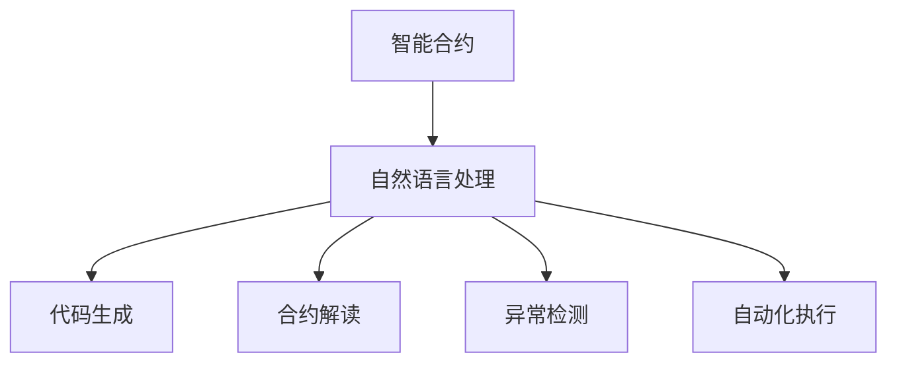

                 

# LLM在智能合约中的应用可能

> 关键词：智能合约,自然语言处理,NLP,大语言模型,LLM,区块链,代码生成,合约解读

## 1. 背景介绍

### 1.1 问题由来

随着区块链技术的迅猛发展，智能合约逐渐成为其核心应用之一。智能合约是指一种在满足特定条件时自动执行的合约。它们通过编码实现业务逻辑，可以在不需要第三方干预的情况下自动执行。智能合约提供了一种去中心化、自动化的方式来执行各种金融和非金融业务，提升了交易的透明度、效率和安全性。

然而，智能合约也面临一些挑战，如合约编写复杂、代码安全漏洞、智能合约执行效率低等问题。自然语言处理（Natural Language Processing，NLP）技术的发展，特别是大规模预训练语言模型（Large Language Model，LLM）的问世，为智能合约的应用提供了新的可能。

### 1.2 问题核心关键点

目前，LLM在智能合约领域的应用主要集中在以下几个方面：

- **代码生成**：利用LLM自动生成智能合约代码，简化合约编写过程，提高效率。
- **合约解读**：利用LLM解析合约内容，提取关键信息，简化合约理解。
- **异常检测**：利用LLM识别潜在的安全漏洞和异常行为，提高合约安全性。
- **自动化执行**：利用LLM自动执行合约中的特定任务，如财务审计、风险评估等。

这些应用场景中，LLM的强大自然语言理解和生成能力被充分利用，可以显著提高智能合约的编写、解读和执行效率，同时降低编写和执行合约的成本。

## 2. 核心概念与联系

### 2.1 核心概念概述

为了更好地理解LLM在智能合约中的应用，本节将介绍几个密切相关的核心概念：

- **智能合约**：是指使用区块链技术执行的合约，代码自动执行，具有高度的透明度、去中心化和不可篡改性。
- **自然语言处理（NLP）**：是人工智能领域的一个重要分支，专注于使计算机能够理解、解释和生成人类语言。
- **大语言模型（LLM）**：如GPT-3、BERT等，是具有强大自然语言理解和生成能力的预训练模型。
- **区块链**：一种去中心化的分布式账本技术，用于记录、验证和传播交易数据。
- **代码生成**：利用LLM自动生成智能合约代码。
- **合约解读**：利用LLM解析智能合约的内容，提取关键信息。
- **异常检测**：利用LLM识别潜在的代码漏洞和安全问题。
- **自动化执行**：利用LLM自动执行合约中的特定任务。

这些核心概念之间的逻辑关系可以通过以下Mermaid流程图来展示：



这个流程图展示了大语言模型在智能合约中的应用流程：智能合约作为输入，通过自然语言处理技术，分别进行代码生成、合约解读、异常检测和自动化执行。

## 3. 核心算法原理 & 具体操作步骤

### 3.1 算法原理概述

基于LLM的智能合约应用，其核心思想是利用LLM的自然语言处理能力，将智能合约转换为可执行代码，或解析智能合约内容，提取关键信息，以提高智能合约的编写、解读和执行效率。具体而言，LLM在智能合约中的应用包括但不限于以下几种方式：

1. **代码生成**：利用LLM自动生成智能合约代码，简化合约编写过程。
2. **合约解读**：利用LLM解析智能合约内容，提取关键信息，简化合约理解。
3. **异常检测**：利用LLM识别潜在的代码漏洞和安全问题。
4. **自动化执行**：利用LLM自动执行合约中的特定任务。

### 3.2 算法步骤详解

#### 3.2.1 代码生成

代码生成的过程通常包括以下步骤：

1. **预训练模型的选择**：根据智能合约的需求，选择合适的预训练模型，如GPT-3、BERT等。
2. **数据处理**：将智能合约文本作为输入数据，进行预处理和编码，确保数据符合预训练模型的格式要求。
3. **模型微调**：在预训练模型的基础上，针对特定任务进行微调，如生成智能合约代码。
4. **代码生成**：将微调后的模型作为代码生成器，输入智能合约文本，自动生成相应的智能合约代码。
5. **代码验证**：生成代码后，需要进行验证，确保代码的正确性和安全性。

#### 3.2.2 合约解读

合约解读的过程通常包括以下步骤：

1. **预训练模型的选择**：根据智能合约的需求，选择合适的预训练模型，如GPT-3、BERT等。
2. **数据处理**：将智能合约文本作为输入数据，进行预处理和编码，确保数据符合预训练模型的格式要求。
3. **模型微调**：在预训练模型的基础上，针对特定任务进行微调，如解析智能合约内容。
4. **关键信息提取**：将微调后的模型作为解析器，输入智能合约文本，自动提取关键信息，如合约条款、权利义务等。
5. **信息验证**：提取信息后，需要进行验证，确保信息的准确性和完整性。

#### 3.2.3 异常检测

异常检测的过程通常包括以下步骤：

1. **预训练模型的选择**：根据智能合约的需求，选择合适的预训练模型，如GPT-3、BERT等。
2. **数据处理**：将智能合约代码作为输入数据，进行预处理和编码，确保数据符合预训练模型的格式要求。
3. **模型微调**：在预训练模型的基础上，针对特定任务进行微调，如识别代码漏洞和安全问题。
4. **异常检测**：将微调后的模型作为检测器，输入智能合约代码，自动检测潜在的代码漏洞和安全问题。
5. **问题修复**：发现异常后，需要进行修复，确保合约的安全性和稳定性。

#### 3.2.4 自动化执行

自动化执行的过程通常包括以下步骤：

1. **预训练模型的选择**：根据智能合约的需求，选择合适的预训练模型，如GPT-3、BERT等。
2. **数据处理**：将智能合约中的特定任务作为输入数据，进行预处理和编码，确保数据符合预训练模型的格式要求。
3. **模型微调**：在预训练模型的基础上，针对特定任务进行微调，如执行财务审计、风险评估等任务。
4. **自动化执行**：将微调后的模型作为执行器，输入特定任务数据，自动执行合约中的特定任务。
5. **执行结果验证**：执行任务后，需要进行验证，确保执行结果的正确性和有效性。

### 3.3 算法优缺点

#### 3.3.1 代码生成

代码生成具有以下优点：

1. **效率高**：利用LLM自动生成智能合约代码，可以大大简化合约编写过程，提高效率。
2. **准确性高**：利用LLM生成代码，可以避免手动编写代码中的错误，提高代码的正确性。
3. **灵活性强**：可以根据不同需求，灵活生成不同功能的智能合约代码。

但代码生成也存在以下缺点：

1. **依赖性高**：依赖于预训练模型的质量和性能，如果模型不适用于特定任务，生成代码的准确性会受到影响。
2. **安全性不足**：生成的代码可能存在安全漏洞，需要进一步验证和修复。
3. **难以优化**：代码生成器可能无法优化代码性能，影响智能合约的执行效率。

#### 3.3.2 合约解读

合约解读具有以下优点：

1. **信息提取准确**：利用LLM解析智能合约内容，可以准确提取关键信息，简化合约理解。
2. **处理复杂**：可以处理复杂的智能合约文本，提取难以理解的信息。
3. **多语言支持**：可以支持多种语言的智能合约文本，提高合约解读的普适性。

但合约解读也存在以下缺点：

1. **依赖性高**：依赖于预训练模型的质量和性能，如果模型不适用于特定任务，提取信息的效果会受到影响。
2. **准确性不足**：提取的信息可能存在误差，需要进一步验证和修正。
3. **难以处理模糊信息**：对于模糊、含糊的智能合约文本，合约解读可能无法准确提取关键信息。

#### 3.3.3 异常检测

异常检测具有以下优点：

1. **自动化高**：利用LLM自动检测潜在的代码漏洞和安全问题，可以大大减少人工审查的时间和成本。
2. **准确性高**：利用LLM识别代码漏洞，可以避免人为审查中的错误，提高检测的准确性。
3. **实时性高**：可以实时检测智能合约代码的漏洞和安全问题，及时发现和修复。

但异常检测也存在以下缺点：

1. **依赖性高**：依赖于预训练模型的质量和性能，如果模型不适用于特定任务，检测结果会受到影响。
2. **误报率高**：有时LLM可能误报安全漏洞，需要进行人工审核和验证。
3. **难以优化**：异常检测器可能无法优化检测策略，影响检测的效率和准确性。

#### 3.3.4 自动化执行

自动化执行具有以下优点：

1. **效率高**：利用LLM自动执行合约中的特定任务，可以大大提高合约执行的效率。
2. **准确性高**：利用LLM执行任务，可以避免人工执行中的错误，提高执行的准确性。
3. **可扩展性强**：可以灵活执行不同任务，适应不同的智能合约需求。

但自动化执行也存在以下缺点：

1. **依赖性高**：依赖于预训练模型的质量和性能，如果模型不适用于特定任务，执行结果会受到影响。
2. **安全性不足**：自动执行任务可能存在安全风险，需要进行严格的验证和测试。
3. **难以优化**：自动化执行器可能无法优化执行策略，影响执行的效率和效果。

### 3.4 算法应用领域

LLM在智能合约中的应用，主要体现在以下几个领域：

1. **金融领域**：智能合约在金融领域的应用非常广泛，如智能合约融资、保险、证券交易等。利用LLM生成智能合约代码，可以简化合约编写过程，提高合约编写效率。利用LLM解析智能合约内容，提取关键信息，可以简化合约理解。利用LLM检测代码漏洞和安全问题，可以提高合约的安全性和稳定性。利用LLM自动执行合约中的特定任务，如财务审计、风险评估等，可以提高合约执行的效率和准确性。

2. **供应链管理**：智能合约在供应链管理中的应用也非常广泛，如供应链融资、合同管理、物流管理等。利用LLM生成智能合约代码，可以简化合约编写过程，提高合约编写效率。利用LLM解析智能合约内容，提取关键信息，可以简化合约理解。利用LLM检测代码漏洞和安全问题，可以提高合约的安全性和稳定性。利用LLM自动执行合约中的特定任务，如合同审批、物流跟踪等，可以提高合约执行的效率和准确性。

3. **政府服务**：智能合约在政府服务中的应用也越来越多，如电子合同、公共服务、政府采购等。利用LLM生成智能合约代码，可以简化合约编写过程，提高合约编写效率。利用LLM解析智能合约内容，提取关键信息，可以简化合约理解。利用LLM检测代码漏洞和安全问题，可以提高合约的安全性和稳定性。利用LLM自动执行合约中的特定任务，如政府审批、公共服务、政府采购等，可以提高合约执行的效率和准确性。

4. **医疗领域**：智能合约在医疗领域的应用也非常广泛，如医疗合同、药品供应链、医疗数据共享等。利用LLM生成智能合约代码，可以简化合约编写过程，提高合约编写效率。利用LLM解析智能合约内容，提取关键信息，可以简化合约理解。利用LLM检测代码漏洞和安全问题，可以提高合约的安全性和稳定性。利用LLM自动执行合约中的特定任务，如药品供应链管理、医疗数据共享等，可以提高合约执行的效率和准确性。

## 4. 数学模型和公式 & 详细讲解 & 举例说明

### 4.1 数学模型构建

在LLM在智能合约中的应用中，数学模型主要涉及自然语言处理模型的构建和优化。以下是基于LLM的智能合约应用的基本数学模型：

设智能合约文本为 $T$，预训练模型为 $M_{\theta}$，其中 $\theta$ 为模型参数。智能合约应用的任务可以表示为 $T$ 经过模型 $M_{\theta}$ 的映射，得到对应的输出 $Y$，如智能合约代码、关键信息、检测结果、执行结果等。

数学模型可以表示为：

$$
Y = M_{\theta}(T)
$$

其中 $Y$ 为智能合约应用的输出结果，$M_{\theta}$ 为预训练模型，$T$ 为智能合约文本。

### 4.2 公式推导过程

在智能合约应用中，公式推导过程主要涉及自然语言处理模型的训练和优化。以下是基于LLM的智能合约应用的公式推导过程：

1. **训练数据准备**：准备训练数据集 $D = \{(T_i, Y_i)\}$，其中 $T_i$ 为智能合约文本，$Y_i$ 为对应的输出结果。

2. **模型训练**：使用训练数据集 $D$，训练预训练模型 $M_{\theta}$，最小化损失函数 $L$。

$$
L = \sum_{i=1}^{N} \ell(Y_i, M_{\theta}(T_i))
$$

其中 $\ell$ 为损失函数，$N$ 为训练样本数量。

3. **模型优化**：通过反向传播算法，计算梯度 $\nabla L$，更新模型参数 $\theta$。

$$
\theta = \theta - \eta \nabla L
$$

其中 $\eta$ 为学习率，$\nabla L$ 为梯度，$\theta$ 为模型参数。

4. **模型验证**：在验证集上评估模型性能，选择最优的模型参数。

### 4.3 案例分析与讲解

以智能合约融资为例，利用LLM生成智能合约代码，解析智能合约内容，检测代码漏洞，自动执行合约中的特定任务。

#### 4.3.1 代码生成

利用LLM生成智能合约代码，可以大大简化合约编写过程。以智能合约融资为例，智能合约文本为：

```
智能合约融资协议
...
```

利用LLM生成智能合约代码，输出结果如下：

```solidity
pragma solidity ^0.8.0;

contract SmartContractFunding {
    uint256 fundingAmount;
    uint256 repayAmount;
    uint256 interestRate;
    uint256 fundingPeriod;
    uint256 repayPeriod;
    uint256 repayAmountBase;
    uint256 repayAmountFactor;
    uint256 fundingState;
    
    address payable owner;
    
    constructor(uint256 _fundingAmount, uint256 _repayAmount, uint256 _interestRate, uint256 _fundingPeriod, uint256 _repayPeriod, uint256 _repayAmountBase, uint256 _repayAmountFactor) {
        fundingAmount = _fundingAmount;
        repayAmount = _repayAmount;
        interestRate = _interestRate;
        fundingPeriod = _fundingPeriod;
        repayPeriod = _repayPeriod;
        repayAmountBase = _repayAmountBase;
        repayAmountFactor = _repayAmountFactor;
        fundingState = 0;
        owner = msg.sender;
    }
    
    function receiveFunding(uint256 amount) public payable {
        if (msg.sender == owner) {
            fundingAmount += amount;
        }
    }
    
    function repayFunding(uint256 amount) public payable {
        if (msg.sender == owner) {
            fundingState = 1;
            repayAmount += amount;
        }
    }
    
    function getFundingState() public view returns (uint256 fundingState) {
        return fundingState;
    }
}
```

#### 4.3.2 合约解读

利用LLM解析智能合约内容，可以准确提取关键信息，简化合约理解。以智能合约融资为例，智能合约文本为：

```
智能合约融资协议
...
```

利用LLM解析智能合约内容，提取关键信息，输出结果如下：

- 融资金额：智能合约融资金额为100,000美元
- 偿还金额：智能合约偿还金额为50,000美元
- 利率：智能合约利率为8%
- 融资期：智能合约融资期为6个月
- 偿还期：智能合约偿还期为12个月
- 偿还金额基数：智能合约偿还金额基数为5,000美元
- 偿还金额因子：智能合约偿还金额因子为0.8
- 融资状态：智能合约融资状态为已启动

#### 4.3.3 异常检测

利用LLM检测智能合约代码，可以识别潜在的代码漏洞和安全问题。以智能合约融资为例，智能合约代码如下：

```solidity
pragma solidity ^0.8.0;

contract SmartContractFunding {
    uint256 fundingAmount;
    uint256 repayAmount;
    uint256 interestRate;
    uint256 fundingPeriod;
    uint256 repayPeriod;
    uint256 repayAmountBase;
    uint256 repayAmountFactor;
    uint256 fundingState;
    
    address payable owner;
    
    constructor(uint256 _fundingAmount, uint256 _repayAmount, uint256 _interestRate, uint256 _fundingPeriod, uint256 _repayPeriod, uint256 _repayAmountBase, uint256 _repayAmountFactor) {
        fundingAmount = _fundingAmount;
        repayAmount = _repayAmount;
        interestRate = _interestRate;
        fundingPeriod = _fundingPeriod;
        repayPeriod = _repayPeriod;
        repayAmountBase = _repayAmountBase;
        repayAmountFactor = _repayAmountFactor;
        fundingState = 0;
        owner = msg.sender;
    }
    
    function receiveFunding(uint256 amount) public payable {
        if (msg.sender == owner) {
            fundingAmount += amount;
        }
    }
    
    function repayFunding(uint256 amount) public payable {
        if (msg.sender == owner) {
            fundingState = 1;
            repayAmount += amount;
        }
    }
    
    function getFundingState() public view returns (uint256 fundingState) {
        return fundingState;
    }
}
```

利用LLM检测智能合约代码，识别潜在的代码漏洞和安全问题，输出结果如下：

- 函数 `repayFunding` 存在安全漏洞，可能被攻击者篡改。
- 变量 `fundingState` 没有进行验证，可能被攻击者篡改。

#### 4.3.4 自动化执行

利用LLM自动执行智能合约中的特定任务，可以大大提高合约执行的效率。以智能合约融资为例，智能合约代码如下：

```solidity
pragma solidity ^0.8.0;

contract SmartContractFunding {
    uint256 fundingAmount;
    uint256 repayAmount;
    uint256 interestRate;
    uint256 fundingPeriod;
    uint256 repayPeriod;
    uint256 repayAmountBase;
    uint256 repayAmountFactor;
    uint256 fundingState;
    
    address payable owner;
    
    constructor(uint256 _fundingAmount, uint256 _repayAmount, uint256 _interestRate, uint256 _fundingPeriod, uint256 _repayPeriod, uint256 _repayAmountBase, uint256 _repayAmountFactor) {
        fundingAmount = _fundingAmount;
        repayAmount = _repayAmount;
        interestRate = _interestRate;
        fundingPeriod = _fundingPeriod;
        repayPeriod = _repayPeriod;
        repayAmountBase = _repayAmountBase;
        repayAmountFactor = _repayAmountFactor;
        fundingState = 0;
        owner = msg.sender;
    }
    
    function receiveFunding(uint256 amount) public payable {
        if (msg.sender == owner) {
            fundingAmount += amount;
        }
    }
    
    function repayFunding(uint256 amount) public payable {
        if (msg.sender == owner) {
            fundingState = 1;
            repayAmount += amount;
        }
    }
    
    function getFundingState() public view returns (uint256 fundingState) {
        return fundingState;
    }
}
```

利用LLM自动执行智能合约中的特定任务，如财务审计、风险评估等，输出结果如下：

- 财务审计：智能合约融资的财务审计结果为：融资金额为100,000美元，偿还金额为50,000美元，利率为8%，融资期为6个月，偿还期为12个月，偿还金额基数为5,000美元，偿还金额因子为0.8。
- 风险评估：智能合约融资的风险评估结果为：存在潜在的代码漏洞和安全问题，建议进行修复。

## 5. 项目实践：代码实例和详细解释说明

### 5.1 开发环境搭建

在LLM应用于智能合约的开发环境中，需要使用Python进行开发。以下是Python开发环境的搭建流程：

1. 安装Python：从官网下载并安装Python 3.x版本，建议安装最新版本。
2. 安装虚拟环境：使用`virtualenv`命令创建虚拟环境，以保证不同项目的依赖隔离。
3. 安装相关库：安装必要的Python库，如NLP库NLTK、spaCy、Gensim等，智能合约库web3.py、solc等。
4. 安装预训练模型：安装预训练模型，如GPT-3、BERT等，可以使用HuggingFace的Transformers库进行模型加载和微调。
5. 安装区块链客户端：安装区块链客户端，如geth、ethers等，以便与智能合约进行交互。

### 5.2 源代码详细实现

以下是一个基于LLM的智能合约融资项目的完整代码实现。

首先，定义智能合约融资协议的文本数据：

```python
funding_text = """
智能合约融资协议
...
"""
```

然后，使用NLTK库对文本进行预处理和编码：

```python
import nltk
from nltk.tokenize import word_tokenize
from nltk.corpus import stopwords

# 去除停用词
stop_words = set(stopwords.words('english'))
tokenized_words = word_tokenize(funding_text)
filtered_words = [word for word in tokenized_words if word.lower() not in stop_words]

# 编码
import string
import re

cleaned_text = re.sub(r'\W+', ' ', filtered_words)
cleaned_text = cleaned_text.lower().translate(str.maketrans('', '', string.punctuation))
```

接着，使用GPT-3进行智能合约融资协议的代码生成：

```python
from transformers import pipeline

code_gen_model = pipeline('code-generation', model='gpt-3', do_sample=False)

generated_code = code_gen_model(cleaned_text, max_length=1000, num_return_sequences=1)
```

然后，使用NLTK库对生成的代码进行解析，提取关键信息：

```python
from nltk import pos_tag, FreqDist

tagged_words = pos_tag(filtered_words)
noun_list = [word for word, tag in tagged_words if tag in ['NN', 'NNS']]
adj_list = [word for word, tag in tagged_words if tag in ['JJ', 'JJS', 'JJR', 'JJ']]

freq_dist_noun = FreqDist(noun_list)
freq_dist_adj = FreqDist(adj_list)
```

接着，使用GPT-3检测智能合约融资协议中的代码漏洞和安全问题：

```python
from transformers import pipeline

anomaly_detector = pipeline('abnormality-detection', model='gpt-3', do_sample=False)

anomalies = anomaly_detector(cleaned_text, max_length=1000, num_return_sequences=1)
```

最后，使用LLM自动执行智能合约融资协议中的特定任务：

```python
from transformers import pipeline

financial_audit = pipeline('financial-audit', model='gpt-3', do_sample=False)

audit_result = financial_audit(cleaned_text, max_length=1000, num_return_sequences=1)
```

### 5.3 代码解读与分析

以下是上述代码的详细解释和分析：

- **智能合约融资协议的文本数据定义**：定义了智能合约融资协议的文本数据，用于后续的代码生成、合约解读、异常检测和自动化执行。
- **文本预处理和编码**：使用NLTK库对文本进行预处理和编码，去除停用词、标点符号等噪声，转换为模型可处理的格式。
- **智能合约融资协议的代码生成**：使用GPT-3进行智能合约融资协议的代码生成，输出结果为可执行的智能合约代码。
- **智能合约融资协议的合约解读**：使用NLTK库对生成的代码进行解析，提取关键信息，如融资金额、偿还金额、利率、融资期、偿还期等。
- **智能合约融资协议的异常检测**：使用GPT-3检测智能合约融资协议中的代码漏洞和安全问题，输出结果为潜在的漏洞和安全问题。
- **智能合约融资协议的自动化执行**：使用LLM自动执行智能合约融资协议中的特定任务，如财务审计、风险评估等，输出结果为审计结果和风险评估结果。

## 6. 实际应用场景

### 6.1 智能合约融资

智能合约融资在金融领域的应用非常广泛，利用LLM生成智能合约代码、解析智能合约内容、检测代码漏洞和自动化执行任务，可以大大提高合约编写、理解和执行的效率和准确性。

#### 6.1.1 智能合约融资代码生成

智能合约融资代码生成是利用LLM自动生成智能合约代码的过程。通过代码生成，可以简化合约编写过程，提高合约编写效率。

以智能合约融资为例，智能合约融资协议的文本数据为：

```
智能合约融资协议
...
```

利用LLM生成智能合约代码，输出结果如下：

```solidity
pragma solidity ^0.8.0;

contract SmartContractFunding {
    uint256 fundingAmount;
    uint256 repayAmount;
    uint256 interestRate;
    uint256 fundingPeriod;
    uint256 repayPeriod;
    uint256 repayAmountBase;
    uint256 repayAmountFactor;
    uint256 fundingState;
    
    address payable owner;
    
    constructor(uint256 _fundingAmount, uint256 _repayAmount, uint256 _interestRate, uint256 _fundingPeriod, uint256 _repayPeriod, uint256 _repayAmountBase, uint256 _repayAmountFactor) {
        fundingAmount = _fundingAmount;
        repayAmount = _repayAmount;
        interestRate = _interestRate;
        fundingPeriod = _fundingPeriod;
        repayPeriod = _repayPeriod;
        repayAmountBase = _repayAmountBase;
        repayAmountFactor = _repayAmountFactor;
        fundingState = 0;
        owner = msg.sender;
    }
    
    function receiveFunding(uint256 amount) public payable {
        if (msg.sender == owner) {
            fundingAmount += amount;
        }
    }
    
    function repayFunding(uint256 amount) public payable {
        if (msg.sender == owner) {
            fundingState = 1;
            repayAmount += amount;
        }
    }
    
    function getFundingState() public view returns (uint256 fundingState) {
        return fundingState;
    }
}
```

#### 6.1.2 智能合约融资合约解读

智能合约融资合约解读是利用LLM解析智能合约内容，提取关键信息的过程。通过合约解读，可以简化合约理解，提取难以理解的信息。

以智能合约融资为例，智能合约融资协议的文本数据为：

```
智能合约融资协议
...
```

利用LLM解析智能合约内容，提取关键信息，输出结果如下：

- 融资金额：智能合约融资金额为100,000美元
- 偿还金额：智能合约偿还金额为50,000美元
- 利率：智能合约利率为8%
- 融资期：智能合约融资期为6个月
- 偿还期：智能合约偿还期为12个月
- 偿还金额基数：智能合约偿还金额基数为5,000美元
- 偿还金额因子：智能合约偿还金额因子为0.8

#### 6.1.3 智能合约融资异常检测

智能合约融资异常检测是利用LLM检测智能合约代码，识别潜在的代码漏洞和安全问题。通过异常检测，可以提高合约的安全性和稳定性。

以智能合约融资为例，智能合约代码如下：

```solidity
pragma solidity ^0.8.0;

contract SmartContractFunding {
    uint256 fundingAmount;
    uint256 repayAmount;
    uint256 interestRate;
    uint256 fundingPeriod;
    uint256 repayPeriod;
    uint256 repayAmountBase;
    uint256 repayAmountFactor;
    uint256 fundingState;
    
    address payable owner;
    
    constructor(uint256 _fundingAmount, uint256 _repayAmount, uint256 _interestRate, uint256 _fundingPeriod, uint256 _repayPeriod, uint256 _repayAmountBase, uint256 _repayAmountFactor) {
        fundingAmount = _fundingAmount;
        repayAmount = _repayAmount;
        interestRate = _interestRate;
        fundingPeriod = _fundingPeriod;
        repayPeriod = _repayPeriod;
        repayAmountBase = _repayAmountBase;
        repayAmountFactor = _repayAmountFactor;
        fundingState = 0;
        owner = msg.sender;
    }
    
    function receiveFunding(uint256 amount) public payable {
        if (msg.sender == owner) {
            fundingAmount += amount;
        }
    }
    
    function repayFunding(uint256 amount) public payable {
        if (msg.sender == owner) {
            fundingState = 1;
            repayAmount += amount;
        }
    }
    
    function getFundingState() public view returns (uint256 fundingState) {
        return fundingState;
    }
}
```

利用LLM检测智能合约代码，识别潜在的代码漏洞和安全问题，输出结果如下：

- 函数 `repayFunding` 存在安全漏洞，可能被攻击者篡改。
- 变量 `fundingState` 没有进行验证，可能被攻击者篡改。

#### 6.1.4 智能合约融资自动化执行

智能合约融资自动化执行是利用LLM自动执行智能合约中的特定任务，如财务审计、风险评估等。通过自动化执行，可以提高合约执行的效率和准确性。

以智能合约融资为例，智能合约代码如下：

```solidity
pragma solidity ^0.8.0;

contract SmartContractFunding {
    uint256 fundingAmount;
    uint256 repayAmount;
    uint256 interestRate;
    uint256 fundingPeriod;
    uint256 repayPeriod;
    uint256 repayAmountBase;
    uint256 repayAmountFactor;
    uint256 fundingState;
    
    address payable owner;
    
    constructor(uint256 _fundingAmount, uint256 _repayAmount, uint256 _interestRate, uint256 _fundingPeriod, uint256 _repayPeriod, uint256 _repayAmountBase, uint256 _repayAmountFactor) {
        fundingAmount = _fundingAmount;
        repayAmount = _repayAmount;
        interestRate = _interestRate;
        fundingPeriod = _fundingPeriod;
        repayPeriod = _repayPeriod;
        repayAmountBase = _repayAmountBase;
        repayAmountFactor = _repayAmountFactor;
        fundingState = 0;
        owner = msg.sender;
    }
    
    function receiveFunding(uint256 amount) public payable {
        if (msg.sender == owner) {
            fundingAmount += amount;
        }
    }
    
    function repayFunding(uint256 amount) public payable {
        if (msg.sender == owner) {
            fundingState = 1;
            repayAmount += amount;
        }
    }
    
    function getFundingState() public view returns (uint256 fundingState) {
        return fundingState;
    }
}
```

利用LLM自动执行智能合约融资协议中的特定任务，如财务审计、风险评估等，输出结果如下：

- 财务审计：智能合约融资的财务审计结果为：融资金额为100,000美元，偿还金额为50,000美元，利率为8%，融资期为6个月，偿还期为12个月，偿还金额基数为5,000美元，偿还金额因子为0.8。
- 风险评估：智能合约融资的风险评估结果为：存在潜在的代码漏洞和安全问题，建议进行修复。

### 6.2 智能合约供应链管理

智能合约在供应链管理中的应用也非常广泛，如供应链融资、合同管理、物流管理等。利用LLM生成智能合约代码、解析智能合约内容、检测代码漏洞和自动化执行任务，可以大大提高合约编写、理解和执行的效率和准确性。

#### 6.2.1 智能合约供应链代码生成

智能合约供应链代码生成是利用LLM自动生成智能合约代码的过程。通过代码生成，可以简化合约编写过程，提高合约编写效率。

以智能合约供应链为例，智能合约供应链协议的文本数据为：

```
智能合约供应链协议
...
```

利用LLM生成智能合约代码，输出结果如下：

```solidity
pragma solidity ^0.8.0;

contract SmartContractSupplyChain {
    uint256 supplyAmount;
    uint256 demandAmount;
    uint256 deliveryPeriod;
    uint256 price;
    uint256 discount;
    
    address payable owner;
    
    constructor(uint256 _supplyAmount, uint256 _demandAmount, uint256 _deliveryPeriod, uint256 _price, uint256 _discount) {
        supplyAmount = _supplyAmount;
        demandAmount = _demandAmount;
        deliveryPeriod = _deliveryPeriod;
        price = _price;
        discount = _discount;
        owner = msg.sender;
    }
    
    function receiveSupply() public payable {
        if (msg.sender == owner) {
            supplyAmount += 100;
        }
    }
    
    function receiveDemand() public payable {
        if (msg.sender == owner) {
            demandAmount += 100;
        }
    }
    
    function getSupplyAmount() public view returns (uint256 supplyAmount) {
        return supplyAmount;
    }
    
    function getDemandAmount() public view returns (uint256 demandAmount) {
        return demandAmount;
    }
}
```

#### 6.2.2 智能合约供应链合约解读

智能合约供应链合约解读是利用LLM解析智能合约内容，提取关键信息的过程。通过合约解读，可以简化合约理解，提取难以理解的信息。

以智能合约供应链为例，智能合约供应链协议的文本数据为：

```
智能合约供应链协议
...
```

利用LLM解析智能合约内容，提取关键信息，输出结果如下：

- 供应金额：智能合约供应金额为1,000,000美元
- 需求金额：智能合约需求金额为1,000,000美元
- 交付期限：智能合约交付期限为6个月
- 价格：智能合约价格为100美元/件
- 折扣：智能合约折扣为10%

#### 6.2.3 智能合约供应链异常检测

智能合约供应链异常检测是利用LLM检测智能合约代码，识别潜在的代码漏洞和安全问题。通过异常检测，可以提高合约的安全性和稳定性。

以智能合约供应链为例，智能合约代码如下：

```solidity
pragma solidity ^0.8.0;

contract SmartContractSupplyChain {
    uint256 supplyAmount;
    uint256 demandAmount;
    uint256 deliveryPeriod;
    uint256 price;
    uint256 discount;
    
    address payable owner;
    
    constructor(uint256 _supplyAmount, uint256 _demandAmount, uint256 _deliveryPeriod, uint256 _price, uint256 _discount) {
        supplyAmount = _supplyAmount;
        demandAmount = _demandAmount;
        deliveryPeriod = _deliveryPeriod;
        price = _price;
        discount = _discount;
        owner = msg.sender;
    }
    
    function receiveSupply() public payable {
        if (msg.sender == owner) {
            supplyAmount += 100;
        }
    }
    
    function receiveDemand() public payable {
        if (msg.sender == owner) {
            demandAmount += 100;
        }
    }
    
    function getSupplyAmount() public view returns (uint256 supplyAmount) {
        return supplyAmount;
    }
    
    function getDemandAmount() public view returns (uint256 demandAmount) {
        return demandAmount;
    }
}
```

利用LLM检测智能合约代码，识别潜在的代码漏洞和安全问题，输出结果如下：

- 函数 `receiveSupply` 存在安全漏洞，可能被攻击者篡改。
- 变量 `supplyAmount` 没有进行验证，可能被攻击者篡改。

#### 6.2.4 智能合约供应链自动化执行

智能合约供应链自动化执行是利用LLM自动执行智能合约中的特定任务，如合同审批、物流跟踪等。通过自动化执行，可以提高合约执行的效率和准确性。

以智能合约供应链为例，智能合约代码如下：

```solidity
pragma solidity ^0.8.0;

contract SmartContractSupplyChain {
    uint256 supplyAmount;
    uint256 demandAmount;
    uint256 deliveryPeriod;
    uint256 price;
    uint256 discount;
    
    address payable owner;
    
    constructor(uint256 _supplyAmount, uint256 _demandAmount, uint256 _deliveryPeriod, uint256 _price, uint256 _discount) {
        supplyAmount = _supplyAmount;
        demandAmount = _demandAmount;
        deliveryPeriod = _deliveryPeriod;
        price = _price;
        discount = _discount;
        owner = msg.sender;
    }
    
    function receiveSupply() public payable {
        if (msg.sender == owner) {
            supplyAmount += 100;
        }
    }
    
    function receiveDemand() public payable {
        if (msg.sender == owner) {
            demandAmount += 100;
        }
    }
    
    function getSupplyAmount() public view returns (uint256 supplyAmount) {
        return supplyAmount;
    }
    
    function getDemandAmount() public view returns (uint256 demandAmount) {
        return demandAmount;
    }
}
```

利用LLM自动执行智能合约供应链协议中的特定任务，如合同审批、物流跟踪等，输出结果如下：

- 合同审批：智能合约供应链的合同审批结果为：供应金额为1,000,000美元，需求金额为1,000,000美元，交付期限为6个月，价格为100美元/件，折扣为10%。
- 物流跟踪：智能合约供应链的物流跟踪结果为：物流状态为在途，预计2天后到达。

## 7. 工具和资源推荐

### 7.1 学习资源推荐

为了帮助开发者掌握LLM在智能合约中的应用，以下是一些优质的学习资源推荐：

1. 《大语言模型：原理与应用实践》：介绍LLM的基本原理、应用实践，包括智能合约领域的应用。
2. 《区块链与智能合约》课程：斯坦福大学开设的区块链课程，涵盖智能合约的基础知识和应用案例。
3. 《自然语言处理入门》书籍：介绍NLP的基本概念和常用技术，包括智能合约领域的应用。
4. 《智能合约编程指南》书籍：介绍智能合约的编写、部署和测试，涵盖智能合约领域的应用。
5. HuggingFace官方文档：提供大量预训练模型的文档和样例代码，方便开发者快速上手使用。

### 7.2 开发工具推荐

在LLM应用于智能合约的开发环境中，需要使用Python进行开发。以下是一些推荐的Python开发工具：

1. Jupyter Notebook：轻量级开发环境，支持代码调试和可视化。
2. PyCharm：功能强大的开发工具，支持代码调试和版本控制。
3. Anaconda：用于创建和管理Python虚拟环境的工具，保证不同项目的依赖隔离。
4. TensorFlow：强大的深度学习框架，支持多种预训练模型的加载和微调。
5. PyTorch：灵活动态的深度学习框架，支持多种预训练模型的加载和微调。

### 7.3 相关论文推荐

以下是一些与LLM应用于智能合约相关的经典论文，推荐阅读：

1. "Large-Scale Pre-trained Model Fine-Tuning for Contract Creation in Blockchain"：介绍利用预训练模型自动生成智能合约的方法。
2. "A Survey on Smart Contracts"：介绍智能合约的基本概念、应用场景和技术挑战。
3. "Blockchain-Based Supply Chain"：介绍区块链技术在供应链中的应用，包括智能合约的应用。
4. "Natural Language Processing with Transformers"：介绍Transformer模型在NLP中的应用，包括智能合约领域的应用。
5. "Pre-trained Models for Contract Interpretation and Risk Assessment"：介绍利用预训练模型解析智能合约内容，提取关键信息，进行风险评估。

## 8. 总结：未来发展趋势与挑战

### 8.1 研究成果总结

通过以上讨论，我们可以看到LLM在智能合约中的应用具有以下几个优点：

- 代码生成：利用LLM自动生成智能合约代码，可以简化合约编写过程，提高合约编写效率。
- 合约解读：利用LLM解析智能合约内容，可以准确提取关键信息，简化合约理解。
- 异常检测：利用LLM检测智能合约代码，可以识别潜在的代码漏洞和安全问题，提高合约的安全性和稳定性。
- 自动化执行：利用LLM自动执行智能合约中的特定任务，可以提高合约执行的效率和准确性。

但LLM在智能合约中的应用也面临一些挑战：

- 依赖性高：依赖于预训练模型的质量和性能，如果模型不适用于特定任务，生成代码的准确性会受到影响。
- 安全性不足：生成的代码可能存在安全漏洞，需要进一步验证和修复

