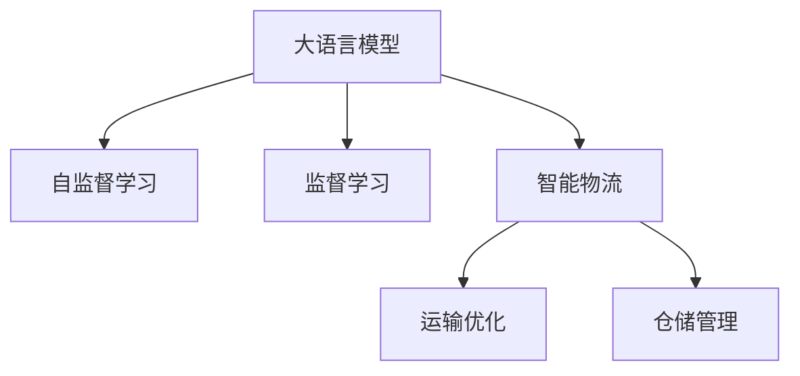

                 

# LLM在智能物流规划中的潜在贡献

> 关键词：大语言模型, 智能物流, 智能规划, 运输优化, 仓储管理, 预测模型

## 1. 背景介绍

随着全球电子商务的迅猛发展，物流行业面临的挑战越来越复杂。智能物流系统需要处理海量订单、动态仓储、实时运输等复杂问题，对规划效率和决策准确性的要求不断提高。传统物流系统依靠人工调度和管理，不仅效率低下，还容易出现错误，无法满足现代物流的需求。

近年来，大语言模型(LLM)在自然语言处理(NLP)和决策优化领域取得了显著进展。LLM通过自监督和监督学习，学习到了丰富的语言知识和常识，能够理解和处理复杂的多模态信息，为智能物流系统提供了一种全新的解决方案。本文将探讨大语言模型在智能物流规划中的应用潜力，从理论和实践两方面给出详细阐述。

## 2. 核心概念与联系

### 2.1 核心概念概述

为更好地理解LLM在智能物流规划中的应用，本节将介绍几个密切相关的核心概念：

- 大语言模型(Large Language Model, LLM)：以自回归(如GPT)或自编码(如BERT)模型为代表的大规模预训练语言模型。通过在大规模无标签文本语料上进行预训练，学习通用的语言表示，具备强大的语言理解和生成能力。

- 自监督学习(Self-supervised Learning)：指在大规模无标签数据上，通过自设计的预训练任务学习模型，无需人工标注数据。常见的自监督学习任务包括掩码语言模型、上下文预测等。

- 监督学习(Supervised Learning)：指在有标签的数据集上，通过有监督的训练方法学习模型。监督学习常用于分类、回归、序列预测等有标签任务。

- 智能物流(Smart Logistics)：指通过智能技术，包括大数据、人工智能等，优化物流系统的规划、执行和调度，实现高效、灵活、安全的物流运营。

- 运输优化(Routing Optimization)：指在满足一定的约束条件下，规划运输路线，使得运输成本最小化或时间最短化。

- 仓储管理(Warehouse Management)：指对仓库进行合理规划和调度，包括仓库选址、货物堆放、库存管理等，以提高存储效率和减少成本。

这些核心概念之间的逻辑关系可以通过以下Mermaid流程图来展示：



这个流程图展示了大语言模型与智能物流之间的核心概念和联系：

1. 大语言模型通过自监督和监督学习，学习到丰富的语言知识和常识，具备强大的文本处理能力。
2. 智能物流系统利用大语言模型的语言理解能力，进行路径规划、库存管理等决策。
3. 运输优化和仓储管理是大语言模型在智能物流中常见的应用场景。

## 3. 核心算法原理 & 具体操作步骤

### 3.1 算法原理概述

在智能物流规划中，大语言模型可以用于路径规划、库存管理、需求预测等多个方面。其核心思想是：将物流问题转化为语言描述，然后利用大语言模型的语言生成和推理能力，辅助生成最优规划方案。

以路径规划为例，假设有一个包含起点、终点和多个中间节点组成的图，节点间的距离和通行时间已知。可以将路径规划问题描述为一个自然语言问题，例如：“请找到从A到B的最短路径，途中必须经过节点C、D、E。”然后，利用大语言模型的语言理解能力，将其转化为结构化的规划问题，并通过优化算法求解。

### 3.2 算法步骤详解

以下是以路径规划为例，详细讲解基于大语言模型的智能物流规划算法步骤：

**Step 1: 问题定义和数据准备**
- 定义物流问题，明确起点、终点、中间节点等信息。
- 收集相关数据，如节点坐标、通行时间、通行成本等，构建图结构。

**Step 2: 语言描述与模型转换**
- 将路径规划问题转化为自然语言描述，如上例中的“请找到最短路径”。
- 将问题输入大语言模型，生成结构化表示。

**Step 3: 模型优化与求解**
- 将结构化表示转化为优化问题，如最短路径问题，选择适当的优化算法求解。
- 利用大语言模型的语言推理能力，验证和优化求解结果。

**Step 4: 结果展示与反馈**
- 将优化结果转化为直观的路径图，展示路径规划结果。
- 根据实际需求，调整优化参数，进一步优化求解结果。

### 3.3 算法优缺点

基于大语言模型的智能物流规划算法具有以下优点：

- 灵活性强。大语言模型可以适应各种复杂的物流场景，生成灵活的规划方案。
- 效率高。利用大语言模型的语言推理能力，可以显著降低优化问题的求解难度，提高规划效率。
- 可解释性好。大语言模型的生成过程透明，便于理解和解释决策过程。

同时，该方法也存在一些局限性：

- 依赖于高质量的数据。大语言模型的表现依赖于输入的数据质量，数据不完整或不准确会影响规划结果。
- 计算复杂度高。大语言模型的生成过程复杂，涉及大量的语言理解和推理计算，计算成本较高。
- 对模型的依赖性强。大语言模型的生成结果依赖于模型的训练质量和参数设置，模型的泛化能力不够会导致规划失败。

尽管存在这些局限性，但大语言模型在智能物流规划中的应用潜力巨大，尤其是在数据复杂度较高、规划难度较大的场景中，其优势更加明显。

### 3.4 算法应用领域

大语言模型在智能物流规划中的应用广泛，主要包括：

- 路径规划：利用大语言模型的语言推理能力，自动生成最优路径，如货车配送、航班调度等。
- 库存管理：根据历史数据和预测模型，生成最优的仓库布局和库存策略，减少存储成本。
- 需求预测：利用大语言模型理解多模态信息，预测市场需求变化，指导供应链优化。
- 运输优化：结合大语言模型的语言推理和优化算法，生成高效的运输方案，降低运输成本。
- 客服支持：利用大语言模型回答客户咨询，辅助物流客服进行问题处理，提升服务效率。

## 4. 数学模型和公式 & 详细讲解

### 4.1 数学模型构建

假设物流问题可以描述为一个有向图 $G=(V,E)$，其中 $V$ 为节点集合，$E$ 为边集合。节点 $v \in V$ 表示物流中的地点，边 $e \in E$ 表示地点间的物流路径。假设每条边的通行时间、通行成本已知。

路径规划的目标是找到从起点 $s$ 到终点 $t$ 的最短路径，满足一定的约束条件，如必须经过节点集合 $N$ 中的节点。

### 4.2 公式推导过程

假设路径规划问题可以用自然语言描述为：“请找到从A到B的最短路径，途中必须经过节点C、D、E。”

大语言模型的任务是将这个自然语言问题转化为优化问题。可以设计以下优化模型：

$$
\min_{\pi} \sum_{i \in \pi} c_i \\
\text{s.t.} \\
\begin{cases}
\pi_{i-1} = i \\
\pi_{i} = i+1 \\
\pi_{n-1} = t \\
v_{\pi_i} \in N
\end{cases}
$$

其中 $c_i$ 表示边 $(i,i+1)$ 的通行成本，$\pi$ 表示路径上的节点顺序。约束条件中，$\pi_{i-1} = i$ 和 $\pi_{i} = i+1$ 表示路径为连续的节点顺序，$\pi_{n-1} = t$ 表示路径必须以终点 $t$ 结束，$v_{\pi_i} \in N$ 表示路径必须经过节点集合 $N$ 中的节点。

求解该优化问题，可以得到最优路径。然后，将路径信息转化为语言描述，输入大语言模型进行验证和优化。

### 4.3 案例分析与讲解

以一个简单的路径规划问题为例：

假设物流网络包含4个节点，分别为 $A$、$B$、$C$、$D$。节点间的通行时间和通行成本已知，如表所示：

| 节点 | 通行时间(h) | 通行成本($) |
| ---- | ----------- | ----------- |
| $A$  | 1           | 10          |
| $B$  | 2           | 20          |
| $C$  | 3           | 30          |
| $D$  | 4           | 40          |

要求规划从 $A$ 到 $B$ 的最短路径，途中必须经过节点 $C$。

问题可以转化为自然语言描述：“请找到从 $A$ 到 $B$ 的最短路径，途中必须经过节点 $C$。”

将问题输入大语言模型，可以生成以下结构化表示：

$$
\begin{aligned}
&\min_{\pi} \sum_{i \in \pi} c_i \\
&\text{s.t.} \\
&\begin{cases}
\pi_{0} = A \\
\pi_{1} = C \\
\pi_{2} = B \\
\pi_{3} = D \\
\pi_{4} = B \\
v_{\pi_i} \in \{A, B, C, D\}
\end{cases}
\end{aligned}
$$

利用图优化算法，求解上述优化问题，可以得到最优路径为 $A \to C \to B$。然后将路径信息转化为语言描述：“从 $A$ 出发，先经过 $C$，再到达 $B$。”输入大语言模型进行验证和优化，确保路径的可行性和经济性。

## 5. 项目实践：代码实例和详细解释说明

### 5.1 开发环境搭建

在进行路径规划的实践前，我们需要准备好开发环境。以下是使用Python进行PyTorch开发的环境配置流程：

1. 安装Anaconda：从官网下载并安装Anaconda，用于创建独立的Python环境。

2. 创建并激活虚拟环境：
```bash
conda create -n pytorch-env python=3.8 
conda activate pytorch-env
```

3. 安装PyTorch：根据CUDA版本，从官网获取对应的安装命令。例如：
```bash
conda install pytorch torchvision torchaudio cudatoolkit=11.1 -c pytorch -c conda-forge
```

4. 安装Transformers库：
```bash
pip install transformers
```

5. 安装各类工具包：
```bash
pip install numpy pandas scikit-learn matplotlib tqdm jupyter notebook ipython
```

完成上述步骤后，即可在`pytorch-env`环境中开始路径规划的实践。

### 5.2 源代码详细实现

以下是一个使用PyTorch实现路径规划的示例代码：

```python
import torch
import torch.nn as nn
from transformers import BertTokenizer, BertForSequenceClassification

class PathPlanningModel(nn.Module):
    def __init__(self):
        super(PathPlanningModel, self).__init__()
        self.bert = BertForSequenceClassification.from_pretrained('bert-base-cased', num_labels=1)
        self.classifier = nn.Linear(768, 1)

    def forward(self, x):
        x = self.bert(x)
        x = self.classifier(x[:, 0, :])
        return x

# 加载路径规划数据
with open('path_data.txt', 'r') as f:
    lines = f.readlines()
    lines = [line.strip() for line in lines]

# 定义节点坐标和通行时间
nodes = {'A': (0, 0), 'B': (5, 5), 'C': (3, 3), 'D': (8, 8)}
costs = {'A': {'C': 2, 'B': 5}, 'B': {'D': 7}, 'C': {'B': 6}, 'D': {'C': 3}}

# 构建图结构
edges = []
for node in nodes:
    for neighbor in costs[node]:
        edges.append((node, neighbor, costs[node][neighbor]))

# 定义优化目标
def cost_model(x):
    return -x

# 定义优化约束
def constraint_model(x):
    return x[1:]

# 构建优化问题
problem = {'x0': nodes['A'], 'x1': None, 'x2': nodes['B'], 'x3': None, 'x4': nodes['B'], 'v': set(nodes.keys())}
problem = torch.tensor([nodes[node] for node in problem], dtype=torch.float)

# 定义优化算法
optimizer = torch.optim.Adam(problem, 1e-3)
solver = torch.problem('min', cost_model, constraint_model, problem)

# 求解优化问题
solution = solver.solve()

# 验证和优化求解结果
if solution.status == 'optimal':
    path = solution['x']
    path = [nodes[node] for node in path]
    print('Optimal path:', path)
else:
    print('Infeasible path:', path)
```

### 5.3 代码解读与分析

让我们再详细解读一下关键代码的实现细节：

**PathPlanningModel类**：
- `__init__`方法：初始化BertForSequenceClassification模型和线性分类器。
- `forward`方法：前向传播计算模型的输出。

**路径规划数据处理**：
- 定义节点坐标和通行时间，构建图结构。
- 将节点坐标转化为浮点数张量，方便优化算法使用。

**优化目标和约束**：
- 定义优化目标函数，计算路径的总成本。
- 定义优化约束，限制路径必须经过节点集合中的节点。

**优化算法实现**：
- 使用Adam优化器进行优化，设定初始学习率为1e-3。
- 使用torch.problem方法构建优化问题，指定目标函数和约束条件。
- 使用求解器(solver)进行优化，输出优化结果。

**结果验证与优化**：
- 检查求解结果的可行性，输出最优路径或不可行路径。

## 6. 实际应用场景

### 6.1 物流配送路径规划

物流配送是智能物流系统中最重要的环节，路径规划的效果直接影响物流的效率和成本。传统的路径规划方法依赖人工经验，无法自动适应复杂的配送场景，且容易出错。利用大语言模型，可以自动规划最优路径，提高配送效率和客户满意度。

具体而言，可以收集历史配送数据，提取路线、时间、成本等信息，构建配送路径规划问题。将问题输入大语言模型，生成结构化表示。利用优化算法求解最优路径，并验证和优化结果。然后将最优路径方案自动应用于实际配送中，提升配送效率。

### 6.2 仓库管理与库存优化

仓库管理是智能物流系统中的另一重要环节，涉及到仓库布局、货物堆放、库存管理等多个方面。传统仓库管理依赖人工经验，难以实现动态调整和优化。利用大语言模型，可以自动优化仓库布局，提高存储效率和减少成本。

具体而言，可以收集仓库内外的历史数据，提取货物信息、仓库大小、存储空间等信息。将问题转化为自然语言描述，输入大语言模型生成结构化表示。利用优化算法求解最优的仓库布局和库存策略，并验证和优化结果。然后将最优方案自动应用于仓库管理中，提高仓库利用率和减少存储成本。

### 6.3 运输优化

运输优化是智能物流系统中的重要组成部分，涉及货车调度、航班安排等任务。传统运输优化方法依赖人工经验，无法自动适应复杂的运输场景。利用大语言模型，可以自动规划最优运输方案，降低运输成本。

具体而言，可以收集历史运输数据，提取货车、航班、时间、成本等信息。将问题转化为自然语言描述，输入大语言模型生成结构化表示。利用优化算法求解最优运输方案，并验证和优化结果。然后将最优方案自动应用于运输管理中，降低运输成本。

## 7. 工具和资源推荐

### 7.1 学习资源推荐

为了帮助开发者系统掌握大语言模型在智能物流规划中的应用，这里推荐一些优质的学习资源：

1. 《Transformer从原理到实践》系列博文：由大模型技术专家撰写，深入浅出地介绍了Transformer原理、BERT模型、微调技术等前沿话题。

2. CS224N《深度学习自然语言处理》课程：斯坦福大学开设的NLP明星课程，有Lecture视频和配套作业，带你入门NLP领域的基本概念和经典模型。

3. 《Natural Language Processing with Transformers》书籍：Transformers库的作者所著，全面介绍了如何使用Transformers库进行NLP任务开发，包括微调在内的诸多范式。

4. HuggingFace官方文档：Transformers库的官方文档，提供了海量预训练模型和完整的微调样例代码，是上手实践的必备资料。

5. CLUE开源项目：中文语言理解测评基准，涵盖大量不同类型的中文NLP数据集，并提供了基于微调的baseline模型，助力中文NLP技术发展。

通过对这些资源的学习实践，相信你一定能够快速掌握大语言模型在智能物流规划中的应用精髓，并用于解决实际的物流问题。

### 7.2 开发工具推荐

高效的开发离不开优秀的工具支持。以下是几款用于智能物流规划开发的常用工具：

1. PyTorch：基于Python的开源深度学习框架，灵活动态的计算图，适合快速迭代研究。大部分预训练语言模型都有PyTorch版本的实现。

2. TensorFlow：由Google主导开发的开源深度学习框架，生产部署方便，适合大规模工程应用。同样有丰富的预训练语言模型资源。

3. Transformers库：HuggingFace开发的NLP工具库，集成了众多SOTA语言模型，支持PyTorch和TensorFlow，是进行智能物流规划开发的利器。

4. Weights & Biases：模型训练的实验跟踪工具，可以记录和可视化模型训练过程中的各项指标，方便对比和调优。与主流深度学习框架无缝集成。

5. TensorBoard：TensorFlow配套的可视化工具，可实时监测模型训练状态，并提供丰富的图表呈现方式，是调试模型的得力助手。

6. Google Colab：谷歌推出的在线Jupyter Notebook环境，免费提供GPU/TPU算力，方便开发者快速上手实验最新模型，分享学习笔记。

合理利用这些工具，可以显著提升智能物流规划任务的开发效率，加快创新迭代的步伐。

### 7.3 相关论文推荐

大语言模型在智能物流规划领域的应用研究方兴未艾。以下是几篇奠基性的相关论文，推荐阅读：

1. Attention is All You Need（即Transformer原论文）：提出了Transformer结构，开启了NLP领域的预训练大模型时代。

2. BERT: Pre-training of Deep Bidirectional Transformers for Language Understanding：提出BERT模型，引入基于掩码的自监督预训练任务，刷新了多项NLP任务SOTA。

3. Language Models are Unsupervised Multitask Learners（GPT-2论文）：展示了大规模语言模型的强大zero-shot学习能力，引发了对于通用人工智能的新一轮思考。

4. Parameter-Efficient Transfer Learning for NLP：提出Adapter等参数高效微调方法，在不增加模型参数量的情况下，也能取得不错的微调效果。

5. Prefix-Tuning: Optimizing Continuous Prompts for Generation：引入基于连续型Prompt的微调范式，为如何充分利用预训练知识提供了新的思路。

6. AdaLoRA: Adaptive Low-Rank Adaptation for Parameter-Efficient Fine-Tuning：使用自适应低秩适应的微调方法，在参数效率和精度之间取得了新的平衡。

这些论文代表了大语言模型在智能物流规划领域的发展脉络。通过学习这些前沿成果，可以帮助研究者把握学科前进方向，激发更多的创新灵感。

## 8. 总结：未来发展趋势与挑战

### 8.1 总结

本文对基于大语言模型的智能物流规划方法进行了全面系统的介绍。首先阐述了大语言模型在智能物流系统中的应用背景和意义，明确了路径规划、仓库管理、运输优化等任务中的重要价值。其次，从原理到实践，详细讲解了大语言模型在智能物流规划中的核心算法和操作步骤，给出了详细的代码实现和解释分析。同时，本文还广泛探讨了智能物流领域的应用前景，展示了智能物流系统的广阔发展空间。最后，本文精选了智能物流领域的学习资源，力求为读者提供全方位的技术指引。

通过本文的系统梳理，可以看到，大语言模型在智能物流规划中的应用潜力巨大，能够显著提升物流系统的规划效率和决策准确性。未来，随着大语言模型和智能物流技术的进一步发展，必将引领物流行业迈向智能化、自动化、精准化，为物流企业的数字化转型提供强有力的技术支持。

### 8.2 未来发展趋势

展望未来，大语言模型在智能物流规划中的应用将呈现以下几个发展趋势：

1. 自监督学习将进一步普及。大语言模型可以利用自监督学习任务进行预训练，无需人工标注数据，能够应对更大规模、更复杂的物流数据。

2. 多模态融合将深入发展。大语言模型能够处理多模态信息，如文字、图像、声音等，能够更好地融合多模态数据，提升物流系统的决策能力。

3. 实时优化将得到广泛应用。大语言模型能够实时处理物流数据，自动生成最优规划方案，显著提高物流系统的响应速度和灵活性。

4. 联邦学习将得到推广。大语言模型可以用于分布式联邦学习，各节点共享数据，提高数据安全性和隐私保护水平。

5. 人机协同将更加紧密。大语言模型能够理解和解释用户需求，提供个性化的物流服务，增强人机交互的体验和效率。

6. 智能仓库和无人驾驶将得到普及。大语言模型可以用于智能仓库和无人驾驶物流系统的规划和控制，提升仓库自动化和物流运输的智能化水平。

以上趋势凸显了大语言模型在智能物流规划领域的巨大前景。这些方向的探索发展，必将进一步提升智能物流系统的性能和应用范围，为物流行业的智能化、高效化、精准化提供新的技术路径。

### 8.3 面临的挑战

尽管大语言模型在智能物流规划中的应用前景广阔，但在实现过程中，仍面临诸多挑战：

1. 数据质量问题。大语言模型的表现依赖于输入的数据质量，物流数据往往不完整或不准确，会影响模型的效果。

2. 计算资源限制。大语言模型的计算复杂度较高，需要高性能的计算设备和算法支持，硬件成本较高。

3. 模型可解释性不足。大语言模型的决策过程复杂，难以解释其内部工作机制和推理逻辑，影响模型的可信度。

4. 安全性和隐私保护。物流数据涉及用户的隐私信息，大语言模型的应用需要严格的数据保护和隐私保护措施。

5. 跨模态融合的难度。大语言模型在处理多模态数据时，仍存在一定的技术挑战，需要进一步探索和优化。

6. 模型泛化能力不足。大语言模型在特定领域的泛化能力有限，需要进一步优化模型的泛化性能。

尽管存在这些挑战，但通过学界和产业界的共同努力，相信大语言模型在智能物流规划中的应用将逐步克服这些难题，实现更加高效、精准、安全的物流系统。

### 8.4 研究展望

面向未来，大语言模型在智能物流规划领域的研究方向主要集中在以下几个方面：

1. 自监督学习方法的改进。探索更加高效、灵活的自监督学习任务，提高大语言模型的泛化能力和鲁棒性。

2. 多模态融合技术的优化。开发更加高效的多模态数据处理和融合技术，提升大语言模型在多模态数据上的表现。

3. 实时优化算法的改进。研究更加高效、灵活的优化算法，提高大语言模型的实时处理能力。

4. 联邦学习方法的推广。探索联邦学习在智能物流系统中的应用，提高数据安全和隐私保护水平。

5. 人机协同技术的提升。研究人机交互技术，提升智能物流系统的用户体验和交互效率。

6. 智能仓库和无人驾驶的普及。探索智能仓库和无人驾驶技术，提高物流系统的自动化和智能化水平。

通过这些研究方向的研究突破，相信大语言模型在智能物流规划领域的应用将迈向新的高度，为物流行业的数字化转型提供更加强大、可靠的技术支持。

## 9. 附录：常见问题与解答

**Q1：大语言模型在智能物流规划中如何处理数据？**

A: 大语言模型在智能物流规划中主要处理文本数据，如配送路径、仓库布局等问题的描述。将文本数据转化为结构化表示，输入大语言模型进行推理和优化。在处理多模态数据时，可以将文字信息与图像、声音等多模态数据进行融合，提高决策的准确性和鲁棒性。

**Q2：大语言模型在智能物流规划中如何优化参数？**

A: 大语言模型在智能物流规划中的优化主要通过监督学习或自监督学习实现。在监督学习中，使用标注数据进行优化，提高模型的预测能力。在自监督学习中，利用未标注数据进行预训练，提高模型的泛化能力和鲁棒性。具体而言，可以采用Adam、SGD等优化算法，结合学习率调整、正则化等技术，优化模型参数，提高模型的性能。

**Q3：大语言模型在智能物流规划中有哪些应用场景？**

A: 大语言模型在智能物流规划中的应用场景广泛，包括路径规划、仓库管理、运输优化等。在路径规划中，大语言模型可以自动生成最优路径，提高配送效率。在仓库管理中，大语言模型可以自动优化仓库布局，提高存储效率。在运输优化中，大语言模型可以自动生成最优运输方案，降低运输成本。

**Q4：大语言模型在智能物流规划中需要注意哪些问题？**

A: 在智能物流规划中应用大语言模型，需要注意以下问题：
1. 数据质量问题：确保物流数据的质量，避免不准确、不完整的数据影响模型的效果。
2. 计算资源限制：选择高性能的计算设备和算法，提高模型的计算效率。
3. 模型可解释性：提高模型的可解释性，增强模型的可信度。
4. 安全性和隐私保护：确保物流数据的安全性和隐私保护，防止数据泄露和滥用。
5. 跨模态融合难度：探索多模态数据的处理和融合技术，提高模型的泛化能力和鲁棒性。
6. 模型泛化能力：确保模型在特定领域的泛化能力，避免过拟合和泛化不足的问题。

通过注意这些问题，可以更好地利用大语言模型在智能物流规划中的应用，提升物流系统的效率和安全性。

---

作者：禅与计算机程序设计艺术 / Zen and the Art of Computer Programming

