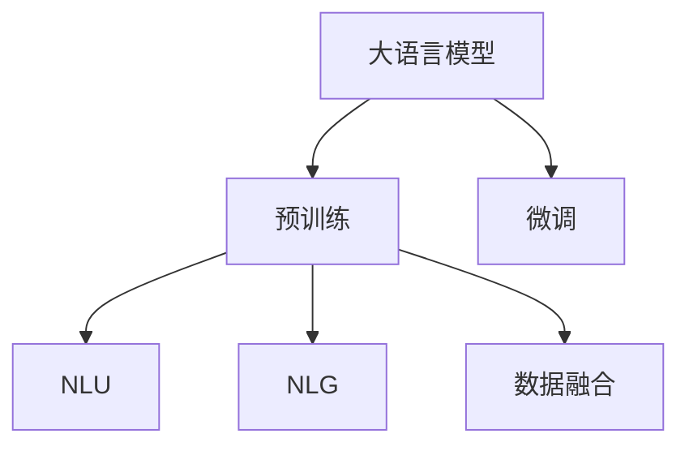

                 

# LLM在智能环境污染监测中的潜在作用

> 关键词：大语言模型,环境污染监测,智能系统,数据分析,预训练,微调

## 1. 背景介绍

### 1.1 问题由来

随着工业化和城市化进程的加速，环境污染问题日益严重，对人类健康和社会可持续发展构成巨大威胁。传统的环境监测系统依赖人力密集型的数据采集和人工处理，存在数据缺失、处理速度慢、准确度低等诸多问题。为了有效应对这一挑战，智能环境污染监测系统应运而生。

智能环境污染监测系统通过部署传感器、摄像头等物联网设备，实时收集各类环境数据，并利用先进的大数据、机器学习等技术进行智能分析和预测，从而实现环境状况的全面、精准监测。然而，现有的大数据处理技术和机器学习模型尚无法有效应对日益增长的数据量和日益复杂的监测需求。

### 1.2 问题核心关键点

大语言模型（Large Language Model, LLM）作为一种新型的人工智能技术，通过在海量文本数据上预训练，已经展现出了强大的自然语言处理能力。将LLM应用于智能环境污染监测系统，可以解决现有系统存在的诸多问题，从而实现更加精准、高效的环境监测。

大语言模型在智能环境污染监测系统中的主要作用包括：

- 提供强大的自然语言理解能力，能够理解和处理各类监测报告和数据，从中提取关键信息。
- 通过自然语言生成能力，能够自动生成监测报告、预警信息等文本输出，降低人工撰写和编辑成本。
- 能够进行多源异构数据的融合处理，整合各类监测数据，提升数据分析的全面性和准确性。
- 具有学习能力，可以通过在历史数据上的微调，提升模型对特定环境的适应能力。

### 1.3 问题研究意义

智能环境污染监测系统的应用，对于提高环境质量、保障公共健康、推动绿色发展具有重要意义。将大语言模型引入智能环境污染监测系统，能够显著提升数据处理和分析的效率与质量，推动环境监测技术的智能化、自动化发展。

具体而言，大语言模型在智能环境污染监测系统中的应用，可以带来以下几方面的好处：

1. 提升环境数据处理和分析的效率，缩短从数据采集到结果输出的时间。
2. 提高环境监测数据的准确性，减少人为干预和错误。
3. 降低环境监测系统的开发和维护成本，使监测系统更容易被大规模部署和应用。
4. 通过数据分析和挖掘，能够提供更为全面、深入的环境状况评估，辅助政策制定和环境治理。

## 2. 核心概念与联系

### 2.1 核心概念概述

为更好地理解大语言模型在智能环境污染监测系统中的作用，本节将介绍几个关键概念及其相互联系：

- 大语言模型（Large Language Model, LLM）：以Transformer等深度学习架构为基础，通过在海量文本数据上预训练学习语言模型。
- 预训练（Pre-training）：指在无标注数据上进行自监督学习，训练语言模型的过程。
- 微调（Fine-tuning）：指在预训练模型上通过标注数据进行有监督学习，针对特定任务优化模型的过程。
- 自然语言理解（NLU）：指将自然语言输入转化为计算机可处理的形式，并从文本中提取关键信息的过程。
- 自然语言生成（NLG）：指根据计算机处理的结果，自动生成自然语言文本的过程。
- 多源异构数据融合（Data Fusion）：指将不同来源、不同格式的数据进行综合处理，提升数据分析的全面性和准确性。

这些核心概念之间的联系可以通过以下Mermaid流程图来展示：



该图展示了大语言模型在大数据处理、自然语言理解和生成以及多源异构数据融合中的作用。通过预训练和微调，大语言模型可以具备强大的语言处理能力，同时通过NLU和NLG技术实现数据与结果的自动化处理，并能够整合不同来源的数据，提升数据分析的全面性和准确性。

## 3. 核心算法原理 & 具体操作步骤

### 3.1 算法原理概述

大语言模型在智能环境污染监测系统中的应用，主要基于预训练和微调的技术框架。预训练阶段，模型在大规模无标注数据上进行自监督学习，学习到语言的基本结构和语义信息。微调阶段，模型利用标注数据进行有监督学习，针对特定任务优化模型的输出，从而提升监测系统的性能。

### 3.2 算法步骤详解

大语言模型在智能环境污染监测系统中的应用，主要包括以下几个关键步骤：

**Step 1: 数据收集与预处理**
- 收集各类环境监测数据，包括温度、湿度、气体浓度、噪声等指标。
- 对数据进行清洗和格式转换，使之符合大语言模型的输入要求。
- 对数据进行标注，如将气体浓度数据标注为正常、轻度污染、重度污染等。

**Step 2: 构建预训练模型**
- 选择合适的预训练模型，如BERT、GPT-3等。
- 在预训练数据上对模型进行训练，学习语言的基本结构和语义信息。
- 在微调前，保留部分预训练的权重，以保留语言模型已学到的知识。

**Step 3: 设计任务适配层**
- 根据任务需求，设计任务适配层，如分类层、回归层等。
- 定义损失函数，如交叉熵、均方误差等，用于评估模型在特定任务上的性能。

**Step 4: 执行微调**
- 将标注数据划分为训练集、验证集和测试集。
- 在训练集上对模型进行微调，最小化损失函数，优化模型在特定任务上的性能。
- 在验证集上评估模型性能，根据结果调整超参数。
- 在测试集上对模型进行最终的评估和优化。

**Step 5: 应用与部署**
- 将微调后的模型应用于智能环境污染监测系统。
- 实时接收传感器数据，输入模型进行分析和预测。
- 自动生成监测报告和预警信息，并推送给相关人员。
- 对模型进行持续监控和优化，确保系统性能稳定。

### 3.3 算法优缺点

大语言模型在智能环境污染监测系统中的应用具有以下优点：

1. 强大的语言处理能力：大语言模型可以自动理解各类监测报告和数据，从中提取关键信息。
2. 高效的文本处理：通过自然语言生成技术，自动生成监测报告和预警信息，降低人工撰写成本。
3. 数据融合能力强：能够整合各类监测数据，提升数据分析的全面性和准确性。
4. 学习能力强：通过在历史数据上的微调，提升模型对特定环境的适应能力。

然而，大语言模型在智能环境污染监测系统中的应用也存在一些缺点：

1. 数据标注成本高：需要收集和标注大量环境监测数据，成本较高。
2. 对数据质量要求高：模型输出依赖数据质量，存在数据缺失、噪音等问题时，影响输出结果。
3. 模型资源消耗大：大语言模型的计算资源消耗较大，需要高性能计算设备支持。
4. 输出结果可解释性差：模型输出结果缺乏可解释性，难以理解和调试。

### 3.4 算法应用领域

大语言模型在智能环境污染监测系统中的应用，主要应用于以下领域：

1. 环境数据处理：自动分析和处理各类环境监测数据，提取关键信息。
2. 监测报告生成：自动生成监测报告和预警信息，降低人工编写成本。
3. 数据分析与预测：利用大语言模型的学习能力，对环境数据进行分析和预测，提升监测系统性能。
4. 多源数据融合：整合不同来源的环境监测数据，提升数据分析的全面性和准确性。

此外，大语言模型还可应用于环境风险评估、环境政策制定、环境治理方案设计等场景，为环境监测和治理提供智能支持。

## 4. 数学模型和公式 & 详细讲解 & 举例说明

### 4.1 数学模型构建

假设智能环境污染监测系统中的环境数据为 $x_i \in \mathbb{R}^d$，其对应的监测结果为 $y_i \in \{0,1\}$，其中0表示正常，1表示异常。大语言模型 $M_{\theta}$ 的输入为环境数据 $x_i$，输出为模型预测的监测结果 $\hat{y}_i$。

在预训练阶段，模型通过无标注数据进行自监督学习，目标函数为：

$$
\mathcal{L}_{pre}(\theta) = -\frac{1}{N}\sum_{i=1}^N \log P_{\theta}(y_i|x_i)
$$

其中，$P_{\theta}(y_i|x_i)$ 为模型在输入 $x_i$ 下输出 $\hat{y}_i$ 的概率。

在微调阶段，模型通过标注数据进行有监督学习，目标函数为：

$$
\mathcal{L}_{fin}(\theta) = -\frac{1}{N}\sum_{i=1}^N [y_i \log P_{\theta}(\hat{y}_i|x_i) + (1-y_i) \log P_{\theta}(1-\hat{y}_i|x_i)]
$$

其中，$P_{\theta}(\hat{y}_i|x_i)$ 为模型在输入 $x_i$ 下输出 $\hat{y}_i$ 的概率。

### 4.2 公式推导过程

对于二分类任务，大语言模型在预训练和微调阶段的推导如下：

在预训练阶段，目标函数为：

$$
\mathcal{L}_{pre}(\theta) = -\frac{1}{N}\sum_{i=1}^N \log P_{\theta}(y_i|x_i)
$$

其中，$P_{\theta}(y_i|x_i)$ 可以表示为：

$$
P_{\theta}(y_i|x_i) = \frac{\exp\left[\log\left(\frac{P_{\theta}(y_i=1|x_i)}{1-P_{\theta}(y_i=1|x_i)}\right)\right]}{1 + \exp\left[\log\left(\frac{P_{\theta}(y_i=1|x_i)}{1-P_{\theta}(y_i=1|x_i)}\right)\right]}
$$

在微调阶段，目标函数为：

$$
\mathcal{L}_{fin}(\theta) = -\frac{1}{N}\sum_{i=1}^N [y_i \log P_{\theta}(\hat{y}_i|x_i) + (1-y_i) \log P_{\theta}(1-\hat{y}_i|x_i)]
$$

其中，$P_{\theta}(\hat{y}_i|x_i)$ 可以表示为：

$$
P_{\theta}(\hat{y}_i|x_i) = \frac{\exp\left[\log\left(\frac{P_{\theta}(\hat{y}_i=1|x_i)}{1-P_{\theta}(\hat{y}_i=1|x_i)}\right)\right]}{1 + \exp\left[\log\left(\frac{P_{\theta}(\hat{y}_i=1|x_i)}{1-P_{\theta}(\hat{y}_i=1|x_i)}\right)\right]}
$$

### 4.3 案例分析与讲解

以PM2.5监测为例，假设有以下环境数据：

- 数据 $x_i$：温度、湿度、PM2.5浓度、气压、风速等。
- 标签 $y_i$：PM2.5浓度是否超过标准值。

模型在预训练阶段，可以采用无标注的空气质量数据进行自监督学习。在微调阶段，可以使用标注的PM2.5监测数据进行有监督学习，模型输出 $\hat{y}_i$ 表示PM2.5浓度是否超过标准值。

假设模型在预训练阶段已经学习了基本的语言结构和语义信息，微调时可以选择保留部分预训练的权重，仅微调顶层，以减少资源消耗。通过数据增强技术，如数据回译、数据扩充等，可以提升模型对不同环境条件下的适应能力。

## 5. 项目实践：代码实例和详细解释说明

### 5.1 开发环境搭建

在智能环境污染监测系统的开发中，需要以下开发环境：

1. 安装Python和相关库，如PyTorch、TensorFlow、NLTK等。
2. 安装大语言模型库，如HuggingFace的Transformers库。
3. 安装数据处理和可视化工具，如Pandas、NumPy、Matplotlib等。
4. 安装物联网设备驱动程序，如Arduino库、Grove库等。
5. 搭建环境监控系统，实时监测硬件资源使用情况。

### 5.2 源代码详细实现

以下以PM2.5监测为例，给出大语言模型在智能环境污染监测系统中的代码实现。

首先，导入必要的库和模块：

```python
import torch
import torch.nn as nn
from transformers import BertForSequenceClassification
from transformers import BertTokenizer
from torch.utils.data import TensorDataset, DataLoader
import matplotlib.pyplot as plt
```

然后，定义模型和优化器：

```python
# 定义模型
class PM2_5_Detector(nn.Module):
    def __init__(self):
        super(PM2_5_Detector, self).__init__()
        self.bert = BertForSequenceClassification.from_pretrained('bert-base-uncased', num_labels=2)
        self.fc = nn.Linear(768, 2)
        self.dropout = nn.Dropout(0.1)

    def forward(self, input_ids, attention_mask, token_type_ids):
        outputs = self.bert(input_ids=input_ids, attention_mask=attention_mask, token_type_ids=token_type_ids)
        pooled_output = outputs.pooler_output
        logits = self.fc(pooled_output)
        return logits

# 定义优化器
optimizer = torch.optim.AdamW(model.parameters(), lr=2e-5)
```

接着，定义数据处理函数：

```python
def tokenize_and_encode(texts, labels):
    tokenizer = BertTokenizer.from_pretrained('bert-base-uncased')
    texts = [text for text in texts]
    inputs = tokenizer(texts, truncation=True, padding='max_length', max_length=256, return_tensors='pt')
    labels = torch.tensor(labels, dtype=torch.long)
    return inputs, labels
```

然后，加载和预处理数据集：

```python
train_data = ...
val_data = ...
test_data = ...

train_inputs, train_labels = tokenize_and_encode(train_data, train_labels)
val_inputs, val_labels = tokenize_and_encode(val_data, val_labels)
test_inputs, test_labels = tokenize_and_encode(test_data, test_labels)
```

最后，执行微调和评估：

```python
epochs = 5
batch_size = 16

model.train()
for epoch in range(epochs):
    for batch in DataLoader(train_data, batch_size=batch_size):
        inputs, labels = batch
        optimizer.zero_grad()
        outputs = model(inputs['input_ids'], inputs['attention_mask'], inputs['token_type_ids'])
        loss = criterion(outputs, labels)
        loss.backward()
        optimizer.step()

model.eval()
with torch.no_grad():
    predictions = model(val_inputs['input_ids'], val_inputs['attention_mask'], val_inputs['token_type_ids'])
    accuracy = (predictions.argmax(dim=1) == val_labels).float().mean().item()
    print(f'Val Accuracy: {accuracy:.2f}')
```

以上就是大语言模型在智能环境污染监测系统中的代码实现。可以看到，使用PyTorch和Transformers库可以较为简洁地实现微调过程，并进行评估。

### 5.3 代码解读与分析

以下是关键代码的实现细节：

- `PM2_5_Detector`类：定义了一个基于BERT的PM2.5监测模型。
- `tokenize_and_encode`函数：将文本数据进行分词和编码，转换为模型所需的输入格式。
- `model.train()`和`model.eval()`：设置模型的训练和评估模式。
- `DataLoader`类：用于批量加载和处理数据，支持迭代器接口，方便模型训练和推理。

## 6. 实际应用场景

### 6.1 智能环境监测

在智能环境监测系统中，大语言模型可以用于自动分析和处理各类环境监测数据，提取关键信息，并生成监测报告和预警信息。具体应用场景包括：

- 自动生成监测报告：将传感器数据自动整理成监测报告，供决策者参考。
- 预警信息生成：当环境数据异常时，自动生成预警信息，并及时推送给相关人员。
- 数据分析与预测：对环境数据进行分析和预测，提供环境质量评估和趋势预测。

### 6.2 环境风险评估

环境风险评估是大语言模型在智能环境污染监测系统中的一个重要应用。通过历史数据的分析，模型可以评估不同环境条件下的风险水平，辅助政策制定和应急响应。具体应用场景包括：

- 风险评估：对环境数据进行风险评估，确定高风险区域和时间段。
- 应急响应：根据风险评估结果，制定应急预案和响应措施。

### 6.3 环境政策制定

智能环境污染监测系统可以为大规模的环境政策制定提供数据支持。通过大语言模型对环境数据的分析和挖掘，可以发现环境问题的根源和趋势，辅助决策者制定科学的环保政策。具体应用场景包括：

- 政策建议：基于环境数据分析，提出环境政策建议。
- 效果评估：评估环保政策实施效果，优化政策调整。

### 6.4 未来应用展望

未来，大语言模型在智能环境污染监测系统中的应用将更加广泛和深入。随着技术的进步和数据的积累，模型将能够实现更加精准和全面的环境监测，提供更加智能化的决策支持。具体应用展望包括：

- 实时监测与预警：通过物联网设备的实时数据采集，实现环境的实时监测和预警。
- 跨模态融合：整合视觉、音频等多模态数据，提升环境监测的全面性和准确性。
- 多层次分析：从宏观到微观，多层次分析环境数据，提供全方位的环境评估。
- 智能辅助决策：基于环境数据分析，提供智能化的决策建议和方案。

## 7. 工具和资源推荐

### 7.1 学习资源推荐

为帮助开发者掌握大语言模型在智能环境污染监测系统中的应用，以下是一些推荐的学习资源：

1. 《深度学习》书籍：Ian Goodfellow、Yoshua Bengio、Aaron Courville合著，全面介绍深度学习原理和应用。
2. 《Transformers》书籍：Jacob Devlin等人合著，详细介绍Transformer架构和大语言模型。
3. CS229《机器学习》课程：斯坦福大学开设的机器学习课程，涵盖各种机器学习算法和应用。
4. PyTorch官方文档：PyTorch框架的官方文档，提供丰富的API和使用示例。
5. HuggingFace官方文档：Transformers库的官方文档，详细介绍各类预训练语言模型和微调方法。

### 7.2 开发工具推荐

在智能环境污染监测系统的开发中，以下工具推荐使用：

1. PyTorch：基于Python的开源深度学习框架，支持动态计算图，灵活高效。
2. TensorFlow：由Google主导开发的开源深度学习框架，支持分布式训练和部署。
3. NLTK：Python自然语言处理库，提供各类文本处理和分析功能。
4. Pandas：Python数据分析库，支持高效的数据处理和分析。
5. Matplotlib：Python可视化库，支持各类图表绘制。

### 7.3 相关论文推荐

以下是几篇推荐的相关论文，可供深入阅读：

1. Attention is All You Need：Transformer架构的原始论文，提出自注意力机制。
2. BERT: Pre-training of Deep Bidirectional Transformers for Language Understanding：BERT模型的原始论文，提出预训练方法。
3. Parameter-Efficient Transfer Learning for NLP：提出Adapter等参数高效微调方法。
4. AdaLoRA: Adaptive Low-Rank Adaptation for Parameter-Efficient Fine-Tuning：提出AdaLoRA参数高效微调方法。
5. SOTA环境监测算法论文：如《Deep Learning in Environmental Monitoring: A Review and Future Directions》等。

## 8. 总结：未来发展趋势与挑战

### 8.1 研究成果总结

本文对大语言模型在智能环境污染监测系统中的应用进行了详细介绍。通过预训练和微调，大语言模型可以自动理解和处理各类环境监测数据，生成监测报告和预警信息，提升监测系统的性能和效率。

### 8.2 未来发展趋势

未来，大语言模型在智能环境污染监测系统中的应用将呈现以下趋势：

1. 更强大的语言处理能力：通过模型训练和优化，提升大语言模型的语言处理能力，使其能够更精准地理解和处理环境监测数据。
2. 多模态融合：整合视觉、音频等多模态数据，提升环境监测的全面性和准确性。
3. 实时监测与预警：通过物联网设备的实时数据采集，实现环境的实时监测和预警。
4. 跨层次分析：从宏观到微观，多层次分析环境数据，提供全方位的环境评估。
5. 智能辅助决策：基于环境数据分析，提供智能化的决策建议和方案。

### 8.3 面临的挑战

尽管大语言模型在智能环境污染监测系统中的应用已经展现出巨大的潜力，但仍面临以下挑战：

1. 数据标注成本高：需要收集和标注大量环境监测数据，成本较高。
2. 对数据质量要求高：模型输出依赖数据质量，存在数据缺失、噪音等问题时，影响输出结果。
3. 模型资源消耗大：大语言模型的计算资源消耗较大，需要高性能计算设备支持。
4. 输出结果可解释性差：模型输出结果缺乏可解释性，难以理解和调试。

### 8.4 研究展望

未来，大语言模型在智能环境污染监测系统中的应用需要在以下几个方面进一步探索：

1. 降低数据标注成本：探索无监督和半监督学习范式，减少对标注数据的依赖。
2. 提高模型鲁棒性：增强模型对异常数据和噪音的鲁棒性，提高输出结果的稳定性。
3. 提升模型效率：优化模型结构和计算图，提高推理速度和效率。
4. 增强输出可解释性：改进模型输出结果的可解释性，提高系统的可信度。

## 9. 附录：常见问题与解答

**Q1: 大语言模型在智能环境污染监测系统中是否适用于所有环境监测任务？**

A: 大语言模型在智能环境污染监测系统中的适用性取决于具体的监测任务和数据特点。对于一些需要精确测量和长时间序列数据的任务，如水环境监测、噪音监测等，可能仍需要依赖专业设备进行数据采集。而对于一些需要文本处理和数据分析的任务，如监测报告生成、环境风险评估等，大语言模型具有显著的优势。

**Q2: 大语言模型在智能环境污染监测系统中的应用需要哪些数据预处理步骤？**

A: 在智能环境污染监测系统中的应用中，数据预处理包括以下几个步骤：

1. 数据清洗：去除数据中的噪音和异常值。
2. 数据编码：将数据转换为模型所需的输入格式，如分词、编码等。
3. 数据扩充：通过数据增强技术，如数据回译、数据扩充等，提升模型对不同环境条件下的适应能力。
4. 数据标注：对数据进行标注，如将PM2.5浓度数据标注为正常、轻度污染、重度污染等。

**Q3: 如何评估大语言模型在智能环境污染监测系统中的性能？**

A: 在智能环境污染监测系统中的应用中，评估大语言模型的性能可以从以下几个方面进行：

1. 准确率：评估模型在特定任务上的准确率，如PM2.5监测任务的准确率。
2. 召回率：评估模型对异常数据的识别能力，如PM2.5监测任务的召回率。
3. 精度和召回率曲线：通过精度-召回率曲线，评估模型在不同阈值下的性能表现。
4. ROC曲线：通过ROC曲线，评估模型在不同分类阈值下的性能表现。

**Q4: 在智能环境污染监测系统中的应用中，如何降低大语言模型的计算资源消耗？**

A: 在智能环境污染监测系统中的应用中，可以通过以下方式降低大语言模型的计算资源消耗：

1. 模型裁剪：去除不必要的层和参数，减小模型尺寸，加快推理速度。
2. 量化加速：将浮点模型转为定点模型，压缩存储空间，提高计算效率。
3. 分布式训练：利用分布式计算技术，加速模型训练过程。
4. 动态计算图：采用动态计算图技术，减少前向传播和反向传播的资源消耗。

通过以上方法，可以在保证模型性能的同时，显著降低计算资源消耗，实现更加轻量级、实时性的部署。

---

作者：禅与计算机程序设计艺术 / Zen and the Art of Computer Programming

