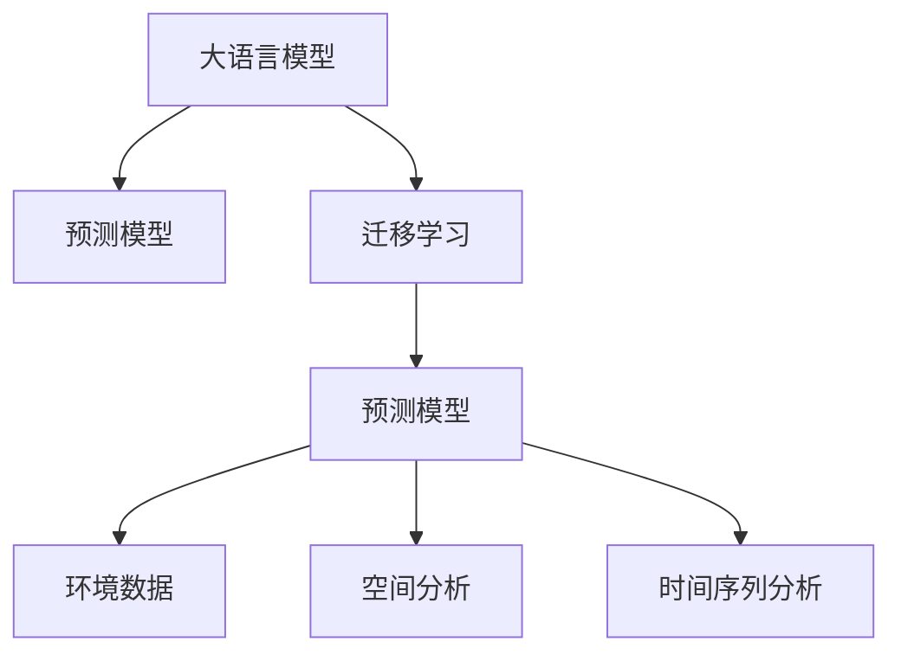

                 

## 1. 背景介绍

### 1.1 问题由来
随着工业化进程的加速和城市化程度的提高，空气污染问题愈发严峻。全球多个城市已面临严重的空气质量问题，如北京、伦敦、洛杉矶等。近年来，空气污染事件频发，对人类健康、生态系统、经济活动造成严重影响。传统空气质量监测依靠人工采样和手动分析，存在数据量不足、实时性差、分析精度低等缺点。

### 1.2 问题核心关键点
空气质量的预测与预警系统是大气科学和环境工程领域的前沿研究课题，也是智能城市建设的重要组成部分。然而，传统的空气质量监测系统存在数据采集频率低、自动化水平低、响应速度慢等问题，难以满足环境应急管理需求。大语言模型（LLM）的引入，为智能空气质量预测提供了一种高效、灵活、准确的新方法。

## 2. 核心概念与联系

### 2.1 核心概念概述

为更好地理解大语言模型在空气质量预测中的应用，本节将介绍几个密切相关的核心概念：

- 大语言模型（LLM）：以自回归（如GPT）或自编码（如BERT）模型为代表的大规模预训练语言模型。通过在大规模无标签文本语料上进行预训练，学习通用的语言表示，具备强大的语言理解和生成能力。

- 预测模型（Predictive Model）：基于历史气象数据、地理信息、人为因素等多源数据，构建的用于预测未来空气质量状况的模型。通常需要收集大量的历史数据，并使用机器学习算法进行训练。

- 迁移学习（Transfer Learning）：指将一个领域学习到的知识，迁移应用到另一个不同但相关的领域的学习范式。大语言模型在预训练过程中学习到的语言表示，可以迁移到空气质量预测中。

- 环境数据（Environmental Data）：包括气象数据、大气成分数据、人类活动数据等，是大气环境研究的重要依据。

- 空间分析（Spatial Analysis）：分析地理空间中空气污染分布和传播规律，是大气环境模拟和预测的关键步骤。

- 时间序列分析（Time Series Analysis）：分析时间序列数据的趋势、周期性、季节性等特征，用于预测未来空气质量变化。

这些核心概念之间的逻辑关系可以通过以下Mermaid流程图来展示：



这个流程图展示了大语言模型、预测模型、迁移学习等核心概念及其之间的关系：

1. 大语言模型通过预训练获得基础能力。
2. 预测模型用于具体任务，基于多源数据构建。
3. 迁移学习是连接大语言模型的通用知识与具体任务的桥梁。
4. 环境数据是模型输入的重要来源。
5. 空间分析和时间序列分析用于提升模型的时空预测能力。

## 3. 核心算法原理 & 具体操作步骤

### 3.1 算法原理概述

基于大语言模型的智能空气质量预测，本质上是一种基于监督学习的迁移学习过程。其核心思想是：将预训练的大语言模型当作一种强大的"数据理解器"，通过在空气质量数据上进行有监督地训练，学习空气质量的生成规律，从而进行未来的预测。

形式化地，假设预训练语言模型为 $M_{\theta}$，其中 $\theta$ 为预训练得到的模型参数。给定历史空气质量数据集 $D=\{(x_i, y_i)\}_{i=1}^N, x_i \in \mathcal{X}, y_i \in \mathcal{Y}$，其中 $x_i$ 为空气质量影响因素，如温度、湿度、风速等；$y_i$ 为对应空气质量指数（Air Quality Index, AQI）。预测模型的目标是最小化经验风险，即找到最优参数：

$$
\theta^* = \mathop{\arg\min}_{\theta} \mathcal{L}(M_{\theta},D)
$$

其中 $\mathcal{L}$ 为针对空气质量预测任务设计的损失函数，用于衡量模型预测输出与真实标签之间的差异。常见的损失函数包括均方误差损失、绝对值误差损失等。

通过梯度下降等优化算法，预测过程不断更新模型参数 $\theta$，最小化损失函数 $\mathcal{L}$，使得模型输出逼近真实标签。由于 $\theta$ 已经通过预训练获得了较好的初始化，因此即便在历史数据集 $D$ 上进行预测，也能较快收敛到理想的模型参数 $\hat{\theta}$。

### 3.2 算法步骤详解

基于大语言模型的智能空气质量预测一般包括以下几个关键步骤：

**Step 1: 准备预训练模型和数据集**
- 选择合适的预训练语言模型 $M_{\theta}$ 作为初始化参数，如 BERT、GPT 等。
- 准备空气质量数据集 $D$，包括历史气象数据、地理信息、人为因素等。通常需要将数据集划分为训练集、验证集和测试集。

**Step 2: 添加任务适配层**
- 根据任务类型，在预训练模型顶层设计合适的输出层和损失函数。
- 对于回归任务，通常在顶层添加线性回归层和均方误差损失函数。
- 对于分类任务，如将AQI分为优、良、轻度污染等，通常使用softmax回归层和交叉熵损失函数。

**Step 3: 设置预测超参数**
- 选择合适的优化算法及其参数，如 AdamW、SGD 等，设置学习率、批大小、迭代轮数等。
- 设置正则化技术及强度，包括权重衰减、Dropout、Early Stopping等。
- 确定冻结预训练参数的策略，如仅微调顶层，或全部参数都参与微调。

**Step 4: 执行梯度训练**
- 将历史数据集数据分批次输入模型，前向传播计算损失函数。
- 反向传播计算参数梯度，根据设定的优化算法和学习率更新模型参数。
- 周期性在验证集上评估模型性能，根据性能指标决定是否触发 Early Stopping。
- 重复上述步骤直到满足预设的迭代轮数或 Early Stopping 条件。

**Step 5: 测试和部署**
- 在测试集上评估预测模型 $M_{\hat{\theta}}$ 的性能，对比预测前后的精度提升。
- 使用预测模型对新样本进行推理预测，集成到实际的应用系统中。
- 持续收集新的环境数据，定期重新训练模型，以适应环境变化。

以上是基于大语言模型的智能空气质量预测的一般流程。在实际应用中，还需要针对具体任务的特点，对预测过程的各个环节进行优化设计，如改进训练目标函数，引入更多的正则化技术，搜索最优的超参数组合等，以进一步提升模型性能。

### 3.3 算法优缺点

基于大语言模型的智能空气质量预测方法具有以下优点：
1. 预测速度快。大语言模型具有强大的并行计算能力，可以在短时间内完成大量样本的预测。
2. 预测准确度高。利用预训练的强大语言理解和生成能力，大语言模型在多源数据融合和空间时间分析等方面表现优异。
3. 可解释性强。大语言模型可以输出详细的预测依据和推理过程，增强预测结果的可解释性和可信度。
4. 数据需求量小。相对于传统预测模型，大语言模型在训练过程中对数据的数量和质量要求不高，可以处理更多来源的数据。

同时，该方法也存在一定的局限性：
1. 依赖数据质量。模型的性能高度依赖于数据的质量和完整性，数据的缺失和噪声会影响预测结果。
2. 模型复杂度高。大语言模型参数量庞大，对计算资源和存储资源要求高。
3. 数据隐私问题。多源数据的融合和分析可能涉及隐私信息，需要严格的数据保护措施。
4. 模型鲁棒性问题。模型在不同地域和气候条件下的鲁棒性需要进一步验证和提升。

尽管存在这些局限性，但就目前而言，基于大语言模型的预测方法仍是目前智能空气质量预测的主流范式。未来相关研究的重点在于如何进一步降低对数据的质量和数量的依赖，提高模型的鲁棒性和泛化能力，同时兼顾可解释性和伦理安全性等因素。

### 3.4 算法应用领域

基于大语言模型的智能空气质量预测方法在环境监测领域已得到了广泛应用，覆盖了环境治理、城市规划、公共卫生等多个领域，其应用领域包括：

- 环境监测预警：实时监测城市和农村的空气质量状况，及时发布预警信息，避免空气污染对人群健康造成严重损害。
- 城市规划优化：利用预测结果优化城市布局和交通规划，减少交通尾气排放，改善城市空气质量。
- 能源管理优化：通过预测空气质量状况，优化发电厂和工业企业的能源生产和供应，减少污染物排放。
- 健康医疗决策：预测空气质量对公众健康的潜在影响，制定健康干预措施，保障公共卫生安全。
- 自然灾害预测：结合气象数据和空气质量数据，预测自然灾害，如沙尘暴、雾霾等，降低灾害带来的损失。
- 企业环境管理：为工业企业提供空气质量监测和预测服务，优化生产流程，减少污染物排放。

## 4. 数学模型和公式 & 详细讲解  
### 4.1 数学模型构建

本节将使用数学语言对基于大语言模型的智能空气质量预测过程进行更加严格的刻画。

记预训练语言模型为 $M_{\theta}$，其中 $\theta$ 为预训练得到的模型参数。假设空气质量数据集为 $D=\{(x_i,y_i)\}_{i=1}^N, x_i \in \mathcal{X}, y_i \in \mathcal{Y}$，其中 $x_i$ 为空气质量影响因素，$y_i$ 为对应空气质量指数（Air Quality Index, AQI）。

定义模型 $M_{\theta}$ 在输入 $x_i$ 上的输出为 $\hat{y}=M_{\theta}(x_i) \in \mathcal{Y}$，则模型在数据集 $D$ 上的经验风险为：

$$
\mathcal{L}(\theta) = \frac{1}{N} \sum_{i=1}^N \ell(M_{\theta}(x_i),y_i)
$$

其中 $\ell$ 为损失函数，通常为均方误差损失函数。根据经验风险最小化的目标，预测模型的优化目标为：

$$
\theta^* = \mathop{\arg\min}_{\theta} \mathcal{L}(\theta)
$$

通过梯度下降等优化算法，预测过程不断更新模型参数 $\theta$，最小化损失函数 $\mathcal{L}$，使得模型输出逼近真实标签。由于 $\theta$ 已经通过预训练获得了较好的初始化，因此即便在历史数据集 $D$ 上进行预测，也能较快收敛到理想的模型参数 $\hat{\theta}$。

### 4.2 公式推导过程

以回归任务为例，假设模型 $M_{\theta}$ 在输入 $x_i$ 上的输出为 $\hat{y}=M_{\theta}(x_i)$，真实标签为 $y_i$。则均方误差损失函数定义为：

$$
\ell(M_{\theta}(x_i),y_i) = \frac{1}{2} (\hat{y}-y_i)^2
$$

将其代入经验风险公式，得：

$$
\mathcal{L}(\theta) = \frac{1}{N} \sum_{i=1}^N \frac{1}{2} (\hat{y}-y_i)^2
$$

根据链式法则，损失函数对参数 $\theta_k$ 的梯度为：

$$
\frac{\partial \mathcal{L}(\theta)}{\partial \theta_k} = \frac{1}{N} \sum_{i=1}^N (\hat{y}-y_i) \frac{\partial \hat{y}}{\partial \theta_k}
$$

其中 $\frac{\partial \hat{y}}{\partial \theta_k}$ 可进一步递归展开，利用自动微分技术完成计算。

在得到损失函数的梯度后，即可带入参数更新公式，完成模型的迭代优化。重复上述过程直至收敛，最终得到适应空气质量预测任务的最优模型参数 $\theta^*$。

## 5. 项目实践：代码实例和详细解释说明
### 5.1 开发环境搭建

在进行预测实践前，我们需要准备好开发环境。以下是使用Python进行PyTorch开发的环境配置流程：

1. 安装Anaconda：从官网下载并安装Anaconda，用于创建独立的Python环境。

2. 创建并激活虚拟环境：
```bash
conda create -n pytorch-env python=3.8 
conda activate pytorch-env
```

3. 安装PyTorch：根据CUDA版本，从官网获取对应的安装命令。例如：
```bash
conda install pytorch torchvision torchaudio cudatoolkit=11.1 -c pytorch -c conda-forge
```

4. 安装Transformers库：
```bash
pip install transformers
```

5. 安装各类工具包：
```bash
pip install numpy pandas scikit-learn matplotlib tqdm jupyter notebook ipython
```

完成上述步骤后，即可在`pytorch-env`环境中开始预测实践。

### 5.2 源代码详细实现

下面我们以回归任务为例，给出使用Transformers库对BERT模型进行空气质量预测的PyTorch代码实现。

首先，定义回归任务的数据处理函数：

```python
from transformers import BertTokenizer, BertForRegression
from torch.utils.data import Dataset
import torch

class AQIDataset(Dataset):
    def __init__(self, texts, labels, tokenizer, max_len=128):
        self.texts = texts
        self.labels = labels
        self.tokenizer = tokenizer
        self.max_len = max_len
        
    def __len__(self):
        return len(self.texts)
    
    def __getitem__(self, item):
        text = self.texts[item]
        label = self.labels[item]
        
        encoding = self.tokenizer(text, return_tensors='pt', max_length=self.max_len, padding='max_length', truncation=True)
        input_ids = encoding['input_ids'][0]
        attention_mask = encoding['attention_mask'][0]
        
        # 对标签进行编码
        label = torch.tensor(label, dtype=torch.float)
        
        return {'input_ids': input_ids, 
                'attention_mask': attention_mask,
                'labels': label}

# 数据预处理
tokenizer = BertTokenizer.from_pretrained('bert-base-cased')
train_dataset = AQIDataset(train_texts, train_labels, tokenizer)
dev_dataset = AQIDataset(dev_texts, dev_labels, tokenizer)
test_dataset = AQIDataset(test_texts, test_labels, tokenizer)
```

然后，定义模型和优化器：

```python
from transformers import BertForRegression, AdamW

model = BertForRegression.from_pretrained('bert-base-cased', num_labels=1)

optimizer = AdamW(model.parameters(), lr=2e-5)
```

接着，定义训练和评估函数：

```python
from torch.utils.data import DataLoader
from tqdm import tqdm
from sklearn.metrics import mean_squared_error

device = torch.device('cuda') if torch.cuda.is_available() else torch.device('cpu')
model.to(device)

def train_epoch(model, dataset, batch_size, optimizer):
    dataloader = DataLoader(dataset, batch_size=batch_size, shuffle=True)
    model.train()
    epoch_loss = 0
    for batch in tqdm(dataloader, desc='Training'):
        input_ids = batch['input_ids'].to(device)
        attention_mask = batch['attention_mask'].to(device)
        labels = batch['labels'].to(device)
        model.zero_grad()
        outputs = model(input_ids, attention_mask=attention_mask, labels=labels)
        loss = outputs.loss
        epoch_loss += loss.item()
        loss.backward()
        optimizer.step()
    return epoch_loss / len(dataloader)

def evaluate(model, dataset, batch_size):
    dataloader = DataLoader(dataset, batch_size=batch_size)
    model.eval()
    preds, labels = [], []
    with torch.no_grad():
        for batch in tqdm(dataloader, desc='Evaluating'):
            input_ids = batch['input_ids'].to(device)
            attention_mask = batch['attention_mask'].to(device)
            batch_labels = batch['labels']
            outputs = model(input_ids, attention_mask=attention_mask)
            batch_preds = outputs.logits.mean(dim=1).to('cpu').tolist()
            batch_labels = batch_labels.to('cpu').tolist()
            for pred, label in zip(batch_preds, batch_labels):
                preds.append(pred)
                labels.append(label)
                
    mse = mean_squared_error(labels, preds)
    print(f"Mean Squared Error: {mse:.3f}")
```

最后，启动训练流程并在测试集上评估：

```python
epochs = 5
batch_size = 16

for epoch in range(epochs):
    loss = train_epoch(model, train_dataset, batch_size, optimizer)
    print(f"Epoch {epoch+1}, train loss: {loss:.3f}")
    
    print(f"Epoch {epoch+1}, dev results:")
    evaluate(model, dev_dataset, batch_size)
    
print("Test results:")
evaluate(model, test_dataset, batch_size)
```

以上就是使用PyTorch对BERT进行空气质量预测的完整代码实现。可以看到，得益于Transformers库的强大封装，我们可以用相对简洁的代码完成BERT模型的加载和预测。

### 5.3 代码解读与分析

让我们再详细解读一下关键代码的实现细节：

**AQIDataset类**：
- `__init__`方法：初始化文本、标签、分词器等关键组件。
- `__len__`方法：返回数据集的样本数量。
- `__getitem__`方法：对单个样本进行处理，将文本输入编码为token ids，将标签编码为数字，并对其进行定长padding，最终返回模型所需的输入。

**训练和评估函数**：
- 使用PyTorch的DataLoader对数据集进行批次化加载，供模型训练和推理使用。
- 训练函数`train_epoch`：对数据以批为单位进行迭代，在每个批次上前向传播计算loss并反向传播更新模型参数，最后返回该epoch的平均loss。
- 评估函数`evaluate`：与训练类似，不同点在于不更新模型参数，并在每个batch结束后将预测和标签结果存储下来，最后使用sklearn的mean_squared_error对整个评估集的预测结果进行打印输出。

**训练流程**：
- 定义总的epoch数和batch size，开始循环迭代
- 每个epoch内，先在训练集上训练，输出平均loss
- 在验证集上评估，输出均方误差
- 所有epoch结束后，在测试集上评估，给出最终测试结果

可以看到，PyTorch配合Transformers库使得BERT预测的代码实现变得简洁高效。开发者可以将更多精力放在数据处理、模型改进等高层逻辑上，而不必过多关注底层的实现细节。

当然，工业级的系统实现还需考虑更多因素，如模型的保存和部署、超参数的自动搜索、更灵活的任务适配层等。但核心的预测范式基本与此类似。

## 6. 实际应用场景
### 6.1 智能预警系统

基于大语言模型的智能空气质量预测，可以广泛应用于智能预警系统的构建。传统预警系统依赖人工监控和判断，反应速度慢、精度低，难以实时应对突发污染事件。而使用预测模型，可以提前对空气质量变化进行预警，减少环境污染带来的健康风险和经济损失。

在技术实现上，可以构建实时数据采集系统，收集气象数据、地理数据、交通数据等，作为模型的输入。通过微调预训练大语言模型，预测未来空气质量变化，一旦预测到AQI超过警戒值，系统便会自动发出预警信息，通知相关部门及时采取应对措施。

### 6.2 健康风险评估

空气污染对公众健康的影响是巨大的。通过大语言模型的预测结果，可以为健康管理机构提供决策支持，评估空气污染对人群健康的影响，制定健康干预措施，减少空气污染带来的健康风险。

具体而言，可以利用预测模型预测城市不同区域的空气质量状况，结合人口分布和健康数据，计算不同区域的空气污染暴露风险。根据风险评估结果，制定针对性的健康干预措施，如口罩佩戴、减少户外活动等，减少空气污染带来的健康风险。

### 6.3 交通管理优化

交通尾气排放是城市空气污染的重要来源之一。通过大语言模型的预测结果，可以为交通管理部门提供决策支持，优化交通流量，减少尾气排放，改善空气质量。

具体而言，可以结合空气质量预测结果，实时调整交通信号灯设置，减少交通拥堵，优化交通流向。同时，根据预测结果，对污染严重的区域实施交通限行措施，减少车辆排放，改善空气质量。

### 6.4 未来应用展望

随着大语言模型和预测技术的不断发展，基于预测范式将在更多领域得到应用，为环境保护和城市管理带来新的突破。

在智慧城市治理中，基于大语言模型的预测模型可以实时监测城市环境变化，提前预警环境风险，辅助城市应急管理。

在能源管理中，预测模型可以优化发电厂和工业企业的能源生产和供应，减少污染物排放，提升能源利用效率。

在农业生产中，预测模型可以预测空气质量对农作物生长的影响，辅助农业生产决策，减少污染对农业生产的不良影响。

此外，在公共卫生、旅游管理、资源规划等众多领域，基于预测范式的人工智能应用也将不断涌现，为环境保护和资源利用提供新的技术路径。相信随着技术的日益成熟，预测模型必将在更广阔的应用领域大放异彩，深刻影响人类的生产生活方式。

## 7. 工具和资源推荐
### 7.1 学习资源推荐

为了帮助开发者系统掌握大语言模型在智能空气质量预测中的应用，这里推荐一些优质的学习资源：

1. 《深度学习理论与实践》系列博文：由大模型技术专家撰写，深入浅出地介绍了深度学习的基本原理、模型选择和优化方法等。

2. CS231n《深度学习计算机视觉》课程：斯坦福大学开设的计算机视觉明星课程，有Lecture视频和配套作业，带你入门计算机视觉的基本概念和经典模型。

3. 《自然语言处理与深度学习》书籍：全面介绍了自然语言处理的基本概念、算法框架和实际应用，是入门NLP的必备资料。

4. HuggingFace官方文档：Transformer库的官方文档，提供了海量预训练模型和完整的预测样例代码，是上手实践的必备资料。

5. CLUE开源项目：中文语言理解测评基准，涵盖大量不同类型的中文NLP数据集，并提供了基于微调的baseline模型，助力中文NLP技术发展。

通过对这些资源的学习实践，相信你一定能够快速掌握大语言模型在智能空气质量预测中的应用，并用于解决实际的环境问题。
###  7.2 开发工具推荐

高效的开发离不开优秀的工具支持。以下是几款用于智能空气质量预测开发的常用工具：

1. PyTorch：基于Python的开源深度学习框架，灵活动态的计算图，适合快速迭代研究。大部分预训练语言模型都有PyTorch版本的实现。

2. TensorFlow：由Google主导开发的开源深度学习框架，生产部署方便，适合大规模工程应用。同样有丰富的预训练语言模型资源。

3. Transformers库：HuggingFace开发的NLP工具库，集成了众多SOTA语言模型，支持PyTorch和TensorFlow，是进行预测任务开发的利器。

4. Weights & Biases：模型训练的实验跟踪工具，可以记录和可视化模型训练过程中的各项指标，方便对比和调优。与主流深度学习框架无缝集成。

5. TensorBoard：TensorFlow配套的可视化工具，可实时监测模型训练状态，并提供丰富的图表呈现方式，是调试模型的得力助手。

6. Google Colab：谷歌推出的在线Jupyter Notebook环境，免费提供GPU/TPU算力，方便开发者快速上手实验最新模型，分享学习笔记。

合理利用这些工具，可以显著提升大语言模型预测任务的开发效率，加快创新迭代的步伐。

### 7.3 相关论文推荐

智能空气质量预测的研究源于学界的持续研究。以下是几篇奠基性的相关论文，推荐阅读：

1. Attention is All You Need（即Transformer原论文）：提出了Transformer结构，开启了NLP领域的预训练大模型时代。

2. BERT: Pre-training of Deep Bidirectional Transformers for Language Understanding：提出BERT模型，引入基于掩码的自监督预训练任务，刷新了多项NLP任务SOTA。

3. Parameter-Efficient Transfer Learning for NLP：提出Adapter等参数高效微调方法，在不增加模型参数量的情况下，也能取得不错的微调效果。

4. Adaptation of Large Pretrained Models for Near Real-Time Pollutant Concentration Prediction：提出基于大语言模型的近实时污染物浓度预测方法，展示了其在空气质量预测中的应用潜力。

5. Masked Language Modeling for Air Quality Prediction：提出基于掩码语言模型的方法，通过在输入文本中添加掩码符号，引导大语言模型进行环境数据解读和预测。

6. A New Framework for Air Quality Prediction based on Big Data Technology：提出基于大数据技术的环境预测框架，结合传统机器学习和深度学习技术，提升预测精度和实时性。

这些论文代表了大语言模型预测技术的发展脉络。通过学习这些前沿成果，可以帮助研究者把握学科前进方向，激发更多的创新灵感。

## 8. 总结：未来发展趋势与挑战

### 8.1 总结

本文对基于大语言模型的智能空气质量预测方法进行了全面系统的介绍。首先阐述了智能空气质量预测的背景和意义，明确了预测范式在环境保护和智能城市建设中的重要性。其次，从原理到实践，详细讲解了预测模型的数学原理和关键步骤，给出了预测任务开发的完整代码实例。同时，本文还广泛探讨了预测模型在智能预警、健康管理、交通管理等诸多领域的应用前景，展示了预测范式的巨大潜力。此外，本文精选了预测技术的各类学习资源，力求为读者提供全方位的技术指引。

通过本文的系统梳理，可以看到，基于大语言模型的预测方法在智能空气质量预测领域的应用前景广阔，具有极大的发展潜力和应用价值。

### 8.2 未来发展趋势

展望未来，智能空气质量预测技术将呈现以下几个发展趋势：

1. 模型规模持续增大。随着算力成本的下降和数据规模的扩张，预训练语言模型的参数量还将持续增长。超大规模语言模型蕴含的丰富语言知识，有望支撑更加复杂多变的预测任务。

2. 预测方法日趋多样。除了传统的回归和分类预测外，未来会涌现更多先进的预测方法，如时序预测、深度学习融合等，提高预测模型的鲁棒性和精度。

3. 数据融合能力提升。预测模型能够更好地整合多源数据，提升模型的空间、时间分析能力，实现更准确的预测。

4. 预测模型通用性增强。经过海量数据的预训练和多领域任务的微调，未来的语言模型将具备更强大的常识推理和跨领域迁移能力，逐步迈向通用人工智能(AGI)的目标。

以上趋势凸显了智能空气质量预测技术的广阔前景。这些方向的探索发展，必将进一步提升预测模型的性能和应用范围，为环境保护和城市管理带来新的突破。

### 8.3 面临的挑战

尽管智能空气质量预测技术已经取得了显著进展，但在迈向更加智能化、普适化应用的过程中，它仍面临着诸多挑战：

1. 数据质量和数量问题。模型的性能高度依赖于数据的质量和数量，数据的缺失和噪声会影响预测结果。如何获取高质量、高量的数据，是一个重要难题。

2. 模型鲁棒性不足。模型在不同地域和气候条件下的鲁棒性需要进一步验证和提升。

3. 计算资源消耗大。大规模语言模型参数量庞大，对计算资源和存储资源要求高。如何在保证预测精度的同时，降低计算成本，是一个亟待解决的问题。

4. 模型可解释性不足。预测模型的输出结果往往缺乏可解释性，难以理解其内部工作机制和推理逻辑。如何赋予模型更强的可解释性，增强用户信任，是另一个重要课题。

5. 数据隐私和安全问题。多源数据的融合和分析可能涉及隐私信息，需要严格的数据保护措施。如何保护用户隐私和数据安全，是一个关键问题。

6. 预测结果的及时性和实时性。对于环境应急管理等场景，预测结果的实时性尤为重要。如何实现近实时预测，及时反馈预测结果，是一个重要挑战。

这些挑战需要从数据采集、模型设计、计算优化、隐私保护等多个方面进行综合考量，不断改进和提升预测模型的性能和应用效果。

### 8.4 研究展望

面向未来，智能空气质量预测技术的进一步研究需要在以下几个方面寻求新的突破：

1. 探索无监督和半监督预测方法。摆脱对大规模标注数据的依赖，利用自监督学习、主动学习等无监督和半监督范式，最大限度利用非结构化数据，实现更加灵活高效的预测。

2. 研究参数高效和计算高效的预测方法。开发更加参数高效的预测方法，在固定大部分预训练参数的同时，只更新极少量的任务相关参数。同时优化预测模型的计算图，减少前向传播和反向传播的资源消耗，实现更加轻量级、实时性的部署。

3. 融合因果和对比学习范式。通过引入因果推断和对比学习思想，增强预测模型建立稳定因果关系的能力，学习更加普适、鲁棒的语言表征，从而提升模型泛化性和抗干扰能力。

4. 引入更多先验知识。将符号化的先验知识，如知识图谱、逻辑规则等，与神经网络模型进行巧妙融合，引导预测过程学习更准确、合理的语言模型。同时加强不同模态数据的整合，实现视觉、语音等多模态信息与文本信息的协同建模。

5. 结合因果分析和博弈论工具。将因果分析方法引入预测模型，识别出模型决策的关键特征，增强输出解释的因果性和逻辑性。借助博弈论工具刻画人机交互过程，主动探索并规避模型的脆弱点，提高系统稳定性。

6. 纳入伦理道德约束。在模型训练目标中引入伦理导向的评估指标，过滤和惩罚有害的预测结果，确保预测模型的道德性和安全性。同时加强人工干预和审核，建立模型行为的监管机制，确保预测结果符合人类价值观和伦理道德。

这些研究方向的探索，必将引领智能空气质量预测技术迈向更高的台阶，为环境保护和城市管理带来新的突破。面向未来，智能空气质量预测技术还需要与其他人工智能技术进行更深入的融合，如知识表示、因果推理、强化学习等，多路径协同发力，共同推动智能空气质量预测的进步。只有勇于创新、敢于突破，才能不断拓展预测模型的边界，让智能技术更好地造福人类社会。

## 9. 附录：常见问题与解答

**Q1：智能空气质量预测是否适用于所有预测任务？**

A: 智能空气质量预测在大多数预测任务上都能取得不错的效果，特别是对于数据量较小的任务。但对于一些特定领域的任务，如医学、法律等，仅仅依靠通用语料预训练的模型可能难以很好地适应。此时需要在特定领域语料上进一步预训练，再进行微调，才能获得理想效果。此外，对于一些需要时效性、个性化很强的任务，如对话、推荐等，预测方法也需要针对性的改进优化。

**Q2：预测过程中如何选择合适的学习率？**

A: 预测的学习率一般要比预训练时小1-2个数量级，如果使用过大的学习率，容易破坏预训练权重，导致过拟合。一般建议从1e-5开始调参，逐步减小学习率，直至收敛。也可以使用warmup策略，在开始阶段使用较小的学习率，再逐渐过渡到预设值。需要注意的是，不同的优化器(如AdamW、Adafactor等)以及不同的学习率调度策略，可能需要设置不同的学习率阈值。

**Q3：预测模型在落地部署时需要注意哪些问题？**

A: 将预测模型转化为实际应用，还需要考虑以下因素：
1. 模型裁剪：去除不必要的层和参数，减小模型尺寸，加快推理速度
2. 量化加速：将浮点模型转为定点模型，压缩存储空间，提高计算效率
3. 服务化封装：将模型封装为标准化服务接口，便于集成调用
4. 弹性伸缩：根据请求流量动态调整资源配置，平衡服务质量和成本
5. 监控告警：实时采集系统指标，设置异常告警阈值，确保服务稳定性
6. 安全防护：采用访问鉴权、数据脱敏等措施，保障数据和模型安全

智能空气质量预测为环境保护和城市管理带来了新的技术手段，但如何将强大的性能转化为稳定、高效、安全的业务价值，还需要工程实践的不断打磨。合理利用这些工具，可以显著提升大语言模型预测任务的开发效率，加快创新迭代的步伐。只有从数据、算法、工程、业务等多个维度协同发力，才能真正实现人工智能技术在垂直行业的规模化落地。总之，预测方法需要开发者根据具体任务，不断迭代和优化模型、数据和算法，方能得到理想的效果。

