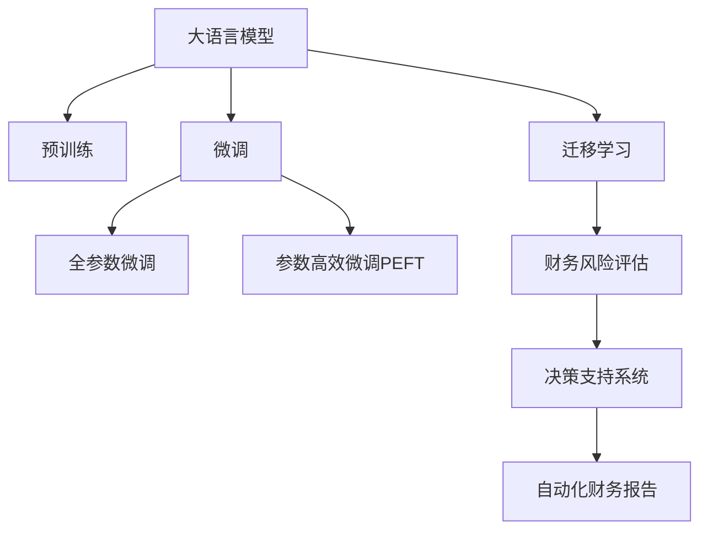

                 

# LLM在智能财务分析中的潜在贡献

> 关键词：大语言模型,智能财务分析,数据分析,预训练模型,微调,Fine-tuning,自动化财务报告,风险评估,算法优化

## 1. 背景介绍

### 1.1 问题由来

财务分析是企业管理决策中至关重要的一环，它可以帮助企业洞察历史趋势、评估当前财务状况、预测未来发展趋势，从而做出更为精准的商业决策。传统财务分析方法依赖人工提取、分析、整理财务报表数据，不仅耗时耗力，还容易出现人为错误。

近年来，随着人工智能技术的迅猛发展，大语言模型（LLM）在自然语言处理（NLP）领域取得了显著进展，具有强大的语言理解和生成能力。将其应用于财务分析，可以大幅提高分析效率和精确度，推动财务分析向智能化方向发展。

### 1.2 问题核心关键点

大语言模型在财务分析中的应用，主要体现在以下几个方面：

- **自动化财务报告生成**：通过自然语言生成技术，自动将财务数据转换为易读、易懂的文字描述，帮助非财务专业人士理解财务状况。
- **财务风险评估**：利用大语言模型进行情感分析、文本分类等任务，对财务数据进行风险评估，及时预警潜在的财务风险。
- **决策支持**：结合知识图谱、专家系统等技术，为大企业决策者提供全面的数据支持和深度见解。
- **自动化报表审计**：通过自动生成审计报告，提高审计效率，降低审计成本。

这些应用不仅能够解放财务人员的时间，使其专注于更重要的战略决策，还能大幅提升财务分析的精确性和全面性。

### 1.3 问题研究意义

大语言模型在财务分析中的应用，具有以下重要意义：

- **提升财务分析效率**：自动化财务报告生成和分析大大缩短了分析时间，提高了企业决策速度。
- **降低错误率**：智能化工具减少了人为操作，降低了因错误分析导致的决策失误。
- **增强决策支持**：大语言模型结合知识图谱、专家系统，提供更加全面和深入的分析支持。
- **促进技术普及**：通过智能化手段，使得财务分析技术更易于使用和普及，帮助中小企业也实现财务智能分析。

综上所述，大语言模型在财务分析中的应用，有望全面提升企业的财务管理水平和决策能力。

## 2. 核心概念与联系

### 2.1 核心概念概述

为更好地理解大语言模型在财务分析中的应用，本节将介绍几个密切相关的核心概念：

- **大语言模型 (LLM)**：以自回归（如GPT）或自编码（如BERT）模型为代表的大规模预训练语言模型。通过在大规模无标签文本数据上进行预训练，学习通用的语言表示，具备强大的语言理解和生成能力。

- **预训练 (Pre-training)**：指在大规模无标签文本语料上，通过自监督学习任务训练通用语言模型的过程。常见的预训练任务包括语言建模、掩码语言模型等。

- **微调 (Fine-tuning)**：指在预训练模型的基础上，使用下游任务的少量标注数据，通过有监督学习优化模型在特定任务上的性能。通常只需要调整顶层分类器或解码器，并以较小的学习率更新全部或部分的模型参数。

- **迁移学习 (Transfer Learning)**：指将一个领域学习到的知识，迁移应用到另一个不同但相关的领域的学习范式。大模型的预训练-微调过程即是一种典型的迁移学习方式。

- **财务风险评估**：利用大语言模型进行情感分析、文本分类等任务，对财务数据进行风险评估，及时预警潜在的财务风险。

- **决策支持系统 (DSS)**：结合知识图谱、专家系统等技术，为大企业决策者提供全面的数据支持和深度见解。

这些核心概念之间的逻辑关系可以通过以下Mermaid流程图来展示：



这个流程图展示了大语言模型的核心概念及其之间的关系：

1. 大语言模型通过预训练获得基础能力。
2. 微调是对预训练模型进行任务特定的优化，可以分为全参数微调和参数高效微调（PEFT）。
3. 财务风险评估是一种典型的下游任务，利用微调模型进行风险评估。
4. 决策支持系统结合知识图谱和专家系统，为决策者提供全面的数据支持和深度见解。
5. 自动化财务报告是将财务数据转换为易读、易懂的文字描述。

这些概念共同构成了大语言模型在财务分析中的应用框架，使其能够在各种场景下发挥强大的语言理解和生成能力。通过理解这些核心概念，我们可以更好地把握大语言模型的工作原理和优化方向。

## 3. 核心算法原理 & 具体操作步骤
### 3.1 算法原理概述

基于大语言模型的财务分析，本质上是一个有监督的细粒度迁移学习过程。其核心思想是：将预训练的大语言模型视作一个强大的"特征提取器"，通过在财务数据的标注数据上进行有监督的微调，使得模型输出能够匹配特定的财务指标和风险评估标准，从而获得针对特定财务任务优化的模型。

形式化地，假设预训练模型为 $M_{\theta}$，其中 $\theta$ 为预训练得到的模型参数。给定财务任务 $T$ 的标注数据集 $D=\{(x_i, y_i)\}_{i=1}^N$，微调的目标是找到新的模型参数 $\hat{\theta}$，使得：

$$
\hat{\theta}=\mathop{\arg\min}_{\theta} \mathcal{L}(M_{\theta},D)
$$

其中 $\mathcal{L}$ 为针对任务 $T$ 设计的损失函数，用于衡量模型预测输出与真实标签之间的差异。常见的损失函数包括交叉熵损失、均方误差损失等。

通过梯度下降等优化算法，微调过程不断更新模型参数 $\theta$，最小化损失函数 $\mathcal{L}$，使得模型输出逼近真实标签。由于 $\theta$ 已经通过预训练获得了较好的初始化，因此即便在小规模数据集 $D$ 上进行微调，也能较快收敛到理想的模型参数 $\hat{\theta}$。

### 3.2 算法步骤详解

基于大语言模型的财务分析一般包括以下几个关键步骤：

**Step 1: 准备预训练模型和数据集**
- 选择合适的预训练语言模型 $M_{\theta}$ 作为初始化参数，如 BERT、GPT 等。
- 准备财务任务 $T$ 的标注数据集 $D$，划分为训练集、验证集和测试集。一般要求标注数据与预训练数据的分布不要差异过大。

**Step 2: 添加任务适配层**
- 根据财务任务类型，在预训练模型顶层设计合适的输出层和损失函数。
- 对于财务分类任务，通常在顶层添加线性分类器和交叉熵损失函数。
- 对于财务数值预测任务，通常使用回归模型输出概率分布，并以均方误差为损失函数。

**Step 3: 设置微调超参数**
- 选择合适的优化算法及其参数，如 AdamW、SGD 等，设置学习率、批大小、迭代轮数等。
- 设置正则化技术及强度，包括权重衰减、Dropout、Early Stopping等。
- 确定冻结预训练参数的策略，如仅微调顶层，或全部参数都参与微调。

**Step 4: 执行梯度训练**
- 将训练集数据分批次输入模型，前向传播计算损失函数。
- 反向传播计算参数梯度，根据设定的优化算法和学习率更新模型参数。
- 周期性在验证集上评估模型性能，根据性能指标决定是否触发 Early Stopping。
- 重复上述步骤直到满足预设的迭代轮数或 Early Stopping 条件。

**Step 5: 测试和部署**
- 在测试集上评估微调后模型 $M_{\hat{\theta}}$ 的性能，对比微调前后的精度提升。
- 使用微调后的模型对新财务数据进行推理预测，集成到实际的应用系统中。
- 持续收集新的数据，定期重新微调模型，以适应数据分布的变化。

以上是基于大语言模型微调财务分析的一般流程。在实际应用中，还需要针对具体财务任务的特点，对微调过程的各个环节进行优化设计，如改进训练目标函数，引入更多的正则化技术，搜索最优的超参数组合等，以进一步提升模型性能。

### 3.3 算法优缺点

基于大语言模型的财务分析方法具有以下优点：
1. 自动化程度高。预训练模型可以自动处理和理解大量财务数据，无需人工干预。
2. 高效准确。利用大模型的强大语言表示能力，可以在较短时间内生成高质量的财务报告和分析。
3. 可解释性好。模型输出结果具有文字描述，易于理解和解释。
4. 灵活性高。模型可以根据不同财务任务的需求进行快速调整和适配。

同时，该方法也存在一定的局限性：
1. 对标注数据依赖高。微调的效果很大程度上取决于标注数据的质量和数量，获取高质量标注数据的成本较高。
2. 预训练模型固有偏见。预训练模型可能包含固有偏见和错误信息，需要通过微调进行矫正。
3. 模型复杂度高。大模型的复杂度较高，对计算资源和存储资源的要求也较高。
4. 需要持续更新。财务数据变化快，需要定期重新微调模型，以保持其性能和准确性。

尽管存在这些局限性，但就目前而言，基于大语言模型的微调方法仍是大规模财务分析的强有力工具。未来相关研究的重点在于如何进一步降低对标注数据的依赖，提高模型的迁移能力和鲁棒性，同时兼顾可解释性和资源效率等因素。

### 3.4 算法应用领域

基于大语言模型的财务分析方法在财务领域已经得到了广泛的应用，覆盖了几乎所有常见的财务任务，例如：

- 财务报告自动化生成：如资产负债表、利润表等。通过自然语言生成技术，将财务数据自动转换为易读的财务报告。
- 财务风险评估：识别财务数据的风险因素，评估企业的财务健康状况。
- 财务数据分类：对财务数据进行分类，如应收账款、应付账款等。
- 财务预测与预算：基于历史财务数据，预测未来财务表现，进行预算编制。
- 财务合规性检查：通过自然语言处理，检查财务报表的合规性，确保遵守相关法律法规。
- 财务问答系统：自动回答财务相关的常见问题，帮助财务人员提升工作效率。

除了上述这些经典任务外，大语言模型在财务分析中还有许多创新性的应用，如智能投融资、税收优化、内部控制等，为财务工作带来了全新的突破。

## 4. 数学模型和公式 & 详细讲解 & 举例说明
### 4.1 数学模型构建

本节将使用数学语言对基于大语言模型的财务分析过程进行更加严格的刻画。

记预训练语言模型为 $M_{\theta}$，其中 $\theta$ 为预训练得到的模型参数。假设财务任务 $T$ 的标注数据集为 $D=\{(x_i,y_i)\}_{i=1}^N, x_i \in \mathbb{R}^d, y_i \in \mathbb{R}^k$，其中 $d$ 为模型输入维数，$k$ 为输出维数。

定义模型 $M_{\theta}$ 在输入 $x$ 上的损失函数为 $\ell(M_{\theta}(x),y)$，则在数据集 $D$ 上的经验风险为：

$$
\mathcal{L}(\theta) = \frac{1}{N} \sum_{i=1}^N \ell(M_{\theta}(x_i),y_i)
$$

微调的优化目标是最小化经验风险，即找到最优参数：

$$
\theta^* = \mathop{\arg\min}_{\theta} \mathcal{L}(\theta)
$$

在实践中，我们通常使用基于梯度的优化算法（如SGD、Adam等）来近似求解上述最优化问题。设 $\eta$ 为学习率，$\lambda$ 为正则化系数，则参数的更新公式为：

$$
\theta \leftarrow \theta - \eta \nabla_{\theta}\mathcal{L}(\theta) - \eta\lambda\theta
$$

其中 $\nabla_{\theta}\mathcal{L}(\theta)$ 为损失函数对参数 $\theta$ 的梯度，可通过反向传播算法高效计算。

### 4.2 公式推导过程

以下我们以财务分类任务为例，推导交叉熵损失函数及其梯度的计算公式。

假设模型 $M_{\theta}$ 在输入 $x$ 上的输出为 $\hat{y}=M_{\theta}(x) \in \mathbb{R}^k$，表示样本属于各个财务类别的概率。真实标签 $y \in \{0,1\}^k$。则二分类交叉熵损失函数定义为：

$$
\ell(M_{\theta}(x),y) = -\sum_{i=1}^k y_i\log \hat{y}_i
$$

将其代入经验风险公式，得：

$$
\mathcal{L}(\theta) = -\frac{1}{N}\sum_{i=1}^N \sum_{j=1}^k y_{ij}\log \hat{y}_{ij}
$$

根据链式法则，损失函数对参数 $\theta_k$ 的梯度为：

$$
\frac{\partial \mathcal{L}(\theta)}{\partial \theta_k} = -\frac{1}{N}\sum_{i=1}^N \frac{1}{\hat{y}_{ik}} - \frac{y_{ik}}{\hat{y}_{ik}^2} \frac{\partial \hat{y}_{ik}}{\partial \theta_k}
$$

其中 $\frac{\partial \hat{y}_{ik}}{\partial \theta_k}$ 可进一步递归展开，利用自动微分技术完成计算。

在得到损失函数的梯度后，即可带入参数更新公式，完成模型的迭代优化。重复上述过程直至收敛，最终得到适应财务任务的最优模型参数 $\theta^*$。

## 5. 项目实践：代码实例和详细解释说明
### 5.1 开发环境搭建

在进行财务分析微调实践前，我们需要准备好开发环境。以下是使用Python进行PyTorch开发的环境配置流程：

1. 安装Anaconda：从官网下载并安装Anaconda，用于创建独立的Python环境。

2. 创建并激活虚拟环境：
```bash
conda create -n pytorch-env python=3.8 
conda activate pytorch-env
```

3. 安装PyTorch：根据CUDA版本，从官网获取对应的安装命令。例如：
```bash
conda install pytorch torchvision torchaudio cudatoolkit=11.1 -c pytorch -c conda-forge
```

4. 安装Transformers库：
```bash
pip install transformers
```

5. 安装各类工具包：
```bash
pip install numpy pandas scikit-learn matplotlib tqdm jupyter notebook ipython
```

完成上述步骤后，即可在`pytorch-env`环境中开始财务分析微调实践。

### 5.2 源代码详细实现

下面我们以财务风险评估任务为例，给出使用Transformers库对BERT模型进行财务分析微调的PyTorch代码实现。

首先，定义财务风险评估任务的数据处理函数：

```python
from transformers import BertTokenizer
from torch.utils.data import Dataset
import torch

class FinanceRiskDataset(Dataset):
    def __init__(self, texts, labels, tokenizer, max_len=128):
        self.texts = texts
        self.labels = labels
        self.tokenizer = tokenizer
        self.max_len = max_len
        
    def __len__(self):
        return len(self.texts)
    
    def __getitem__(self, item):
        text = self.texts[item]
        label = self.labels[item]
        
        encoding = self.tokenizer(text, return_tensors='pt', max_length=self.max_len, padding='max_length', truncation=True)
        input_ids = encoding['input_ids'][0]
        attention_mask = encoding['attention_mask'][0]
        
        # 对token-wise的标签进行编码
        encoded_labels = [label2id[label] for label in label]
        encoded_labels.extend([label2id['']]*(self.max_len - len(encoded_labels)))
        labels = torch.tensor(encoded_labels, dtype=torch.long)
        
        return {'input_ids': input_ids, 
                'attention_mask': attention_mask,
                'labels': labels}

# 标签与id的映射
label2id = {'正常': 0, '异常': 1, '未知': 2}
id2label = {v: k for k, v in label2id.items()}

# 创建dataset
tokenizer = BertTokenizer.from_pretrained('bert-base-cased')

train_dataset = FinanceRiskDataset(train_texts, train_labels, tokenizer)
dev_dataset = FinanceRiskDataset(dev_texts, dev_labels, tokenizer)
test_dataset = FinanceRiskDataset(test_texts, test_labels, tokenizer)
```

然后，定义模型和优化器：

```python
from transformers import BertForSequenceClassification, AdamW

model = BertForSequenceClassification.from_pretrained('bert-base-cased', num_labels=len(label2id))

optimizer = AdamW(model.parameters(), lr=2e-5)
```

接着，定义训练和评估函数：

```python
from torch.utils.data import DataLoader
from tqdm import tqdm
from sklearn.metrics import classification_report

device = torch.device('cuda') if torch.cuda.is_available() else torch.device('cpu')
model.to(device)

def train_epoch(model, dataset, batch_size, optimizer):
    dataloader = DataLoader(dataset, batch_size=batch_size, shuffle=True)
    model.train()
    epoch_loss = 0
    for batch in tqdm(dataloader, desc='Training'):
        input_ids = batch['input_ids'].to(device)
        attention_mask = batch['attention_mask'].to(device)
        labels = batch['labels'].to(device)
        model.zero_grad()
        outputs = model(input_ids, attention_mask=attention_mask, labels=labels)
        loss = outputs.loss
        epoch_loss += loss.item()
        loss.backward()
        optimizer.step()
    return epoch_loss / len(dataloader)

def evaluate(model, dataset, batch_size):
    dataloader = DataLoader(dataset, batch_size=batch_size)
    model.eval()
    preds, labels = [], []
    with torch.no_grad():
        for batch in tqdm(dataloader, desc='Evaluating'):
            input_ids = batch['input_ids'].to(device)
            attention_mask = batch['attention_mask'].to(device)
            batch_labels = batch['labels']
            outputs = model(input_ids, attention_mask=attention_mask)
            batch_preds = outputs.logits.argmax(dim=2).to('cpu').tolist()
            batch_labels = batch_labels.to('cpu').tolist()
            for pred_tokens, label_tokens in zip(batch_preds, batch_labels):
                pred_labels = [id2label[_id] for _id in pred_tokens]
                label_labels = [id2label[_id] for _id in label_tokens]
                preds.append(pred_labels[:len(label_labels)])
                labels.append(label_labels)
                
    print(classification_report(labels, preds))
```

最后，启动训练流程并在测试集上评估：

```python
epochs = 5
batch_size = 16

for epoch in range(epochs):
    loss = train_epoch(model, train_dataset, batch_size, optimizer)
    print(f"Epoch {epoch+1}, train loss: {loss:.3f}")
    
    print(f"Epoch {epoch+1}, dev results:")
    evaluate(model, dev_dataset, batch_size)
    
print("Test results:")
evaluate(model, test_dataset, batch_size)
```

以上就是使用PyTorch对BERT进行财务风险评估任务微调的完整代码实现。可以看到，得益于Transformers库的强大封装，我们可以用相对简洁的代码完成BERT模型的加载和微调。

### 5.3 代码解读与分析

让我们再详细解读一下关键代码的实现细节：

**FinanceRiskDataset类**：
- `__init__`方法：初始化文本、标签、分词器等关键组件。
- `__len__`方法：返回数据集的样本数量。
- `__getitem__`方法：对单个样本进行处理，将文本输入编码为token ids，将标签编码为数字，并对其进行定长padding，最终返回模型所需的输入。

**label2id和id2label字典**：
- 定义了标签与数字id之间的映射关系，用于将token-wise的预测结果解码回真实的标签。

**训练和评估函数**：
- 使用PyTorch的DataLoader对数据集进行批次化加载，供模型训练和推理使用。
- 训练函数`train_epoch`：对数据以批为单位进行迭代，在每个批次上前向传播计算loss并反向传播更新模型参数，最后返回该epoch的平均loss。
- 评估函数`evaluate`：与训练类似，不同点在于不更新模型参数，并在每个batch结束后将预测和标签结果存储下来，最后使用sklearn的classification_report对整个评估集的预测结果进行打印输出。

**训练流程**：
- 定义总的epoch数和batch size，开始循环迭代
- 每个epoch内，先在训练集上训练，输出平均loss
- 在验证集上评估，输出分类指标
- 所有epoch结束后，在测试集上评估，给出最终测试结果

可以看到，PyTorch配合Transformers库使得BERT微调的代码实现变得简洁高效。开发者可以将更多精力放在数据处理、模型改进等高层逻辑上，而不必过多关注底层的实现细节。

当然，工业级的系统实现还需考虑更多因素，如模型的保存和部署、超参数的自动搜索、更灵活的任务适配层等。但核心的微调范式基本与此类似。

## 6. 实际应用场景
### 6.1 智能财务分析

基于大语言模型的财务分析技术，已经在众多企业中得到应用，为财务工作带来了显著提升：

- **自动化财务报告生成**：通过自然语言生成技术，自动将财务数据转换为易读、易懂的文字描述，帮助非财务专业人士理解财务状况。
- **财务风险评估**：识别财务数据的风险因素，评估企业的财务健康状况。
- **财务数据分类**：对财务数据进行分类，如应收账款、应付账款等。
- **财务预测与预算**：基于历史财务数据，预测未来财务表现，进行预算编制。
- **财务合规性检查**：通过自然语言处理，检查财务报表的合规性，确保遵守相关法律法规。
- **财务问答系统**：自动回答财务相关的常见问题，帮助财务人员提升工作效率。

### 6.2 未来应用展望

随着大语言模型和财务分析方法的不断发展，未来将会有更多创新性应用出现：

- **跨领域财务分析**：结合多领域的知识图谱，进行更加全面和深入的财务分析。
- **个性化财务分析**：利用用户行为数据和偏好信息，进行个性化的财务分析和报告生成。
- **实时财务监控**：通过实时数据流处理技术，实现对企业财务状况的实时监控和预警。
- **智能投融资决策**：利用自然语言理解和情感分析技术，辅助企业进行智能投融资决策。
- **财务数据可视化**：结合大数据技术和可视化工具，对财务数据进行更直观、更有效的展示和分析。

这些创新应用将进一步拓展财务分析的边界，推动财务工作的数字化、智能化转型，为企业决策提供更全面、更及时、更可靠的数据支持。

## 7. 工具和资源推荐
### 7.1 学习资源推荐

为了帮助开发者系统掌握大语言模型在财务分析中的应用，这里推荐一些优质的学习资源：

1. 《Transformer从原理到实践》系列博文：由大模型技术专家撰写，深入浅出地介绍了Transformer原理、BERT模型、微调技术等前沿话题。

2. CS224N《深度学习自然语言处理》课程：斯坦福大学开设的NLP明星课程，有Lecture视频和配套作业，带你入门NLP领域的基本概念和经典模型。

3. 《Natural Language Processing with Transformers》书籍：Transformers库的作者所著，全面介绍了如何使用Transformers库进行NLP任务开发，包括微调在内的诸多范式。

4. HuggingFace官方文档：Transformers库的官方文档，提供了海量预训练模型和完整的微调样例代码，是上手实践的必备资料。

5. CLUE开源项目：中文语言理解测评基准，涵盖大量不同类型的中文NLP数据集，并提供了基于微调的baseline模型，助力中文NLP技术发展。

通过对这些资源的学习实践，相信你一定能够快速掌握大语言模型在财务分析中的应用精髓，并用于解决实际的财务问题。

### 7.2 开发工具推荐

高效的开发离不开优秀的工具支持。以下是几款用于财务分析微调开发的常用工具：

1. PyTorch：基于Python的开源深度学习框架，灵活动态的计算图，适合快速迭代研究。大部分预训练语言模型都有PyTorch版本的实现。

2. TensorFlow：由Google主导开发的开源深度学习框架，生产部署方便，适合大规模工程应用。同样有丰富的预训练语言模型资源。

3. Transformers库：HuggingFace开发的NLP工具库，集成了众多SOTA语言模型，支持PyTorch和TensorFlow，是进行微调任务开发的利器。

4. Weights & Biases：模型训练的实验跟踪工具，可以记录和可视化模型训练过程中的各项指标，方便对比和调优。与主流深度学习框架无缝集成。

5. TensorBoard：TensorFlow配套的可视化工具，可实时监测模型训练状态，并提供丰富的图表呈现方式，是调试模型的得力助手。

6. Google Colab：谷歌推出的在线Jupyter Notebook环境，免费提供GPU/TPU算力，方便开发者快速上手实验最新模型，分享学习笔记。

合理利用这些工具，可以显著提升财务分析微调任务的开发效率，加快创新迭代的步伐。

### 7.3 相关论文推荐

大语言模型在财务分析中的应用源于学界的持续研究。以下是几篇奠基性的相关论文，推荐阅读：

1. Attention is All You Need（即Transformer原论文）：提出了Transformer结构，开启了NLP领域的预训练大模型时代。

2. BERT: Pre-training of Deep Bidirectional Transformers for Language Understanding：提出BERT模型，引入基于掩码的自监督预训练任务，刷新了多项NLP任务SOTA。

3. Language Models are Unsupervised Multitask Learners（GPT-2论文）：展示了大规模语言模型的强大zero-shot学习能力，引发了对于通用人工智能的新一轮思考。

4. Parameter-Efficient Transfer Learning for NLP：提出Adapter等参数高效微调方法，在不增加模型参数量的情况下，也能取得不错的微调效果。

5. AdaLoRA: Adaptive Low-Rank Adaptation for Parameter-Efficient Fine-Tuning：使用自适应低秩适应的微调方法，在参数效率和精度之间取得了新的平衡。

这些论文代表了大语言模型财务分析的发展脉络。通过学习这些前沿成果，可以帮助研究者把握学科前进方向，激发更多的创新灵感。

## 8. 总结：未来发展趋势与挑战
### 8.1 总结

本文对基于大语言模型的财务分析方法进行了全面系统的介绍。首先阐述了财务分析的背景和应用需求，明确了大语言模型微调在财务分析中的关键作用。其次，从原理到实践，详细讲解了基于大语言模型的财务分析过程，给出了微调任务开发的完整代码实例。同时，本文还广泛探讨了财务分析方法在实际应用中的场景和前景，展示了其广泛的应用潜力。

通过本文的系统梳理，可以看到，基于大语言模型的财务分析方法正在成为财务分析的重要工具，极大地提高了财务分析的效率和准确性。未来，伴随大语言模型和财务分析方法的持续演进，必将在财务领域带来更多创新应用，推动财务工作向智能化、自动化的方向发展。

### 8.2 未来发展趋势

展望未来，大语言模型在财务分析中的应用将呈现以下几个发展趋势：

1. **自动化程度提升**：随着技术进步，财务分析的自动化程度将进一步提升，更多的业务流程将由机器智能处理。

2. **跨领域融合**：财务分析将与更多领域的数据和知识进行融合，如金融科技、大数据分析、人工智能等，形成跨领域的综合性分析工具。

3. **个性化服务**：结合用户行为数据和偏好信息，进行个性化的财务分析和报告生成，提供更加精准的服务。

4. **实时监控与预警**：利用实时数据流处理技术，实现对企业财务状况的实时监控和预警，及时发现潜在风险。

5. **智能投融资决策**：利用自然语言理解和情感分析技术，辅助企业进行智能投融资决策，提升投资回报率。

6. **数据可视化**：结合大数据技术和可视化工具，对财务数据进行更直观、更有效的展示和分析，帮助决策者更快速地理解财务信息。

这些趋势凸显了大语言模型在财务分析中的应用前景。这些方向的探索发展，必将进一步提升财务分析的智能化水平，为企业的决策提供更全面、更及时、更可靠的数据支持。

### 8.3 面临的挑战

尽管大语言模型在财务分析中的应用已经取得了一定的进展，但在迈向更加智能化、普适化应用的过程中，仍面临诸多挑战：

1. **数据质量与数量**：高质量、多样化的数据是财务分析的基础，但数据的获取和清洗往往面临成本和时间上的限制。

2. **模型复杂度**：大语言模型的复杂度高，对计算资源和存储资源的要求也较高，可能需要更高的硬件投入。

3. **模型可解释性**：大语言模型作为"黑盒"系统，输出结果难以解释，缺乏透明度和可信度。

4. **合规性问题**：财务分析中的数据涉及敏感信息，需要符合相关法律法规，保障数据安全和隐私。

5. **模型更新频率**：财务数据变化快，需要定期重新微调模型，以保持其性能和准确性。

尽管存在这些挑战，但大语言模型在财务分析中的前景依然广阔，未来相关研究需要在数据治理、模型优化、合规性保障等方面进行更多的探索和突破。

### 8.4 研究展望

面对大语言模型在财务分析中面临的挑战，未来的研究需要在以下几个方面寻求新的突破：

1. **数据治理**：建立高效的数据治理机制，确保数据的质量和可用性。

2. **模型优化**：开发更加高效、可解释的财务分析模型，提升模型的性能和稳定性。

3. **合规性保障**：结合隐私保护技术，保障财务数据的安全和合规性。

4. **跨领域融合**：探索与其他领域知识的融合，提升财务分析的综合能力。

5. **实时处理**：利用实时数据流处理技术，提升财务分析的实时性和准确性。

6. **知识整合**：结合知识图谱、专家系统等技术，提升财务分析的深度和广度。

这些研究方向将为财务分析的智能化转型提供更多的可能性，推动财务工作向更高水平发展。相信随着学界和产业界的共同努力，大语言模型在财务分析中的应用必将不断创新，推动财务工作向更加智能化、自动化、高效化的方向发展。

## 9. 附录：常见问题与解答

**Q1：大语言模型微调是否适用于所有财务任务？**

A: 大语言模型微调在大多数财务任务上都能取得不错的效果，特别是对于数据量较小的任务。但对于一些特定领域的任务，如会计、审计等，预训练模型可能无法很好地适应，需要进行进一步的微调和优化。

**Q2：微调过程中如何选择合适的学习率？**

A: 微调的学习率一般要比预训练时小1-2个数量级，如果使用过大的学习率，容易破坏预训练权重，导致过拟合。一般建议从1e-5开始调参，逐步减小学习率，直至收敛。也可以使用warmup策略，在开始阶段使用较小的学习率，再逐渐过渡到预设值。

**Q3：采用大模型微调时会面临哪些资源瓶颈？**

A: 大模型的复杂度较高，对计算资源和存储资源的要求也较高。GPU/TPU等高性能设备是必不可少的，但即便如此，超大批次的训练和推理也可能遇到显存不足的问题。因此需要采用一些资源优化技术，如梯度积累、混合精度训练、模型并行等，来突破硬件瓶颈。同时，模型的存储和读取也可能占用大量时间和空间，需要采用模型压缩、稀疏化存储等方法进行优化。

**Q4：如何缓解微调过程中的过拟合问题？**

A: 过拟合是微调面临的主要挑战，尤其是在标注数据不足的情况下。常见的缓解策略包括：
1. 数据增强：通过回译、近义替换等方式扩充训练集
2. 正则化：使用L2正则、Dropout、Early Stopping等避免过拟合
3. 对抗训练：引入对抗样本，提高模型鲁棒性
4. 参数高效微调：只调整少量参数(如Adapter、Prefix等)，减小过拟合风险
5. 多模型集成：训练多个微调模型，取平均输出，抑制过拟合

这些策略往往需要根据具体任务和数据特点进行灵活组合。只有在数据、模型、训练、推理等各环节进行全面优化，才能最大限度地发挥大模型微调的威力。

**Q5：微调模型在落地部署时需要注意哪些问题？**

A: 将微调模型转化为实际应用，还需要考虑以下因素：
1. 模型裁剪：去除不必要的层和参数，减小模型尺寸，加快推理速度
2. 量化加速：将浮点模型转为定点模型，压缩存储空间，提高计算效率
3. 服务化封装：将模型封装为标准化服务接口，便于集成调用
4. 弹性伸缩：根据请求流量动态调整资源配置，平衡服务质量和成本
5. 监控告警：实时采集系统指标，设置异常告警阈值，确保服务稳定性
6. 安全防护：采用访问鉴权、数据脱敏等措施，保障数据和模型安全

大语言模型微调为财务分析的智能化转型提供了新的可能，但如何将强大的性能转化为稳定、高效、安全的业务价值，还需要工程实践的不断打磨。唯有从数据、算法、工程、业务等多个维度协同发力，才能真正实现人工智能技术在财务领域的规模化落地。

---

作者：禅与计算机程序设计艺术 / Zen and the Art of Computer Programming

