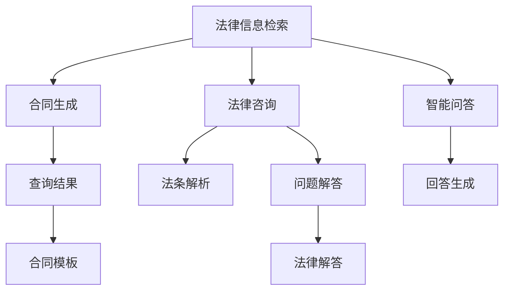

                 

# LLM在法律领域的应用：AI法律顾问

> 关键词：法律信息检索,合同生成,法律咨询,法条解析,智能问答

## 1. 背景介绍

### 1.1 问题由来
近年来，人工智能(AI)技术在各个领域迅猛发展，特别是在自然语言处理(NLP)领域，基于大规模预训练语言模型(Large Language Models, LLMs)的应用场景层出不穷。法律领域也不例外。法律行业信息量巨大、专业性强，传统的法律服务方式已难以适应现代社会的发展需求。法律领域AI顾问的出现，通过智能化的信息检索、合同生成、法律咨询等功能，大大提高了法律服务的工作效率，减少了法律服务的成本。

### 1.2 问题核心关键点
法律领域AI顾问的核心关键点在于：
1. **预训练模型的选择**：如RoBERTa、BERT等语言模型在法律领域数据上进行了特定微调。
2. **法律专业领域的知识表示**：如何有效提取和表达法律领域的专业知识，是实现法律服务AI化的关键。
3. **任务适配层的构建**：设计符合法律领域的任务适配层，确保模型能够准确理解和生成法律文本。
4. **法律数据标注与处理**：高质量的法律数据标注是模型训练的基础，但获取成本较高。
5. **模型性能评估**：如何客观评估AI法律顾问的效果，确保其可靠性和可信度。

## 2. 核心概念与联系

### 2.1 核心概念概述

为更好地理解LLM在法律领域的应用，本节将介绍几个密切相关的核心概念：

- 法律信息检索(Legal Information Retrieval)：从大量法律文本中快速检索出与用户问题相关的信息，是法律咨询的基础功能。
- 合同生成(Contract Generation)：根据用户提供的信息和模板，自动生成符合法律规范的合同文本。
- 法律咨询(Legal Consultation)：模拟律师提供咨询服务，解决用户提出的法律问题。
- 法条解析(Statute Interpretation)：解释法律条文的具体含义和适用范围，帮助用户理解法律。
- 智能问答(Chatbot)：基于用户输入的文本问题，自动生成详细且准确的回答。

这些核心概念之间的逻辑关系可以通过以下Mermaid流程图来展示：



这个流程图展示了大模型在法律领域的核心功能及其之间的关系：

1. 通过法律信息检索和合同生成，为法律咨询和智能问答提供数据支持。
2. 法律咨询和法条解析可以通过智能问答功能进一步细化，提高用户满意度。
3. 合同生成和法律咨询能够提供具体的法律文本和解答，为法律咨询和智能问答提供实证支持。

## 3. 核心算法原理 & 具体操作步骤
### 3.1 算法原理概述

基于LLM的法律领域AI顾问，其核心算法原理基于预训练语言模型和监督学习的思想。首先，使用大规模的法律文本数据对预训练语言模型进行微调，使其能够理解和处理法律领域的语言特征和知识结构。然后，在特定的法律咨询、合同生成、法条解析等任务上，对微调后的模型进行进一步的监督学习，以实现高效、准确、自动化的法律服务。

### 3.2 算法步骤详解

#### 步骤1：准备数据集
收集并预处理法律领域的文本数据，如法条、案例、法律文书等。数据集需要涵盖不同类型和不同年代的法律文本，以确保模型的泛化能力。

#### 步骤2：选择预训练模型
选择适合的预训练语言模型，如RoBERTa、BERT等，进行微调。这些模型在通用领域有较好的表现，但需要对法律领域的语料进行特定微调以适应专业需求。

#### 步骤3：设计任务适配层
设计适合法律领域特定任务的任务适配层，如合同生成需要考虑合同条款的格式和合规性，法律咨询需要理解用户的具体问题并匹配相关法条等。

#### 步骤4：微调模型
使用监督学习方法对模型进行微调。以法律咨询为例，将标注的咨询问答作为输入，通过前向传播和反向传播更新模型参数，最小化预测结果与真实标签之间的差距。

#### 步骤5：测试和部署
在测试集上评估微调后模型的性能，确保其在法律领域的准确性和可靠性。将模型部署到生产环境，提供实时服务。

### 3.3 算法优缺点

基于LLM的法律领域AI顾问具有以下优点：
1. **高效性**：能够快速处理法律咨询、合同生成等任务，提升法律服务效率。
2. **准确性**：利用法律领域的预训练模型，能够更好地理解法律文本，提供准确的信息和建议。
3. **可扩展性**：基于LLM的微调方法，可以灵活适配不同的法律任务，扩展法律服务范围。
4. **低成本**：通过自动化处理大量法律咨询和合同生成任务，减少人力成本和时间成本。

同时，该方法也存在一些局限性：
1. **数据依赖**：法律领域的标注数据获取成本高，数据集大小和质量对模型效果有很大影响。
2. **语言多样性**：不同国家和地区法律语言差异较大，通用模型可能在某些领域表现不佳。
3. **法律文本复杂性**：法律文本的逻辑性和结构性复杂，模型需要精准捕捉细节，避免误解。
4. **伦理问题**：法律服务涉及隐私保护和伦理道德，模型需要保证数据安全和算法公正性。

## 4. 数学模型和公式 & 详细讲解
### 4.1 数学模型构建

假设法律咨询任务的输入为 $x$，输出为 $y$，即用户提出的问题与法律咨询的解答。模型选择RoBERTa，其输入为词向量表示的文本，输出为法律咨询的解答。模型的形式为：

$$
f(x; \theta) = \text{RoBERTa}(x; \theta)
$$

其中，$\theta$ 为RoBERTa模型的参数，$f(x; \theta)$ 表示模型对输入 $x$ 的预测结果。

### 4.2 公式推导过程

假设训练集中有 $N$ 个样本，每个样本包含输入 $x_i$ 和标签 $y_i$。模型在训练集上的损失函数为交叉熵损失：

$$
\mathcal{L}(\theta) = -\frac{1}{N}\sum_{i=1}^N \log P(y_i \mid x_i; \theta)
$$

其中，$P(y_i \mid x_i; \theta)$ 表示模型对输入 $x_i$ 的预测结果 $y_i$ 的概率，通过softmax函数计算：

$$
P(y_i \mid x_i; \theta) = \frac{e^{f(x_i; \theta)[y_i]}}{\sum_{j=1}^{M}e^{f(x_i; \theta)[j]}}
$$

其中，$M$ 为标签的类别数。

通过梯度下降等优化算法，最小化损失函数 $\mathcal{L}(\theta)$，得到最优参数 $\theta^*$：

$$
\theta^* = \mathop{\arg\min}_{\theta} \mathcal{L}(\theta)
$$

### 4.3 案例分析与讲解

以法条解析任务为例，假设法条文本为 $L$，用户问题为 $Q$，解析结果为 $A$。解析过程可以描述为：

$$
A = f(Q; \theta) = \text{RoBERTa}(Q; \theta)
$$

其中，$\theta$ 为RoBERTa模型的参数，$f(Q; \theta)$ 表示模型对用户问题 $Q$ 的解析结果 $A$。

在训练阶段，通过大量已标注的法条和用户问题数据对模型进行微调。在推理阶段，输入用户问题 $Q$，输出法条解析结果 $A$。通过不断迭代和优化，模型能够准确理解和生成法律文本，为法条解析任务提供高效支持。

## 5. 项目实践：代码实例和详细解释说明
### 5.1 开发环境搭建

在进行法律领域AI顾问的开发实践前，需要准备以下开发环境：

1. **Python环境**：确保安装了Python 3.7及以上版本，并使用虚拟环境管理依赖。

2. **深度学习框架**：选择PyTorch或TensorFlow作为深度学习框架，安装相应版本的预训练语言模型库（如RoBERTa）。

3. **数据处理工具**：安装NLTK、spaCy等NLP工具包，用于处理法律文本数据。

4. **模型服务框架**：安装FastAPI或Flask，用于搭建模型服务接口。

5. **测试和部署工具**：安装单元测试框架unittest和数据库管理工具SQLite，用于模型测试和数据存储。

### 5.2 源代码详细实现

以下是一个基于RoBERTa的法律咨询系统代码实现，具体步骤如下：

```python
from transformers import RobertaForQuestionAnswering, RobertaTokenizer
import torch
from torch.utils.data import DataLoader
from sklearn.model_selection import train_test_split
from torch.nn import CrossEntropyLoss
from torch.optim import AdamW

# 加载预训练模型和分词器
model = RobertaForQuestionAnswering.from_pretrained('roberta-large-wwm-ext')
tokenizer = RobertaTokenizer.from_pretrained('roberta-large-wwm-ext')

# 加载法律咨询数据集
# 数据集为三元组 (question, answer, context)，其中context为法律文本
data = load_legal_data()
train_data, dev_data = train_test_split(data, test_size=0.2)
train_loader = DataLoader(train_data, batch_size=16, shuffle=True)
dev_loader = DataLoader(dev_data, batch_size=16, shuffle=False)

# 设置优化器和损失函数
optimizer = AdamW(model.parameters(), lr=1e-5)
loss_fn = CrossEntropyLoss()

# 训练函数
def train_epoch(model, data_loader, optimizer, loss_fn):
    model.train()
    total_loss = 0
    for batch in data_loader:
        inputs = tokenizer(batch['question'], batch['context'], padding=True, return_tensors='pt')
        labels = batch['answer']
        outputs = model(**inputs)
        logits = outputs.logits
        loss = loss_fn(logits, labels)
        optimizer.zero_grad()
        loss.backward()
        optimizer.step()
        total_loss += loss.item()
    return total_loss / len(data_loader)

# 评估函数
def evaluate(model, data_loader, loss_fn):
    model.eval()
    total_loss = 0
    for batch in data_loader:
        inputs = tokenizer(batch['question'], batch['context'], padding=True, return_tensors='pt')
        labels = batch['answer']
        outputs = model(**inputs)
        logits = outputs.logits
        loss = loss_fn(logits, labels)
        total_loss += loss.item()
    return total_loss / len(data_loader)

# 训练过程
epochs = 10
for epoch in range(epochs):
    train_loss = train_epoch(model, train_loader, optimizer, loss_fn)
    dev_loss = evaluate(model, dev_loader, loss_fn)
    print(f'Epoch {epoch+1}, train loss: {train_loss:.3f}, dev loss: {dev_loss:.3f}')

# 推理过程
def get_answer(question, context):
    inputs = tokenizer(question, context, padding=True, return_tensors='pt')
    outputs = model(**inputs)
    logits = outputs.logits
    answer = torch.argmax(logits[0])  # 获取最高概率的标签
    return tokenizer.decode(answer)
```

### 5.3 代码解读与分析

代码中主要分为数据加载、模型训练和推理三个部分。

**数据加载**：
- `load_legal_data()`：加载预处理的法律咨询数据集。
- `train_test_split()`：将数据集划分为训练集和验证集。
- `DataLoader`：将数据集分割成批处理，供模型训练和推理使用。

**模型训练**：
- `train_epoch()`：每个epoch中，使用AdamW优化器更新模型参数，最小化交叉熵损失。
- `evaluate()`：在验证集上评估模型效果，输出平均损失。

**推理过程**：
- `get_answer()`：输入用户问题和法律文本，使用模型进行推理，输出预测结果。

## 6. 实际应用场景
### 6.1 法律信息检索

法律信息检索是法律咨询的基础功能，通过文本检索技术，从大量法律文本中快速定位相关法律条文和案例。在实际应用中，用户可以输入具体的法律问题，系统自动检索并返回相关的法条、案例和分析。

### 6.2 合同生成

合同生成是法律领域的重要应用之一，涉及合同条款的格式、内容合规性等多个方面。通过预训练模型和任务适配层的设计，系统能够自动生成符合法律规范的合同文本，提高合同编写效率和准确性。

### 6.3 法律咨询

法律咨询能够模拟律师提供咨询服务，解决用户提出的法律问题。在实际应用中，用户输入具体问题，系统自动生成法律咨询结果和建议。

### 6.4 法条解析

法条解析是对法律条文的详细解释和适用情况分析。系统通过预训练模型和任务适配层的设计，能够准确解析法律条文的具体含义和适用范围，为法律咨询和智能问答提供实证支持。

### 6.5 智能问答

智能问答基于用户输入的文本问题，自动生成详细且准确的回答。在实际应用中，用户输入具体问题，系统自动生成法律解答和建议。

## 7. 工具和资源推荐
### 7.1 学习资源推荐

为了帮助开发者系统掌握LLM在法律领域的应用，以下是一些优质的学习资源：

1. **《Transformers: From Theory to Practice》系列博文**：详细介绍了RoBERTa等预训练语言模型在法律领域的微调和应用。

2. **Coursera上的《Legal Informatics and Technology》课程**：介绍法律信息检索和法律咨询等法律技术，帮助开发者掌握法律领域的知识表示。

3. **《AI Legal Practice: A Comprehensive Guide》书籍**：全面介绍了AI法律顾问的实现方法和应用案例。

4. **Legal AI GitHub项目**：包含多个法律领域的AI应用代码，包括法律信息检索、合同生成、法律咨询等。

5. **OpenAI的GPT-3 API**：提供了丰富的自然语言处理API，包括法律咨询、合同生成等功能。

通过对这些资源的学习实践，相信你一定能够快速掌握LLM在法律领域的应用精髓，并用于解决实际的法律问题。

### 7.2 开发工具推荐

高效的开发离不开优秀的工具支持。以下是几款用于法律领域AI顾问开发的常用工具：

1. **PyTorch**：基于Python的开源深度学习框架，灵活动态的计算图，适合快速迭代研究。大部分预训练语言模型都有PyTorch版本的实现。

2. **TensorFlow**：由Google主导开发的开源深度学习框架，生产部署方便，适合大规模工程应用。同样有丰富的预训练语言模型资源。

3. **RoBERTa官方库**：HuggingFace开发的RoBERTa库，集成了RoBERTa模型，支持预训练模型的微调。

4. **NLTK**：自然语言处理工具包，提供了丰富的NLP处理功能，包括分词、词性标注、命名实体识别等。

5. **spaCy**：自然语言处理库，提供了高效的文本处理功能，包括分词、词性标注、句法分析等。

6. **FastAPI**：基于Python的Web框架，支持快速构建API服务，方便模型部署。

7. **SQLite**：轻量级数据库，支持存储和查询结构化数据，方便模型训练和推理。

### 7.3 相关论文推荐

法律领域AI顾问的发展源于学界的持续研究。以下是几篇奠基性的相关论文，推荐阅读：

1. **Attention is All You Need**：提出Transformer结构，开启了NLP领域的预训练大模型时代。

2. **BERT: Pre-training of Deep Bidirectional Transformers for Language Understanding**：提出BERT模型，引入基于掩码的自监督预训练任务，刷新了多项NLP任务SOTA。

3. **Legal Information Retrieval Using Deep Learning**：介绍法律信息检索的深度学习应用，包括RoBERTa模型在法律文本检索中的应用。

4. **AI Legal Consultancy: A Survey**：全面综述了AI法律咨询的发展历程和未来趋势，分析了法律领域的知识表示和模型构建。

5. **Robust Legal AI: Challenges and Opportunities**：分析了法律AI面临的挑战和未来发展方向，探讨了如何提高模型的鲁棒性和可信度。

这些论文代表了大语言模型在法律领域的应用发展脉络。通过学习这些前沿成果，可以帮助研究者把握学科前进方向，激发更多的创新灵感。

## 8. 总结：未来发展趋势与挑战
### 8.1 总结

本文对基于LLM的法律领域AI顾问进行了全面系统的介绍。首先阐述了LLM在法律领域的应用背景和意义，明确了LLM在法律领域的应用价值。其次，从原理到实践，详细讲解了LLM在法律咨询、合同生成、法条解析等任务上的实现方法，给出了完整的代码实例。同时，本文还广泛探讨了LLM在法律领域的应用场景和未来发展方向，展示了LLM在法律领域的广阔前景。此外，本文精选了LLM在法律领域的学习资源，力求为读者提供全方位的技术指引。

通过本文的系统梳理，可以看到，基于LLM的法律领域AI顾问正在成为法律服务的重要范式，极大地提升了法律服务的效率和准确性。未来，伴随LLM技术的不断进步，法律领域AI顾问必将发挥更大的作用，为法律行业带来变革性影响。

### 8.2 未来发展趋势

展望未来，LLM在法律领域的应用将呈现以下几个发展趋势：

1. **数据驱动的训练**：法律领域的标注数据需求大，数据驱动的训练将进一步提升模型的泛化能力和准确性。

2. **多模态融合**：结合法律领域的语义、视觉、语音等多种模态信息，提升法律服务的全面性和智能性。

3. **跨领域适应**：LLM能够从不同领域的知识中提取共性，提升法律服务的通用性和跨领域适应能力。

4. **实时服务**：通过优化模型和推理引擎，实现LLM在法律咨询、合同生成等任务上的实时服务，提高用户满意度。

5. **隐私保护**：法律服务涉及隐私保护，需要设计合适的隐私保护机制，确保数据安全和算法公正性。

6. **伦理导向**：法律服务需要遵守伦理道德规范，LLM需要引入伦理导向的评估指标，确保模型输出的可靠性。

以上趋势凸显了LLM在法律领域应用的广阔前景。这些方向的探索发展，必将进一步提升法律服务的智能性和效率，为法律行业带来新的变革。

### 8.3 面临的挑战

尽管LLM在法律领域的应用取得了显著进展，但在迈向更加智能化、普适化应用的过程中，它仍面临着诸多挑战：

1. **数据获取成本高**：法律领域的标注数据获取成本高，数据集大小和质量对模型效果有很大影响。

2. **语言多样性**：不同国家和地区法律语言差异较大，通用模型可能在某些领域表现不佳。

3. **文本复杂性**：法律文本的逻辑性和结构性复杂，模型需要精准捕捉细节，避免误解。

4. **伦理问题**：法律服务涉及隐私保护和伦理道德，模型需要保证数据安全和算法公正性。

5. **计算资源需求高**：法律领域的复杂性导致模型计算资源需求高，需要优化模型和推理引擎。

6. **系统安全性**：法律服务涉及法律事务，需要保证系统安全性，避免误导性输出。

这些挑战需要研究者不断探索和优化，才能确保LLM在法律领域应用的可靠性和有效性。

### 8.4 研究展望

面对LLM在法律领域应用的挑战，未来的研究需要在以下几个方面寻求新的突破：

1. **多模态融合技术**：结合法律领域的语义、视觉、语音等多种模态信息，提升法律服务的全面性和智能性。

2. **跨领域适应性**：设计具有跨领域适应能力的模型，提高LLM在不同法律领域的通用性。

3. **隐私保护机制**：引入隐私保护机制，确保法律服务中的数据安全和算法公正性。

4. **伦理导向评估**：设计伦理导向的评估指标，确保LLM输出的可靠性和可信度。

5. **实时推理优化**：优化模型和推理引擎，提升LLM在法律咨询、合同生成等任务上的实时服务能力。

这些研究方向将推动LLM在法律领域的应用不断进步，为法律行业带来更深远的变革。

## 9. 附录：常见问题与解答
### 附录

**Q1：LLM在法律领域应用时如何处理法律文本的复杂性？**

A: 法律文本的逻辑性和结构性复杂，需要设计特定的任务适配层，如合同生成需要考虑合同条款的格式和合规性，法条解析需要准确理解法律条文的具体含义和适用范围。通过任务适配层的设计，能够更好地处理法律文本的复杂性。

**Q2：如何优化LLM在法律领域的计算资源需求？**

A: 法律领域的复杂性导致模型计算资源需求高，需要优化模型和推理引擎，如使用梯度积累、混合精度训练、模型并行等技术，减少内存占用和计算时间。

**Q3：LLM在法律领域应用时如何确保数据安全和算法公正性？**

A: 法律服务涉及隐私保护和伦理道德，需要引入隐私保护机制，确保数据安全和算法公正性。设计合适的隐私保护算法，如差分隐私、联邦学习等，可以保护用户隐私。同时引入伦理导向的评估指标，确保模型输出的可靠性和可信度。

**Q4：LLM在法律领域应用时如何处理法律文本的多样性？**

A: 不同国家和地区法律语言差异较大，通用模型可能在某些领域表现不佳。需要针对特定法律领域的语料进行微调，增强模型的跨领域适应能力。

**Q5：LLM在法律领域应用时如何提升模型的泛化能力？**

A: 法律领域的标注数据需求大，数据驱动的训练将进一步提升模型的泛化能力和准确性。通过扩大数据集规模，增加数据多样性，可以提升LLM在法律领域的泛化能力。

作者：禅与计算机程序设计艺术 / Zen and the Art of Computer Programming

