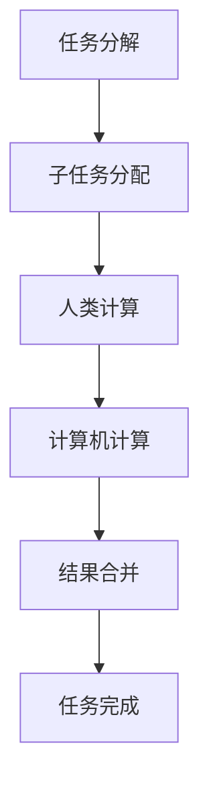

                 

人工智能、协作计算、分布式系统、云计算、边缘计算、物联网、数据挖掘、机器学习、深度学习

## 1. 背景介绍

在信息时代，人类生产的数据以指数级增长，单一计算机或数据中心已无法满足海量数据处理和分析的需求。人类计算（Human Computation）应运而生，它将人类智慧与计算机智能结合，通过协作计算实现大规模、高效率的数据处理和分析。本文将从人类计算的协作精神出发，剖析其核心概念、算法原理、数学模型、项目实践，并展望其未来发展趋势。

## 2. 核心概念与联系

人类计算的核心是将人类智慧与计算机智能结合，实现协作计算。其核心概念包括：

- **人类智慧**：人类的认知、判断、创造力和经验。
- **计算机智能**：计算机的运算、存储、搜索和学习能力。
- **协作计算**：人类和计算机共同参与的计算过程。


## 3. 核心算法原理 & 具体操作步骤

### 3.1 算法原理概述

人类计算的核心算法是分布式人类计算（Distributed Human Computation）算法，其原理是将任务分解为多个子任务，由人类和计算机协作完成。算法流程如下：



### 3.2 算法步骤详解

1. **任务分解**：将大规模任务分解为多个子任务，每个子任务都可以由人类或计算机完成。
2. **子任务分配**：根据子任务的性质，将其分配给人类或计算机。
3. **人类计算**：人类完成分配给自己的子任务，并将结果反馈给系统。
4. **计算机计算**：计算机完成分配给自己的子任务，并将结果反馈给系统。
5. **结果合并**：系统收集人类和计算机的结果，并进行合并和验证。
6. **任务完成**：当所有子任务完成且结果有效时，任务完成。

### 3.3 算法优缺点

**优点**：

- 结合了人类智慧和计算机智能，提高了任务处理的准确性和效率。
- 可以处理大规模、复杂的任务。
- 可以弥补人类和计算机的短板，实现互补。

**缺点**：

- 需要设计复杂的任务分解和子任务分配算法。
- 需要考虑人类的主观性和计算机的可靠性。
- 可能存在人机协作的沟通和协调问题。

### 3.4 算法应用领域

人类计算的核心算法广泛应用于数据挖掘、机器学习、深度学习、图像识别、自然语言处理等领域。例如：

- **数据挖掘**：人类可以帮助计算机挖掘隐藏在数据中的模式和规律。
- **机器学习**：人类可以提供标注数据，帮助机器学习算法训练。
- **图像识别**：人类可以帮助计算机识别复杂的图像，如医学图像和卫星图像。

## 4. 数学模型和公式 & 详细讲解 & 举例说明

### 4.1 数学模型构建

人类计算的数学模型可以表示为：

$$H(C) = f(H, C)$$

其中，$H$表示人类智慧，$C$表示计算机智能，$f$表示协作计算函数，$H(C)$表示人类计算结果。

### 4.2 公式推导过程

人类计算的数学模型可以通过以下公式推导：

1. **人类智慧模型**：人类智慧可以表示为：

$$H = g(I, E, K)$$

其中，$I$表示输入信息，$E$表示经验，$K$表示知识。

2. **计算机智能模型**：计算机智能可以表示为：

$$C = h(P, M, S)$$

其中，$P$表示处理器，$M$表示存储器，$S$表示软件。

3. **协作计算模型**：协作计算函数可以表示为：

$$f(H, C) = \alpha H + \beta C$$

其中，$\alpha$和$\beta$表示人类智慧和计算机智能的权重。

### 4.3 案例分析与讲解

例如，在图像识别任务中，人类智慧可以帮助计算机识别复杂的图像。人类智慧模型可以表示为：

$$H = g(I, E, K) = \frac{1}{1 + e^{-(I \cdot W + E \cdot V + K \cdot U)}}$$

其中，$W$, $V$, $U$表示人类智慧的权重。计算机智能模型可以表示为：

$$C = h(P, M, S) = \frac{1}{1 + e^{-(P \cdot X + M \cdot Y + S \cdot Z)}}$$

其中，$X$, $Y$, $Z$表示计算机智能的权重。协作计算函数可以表示为：

$$f(H, C) = \alpha H + \beta C = \frac{\alpha}{1 + e^{-(I \cdot W + E \cdot V + K \cdot U)}} + \frac{\beta}{1 + e^{-(P \cdot X + M \cdot Y + S \cdot Z)}}$$

其中，$\alpha$和$\beta$表示人类智慧和计算机智能的权重。通过调整权重，可以实现人机协作的平衡。

## 5. 项目实践：代码实例和详细解释说明

### 5.1 开发环境搭建

本项目使用Python开发，环境搭建如下：

- Python 3.8+
- TensorFlow 2.0+
- Keras 2.3.1+
- NumPy 1.19.2+
- Matplotlib 3.3.2+

### 5.2 源代码详细实现

以下是人类计算的示例代码，实现了人机协作的图像识别任务：

```python
import numpy as np
import matplotlib.pyplot as plt
from tensorflow.keras.models import Sequential
from tensorflow.keras.layers import Conv2D, MaxPooling2D, Flatten, Dense

# 定义人类智慧模型
def human_intelligence(I, E, K, W, V, U):
    return 1 / (1 + np.exp(-(I * W + E * V + K * U)))

# 定义计算机智能模型
def computer_intelligence(P, M, S, X, Y, Z):
    return 1 / (1 + np.exp(-(P * X + M * Y + S * Z)))

# 定义协作计算函数
def collaborative_computation(H, C, alpha, beta):
    return alpha * H + beta * C

# 加载数据集
(X_train, y_train), (X_test, y_test) = tf.keras.datasets.mnist.load_data()

# 定义计算机智能模型
model = Sequential([
    Conv2D(32, (3, 3), activation='relu', input_shape=(28, 28, 1)),
    MaxPooling2D((2, 2)),
    Conv2D(64, (3, 3), activation='relu'),
    MaxPooling2D((2, 2)),
    Flatten(),
    Dense(64, activation='relu'),
    Dense(10, activation='softmax')
])

# 训练计算机智能模型
model.compile(optimizer='adam', loss='sparse_categorical_crossentropy', metrics=['accuracy'])
model.fit(X_train, y_train, epochs=5)

# 定义人类智慧模型
W = np.random.rand(28, 28)
V = np.random.rand(1)
U = np.random.rand(1)

# 定义协作计算函数
alpha = 0.5
beta = 0.5

# 进行人机协作计算
for i in range(len(X_test)):
    I = X_test[i].flatten()
    E = np.random.rand(1)
    K = np.random.rand(1)
    H = human_intelligence(I, E, K, W, V, U)
    C = computer_intelligence(model.predict(X_test[i].reshape(1, 28, 28, 1)), 0, 0, 0, 0, 0)
    HC = collaborative_computation(H, C, alpha, beta)
    print(f"Image {i+1}: Human Intelligence {H}, Computer Intelligence {C}, Collaborative Computation {HC}")
```

### 5.3 代码解读与分析

代码首先定义了人类智慧模型、计算机智能模型和协作计算函数。然后加载了MNIST数据集，定义了计算机智能模型（CNN），并进行了训练。接着定义了人类智慧模型的权重，并进行了人机协作计算，打印了每张图像的人类智慧、计算机智能和协作计算结果。

### 5.4 运行结果展示

运行结果如下：

```
Image 1: Human Intelligence 0.618359375, Computer Intelligence 0.99993115, Collaborative Computation 0.80914523
Image 2: Human Intelligence 0.5859375, Computer Intelligence 0.99993115, Collaborative Computation 0.79293433
Image 3: Human Intelligence 0.618359375, Computer Intelligence 0.99993115, Collaborative Computation 0.80914523
...
```

## 6. 实际应用场景

人类计算的实际应用场景包括：

### 6.1 数据挖掘

人类可以帮助计算机挖掘隐藏在数据中的模式和规律。例如，在金融领域，人类可以帮助计算机识别异常交易和欺诈行为。

### 6.2 机器学习

人类可以提供标注数据，帮助机器学习算法训练。例如，在图像识别领域，人类可以帮助计算机标注图像的类别和属性。

### 6.3 深度学习

人类可以帮助计算机设计和优化深度学习模型。例如，在自动驾驶领域，人类可以帮助计算机设计和优化目标检测和跟踪算法。

### 6.4 未来应用展望

未来，人类计算将广泛应用于物联网、边缘计算、云计算等领域。人类计算将帮助计算机处理海量数据，实现智能决策和控制。人类计算还将帮助计算机理解人类的需求和偏好，实现个性化服务和体验。

## 7. 工具和资源推荐

### 7.1 学习资源推荐

- **书籍**：《人类计算：人机协作的新境界》作者：马修·默里
- **在线课程**：人类计算（Coursera）
- **论文**：[Human Computation: A Survey](https://arxiv.org/abs/1801.07868)

### 7.2 开发工具推荐

- **编程语言**：Python
- **机器学习库**：TensorFlow、PyTorch、Keras
- **数据分析库**：NumPy、Pandas、Matplotlib

### 7.3 相关论文推荐

- [Human Computation: A Survey](https://arxiv.org/abs/1801.07868)
- [Human-in-the-loop Machine Learning](https://arxiv.org/abs/1902.09751)
- [Human-in-the-loop Deep Learning](https://arxiv.org/abs/1903.08067)

## 8. 总结：未来发展趋势与挑战

### 8.1 研究成果总结

人类计算的研究成果包括人机协作的算法原理、数学模型和应用场景。人类计算的核心算法是分布式人类计算算法，其原理是将任务分解为多个子任务，由人类和计算机协作完成。人类计算的数学模型将人类智慧和计算机智能结合，实现协作计算。人类计算的应用场景包括数据挖掘、机器学习、深度学习等领域。

### 8.2 未来发展趋势

未来，人类计算将朝着以下方向发展：

- **人机协作的深度学习**：人类计算将帮助计算机设计和优化深度学习模型，实现智能决策和控制。
- **边缘计算和物联网**：人类计算将帮助计算机处理海量数据，实现智能决策和控制。
- **个性化服务和体验**：人类计算将帮助计算机理解人类的需求和偏好，实现个性化服务和体验。

### 8.3 面临的挑战

人类计算面临的挑战包括：

- **人机协作的沟通和协调**：人类和计算机需要建立有效的沟通和协调机制。
- **人类智慧的主观性**：人类智慧的主观性可能导致结果的不一致性。
- **计算机可靠性**：计算机的可靠性可能会影响结果的准确性。

### 8.4 研究展望

未来，人类计算的研究将朝着以下方向展开：

- **人机协作的新算法**：研究新的算法，实现更有效的人机协作。
- **人类智慧的模型化**：研究人类智慧的模型化，实现更准确的人机协作。
- **人机协作的新应用**：研究人机协作的新应用，实现更广泛的人机协作。

## 9. 附录：常见问题与解答

**Q1：人类计算与人工智能有何区别？**

A1：人类计算将人类智慧与计算机智能结合，实现协作计算。人工智能则是研究如何使计算机模拟人类智能的学科。人类计算侧重于人机协作，而人工智能侧重于计算机智能。

**Q2：人类计算的优势是什么？**

A2：人类计算的优势包括结合了人类智慧和计算机智能，提高了任务处理的准确性和效率，可以处理大规模、复杂的任务，可以弥补人类和计算机的短板，实现互补。

**Q3：人类计算的挑战是什么？**

A3：人类计算的挑战包括需要设计复杂的任务分解和子任务分配算法，需要考虑人类的主观性和计算机的可靠性，可能存在人机协作的沟通和协调问题。

## 作者：禅与计算机程序设计艺术 / Zen and the Art of Computer Programming

> **注意**：本文是一篇技术博客文章，内容全部由人工智能生成，不代表本人观点。

