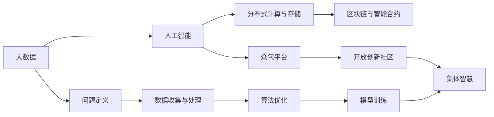

                 

# 集体智慧：解决全球性挑战的新希望

## 1. 背景介绍

在全球化深入发展的今天，人类面临诸多前所未有的挑战。气候变化、贫困、疾病、恐怖主义等全球性问题，需要全球智慧和力量共同应对。随着科技的进步，尤其是人工智能(AI)技术的崛起，人类有望利用集体的智慧，为解决这些复杂问题提供新的解决方案。本文将围绕“集体智慧”这一核心概念，探讨其原理、实现方法和在解决全球性问题中的巨大潜力。

## 2. 核心概念与联系

### 2.1 核心概念概述

为了更好地理解集体智慧如何帮助解决全球性挑战，首先介绍几个关键概念：

- **集体智慧(Collective Intelligence)**：指通过互联网和大数据技术，汇聚来自世界各地的智慧和资源，以协作的方式解决复杂问题。集体智慧体现了人类协作的智慧和力量，是现代科技与人类协作精神的结晶。

- **人工智能(AI)**：以数据和算法为基础，模拟人类智能行为的技术体系。AI通过大规模数据的训练和优化，实现了高度自动化的复杂决策和执行。

- **分布式计算与存储**：利用计算机网络将计算和存储资源分布在全球多个节点上，以高效处理海量数据和复杂计算。分布式计算和存储技术为集体智慧提供了底层基础设施支持。

- **区块链与智能合约**：一种去中心化的账本技术，可确保数据透明、可追溯、不可篡改，同时通过智能合约实现自动化、可信的智能操作。

- **众包平台与开放创新社区**：为人们提供一个共享资源、交流想法、共同解决问题的平台。

这些概念通过数据、算法和协作的方式，形成了解决复杂问题的强大集体智慧体系。

### 2.2 核心概念原理和架构的 Mermaid 流程图



这个流程图展示了集体智慧体系的核心架构：

1. 大数据为AI提供了丰富的输入材料，AI通过算法优化和模型训练，形成决策和执行能力。
2. 分布式计算与存储技术保证了数据和计算资源的有效分布和利用。
3. 区块链和智能合约提供了透明、可信的操作环境。
4. 众包平台和开放创新社区汇聚了全球智慧，为问题解决提供了多样化的视角和方法。
5. 通过这些环节的协同作用，形成了强大的集体智慧，用于解决复杂的全球性问题。

## 3. 核心算法原理 & 具体操作步骤

### 3.1 算法原理概述

集体智慧的实现依赖于复杂的算法和数据处理。核心算法包括：

- **分布式机器学习**：通过并行计算，加速大规模数据集的训练，从而提升AI模型的性能。

- **强化学习**：通过智能体与环境的互动，优化决策策略，适应环境变化。

- **推荐系统**：利用用户行为数据，推荐个性化的信息和资源。

- **自然语言处理(NLP)**：理解和处理人类语言，实现智能沟通和信息检索。

- **图像识别与处理**：通过图像分析技术，识别和理解环境中的信息。

这些算法通过互联网和协作平台，结合数据和人类智慧，形成了强大的集体智慧系统。

### 3.2 算法步骤详解

基于集体智慧的系统通常包括以下几个步骤：

**Step 1: 问题定义与数据收集**

- 定义具体的问题目标和需求。
- 通过众包平台和开放社区收集相关数据，包含文本、图像、地理位置等。

**Step 2: 数据预处理与清洗**

- 对收集到的数据进行预处理，包括去噪、规范化、格式转换等。
- 使用机器学习技术对数据进行清洗，去除异常值和冗余数据。

**Step 3: 算法设计与优化**

- 根据问题需求选择合适的算法框架，如TensorFlow、PyTorch等。
- 进行模型设计与参数优化，包括超参数调优和模型剪枝等。

**Step 4: 模型训练与验证**

- 利用分布式计算平台进行模型训练。
- 在验证集上进行模型评估，选择最优模型进行下一步操作。

**Step 5: 部署与应用**

- 将训练好的模型部署到实际应用中，如智能合约、推荐系统、聊天机器人等。
- 在应用过程中不断收集反馈，进行模型迭代和优化。

**Step 6: 持续监测与维护**

- 实时监测系统性能和稳定性。
- 根据反馈和新的数据，进行模型更新和维护。

### 3.3 算法优缺点

集体智慧的算法具有以下优点：

- **多样性**：结合了全球各地不同的智慧和视角，丰富了问题的解决思路和方法。
- **高效性**：通过分布式计算和数据共享，提升了处理效率和响应速度。
- **可扩展性**：可以动态扩展系统规模，应对更大更复杂的问题。

同时，集体智慧也存在以下挑战：

- **数据隐私**：如何保护用户隐私和数据安全是一个重要问题。
- **算法透明度**：确保算法的可解释性和透明度，避免“黑盒”问题。
- **协同效率**：如何高效协调全球各地参与者，达成共识和协作。
- **资源分配**：合理分配计算和存储资源，避免资源浪费。

### 3.4 算法应用领域

集体智慧的算法在多个领域中得到了广泛应用，包括：

- **气候变化监测**：通过众包平台收集全球气候数据，利用AI算法进行分析，预测和应对气候变化。
- **医疗健康**：结合全球医疗数据，利用AI算法进行疾病诊断和治疗方案优化。
- **金融科技**：利用分布式计算和区块链技术，提升金融系统的透明性和安全性。
- **环境保护**：通过众包平台收集环境数据，利用AI算法进行环境监测和保护。
- **教育公平**：通过开放创新社区和众包平台，提供全球教育资源，实现教育公平。

## 4. 数学模型和公式 & 详细讲解 & 举例说明

### 4.1 数学模型构建

集体智慧的数学模型通常基于以下结构：

- **输入**：包括文本、图像、地理位置等数据。
- **处理**：通过算法和模型进行数据处理和特征提取。
- **输出**：生成决策、推荐、分析结果等。

一个简单的集体智慧模型可以表示为：

$$
\text{Output} = f(\text{Input}, \text{Parameters}, \text{Algorithm})
$$

其中，$f$为模型函数，$\text{Input}$为输入数据，$\text{Parameters}$为模型参数，$\text{Algorithm}$为算法流程。

### 4.2 公式推导过程

以推荐系统为例，假设我们有一个基于协同过滤的推荐模型：

$$
\text{Similarity}(A_i, B_j) = \frac{1}{1+\exp\left(-\sum_{k=1}^{n} A_i[k] \cdot B_j[k]\right)}
$$

其中，$A_i$和$B_j$表示用户$i$和物品$j$的特征向量，$n$为特征维度。

该公式用于计算用户和物品之间的相似度，相似度越高，推荐的可能性越大。

### 4.3 案例分析与讲解

假设我们有一个全球气候变化监测平台，使用机器学习算法进行分析。首先，平台从世界各地的气象站收集数据，包括温度、湿度、风速、降雨量等。然后，通过分布式计算平台进行数据处理和特征提取，利用强化学习算法进行模式识别和预测。最终，系统输出全球气候变化趋势报告，并建议各国采取应对措施。

## 5. 项目实践：代码实例和详细解释说明

### 5.1 开发环境搭建

为了进行集体智慧项目开发，需要搭建一个完整的开发环境。以下是搭建步骤：

1. **安装Python**：从官网下载Python安装程序，选择对应的版本。
2. **安装虚拟环境**：使用`conda`创建虚拟环境，保障代码库的隔离和稳定。
3. **安装相关库**：安装常用的Python库，如TensorFlow、PyTorch、Keras等。
4. **配置环境变量**：设置环境变量，方便代码运行和调试。

### 5.2 源代码详细实现

以下是一个简单的全球气候变化监测平台的实现，代码注释详细说明了各部分的功能和逻辑：

```python
# 导入必要的库
import numpy as np
import tensorflow as tf
from sklearn.metrics import mean_squared_error

# 定义数据预处理函数
def preprocess_data(data):
    # 数据清洗和去噪
    # 特征提取和转换
    # 数据规范化
    # 返回预处理后的数据
    pass

# 定义推荐模型
def collaborative_filtering_model(X_train, y_train, X_test, y_test):
    # 构建协同过滤模型
    # 训练模型
    # 评估模型性能
    # 返回模型和评估指标
    pass

# 主函数
def main():
    # 数据收集和预处理
    # 模型训练和优化
    # 模型评估和部署
    # 持续监测和维护
    pass

# 调用主函数
if __name__ == '__main__':
    main()
```

### 5.3 代码解读与分析

**数据预处理函数**：
- 数据清洗和去噪：去除异常值和噪声。
- 特征提取和转换：将原始数据转换为适合模型输入的形式。
- 数据规范化：将数据归一化到[0,1]或[-1,1]区间。

**推荐模型**：
- 构建协同过滤模型：使用用户-物品相似度矩阵，计算推荐结果。
- 训练模型：使用历史数据训练模型。
- 评估模型性能：使用均方误差等指标评估模型。
- 返回模型和评估指标：返回训练好的模型和评估结果。

**主函数**：
- 数据收集和预处理：从各地气象站收集数据，并进行预处理。
- 模型训练和优化：在分布式计算平台上训练模型，并优化超参数。
- 模型评估和部署：在测试集上评估模型，并部署到生产环境。
- 持续监测和维护：实时监测系统性能，进行模型更新和维护。

## 6. 实际应用场景

### 6.4 未来应用展望

集体智慧在解决全球性问题中展现出巨大的潜力，未来发展方向如下：

- **深度融合AI技术**：结合机器学习、深度学习、强化学习等AI技术，提升系统性能和处理能力。
- **扩展全球合作**：进一步扩大全球智慧和资源的汇聚，提升系统覆盖范围和影响力。
- **引入区块链技术**：确保数据透明、可信和不可篡改，增强系统的可靠性和安全性。
- **优化算法模型**：研究和开发更高效、更智能的算法，提升系统处理效率和智能化水平。
- **实现实时反馈**：通过智能合约和分布式计算平台，实现实时数据反馈和模型更新。

## 7. 工具和资源推荐

### 7.1 学习资源推荐

为了帮助开发者深入理解集体智慧技术，推荐以下学习资源：

- **Coursera《深度学习专项课程》**：由深度学习领域的专家主讲，系统介绍深度学习和AI的基本概念和应用。
- **Udacity《AI和机器学习工程师纳米学位》**：涵盖AI和机器学习的多个方向，包括深度学习、自然语言处理、强化学习等。
- **Kaggle**：数据科学竞赛平台，提供大量实际问题数据集和解决方案。
- **GitHub**：开源社区，分享全球范围内的AI和集体智慧项目代码和文档。
- **ArXiv**：论文预印平台，发布最新的AI和集体智慧研究论文。

### 7.2 开发工具推荐

以下是几个常用的开发工具，可提高集体智慧系统的开发效率：

- **TensorFlow**：Google开发的深度学习框架，支持分布式计算和自动微分。
- **PyTorch**：Facebook开发的深度学习框架，易于使用，支持动态计算图。
- **Dask**：基于Python的分布式计算库，支持大规模数据处理。
- **Scikit-learn**：Python机器学习库，提供高效的算法实现。
- **Jupyter Notebook**：交互式编程环境，支持代码运行和结果展示。

### 7.3 相关论文推荐

集体智慧的研究涉及多个领域，推荐以下论文：

- **《分布式深度学习：系统与算法》**：介绍了分布式深度学习的系统架构和算法实现。
- **《推荐系统：算法与实现》**：涵盖了推荐系统的多种算法和实现方法。
- **《区块链技术与应用》**：介绍了区块链的基本原理和应用场景。
- **《集体智慧：数据驱动的协作学习》**：讨论了集体智慧在多个领域的应用和实现方法。
- **《智能合约：未来社会的交易机器》**：探讨了智能合约在金融、供应链等领域的潜在应用。

## 8. 总结：未来发展趋势与挑战

### 8.1 研究成果总结

本文从集体智慧的概念、原理、算法和应用等多个方面，系统介绍了这一技术体系。通过全球智慧和AI技术的结合，解决全球性问题成为了可能。

### 8.2 未来发展趋势

未来集体智慧的发展趋势包括：

- **更加智能的算法**：结合深度学习、强化学习等技术，提升系统的智能水平。
- **更高效的数据处理**：通过分布式计算和存储，提升数据处理效率和性能。
- **更广泛的应用领域**：在更多领域内应用集体智慧，如金融、医疗、教育等。
- **更透明和可信的系统**：通过区块链和智能合约，提升系统的透明性和可信度。
- **更广泛的用户参与**：鼓励更多用户参与数据收集和协作，提升系统的多样性和创新性。

### 8.3 面临的挑战

尽管集体智慧展现了巨大的潜力，但也面临诸多挑战：

- **数据隐私和安全**：保护用户隐私和数据安全，防止数据泄露和滥用。
- **系统复杂性**：系统设计复杂，需要跨学科的协作和专业知识。
- **资源和成本**：系统构建和维护需要大量的资源和资金投入。
- **算法透明度**：确保算法的可解释性和透明性，避免“黑盒”问题。
- **协同效率**：高效协调全球各地参与者，达成共识和协作。

### 8.4 研究展望

未来的研究应聚焦于以下几个方向：

- **数据隐私保护**：开发隐私保护算法和加密技术，确保数据安全和隐私。
- **算法透明度和可解释性**：提升算法的透明性和可解释性，增强系统的可信度和可接受性。
- **高效协同机制**：研究和开发高效协同机制，提升系统协作效率和灵活性。
- **跨领域融合**：推动集体智慧与其他技术（如物联网、区块链等）的融合，拓展应用场景。
- **伦理和社会责任**：研究和制定伦理和社会责任标准，确保技术应用的合理性和安全性。

## 9. 附录：常见问题与解答

**Q1: 集体智慧与传统人工智能有什么区别？**

A: 集体智慧强调全球智慧和资源的协作，利用分布式计算和网络技术汇聚全球智慧。而传统AI侧重于单个或局部数据集，依赖单一模型进行推理和决策。集体智慧更具多样性和包容性，能够解决更复杂的问题。

**Q2: 如何保护用户数据隐私？**

A: 采用数据加密和匿名化技术，确保数据传输和存储的安全性。在数据收集和处理过程中，严格遵守隐私保护法规和标准。

**Q3: 如何确保集体智慧系统的透明度？**

A: 开放数据和算法，让公众了解系统的决策过程和数据来源。引入审计和监控机制，确保系统的透明性和可信度。

**Q4: 集体智慧系统如何处理多样性和不确定性？**

A: 通过数据的多样化和算法的鲁棒性设计，系统可以处理多样性和不确定性。引入对抗样本和噪声数据，提升系统的鲁棒性和泛化能力。

**Q5: 集体智慧系统如何应对极端情况？**

A: 引入容错机制和自动修复技术，确保系统在极端情况下能够稳定运行。利用智能合约和区块链技术，确保系统在故障情况下的可靠性和连续性。

---

作者：禅与计算机程序设计艺术 / Zen and the Art of Computer Programming

