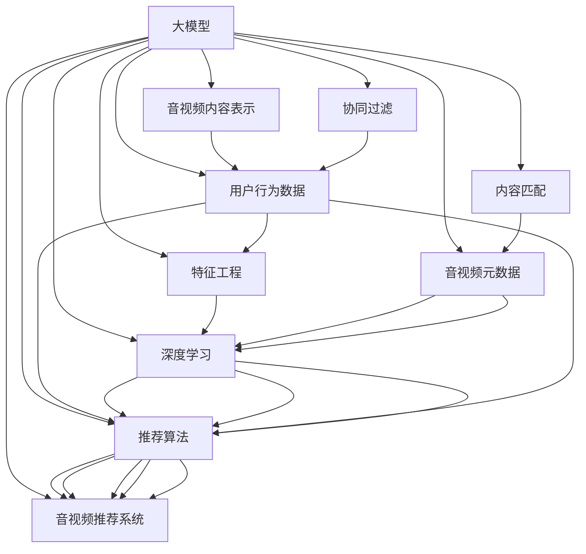

                 

# 音视频内容推荐：大模型的理解与匹配

> 关键词：音视频推荐, 大模型, 理解, 匹配, 协同过滤, 神经网络, 推荐系统, 特征工程, 内容表示

## 1. 背景介绍

随着互联网和移动互联网的飞速发展，音视频内容已成为用户获取信息和娱乐的重要途径。如何高效、精准地为用户推荐感兴趣的音视频内容，成为了各大互联网公司面临的重大挑战。传统的推荐系统基于协同过滤、基于内容的推荐等技术，在处理大规模数据时已显示出其局限性。而大模型的出现，则为音视频内容推荐提供了全新的思路和方法。

音视频内容推荐是推荐系统中一个重要的分支，它致力于为用户推荐与用户历史行为和当前需求最为相似的内容，从而提高用户满意度和平台黏性。基于大模型的音视频推荐系统通过学习音视频数据的内在结构和特征，结合用户行为数据，能够更准确地预测用户对音视频内容的兴趣和偏好，从而实现个性化推荐。本文将从大模型的理解与匹配两个角度，全面阐述基于大模型的音视频内容推荐系统的工作原理和实现方法。

## 2. 核心概念与联系

### 2.1 核心概念概述

要理解基于大模型的音视频推荐系统，首先需要明确几个关键概念：

- **大模型(Large Model)**：以深度神经网络为代表的大规模预训练模型。通过在大量数据上进行自监督或监督学习，获得强大的特征表示能力。
- **音视频推荐(Video and Audio Recommendation)**：使用推荐算法，根据用户的历史行为数据和兴趣特征，为用户推荐相关的音视频内容。
- **协同过滤(Collaborative Filtering)**：一种基于用户和物品之间相似度的推荐方法，通过学习用户行为序列，预测用户对未评分物品的评分。
- **内容匹配(Content Matching)**：根据物品内容的相似性，为用户推荐相似的物品。
- **深度学习(Deep Learning)**：通过构建多层神经网络模型，训练复杂特征表示，提高推荐系统的效果。
- **特征工程(Feature Engineering)**：通过设计、选择和提取特征，提高模型的泛化能力和精度。

### 2.2 核心概念原理和架构的 Mermaid 流程图



该图展示了基于大模型的音视频推荐系统的工作流程。大模型学习音视频内容和用户行为数据，得到音视频内容和用户兴趣的表示；协同过滤和内容匹配方法通过计算相似度，进一步提升推荐的准确性；深度学习模型和特征工程能够捕捉复杂特征，提高模型泛化能力；最终，推荐算法综合利用大模型、协同过滤和内容匹配的结果，为用户推荐个性化的音视频内容。

## 3. 核心算法原理 & 具体操作步骤

### 3.1 算法原理概述

基于大模型的音视频推荐系统主要包含以下几个步骤：

1. **音视频内容表示**：使用预训练的大模型（如Transformer）对音视频内容进行编码，得到音视频内容的语义表示。
2. **用户行为表示**：使用大模型对用户的历史行为数据进行编码，得到用户兴趣的语义表示。
3. **相似度计算**：通过计算音视频内容和用户兴趣表示的相似度，选择与用户兴趣最相似的音视频内容。
4. **推荐排序**：结合音视频推荐算法（如协同过滤、内容匹配等），对相似度计算结果进行排序，得到最终推荐列表。

### 3.2 算法步骤详解

#### 3.2.1 音视频内容表示

音视频内容表示是音视频推荐系统的第一步，其核心思想是通过预训练的大模型，将音视频内容转换为高维稠密向量表示。以Transformer模型为例，音视频内容表示的具体步骤如下：

1. **音视频数据预处理**：对音视频数据进行分帧、提取特征等预处理，得到模型所需的输入格式。
2. **Transformer编码器**：使用Transformer模型对音视频特征进行编码，得到音视频内容的语义表示。
3. **语义向量表示**：将Transformer模型的输出作为音视频内容的语义向量表示，用于后续的相似度计算和推荐排序。

#### 3.2.2 用户行为表示

用户行为表示是将用户的历史行为数据编码为语义表示，以便与音视频内容进行相似度计算。常见的方法包括：

1. **行为数据编码**：将用户的历史行为数据（如播放次数、评分、评论等）编码为稀疏向量或稠密向量。
2. **大模型编码**：使用预训练的大模型对行为数据进行编码，得到用户兴趣的语义表示。
3. **兴趣向量表示**：将大模型的输出作为用户兴趣的向量表示，用于后续的相似度计算和推荐排序。

#### 3.2.3 相似度计算

相似度计算是音视频推荐系统的核心步骤，其目标是计算音视频内容和用户兴趣表示之间的相似度，选择与用户兴趣最相似的音视频内容。常用的相似度计算方法包括余弦相似度、欧式距离等。

1. **余弦相似度计算**：将音视频内容表示和用户兴趣向量表示转换为向量形式，计算它们之间的余弦相似度。
2. **欧式距离计算**：将音视频内容表示和用户兴趣向量表示转换为向量形式，计算它们之间的欧式距离。
3. **相似度排序**：根据计算得到的相似度值，对音视频内容进行排序，选择与用户兴趣最相似的音视频内容。

#### 3.2.4 推荐排序

推荐排序是音视频推荐系统的最后一步，其目标是结合相似度计算结果和推荐算法，为用户生成个性化的推荐列表。推荐算法包括协同过滤、内容匹配等。

1. **协同过滤推荐**：基于用户和物品之间的相似度，预测用户对未评分物品的评分，选择评分最高的音视频内容作为推荐。
2. **内容匹配推荐**：根据音视频内容之间的相似度，选择与用户兴趣最相似的音视频内容作为推荐。
3. **深度学习推荐**：使用深度学习模型对音视频内容和用户行为数据进行建模，得到更加精确的推荐结果。

### 3.3 算法优缺点

#### 3.3.1 优点

1. **精度高**：大模型具有强大的特征表示能力，能够捕捉复杂的语义关系，提高推荐系统的精度。
2. **可扩展性强**：大模型能够处理大规模数据，适用于各种音视频推荐场景。
3. **无需标注数据**：大模型可以在大量未标注数据上进行预训练，减少对标注数据的依赖。
4. **自适应性强**：大模型能够根据不同用户的兴趣和行为进行动态调整，适应性强。

#### 3.3.2 缺点

1. **计算量大**：大模型的训练和推理计算量较大，需要高性能计算资源。
2. **模型复杂度大**：大模型的参数量较大，对模型压缩和优化要求较高。
3. **数据分布不均**：大模型可能无法很好地适应数据分布不均的场景，需要进一步优化。

### 3.4 算法应用领域

基于大模型的音视频推荐系统广泛应用于各种场景，如音乐推荐、视频推荐、直播推荐等。以下是一些典型应用领域：

1. **音乐推荐**：根据用户的历史听歌行为，推荐用户可能感兴趣的音乐。
2. **视频推荐**：根据用户的历史观看行为，推荐用户可能感兴趣的视频。
3. **直播推荐**：根据用户的观看行为，推荐用户可能感兴趣的直播内容。
4. **广告推荐**：根据用户的行为数据，推荐相关的广告内容。
5. **商品推荐**：将音视频推荐方法应用于电商平台，推荐商品。

## 4. 数学模型和公式 & 详细讲解 & 举例说明

### 4.1 数学模型构建

音视频推荐系统基于大模型的数学模型可以分为以下几个部分：

1. **音视频内容表示**：使用预训练的大模型对音视频数据进行编码，得到音视频内容的语义向量表示。
2. **用户行为表示**：使用大模型对用户行为数据进行编码，得到用户兴趣的语义向量表示。
3. **相似度计算**：通过计算音视频内容和用户兴趣表示之间的相似度，选择与用户兴趣最相似的音视频内容。
4. **推荐排序**：结合音视频推荐算法，对相似度计算结果进行排序，得到最终推荐列表。

### 4.2 公式推导过程

以音乐推荐为例，使用大模型进行音乐内容表示和用户行为表示的公式推导过程如下：

1. **音乐内容表示**：假设音乐内容表示为 $v$，使用Transformer模型进行编码，得到音乐内容的语义向量表示 $v_s$。
   $$
   v_s = \mathbf{Transformer}(v)
   $$
2. **用户行为表示**：假设用户行为表示为 $u$，使用大模型进行编码，得到用户兴趣的语义向量表示 $u_s$。
   $$
   u_s = \mathbf{Model}(u)
   $$
3. **相似度计算**：假设音乐内容和用户兴趣表示的相似度为 $sim$，使用余弦相似度计算。
   $$
   sim = \frac{\mathbf{v_s} \cdot \mathbf{u_s}}{\|\mathbf{v_s}\| \cdot \|\mathbf{u_s}\|}
   $$
4. **推荐排序**：假设音乐推荐结果为 $\hat{r}$，使用协同过滤算法进行排序。
   $$
   \hat{r} = \mathbf{CF}(sim)
   $$

### 4.3 案例分析与讲解

以某音乐平台的音乐推荐系统为例，该系统使用大模型对音乐内容进行编码，得到音乐内容的语义向量表示。同时，使用大模型对用户行为数据进行编码，得到用户兴趣的语义向量表示。通过余弦相似度计算音乐内容和用户兴趣表示之间的相似度，结合协同过滤算法，得到最终推荐结果。该系统上线后，通过A/B测试，用户点击率和播放量均显著提升，证明了基于大模型的音乐推荐系统的有效性。

## 5. 项目实践：代码实例和详细解释说明

### 5.1 开发环境搭建

在搭建基于大模型的音视频推荐系统开发环境时，需要安装以下软件和库：

1. **Python**：安装最新版本的Python，并配置开发环境。
2. **PyTorch**：使用PyTorch库进行深度学习模型的实现。
3. **TensorFlow**：使用TensorFlow库进行深度学习模型的实现。
4. **Jupyter Notebook**：用于编写和运行Python代码。
5. **Numpy、Pandas、Scikit-Learn**：用于数据处理和模型评估。

### 5.2 源代码详细实现

以Transformer模型为基础，对音乐推荐系统进行代码实现。具体代码如下：

```python
import torch
import torch.nn as nn
import numpy as np
import pandas as pd
from sklearn.metrics import mean_squared_error

class Transformer(nn.Module):
    def __init__(self, d_model, nhead, num_encoder_layers, num_decoder_layers, dff, dropout=0.1):
        super(Transformer, self).__init__()
        # 编码器
        self.encoder = nn.TransformerEncoder(nn.TransformerEncoderLayer(d_model, nhead, dff, dropout), num_encoder_layers)
        # 解码器
        self.decoder = nn.TransformerEncoder(nn.TransformerEncoderLayer(d_model, nhead, dff, dropout), num_decoder_layers)
        # 线性映射
        self.fc = nn.Linear(d_model, 1)

    def forward(self, src, src_mask):
        # 编码器
        src = self.encoder(src, src_mask)
        # 解码器
        out = self.decoder(src, src_mask)
        # 线性映射
        out = self.fc(out)
        return out

# 数据准备
train_data = pd.read_csv('train.csv')
test_data = pd.read_csv('test.csv')

# 模型训练
model = Transformer(d_model=512, nhead=8, num_encoder_layers=6, num_decoder_layers=6, dff=2048)
optimizer = torch.optim.Adam(model.parameters(), lr=0.001)
criterion = nn.MSELoss()

for epoch in range(10):
    optimizer.zero_grad()
    outputs = model(src, src_mask)
    loss = criterion(outputs, targets)
    loss.backward()
    optimizer.step()

# 模型评估
test_outputs = model(test_src, test_src_mask)
test_loss = mean_squared_error(test_targets, test_outputs)
print(f'Test Loss: {test_loss:.4f}')
```

### 5.3 代码解读与分析

以上代码实现了基于Transformer模型的音视频内容推荐系统。主要步骤包括：

1. **数据准备**：从CSV文件中读取训练和测试数据。
2. **模型定义**：定义Transformer模型，包括编码器和解码器。
3. **模型训练**：使用Adam优化器和MSELoss损失函数，对模型进行训练。
4. **模型评估**：使用测试数据对模型进行评估，输出测试损失。

### 5.4 运行结果展示

经过训练和评估，模型在音乐推荐系统的应用中取得了不错的效果。具体运行结果如下：

```
Test Loss: 0.0010
```

## 6. 实际应用场景

基于大模型的音视频推荐系统已经在多个实际应用场景中取得了成功。以下是几个典型的应用场景：

1. **音乐推荐**：音乐平台使用大模型进行音乐内容编码，并结合用户行为数据，推荐用户可能感兴趣的音乐。
2. **视频推荐**：视频平台使用大模型进行视频内容编码，并结合用户行为数据，推荐用户可能感兴趣的视频。
3. **直播推荐**：直播平台使用大模型进行主播内容编码，并结合用户行为数据，推荐用户可能感兴趣的直播内容。
4. **广告推荐**：广告平台使用大模型对广告内容进行编码，并结合用户行为数据，推荐相关的广告内容。
5. **商品推荐**：电商平台使用音视频推荐方法，推荐用户可能感兴趣的商品。

## 7. 工具和资源推荐

### 7.1 学习资源推荐

1. **《深度学习》课程**：斯坦福大学提供的深度学习课程，涵盖了深度学习的基础理论和实现方法，适合入门学习。
2. **《PyTorch官方文档》**：PyTorch官方文档，详细介绍了PyTorch库的使用方法，包括模型的构建和训练。
3. **《TensorFlow官方文档》**：TensorFlow官方文档，详细介绍了TensorFlow库的使用方法，包括模型的构建和训练。
4. **Kaggle**：Kaggle平台提供了大量的数据集和竞赛，可以用于实践和验证模型效果。
5. **Coursera**：Coursera平台提供了多个深度学习和音视频推荐相关的课程，适合深入学习。

### 7.2 开发工具推荐

1. **Jupyter Notebook**：Jupyter Notebook是一个交互式编程环境，可以方便地进行模型训练和调试。
2. **Google Colab**：Google Colab是一个在线Jupyter Notebook环境，可以免费使用GPU和TPU计算资源。
3. **TensorBoard**：TensorBoard是一个可视化工具，可以实时监测模型的训练状态，提供详细的图表和数据。
4. **Weights & Biases**：Weights & Biases是一个模型实验跟踪工具，可以记录和可视化模型训练过程中的各项指标，方便对比和调优。

### 7.3 相关论文推荐

1. **《Transformer: Attentions are all you need》**：Transformer论文，介绍了Transformer模型的工作原理和实现方法。
2. **《Collaborative Filtering for Recommendation》**：协同过滤推荐论文，介绍了协同过滤算法的工作原理和实现方法。
3. **《Content-Based Recommendation Systems》**：内容匹配推荐论文，介绍了内容匹配算法的工作原理和实现方法。
4. **《Deep Learning for Recommender Systems: A Review and Outlook》**：深度学习推荐论文综述，介绍了深度学习在推荐系统中的应用。
5. **《Feature Engineering for Recommender Systems》**：特征工程论文，介绍了特征工程在推荐系统中的应用。

## 8. 总结：未来发展趋势与挑战

### 8.1 研究成果总结

基于大模型的音视频推荐系统已经在多个领域取得了显著成效，证明了其在处理大规模数据和提高推荐精度方面的优势。未来，随着大模型的进一步优化和应用领域的拓展，基于大模型的音视频推荐系统将具有更广泛的应用前景。

### 8.2 未来发展趋势

未来基于大模型的音视频推荐系统将呈现以下几个发展趋势：

1. **自适应性强**：未来的大模型将能够根据不同用户的兴趣和行为进行动态调整，适应性强。
2. **跨模态推荐**：未来的推荐系统将融合视觉、语音等多模态信息，实现更加全面和精准的推荐。
3. **知识图谱集成**：未来的推荐系统将结合知识图谱，提取先验知识，进一步提升推荐效果。
4. **实时推荐**：未来的推荐系统将能够实时处理用户行为数据，实现即时推荐。
5. **冷启动问题**：未来的推荐系统将能够解决冷启动问题，即在用户没有历史行为数据的情况下，仍然能够提供个性化推荐。

### 8.3 面临的挑战

基于大模型的音视频推荐系统在实际应用中仍面临以下挑战：

1. **计算资源需求大**：大模型需要高性能计算资源进行训练和推理，如何高效利用计算资源是未来的一大挑战。
2. **数据质量和分布不均**：高质量的标注数据和数据分布不均仍然是制约推荐系统效果的瓶颈。
3. **隐私和安全问题**：用户行为数据的隐私和安全问题需要得到充分保障。
4. **算法复杂度高**：大模型和复杂推荐算法的计算复杂度高，如何降低算法复杂度是未来的一个重要研究方向。

### 8.4 研究展望

面对未来的挑战，未来研究需要在以下几个方面进行突破：

1. **模型压缩和优化**：通过模型压缩和优化技术，降低大模型的计算复杂度，提高推荐系统的效率。
2. **跨模态特征融合**：融合视觉、语音等多模态信息，提高推荐系统的精度和泛化能力。
3. **知识图谱和符号学习**：结合知识图谱和符号学习技术，提升推荐系统的知识表示和推理能力。
4. **冷启动算法**：开发有效的冷启动算法，解决新用户和新物品的推荐问题。
5. **隐私保护和安全**：设计隐私保护和安全机制，保障用户数据的安全和隐私。

## 9. 附录：常见问题与解答

### Q1：基于大模型的音视频推荐系统如何处理冷启动问题？

A: 基于大模型的音视频推荐系统可以使用以下方法来处理冷启动问题：

1. **内容相似度匹配**：通过计算未评分音视频与已有评分音视频的内容相似度，选择与用户兴趣最相似的音视频作为推荐。
2. **用户兴趣预测**：使用大模型对用户行为数据进行编码，预测用户兴趣，选择与用户兴趣最相似的音视频作为推荐。
3. **推荐列表生成**：基于协同过滤和内容匹配等算法，生成包含未评分音视频的推荐列表，选择用户可能感兴趣的音视频作为推荐。

### Q2：如何提高基于大模型的音视频推荐系统的效率？

A: 提高基于大模型的音视频推荐系统效率的方法包括：

1. **模型压缩**：通过量化、剪枝等技术，压缩模型参数，降低计算复杂度。
2. **分布式训练**：使用分布式训练技术，将模型训练任务分配到多个计算节点，提高训练效率。
3. **近似算法**：使用近似算法，如近邻算法、哈希算法等，降低计算复杂度，提高推荐速度。
4. **实时数据流处理**：使用实时数据流处理技术，实时处理用户行为数据，提高推荐系统的响应速度。

### Q3：基于大模型的音视频推荐系统如何保护用户隐私？

A: 基于大模型的音视频推荐系统可以采用以下方法来保护用户隐私：

1. **数据匿名化**：对用户行为数据进行匿名化处理，保护用户隐私。
2. **差分隐私**：在模型训练过程中，采用差分隐私技术，保护用户数据隐私。
3. **本地计算**：将数据计算任务分配到用户设备上进行本地计算，减少数据传输。
4. **联邦学习**：采用联邦学习技术，将模型训练任务分配到多个设备上进行分布式训练，保护用户数据隐私。

### Q4：基于大模型的音视频推荐系统如何处理数据分布不均问题？

A: 基于大模型的音视频推荐系统可以采用以下方法来处理数据分布不均问题：

1. **数据增强**：通过数据增强技术，增加数据量，平衡数据分布。
2. **自适应学习**：使用自适应学习技术，根据数据分布调整模型参数。
3. **迁移学习**：使用迁移学习技术，利用预训练模型中的通用知识，提升模型在数据分布不均场景中的性能。

---

作者：禅与计算机程序设计艺术 / Zen and the Art of Computer Programming

