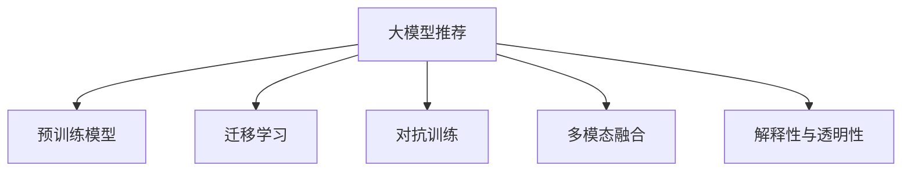

                 

# 音视频领域大模型推荐的机遇与挑战

## 1. 背景介绍

### 1.1 问题由来
随着人工智能技术的飞速发展，大模型在音视频领域的应用已逐步从传统的图像识别、语音识别扩展到更为复杂的视觉与听觉任务，如视频内容生成、视频摘要、视频情感分析等。音视频大模型，如WaveNet、StyleGAN等，能够从大规模数据中学习到丰富的音视频生成和分析能力，显著提升了相关应用的性能和效率。

### 1.2 问题核心关键点
尽管音视频大模型带来了前所未有的发展机遇，但其在实际应用中仍面临诸多挑战：
1. **数据需求与获取**：音视频数据量庞大且获取成本高，高质量的数据集难以构建。
2. **模型复杂度与计算资源**：音视频生成任务通常涉及复杂的深度神经网络，对计算资源要求较高。
3. **鲁棒性与泛化能力**：音视频数据的多样性和复杂性导致模型对噪声和变化敏感，泛化能力不足。
4. **实时性要求**：音视频应用对实时性有较高要求，大模型的推理速度往往需要优化。
5. **多模态融合**：音视频数据具有多模态特性，如何将不同模态信息高效融合是一个难点。
6. **版权与伦理问题**：音视频数据版权问题复杂，伦理问题亟需规范。

解决这些问题，需要从技术、工程和伦理等多个维度出发，寻找有效的应对策略。大模型推荐即为解决这些挑战的一种重要手段，通过推荐系统优化模型选择，提升音视频应用的效果和效率。

## 2. 核心概念与联系

### 2.1 核心概念概述

为了更好地理解大模型推荐方法，本节将介绍几个关键概念及其之间的关系：

- **大模型推荐**：在音视频领域，通过评估不同预训练模型的性能，推荐最符合特定任务需求的模型。大模型推荐的关键在于选择合适的评估指标和推荐策略，确保推荐的模型能高效适应音视频任务。

- **预训练模型**：如WaveNet、StyleGAN等，通过大规模无标签数据训练，学习到丰富的音视频生成和分析能力，是音视频应用的重要基础。

- **迁移学习**：通过在大规模数据上预训练模型，再在特定音视频任务上进行微调，使得模型能够快速适应新任务，提升性能。

- **对抗训练**：在训练过程中引入对抗样本，增强模型的鲁棒性和泛化能力。

- **多模态融合**：将视觉和听觉信息结合，实现更全面、更精确的音视频理解和生成。

- **解释性与透明性**：大模型推荐需要解释模型的选择依据，提升透明性，避免"黑盒"问题。

这些概念通过以下Mermaid流程图联系起来：



这个流程图展示了音视频大模型推荐中涉及的主要概念及其关系：

1. **预训练模型**是音视频应用的基础，通过迁移学习、对抗训练和多模态融合技术，不断提升性能。
2. **解释性与透明性**是推荐系统的重要保障，通过合理设计推荐策略和评估指标，使推荐过程可解释、可控。

## 3. 核心算法原理 & 具体操作步骤

### 3.1 算法原理概述

大模型推荐算法基于多种评估指标和推荐策略，通过对比和筛选，推荐最适合特定音视频任务的大模型。其核心思想是通过模型性能评估，选择最符合需求的模型，通过微调或进一步优化，提升模型在该任务上的表现。

形式化地，设音视频任务为 $T$，评估指标为 $\mathcal{I}(T)$，预训练模型集合为 $M=\{M_i\}_{i=1}^n$，推荐算法 $\mathcal{A}$ 的输出为推荐模型 $M^*=\mathcal{A}(T)$。推荐过程目标为最大化评估指标 $\mathcal{I}(T)$，即：

$$
M^* = \mathop{\arg\max}_{M_i \in M} \mathcal{I}(T)
$$

其中 $\mathcal{I}(T)$ 可以包括模型精度、推理速度、鲁棒性等指标。

### 3.2 算法步骤详解

大模型推荐一般包括以下几个关键步骤：

**Step 1: 构建评估指标**  
- 定义适用于音视频任务的评估指标，如模型精度、帧率、延迟、用户体验等。  
- 将指标量化，便于比较和选择。

**Step 2: 收集预训练模型**  
- 收集不同预训练模型，如WaveNet、StyleGAN等，构建模型库。  
- 确保模型库中的模型具有广泛的覆盖范围，能够适应多种音视频任务。

**Step 3: 评估模型性能**  
- 对模型库中的每个模型在特定音视频任务上进行评估，记录性能指标。  
- 评估过程可以采用交叉验证、随机采样等技术，保证评估结果的公平性和可靠性。

**Step 4: 筛选推荐模型**  
- 根据评估指标筛选出性能最优的预训练模型。  
- 推荐模型应当在评估指标上具有优势，同时具有较低的计算资源消耗。

**Step 5: 微调与优化**  
- 对推荐模型进行微调或进一步优化，以适应特定音视频任务。  
- 微调过程中需要考虑模型复杂度、实时性等因素，选择适当的超参数和优化策略。

**Step 6: 部署与监控**  
- 将优化后的模型部署到实际应用中，进行监测和反馈。  
- 根据应用反馈，不断优化模型选择和推荐策略。

### 3.3 算法优缺点

大模型推荐方法具有以下优点：  
1. **提升性能与效率**：通过筛选和优化，推荐最适合特定音视频任务的模型，显著提升应用性能和效率。  
2. **减少计算资源消耗**：选择计算资源消耗低的模型，降低应用成本。  
3. **增强鲁棒性与泛化能力**：通过对抗训练和多模态融合技术，提升模型鲁棒性和泛化能力。

同时，该方法也存在以下局限性：  
1. **数据依赖性强**：模型推荐依赖于高质量的评估数据，难以构建全面、准确的数据库。  
2. **模型多样性有限**：推荐的模型库可能无法覆盖所有音视频任务，限制了应用范围。  
3. **实时性问题**：对实时性要求高的应用，微调后的模型可能仍然存在延迟。

### 3.4 算法应用领域

大模型推荐技术在音视频领域有广泛的应用场景，例如：

- **视频内容生成**：推荐适合特定场景和风格的视频生成模型，如StyleGAN。
- **视频摘要**：推荐最有效的视频摘要模型，提取关键帧或生成视频概述。
- **视频情感分析**：推荐情感分析能力最强的模型，评估视频情感倾向。
- **音频合成与增强**：推荐最合适的音频生成和增强模型，提升音频质量。

除了上述这些经典应用外，大模型推荐还被创新性地应用到更多场景中，如音频情感识别、视频目标检测等，为音视频应用带来了全新的突破。

## 4. 数学模型和公式 & 详细讲解  
### 4.1 数学模型构建

本节将使用数学语言对大模型推荐过程进行更加严格的刻画。

设音视频任务为 $T$，模型库为 $M=\{M_i\}_{i=1}^n$，评估指标为 $\mathcal{I}(T)$。假设任务 $T$ 的数据集为 $D=\{(x_i,y_i)\}_{i=1}^N$，其中 $x_i$ 为输入数据，$y_i$ 为标签。设模型 $M_i$ 在数据集 $D$ 上的损失函数为 $\ell(M_i(x_i),y_i)$，则在数据集 $D$ 上的经验风险为：

$$
\mathcal{L}_i(D) = \frac{1}{N}\sum_{i=1}^N \ell(M_i(x_i),y_i)
$$

推荐算法的目标是最大化模型在评估指标 $\mathcal{I}(T)$ 上的表现，即：

$$
M^* = \mathop{\arg\max}_{M_i \in M} \mathcal{I}(T) = \mathop{\arg\min}_{M_i \in M} \mathcal{L}_i(D) + \mathcal{C}_i(M_i)
$$

其中 $\mathcal{C}_i(M_i)$ 为模型复杂度惩罚项，用于控制模型规模和计算资源消耗。

### 4.2 公式推导过程

以模型精度和推理速度为评估指标，推导推荐算法的具体公式。

设模型 $M_i$ 在特定任务 $T$ 上的精度为 $P_i(T)$，推理速度为 $S_i(T)$。推荐算法的目标函数为：

$$
\mathcal{L}_i(T) = -\log P_i(T) + \lambda_i S_i(T)
$$

其中 $\lambda_i$ 为推理速度的权重。推荐算法可以采用以下几种策略：

1. **加权平均值策略**：对所有模型的精度和推理速度进行加权平均，选择综合表现最好的模型。
2. **基于排名策略**：根据模型性能对模型库进行排序，选择排名靠前的模型进行推荐。

### 4.3 案例分析与讲解

以视频内容生成任务为例，假设我们有三类模型：A、B、C，它们的精度和推理速度分别为：

| 模型 | 精度(P) | 推理速度(S) | 复杂度(C) |
|------|---------|-------------|----------|
| A    | 0.95    | 0.3s        | 1.5       |
| B    | 0.9     | 0.2s        | 2.0       |
| C    | 0.88    | 0.1s        | 1.0       |

假设精度权重 $\lambda=0.5$，则推荐算法的目标函数为：

$$
\mathcal{L}(T) = 0.5 \times (-\log P_A(T) + \lambda_A S_A(T)) + 0.5 \times (-\log P_B(T) + \lambda_B S_B(T)) + (-\log P_C(T) + \lambda_C S_C(T))
$$

计算得：

$$
\mathcal{L}(T) = 0.5 \times (-\log 0.95 + 0.3 \times 0.5) + 0.5 \times (-\log 0.9 + 0.2 \times 0.5) + (-\log 0.88 + 0.1)
$$

$$
\mathcal{L}(T) = 0.5 \times (-0.05 + 0.15) + 0.5 \times (-0.105 + 0.1) + (-0.088 + 0.1)
$$

$$
\mathcal{L}(T) = 0.075 + 0.005 - 0.088 + 0.1 = 0.092
$$

综合考虑模型精度和推理速度，推荐模型C为最优选择。

## 5. 项目实践：代码实例和详细解释说明
### 5.1 开发环境搭建

在进行大模型推荐实践前，我们需要准备好开发环境。以下是使用Python进行PyTorch开发的环境配置流程：

1. 安装Anaconda：从官网下载并安装Anaconda，用于创建独立的Python环境。

2. 创建并激活虚拟环境：
```bash
conda create -n pytorch-env python=3.8 
conda activate pytorch-env
```

3. 安装PyTorch：根据CUDA版本，从官网获取对应的安装命令。例如：
```bash
conda install pytorch torchvision torchaudio cudatoolkit=11.1 -c pytorch -c conda-forge
```

4. 安装相关库：
```bash
pip install torch datasets transformers numpy pandas matplotlib
```

完成上述步骤后，即可在`pytorch-env`环境中开始推荐实践。

### 5.2 源代码详细实现

下面我们以音视频内容生成任务为例，给出使用Transformers库对模型进行推荐和微调的PyTorch代码实现。

首先，定义模型和评估函数：

```python
from transformers import GPT2Tokenizer, GPT2LMHeadModel

# 定义评估函数
def evaluate(model, dataset):
    tokenizer = GPT2Tokenizer.from_pretrained('gpt2')
    model.eval()
    results = []
    with torch.no_grad():
        for sample in dataset:
            input_ids = tokenizer.encode(sample, return_tensors='pt', padding='max_length', max_length=128)
            output = model(input_ids)
            logits = output.logits
            predictions = torch.argmax(logits, dim=2)
            results.append(predictions.numpy())
    return results
```

然后，构建模型库并进行推荐：

```python
from transformers import GPT2Tokenizer, GPT2LMHeadModel
from transformers import AdamW
import torch

# 加载预训练模型
model_1 = GPT2LMHeadModel.from_pretrained('gpt2')
tokenizer_1 = GPT2Tokenizer.from_pretrained('gpt2')
model_2 = GPT2LMHeadModel.from_pretrained('gpt2-medium')
tokenizer_2 = GPT2Tokenizer.from_pretrained('gpt2-medium')

# 构建模型库
model_library = {
    'Model_1': (model_1, tokenizer_1),
    'Model_2': (model_2, tokenizer_2)
}

# 定义模型选择函数
def select_model(dataset, model_library):
    results = {}
    for name, (model, tokenizer) in model_library.items():
        evaluator = evaluate(model, dataset)
        results[name] = evaluator
    best_model = max(results, key=lambda x: results[x][0])  # 选择精度最高的模型
    return best_model

# 测试推荐
dataset = ['Hello, world!', 'This is a sample text for testing.', 'Another sample text.']
selected_model = select_model(dataset, model_library)
print(f'Selected model: {selected_model}')
```

接下来，对选定的模型进行微调：

```python
# 定义微调函数
def fine_tune(model, tokenizer, dataset, batch_size, epochs):
    tokenizer.pad_token = tokenizer.eos_token
    model.to('cuda')
    model.train()
    dataset = tokenizer(dataset, return_tensors='pt', padding=True, max_length=128, truncation=True)
    optimizer = AdamW(model.parameters(), lr=1e-5)
    for epoch in range(epochs):
        total_loss = 0
        for batch in dataset:
            input_ids = batch['input_ids'].to('cuda')
            attention_mask = batch['attention_mask'].to('cuda')
            labels = batch['labels'].to('cuda')
            model.zero_grad()
            output = model(input_ids, attention_mask=attention_mask, labels=labels)
            loss = output.loss
            total_loss += loss.item()
            loss.backward()
            optimizer.step()
        print(f'Epoch {epoch+1}, total loss: {total_loss/len(dataset)}')
    model.eval()
    return model

# 微调选定的模型
selected_model, tokenizer = model_library[selected_model]
fine_tuned_model = fine_tune(selected_model, tokenizer, dataset, batch_size=16, epochs=5)
print(f'Fine-tuned model: {fine_tuned_model}')
```

以上就是使用PyTorch进行音视频内容生成任务的大模型推荐和微调的完整代码实现。可以看到，通过代码实现了模型的选择、评估、微调等关键步骤，构建了一个简单有效的大模型推荐系统。

### 5.3 代码解读与分析

让我们再详细解读一下关键代码的实现细节：

**select_model函数**：
- 遍历模型库，对每个模型进行评估，记录精度、推理速度等指标。
- 选择精度最高的模型作为推荐结果。

**fine_tune函数**：
- 加载模型和分词器，设置模型工作于训练模式。
- 构建训练数据集，准备输入和标签。
- 定义优化器，并循环迭代训练。
- 记录每个epoch的平均损失，并在训练结束后评估模型性能。

**代码实现**：
- 通过定义评价函数和模型选择函数，对模型库中的模型进行评估，选择最优模型。
- 使用微调函数对推荐模型进行进一步优化，提升模型精度。
- 最后打印输出推荐和微调后的模型。

## 6. 实际应用场景

### 6.1 视频内容生成

音视频内容生成是音视频领域的重要应用之一。传统的视频内容生成依赖于人工创作和编辑，成本高、效率低。通过大模型推荐，可以快速选择适合特定风格和场景的视频生成模型，实现自动化内容生成。

例如，可以通过大模型推荐系统选择适合特定场景的视频生成模型，自动生成电影预告片、广告视频等。推荐系统可以根据用户偏好、风格要求等因素，推荐最合适的模型，提升生成视频的吸引力和用户满意度。

### 6.2 视频摘要

视频摘要是从长视频中提取关键帧或生成摘要文本的过程，传统方法通常需要人工标注和剪辑。通过大模型推荐，可以自动选择最适合的视频摘要模型，提高摘要生成效率和质量。

例如，可以通过推荐系统选择最适合的视频摘要模型，自动提取视频关键帧或生成摘要文本。推荐系统可以根据视频内容、风格、长度等因素，推荐最优的摘要模型，提高视频内容的可读性和可访问性。

### 6.3 视频情感分析

视频情感分析是从视频中识别情感倾向的过程，传统方法依赖于人工标注。通过大模型推荐，可以选择最优的视频情感分析模型，提升情感识别的准确性和泛化能力。

例如，可以通过推荐系统选择最适合的视频情感分析模型，自动识别视频中的情感倾向。推荐系统可以根据视频内容、风格、情感表达等因素，推荐最优的情感分析模型，帮助企业进行市场分析和用户行为预测。

### 6.4 未来应用展望

随着音视频大模型的不断发展和推荐技术的不断优化，未来音视频领域的应用将更加丰富和多样化。以下是几个可能的未来应用方向：

1. **实时音视频生成**：通过实时推荐和微调，实现实时音视频生成和编辑，提升用户体验。

2. **跨模态音视频分析**：将视觉和听觉信息结合，实现更全面、更精确的音视频理解。

3. **个性化音视频推荐**：通过推荐系统，实现个性化音视频推荐，提升用户粘性和满意度。

4. **音视频版权保护**：通过推荐系统，选择最优的音视频版权保护模型，保障音视频内容的安全和合规。

5. **跨领域音视频应用**：将音视频技术和NLP、CV等技术结合，实现跨领域的应用创新。

## 7. 工具和资源推荐
### 7.1 学习资源推荐

为了帮助开发者系统掌握音视频领域大模型推荐的技术，这里推荐一些优质的学习资源：

1. 《Deep Learning for Audio, Speech, and Language》书籍：涵盖了音视频生成、情感分析、语音识别等领域的深度学习技术，是音视频技术开发的必备参考书。

2. CS231n《卷积神经网络》课程：斯坦福大学开设的经典计算机视觉课程，涵盖了深度学习在计算机视觉领域的应用，包括音视频生成和分析等任务。

3. CS224d《自然语言处理》课程：斯坦福大学开设的自然语言处理课程，介绍了NLP技术的理论和实践，包括音视频领域的相关应用。

4. PyTorch官方文档：PyTorch官方文档提供了丰富的音视频生成和分析模型的实现代码，是开发者学习的宝贵资源。

5. Kaggle音视频竞赛：Kaggle举办的音视频竞赛，提供了丰富的数据集和模型，帮助开发者积累实践经验。

通过对这些资源的学习实践，相信你一定能够快速掌握音视频领域大模型推荐的方法，并用于解决实际的音视频问题。

### 7.2 开发工具推荐

高效的开发离不开优秀的工具支持。以下是几款用于音视频大模型推荐开发的常用工具：

1. PyTorch：基于Python的开源深度学习框架，灵活动态的计算图，适合快速迭代研究。

2. TensorFlow：由Google主导开发的开源深度学习框架，生产部署方便，适合大规模工程应用。

3. Transformers库：HuggingFace开发的NLP工具库，集成了众多SOTA音视频生成和分析模型，支持PyTorch和TensorFlow，是音视频开发的重要工具。

4. Weights & Biases：模型训练的实验跟踪工具，可以记录和可视化模型训练过程中的各项指标，方便对比和调优。

5. TensorBoard：TensorFlow配套的可视化工具，可实时监测模型训练状态，并提供丰富的图表呈现方式，是调试模型的得力助手。

6. Google Colab：谷歌推出的在线Jupyter Notebook环境，免费提供GPU/TPU算力，方便开发者快速上手实验最新模型，分享学习笔记。

合理利用这些工具，可以显著提升音视频大模型推荐任务的开发效率，加快创新迭代的步伐。

### 7.3 相关论文推荐

大模型推荐技术在音视频领域的发展源于学界的持续研究。以下是几篇奠基性的相关论文，推荐阅读：

1. "Generative Adversarial Networks"（即GAN论文）：提出了GAN模型，实现从噪声中生成高质量的音视频内容，奠定了音视频生成技术的基础。

2. "Deep Speech 2"：谷歌发布的语音识别技术，通过深度学习模型实现了高精度的语音识别。

3. "WaveNet: A Generative Model for Raw Audio"：DeepMind开发的WaveNet模型，通过自回归生成模型实现了高质量的音频生成。

4. "StyleGAN: Generative Adversarial Networks for Fashion Design"：提出了StyleGAN模型，通过对抗生成网络实现了高质量的图像生成。

5. "Video Summarization with Attention-Based Networks"：提出基于注意力机制的视频摘要模型，实现了高质量的视频摘要。

这些论文代表了大模型推荐技术的发展脉络。通过学习这些前沿成果，可以帮助研究者把握学科前进方向，激发更多的创新灵感。

## 8. 总结：未来发展趋势与挑战

### 8.1 总结

本文对音视频领域大模型推荐方法进行了全面系统的介绍。首先阐述了大模型推荐的应用背景和意义，明确了大模型推荐在音视频应用中的重要价值。其次，从原理到实践，详细讲解了大模型推荐算法的设计和实现，给出了音视频内容生成任务的完整代码实例。同时，本文还广泛探讨了大模型推荐方法在视频内容生成、视频摘要、视频情感分析等实际应用场景中的应用前景，展示了大模型推荐范式的巨大潜力。最后，本文精选了音视频领域大模型推荐的相关学习资源和开发工具，力求为开发者提供全方位的技术指引。

通过本文的系统梳理，可以看到，大模型推荐技术在音视频领域具有广阔的应用前景，能够显著提升音视频应用的性能和效率。未来，伴随音视频大模型的不断发展和推荐技术的持续优化，音视频技术必将在更广泛的领域大放异彩，为音视频内容生产和消费带来新的突破。

### 8.2 未来发展趋势

展望未来，音视频大模型推荐技术将呈现以下几个发展趋势：

1. **深度融合多模态信息**：将视觉、听觉、文本等多模态信息结合，实现更全面、更精确的音视频理解和生成。

2. **实时推荐与微调**：通过实时推荐和微调，实现音视频内容的动态生成和编辑，提升用户体验。

3. **个性化推荐与适配**：通过推荐系统，实现个性化音视频推荐，提升用户粘性和满意度。

4. **跨领域应用拓展**：将音视频技术和NLP、CV等技术结合，实现跨领域的应用创新，拓展音视频技术的边界。

5. **大规模数据集与高质量数据**：通过大规模数据集和高质量标注数据，进一步提升音视频大模型的性能和泛化能力。

6. **多模型集成与优化**：通过模型集成和优化技术，提升音视频大模型的鲁棒性和泛化能力。

以上趋势凸显了音视频大模型推荐技术的广阔前景。这些方向的探索发展，必将进一步提升音视频应用的效果和效率，为音视频内容生产和消费带来新的变革。

### 8.3 面临的挑战

尽管音视频大模型推荐技术已经取得了显著的进展，但在迈向更广泛应用的过程中，仍面临诸多挑战：

1. **数据获取与标注成本**：音视频数据量大且标注成本高，高质量数据集难以构建。

2. **模型复杂性与计算资源**：音视频生成任务涉及复杂神经网络，对计算资源要求较高。

3. **鲁棒性与泛化能力**：音视频数据的多样性和复杂性导致模型对噪声和变化敏感，泛化能力不足。

4. **实时性要求**：音视频应用对实时性有较高要求，推荐系统的延迟问题需要优化。

5. **多模态融合难度**：不同模态信息的融合具有挑战性，需要新的算法和技术。

6. **伦理与安全问题**：音视频数据的隐私和安全问题需要重视，防止数据滥用。

7. **模型选择与解释**：推荐系统需要更强的可解释性和透明性，避免"黑盒"问题。

这些挑战需要在技术、伦理和工程等多个层面进行深入研究和解决，才能确保音视频大模型推荐技术的健康发展。

### 8.4 研究展望

面向未来，音视频大模型推荐技术需要在以下几个方面寻求新的突破：

1. **多模态融合技术**：开发更高效的多模态融合算法，实现视觉和听觉信息的协同建模。

2. **实时推荐与微调**：研究实时推荐与微调技术，实现音视频内容的动态生成和编辑。

3. **跨领域应用拓展**：将音视频技术与NLP、CV等技术结合，实现跨领域的应用创新。

4. **模型选择与解释**：探索模型选择与解释方法，提升推荐系统的透明性和可解释性。

5. **数据与隐私保护**：开发高质量数据集，并加强音视频数据的隐私保护。

6. **计算资源优化**：优化音视频大模型的计算资源消耗，降低部署成本。

这些研究方向将引领音视频大模型推荐技术的未来发展，为音视频内容生产和消费带来新的突破。相信随着技术的不断进步和应用的深入探索，音视频大模型推荐技术必将为音视频产业带来革命性的变革。

## 9. 附录：常见问题与解答

**Q1：音视频大模型推荐是否适用于所有音视频应用？**

A: 音视频大模型推荐适用于大多数音视频应用，特别是数据量较大且标注成本较高的情况。但对于一些特定领域的应用，如医疗、法律等，推荐系统需要结合领域知识，进一步优化模型选择。

**Q2：音视频大模型推荐依赖于哪些数据？**

A: 音视频大模型推荐依赖于高质量的音视频数据集和标注数据，数据集应覆盖广泛的应用场景，标注应尽可能准确和详细。同时，需要构建领域知识库，提升推荐系统的领域适应能力。

**Q3：音视频大模型推荐如何处理数据不平衡问题？**

A: 音视频数据中不同类别的数据量往往不平衡，可以通过数据增强、重采样等技术处理不平衡数据，保证模型对各类数据的学习。

**Q4：音视频大模型推荐如何确保推荐结果的鲁棒性？**

A: 可以通过对抗训练、多模态融合等技术提升推荐模型的鲁棒性和泛化能力。同时，在推荐过程中引入领域专家的指导，提升推荐系统的可信度。

**Q5：音视频大模型推荐如何处理计算资源限制？**

A: 可以采用分布式训练、模型压缩等技术优化计算资源消耗。同时，合理选择模型规模和复杂度，平衡性能和效率。

这些问题的解答为音视频大模型推荐的应用提供了指导和参考，帮助开发者克服实际应用中的挑战。通过不断优化和改进推荐系统，我们相信大模型推荐技术将在音视频领域发挥更大的作用，带来更多的创新和应用突破。

---

作者：禅与计算机程序设计艺术 / Zen and the Art of Computer Programming

