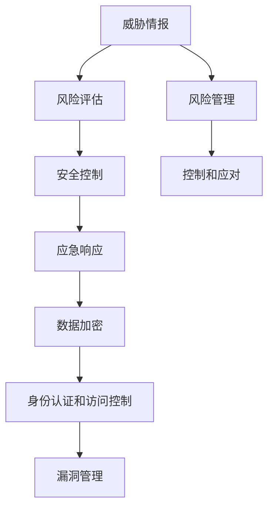

                 

# 风险管理：识别和应对潜在威胁

> 关键词：风险管理, 识别威胁, 风险评估, 安全控制, 威胁情报, 应急响应

## 1. 背景介绍

### 1.1 问题由来
在数字化时代，随着信息技术的深度应用，数据安全、系统安全、网络安全等风险问题日益凸显，已经成为制约信息化发展的关键因素之一。安全风险不仅来自黑客攻击、病毒入侵等传统威胁，还涵盖了数据泄露、隐私侵犯、系统故障等非传统威胁。如何有效识别和应对潜在威胁，构建安全可靠的信息化环境，成为摆在企业面前的重要课题。

### 1.2 问题核心关键点
风险管理作为信息技术安全保障的重要手段，旨在通过识别、评估、控制和应对信息系统的潜在威胁，确保信息系统在面临各种风险时能够持续稳定运行。风险管理贯穿于系统规划、设计、开发、运行和维护的全生命周期，是保障信息安全的基本框架和方法论。

### 1.3 问题研究意义
进行风险管理的研究和实践，有助于企业建立科学的信息安全管理体系，提升应对安全威胁的能力，减少因安全事件带来的损失，保障业务连续性和数据隐私。通过系统的风险管理，可以构建可信、透明、可靠的信息化环境，为社会治理、企业运营和民众生活提供坚实的安全保障。

## 2. 核心概念与联系

### 2.1 核心概念概述

为更好地理解风险管理的流程和方法，本节将介绍几个密切相关的核心概念：

- **风险管理(Risk Management)**：识别、评估、控制和应对信息系统的潜在威胁，以保障信息系统的安全性和业务连续性。
- **威胁情报(Threat Intelligence)**：通过收集、分析和共享威胁信息，帮助组织识别和应对潜在的安全威胁。
- **风险评估(Risk Assessment)**：对信息系统面临的各种风险进行识别、分析、评估，确定风险的重要性和影响程度。
- **安全控制(Security Control)**：在风险评估的基础上，制定并实施相应的安全措施，减少风险发生的可能性。
- **应急响应(Incident Response)**：在安全事件发生时，快速识别、定位、处理和恢复，最大限度地减少损失和影响。
- **数据加密(Data Encryption)**：对敏感数据进行加密处理，防止未授权访问和数据泄露。
- **身份认证和访问控制(Identity Authentication and Access Control)**：通过认证机制和权限控制，确保只有授权用户才能访问系统资源。
- **漏洞管理(Vulnerability Management)**：定期扫描和修复系统漏洞，增强系统的安全性。

这些核心概念之间的逻辑关系可以通过以下Mermaid流程图来展示：



这个流程图展示了一些关键风险管理概念及其之间的关系：

1. 威胁情报为风险评估提供数据支撑。
2. 风险评估结果指导安全控制策略。
3. 安全控制措施通过应急响应减少风险影响。
4. 数据加密、身份认证、访问控制等技术手段保障系统安全。
5. 漏洞管理不断提升系统的安全性。
6. 风险管理贯穿始终，涵盖控制和应对环节。

## 3. 核心算法原理 & 具体操作步骤

### 3.1 算法原理概述

风险管理的核心思想是通过一系列科学方法和技术手段，识别、评估和控制信息系统的潜在威胁。其基本流程包括：

1. **威胁情报收集**：通过各种渠道收集与信息系统相关的威胁信息。
2. **风险评估**：对收集到的威胁信息进行定量和定性分析，评估威胁的可能性和影响程度。
3. **安全控制**：根据风险评估结果，制定和实施相应的安全措施。
4. **应急响应**：在安全事件发生时，快速识别、定位、处理和恢复。
5. **持续监控**：定期进行安全评估和漏洞扫描，确保系统安全性。

这些步骤可以通过算法模型进行优化，提高风险管理的效率和精度。

### 3.2 算法步骤详解

风险管理的具体步骤可以通过算法模型进行精确描述。以典型的风险管理流程为例，下面将详细讲解每一步骤的算法实现。

**Step 1: 威胁情报收集**
- 使用网络爬虫、公开数据库、社交媒体等渠道收集威胁情报。
- 利用文本挖掘、自然语言处理等技术，对收集到的信息进行结构化处理。
- 分析情报来源的可靠性和时效性，筛选出高质量的情报数据。

**Step 2: 风险评估**
- 定义风险矩阵，将威胁的可能性和影响程度进行量化。
- 使用统计分析、机器学习等算法，对威胁情报进行分类和聚类。
- 计算风险值，确定高、中、低风险等级。

**Step 3: 安全控制**
- 根据风险评估结果，制定安全控制策略。
- 选择和实施安全控制措施，如访问控制、加密技术、防火墙等。
- 定期评估安全控制措施的有效性，并进行调整优化。

**Step 4: 应急响应**
- 定义应急响应流程和预案，明确各部门的职责和任务。
- 使用自动化工具进行安全事件监测和告警。
- 在安全事件发生时，快速响应和处理，采取隔离、恢复等措施。

**Step 5: 持续监控**
- 使用自动化工具进行系统漏洞扫描和风险评估。
- 定期进行安全审计和渗透测试，发现和修复潜在漏洞。
- 跟踪新的威胁情报，更新安全控制策略和应急预案。

### 3.3 算法优缺点

风险管理算法具有以下优点：
1. 系统化管理：通过科学方法和技术手段，全面识别和评估安全威胁。
2. 定量分析：利用统计和机器学习算法，进行精确的风险评估和控制。
3. 自动化监控：使用自动化工具进行持续监控和漏洞扫描，提高效率。
4. 应急响应：通过预案和流程，快速应对安全事件，减少损失。
5. 数据驱动：结合威胁情报，实时调整安全控制策略，提升安全性。

同时，该算法也存在一些局限性：
1. 成本较高：风险管理需要投入大量人力、物力和财力，维护成本较高。
2. 技术复杂：涉及多个领域的知识和技术，实施难度较大。
3. 依赖数据：风险管理的效果依赖于威胁情报的准确性和全面性。
4. 动态性不足：难以适应快速变化的网络威胁环境。
5. 误报率高：自动化监控工具可能产生误报，增加运营成本。

尽管存在这些局限性，但风险管理算法仍然是当前信息安全保障的重要手段。未来研究需要进一步降低成本、简化流程，提高算法的动态性和准确性，才能更好地适应网络环境的复杂变化。

### 3.4 算法应用领域

风险管理算法在多个领域得到了广泛应用，例如：

- 金融领域：保护客户数据、防范金融欺诈、保障交易安全。
- 医疗行业：保障患者隐私、防止医疗数据泄露、确保医疗系统安全。
- 政府部门：保护国家机密、防范网络攻击、保障关键基础设施安全。
- 企业运营：保护企业资产、防范内部威胁、确保业务连续性。
- 教育机构：保护学生隐私、防范网络威胁、保障教育系统安全。

这些应用领域表明，风险管理算法具有广泛的市场需求，为各行各业的信息安全保障提供了重要技术支撑。

## 4. 数学模型和公式 & 详细讲解 & 举例说明

### 4.1 数学模型构建

风险管理算法的数学模型主要包括以下几个关键部分：

- **威胁情报收集模型**：基于爬虫、数据挖掘等技术，收集和处理威胁情报数据。
- **风险评估模型**：利用统计分析和机器学习算法，评估威胁的可能性（Probability）和影响程度（Impact）。
- **安全控制模型**：根据风险评估结果，制定和优化安全控制策略，如访问控制、加密技术等。
- **应急响应模型**：通过事件监测和告警机制，快速识别和处理安全事件。
- **持续监控模型**：利用自动化工具进行漏洞扫描和风险评估，确保系统安全性。

### 4.2 公式推导过程

以风险评估模型为例，我们详细推导一下其核心公式：

假设威胁的可能性为 $P$，影响程度为 $I$，则风险值 $R$ 可以表示为：

$$
R = P \times I
$$

其中 $P$ 和 $I$ 分别可以通过以下公式计算：

$$
P = \frac{N}{N_{total}}
$$

$$
I = \frac{D}{D_{total}}
$$

其中 $N$ 表示检测到的威胁数量，$N_{total}$ 表示总的威胁数量；$D$ 表示由于威胁造成的损失，$D_{total}$ 表示总的损失值。

将 $P$ 和 $I$ 代入 $R$ 的公式，得：

$$
R = \frac{N}{N_{total}} \times \frac{D}{D_{total}}
$$

在实际应用中，还可以进一步引入时间因素和风险等级，细化风险评估结果。

### 4.3 案例分析与讲解

以一个具体的风险评估案例为例，展示如何利用上述数学模型进行风险评估和控制。

假设某公司的网络系统面临多种威胁，如SQL注入、XSS攻击等。通过威胁情报收集模型，收集到以下数据：

| 威胁类型 | 检测到的威胁数量 | 威胁总数 |
|-----------|------------------|----------|
| SQL注入   | 10               | 100      |
| XSS攻击   | 5                | 150      |

根据数据，计算出威胁的可能性：

$$
P_{SQL注入} = \frac{10}{100} = 0.1
$$

$$
P_{XSS攻击} = \frac{5}{150} \approx 0.033
$$

威胁的影响程度也可以通过类似的计算得到。假设由于SQL注入造成的损失为 $D_{SQL注入} = 10,000$，XSS攻击造成的损失为 $D_{XSS攻击} = 5,000$。

根据影响程度，计算出威胁的影响程度：

$$
I_{SQL注入} = \frac{10,000}{10,000} = 1.0
$$

$$
I_{XSS攻击} = \frac{5,000}{10,000} = 0.5
$$

将威胁的可能性、影响程度代入风险值公式，得到以下结果：

$$
R_{SQL注入} = 0.1 \times 1.0 = 0.1
$$

$$
R_{XSS攻击} = 0.033 \times 0.5 = 0.01675
$$

根据风险值，制定相应的安全控制措施。例如，对于SQL注入，可以采取防火墙、入侵检测系统等措施；对于XSS攻击，可以加强代码审计、输入验证等。

## 5. 项目实践：代码实例和详细解释说明

### 5.1 开发环境搭建

在进行风险管理项目实践前，我们需要准备好开发环境。以下是使用Python进行项目开发的常见环境配置流程：

1. 安装Python：从官网下载并安装Python，推荐使用3.x版本。
2. 安装相关库：使用pip安装必要的Python库，如pandas、numpy、requests、beautifulsoup等。
3. 配置环境：使用conda或virtualenv创建虚拟环境，避免不同项目之间的依赖冲突。
4. 版本控制：使用git进行代码版本控制，记录项目的开发进展和变更历史。

完成上述步骤后，即可在开发环境中进行风险管理项目的开发。

### 5.2 源代码详细实现

下面以一个简单的威胁情报收集和风险评估为例，展示风险管理项目的代码实现。

```python
import pandas as pd
import numpy as np
from sklearn.model_selection import train_test_split

# 威胁情报数据
threat_data = pd.read_csv('threat_data.csv')

# 特征工程
# 计算威胁的可能性（P）
threat_count = threat_data['count'].sum()
threat_total = threat_data['total'].sum()
threat_p = threat_data['count'] / threat_total

# 计算威胁的影响程度（I）
threat_impact = threat_data['impact'].sum()
threat_impact_total = threat_data['total'].sum()
threat_i = threat_data['impact'] / threat_impact_total

# 计算风险值（R）
threat_r = threat_p * threat_i

# 风险等级分类
risk_levels = [0, 0.2, 0.4, 0.6, 1]
threat_r_levels = pd.cut(threat_r, bins=risk_levels, labels=risk_levels)

# 输出结果
print(threat_p.mean())
print(threat_i.mean())
print(threat_r.mean())
print(threat_r_levels.value_counts())
```

上述代码实现了威胁情报数据的读取、威胁可能性、威胁影响程度和风险值的计算，以及风险等级的分类和输出。

### 5.3 代码解读与分析

**威胁情报数据**：
- `threat_data`：威胁情报的CSV文件，包含威胁类型、检测到的威胁数量、威胁总数、威胁的影响程度等字段。

**特征工程**：
- `threat_count`：检测到的威胁数量之和。
- `threat_total`：总的威胁数量之和。
- `threat_p`：威胁的可能性（P），通过检测到的威胁数量除以总的威胁数量计算得到。
- `threat_impact`：由于威胁造成的损失之和。
- `threat_impact_total`：总的损失值之和。
- `threat_i`：威胁的影响程度（I），通过威胁造成的损失除以总的损失值计算得到。
- `threat_r`：威胁的风险值（R），通过威胁的可能性和影响程度计算得到。
- `threat_r_levels`：风险等级分类，将风险值根据预定义的等级进行划分。

**风险等级分类**：
- `risk_levels`：风险等级的阈值，通过预定义的等级阈值进行风险分类。
- `threat_r_levels`：风险等级分类结果，通过`pd.cut`函数将风险值划分为不同的等级。

**输出结果**：
- `print`语句输出威胁可能性、威胁影响程度和风险值的平均值。
- `print`语句输出不同风险等级的分类结果。

## 6. 实际应用场景

### 6.1 金融领域

在金融领域，风险管理的重要性不言而喻。金融机构需要保护客户数据、防范金融欺诈、保障交易安全。风险管理技术可以通过以下几个方面进行应用：

1. **数据保护**：利用加密技术、访问控制等手段，保护客户数据不被未授权访问和泄露。
2. **欺诈检测**：通过威胁情报收集和风险评估，识别和防范欺诈行为，保障交易安全。
3. **系统监控**：利用自动化工具进行持续监控和漏洞扫描，及时发现和修复潜在威胁。

### 6.2 医疗行业

在医疗行业，风险管理同样重要。医院需要保护患者隐私、防止医疗数据泄露、确保医疗系统安全。风险管理技术可以通过以下几个方面进行应用：

1. **数据加密**：利用加密技术保护患者隐私数据，防止未授权访问和泄露。
2. **访问控制**：通过身份认证和权限控制，确保只有授权人员才能访问医疗系统。
3. **威胁情报**：通过收集和分析威胁情报，识别和防范潜在的安全威胁。
4. **应急响应**：在安全事件发生时，快速响应和处理，确保医疗系统的正常运行。

### 6.3 政府部门

在政府部门，风险管理也是保障信息安全的重要手段。政府机构需要保护国家机密、防范网络攻击、保障关键基础设施安全。风险管理技术可以通过以下几个方面进行应用：

1. **访问控制**：通过身份认证和权限控制，确保只有授权人员才能访问政府信息系统。
2. **威胁情报**：通过收集和分析威胁情报，识别和防范潜在的安全威胁。
3. **应急响应**：在安全事件发生时，快速响应和处理，确保政府信息系统的正常运行。
4. **持续监控**：利用自动化工具进行持续监控和漏洞扫描，及时发现和修复潜在威胁。

## 7. 工具和资源推荐

### 7.1 学习资源推荐

为了帮助开发者系统掌握风险管理的理论基础和实践技巧，这里推荐一些优质的学习资源：

1. **《网络安全》教材**：国内知名高校或安全公司编写的网络安全教材，涵盖网络安全基础、威胁情报、风险管理、应急响应等主题。
2. **《网络安全工程师认证培训》**：知名网络安全认证机构的培训课程，包括风险管理、应急响应、威胁情报等模块。
3. **《网络安全实战》系列书籍**：涵盖网络安全基础、攻防实战、风险管理、应急响应等领域的实战经验分享。
4. **《信息安全风险评估与管理》课程**：知名在线教育平台的网络安全课程，通过视频讲解和实践案例，帮助理解风险管理的全流程。

通过对这些资源的学习实践，相信你一定能够快速掌握风险管理的精髓，并用于解决实际的信息安全问题。

### 7.2 开发工具推荐

高效的开发离不开优秀的工具支持。以下是几款用于风险管理开发的常用工具：

1. **Jupyter Notebook**：免费、开源的交互式编程环境，支持多种编程语言，便于进行数据处理和模型实验。
2. **RapidMiner**：商业化数据分析和机器学习平台，提供丰富的可视化功能和算法库，支持风险管理全流程。
3. **OWASP ZAP**：开源的安全测试工具，支持爬虫、扫描、渗透测试等环节，帮助发现和修复安全漏洞。
4. **Elastic Stack**：商业化的数据管理和分析平台，支持日志分析、安全告警、应急响应等功能。
5. **GitHub**：代码托管和版本控制平台，便于团队协作和代码共享，支持风险管理项目的持续迭代。

合理利用这些工具，可以显著提升风险管理的开发效率，加快创新迭代的步伐。

### 7.3 相关论文推荐

风险管理作为信息安全领域的重要研究方向，已经积累了大量高质量的研究论文。以下是几篇奠基性的相关论文，推荐阅读：

1. **《网络安全风险管理》**：介绍网络安全风险管理的理论框架和实际应用，探讨风险评估、控制和响应等环节。
2. **《基于机器学习的网络安全威胁检测》**：通过机器学习算法，进行威胁情报收集和风险评估，提升威胁检测的准确性和效率。
3. **《应急响应流程和预案设计》**：研究应急响应的流程和预案设计，提出一套标准化的应急响应框架。
4. **《网络安全威胁情报共享平台设计》**：介绍威胁情报的收集、分析和共享机制，提升威胁情报的价值和应用效果。
5. **《基于云平台的网络安全监控和预警》**：研究利用云平台进行持续监控和预警机制的设计，实现自动化和智能化风险管理。

这些论文代表了大语言模型微调技术的发展脉络。通过学习这些前沿成果，可以帮助研究者把握学科前进方向，激发更多的创新灵感。

## 8. 总结：未来发展趋势与挑战

### 8.1 总结

本文对风险管理的基本原理和操作步骤进行了全面系统的介绍。首先阐述了风险管理在信息系统安全保障中的重要地位，明确了风险评估、安全控制、应急响应等核心环节的作用。其次，从原理到实践，详细讲解了风险管理的算法实现和关键步骤，给出了项目开发的完整代码实例。同时，本文还广泛探讨了风险管理在金融、医疗、政府等多个领域的应用前景，展示了风险管理技术的广泛应用价值。

通过本文的系统梳理，可以看到，风险管理算法正在成为信息安全保障的重要手段，极大地提升了组织应对安全威胁的能力。未来，伴随安全威胁环境的变化和技术的进步，风险管理技术也需要不断优化和创新，才能更好地应对新的挑战。

### 8.2 未来发展趋势

展望未来，风险管理技术将呈现以下几个发展趋势：

1. **人工智能的引入**：利用机器学习、深度学习等人工智能技术，提升威胁情报的收集和分析效率，提高风险评估的准确性。
2. **自动化和智能化**：引入自动化工具和智能化算法，实现威胁情报的实时监测和风险评估的动态化调整。
3. **跨领域融合**：与其他信息技术融合，如区块链、物联网等，构建更全面、可靠的安全保障体系。
4. **持续性监测**：引入持续监控机制，实现对网络威胁的实时检测和响应。
5. **国际合作**：加强国际合作，共享威胁情报和最佳实践，提升全球信息安全水平。

以上趋势凸显了风险管理技术的广阔前景。这些方向的探索发展，必将进一步提升信息系统的安全性，为社会治理、企业运营和民众生活提供更坚实的安全保障。

### 8.3 面临的挑战

尽管风险管理技术已经取得了一定的成果，但在迈向更加智能化、普适化应用的过程中，它仍面临着诸多挑战：

1. **成本问题**：风险管理需要投入大量的人力、物力和财力，维护成本较高。如何降低成本，提高效率，是一大挑战。
2. **技术复杂**：涉及多个领域的知识和技术，实施难度较大。如何简化流程，降低门槛，是另一大挑战。
3. **动态性不足**：难以适应快速变化的网络威胁环境。如何提高算法的动态性和响应速度，是重要的研究方向。
4. **误报率高**：自动化监控工具可能产生误报，增加运营成本。如何降低误报率，提高监控的准确性，是另一大挑战。
5. **数据依赖**：风险管理的效果依赖于威胁情报的准确性和全面性。如何获取高质量的威胁情报，是又一重要问题。

尽管存在这些挑战，但风险管理技术仍然是当前信息安全保障的重要手段。未来研究需要进一步降低成本、简化流程，提高算法的动态性和准确性，才能更好地适应网络环境的复杂变化。

### 8.4 研究展望

面对风险管理面临的种种挑战，未来的研究需要在以下几个方面寻求新的突破：

1. **引入人工智能**：利用机器学习、深度学习等技术，提升威胁情报的收集和分析效率，提高风险评估的准确性。
2. **降低成本**：通过引入自动化工具和智能化算法，减少人力和财力的投入，提高风险管理的效率。
3. **提高动态性**：通过引入持续监控机制，实现对网络威胁的实时检测和响应。
4. **降低误报率**：通过优化算法和模型，降低误报率，提高监控的准确性。
5. **获取高质量情报**：通过多渠道、多角度的数据收集和分析，获取高质量的威胁情报。

这些研究方向的探索，必将引领风险管理技术迈向更高的台阶，为构建安全可靠的信息化环境提供更坚实的技术支撑。面向未来，风险管理技术还需要与其他信息技术进行更深入的融合，共同推动信息安全的进步。

## 9. 附录：常见问题与解答

**Q1：风险管理算法的核心是什么？**

A: 风险管理算法的核心在于通过威胁情报收集、风险评估、安全控制和应急响应等环节，系统化地识别、评估和控制信息系统的潜在威胁。

**Q2：如何降低风险管理的成本？**

A: 可以通过引入自动化工具和智能化算法，减少人力和财力的投入，提高风险管理的效率。同时，可以通过多渠道、多角度的数据收集和分析，获取高质量的威胁情报，降低误报率，提升监控的准确性。

**Q3：风险管理算法的应用场景有哪些？**

A: 风险管理算法在金融、医疗、政府、企业等多个领域都有广泛的应用，例如数据保护、欺诈检测、系统监控、应急响应等。

**Q4：如何应对网络威胁的快速变化？**

A: 可以通过引入持续监控机制，实现对网络威胁的实时检测和响应。同时，可以通过引入机器学习、深度学习等技术，提升威胁情报的收集和分析效率，提高风险评估的准确性。

**Q5：如何提高风险管理的动态性？**

A: 可以通过引入持续监控机制，实现对网络威胁的实时检测和响应。同时，可以通过引入自动化工具和智能化算法，提高风险管理的动态性和响应速度。

这些问题的解答，可以帮助你更好地理解风险管理算法的核心、应用场景和优化方向。

