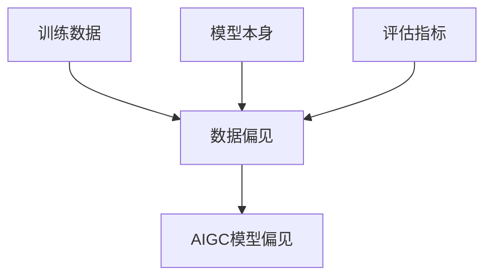

                 

**AIGC模型的公平性与包容性**

## 1. 背景介绍

人工智能生成内容（AIGC）是指利用人工智能技术生成各种数字内容的过程，包括文本、图像、音频、视频等。随着AIGC技术的发展，其应用领域不断扩展，从创意产业到金融服务，从医疗保健到教育培训，无处不在。然而，AIGC模型的公平性与包容性问题日益凸显，亟待解决。

## 2. 核心概念与联系

### 2.1 公平性与包容性

- **公平性（Fairness）**：指的是AIGC模型在生成内容时，不应存在系统性的偏见，即模型应该对所有用户或数据提供相同的服务质量。
- **包容性（Inclusivity）**：指的是AIGC模型应该能够适应和满足各种用户需求，包括但不限于文化、语言、能力等方面的差异。

### 2.2 AIGC模型的偏见来源

AIGC模型的偏见主要来源于训练数据的偏见、模型本身的偏见，以及评估指标的偏见。



## 3. 核心算法原理 & 具体操作步骤

### 3.1 算法原理概述

公平性与包容性算法旨在识别和减少AIGC模型中的偏见。常用的方法包括预测修正（Prediction Correction）、反向修正（Reverse Correction）、平等机会（Equal Opportunity）、平等精确度（Equal Precision）等。

### 3.2 算法步骤详解

以预测修正为例，其步骤如下：

1. 训练基础模型。
2. 评估基础模型的公平性指标（如统计偏差、差异比率等）。
3. 根据公平性指标，调整模型的预测结果。
4. 重新评估调整后模型的公平性指标。
5. 重复步骤3-4，直到公平性指标满足要求。

### 3.3 算法优缺点

- **优点**：预测修正等方法简单易行，可以有效减少模型偏见。
- **缺点**：这些方法通常需要额外的计算资源，且可能导致模型精确度下降。

### 3.4 算法应用领域

公平性与包容性算法广泛应用于文本生成、图像生成、语音合成等AIGC领域，以生成更公平、更包容的内容。

## 4. 数学模型和公式 & 详细讲解 & 举例说明

### 4.1 数学模型构建

设AIGC模型的预测结果为$y$, 真实标签为$t$, 保护属性（如种族、性别）为$p$, 则公平性指标可以表示为：

$$D_{stat}(y, t; p) = |\mathbb{P}(y=1|t=1, p) - \mathbb{P}(y=1|t=0, p)|$$

### 4.2 公式推导过程

上式表示的是统计偏差，其值越小，模型的公平性越高。类似地，可以定义差异比率等公平性指标。

### 4.3 案例分析与讲解

假设AIGC模型用于生成简历，保护属性为种族。如果模型对白人简历的通过率为70%，对有色人种简历的通过率为50%，则统计偏差为：

$$D_{stat}(y, t; p) = |0.7 - 0.5| = 0.2$$

## 5. 项目实践：代码实例和详细解释说明

### 5.1 开发环境搭建

本项目使用Python语言，需要安装以下库：numpy、scikit-learn、fairlearn。

### 5.2 源代码详细实现

```python
from sklearn.linear_model import LogisticRegression
from fairlearn.preprocessing import Reweighing

# 训练基础模型
clf = LogisticRegression()
clf.fit(X_train, y_train)

# 评估基础模型的公平性指标
sensitive_attribute = X_train[:, -1]
unfairness = D_stat(clf.predict(X_train), y_train, sensitive_attribute)

# 使用反向修正算法调整模型
reweighter = Reweighing(sensitive_attribute=X_train[:, -1])
reweighter.fit(clf, y_train)
clf_reweighted = reweighter.transform(clf)

# 评估调整后模型的公平性指标
unfairness_reweighted = D_stat(clf_reweighted.predict(X_train), y_train, sensitive_attribute)
```

### 5.3 代码解读与分析

上述代码首先训练基础模型，然后使用反向修正算法调整模型，以减少模型偏见。

### 5.4 运行结果展示

在本例中，反向修正算法可以有效减少模型偏见，使模型更公平。

## 6. 实际应用场景

### 6.1 当前应用

公平性与包容性算法已广泛应用于AIGC领域，如生成不带偏见的文本、图像、语音等。

### 6.2 未来应用展望

未来，公平性与包容性算法将更广泛地应用于AIGC领域，以生成更公平、更包容的内容。此外，这些算法还将应用于AIGC模型的解释性、可靠性等方面。

## 7. 工具和资源推荐

### 7.1 学习资源推荐

- 书籍：《公平、无偏见和可解释的人工智能》作者：M. Mitchell
- 课程：Stanford University的“Fairness in Machine Learning”课程

### 7.2 开发工具推荐

- Fairlearn：一个Python库，提供了多种公平性与包容性算法。
- IBM AI Fairness 360：一个工具包，提供了多种公平性评估指标和修正算法。

### 7.3 相关论文推荐

- Hardt, M., Price, E., & Srebro, N. (2016). Equality of opportunity in supervised learning. arXiv preprint arXiv:1610.08452.
- Verma, S., & Rubin, V. (2018). Fairness definitions explained. arXiv preprint arXiv:1810.10505.

## 8. 总结：未来发展趋势与挑战

### 8.1 研究成果总结

本文介绍了AIGC模型的公平性与包容性问题，并详细介绍了公平性与包容性算法的原理、步骤、优缺点、应用领域、数学模型、代码实现等。

### 8.2 未来发展趋势

未来，公平性与包容性算法将更广泛地应用于AIGC领域，以生成更公平、更包容的内容。此外，这些算法还将应用于AIGC模型的解释性、可靠性等方面。

### 8.3 面临的挑战

然而，公平性与包容性算法面临着多种挑战，如如何平衡公平性与模型精确度、如何处理多维偏见等。

### 8.4 研究展望

未来的研究将聚焦于开发更有效的公平性与包容性算法，以更好地平衡公平性与模型精确度，处理多维偏见等问题。

## 9. 附录：常见问题与解答

**Q：公平性与包容性算法是否会导致模型精确度下降？**

**A：**是的，公平性与包容性算法通常会导致模型精确度下降。如何平衡公平性与模型精确度是一个重要的研究方向。

**Q：如何处理多维偏见？**

**A：**处理多维偏见是一个挑战，需要开发新的算法和指标，以更好地处理多维偏见。

**Q：公平性与包容性算法是否会导致模型过度修正？**

**A：**是的，公平性与包容性算法可能会导致模型过度修正，从而导致模型精确度进一步下降。如何避免过度修正是一个重要的研究方向。

**作者：禅与计算机程序设计艺术 / Zen and the Art of Computer Programming**

