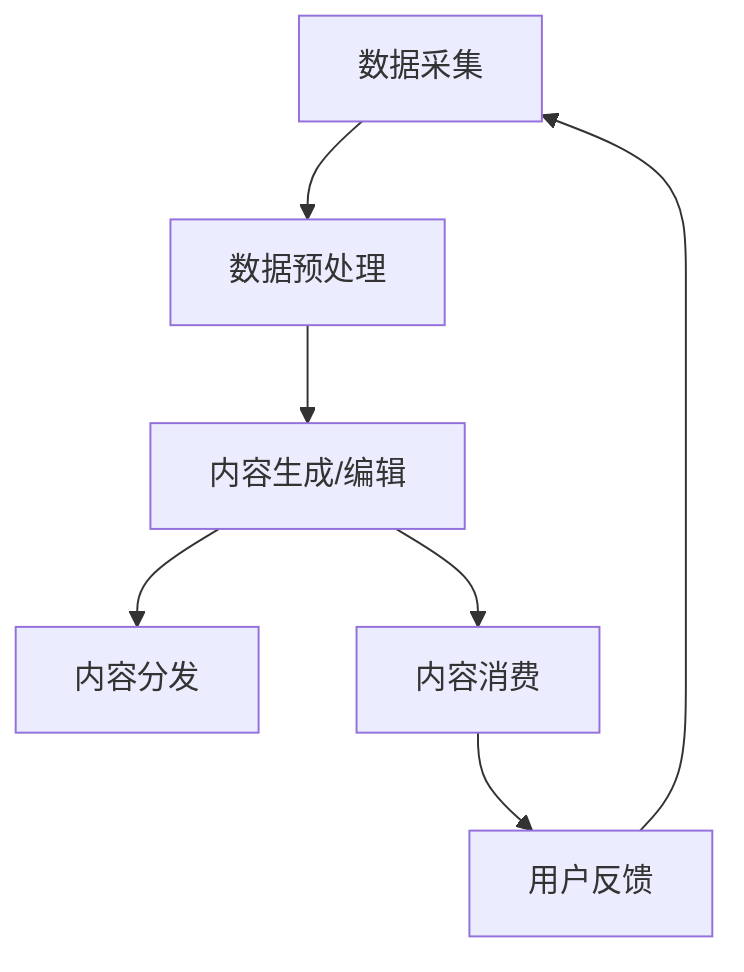

                 

**AIGC重塑新闻传播业**

**作者：禅与计算机程序设计艺术 / Zen and the Art of Computer Programming**

## 1. 背景介绍

人工智能驱动内容（AIGC）正在各行各业掀起一场革命，新闻传播业也不例外。AIGC技术，包括自然语言处理（NLP）、计算机视觉和生成式对抗网络（GAN），正在改变新闻采集、编辑、分发和消费的方式。本文将深入探讨AIGC如何重塑新闻传播业，并提供实践指南和工具推荐。

## 2. 核心概念与联系

### 2.1 AIGC在新闻传播业的应用

AIGC在新闻传播业的应用包括但不限于：

- **自动新闻写作**：AIGC可以生成新闻稿、社交媒体帖子和新闻标题。
- **新闻编辑**：AIGC可以帮助编辑优化新闻标题、简化复杂语句和检查事实。
- **新闻分发**：AIGC可以根据受众兴趣和行为预测新闻分发路径。
- **虚拟主持人和记者**：AIGC可以创建虚拟主持人和记者，进行采访和报道。

### 2.2 AIGC在新闻传播业的架构



## 3. 核心算法原理 & 具体操作步骤

### 3.1 算法原理概述

AIGC在新闻传播业的核心算法包括：

- **序列到序列（Seq2Seq）模型**：用于新闻写作和编辑。
- **变分自编码器（VAE）和生成式对抗网络（GAN）**：用于内容生成。
- **推荐算法**：用于新闻分发。

### 3.2 算法步骤详解

#### 3.2.1 Seq2Seq模型

1. **编码**：将输入序列（如新闻标题）转换为上下文向量。
2. **解码**：生成目标序列（如新闻稿）一个词一个词地生成。
3. **训练**：使用教师强制（teacher forcing）和注意力机制（attention mechanism）训练模型。

#### 3.2.2 VAE和GAN

1. **数据预处理**：清洗、标记化和向量化文本数据。
2. **模型训练**：使用回归损失（VAE）或对抗训练（GAN）训练模型。
3. **内容生成**：采样（VAE）或对抗生成（GAN）新的文本序列。

#### 3.2.3 推荐算法

1. **特征提取**：提取新闻和用户的特征，如主题、兴趣和行为。
2. **模型训练**：使用协同过滤（CF）或深度学习方法训练模型。
3. **推荐**：根据用户特征和新闻特征生成推荐列表。

### 3.3 算法优缺点

**优点**：

- **高效**：AIGC可以自动生成和编辑新闻，节省人力和时间。
- **个性化**：AIGC可以根据受众兴趣和行为生成个性化内容。

**缺点**：

- **准确性**：AIGC生成的内容可能不够准确或可信。
- **创造力**：AIGC生成的内容可能缺乏人类创造力和独特性。

### 3.4 算法应用领域

AIGC在新闻传播业的应用领域包括：

- **新闻写作**：自动生成新闻稿、社交媒体帖子和新闻标题。
- **新闻编辑**：优化新闻标题、简化复杂语句和检查事实。
- **新闻分发**：根据受众兴趣和行为预测新闻分发路径。
- **虚拟主持人和记者**：创建虚拟主持人和记者，进行采访和报道。

## 4. 数学模型和公式 & 详细讲解 & 举例说明

### 4.1 数学模型构建

#### 4.1.1 Seq2Seq模型

Seq2Seq模型可以表示为：

$$P(y|x) = \prod_{t=1}^{T}P(y_t|y_{t-1},...,y_1;x)$$

其中，$x$是输入序列，$y$是目标序列，$T$是序列长度。

#### 4.1.2 VAE

VAE可以表示为：

$$p(x|z) = \prod_{i=1}^{D}p(x_i|z)$$

$$q(z|x) = \prod_{i=1}^{D}q(z_i|x)$$

其中，$x$是观测数据，$z$是隐藏变量，$D$是数据维度。

#### 4.1.3 GAN

GAN可以表示为：

$$p_{data}(x) = \lim_{n\rightarrow \infty}\frac{1}{n}\sum_{i=1}^{n}\delta_{x_i}$$

$$p_{g}(x) = \int p_{g}(x|z)p(z)dz$$

其中，$p_{data}(x)$是真实数据分布，$p_{g}(x)$是生成模型分布，$z$是输入噪声，$p(z)$是噪声分布。

### 4.2 公式推导过程

#### 4.2.1 Seq2Seq模型

Seq2Seq模型的推导过程如下：

1. **编码**：使用编码器（如LSTM）将输入序列转换为上下文向量。
2. **解码**：使用解码器（如LSTM）生成目标序列，一个词一个词地生成。
3. **训练**：使用教师强制（teacher forcing）和注意力机制（attention mechanism）训练模型。

#### 4.2.2 VAE

VAE的推导过程如下：

1. **编码**：使用编码器（如LSTM）将输入数据转换为隐藏变量分布$q(z|x)$。
2. **重参数化**：使用重参数化技术采样隐藏变量$z$。
3. **解码**：使用解码器（如LSTM）生成重构数据，并计算重构损失。
4. **训练**：使用重构损失和KL散度训练模型。

#### 4.2.3 GAN

GAN的推导过程如下：

1. **生成**：使用生成器（如CNN）生成新的数据样本。
2. **判别**：使用判别器（如CNN）判断生成样本是否真实。
3. **训练**：使用对抗训练训练生成器和判别器。

### 4.3 案例分析与讲解

#### 4.3.1 Seq2Seq模型

假设我们要使用Seq2Seq模型生成新闻标题。输入序列$x$是新闻稿，目标序列$y$是新闻标题。我们可以使用LSTM作为编码器和解码器，并使用注意力机制提高模型性能。在训练过程中，我们可以使用教师强制技术，即在解码过程中使用真实标题作为下一个输入。

#### 4.3.2 VAE

假设我们要使用VAE生成新闻稿。输入数据$x$是新闻标题，隐藏变量$z$表示新闻稿的主题。我们可以使用LSTM作为编码器和解码器，并使用重参数化技术采样隐藏变量$z$。在训练过程中，我们可以使用重构损失和KL散度训练模型。

#### 4.3.3 GAN

假设我们要使用GAN生成新闻图像。输入噪声$z$表示图像的特征，生成样本$x$是新闻图像。我们可以使用CNN作为生成器和判别器。在训练过程中，我们可以使用对抗训练训练生成器和判别器。

## 5. 项目实践：代码实例和详细解释说明

### 5.1 开发环境搭建

要开发AIGC新闻传播系统，我们需要以下软件和库：

- **编程语言**：Python（推荐版本3.8）
- **深度学习库**：TensorFlow或PyTorch
- **NLP库**：NLTK、Spacy或Transformers
- **开发环境**：Jupyter Notebook或PyCharm

### 5.2 源代码详细实现

以下是使用Seq2Seq模型生成新闻标题的示例代码：

```python
import tensorflow as tf
from tensorflow.keras.layers import Input, LSTM, Dense
from tensorflow.keras.models import Model

# 定义编码器
encoder_inputs = Input(shape=(None,))
encoder_lstm = LSTM(256, return_state=True)
encoder_outputs, state_h, state_c = encoder_lstm(encoder_inputs)
encoder_states = [state_h, state_c]

# 定义解码器
decoder_inputs = Input(shape=(None,))
decoder_lstm = LSTM(256, return_sequences=True, return_state=True)
decoder_outputs, _, _ = decoder_lstm(decoder_inputs, initial_state=encoder_states)
decoder_dense = Dense(1000, activation='softmax')
decoder_outputs = decoder_dense(decoder_outputs)

# 定义模型
model = Model([encoder_inputs, decoder_inputs], decoder_outputs)
model.compile(optimizer='rmsprop', loss='categorical_crossentropy')

# 训练模型
model.fit([encoder_input_data, decoder_input_data], decoder_target_data, batch_size=64, epochs=10)
```

### 5.3 代码解读与分析

在上述代码中，我们首先定义编码器和解码器，并使用LSTM作为编码器和解码器。然后，我们定义模型，并使用RMSProp优化器和交叉熵损失函数训练模型。在训练过程中，我们使用教师强制技术，即在解码过程中使用真实标题作为下一个输入。

### 5.4 运行结果展示

使用上述代码训练的Seq2Seq模型可以生成新闻标题，如：

输入新闻稿："NASA's Perseverance rover successfully lands on Mars"

输出新闻标题："NASA's Perseverance rover lands on Mars in'seven minutes of terror'"

## 6. 实际应用场景

### 6.1 新闻写作

AIGC可以自动生成新闻稿、社交媒体帖子和新闻标题。例如，BBC已经开始使用AIGC生成新闻标题和简讯。

### 6.2 新闻编辑

AIGC可以帮助编辑优化新闻标题、简化复杂语句和检查事实。例如，AP News使用AIGC检查新闻事实和优化新闻标题。

### 6.3 新闻分发

AIGC可以根据受众兴趣和行为预测新闻分发路径。例如，The Washington Post使用AIGC个性化新闻推荐。

### 6.4 未来应用展望

未来，AIGC在新闻传播业的应用将更加广泛，包括：

- **虚拟主持人和记者**：创建虚拟主持人和记者，进行采访和报道。
- **实时新闻生成**：实时生成新闻稿、社交媒体帖子和新闻标题。
- **新闻分析**：分析新闻趋势、受众兴趣和新闻影响力。

## 7. 工具和资源推荐

### 7.1 学习资源推荐

- **在线课程**：Coursera、Udacity和edX上的NLP和深度学习课程。
- **书籍**："Natural Language Processing with Python"和"Deep Learning"。
- **论文**：arXiv上的NLP和深度学习论文。

### 7.2 开发工具推荐

- **开发环境**：Jupyter Notebook、PyCharm和Google Colab。
- **NLP库**：NLTK、Spacy和Transformers。
- **深度学习库**：TensorFlow和PyTorch。

### 7.3 相关论文推荐

- "Get to the Point: Summarization with Pointer-Generator Networks"（See et al., 2017）
- "Attention Is All You Need"（Vaswani et al., 2017）
- "Generating News Headlines: A Study of Automatic Headline Generation"（Nallapati et al., 2016）

## 8. 总结：未来发展趋势与挑战

### 8.1 研究成果总结

本文介绍了AIGC在新闻传播业的应用，包括自动新闻写作、新闻编辑、新闻分发和虚拟主持人和记者。我们还提供了Seq2Seq模型、VAE和GAN的数学模型和实现细节。

### 8.2 未来发展趋势

未来，AIGC在新闻传播业的应用将更加广泛，包括实时新闻生成、新闻分析和虚拟主持人和记者。此外，AIGC还将与人类记者和编辑密切合作，提高新闻传播的效率和质量。

### 8.3 面临的挑战

AIGC在新闻传播业的应用面临的挑战包括：

- **准确性**：AIGC生成的内容可能不够准确或可信。
- **创造力**：AIGC生成的内容可能缺乏人类创造力和独特性。
- **伦理和道德**：AIGC在新闻传播业的应用需要考虑伦理和道德问题，如虚假信息和新闻操纵。

### 8.4 研究展望

未来的研究将关注AIGC在新闻传播业的更多应用，如实时新闻生成、新闻分析和虚拟主持人和记者。此外，研究还将关注提高AIGC准确性和创造力，以及解决伦理和道德问题。

## 9. 附录：常见问题与解答

**Q：AIGC在新闻传播业的优势是什么？**

A：AIGC在新闻传播业的优势包括高效、个性化和24/7工作能力。

**Q：AIGC在新闻传播业的挑战是什么？**

A：AIGC在新闻传播业的挑战包括准确性、创造力和伦理道德问题。

**Q：如何评估AIGC在新闻传播业的性能？**

A：可以使用准确性、相关性和受众满意度等指标评估AIGC在新闻传播业的性能。

**Q：AIGC在新闻传播业的未来发展趋势是什么？**

A：未来，AIGC在新闻传播业的应用将更加广泛，包括实时新闻生成、新闻分析和虚拟主持人和记者。

**Q：如何解决AIGC在新闻传播业的伦理道德问题？**

A：可以通过人类监督、透明度和伦理指南等方式解决AIGC在新闻传播业的伦理道德问题。

**Q：如何与人类记者和编辑合作使用AIGC？**

A：可以通过人类记者和编辑提供指导和反馈，并与AIGC系统集成，实现人机协作。

## 结束语

AIGC正在重塑新闻传播业，带来高效、个性化和24/7工作能力。然而，AIGC也面临准确性、创造力和伦理道德等挑战。未来的研究和应用将关注这些挑战，并推动AIGC在新闻传播业的更广泛应用。

