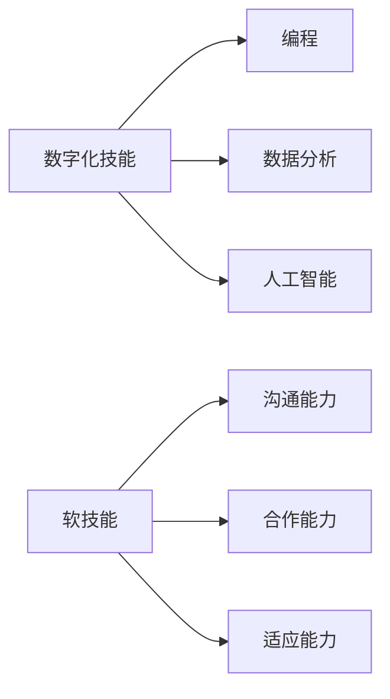
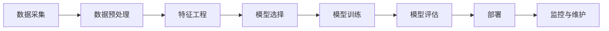

                 

**AI时代的就业技能转型:数字化技能和软技能培养**

## 1. 背景介绍

在人工智能（AI）迅速发展的今天，就业市场正在发生巨大变化。根据世界经济论坛的报告，到2025年，AI将创造出1330万个新的就业岗位，但也会消除970万个岗位。这种变化要求人们转变技能，以适应新的就业需求。本文将探讨AI时代的就业技能转型，重点关注数字化技能和软技能的培养。

## 2. 核心概念与联系

### 2.1 数字化技能与软技能

数字化技能（Digital Literacy）是指使用数字技术和设备解决问题、创造内容和交流信息的能力。软技能（Soft Skills）则是指个人品质、沟通能力、合作能力等，这些技能在AI时代依然至关重要。


**Mermaid 关系图：**


### 2.2 AI技术栈

AI技术栈包括机器学习、深度学习、自然语言处理、计算机视觉等。这些技术为数字化技能的培养提供了基础。

**Mermaid 流程图：**


## 3. 核心算法原理 & 具体操作步骤

### 3.1 算法原理概述

机器学习算法是AI技术栈的基础。监督学习、无监督学习和强化学习是三种主要类型。

### 3.2 算法步骤详解

以线性回归为例，其步骤包括：

1. 数据收集：收集包含特征和目标变量的数据。
2. 数据预处理：清洗数据，处理缺失值，进行特征缩放。
3. 模型训练：使用梯度下降算法训练模型。
4. 模型评估：使用交叉验证和指标（如均方误差）评估模型。
5. 模型部署：将模型部署到生产环境中。

### 3.3 算法优缺点

线性回归简单易懂，但对数据线性关系的假设限制了其应用。

### 3.4 算法应用领域

线性回归在预测分析、回归分析等领域广泛应用。

## 4. 数学模型和公式 & 详细讲解 & 举例说明

### 4.1 数学模型构建

线性回归模型的数学表达式为：$y = wx + b$

### 4.2 公式推导过程

使用梯度下降算法，我们可以最小化均方误差（MSE）函数，从而找到最优的$w$和$b$。

### 4.3 案例分析与讲解

例如，预测房价。特征$x$可以是房屋的面积，目标变量$y$是房屋的价格。通过训练模型，我们可以预测给定面积的房屋价格。

## 5. 项目实践：代码实例和详细解释说明

### 5.1 开发环境搭建

使用Python和Scikit-learn库。

### 5.2 源代码详细实现

```python
from sklearn.linear_model import LinearRegression
from sklearn.model_selection import train_test_split
from sklearn.metrics import mean_squared_error

# 假设我们有房屋面积和房屋价格的数据
X, y = load_housing_data()

# 分割数据集
X_train, X_test, y_train, y_test = train_test_split(X, y, test_size=0.2, random_state=42)

# 创建并训练模型
model = LinearRegression()
model.fit(X_train, y_train)

# 评估模型
y_pred = model.predict(X_test)
mse = mean_squared_error(y_test, y_pred)
```

### 5.3 代码解读与分析

我们首先导入所需的库，然后加载数据集。我们使用`train_test_split`函数将数据集分为训练集和测试集。然后，我们创建一个`LinearRegression`对象，并使用`fit`方法训练模型。最后，我们使用`predict`方法预测测试集的目标变量，并使用`mean_squared_error`函数评估模型。

### 5.4 运行结果展示

运行代码后，我们可以看到模型的均方误差（MSE）值。这个值越小，模型的预测越准确。

## 6. 实际应用场景

### 6.1 当前应用

线性回归在金融、医疗、制造等行业广泛应用。

### 6.2 未来应用展望

随着数据的增长和AI技术的发展，线性回归的应用将会扩展到更多领域。

## 7. 工具和资源推荐

### 7.1 学习资源推荐

推荐阅读《机器学习》一书，以及Andrew Ng的机器学习课程。

### 7.2 开发工具推荐

推荐使用Python、Scikit-learn、TensorFlow等开发工具。

### 7.3 相关论文推荐

推荐阅读《线性回归的数学基础》等相关论文。

## 8. 总结：未来发展趋势与挑战

### 8.1 研究成果总结

本文介绍了线性回归算法的原理、步骤、优缺点和应用领域，并提供了代码实例。

### 8.2 未来发展趋势

AI技术的发展将推动线性回归等算法的进一步发展。

### 8.3 面临的挑战

数据质量、模型解释性等挑战需要进一步解决。

### 8.4 研究展望

未来的研究将关注模型的解释性、泛化能力等。

## 9. 附录：常见问题与解答

**Q：线性回归需要多少数据？**

**A：线性回归对数据量没有严格要求，但数据量越大，模型的泛化能力越好。**

**Q：线性回归对数据的假设是什么？**

**A：线性回归假设数据服从线性关系，误差服从正态分布。**

**作者：禅与计算机程序设计艺术 / Zen and the Art of Computer Programming**

