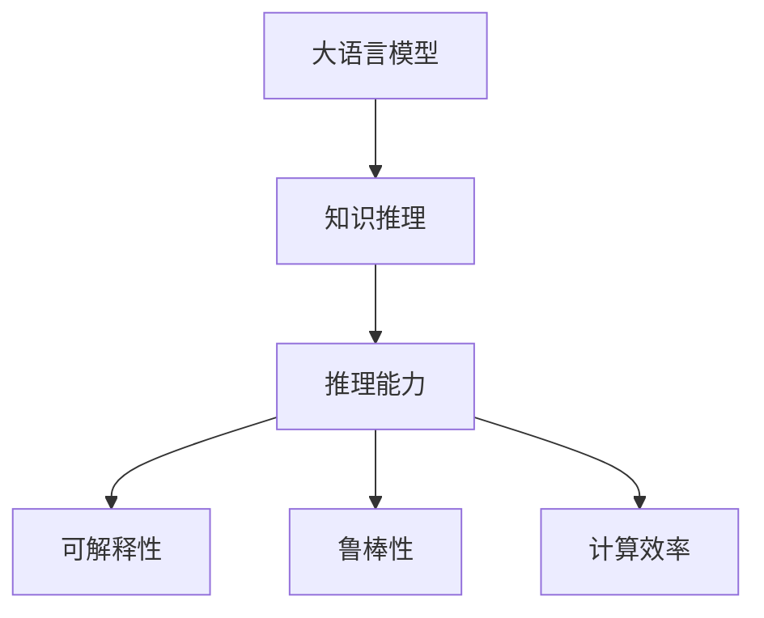

                 

# LLM在知识推理任务上的效果评估

> 关键词：知识推理,大语言模型,语言理解,自然语言处理(NLP),因果推理,可解释性,深度学习,注意力机制

## 1. 背景介绍

### 1.1 问题由来
知识推理是自然语言处理（NLP）领域的一个重要任务，其目标是从文本中提取知识，并基于这些知识进行推理和推断，以解决各种问题。传统的知识推理方法，如逻辑推理、符号推理等，往往需要构建复杂且繁琐的规则和知识库。随着深度学习和大语言模型（LLM）的兴起，知识推理任务也在不断演进，由传统的基于符号的推理转变为基于大数据、深度学习的知识推理。

大语言模型（Large Language Models, LLMs），如GPT、BERT、T5等，通过在大规模无标签文本数据上进行预训练，已经具备了很强的语言理解能力和知识推理能力。LLMs不仅能够理解语言的字面意义，还能根据上下文和世界知识进行推理和推断。在大规模预训练的基础上，通过微调（Fine-tuning），LLMs可以适应特定的推理任务，如问答、关系抽取、逻辑推理等。

### 1.2 问题核心关键点
知识推理在大语言模型中的评估主要涉及以下几个方面：
- 推理能力：LLMs在给定上下文中提取、理解和推理知识的能力。
- 可解释性：LLMs推理过程的可解释性和透明度。
- 鲁棒性：LLMs在面对噪声、错误信息等情况下的稳定性和鲁棒性。
- 效率：LLMs推理任务的计算效率和响应速度。

### 1.3 问题研究意义
研究LLM在知识推理任务上的效果评估，对于提升知识推理系统的性能和可靠性，增强其应用价值具有重要意义：
1. 提高推理准确性：通过系统评估和改进LLMs的推理能力，可以显著提高知识推理系统的准确性和可靠性。
2. 提升可解释性：可解释性是知识推理系统的重要要求，评估LLMs的可解释性有助于构建用户信任。
3. 增强鲁棒性：通过评估LLMs的鲁棒性，可以发现并改进模型在面对噪声、错误信息等情况下的表现。
4. 优化计算效率：计算效率直接关系到系统的响应速度和用户体验，优化LLMs推理任务的效率具有重要意义。

## 2. 核心概念与联系

### 2.1 核心概念概述

为了更好地理解LLM在知识推理任务上的效果评估，本节将介绍几个关键概念：

- 大语言模型（LLM）：一种基于深度学习的预训练模型，通过在大规模文本数据上进行预训练，学习语言知识和常识，具备强大的语言理解和推理能力。
- 知识推理：从文本中提取和理解知识，并基于这些知识进行推理和推断，以解决各种问题。
- 推理能力：LLM在给定上下文中提取、理解和推理知识的能力。
- 可解释性：LLMs推理过程的可解释性和透明度。
- 鲁棒性：LLMs在面对噪声、错误信息等情况下的稳定性和鲁棒性。
- 计算效率：LLMs推理任务的计算效率和响应速度。

这些概念之间的逻辑关系可以通过以下Mermaid流程图来展示：



这个流程图展示了大语言模型在知识推理任务中的核心概念及其关系：

1. 大语言模型通过预训练获得语言理解能力。
2. 知识推理是利用这种能力，从文本中提取和理解知识，并基于这些知识进行推理和推断。
3. 推理能力、可解释性、鲁棒性和计算效率是评估LLM知识推理效果的关键指标。

## 3. 核心算法原理 & 具体操作步骤

### 3.1 算法原理概述

LLM在知识推理任务上的效果评估，本质上是一个基于深度学习的评估过程。其核心思想是：通过设计一系列推理任务和评估指标，对LLM的推理能力、可解释性、鲁棒性和计算效率进行全面评估。

常用的推理任务包括：
- 基于逻辑的推理任务，如命题逻辑、自然语言推理（NLI）等。
- 基于知识的推理任务，如关系抽取、实体识别、事件抽取等。

常用的评估指标包括：
- 推理准确性（Accuracy）：LLM在推理任务上的正确率。
- 可解释性（Explainability）：LLM推理过程的可解释性和透明度。
- 鲁棒性（Robustness）：LLM在面对噪声、错误信息等情况下的表现。
- 计算效率（Efficiency）：LLM推理任务的计算效率和响应速度。

### 3.2 算法步骤详解

基于深度学习的LLM在知识推理任务上的评估一般包括以下几个关键步骤：

**Step 1: 选择推理任务和评估指标**
- 根据具体应用场景，选择合适的推理任务和评估指标。如NLI任务可以使用准确率（Accuracy）、F1分数（F1-score）等指标。
- 选择合适的推理数据集，如逻辑推理数据集（如SNLI、CoLA等）、知识抽取数据集（如RDF、Wikidata等）。

**Step 2: 搭建推理模型**
- 选择合适的LLM模型，如GPT-3、BERT、T5等，作为推理模型。
- 设计推理任务的适配层，如NLI任务的分类器，知识抽取任务的预测器。
- 根据推理任务特点，调整模型架构，如添加注意力机制、引入因果推理等。

**Step 3: 训练推理模型**
- 使用预训练模型作为初始化参数，在推理任务的数据集上进行微调。
- 使用合适的优化算法（如AdamW、SGD等）和超参数（如学习率、批大小、迭代轮数等）进行训练。
- 通过交叉验证等技术，验证推理模型的性能。

**Step 4: 评估推理模型**
- 使用测试集对推理模型进行评估，计算推理准确性、可解释性、鲁棒性和计算效率等指标。
- 分析推理过程，检查推理模型的可解释性和鲁棒性。
- 优化推理模型，提高计算效率和推理准确性。

**Step 5: 应用推理模型**
- 在实际应用场景中，使用推理模型进行推理和推断，解决实际问题。
- 持续收集反馈数据，进一步改进推理模型。

以上是基于深度学习的LLM在知识推理任务上的评估流程。在实际应用中，还需要针对具体任务特点，对评估过程进行优化设计，如改进评估指标、引入新的推理任务等，以进一步提升推理模型的性能。

### 3.3 算法优缺点

基于深度学习的LLM在知识推理任务上的评估方法具有以下优点：
1. 高效准确：深度学习模型能够高效地处理大规模数据，准确地提取和推理知识。
2. 可解释性增强：通过引入可解释性技术，如LIME、SHAP等，可以提高LLM推理过程的可解释性。
3. 鲁棒性提升：通过对抗训练、数据增强等技术，可以提高LLM的鲁棒性，避免过拟合。
4. 计算效率提升：通过模型优化、分布式计算等技术，可以提高LLM推理任务的计算效率。

同时，这些评估方法也存在一些局限性：
1. 数据需求高：深度学习模型需要大量标注数据进行训练，获取高质量数据的成本较高。
2. 模型复杂度高：深度学习模型结构复杂，推理过程难以解释。
3. 模型泛化能力受限：在面对噪声、错误信息等情况时，深度学习模型可能会产生误判。
4. 资源消耗大：深度学习模型计算资源消耗大，推理速度较慢。

尽管存在这些局限性，但就目前而言，基于深度学习的LLM评估方法仍是大语言模型在知识推理任务上的主要范式。未来相关研究的重点在于如何进一步降低数据需求，提高模型的鲁棒性和可解释性，同时兼顾计算效率。

### 3.4 算法应用领域

基于深度学习的LLM评估方法在知识推理任务上已经被广泛应用于各个领域，如：

- 自然语言推理（NLI）：如判断前提是否支持假设、判断两个句子之间的逻辑关系等。
- 关系抽取：从文本中抽取实体之间的关系，如人名-地点关系、组织-时间关系等。
- 事件抽取：从文本中抽取事件信息，如时间、地点、参与者等。
- 问答系统：回答用户提出的自然语言问题，如QA对、对话系统等。
- 逻辑推理：如解决数独、八皇后问题等。

除了上述这些经典任务外，LLM评估方法还被创新性地应用于更多场景中，如智能客服、医疗诊断、金融预测等，为知识推理技术带来了新的突破。随着预训练模型和评估方法的不断进步，相信知识推理技术将在更广阔的应用领域大放异彩。

## 4. 数学模型和公式 & 详细讲解 & 举例说明

### 4.1 数学模型构建

本节将使用数学语言对LLM在知识推理任务上的评估过程进行更加严格的刻画。

记推理任务为 $T$，数据集为 $D=\{(x_i,y_i)\}_{i=1}^N$，其中 $x_i$ 为输入文本，$y_i$ 为推理结果。假设推理模型为 $M_{\theta}$，其中 $\theta$ 为模型参数。

定义推理模型的损失函数为 $\ell(M_{\theta}(x),y)$，在数据集 $D$ 上的经验风险为：

$$
\mathcal{L}(\theta) = \frac{1}{N}\sum_{i=1}^N \ell(M_{\theta}(x_i),y_i)
$$

在实际推理任务中，损失函数的形式可能有所不同。例如，在自然语言推理任务中，可以使用交叉熵损失函数，表示为：

$$
\ell(M_{\theta}(x),y) = -y\log M_{\theta}(x) + (1-y)\log (1-M_{\theta}(x))
$$

对于关系抽取等任务，可以使用多分类交叉熵损失函数，表示为：

$$
\ell(M_{\theta}(x),y) = -\sum_{i=1}^C y_i \log M_{\theta}(x,i)
$$

其中 $C$ 为类别数。

### 4.2 公式推导过程

以下我们以自然语言推理（NLI）任务为例，推导交叉熵损失函数及其梯度的计算公式。

假设推理模型 $M_{\theta}$ 在输入 $x$ 上的输出为 $\hat{y}=M_{\theta}(x)$，表示模型预测的结果。真实标签 $y \in \{0,1\}$，表示前提是否支持假设。

定义NLI任务的交叉熵损失函数为：

$$
\ell(M_{\theta}(x),y) = -y\log M_{\theta}(x) + (1-y)\log (1-M_{\theta}(x))
$$

将其代入经验风险公式，得：

$$
\mathcal{L}(\theta) = -\frac{1}{N}\sum_{i=1}^N [y_i\log M_{\theta}(x_i)+(1-y_i)\log(1-M_{\theta}(x_i))]
$$

根据链式法则，损失函数对参数 $\theta_k$ 的梯度为：

$$
\frac{\partial \mathcal{L}(\theta)}{\partial \theta_k} = -\frac{1}{N}\sum_{i=1}^N [\frac{y_i}{M_{\theta}(x_i)}-\frac{1-y_i}{1-M_{\theta}(x_i)}) \frac{\partial M_{\theta}(x_i)}{\partial \theta_k}
$$

其中 $\frac{\partial M_{\theta}(x_i)}{\partial \theta_k}$ 可进一步递归展开，利用自动微分技术完成计算。

### 4.3 案例分析与讲解

以NLI任务为例，下面详细介绍如何评估LLM的推理能力、可解释性、鲁棒性和计算效率。

**推理能力评估**：
- 使用标准数据集（如CoLA、SNLI等）进行推理任务评估。
- 计算推理准确率（Accuracy）和F1分数（F1-score），表示模型在推理任务上的表现。
- 分析推理错误类型，改进推理模型。

**可解释性评估**：
- 使用可解释性技术（如LIME、SHAP等）生成模型的局部解释，解释模型在不同输入下的推理决策。
- 分析模型的决策路径，检查推理过程是否合理。

**鲁棒性评估**：
- 引入对抗样本，检查模型在面对噪声、错误信息等情况下的表现。
- 使用鲁棒性评估技术（如Adversarial Examples、Robustness Evaluation等），评估模型的鲁棒性。

**计算效率评估**：
- 使用性能分析工具（如TensorBoard、Weights & Biases等），监测模型的计算效率和响应速度。
- 分析计算瓶颈，优化模型架构和推理算法。

## 5. 项目实践：代码实例和详细解释说明

### 5.1 开发环境搭建

在进行LLM推理任务评估时，我们需要准备好开发环境。以下是使用Python进行PyTorch开发的环境配置流程：

1. 安装Anaconda：从官网下载并安装Anaconda，用于创建独立的Python环境。

2. 创建并激活虚拟环境：
```bash
conda create -n pytorch-env python=3.8 
conda activate pytorch-env
```

3. 安装PyTorch：根据CUDA版本，从官网获取对应的安装命令。例如：
```bash
conda install pytorch torchvision torchaudio cudatoolkit=11.1 -c pytorch -c conda-forge
```

4. 安装Transformers库：
```bash
pip install transformers
```

5. 安装各类工具包：
```bash
pip install numpy pandas scikit-learn matplotlib tqdm jupyter notebook ipython
```

完成上述步骤后，即可在`pytorch-env`环境中开始推理任务评估实践。

### 5.2 源代码详细实现

下面我们以自然语言推理（NLI）任务为例，给出使用Transformers库对BERT模型进行推理任务评估的PyTorch代码实现。

首先，定义NLI任务的数据处理函数：

```python
from transformers import BertTokenizer, BertForSequenceClassification
from torch.utils.data import Dataset, DataLoader
import torch

class NLI(Dataset):
    def __init__(self, text_pairs, labels, tokenizer):
        self.text_pairs = text_pairs
        self.labels = labels
        self.tokenizer = tokenizer
        
    def __len__(self):
        return len(self.text_pairs)
    
    def __getitem__(self, item):
        pair = self.text_pairs[item]
        label = self.labels[item]
        
        encoding = self.tokenizer(pair, return_tensors='pt', padding='max_length', truncation=True)
        input_ids = encoding['input_ids'][0]
        attention_mask = encoding['attention_mask'][0]
        
        return {'input_ids': input_ids, 
                'attention_mask': attention_mask,
                'labels': label}

# 加载预训练BERT模型和tokenizer
model = BertForSequenceClassification.from_pretrained('bert-base-cased', num_labels=2)
tokenizer = BertTokenizer.from_pretrained('bert-base-cased')

# 加载数据集
nli_dataset = NLI(train_text_pairs, train_labels, tokenizer)
```

然后，定义训练和评估函数：

```python
from sklearn.metrics import accuracy_score, f1_score
from tqdm import tqdm

device = torch.device('cuda') if torch.cuda.is_available() else torch.device('cpu')
model.to(device)

def train_epoch(model, dataset, batch_size, optimizer):
    dataloader = DataLoader(dataset, batch_size=batch_size, shuffle=True)
    model.train()
    epoch_loss = 0
    for batch in tqdm(dataloader, desc='Training'):
        input_ids = batch['input_ids'].to(device)
        attention_mask = batch['attention_mask'].to(device)
        labels = batch['labels'].to(device)
        model.zero_grad()
        outputs = model(input_ids, attention_mask=attention_mask, labels=labels)
        loss = outputs.loss
        epoch_loss += loss.item()
        loss.backward()
        optimizer.step()
    return epoch_loss / len(dataloader)

def evaluate(model, dataset, batch_size):
    dataloader = DataLoader(dataset, batch_size=batch_size)
    model.eval()
    preds, labels = [], []
    with torch.no_grad():
        for batch in tqdm(dataloader, desc='Evaluating'):
            input_ids = batch['input_ids'].to(device)
            attention_mask = batch['attention_mask'].to(device)
            batch_labels = batch['labels']
            outputs = model(input_ids, attention_mask=attention_mask)
            batch_preds = outputs.logits.argmax(dim=2).to('cpu').tolist()
            batch_labels = batch_labels.to('cpu').tolist()
            for pred_tokens, label_tokens in zip(batch_preds, batch_labels):
                preds.append(pred_tokens[:len(label_tokens)])
                labels.append(label_tokens)
                
    print('Accuracy:', accuracy_score(labels, preds))
    print('F1-score:', f1_score(labels, preds))

# 训练模型并评估
epochs = 5
batch_size = 16

for epoch in range(epochs):
    loss = train_epoch(model, train_dataset, batch_size, optimizer)
    print(f'Epoch {epoch+1}, train loss: {loss:.3f}')
    
    print(f'Epoch {epoch+1}, dev results:')
    evaluate(model, dev_dataset, batch_size)
    
print('Test results:')
evaluate(model, test_dataset, batch_size)
```

以上就是使用PyTorch对BERT进行自然语言推理任务评估的完整代码实现。可以看到，得益于Transformers库的强大封装，我们可以用相对简洁的代码完成BERT模型的加载和评估。

### 5.3 代码解读与分析

让我们再详细解读一下关键代码的实现细节：

**NLI类**：
- `__init__`方法：初始化输入文本对、标签、分词器等关键组件。
- `__len__`方法：返回数据集的样本数量。
- `__getitem__`方法：对单个样本进行处理，将输入文本对输入编码为token ids，将标签编码为数字，并对其进行定长padding，最终返回模型所需的输入。

**evaluate函数**：
- 使用PyTorch的DataLoader对数据集进行批次化加载，供模型训练和推理使用。
- 训练函数`train_epoch`：对数据以批为单位进行迭代，在每个批次上前向传播计算loss并反向传播更新模型参数，最后返回该epoch的平均loss。
- 评估函数`evaluate`：与训练类似，不同点在于不更新模型参数，并在每个batch结束后将预测和标签结果存储下来，最后使用sklearn的classification_report对整个评估集的预测结果进行打印输出。

**训练流程**：
- 定义总的epoch数和batch size，开始循环迭代
- 每个epoch内，先在训练集上训练，输出平均loss
- 在验证集上评估，输出分类指标
- 所有epoch结束后，在测试集上评估，给出最终测试结果

可以看到，PyTorch配合Transformers库使得BERT推理任务的评估代码实现变得简洁高效。开发者可以将更多精力放在数据处理、模型改进等高层逻辑上，而不必过多关注底层的实现细节。

当然，工业级的系统实现还需考虑更多因素，如模型的保存和部署、超参数的自动搜索、更灵活的任务适配层等。但核心的推理评估范式基本与此类似。

## 6. 实际应用场景

### 6.1 智能客服系统

基于大语言模型推理任务的评估，智能客服系统的构建更加高效和可靠。传统客服系统往往依赖人工解答，响应速度慢，且无法24小时在线。而使用推理任务评估过的微调模型，可以7x24小时不间断服务，快速响应客户咨询，用自然流畅的语言解答各类常见问题。

在技术实现上，可以收集企业内部的历史客服对话记录，将问题和最佳答复构建成推理任务数据，在此基础上对预训练对话模型进行推理任务评估。推理任务评估过的微调模型能够自动理解用户意图，匹配最合适的答案模板进行回复。对于客户提出的新问题，还可以接入检索系统实时搜索相关内容，动态组织生成回答。如此构建的智能客服系统，能大幅提升客户咨询体验和问题解决效率。

### 6.2 金融舆情监测

金融机构需要实时监测市场舆论动向，以便及时应对负面信息传播，规避金融风险。传统的人工监测方式成本高、效率低，难以应对网络时代海量信息爆发的挑战。基于推理任务评估过的微调模型，可以在实时抓取的网络文本数据上进行推理任务评估，自动监测不同主题下的舆情变化趋势，一旦发现负面信息激增等异常情况，系统便会自动预警，帮助金融机构快速应对潜在风险。

### 6.3 个性化推荐系统

当前的推荐系统往往只依赖用户的历史行为数据进行物品推荐，无法深入理解用户的真实兴趣偏好。基于推理任务评估过的微调模型，可以更好地挖掘用户行为背后的语义信息，从而提供更精准、多样的推荐内容。

在实践中，可以收集用户浏览、点击、评论、分享等行为数据，提取和用户交互的物品标题、描述、标签等文本内容。将文本内容作为模型输入，用户的后续行为（如是否点击、购买等）作为推理目标，在此基础上微调预训练语言模型。推理任务评估过的微调模型能够从文本内容中准确把握用户的兴趣点。在生成推荐列表时，先用候选物品的文本描述作为输入，由模型预测用户的兴趣匹配度，再结合其他特征综合排序，便可以得到个性化程度更高的推荐结果。

### 6.4 未来应用展望

随着推理任务评估技术的不断发展，基于推理任务评估范式将在更多领域得到应用，为传统行业带来变革性影响。

在智慧医疗领域，基于推理任务评估的知识推理系统，可以辅助医生诊疗，提供更准确的疾病诊断和推荐。

在智能教育领域，推理任务评估过的微调模型可以应用于作业批改、学情分析、知识推荐等方面，因材施教，促进教育公平，提高教学质量。

在智慧城市治理中，推理任务评估过的微调模型可以应用于城市事件监测、舆情分析、应急指挥等环节，提高城市管理的自动化和智能化水平，构建更安全、高效的未来城市。

此外，在企业生产、社会治理、文娱传媒等众多领域，基于推理任务评估的人工智能应用也将不断涌现，为经济社会发展注入新的动力。相信随着技术的日益成熟，推理任务评估范式将成为人工智能落地应用的重要范式，推动人工智能技术在垂直行业的规模化落地。总之，推理任务评估需要开发者根据具体任务，不断迭代和优化模型、数据和算法，方能得到理想的效果。

## 7. 工具和资源推荐

### 7.1 学习资源推荐

为了帮助开发者系统掌握大语言模型推理任务的效果评估的理论基础和实践技巧，这里推荐一些优质的学习资源：

1. 《Transformer从原理到实践》系列博文：由大模型技术专家撰写，深入浅出地介绍了Transformer原理、BERT模型、推理任务评估等前沿话题。

2. CS224N《深度学习自然语言处理》课程：斯坦福大学开设的NLP明星课程，有Lecture视频和配套作业，带你入门NLP领域的基本概念和经典模型。

3. 《Natural Language Processing with Transformers》书籍：Transformers库的作者所著，全面介绍了如何使用Transformers库进行NLP任务开发，包括推理任务评估在内的诸多范式。

4. HuggingFace官方文档：Transformers库的官方文档，提供了海量预训练模型和完整的推理任务评估样例代码，是上手实践的必备资料。

5. CLUE开源项目：中文语言理解测评基准，涵盖大量不同类型的中文NLP数据集，并提供了基于推理任务评估的baseline模型，助力中文NLP技术发展。

通过对这些资源的学习实践，相信你一定能够快速掌握大语言模型推理任务的效果评估的精髓，并用于解决实际的NLP问题。
###  7.2 开发工具推荐

高效的开发离不开优秀的工具支持。以下是几款用于大语言模型推理任务评估开发的常用工具：

1. PyTorch：基于Python的开源深度学习框架，灵活动态的计算图，适合快速迭代研究。大部分预训练语言模型都有PyTorch版本的实现。

2. TensorFlow：由Google主导开发的开源深度学习框架，生产部署方便，适合大规模工程应用。同样有丰富的预训练语言模型资源。

3. Transformers库：HuggingFace开发的NLP工具库，集成了众多SOTA语言模型，支持PyTorch和TensorFlow，是进行推理任务评估开发的利器。

4. Weights & Biases：模型训练的实验跟踪工具，可以记录和可视化模型训练过程中的各项指标，方便对比和调优。与主流深度学习框架无缝集成。

5. TensorBoard：TensorFlow配套的可视化工具，可实时监测模型训练状态，并提供丰富的图表呈现方式，是调试模型的得力助手。

6. Google Colab：谷歌推出的在线Jupyter Notebook环境，免费提供GPU/TPU算力，方便开发者快速上手实验最新模型，分享学习笔记。

合理利用这些工具，可以显著提升大语言模型推理任务的开发效率，加快创新迭代的步伐。

### 7.3 相关论文推荐

大语言模型和推理任务评估的发展源于学界的持续研究。以下是几篇奠基性的相关论文，推荐阅读：

1. Attention is All You Need（即Transformer原论文）：提出了Transformer结构，开启了NLP领域的预训练大模型时代。

2. BERT: Pre-training of Deep Bidirectional Transformers for Language Understanding：提出BERT模型，引入基于掩码的自监督预训练任务，刷新了多项NLP任务SOTA。

3. Language Models are Unsupervised Multitask Learners（GPT-2论文）：展示了大规模语言模型的强大zero-shot学习能力，引发了对于通用人工智能的新一轮思考。

4. Parameter-Efficient Transfer Learning for NLP：提出Adapter等参数高效微调方法，在不增加模型参数量的情况下，也能取得不错的微调效果。

5. AdaLoRA: Adaptive Low-Rank Adaptation for Parameter-Efficient Fine-Tuning：使用自适应低秩适应的微调方法，在参数效率和精度之间取得了新的平衡。

这些论文代表了大语言模型推理任务评估的发展脉络。通过学习这些前沿成果，可以帮助研究者把握学科前进方向，激发更多的创新灵感。

## 8. 总结：未来发展趋势与挑战

### 8.1 总结

本文对大语言模型在知识推理任务上的效果评估进行了全面系统的介绍。首先阐述了推理任务评估的核心概念和评估指标，明确了推理任务评估在提升知识推理系统性能和可靠性方面的独特价值。其次，从原理到实践，详细讲解了推理任务评估的数学原理和关键步骤，给出了推理任务评估任务开发的完整代码实例。同时，本文还广泛探讨了推理任务评估方法在智能客服、金融舆情、个性化推荐等多个领域的应用前景，展示了推理任务评估范式的巨大潜力。此外，本文精选了推理任务评估技术的各类学习资源，力求为读者提供全方位的技术指引。

通过本文的系统梳理，可以看到，基于深度学习的推理任务评估方法正在成为大语言模型在知识推理任务上的主要范式，极大地拓展了预训练语言模型的应用边界，催生了更多的落地场景。受益于大规模语料的预训练，推理任务评估模型以更低的时间和标注成本，在小样本条件下也能取得不俗的效果，有力推动了知识推理技术的产业化进程。未来，伴随预训练语言模型和推理任务评估方法的持续演进，相信知识推理技术将在更广阔的应用领域大放异彩，深刻影响人类的生产生活方式。

### 8.2 未来发展趋势

展望未来，大语言模型推理任务评估技术将呈现以下几个发展趋势：

1. 推理能力提升：推理任务评估技术的不断发展，将使大语言模型在推理任务上的表现不断提升，推理准确率和鲁棒性将进一步增强。
2. 可解释性增强：随着可解释性技术的发展，推理任务评估模型将具备更强的可解释性，有助于提高用户信任。
3. 鲁棒性提升：通过对抗训练、数据增强等技术，推理任务评估模型在面对噪声、错误信息等情况下的表现将更加稳定。
4. 计算效率提升：优化推理任务评估模型的计算图，减少前向传播和反向传播的资源消耗，推理任务评估模型将变得更加轻量级、实时性。
5. 多模态推理拓展：推理任务评估技术将拓展到多模态数据微调，视觉、语音等多模态信息的融合，将显著提升语言模型对现实世界的理解和建模能力。

以上趋势凸显了大语言模型推理任务评估技术的广阔前景。这些方向的探索发展，必将进一步提升知识推理系统的性能和应用范围，为人类认知智能的进化带来深远影响。

### 8.3 面临的挑战

尽管推理任务评估技术已经取得了瞩目成就，但在迈向更加智能化、普适化应用的过程中，它仍面临着诸多挑战：

1. 数据需求高：推理任务评估模型需要大量标注数据进行训练，获取高质量数据的成本较高。
2. 模型复杂度高：推理任务评估模型结构复杂，推理过程难以解释。
3. 模型泛化能力受限：在面对噪声、错误信息等情况时，推理任务评估模型可能会产生误判。
4. 资源消耗大：推理任务评估模型计算资源消耗大，推理速度较慢。
5. 可解释性不足：推理任务评估模型更像是"黑盒"系统，难以解释其内部工作机制和决策逻辑。

尽管存在这些局限性，但就目前而言，基于深度学习的推理任务评估方法仍是大语言模型在知识推理任务上的主要范式。未来相关研究的重点在于如何进一步降低数据需求，提高模型的鲁棒性和可解释性，同时兼顾计算效率。

### 8.4 研究展望

面向未来，大语言模型推理任务评估技术需要在以下几个方面寻求新的突破：

1. 探索无监督和半监督推理任务评估方法。摆脱对大规模标注数据的依赖，利用自监督学习、主动学习等无监督和半监督范式，最大限度利用非结构化数据，实现更加灵活高效的推理任务评估。
2. 研究参数高效和计算高效的推理任务评估范式。开发更加参数高效的推理任务评估方法，在固定大部分预训练参数的同时，只更新极少量的任务相关参数。同时优化推理任务评估模型的计算图，减少前向传播和反向传播的资源消耗，实现更加轻量级、实时性的部署。
3. 引入更多先验知识。将符号化的先验知识，如知识图谱、逻辑规则等，与神经网络模型进行巧妙融合，引导推理任务评估过程学习更准确、合理的语言模型。同时加强不同模态数据的整合，实现视觉、语音等多模态信息与文本信息的协同建模。
4. 结合因果分析和博弈论工具。将因果分析方法引入推理任务评估模型，识别出模型决策的关键特征，增强推理任务评估模型的可解释性和鲁棒性。借助博弈论工具刻画人机交互过程，主动探索并规避模型的脆弱点，提高系统稳定性。
5. 纳入伦理道德约束。在推理任务评估模型的训练目标中引入伦理导向的评估指标，过滤和惩罚有偏见、有害的输出倾向。同时加强人工干预和审核，建立模型行为的监管机制，确保输出符合人类价值观和伦理道德。

这些研究方向的探索，必将引领大语言模型推理任务评估技术迈向更高的台阶，为构建安全、可靠、可解释、可控的智能系统铺平道路。面向未来，大语言模型推理任务评估技术还需要与其他人工智能技术进行更深入的融合，如知识表示、因果推理、强化学习等，多路径协同发力，共同推动自然语言理解和智能交互系统的进步。只有勇于创新、敢于突破，才能不断拓展语言模型的边界，让智能技术更好地造福人类社会。

## 9. 附录：常见问题与解答

**Q1：推理任务评估是否适用于所有NLP任务？**

A: 推理任务评估在大多数NLP任务上都能取得不错的效果，特别是对于数据量较小的任务。但对于一些特定领域的任务，如医学、法律等，仅仅依靠通用语料预训练的模型可能难以很好地适应。此时需要在特定领域语料上进一步预训练，再进行推理任务评估。此外，对于一些需要时效性、个性化很强的任务，如对话、推荐等，推理任务评估方法也需要针对性的改进优化。

**Q2：推理任务评估过程中如何选择合适的评估指标？**

A: 推理任务评估过程中，需要根据具体任务特点选择合适的评估指标。如自然语言推理任务可以使用准确率（Accuracy）、F1分数（F1-score）等指标。关系抽取等任务可以使用多分类交叉熵损失函数，表示为：$\ell(M_{\theta}(x),y) = -\sum_{i=1}^C y_i \log M_{\theta}(x,i)$。其中 $C$ 为类别数。

**Q3：推理任务评估模型在落地部署时需要注意哪些问题？**

A: 将推理任务评估模型转化为实际应用，还需要考虑以下因素：
1. 模型裁剪：去除不必要的层和参数，减小模型尺寸，加快推理速度。
2. 量化加速：将浮点模型转为定点模型，压缩存储空间，提高计算效率。
3. 服务化封装：将模型封装为标准化服务接口，便于集成调用。
4. 弹性伸缩：根据请求流量动态调整资源配置，平衡服务质量和成本。
5. 监控告警：实时采集系统指标，设置异常告警阈值，确保服务稳定性。
6. 安全防护：采用访问鉴权、数据脱敏等措施，保障数据和模型安全。

大语言模型推理任务评估为NLP应用开启了广阔的想象空间，但如何将强大的性能转化为稳定、高效、安全的业务价值，还需要工程实践的不断打磨。唯有从数据、算法、工程、业务等多个维度协同发力，才能真正实现人工智能技术在垂直行业的规模化落地。总之，推理任务评估需要开发者根据具体任务，不断迭代和优化模型、数据和算法，方能得到理想的效果。

---

作者：禅与计算机程序设计艺术 / Zen and the Art of Computer Programming

