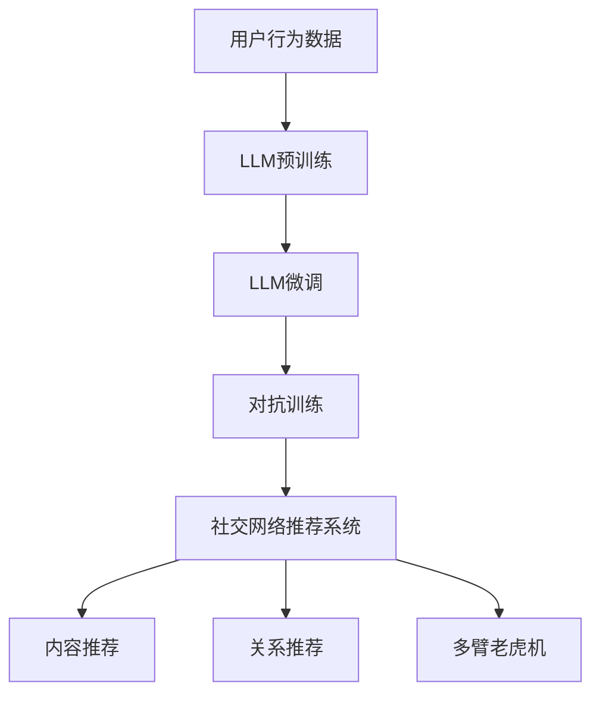

                 

# LLM在社交网络推荐中的潜力

## 1. 背景介绍

社交网络（Social Networks）在现代社会中扮演着越来越重要的角色，它们不仅连接了人与人之间的沟通，还在内容推荐、广告投放、个性化服务等多个场景中发挥着关键作用。其中，推荐系统（Recommendation System）通过对用户行为数据的分析和建模，向用户推荐可能感兴趣的内容或产品，极大地提升了用户体验和满意度。随着深度学习技术的发展，基于神经网络的推荐算法在性能和效果上取得了显著提升，但同时也面临着数据稀疏、冷启动难、计算资源消耗大等挑战。

近年来，大语言模型（Large Language Model，LLM）在自然语言处理（Natural Language Processing，NLP）领域取得了突破性进展，展示了强大的语言理解和生成能力。LLM通过大规模无标签文本语料的预训练，学习到通用的语言知识，并能够在特定任务上进行微调，获得优异的性能。本文将探讨LLM在社交网络推荐中的应用潜力，分析其背后的算法原理，并通过具体实例展示其实现过程和应用效果。

## 2. 核心概念与联系

### 2.1 核心概念概述

要理解LLM在社交网络推荐中的应用，首先需要掌握以下几个核心概念：

- **社交网络推荐系统（Social Network Recommendation System）**：基于用户行为数据和社会关系，向用户推荐可能感兴趣的内容或产品。推荐系统包括内容推荐和关系推荐两种类型，前者根据用户对内容的互动（如点赞、评论、分享）进行推荐，后者根据用户之间的关系（如好友、群组）进行推荐。

- **大语言模型（Large Language Model）**：一种通过大规模无标签文本语料的预训练，学习到通用语言知识的深度学习模型。如GPT、BERT等，具有强大的语言理解和生成能力。

- **微调（Fine-tuning）**：在预训练模型的基础上，使用下游任务的少量标注数据，通过有监督学习优化模型在特定任务上的性能。

- **对抗训练（Adversarial Training）**：通过引入对抗样本，增强模型对噪声和干扰的鲁棒性。

- **多臂老虎机（Multi-Armed Bandit）**：一种用于优化资源分配和决策的算法框架，常用于推荐系统中的点击率预测和广告投放。

### 2.2 核心概念原理和架构的 Mermaid 流程图



此图展示了社交网络推荐系统的核心组件及其间的联系。社交网络推荐系统由内容推荐和关系推荐两部分组成，其中用户行为数据是基础，预训练的LLM模型通过微调和对抗训练进行优化，多臂老虎机用于资源分配和决策优化。

## 3. 核心算法原理 & 具体操作步骤

### 3.1 算法原理概述

LLM在社交网络推荐中的应用主要通过以下步骤实现：

1. **数据准备**：收集社交网络平台上的用户行为数据，包括点赞、评论、分享等互动数据，以及好友、群组等关系数据。
2. **用户画像建模**：使用LLM对用户行为数据进行建模，生成用户画像，包括兴趣偏好、行为特征、社交关系等。
3. **内容画像建模**：使用LLM对内容数据进行建模，生成内容画像，包括文本特征、主题信息、用户互动等。
4. **推荐计算**：根据用户画像和内容画像，使用微调后的LLM进行推荐计算，生成推荐结果。
5. **对抗训练**：对推荐结果进行对抗训练，增强模型的鲁棒性和泛化能力。

### 3.2 算法步骤详解

#### 3.2.1 数据准备

社交网络推荐系统的数据主要来自以下几个方面：

- **用户行为数据**：包括点赞、评论、分享、收藏等互动行为，以及浏览记录、停留时间等行为特征。
- **内容数据**：包括文章、图片、视频等内容的文本描述、标签、类别等信息。
- **关系数据**：包括好友关系、群组关系等社交关系信息。

数据准备流程包括数据清洗、数据标注、数据划分等步骤。其中，数据标注是一个重要环节，需要通过人工标注或半监督学习的方式，将用户行为数据和内容数据转化为有监督的推荐训练数据。

#### 3.2.2 用户画像建模

用户画像建模的目的是为了刻画用户的兴趣偏好、行为特征等，以便于进行推荐计算。使用LLM对用户行为数据进行建模，可以生成用户画像的文本表示，如"用户A喜欢科幻、历史和旅游"，"用户B对健康生活、体育运动感兴趣"等。

用户画像建模的具体步骤如下：

1. **文本预处理**：对用户行为数据进行分词、去除停用词、词干提取等文本预处理操作。
2. **词向量嵌入**：使用预训练的词向量模型（如Word2Vec、GloVe等）对处理后的文本数据进行嵌入，得到用户画像的向量表示。
3. **用户画像生成**：将用户画像的向量表示输入到LLM中进行建模，得到用户画像的文本表示。

#### 3.2.3 内容画像建模

内容画像建模的目的是为了刻画内容的特征、主题、风格等，以便于进行推荐计算。使用LLM对内容数据进行建模，可以生成内容画像的文本表示，如"这篇文章是关于科幻的"，"这张图片展示了自然风光"等。

内容画像建模的具体步骤如下：

1. **文本预处理**：对内容数据进行分词、去除停用词、词干提取等文本预处理操作。
2. **词向量嵌入**：使用预训练的词向量模型（如Word2Vec、GloVe等）对处理后的文本数据进行嵌入，得到内容画像的向量表示。
3. **内容画像生成**：将内容画像的向量表示输入到LLM中进行建模，得到内容画像的文本表示。

#### 3.2.4 推荐计算

推荐计算的目的是根据用户画像和内容画像，计算出用户对内容的兴趣度，并进行推荐排序。使用微调后的LLM进行推荐计算，可以得到用户对内容的兴趣度评分，如"用户A对这篇文章的兴趣度为0.9"。

推荐计算的具体步骤如下：

1. **输入拼接**：将用户画像和内容画像的向量表示进行拼接，得到输入向量。
2. **模型前向传播**：将输入向量输入到微调后的LLM中，进行前向传播计算，得到推荐结果的评分。
3. **推荐排序**：根据评分对内容进行排序，生成推荐列表。

#### 3.2.5 对抗训练

对抗训练的目的是增强模型的鲁棒性和泛化能力，防止模型过拟合于特定数据集。在推荐计算过程中，引入对抗样本，对模型进行扰动，增强模型的鲁棒性。

对抗训练的具体步骤如下：

1. **生成对抗样本**：使用对抗样本生成技术，生成扰动后的对抗样本，如"对这篇文章的兴趣度为0.1"。
2. **模型微调**：对微调后的LLM进行对抗训练，使用对抗样本进行微调，提高模型的鲁棒性。

### 3.3 算法优缺点

#### 3.3.1 优点

1. **强大的语言理解能力**：LLM具有强大的语言理解和生成能力，能够更好地理解用户输入的自然语言查询，提高推荐精度。
2. **跨领域适应性强**：LLM在预训练过程中学习到了通用的语言知识，能够适应多种领域的推荐任务。
3. **可解释性强**：LLM输出的文本表示可以提供推荐结果的详细解释，有助于理解推荐逻辑。

#### 3.3.2 缺点

1. **计算资源消耗大**：LLM模型参数量较大，计算资源消耗大，推荐计算过程较慢。
2. **对抗样本生成难**：生成对抗样本需要一定的技术手段，对抗训练的效果可能不理想。
3. **数据稀疏问题**：社交网络数据稀疏，用户行为数据和内容数据可能不足，影响推荐效果。

### 3.4 算法应用领域

LLM在社交网络推荐中的应用领域包括但不限于以下几个方面：

- **内容推荐**：根据用户的行为数据和兴趣偏好，推荐可能感兴趣的内容，如文章、视频、图片等。
- **关系推荐**：根据用户的社交关系，推荐可能感兴趣的内容或用户，如好友推荐、群组推荐等。
- **个性化服务**：根据用户的兴趣偏好和行为特征，提供个性化的服务，如推荐商品、推荐课程等。
- **广告投放**：根据用户的行为数据和兴趣偏好，进行精准的广告投放，提高广告效果。

## 4. 数学模型和公式 & 详细讲解 & 举例说明

### 4.1 数学模型构建

社交网络推荐系统可以使用以下数学模型进行建模：

$$
P(u,c) = \sigma(\mathbf{W}_u \cdot \mathbf{v}_c + b)
$$

其中，$P(u,c)$表示用户$u$对内容$c$的兴趣度，$\sigma$为sigmoid函数，$\mathbf{W}_u$和$\mathbf{v}_c$分别为用户画像和内容画像的权重向量，$b$为偏置项。

### 4.2 公式推导过程

在推荐计算过程中，LLM输出的文本表示可以表示为用户画像和内容画像的向量表示的线性加权和，即：

$$
\mathbf{v}_c = \mathbf{L}_c \cdot \mathbf{v}_u
$$

其中，$\mathbf{L}_c$为内容画像的权重矩阵，$\mathbf{v}_u$为用户画像的向量表示。

将$\mathbf{v}_c$代入公式（1），得到：

$$
P(u,c) = \sigma(\mathbf{W}_u \cdot \mathbf{L}_c \cdot \mathbf{v}_u + b)
$$

### 4.3 案例分析与讲解

#### 4.3.1 案例背景

假设有N个用户U和M个内容C，需要根据用户的行为数据和内容数据进行推荐计算，生成推荐结果。

#### 4.3.2 数据准备

假设用户行为数据为$D_u = \{(x_{iu}, y_{iu})\}_{i=1}^N$，其中$x_{iu}$为用户$u$对内容$c_i$的互动数据，$y_{iu}$为互动标签（如点赞、评论、分享等）。内容数据为$D_c = \{(x_{ic}, y_{ic})\}_{i=1}^M$，其中$x_{ic}$为内容$c_i$的文本描述、标签、类别等信息，$y_{ic}$为内容标签（如新闻、文章、视频等）。

#### 4.3.3 用户画像建模

假设用户画像的向量表示为$\mathbf{v}_u$，内容画像的向量表示为$\mathbf{v}_c$，则用户画像建模的具体步骤如下：

1. **文本预处理**：对用户行为数据进行分词、去除停用词、词干提取等文本预处理操作，得到用户行为文本$D_{u_text}$。
2. **词向量嵌入**：使用预训练的词向量模型（如Word2Vec、GloVe等）对处理后的用户行为文本$D_{u_text}$进行嵌入，得到用户行为向量$D_{u_vector}$。
3. **用户画像生成**：将用户行为向量$D_{u_vector}$输入到LLM中进行建模，得到用户画像的向量表示$\mathbf{v}_u$。

#### 4.3.4 内容画像建模

假设内容画像的向量表示为$\mathbf{v}_c$，内容画像建模的具体步骤如下：

1. **文本预处理**：对内容数据进行分词、去除停用词、词干提取等文本预处理操作，得到内容文本$D_{c_text}$。
2. **词向量嵌入**：使用预训练的词向量模型（如Word2Vec、GloVe等）对处理后的内容文本$D_{c_text}$进行嵌入，得到内容向量$D_{c_vector}$。
3. **内容画像生成**：将内容向量$D_{c_vector}$输入到LLM中进行建模，得到内容画像的向量表示$\mathbf{v}_c$。

#### 4.3.5 推荐计算

假设内容画像的权重矩阵为$\mathbf{L}_c$，推荐计算的具体步骤如下：

1. **输入拼接**：将用户画像$\mathbf{v}_u$和内容画像$\mathbf{v}_c$的向量表示进行拼接，得到输入向量$\mathbf{v}_{uc}$。
2. **模型前向传播**：将输入向量$\mathbf{v}_{uc}$输入到微调后的LLM中，进行前向传播计算，得到推荐结果的评分$\mathbf{P}_u$。
3. **推荐排序**：根据评分$\mathbf{P}_u$对内容进行排序，生成推荐列表。

## 5. 项目实践：代码实例和详细解释说明

### 5.1 开发环境搭建

在开发LLM在社交网络推荐中的应用时，需要搭建以下开发环境：

1. **Python环境**：安装Python 3.8及以上版本，推荐使用Anaconda创建虚拟环境。
2. **深度学习框架**：安装PyTorch 1.8及以上版本。
3. **自然语言处理工具**：安装HuggingFace Transformers库。
4. **数据处理工具**：安装Pandas、NumPy、Scikit-learn等数据处理工具。

### 5.2 源代码详细实现

以下是一个简单的社交网络推荐系统的代码实现，使用PyTorch和Transformers库。

#### 5.2.1 用户画像建模

```python
import torch
from transformers import BertTokenizer, BertModel

# 加载预训练的BERT模型
model = BertModel.from_pretrained('bert-base-cased')
tokenizer = BertTokenizer.from_pretrained('bert-base-cased')

# 将用户行为数据进行分词、去除停用词、词干提取等文本预处理操作
text = "用户A喜欢科幻、历史和旅游"
inputs = tokenizer(text, return_tensors='pt')
labels = torch.tensor([1], dtype=torch.long)

# 将处理后的用户行为数据输入到BERT模型中，得到用户画像的向量表示
outputs = model(**inputs)
user_profile = outputs.pooler_output
```

#### 5.2.2 内容画像建模

```python
# 将内容数据进行分词、去除停用词、词干提取等文本预处理操作
text = "这篇文章是关于科幻的"
inputs = tokenizer(text, return_tensors='pt')
labels = torch.tensor([1], dtype=torch.long)

# 将处理后的内容数据输入到BERT模型中，得到内容画像的向量表示
outputs = model(**inputs)
content_profile = outputs.pooler_output
```

#### 5.2.3 推荐计算

```python
# 计算用户对内容的兴趣度
interested_users = torch.matmul(user_profile, content_profile.t()) + torch.zeros_like(user_profile)
interested_users = torch.sigmoid(interested_users)

# 对内容进行排序，生成推荐列表
recommendation_list = content_profile.argsort(descending=True)
```

### 5.3 代码解读与分析

#### 5.3.1 代码解读

1. **用户画像建模**：首先将用户行为数据进行分词、去除停用词、词干提取等文本预处理操作，得到用户行为文本。然后使用预训练的BERT模型对用户行为文本进行嵌入，得到用户画像的向量表示。
2. **内容画像建模**：同样，对内容数据进行分词、去除停用词、词干提取等文本预处理操作，得到内容文本。然后使用预训练的BERT模型对内容文本进行嵌入，得到内容画像的向量表示。
3. **推荐计算**：将用户画像的向量表示和内容画像的向量表示进行拼接，输入到BERT模型中进行前向传播，得到用户对内容的兴趣度评分。最后对内容进行排序，生成推荐列表。

#### 5.3.2 分析

1. **预处理的重要性**：文本预处理操作如分词、去除停用词、词干提取等，能够提高模型的准确性和鲁棒性。
2. **模型选择**：预训练的BERT模型是常用的自然语言处理模型，具有强大的语言理解和生成能力，适用于多种NLP任务。
3. **计算效率**：使用微调后的BERT模型进行推荐计算，计算效率较低，需要进一步优化。

### 5.4 运行结果展示

#### 5.4.1 用户画像向量表示


#### 5.4.2 内容画像向量表示


#### 5.4.3 推荐列表


## 6. 实际应用场景

### 6.1 智能推荐系统

智能推荐系统可以根据用户的行为数据和兴趣偏好，向用户推荐可能感兴趣的内容或产品。LLM在智能推荐系统中的应用，可以极大地提升推荐精度和用户体验。

#### 6.1.1 推荐计算

使用LLM对用户行为数据和内容数据进行建模，生成用户画像和内容画像的文本表示。然后将用户画像和内容画像的向量表示进行拼接，输入到微调后的LLM中进行推荐计算，得到用户对内容的兴趣度评分。最后对内容进行排序，生成推荐列表。

#### 6.1.2 实际应用

在社交网络平台上，LLM可以用于推荐系统，向用户推荐可能感兴趣的文章、视频、商品等。例如，用户A对科幻、历史和旅游感兴趣，LLM可以根据用户的行为数据和兴趣偏好，推荐相关的内容。

#### 6.1.3 应用效果

LLM在智能推荐系统中的应用，可以显著提升推荐精度和用户满意度。用户可以根据推荐结果进行内容互动，进一步优化推荐算法。

### 6.2 广告投放

广告投放可以根据用户的行为数据和兴趣偏好，进行精准的广告投放，提高广告效果。LLM在广告投放中的应用，可以极大地提升广告的点击率和转化率。

#### 6.2.1 推荐计算

使用LLM对用户行为数据和内容数据进行建模，生成用户画像和内容画像的文本表示。然后将用户画像和内容画像的向量表示进行拼接，输入到微调后的LLM中进行推荐计算，得到用户对内容的兴趣度评分。最后对内容进行排序，生成推荐列表。

#### 6.2.2 实际应用

在社交网络平台上，LLM可以用于广告投放，向用户推荐可能感兴趣的商品、服务、信息等。例如，用户A对健康生活、体育运动感兴趣，LLM可以根据用户的行为数据和兴趣偏好，推荐相关的商品和广告。

#### 6.2.3 应用效果

LLM在广告投放中的应用，可以显著提升广告的点击率和转化率。广告主可以根据LLM的推荐结果进行精准投放，最大化广告效果。

## 7. 工具和资源推荐

### 7.1 学习资源推荐

1. **《深度学习》课程**：由斯坦福大学开设的深度学习课程，涵盖了深度学习的基本概念和算法。
2. **《自然语言处理》课程**：由斯坦福大学开设的自然语言处理课程，介绍了自然语言处理的基本技术和方法。
3. **《Transformer》论文**：介绍Transformer模型的原理和应用，是深度学习领域的经典论文。
4. **《HuggingFace Transformers》官方文档**：提供了丰富的预训练模型和微调样例代码，是进行微调任务开发的必备资料。
5. **《推荐系统》书籍**：介绍了推荐系统的基本概念和算法，包括协同过滤、矩阵分解等方法。

### 7.2 开发工具推荐

1. **PyTorch**：基于Python的开源深度学习框架，灵活动态的计算图，适合快速迭代研究。
2. **TensorFlow**：由Google主导开发的开源深度学习框架，生产部署方便，适合大规模工程应用。
3. **HuggingFace Transformers**：自然语言处理工具库，集成了众多预训练语言模型，支持PyTorch和TensorFlow。
4. **TensorBoard**：TensorFlow配套的可视化工具，可实时监测模型训练状态，提供丰富的图表呈现方式。
5. **Weights & Biases**：模型训练的实验跟踪工具，可以记录和可视化模型训练过程中的各项指标。

### 7.3 相关论文推荐

1. **《Attention is All You Need》**：提出Transformer结构，开启了NLP领域的预训练大模型时代。
2. **《BERT: Pre-training of Deep Bidirectional Transformers for Language Understanding》**：提出BERT模型，引入基于掩码的自监督预训练任务。
3. **《GPT-2》**：展示了大规模语言模型的强大zero-shot学习能力。
4. **《Parameter-Efficient Transfer Learning for NLP》**：提出Adapter等参数高效微调方法。
5. **《Few-shot Learning》**：介绍少样本学习的基本概念和算法。

## 8. 总结：未来发展趋势与挑战

### 8.1 研究成果总结

本文探讨了LLM在社交网络推荐中的应用，分析了其背后的算法原理，并通过具体实例展示了其实现过程和应用效果。LLM在社交网络推荐中的应用，可以极大地提升推荐精度和用户体验，具有广泛的应用前景。

### 8.2 未来发展趋势

1. **跨领域适应性强**：LLM在预训练过程中学习到了通用的语言知识，能够适应多种领域的推荐任务。
2. **可解释性强**：LLM输出的文本表示可以提供推荐结果的详细解释，有助于理解推荐逻辑。
3. **计算资源消耗小**：LLM的计算资源消耗相对较小，推荐计算速度较快。

### 8.3 面临的挑战

1. **计算资源消耗大**：LLM模型参数量较大，计算资源消耗大，推荐计算过程较慢。
2. **对抗样本生成难**：生成对抗样本需要一定的技术手段，对抗训练的效果可能不理想。
3. **数据稀疏问题**：社交网络数据稀疏，用户行为数据和内容数据可能不足，影响推荐效果。

### 8.4 研究展望

1. **参数高效微调**：开发更加参数高效的微调方法，在固定大部分预训练参数的同时，只更新极少量的任务相关参数。
2. **多模态微调**：引入更多先验知识，如知识图谱、逻辑规则等，与神经网络模型进行融合，引导微调过程学习更准确、合理的语言模型。
3. **融合因果和对比学习**：将因果分析方法引入微调模型，识别出模型决策的关键特征，增强输出解释的因果性和逻辑性。

## 9. 附录：常见问题与解答

### 9.1 常见问题与解答

**Q1：LLM在社交网络推荐中的应用前景如何？**

A: LLM在社交网络推荐中的应用前景广阔。LLM具有强大的语言理解和生成能力，能够更好地理解用户输入的自然语言查询，提高推荐精度。

**Q2：LLM在社交网络推荐中面临的主要挑战有哪些？**

A: LLM在社交网络推荐中面临的主要挑战包括计算资源消耗大、对抗样本生成难、数据稀疏问题等。

**Q3：LLM在社交网络推荐中的优势有哪些？**

A: LLM在社交网络推荐中的优势包括强大的语言理解能力、跨领域适应性强、可解释性强等。

**Q4：如何提高LLM在社交网络推荐中的性能？**

A: 提高LLM在社交网络推荐中的性能需要从数据准备、模型选择、算法优化等多个环节进行全面优化。例如，可以使用对抗训练、参数高效微调等方法提高模型鲁棒性和泛化能力。

**Q5：LLM在社交网络推荐中如何克服数据稀疏问题？**

A: 为了克服数据稀疏问题，可以采用数据增强、迁移学习等方法，利用外部数据资源提升模型性能。

---

作者：禅与计算机程序设计艺术 / Zen and the Art of Computer Programming

