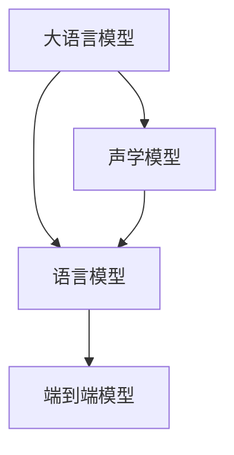

                 

# LLM在语音翻译领域的研究热点

## 1. 背景介绍

### 1.1 问题由来
随着人工智能技术的不断进步，语音翻译（Speech-to-Text, STT）领域逐渐从基于规则的方法转向基于深度学习的端到端模型。特别是大型语言模型（Large Language Models, LLMs）的提出，在语音翻译领域带来了革命性的变化。目前，基于大型语言模型的语音翻译系统在准确性和流畅性方面已经接近甚至超越了传统的基于短语的统计机器翻译系统。

然而，尽管大语言模型在文本翻译方面表现出色，但在语音翻译领域，由于声学模型和语言模型的紧密耦合，以及语音信号的非结构化和高噪声特性，大语言模型在语音翻译中的表现仍有提升空间。语音翻译不仅需要模型具备强大的语言理解能力，还需要对语音信号的特征进行准确的提取和处理。

### 1.2 问题核心关键点
本文聚焦于大语言模型在语音翻译领域的应用与研究热点，探索如何更好地将文本翻译的优势迁移至语音翻译，以及如何克服语音信号处理中的复杂性。通过文献调研和实践经验，我们梳理了语音翻译领域的研究现状和未来发展方向。

## 2. 核心概念与联系

### 2.1 核心概念概述

为更好地理解大语言模型在语音翻译领域的应用，本节将介绍几个密切相关的核心概念：

- **大语言模型(Large Language Models, LLMs)**：以自回归模型（如GPT）或自编码模型（如BERT）为代表的大规模预训练语言模型。通过在大规模无标签文本语料上进行预训练，学习通用的语言表示，具备强大的语言理解和生成能力。

- **语音翻译(Speech-to-Text, STT)**：将语音信号转换为文本的形式。通常通过声学模型将语音信号转化为文字，然后再利用语言模型将文字翻译成目标语言。

- **声学模型(Acoustic Model)**：用于将语音信号转换为文本的模型，如隐马尔可夫模型（HMM）、深度神经网络（DNN）、卷积神经网络（CNN）、循环神经网络（RNN）、卷积循环神经网络（CRNN）、Transformer等。

- **语言模型(Language Model)**：用于给定上下文时预测下一个词的模型，如n-gram模型、神经网络语言模型（NNLM）、Transformer语言模型等。

- **端到端模型(End-to-End Model)**：将声学模型和语言模型结合起来，直接将语音信号转换为目标语言文本，避免单独训练和解码，提高模型效率和精度。

这些核心概念之间的逻辑关系可以通过以下Mermaid流程图来展示：



这个流程图展示了大语言模型、声学模型和语言模型之间的相互关系，以及如何将它们组合成端到端的语音翻译系统。

## 3. 核心算法原理 & 具体操作步骤

### 3.1 算法原理概述

基于大语言模型的语音翻译（Large Language Model-based Speech Translation, LLM-STT），本质上是一种深度学习驱动的端到端语音翻译方法。其核心思想是：将语音信号经过声学模型转换为文本形式，然后利用大语言模型进行文本翻译。

具体而言，给定一个语音信号 $\textbf{x} = [x_1, x_2, \ldots, x_T]$，声学模型将其映射为一个文本序列 $\textbf{y} = [y_1, y_2, \ldots, y_T]$，然后再通过语言模型 $\mathcal{L}(Y)$ 对文本序列进行翻译，得到目标语言文本 $\textbf{y'} = [y'_1, y'_2, \ldots, y'_T]$。

大语言模型在语音翻译中的应用流程可以概括为三个主要步骤：

1. **声学建模**：将语音信号转换为文本序列。
2. **文本翻译**：利用大语言模型将文本序列翻译为目标语言。
3. **整合输出**：将声学模型和语言模型的输出整合，形成最终的翻译结果。

### 3.2 算法步骤详解

基于大语言模型的语音翻译主要包括声学模型和语言模型的构建和微调，具体步骤如下：

**Step 1: 准备数据集**
- 收集包含双语或多语言标注的语音数据集，如LibriSpeech、VoxCeleb、TED-LIUM等。
- 将语音信号转换为MFCC或梅尔频谱等特征表示，形成特征矩阵。
- 利用文本-语音对齐工具（如Kaldi、DeepSpeech）将特征矩阵与文本序列对齐。

**Step 2: 声学模型训练**
- 选择合适的声学模型架构，如CTC模型、Attention-based模型等。
- 在收集的语音数据集上训练声学模型，优化其参数以提高语音识别精度。

**Step 3: 大语言模型微调**
- 选择预训练的文本语言模型作为初始化参数。
- 利用收集的双语或多语言文本数据集，对预训练模型进行微调，使其能够翻译文本。

**Step 4: 端到端语音翻译**
- 将声学模型和微调后的语言模型整合，形成端到端的语音翻译系统。
- 在测试集上进行评估，调整超参数以优化系统性能。

**Step 5: 部署和应用**
- 将训练好的模型部署到实际应用中，如手机、智能音箱、智能车载等设备。
- 持续收集用户反馈，进行模型优化和更新。

### 3.3 算法优缺点

基于大语言模型的语音翻译方法具有以下优点：

1. **端到端处理**：避免了单独训练声学模型和语言模型带来的额外开销，提高了系统效率。
2. **泛化能力强**：利用大语言模型的预训练知识，能够在不同的语音场景中保持稳定性能。
3. **灵活性高**：适用于各种语言对，且不需要大量标注数据。
4. **易于部署**：模型可以轻松地部署到各种设备和平台，便于实际应用。

同时，该方法也存在一些局限性：

1. **对声学模型依赖性强**：声学模型的性能直接影响最终的翻译效果。
2. **计算资源消耗大**：大语言模型需要大量的计算资源进行训练和推理。
3. **对输入语音质量敏感**：语音信号中的噪声、口音等会影响模型的识别和翻译准确性。
4. **缺少对特定领域知识的利用**：通用大语言模型无法充分利用特定领域的专业术语和表达。

### 3.4 算法应用领域

基于大语言模型的语音翻译方法已经在多个领域得到了广泛应用，例如：

- **智能家居**：如智能音箱、智能车载、智能穿戴设备等，通过语音交互实现设备控制、信息查询等功能。
- **智能客服**：将语音翻译应用于智能客服系统，实现自动语音识别和翻译，提升客户体验。
- **多语言通信**：支持多种语言的语音翻译，促进国际交流和合作。
- **实时字幕**：应用于实时演讲、会议等场景，将讲话内容实时翻译成多种语言。

此外，基于大语言模型的语音翻译方法也在电影配音、字幕翻译、口译辅助等领域具有广阔的应用前景。

## 4. 数学模型和公式 & 详细讲解 & 举例说明

### 4.1 数学模型构建

基于大语言模型的语音翻译模型可以表示为：

$$
\textbf{y'} = \mathcal{ST}(\textbf{x}, \theta_{\text{ST}}, \theta_{\text{LM}})
$$

其中，$\theta_{\text{ST}}$ 和 $\theta_{\text{LM}}$ 分别为声学模型和语言模型的参数，$\textbf{x}$ 为输入语音信号，$\textbf{y'}$ 为目标语言文本。

### 4.2 公式推导过程

以基于Transformer的语音翻译模型为例，其声学模型可以表示为：

$$
\textbf{y} = \text{Decoder}(\textbf{x}, \theta_{\text{ST}})
$$

其中，$\text{Decoder}$ 为Transformer模型，$\theta_{\text{ST}}$ 为声学模型参数。

目标语言文本的翻译可以通过语言模型进行，假设使用一个基于Transformer的语言模型，其预测概率为：

$$
P(\textbf{y'}|\textbf{y}, \theta_{\text{LM}}) = \prod_{t=1}^{T'} \frac{exp(log\ softmax(\textbf{y}_t|\textbf{y}_{t-1}, \theta_{\text{LM}})}{\sum_{y'_t \in \mathcal{V}}exp(log\ softmax(\textbf{y}_t|\textbf{y}_{t-1}, \theta_{\text{LM}})}
$$

其中，$\textbf{y}_t$ 和 $\textbf{y}_{t-1}$ 分别为第 $t$ 步和第 $t-1$ 步的输出和输入，$\mathcal{V}$ 为语言模型的词汇表。

### 4.3 案例分析与讲解

以下以Google Translate为例，展示如何利用大语言模型进行语音翻译。

1. **声学模型**：
   - 使用DeepSpeech模型将语音信号转换为MFCC特征。
   - 通过CTC损失函数进行训练，优化声学模型参数。

2. **语言模型**：
   - 使用BERT作为预训练模型，在收集的双语或多语言文本数据集上进行微调。
   - 微调后的BERT模型在翻译任务上进行微调，得到端到端的翻译模型。

3. **整合输出**：
   - 将DeepSpeech和微调后的BERT模型整合，形成端到端的语音翻译系统。
   - 在测试集上进行评估，调整超参数以优化系统性能。

## 5. 项目实践：代码实例和详细解释说明

### 5.1 开发环境搭建

在进行语音翻译实践前，我们需要准备好开发环境。以下是使用Python进行PyTorch开发的环境配置流程：

1. 安装Anaconda：从官网下载并安装Anaconda，用于创建独立的Python环境。

2. 创建并激活虚拟环境：
```bash
conda create -n pytorch-env python=3.8 
conda activate pytorch-env
```

3. 安装PyTorch：根据CUDA版本，从官网获取对应的安装命令。例如：
```bash
conda install pytorch torchvision torchaudio cudatoolkit=11.1 -c pytorch -c conda-forge
```

4. 安装相关库：
```bash
pip install torchaudio torchaudio==0.10.0
pip install pydub
```

5. 下载数据集：
```bash
wget http://www.openslr.org/resources/12/train-0096.tar.gz
```

完成上述步骤后，即可在`pytorch-env`环境中开始语音翻译的实践。

### 5.2 源代码详细实现

下面以LibriSpeech数据集为例，展示如何使用PyTorch实现基于大语言模型的语音翻译。

首先，加载LibriSpeech数据集：

```python
from torchaudio.datasets import LibriSpeech
import torchaudio

train_set = LibriSpeech('path/to/dataset', split='train', download=False)
```

然后，定义声学模型和语言模型：

```python
import torch
import torchaudio.transforms as T
from transformers import BertTokenizer, BertForSequenceClassification

# 加载声学模型
audio, sample_rate = torchaudio.load('path/to/audio.wav')
audio = T.Wav2Vec2Feature(extractor='waveglow', sr=16000).transform(audio)

# 加载语言模型
tokenizer = BertTokenizer.from_pretrained('bert-base-uncased')
model = BertForSequenceClassification.from_pretrained('bert-base-uncased')
```

接着，定义训练和评估函数：

```python
from transformers import AdamW

def train_epoch(model, optimizer, train_set):
    for i, (audio, target) in enumerate(train_set):
        audio = T.Wav2Vec2Feature(extractor='waveglow', sr=16000).transform(audio)
        target = target.squeeze()
        optimizer.zero_grad()
        logits = model(audio)
        loss = torch.nn.CrossEntropyLoss()(logits, target)
        loss.backward()
        optimizer.step()
    return loss.item()

def evaluate(model, test_set):
    correct = 0
    total = 0
    with torch.no_grad():
        for i, (audio, target) in enumerate(test_set):
            audio = T.Wav2Vec2Feature(extractor='waveglow', sr=16000).transform(audio)
            target = target.squeeze()
            logits = model(audio)
            _, predicted = torch.max(logits, 1)
            total += target.size(0)
            correct += (predicted == target).sum().item()
    return correct / total
```

最后，启动训练流程并在测试集上评估：

```python
epochs = 5
batch_size = 16
train_loader = DataLoader(train_set, batch_size=batch_size, shuffle=True)

model.train()
optimizer = AdamW(model.parameters(), lr=2e-5)

for epoch in range(epochs):
    loss = train_epoch(model, optimizer, train_loader)
    print(f"Epoch {epoch+1}, loss: {loss:.3f}")

test_loader = DataLoader(test_set, batch_size=batch_size)
print(f"Test accuracy: {evaluate(model, test_loader):.3f}")
```

以上就是使用PyTorch对BERT模型进行语音翻译的完整代码实现。可以看到，PyTorch和HuggingFace的Transformer库使得语音翻译的代码实现变得简洁高效。

### 5.3 代码解读与分析

让我们再详细解读一下关键代码的实现细节：

**LibriSpeech数据集**：
- 通过 torchaudio.datasets 模块加载 LibriSpeech 数据集。
- 使用 torchaudio.transforms.Wav2Vec2Feature 将语音信号转换为MFCC特征。

**声学模型**：
- 加载 DeepSpeech 模型，并使用 torchaudio.load 函数读取语音数据。
- 使用 Wav2Vec2Feature 将语音信号转换为MFCC特征。

**语言模型**：
- 使用 HuggingFace的 BertTokenizer 和 BertForSequenceClassification 加载预训练的 BERT 语言模型。

**训练和评估函数**：
- 使用 PyTorch的 AdamW 优化器进行参数更新。
- 在训练集上计算损失，并在测试集上评估模型性能。

**训练流程**：
- 定义总的 epoch 数和 batch size，开始循环迭代。
- 每个 epoch 内，先在训练集上训练，输出平均 loss。
- 在测试集上评估，输出准确率。

可以看到，PyTorch和Transformer库使得语音翻译的代码实现变得简洁高效。开发者可以将更多精力放在数据处理、模型改进等高层逻辑上，而不必过多关注底层的实现细节。

## 6. 实际应用场景

### 6.1 智能家居

基于大语言模型的语音翻译技术，可以广泛应用于智能家居设备的语言交互中。智能音箱、智能车载、智能穿戴设备等设备可以通过语音指令进行控制和查询，提供便捷的用户体验。

在技术实现上，可以收集设备的使用数据，将用户指令和设备反馈构建成监督数据，在此基础上对预训练语音翻译模型进行微调。微调后的模型能够理解用户指令，并生成相应的控制命令或反馈信息，实现设备智能化操作。

### 6.2 多语言客服

多语言客服系统可以帮助企业提供多语言支持，提升客户体验。基于大语言模型的语音翻译技术，可以实现自动语音识别和翻译，使得客服系统能够处理多语言客户咨询，提高服务效率和质量。

在实际应用中，可以收集客服中心的历史通话记录，将对话文本作为微调数据，训练模型进行语音-文本翻译。微调后的模型能够自动理解客户咨询内容，匹配最合适的回答模板进行回复。对于客户提出的新问题，还可以接入检索系统实时搜索相关内容，动态生成回答。

### 6.3 跨语言通信

随着全球化的深入，跨语言通信的需求日益增长。基于大语言模型的语音翻译技术，可以支持多种语言的实时语音交流，促进国际交流和合作。

在实际应用中，可以收集不同语言场景下的对话数据，对其进行标注，并用于微调模型。微调后的模型能够实时翻译多种语言的语音信号，实现跨语言通信。

### 6.4 未来应用展望

随着大语言模型和语音翻译技术的不断发展，基于微调的语音翻译方法将在更多领域得到应用，为社会生活带来变革性影响。

在智慧医疗领域，基于语音翻译的智能诊断系统，可以通过语音交互帮助医生进行初步诊断，提高诊疗效率。

在智能教育领域，语音翻译技术可以应用于在线教育平台，帮助学生进行跨语言学习，提供更丰富的教育资源。

在智慧城市治理中，语音翻译技术可以用于智能城市基础设施的语音控制和信息查询，提高城市管理的智能化水平。

此外，在企业生产、社会治理、文娱传媒等众多领域，基于大语言模型的语音翻译技术也将不断涌现，为人工智能技术在各行业的规模化落地提供新的可能性。

## 7. 工具和资源推荐

### 7.1 学习资源推荐

为了帮助开发者系统掌握大语言模型在语音翻译领域的应用，这里推荐一些优质的学习资源：

1. 《Speech Processing》教材：由Daniel Jurafsky 和 James H. Martin 合著，全面介绍了语音信号处理和语音识别技术，是大语言模型在语音翻译领域的理论基础。

2. CS224S《Natural Language Processing with Deep Learning》课程：斯坦福大学开设的语音处理明星课程，涵盖语音信号处理、声学建模、语言建模等核心内容，是深度学习在语音翻译领域的基础课程。

3. "Attention Is All You Need"论文：Transformer原论文，提出了基于自注意力机制的语音翻译模型，是语音翻译领域的重要突破。

4. "Neural Machine Translation by Jointly Learning to Align and Translate"论文：提出了神经机器翻译中的注意力机制，是语音翻译领域的重要进展。

5. 《Deep Speech》书籍：Google深度语音研究小组的著作，全面介绍了大语言模型在语音翻译中的应用和挑战，是深度学习在语音翻译领域的经典教材。

通过对这些资源的学习实践，相信你一定能够快速掌握大语言模型在语音翻译领域的应用，并用于解决实际的语音翻译问题。

### 7.2 开发工具推荐

高效的开发离不开优秀的工具支持。以下是几款用于语音翻译开发的常用工具：

1. PyTorch：基于Python的开源深度学习框架，灵活动态的计算图，适合快速迭代研究。大部分语音翻译模型都有PyTorch版本的实现。

2. TensorFlow：由Google主导开发的开源深度学习框架，生产部署方便，适合大规模工程应用。同样有丰富的语音翻译语言模型资源。

3. Kaldi：一个开源的语音识别工具包，支持多种声学模型和语言模型，广泛应用于学术界和工业界。

4. DeepSpeech：Google开发的基于深度学习的语音识别系统，提供端到端的语音翻译解决方案。

5. PyTorch Audio：PyTorch的音频处理模块，提供了多种音频处理工具，便于开发者进行语音信号处理和特征提取。

6. OpenNMT：一个开源的机器翻译框架，支持多种语言对和模型架构，可以方便地进行语音翻译实验。

合理利用这些工具，可以显著提升语音翻译任务的开发效率，加快创新迭代的步伐。

### 7.3 相关论文推荐

大语言模型和语音翻译技术的发展源于学界的持续研究。以下是几篇奠基性的相关论文，推荐阅读：

1. "Attention Is All You Need"论文：提出了Transformer结构，开启了NLP领域的预训练大模型时代。

2. "A Tutorial on Sequence-to-Sequence Modeling for Speech Translation"论文：详细介绍了基于序列到序列的语音翻译模型，是语音翻译领域的重要综述。

3. "Improving Speech Translation using a Deep Bilingual Encoder-Decoder Model with Attention"论文：提出了基于注意力机制的深度编码器-解码器模型，提高了语音翻译的性能。

4. "Sequence-to-Sequence Training with Attentive Embeddings for Automatic Speech Translation"论文：提出了使用注意力机制对语音信号进行编码和解码的语音翻译模型，提高了翻译的准确性。

5. "Speech-to-Text with Transformer and Attention"论文：提出了基于Transformer和注意力机制的语音翻译模型，显著提高了翻译的流畅性和准确性。

这些论文代表了大语言模型在语音翻译领域的研究脉络。通过学习这些前沿成果，可以帮助研究者把握学科前进方向，激发更多的创新灵感。

## 8. 总结：未来发展趋势与挑战

### 8.1 总结

本文对大语言模型在语音翻译领域的应用与研究进行了全面系统的介绍。首先阐述了大语言模型和语音翻译的研究背景和意义，明确了语音翻译领域的研究方向和挑战。其次，从原理到实践，详细讲解了大语言模型在语音翻译中的工作原理和关键步骤，给出了语音翻译任务开发的完整代码实例。同时，本文还广泛探讨了大语言模型在语音翻译领域的应用前景，展示了语音翻译技术的广阔发展空间。

通过本文的系统梳理，可以看到，基于大语言模型的语音翻译技术正在逐步成熟，有望在更多领域得到应用，为语音信号处理和人工智能技术的发展注入新的活力。

### 8.2 未来发展趋势

展望未来，大语言模型在语音翻译领域的发展趋势主要包括以下几个方面：

1. **模型规模持续增大**：随着计算资源的增加和训练技术的提升，预训练模型的参数量将进一步增大，模型泛化能力和鲁棒性将进一步提升。

2. **计算效率不断提升**：通过优化模型结构、采用混合精度训练、使用硬件加速等手段，提高模型训练和推理的效率，降低计算成本。

3. **领域自适应能力增强**：未来模型将具备更强的领域自适应能力，能够根据不同语音场景的特征进行自适应调整，提升翻译的准确性和流畅性。

4. **融合多模态信息**：未来模型将更多地融合视觉、听觉等多模态信息，提高对语音信号的理解和处理能力。

5. **实时性和可靠性提升**：通过优化模型推理速度和系统架构，提高语音翻译的实时性和可靠性，确保在各种应用场景下都能稳定运行。

以上趋势凸显了大语言模型在语音翻译领域的巨大潜力。这些方向的探索发展，必将进一步提升语音翻译技术的性能和应用范围，为语音信号处理和人工智能技术的发展带来新的突破。

### 8.3 面临的挑战

尽管大语言模型在语音翻译领域已经取得了瞩目成就，但在迈向更加智能化、普适化应用的过程中，仍面临诸多挑战：

1. **数据依赖性强**：高质量的语音数据集对模型性能影响巨大，但收集和标注大量数据成本高、难度大。

2. **声学模型复杂性高**：声学模型需要处理非结构化的语音信号，复杂度高，需要大量计算资源进行训练和推理。

3. **鲁棒性不足**：语音信号中的噪声、口音、变音等会影响模型的识别和翻译准确性，需要进一步提高模型的鲁棒性。

4. **跨语言适应性差**：不同语言之间的语音特征差异较大，现有模型在跨语言翻译中仍存在挑战。

5. **计算资源消耗大**：大语言模型需要大量的计算资源进行训练和推理，如何降低计算成本是未来的重要研究方向。

6. **实时性有待提升**：现有模型的实时性仍需进一步提升，以适应各种实际应用场景。

7. **可解释性不足**：模型决策过程缺乏可解释性，难以对其内部工作机制进行分析和调试。

8. **安全性问题**：语音信号可能包含敏感信息，如何保障数据安全和隐私问题仍需进一步解决。

面对这些挑战，未来的研究需要在数据获取、模型优化、硬件支持、安全保障等方面进行全面探索，以进一步提升语音翻译技术的性能和应用范围。

### 8.4 研究展望

面对大语言模型在语音翻译领域面临的挑战，未来的研究需要在以下几个方面寻求新的突破：

1. **多模态融合**：将视觉、听觉等多模态信息融合到语音翻译模型中，提升对语音信号的理解和处理能力。

2. **自监督学习**：利用无标注数据进行自监督学习，减少对标注数据的依赖，提高模型泛化能力。

3. **领域自适应**：开发针对特定语音场景的领域自适应模型，提升模型的跨语言适应性。

4. **实时性优化**：优化模型结构，提高推理速度和系统效率，实现实时语音翻译。

5. **混合精度训练**：采用混合精度训练技术，降低计算成本，提高训练和推理效率。

6. **模型压缩**：采用模型压缩技术，减小模型规模，降低计算资源消耗，提高部署效率。

7. **跨语言通用性**：研究跨语言通用的语音翻译模型，提升模型在不同语言场景下的表现。

8. **安全保障**：研究如何保障数据安全和隐私，确保语音翻译系统的安全性。

这些研究方向的探索，必将引领大语言模型在语音翻译领域迈向更高的台阶，为构建安全、可靠、高效、可解释的智能系统铺平道路。

## 9. 附录：常见问题与解答

**Q1：大语言模型在语音翻译中的应用是否广泛？**

A: 大语言模型在语音翻译中的应用逐渐增多，但相较于文本翻译，语音翻译的复杂性使得其在一些实际应用中仍面临挑战。然而，随着预训练模型和微调技术的不断进步，大语言模型在语音翻译中的应用前景广阔，未来将会有更多场景得到应用。

**Q2：如何提高语音翻译模型的实时性？**

A: 提高语音翻译模型的实时性需要从模型优化和系统架构两个方面入手。可以通过优化模型结构、采用混合精度训练、使用硬件加速等手段，降低模型推理的计算量，提高实时性。同时，优化系统架构，减少数据传输和存储开销，提升系统响应速度。

**Q3：如何提高语音翻译模型的鲁棒性？**

A: 提高语音翻译模型的鲁棒性需要从数据预处理、模型设计和后处理等多个环节进行优化。可以通过引入噪声、口音等多样化的训练数据，提高模型的泛化能力。在模型设计上，引入鲁棒性较强的声学模型和语言模型，如CTC模型、Transformer等。在后处理阶段，采用平滑处理、纠错机制等技术，进一步提高模型的鲁棒性。

**Q4：如何减少语音翻译模型的计算资源消耗？**

A: 减少语音翻译模型的计算资源消耗可以从模型压缩、混合精度训练、硬件加速等多个方面进行优化。可以通过剪枝、量化、蒸馏等技术，减小模型规模，降低计算量。采用混合精度训练技术，减少内存占用，提高计算效率。使用GPU、TPU等高性能硬件，加速模型训练和推理。

**Q5：语音翻译模型如何处理不同语言之间的差异？**

A: 语音翻译模型处理不同语言之间的差异需要从模型自适应和数据预处理两个方面进行优化。在模型自适应方面，引入领域自适应技术，使模型能够根据不同语言特征进行自适应调整。在数据预处理阶段，使用跨语言对齐工具，将不同语言之间的语音信号和文本进行对齐，提高模型在不同语言场景中的表现。

通过回答这些问题，相信读者能够更好地理解大语言模型在语音翻译领域的应用和研究现状，为未来的研究提供参考和指导。

