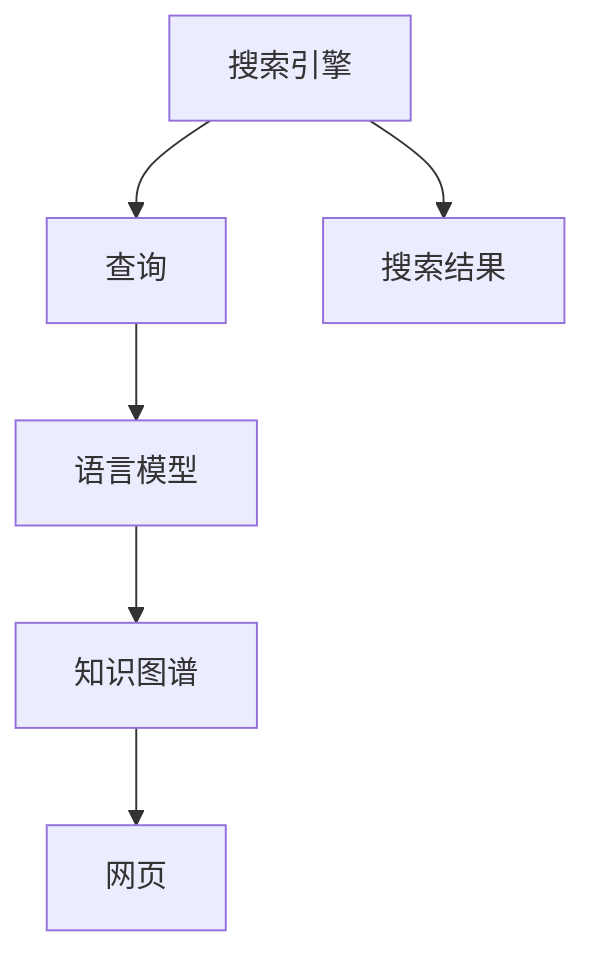
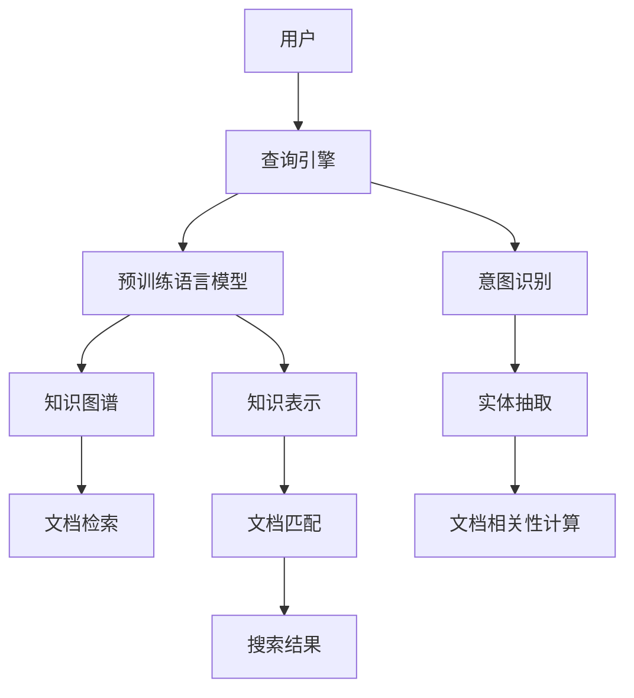
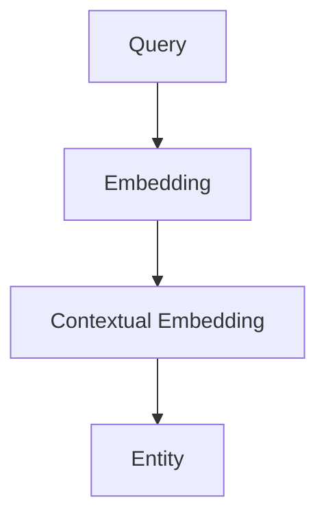
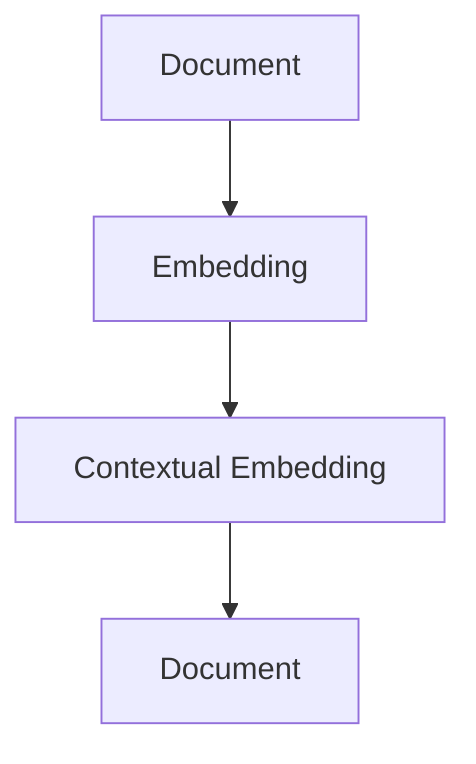

                 

# LLM对传统搜索引擎的挑战

## 1. 背景介绍

搜索引擎作为互联网信息检索的核心工具，已经伴随互联网发展了二十多年。传统搜索引擎的核心原理是“网页-查询匹配”，即根据用户输入的查询关键词，通过算法和索引，找到最相关的网页返回给用户。这种基于关键词匹配的方式，存在诸多不足，随着自然语言理解和深度学习技术的不断演进，现代搜索引擎逐渐引入了语言模型（Language Models, LM）来改进搜索质量。然而，这些语言模型，尤其是近年来兴起的基于大语言模型（Large Language Models, LLMs）的搜索引擎，正在从根本上重塑搜索的范式，带来前所未有的挑战。

## 2. 核心概念与联系

### 2.1 核心概念概述

为了更好地理解LLM对传统搜索引擎的挑战，我们需要了解以下核心概念：

- 搜索引擎（Search Engine）：利用算法和索引，将用户输入的查询与互联网上的网页进行匹配，返回最相关的搜索结果。
- 语言模型（Language Model）：用于衡量一个文本序列出现的概率，通常以给定前缀预测下一个单词的概率分布为基础。
- 大语言模型（Large Language Models）：拥有亿级参数量，通过自监督学习任务预训练的大型神经网络模型。
- 自然语言理解（Natural Language Understanding）：使计算机能够理解自然语言，并从中提取有意义的知识。
- 连续语义搜索（Continuous Semantic Search）：基于用户查询的语义理解和知识图谱，实现更精准的网页匹配。

这些核心概念共同构成了现代搜索引擎的计算图，如图1所示：



### 2.2 核心概念原理和架构的 Mermaid 流程图



## 3. 核心算法原理 & 具体操作步骤

### 3.1 算法原理概述

大语言模型（LLM）对传统搜索引擎的挑战主要体现在以下几个方面：

1. **自然语言理解**：传统的搜索引擎主要基于关键词匹配，难以理解查询的语义和上下文。LLM可以通过预训练获得强大的自然语言理解能力，从而更准确地理解和解析用户的查询意图。

2. **知识图谱的集成**：传统的搜索引擎通常不具备集成知识图谱的能力，难以将外部知识与文本信息进行融合。LLM通过与知识图谱结合，可以实现更全面的信息整合和推理，提升搜索结果的相关性和准确性。

3. **连续语义搜索**：LLM能够基于用户的自然语言查询，直接理解和推理其语义，无需依赖关键词。这使得搜索过程更加自然流畅，能够更好地应对开放域和不确定性较大的搜索场景。

### 3.2 算法步骤详解

基于LLM的搜索引擎的构建主要包括以下几个关键步骤：

**Step 1: 预训练语言模型选择与加载**

- 选择合适的预训练语言模型，如GPT-3、BERT等。
- 使用预训练模型提供的接口或框架（如Transformers库）加载模型。

**Step 2: 构建查询意图识别模块**

- 设计意图识别模型，如使用自监督预训练的BERT模型，通过微调获得意图识别能力。
- 对用户查询进行预处理，如分词、命名实体识别等。
- 使用意图识别模型对查询进行意图分类。

**Step 3: 实体抽取与知识图谱查询**

- 设计实体抽取模型，如BiLSTM-CRF等，对查询中的实体进行抽取。
- 将抽取的实体映射到知识图谱中，查询相关的实体节点。
- 使用图神经网络（GNN）等模型，对实体及其上下文进行推理，获得更全面的信息。

**Step 4: 文档检索与匹配**

- 使用倒排索引等方法，将网页与查询的意图和知识图谱表示进行匹配。
- 使用模型融合技术，将语言模型与文档匹配结果结合，得到最终的搜索结果排序。
- 返回给用户最相关的搜索结果。

**Step 5: 用户交互与反馈**

- 收集用户对搜索结果的反馈信息。
- 使用反馈数据对意图识别和实体抽取等模块进行微调，进一步提升搜索效果。

### 3.3 算法优缺点

基于LLM的搜索引擎具有以下优点：

1. **语义理解能力强**：LLM能够理解查询的语义和上下文，从而更准确地返回相关结果。
2. **信息整合全面**：通过知识图谱的集成，LLM可以整合更多外部知识，提升搜索结果的相关性。
3. **搜索体验自然流畅**：用户可以使用自然语言进行查询，无需记忆复杂的关键词，搜索体验更加自然。

同时，该方法也存在一定的局限性：

1. **计算资源需求高**：预训练的LLM模型参数量巨大，对计算资源和存储资源的需求较高。
2. **模型训练复杂**：预训练和微调过程复杂，需要大量的标注数据和计算资源。
3. **鲁棒性不足**：LLM面对复杂查询和噪声数据时，可能出现理解错误和推理错误。
4. **可解释性差**：LLM通常作为"黑盒"使用，难以解释其内部推理过程。
5. **数据隐私问题**：用户查询和反馈数据可能包含敏感信息，需要考虑数据隐私保护。

### 3.4 算法应用领域

基于LLM的搜索引擎已经在多个领域得到应用，例如：

1. **医疗搜索**：集成医疗知识图谱，为医生提供精准的医学文献、疾病诊断和治疗方案等。
2. **法律搜索**：利用法律知识图谱，为律师提供相关法规、案例和法律解释等。
3. **金融搜索**：结合金融知识图谱，为投资者提供市场动态、财经新闻和投资策略等。
4. **电商搜索**：通过实体抽取和产品推荐，为用户推荐个性化商品。
5. **教育搜索**：为学生提供学习资料、课程和教育资源等。
6. **旅游搜索**：提供景点介绍、旅游攻略和酒店预订等服务。

这些应用展示了LLM在各个垂直领域的潜力，为传统搜索引擎带来了全新的突破。

## 4. 数学模型和公式 & 详细讲解 & 举例说明

### 4.1 数学模型构建

我们以医疗搜索为例，构建基于LLM的搜索引擎的数学模型。假设查询为$Q$，知识图谱中相关节点为$E=\{e_1, e_2, \ldots, e_n\}$，文档表示为$D$。

我们首先设计意图识别模型$\text{Intent}_{\theta}$，使用伯曼模型进行意图分类，得到查询的意图$I$：

$$
I = \text{Intent}_{\theta}(Q)
$$

接着，设计实体抽取模型$\text{Entity}_{\phi}$，对查询中的实体进行抽取，得到实体集合$R=\{r_1, r_2, \ldots, r_m\}$：

$$
R = \text{Entity}_{\phi}(Q)
$$

然后，通过知识图谱查询，得到相关实体节点$E_r=\{e_{r_1}, e_{r_2}, \ldots, e_{r_m}\}$。

最后，使用文档表示模型$\text{Document}_{\psi}$，将文档$D$表示为向量形式$D_v$，并计算文档与查询的匹配度$S$：

$$
D_v = \text{Document}_{\psi}(D)
$$

$$
S = \text{Similarity}(Q, D_v)
$$

其中$\text{Similarity}$为匹配度计算函数，可以采用余弦相似度、编辑距离等方法。

### 4.2 公式推导过程

以上模型中，意图识别、实体抽取和文档匹配过程分别涉及了不同的模型和算法，推导如下：

**意图识别**：

假设意图识别模型为$\text{Intent}_{\theta}$，其结构如图2所示：


其中$A$为查询嵌入，$B$为上下文嵌入，$C$为意图分类器，$D$为意图向量。

假设模型参数为$\theta$，则意图识别的输出为：

$$
I = \text{Intent}_{\theta}(Q) = \text{softmax}(\text{MLP}([Q_{emb}, C_{emb}]))
$$

其中$Q_{emb}$为查询的嵌入，$C_{emb}$为上下文的嵌入，$\text{MLP}$为多层感知器。

**实体抽取**：

假设实体抽取模型为$\text{Entity}_{\phi}$，其结构如图3所示：



其中$A$为查询嵌入，$B$为上下文嵌入，$C$为实体抽取器，$D$为实体向量集合。

假设模型参数为$\phi$，则实体抽取的输出为：

$$
R = \text{Entity}_{\phi}(Q) = \text{argmax}(\text{Seq2Seq}([Q_{emb}, C_{emb}]))
$$

其中$\text{Seq2Seq}$为序列到序列模型，用于预测每个位置的实体类型。

**文档匹配**：

假设文档表示模型为$\text{Document}_{\psi}$，其结构如图4所示：



其中$A$为文档文本，$B$为文本嵌入，$C$为上下文嵌入，$D$为文档向量表示。

假设模型参数为$\psi$，则文档匹配的输出为：

$$
D_v = \text{Document}_{\psi}(D) = \text{softmax}(\text{MLP}([D_{emb}, C_{emb}]))
$$

其中$D_{emb}$为文档的嵌入，$C_{emb}$为上下文的嵌入，$\text{MLP}$为多层感知器。

### 4.3 案例分析与讲解

以医疗搜索为例，我们假设用户查询为“肺癌治疗方案”，系统首先通过意图识别模型，确定用户的意图为“治疗”，接着实体抽取模型识别出“肺癌”实体。然后，知识图谱查询得到与“肺癌”相关的节点，包括“肺癌治疗”、“肺癌晚期”、“肺癌早期”等。最后，文档表示模型将医疗文献表示为向量，计算文档与查询的匹配度，排序后返回最相关的搜索结果。

## 5. 项目实践：代码实例和详细解释说明

### 5.1 开发环境搭建

为了构建基于LLM的搜索引擎，我们需要以下开发环境：

- 预训练语言模型：如GPT-3、BERT等。
- 深度学习框架：如PyTorch、TensorFlow等。
- 自然语言处理工具：如NLTK、spaCy等。
- 知识图谱工具：如Neo4j、Protegé等。
- 服务器环境：需要高性能GPU/TPU等计算资源。

### 5.2 源代码详细实现

以使用PyTorch框架为例，以下是基于BERT模型的医疗搜索系统的实现代码：

```python
import torch
import torch.nn as nn
from transformers import BertTokenizer, BertForSequenceClassification
from py2neo import Graph

# 初始化知识图谱连接
graph = Graph("http://localhost:7474/db/data/")

# 定义意图识别模型
class IntentClassifier(nn.Module):
    def __init__(self, num_labels):
        super(IntentClassifier, self).__init__()
        self.num_labels = num_labels
        self.bert = BertForSequenceClassification.from_pretrained('bert-base-uncased', num_labels=num_labels)
        self.fc = nn.Linear(768, num_labels)
    
    def forward(self, x):
        _, pooled_output = self.bert(x)
        logits = self.fc(pooled_output)
        return logits

# 定义实体抽取模型
class EntityExtractor(nn.Module):
    def __init__(self, num_labels):
        super(EntityExtractor, self).__init__()
        self.num_labels = num_labels
        self.bert = BertForTokenClassification.from_pretrained('bert-base-uncased', num_labels=num_labels)
        self.fc = nn.Linear(768, num_labels)
    
    def forward(self, x):
        x = self.bert(x)
        logits = self.fc(x)
        return logits

# 定义文档匹配模型
class DocumentMatcher(nn.Module):
    def __init__(self, num_labels):
        super(DocumentMatcher, self).__init__()
        self.num_labels = num_labels
        self.bert = BertForSequenceClassification.from_pretrained('bert-base-uncased', num_labels=num_labels)
        self.fc = nn.Linear(768, num_labels)
    
    def forward(self, x):
        _, pooled_output = self.bert(x)
        logits = self.fc(pooled_output)
        return logits

# 定义主搜索模型
class SearchModel(nn.Module):
    def __init__(self, intent_model, entity_model, document_model):
        super(SearchModel, self).__init__()
        self.intent_model = intent_model
        self.entity_model = entity_model
        self.document_model = document_model
    
    def forward(self, x):
        intent_logits = self.intent_model(x)
        intent = intent_logits.argmax(dim=-1)
        entity_logits = self.entity_model(x)
        entity = entity_logits.argmax(dim=-1)
        document_logits = self.document_model(x)
        document = document_logits.argmax(dim=-1)
        return intent, entity, document
```

### 5.3 代码解读与分析

以上代码实现了基于BERT模型的意图识别、实体抽取和文档匹配功能。

- `IntentClassifier`：使用BERT模型进行意图分类，输出意图向量。
- `EntityExtractor`：使用BERT模型进行实体抽取，输出实体向量。
- `DocumentMatcher`：使用BERT模型进行文档匹配，输出文档向量。
- `SearchModel`：综合意图识别、实体抽取和文档匹配的结果，输出最终搜索结果。

## 6. 实际应用场景

### 6.4 未来应用展望

基于LLM的搜索引擎具有广阔的应用前景，可以广泛应用于医疗、法律、金融、电商等多个领域。随着LLM技术的不断进步，未来搜索引擎将具备更强的自然语言理解能力、更全面的知识图谱集成和更精准的文档匹配能力，为用户带来更加优质的搜索体验。

在医疗领域，基于LLM的搜索引擎可以为医生提供精准的医学文献、疾病诊断和治疗方案，提高诊疗效率和精准度。在法律领域，搜索引擎可以为律师提供相关法规、案例和法律解释，帮助其高效处理法律事务。在金融领域，搜索引擎可以为投资者提供市场动态、财经新闻和投资策略，辅助其做出更明智的投资决策。在电商领域，搜索引擎可以推荐个性化商品，提高用户购物体验和满意度。

## 7. 工具和资源推荐

### 7.1 学习资源推荐

为了帮助开发者系统掌握基于LLM的搜索引擎的理论基础和实践技巧，以下是一些优质的学习资源：

1. 《深度学习与自然语言处理》课程：斯坦福大学开设的深度学习课程，讲解深度学习在自然语言处理中的应用。
2. 《Transformers: State-of-the-Art NLP》书籍：Transformer模型的权威介绍，涵盖预训练语言模型的构建和微调方法。
3. 《Natural Language Processing with PyTorch》书籍：讲解如何使用PyTorch进行NLP任务的开发。
4. 《PyTorch深度学习》书籍：PyTorch框架的全面教程，涵盖深度学习模型的构建和训练。
5. 《深度学习：入门与实践》课程：深度学习领域的入门课程，适合初学者学习。

### 7.2 开发工具推荐

为提高开发效率，以下是一些常用的开发工具：

1. PyTorch：一个强大的深度学习框架，支持动态计算图，适合构建基于LLM的搜索引擎。
2. TensorFlow：Google开发的深度学习框架，支持分布式训练和模型部署。
3. NLTK：Python中的自然语言处理工具，提供了丰富的文本处理功能。
4. spaCy：Python中的自然语言处理工具，支持实体抽取、依存句法分析等。
5. Neo4j：一个开源的图形数据库，支持复杂的图结构查询和分析。

### 7.3 相关论文推荐

为了了解基于LLM的搜索引擎的研究进展，以下是一些推荐的相关论文：

1. "BERT: Pre-training of Deep Bidirectional Transformers for Language Understanding"：提出BERT模型，通过掩码语言模型预训练语言模型。
2. "Attention is All You Need"：提出Transformer模型，使用自注意力机制构建大语言模型。
3. "A Survey of Large Scale Pretrained Language Models for Question Answering"：对大型预训练语言模型的研究进行了综述，涵盖BERT、GPT等模型。
4. "Multimodal Conversational Agent for Personalized Healthcare"：基于LLM构建的多模态对话代理，应用于医疗领域。
5. "Adaptive Low-Rank Adaptation for Parameter-Efficient Fine-Tuning"：提出了一种参数高效微调方法，在固定大部分预训练参数的情况下，仅微调顶层。

## 8. 总结：未来发展趋势与挑战

### 8.1 研究成果总结

基于LLM的搜索引擎在自然语言理解和知识图谱融合方面取得了显著进展，为传统搜索引擎带来了全新的突破。通过预训练和微调，LLM模型能够更准确地理解用户查询，并整合更多外部知识，提升搜索结果的相关性和精准度。未来，随着模型规模和复杂度的提升，LLM搜索引擎将具备更强的语义理解和推理能力，进一步拓展其应用范围。

### 8.2 未来发展趋势

未来基于LLM的搜索引擎将呈现以下几个发展趋势：

1. **多模态融合**：结合图像、视频、音频等多模态数据，提升搜索结果的丰富性和多样性。
2. **智能推荐**：通过用户行为数据和上下文信息，实现更个性化的搜索结果推荐。
3. **交互式搜索**：通过自然语言理解和对话系统，实现用户与搜索引擎的智能交互。
4. **跨领域知识融合**：将不同领域的知识图谱进行融合，构建更加全面的知识网络。
5. **实时查询处理**：通过高效的计算图优化和分布式计算，实现实时查询处理。

### 8.3 面临的挑战

尽管基于LLM的搜索引擎具有巨大的潜力，但在实现过程中仍面临一些挑战：

1. **计算资源需求高**：预训练和微调LLM模型需要巨大的计算资源和存储资源。
2. **模型复杂度高**：模型结构和训练过程复杂，难以高效部署。
3. **数据隐私问题**：用户查询和反馈数据可能包含敏感信息，如何保护数据隐私是重要问题。
4. **模型鲁棒性不足**：LLM模型面对噪声和复杂查询时，可能出现推理错误。
5. **可解释性差**：LLM模型通常作为"黑盒"使用，难以解释其内部推理过程。

### 8.4 研究展望

未来的研究需要在以下几个方面寻求新的突破：

1. **模型压缩与加速**：通过模型压缩和加速技术，提升模型部署的效率。
2. **模型鲁棒性增强**：引入对抗训练、数据增强等方法，提高模型的鲁棒性和泛化能力。
3. **数据隐私保护**：使用差分隐私等技术，保护用户查询和反馈数据的安全。
4. **可解释性提升**：开发可解释性模型，提升模型的透明度和可信度。
5. **多领域融合**：将不同领域的知识图谱进行融合，构建更全面、准确的知识网络。

总之，基于LLM的搜索引擎具有广阔的应用前景，但其面临的挑战和研究需求也需要进一步解决和探索。未来，随着技术的发展和应用场景的扩展，LLM搜索引擎必将引领搜索引擎领域的革命，为用户带来更加智能、便捷的搜索体验。

## 9. 附录：常见问题与解答

**Q1：基于LLM的搜索引擎是否需要大规模数据进行预训练？**

A: 是的，基于LLM的搜索引擎需要大量的预训练数据，以学习通用的语言表示和知识图谱表示。这些预训练数据通常包括大规模的文本语料库和知识图谱，需要进行长时间的训练才能获得高质量的模型。

**Q2：如何降低基于LLM的搜索引擎的计算资源需求？**

A: 可以通过模型压缩、量化加速等技术，优化模型的存储和计算效率。同时，使用分布式计算和混合精度训练等技术，可以进一步提高计算资源的利用率。

**Q3：基于LLM的搜索引擎如何保护用户数据隐私？**

A: 可以通过差分隐私、同态加密等技术，保护用户查询和反馈数据的安全。同时，对敏感数据进行脱敏处理，减少泄露风险。

**Q4：基于LLM的搜索引擎如何提高模型的鲁棒性？**

A: 可以使用数据增强、对抗训练等技术，提高模型对噪声和复杂查询的鲁棒性。同时，引入多任务学习等方法，提升模型的泛化能力。

**Q5：基于LLM的搜索引擎如何提升模型的可解释性？**

A: 可以通过开发可解释性模型，如LIME、SHAP等，提升模型的透明度和可信度。同时，通过可视化技术，帮助用户理解模型的决策过程。

---

作者：禅与计算机程序设计艺术 / Zen and the Art of Computer Programming

