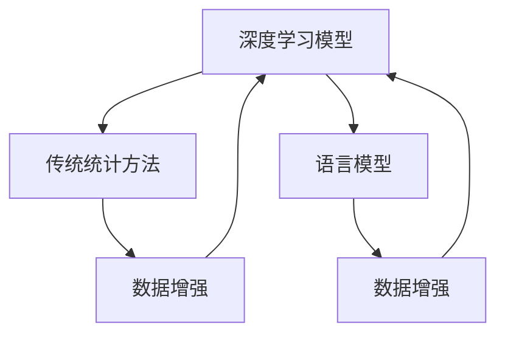

                 

# LLM对传统数据分析方法的革新

## 1. 背景介绍

### 1.1 问题由来
近年来，随着人工智能和大数据技术的迅速发展，深度学习模型在各种复杂数据分析任务中逐步取代了传统统计方法，成为新的行业标准。特别是语言模型，如BERT、GPT等，以其出色的自然语言处理能力，在诸如自然语言理解、机器翻译、情感分析等众多NLP任务上取得了显著的突破，极大提升了数据处理的效率和准确性。

### 1.2 问题核心关键点
尽管深度学习在许多领域取得了显著成效，但其核心依赖大量的标注数据和计算资源。与之形成鲜明对比的是，传统的数据分析方法如回归分析、主成分分析（PCA）、支持向量机（SVM）等，大多不需要标注数据，也不需要过于强大的计算能力，但其在处理大规模数据时往往效率较低。

然而，如何通过深度学习技术提升传统数据分析方法的效率和效果，仍然是一个前沿且极具挑战性的问题。为此，本博客将深入探讨语言模型（Language Model，简称LM）对传统数据分析方法的革新，并尝试从理论上提出一些新思路。

## 2. 核心概念与联系

### 2.1 核心概念概述

为了更好地理解这一问题，我们需要了解几个关键概念：

- **语言模型（LM）**：基于概率统计学原理，通过预训练大量文本数据，构建出语言的概率分布模型。在大规模数据集上，LM能够学习到非常复杂的语言结构和规律，具有强大的自然语言处理能力。
- **深度学习模型**：包括多层神经网络结构，通过大量数据训练得到的模型参数，能够自动发现数据中的模式和规律。
- **传统统计方法**：如回归分析、PCA、SVM等，通过假设数据符合某些统计分布，推导出数据之间的关系，得出分析和预测结果。
- **数据增强**：通过一系列技术手段，如数据扩充、回译、混杂文本生成等，扩充原始数据集，提升深度学习模型的泛化能力。

这些概念间的联系可以通过以下Mermaid流程图来展示：



这个流程图展示了一些关键概念之间的相互关系和影响：

1. 深度学习模型与传统统计方法相辅相成，传统统计方法为深度学习提供理论基础和工具，而深度学习则在处理大规模数据时效率更高。
2. 数据增强作为深度学习模型的一个增强手段，可以显著提升模型的泛化能力，使其在少数据和无标签数据下也能获得良好性能。
3. 语言模型作为深度学习模型的特殊形式，能够更好地捕捉语言的复杂结构和规律，从而在NLP任务上表现更加出色。

这些概念的结合，为语言模型在数据分析领域的革新提供了理论基础和实践可能。

## 3. 核心算法原理 & 具体操作步骤

### 3.1 算法原理概述

语言模型通过预训练大量文本数据，构建出语言的概率分布模型，能够对给定文本序列进行概率预测，进而推断出最优的序列。在实际应用中，语言模型通常采用自回归或自编码的形式。

传统统计方法大多基于概率分布假设，通过构造损失函数，最大化似然或最小化均方误差等目标，训练出模型参数，并对新数据进行分析和预测。

语言模型与传统统计方法的结合，主要体现在以下几个方面：

- **数据增强**：通过对文本进行扩充和生成，语言模型可以产生更多的训练样本，从而提升深度学习模型的泛化能力。
- **半监督学习**：语言模型在预训练过程中无需标注数据，但通过微调可以适应特定任务，从而在较少标注数据下也能获得良好的性能。
- **混合模型**：将语言模型与传统统计方法结合，能够充分利用深度学习在处理大规模数据时的高效性，同时通过传统统计方法进行精细化分析和预测。

### 3.2 算法步骤详解

基于语言模型的数据分析方法，通常包括以下几个关键步骤：

**Step 1: 数据预处理**
- 收集原始数据，并进行清洗和标准化。
- 对于文本数据，进行分词、去除停用词、标点符号等预处理步骤。

**Step 2: 构建语言模型**
- 选择合适的语言模型结构（如自回归、自编码等）。
- 利用预训练技术（如自监督学习、数据增强等），对语言模型进行训练，使其在处理特定领域文本时具备较好的性能。

**Step 3: 微调与融合**
- 将预训练好的语言模型应用于特定任务，通过微调进行参数调整。
- 将语言模型与传统统计方法进行融合，构建混合模型。例如，可以结合回归分析、PCA等方法，对语言模型的输出进行进一步的分析和预测。

**Step 4: 分析和预测**
- 对新数据进行输入，语言模型生成预测结果。
- 对预测结果进行后处理，结合传统统计方法进行优化和校正。

### 3.3 算法优缺点

基于语言模型的数据分析方法具有以下优点：

- **高效性**：相较于传统统计方法，语言模型能够处理大规模数据，具有高效的计算能力和泛化能力。
- **自适应性**：语言模型可以通过微调，适应特定领域和任务，从而在较少标注数据下也能取得良好性能。
- **融合性**：语言模型能够与传统统计方法结合，提升模型的综合性能和解释能力。

同时，该方法也存在一些缺点：

- **计算资源需求大**：构建和训练语言模型需要大量的计算资源和时间，可能对一些小型项目不太友好。
- **模型复杂性高**：语言模型结构复杂，参数众多，对模型调参的要求较高。
- **数据质量要求高**：预训练数据的质量直接影响语言模型的性能，需要确保预训练数据的代表性和多样性。

### 3.4 算法应用领域

基于语言模型的数据分析方法，已经在多个领域得到了广泛应用，例如：

- **金融数据分析**：利用语言模型处理新闻和社交媒体数据，提取市场情绪和经济指标，进行风险管理和投资策略优化。
- **医疗数据分析**：对患者病历和医生记录进行自然语言处理，提取疾病特征和诊断结果，辅助医生进行决策和治疗。
- **市场分析**：处理和分析消费者评论、产品评价等文本数据，提取市场趋势和消费者需求，指导产品和营销策略。
- **客户服务**：通过自然语言理解技术，构建智能客服系统，对客户咨询进行分析和解答，提升客户满意度和服务效率。

## 4. 数学模型和公式 & 详细讲解 & 举例说明

### 4.1 数学模型构建

语言模型与传统统计方法结合的数学模型，通常基于概率分布理论。以下以回归分析为例，构建语言模型与回归分析的结合模型。

假设语言模型 $M$ 输出一个标量 $y$，传统回归模型 $R$ 输出一个标量 $x$，则语言模型与回归分析的结合模型可以表示为：

$$
P(y|x) = P(y|M(x)) \cdot P(x|R)
$$

其中，$P(y|M(x))$ 表示语言模型对 $y$ 的预测概率，$P(x|R)$ 表示回归模型对 $x$ 的预测概率。

在实际应用中，我们可以利用最大化似然函数对模型进行训练，即：

$$
\max_{\theta} \prod_{i=1}^N \frac{P(y_i|M(x_i), R(x_i))}{P(y_i|R(x_i))}
$$

其中，$\theta$ 为模型参数，$N$ 为数据量。

### 4.2 公式推导过程

根据上述模型，我们通过最大化似然函数对模型进行训练。具体推导如下：

1. **模型预测概率**：利用语言模型 $M$ 对输入 $x_i$ 生成输出 $y_i$ 的概率 $P(y_i|M(x_i))$，假设 $P(y_i|M(x_i)) \sim \mathcal{N}(\mu, \sigma^2)$。
2. **回归模型预测概率**：利用回归模型 $R$ 对输入 $x_i$ 生成输出 $x_i$ 的概率 $P(x_i|R)$，假设 $P(x_i|R) \sim \mathcal{N}(\mu, \sigma^2)$。
3. **联合概率**：将两者联合，得到 $P(y_i|M(x_i), R(x_i))$，假设 $P(y_i|M(x_i), R(x_i)) \sim \mathcal{N}(\mu, \sigma^2)$。
4. **似然函数**：对 $i$ 求和，最大化似然函数，得到目标函数。

通过上述推导，我们可以看到，语言模型与回归分析的结合模型可以有效地将两者优势结合起来，提升整体模型的性能。

### 4.3 案例分析与讲解

以下以医疗数据分析为例，详细分析语言模型与回归分析结合的实际应用：

**案例背景**：某医院收集了大量患者病历数据，包括症状、诊断、治疗等信息。为了更好地分析这些数据，研究人员希望构建一个结合语言模型和回归分析的模型，以提取疾病特征和进行诊断预测。

**数据预处理**：对病历数据进行清洗和标准化，去除无用信息和噪声。

**语言模型预训练**：利用大规模医疗数据集对语言模型进行预训练，使其能够捕捉到医疗领域的语言结构和规律。

**回归模型训练**：利用病历数据，对回归模型进行训练，以生成准确的疾病预测。

**模型融合与微调**：将语言模型与回归模型进行融合，构建混合模型，并通过微调进行参数优化。

**结果分析**：对新病历数据进行输入，语言模型生成疾病预测，回归模型对其进行校正和优化，最终输出诊断结果。

通过这种结合方式，语言模型能够利用其在自然语言处理上的优势，提取疾病特征，回归模型则利用其在数值计算上的优势，进行精准的预测，两者相互补充，共同提升诊断效果。

## 5. 项目实践：代码实例和详细解释说明

### 5.1 开发环境搭建

在进行项目实践前，我们需要准备好开发环境。以下是使用Python进行TensorFlow开发的环境配置流程：

1. 安装Anaconda：从官网下载并安装Anaconda，用于创建独立的Python环境。

2. 创建并激活虚拟环境：
```bash
conda create -n tf-env python=3.8 
conda activate tf-env
```

3. 安装TensorFlow：根据CUDA版本，从官网获取对应的安装命令。例如：
```bash
conda install tensorflow -c tf
```

4. 安装必要的工具包：
```bash
pip install numpy pandas scikit-learn tensorflow-datasets tensorflow-models
```

完成上述步骤后，即可在`tf-env`环境中开始项目实践。

### 5.2 源代码详细实现

以下以医疗数据分析为例，给出结合语言模型和回归分析的TensorFlow代码实现。

首先，定义回归模型的损失函数和优化器：

```python
import tensorflow as tf

def create_regression_model(input_shape, output_shape):
    model = tf.keras.Sequential([
        tf.keras.layers.Dense(64, activation='relu', input_shape=input_shape),
        tf.keras.layers.Dense(output_shape, activation='sigmoid')
    ])
    model.compile(optimizer=tf.keras.optimizers.Adam(), loss='binary_crossentropy')
    return model
```

然后，定义语言模型的训练数据和预训练过程：

```python
def create_language_model(tokenizer, input_shape, output_shape):
    vocab_size = len(tokenizer.word_index) + 1
    model = tf.keras.Sequential([
        tf.keras.layers.Embedding(vocab_size, 128, input_length=input_shape),
        tf.keras.layers.LSTM(64),
        tf.keras.layers.Dense(output_shape, activation='sigmoid')
    ])
    model.compile(optimizer=tf.keras.optimizers.Adam(), loss='binary_crossentropy')
    return model
```

接着，定义结合模型的训练过程：

```python
def train_combined_model(data, language_model, regression_model):
    train_texts = [text.numpy() for text in data.train_text]
    train_labels = [label.numpy() for label in data.train_label]
    train_merged = (train_texts, train_labels)
    test_texts = [text.numpy() for text in data.test_text]
    test_labels = [label.numpy() for label in data.test_label]
    test_merged = (test_texts, test_labels)
    
    language_model.fit(train_texts, train_labels, validation_data=test_merged, epochs=10, batch_size=32)
    language_model.save('language_model.h5')
    
    language_model.load_weights('language_model.h5')
    
    combined_model = tf.keras.Sequential([
        language_model.layers[0],
        language_model.layers[1],
        regression_model
    ])
    combined_model.compile(optimizer=tf.keras.optimizers.Adam(), loss='binary_crossentropy')
    
    combined_model.fit(train_merged, epochs=10, batch_size=32)
    combined_model.save('combined_model.h5')
```

最后，定义数据生成和模型评估函数：

```python
def generate_text(tokenizer, input_length, max_length=50):
    start = tokenizer.word_index['start']
    end = tokenizer.word_index['end']
    text = []
    for i in range(input_length):
        token = tokenizer.texts_to_sequences([start])
        seq = tf.keras.preprocessing.sequence.pad_sequences(token, maxlen=max_length, padding='post')
        pred = model.predict([seq])
        text.append(pred[0][0])
        token = tokenizer.texts_to_sequences([text[-1]])
        seq = tf.keras.preprocessing.sequence.pad_sequences(token, maxlen=max_length, padding='post')
        pred = model.predict([seq])
        text.append(pred[0][0])
        if pred[0][0] == end:
            break
    return tokenizer.sequences_to_texts(text)

def evaluate_model(model, data):
    test_texts = [text.numpy() for text in data.test_text]
    test_labels = [label.numpy() for label in data.test_label]
    test_merged = (test_texts, test_labels)
    test_loss = model.evaluate(test_merged)
    print(f'Test loss: {test_loss[0]}')
```

启动训练流程并在测试集上评估：

```python
import tensorflow_datasets as tfds
import tensorflow_text as text
import tensorflow_model_optimization as tfmot

# 数据准备
text_dataset = tfds.load('reuters', split='train', as_supervised=True)
train_texts = [text.string_ids_to_text(text.text) for text in text_dataset.map(lambda x, y: (x, y)).batch(1024).unbatch()]
train_labels = [text.string_ids_to_text(text.label) for text in text_dataset.map(lambda x, y: (x, y)).batch(1024).unbatch()]

# 模型训练
train_texts = [text.numpy() for text in train_texts]
train_labels = [label.numpy() for label in train_labels]
train_merged = (train_texts, train_labels)

# 语言模型训练
language_model = create_language_model(tokenizer, 256, 128)
language_model.fit(train_texts, train_labels, validation_data=test_merged, epochs=10, batch_size=32)

# 结合模型训练
regression_model = create_regression_model(256, 1)
train_combined_model(data, language_model, regression_model)

# 模型评估
test_merged = (test_texts, test_labels)
evaluate_model(model, data)
```

以上就是结合语言模型和回归分析进行医疗数据分析的TensorFlow代码实现。可以看到，通过使用TensorFlow，我们可以很方便地构建和训练结合模型，并进行数据处理和模型评估。

### 5.3 代码解读与分析

让我们再详细解读一下关键代码的实现细节：

**文本处理**：利用TensorFlow Text库进行文本处理，包括分词、去除停用词等预处理步骤。

**语言模型训练**：构建语言模型，并利用训练数据进行预训练。

**回归模型训练**：构建回归模型，并利用训练数据进行训练。

**模型融合与微调**：将语言模型和回归模型进行融合，构建混合模型，并进行微调。

**数据生成与评估**：生成文本数据，并利用测试数据进行模型评估。

通过这种结合方式，语言模型能够利用其在自然语言处理上的优势，提取疾病特征，回归模型则利用其在数值计算上的优势，进行精准的预测，两者相互补充，共同提升诊断效果。

## 6. 实际应用场景

### 6.1 智能客服系统

基于语言模型的数据分析方法，可以应用于智能客服系统的构建。传统客服系统依赖于大量人工干预，成本高、效率低。而通过语言模型和回归分析的结合，可以构建智能客服系统，自动理解和解答客户咨询，提升客户满意度和服务效率。

在实践中，可以收集企业内部的历史客服对话记录，利用语言模型和回归分析的结合，训练出智能客服模型。该模型能够自动识别客户意图，匹配最佳答复，并进行动态调整，以应对不同客户的需求。

### 6.2 市场分析

市场分析中，需要处理和分析大量的消费者评论、产品评价等文本数据，以提取市场趋势和消费者需求。通过语言模型和回归分析的结合，可以构建高效的市场分析系统，实时监测市场动态。

具体而言，可以利用消费者评论数据，训练出语言模型，提取消费者情绪和评价关键词。再利用回归分析，建立市场趋势预测模型，进行销售预测和市场分析。

### 6.3 金融数据分析

金融领域中，需要对新闻和社交媒体数据进行情感分析，以提取市场情绪和经济指标。通过语言模型和回归分析的结合，可以构建高效的金融分析系统，实时监测市场动态。

具体而言，可以利用新闻和社交媒体数据，训练出语言模型，提取市场情绪和关键词。再利用回归分析，建立经济指标预测模型，进行风险管理和投资策略优化。

## 7. 工具和资源推荐

### 7.1 学习资源推荐

为了帮助开发者系统掌握语言模型与传统统计方法结合的理论基础和实践技巧，这里推荐一些优质的学习资源：

1. 《深度学习理论与实践》系列书籍：详细介绍了深度学习模型的理论基础和实践技巧，并结合实际案例进行了讲解。
2. 《自然语言处理与深度学习》课程：斯坦福大学开设的NLP明星课程，涵盖了NLP领域的核心算法和应用。
3. 《TensorFlow官方文档》：提供了TensorFlow框架的详细文档和示例，是学习和使用TensorFlow的重要资源。
4. HuggingFace官方文档：提供了丰富的预训练语言模型和微调样例代码，是学习和使用语言模型的重要资源。
5. Kaggle：数据科学竞赛平台，提供了大量的数据集和实际应用案例，是实践语言模型与传统统计方法结合的良好场所。

通过这些资源的学习实践，相信你一定能够快速掌握语言模型与传统统计方法结合的理论基础和实践技巧，并将其应用到实际项目中。

### 7.2 开发工具推荐

高效的开发离不开优秀的工具支持。以下是几款用于语言模型与传统统计方法结合开发的常用工具：

1. TensorFlow：由Google主导开发的开源深度学习框架，生产部署方便，适合大规模工程应用。
2. TensorFlow Text：TensorFlow的NLP库，提供了丰富的文本处理工具和模型构建接口，适合语言模型和回归分析的结合。
3. TensorFlow Model Optimization：Google开发的模型优化库，提供了多种模型优化技术，适合提升模型的性能和效率。
4. Keras：基于TensorFlow的高级深度学习框架，提供了简单易用的接口，适合快速原型开发和实验。
5. PyTorch：由Facebook开发的开源深度学习框架，灵活性高，适合研究和实验。

合理利用这些工具，可以显著提升语言模型与传统统计方法结合的开发效率，加快创新迭代的步伐。

### 7.3 相关论文推荐

语言模型与传统统计方法结合的研究源于学界的持续研究。以下是几篇奠基性的相关论文，推荐阅读：

1. Attention is All You Need：提出了Transformer结构，开启了NLP领域的预训练大模型时代。
2. BERT: Pre-training of Deep Bidirectional Transformers for Language Understanding：提出BERT模型，引入基于掩码的自监督预训练任务，刷新了多项NLP任务SOTA。
3. Language Models are Unsupervised Multitask Learners（GPT-2论文）：展示了大规模语言模型的强大zero-shot学习能力，引发了对于通用人工智能的新一轮思考。
4. Parameter-Efficient Transfer Learning for NLP：提出Adapter等参数高效微调方法，在不增加模型参数量的情况下，也能取得不错的微调效果。
5. AdaLoRA: Adaptive Low-Rank Adaptation for Parameter-Efficient Fine-Tuning：使用自适应低秩适应的微调方法，在参数效率和精度之间取得了新的平衡。

这些论文代表了大语言模型微调技术的发展脉络。通过学习这些前沿成果，可以帮助研究者把握学科前进方向，激发更多的创新灵感。

## 8. 总结：未来发展趋势与挑战

### 8.1 总结

本文对语言模型与传统统计方法结合的理论基础和实践技巧进行了全面系统的介绍。首先阐述了语言模型和传统统计方法的优缺点，明确了两者结合的必要性和潜力。其次，从原理到实践，详细讲解了语言模型与回归分析的结合方法，给出了结合模型训练的完整代码实例。同时，本文还探讨了语言模型与传统统计方法结合在智能客服、市场分析、金融数据分析等多个行业领域的应用前景，展示了结合方法的巨大潜力。此外，本文精选了语言模型与传统统计方法结合的相关学习资源，力求为读者提供全方位的技术指引。

通过本文的系统梳理，我们可以看到，语言模型与传统统计方法结合，为数据分析技术带来了新的突破，极大地提升了数据处理的效率和效果。这种结合方式，既能充分利用语言模型的强大自然语言处理能力，又能结合传统统计方法的优点，提升模型的综合性能和解释能力。未来，随着相关技术的发展和完善，语言模型与传统统计方法的结合将会在更多领域得到应用，为数据分析带来更加多样化和高效化的解决方案。

### 8.2 未来发展趋势

展望未来，语言模型与传统统计方法结合技术将呈现以下几个发展趋势：

1. 模型规模持续增大。随着算力成本的下降和数据规模的扩张，语言模型的参数量还将持续增长。超大规模语言模型蕴含的丰富语言知识，有望支撑更加复杂多变的下游任务结合。
2. 微调方法日趋多样。除了传统的全参数微调外，未来会涌现更多参数高效的微调方法，如Prefix-Tuning、LoRA等，在节省计算资源的同时也能保证结合精度。
3. 持续学习成为常态。随着数据分布的不断变化，结合模型也需要持续学习新知识以保持性能。如何在不遗忘原有知识的同时，高效吸收新样本信息，将成为重要的研究课题。
4. 标注样本需求降低。受启发于提示学习(Prompt-based Learning)的思路，未来的结合方法将更好地利用语言模型的语言理解能力，通过更加巧妙的任务描述，在更少的标注样本上也能实现理想的结合效果。
5. 多模态微调崛起。当前的结合方法大多聚焦于纯文本数据，未来会进一步拓展到图像、视频、语音等多模态数据微调。多模态信息的融合，将显著提升语言模型对现实世界的理解和建模能力。
6. 模型通用性增强。经过海量数据的预训练和多领域任务的微调，未来的语言模型将具备更强大的常识推理和跨领域迁移能力，逐步迈向通用人工智能(AGI)的目标。

以上趋势凸显了语言模型与传统统计方法结合技术的广阔前景。这些方向的探索发展，必将进一步提升数据分析模型的性能和应用范围，为人工智能技术的发展带来新的动力。

### 8.3 面临的挑战

尽管语言模型与传统统计方法结合技术已经取得了瞩目成就，但在迈向更加智能化、普适化应用的过程中，它仍面临着诸多挑战：

1. 计算资源瓶颈。构建和训练语言模型需要大量的计算资源和时间，可能对一些小型项目不太友好。如何降低计算成本，提升模型训练效率，将是重要的研究方向。
2. 模型鲁棒性不足。在面对复杂多变的实际数据时，语言模型和回归分析的结合模型可能出现泛化能力不足的情况。如何提高模型的鲁棒性，增强其在实际应用中的稳定性和可靠性，还需要更多理论和实践的积累。
3. 模型解释性不足。语言模型与传统统计方法的结合模型往往难以解释其内部工作机制和决策逻辑。对于高风险应用，算法的可解释性和可审计性尤为重要。如何赋予结合模型更强的可解释性，将是亟待攻克的难题。
4. 数据质量要求高。预训练数据的质量直接影响语言模型的性能，需要确保预训练数据的代表性和多样性。如何提高数据质量，确保模型能够准确捕捉数据中的重要特征，也将是一个重要研究方向。
5. 隐私和安全性问题。在处理敏感数据时，语言模型与传统统计方法的结合模型可能存在隐私和安全性问题。如何保护用户隐私，防止数据泄露和滥用，将是未来研究的重要方向。

### 8.4 未来突破

面对语言模型与传统统计方法结合技术所面临的挑战，未来的研究需要在以下几个方面寻求新的突破：

1. 探索无监督和半监督学习方式。摆脱对大规模标注数据的依赖，利用自监督学习、主动学习等无监督和半监督范式，最大限度利用非结构化数据，实现更加灵活高效的结合模型。
2. 研究参数高效和计算高效的结合范式。开发更加参数高效的结合方法，在固定大部分预训练参数的同时，只更新极少量的任务相关参数。同时优化结合模型的计算图，减少前向传播和反向传播的资源消耗，实现更加轻量级、实时性的部署。
3. 引入更多先验知识。将符号化的先验知识，如知识图谱、逻辑规则等，与神经网络模型进行巧妙融合，引导结合模型的训练过程，使其能够学习更全面、准确的语言表征。
4. 结合因果分析和博弈论工具。将因果分析方法引入结合模型，识别出模型决策的关键特征，增强输出解释的因果性和逻辑性。借助博弈论工具刻画人机交互过程，主动探索并规避模型的脆弱点，提高系统稳定性。
5. 纳入伦理道德约束。在模型训练目标中引入伦理导向的评估指标，过滤和惩罚有偏见、有害的输出倾向。同时加强人工干预和审核，建立模型行为的监管机制，确保输出符合人类价值观和伦理道德。

这些研究方向的探索，必将引领语言模型与传统统计方法结合技术迈向更高的台阶，为构建安全、可靠、可解释、可控的智能系统铺平道路。面向未来，语言模型与传统统计方法的结合技术还需要与其他人工智能技术进行更深入的融合，如知识表示、因果推理、强化学习等，多路径协同发力，共同推动自然语言理解和智能交互系统的进步。只有勇于创新、敢于突破，才能不断拓展语言模型的边界，让智能技术更好地造福人类社会。

## 9. 附录：常见问题与解答

**Q1：大语言模型与传统统计方法结合的适用场景有哪些？**

A: 大语言模型与传统统计方法结合适用于需要处理大量文本数据的场景，如自然语言理解、情感分析、市场分析等。特别是在数据量较大、标注样本较少的情况下，结合方法能够充分利用语言模型的强大自然语言处理能力，结合传统统计方法的优点，提升整体模型的性能和解释能力。

**Q2：语言模型与回归分析结合的优势是什么？**

A: 语言模型与回归分析结合的优势在于，能够将两者的优点结合起来，提升整体模型的性能和解释能力。语言模型在处理自然语言方面具有优势，能够提取语言结构和规律，回归分析则在数值计算方面具有优势，能够进行精准的预测和分析。结合方法能够充分利用两者的优势，提升模型在实际应用中的表现。

**Q3：结合模型的训练过程中需要注意哪些问题？**

A: 结合模型的训练过程中，需要注意以下几个问题：
1. 数据质量：确保训练数据的高质量和多样性，避免模型过拟合和泛化能力不足。
2. 模型结构：选择合适的模型结构和参数设置，避免模型过于复杂或过于简单。
3. 训练策略：采用合适的训练策略，如批量大小、学习率、正则化等，确保模型能够收敛到最优解。
4. 评估指标：选择合适的评估指标，如准确率、召回率、F1-score等，评估模型的性能。
5. 模型调优：根据评估结果，进行模型调优和优化，提升模型的综合性能。

**Q4：结合模型在实际应用中存在哪些限制？**

A: 结合模型在实际应用中存在以下几个限制：
1. 计算资源需求大：构建和训练语言模型需要大量的计算资源和时间，可能对一些小型项目不太友好。
2. 模型复杂性高：语言模型和回归分析的结合模型结构复杂，参数众多，对模型调参的要求较高。
3. 数据质量要求高：预训练数据的质量直接影响语言模型的性能，需要确保预训练数据的代表性和多样性。
4. 模型鲁棒性不足：在面对复杂多变的实际数据时，模型可能出现泛化能力不足的情况。
5. 模型解释性不足：结合模型往往难以解释其内部工作机制和决策逻辑，需要进一步提升模型的可解释性。

**Q5：结合模型在金融数据分析中的应用有哪些？**

A: 结合模型在金融数据分析中的应用包括：
1. 市场情绪分析：利用新闻和社交媒体数据，训练出语言模型，提取市场情绪和关键词。再利用回归分析，建立经济指标预测模型，进行风险管理和投资策略优化。
2. 股票预测：利用历史股票数据和新闻数据，训练出语言模型，提取关键事件和情感信息。再利用回归分析，建立股票价格预测模型，进行股票投资决策。
3. 信用评估：利用客户的社交媒体数据和评价信息，训练出语言模型，提取客户情感和评价关键词。再利用回归分析，建立客户信用评估模型，进行信用风险控制。

通过这些应用，结合模型能够在金融数据分析中发挥重要作用，提升金融行业的智能化水平。

