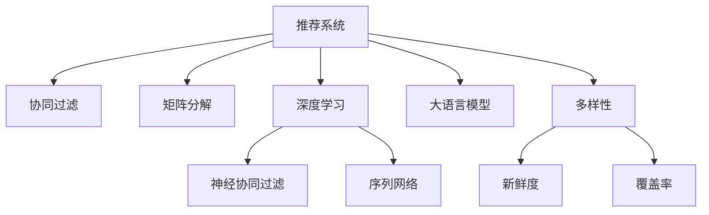

                 

# LLM对推荐系统多样性的提升

> 关键词：大语言模型,推荐系统,多样性,推荐算法,协同过滤,深度学习

## 1. 背景介绍

### 1.1 问题由来
在电子商务、视频流媒体、新闻阅读等众多应用场景中，推荐系统已经成为用户获取个性化信息的重要工具。推荐系统通过分析用户的历史行为和兴趣爱好，预测用户可能感兴趣的内容，从而提升用户满意度和留存率。然而，随着用户量的不断增长和信息量的指数级膨胀，传统推荐算法难以应对新用户、新数据、新场景的挑战，导致推荐结果同质化严重、多样性不足。

### 1.2 问题核心关键点
推荐系统的多样性不足问题，具体表现有：
- 推荐结果集中：用户只能接触到部分相似内容，难以全面了解不同领域的信息。
- 个性化过度：用户只能接触到符合自己固有偏好的内容，难以发现新的兴趣。
- 内容垄断：部分热门内容过度集中，长尾内容难以曝光。

导致这些问题的根本原因在于：推荐算法过于依赖历史行为数据，难以灵活应对多变的信息环境和个性化的需求。如何提升推荐系统的多样性，成为当前研究的热点和难点问题。

## 2. 核心概念与联系

### 2.1 核心概念概述

为更好地理解大语言模型在推荐系统中提升多样性的方法，本节将介绍几个密切相关的核心概念：

- 推荐系统(Recommendation System, RS)：通过分析用户行为和内容属性，预测用户可能感兴趣的内容，并提供个性化推荐。常见的推荐算法包括协同过滤、矩阵分解、深度学习等。

- 大语言模型(Large Language Model, LLM)：以自回归(如GPT)或自编码(如BERT)模型为代表的大规模预训练语言模型。通过在海量无标签文本语料上进行预训练，学习通用的语言表示，具备强大的语言理解和生成能力。

- 协同过滤(Collaborative Filtering, CF)：一种常见的推荐算法，通过分析用户与内容的交互历史，预测用户可能感兴趣的内容。包括基于用户的协同过滤和基于内容的协同过滤。

- 矩阵分解(Matrix Factorization, MF)：另一种常见的推荐算法，将用户与内容的交互历史表示为矩阵形式，通过分解矩阵得到用户和内容的低维表示，实现预测推荐。

- 深度学习(Deep Learning)：一种以神经网络为核心的机器学习算法，适用于推荐系统中的高维、稀疏数据处理。常用的深度学习推荐模型有神经协同过滤、序列网络等。

- 多样性(Diversity)：推荐系统中多样性不足的问题，即推荐结果过于集中，难以覆盖用户不同的兴趣和偏好。

- 新鲜度(Recency)：推荐系统中新鲜度不足的问题，即推荐结果中大部分是旧数据，无法反映最新的信息。

- 覆盖率(Coverage)：推荐系统中覆盖率不足的问题，即推荐结果无法覆盖用户未见过的内容，导致用户接触面过窄。

这些核心概念之间的逻辑关系可以通过以下Mermaid流程图来展示：



这个流程图展示了大语言模型在推荐系统中的作用及其与相关概念的关系：

1. 推荐系统通过协同过滤、矩阵分解、深度学习等算法，对用户行为和内容进行建模。
2. 协同过滤、矩阵分解、深度学习算法各有优缺点，适用于不同场景。
3. 大语言模型可以作为推荐系统的补充，提升推荐结果的多样性、新鲜度和覆盖率。
4. 多样性、新鲜度和覆盖率是推荐系统需要优化的关键指标。

## 3. 核心算法原理 & 具体操作步骤
### 3.1 算法原理概述

大语言模型在推荐系统中提升多样性的原理，本质上是利用模型的语言理解能力，挖掘用户潜在的兴趣和需求，从而在推荐结果中引入更多不同的内容。具体来说，通过以下三个步骤：

1. 预训练：在大规模无标签文本语料上进行预训练，学习通用的语言表示。
2. 微调：在推荐系统数据集上进行微调，学习特定用户和内容的语言表示。
3. 融合：将预训练模型与推荐算法结合，通过改进推荐结果生成方式，增强多样性。

### 3.2 算法步骤详解

基于大语言模型的推荐系统多样性提升方法，主要包括以下几个关键步骤：

**Step 1: 准备数据和模型**

- 收集推荐系统相关的数据集，包括用户行为数据、商品属性数据、文本描述数据等。
- 选择合适的预训练语言模型，如BERT、GPT等，作为初始化参数。
- 准备标注数据，用于微调模型的语言表示。

**Step 2: 添加语言表示模块**

- 在推荐算法中引入语言表示模块，用于编码用户和内容的语言特征。
- 例如，可以在协同过滤或矩阵分解的基础上，使用预训练语言模型提取用户和内容的语言特征，再计算相似度或进行线性回归。
- 对于深度学习推荐模型，可以结合语言表示模块，改进模型的输入和输出设计。

**Step 3: 执行微调**

- 使用推荐系统数据集对预训练模型进行微调，学习特定用户和内容的语言表示。
- 微调目标通常包括提升多样性、新鲜度和覆盖率。
- 可以采用正则化技术，防止模型过拟合。
- 可以采用对抗训练，提高模型的鲁棒性。

**Step 4: 测试和优化**

- 在测试集上评估微调后模型的性能，对比微调前后的多样性指标。
- 持续收集新的数据，定期重新微调模型，以适应数据分布的变化。

### 3.3 算法优缺点

基于大语言模型的推荐系统多样性提升方法，具有以下优点：

1. 多样性提升：大语言模型可以挖掘用户潜在的兴趣，推荐更多不同种类的内容，提高推荐结果的多样性。
2. 泛化能力强：预训练模型学习到了通用的语言表示，可以应对不同的用户和内容。
3. 自动化程度高：微调过程可以通过自动化工具实现，不需要手动调整参数。

同时，该方法也存在一定的局限性：

1. 数据需求高：微调需要大量的标注数据，可能难以在数据稀缺的情况下进行。
2. 模型复杂度高：大语言模型通常包含大量的参数，增加了推荐系统的计算复杂度。
3. 训练成本高：微调过程需要大量的时间和计算资源，可能难以快速部署。

尽管存在这些局限性，但基于大语言模型的推荐方法在提升推荐结果的多样性、新鲜度和覆盖率方面，已经展示出巨大的潜力。

### 3.4 算法应用领域

基于大语言模型的推荐系统多样性提升方法，已经在电子商务、新闻阅读、视频流媒体等多个领域得到应用，为提升推荐系统性能提供了新思路。

- 电子商务推荐：如京东、淘宝等电商平台，通过大语言模型挖掘用户潜在的购物兴趣，推荐更多不同种类的商品。
- 新闻阅读推荐：如今日头条、腾讯新闻等应用，通过大语言模型提取用户对不同主题的偏好，推荐更多不同的新闻内容。
- 视频流媒体推荐：如Netflix、Bilibili等平台，通过大语言模型提取用户对不同内容的兴趣，推荐更多不同种类的视频。

除了上述这些经典应用外，大语言模型还被创新性地应用到更多场景中，如智能家居、智能助手、智慧出行等，为推荐系统带来了全新的突破。随着大语言模型的不断进步，相信推荐系统将能够更好地理解用户需求，提升推荐结果的多样性和个性化水平。

## 4. 数学模型和公式 & 详细讲解  
### 4.1 数学模型构建

本节将使用数学语言对基于大语言模型的推荐系统多样性提升方法进行更加严格的刻画。

记推荐系统为 $R=\{u, i, r\}$，其中 $u$ 为用户集合，$i$ 为商品集合，$r_{ui}$ 为 $u$ 对 $i$ 的评分，$r_{ui} \in \{1,2,...,N\}$，其中 $N$ 为评分范围。记大语言模型为 $LM_{\theta}$，其中 $\theta$ 为模型参数。

定义用户 $u$ 的语言表示为 $vec(u)$，商品 $i$ 的语言表示为 $vec(i)$，推荐系统数据集为 $D=\{(u_i, i_j, r_{uij})\}_{i,j=1}^M$，其中 $u_i \in u$，$i_j \in i$，$r_{uij} \in r_{ui}$。

推荐系统的目标是通过模型 $f(u_i,i_j;\theta)$ 预测用户 $u_i$ 对商品 $i_j$ 的评分，最小化预测评分与真实评分之间的误差。推荐算法包括协同过滤、矩阵分解、深度学习等。

### 4.2 公式推导过程

以下是协同过滤算法与大语言模型结合的推荐公式：

协同过滤算法基于用户之间的相似度，可以表示为：
$$
\hat{r}_{uij} = \alpha f(u_i,i_j;\theta) + (1-\alpha) \sum_{k \in \mathcal{N}(u_i)} r_{ukj}
$$

其中 $\alpha$ 为加权系数，$\mathcal{N}(u_i)$ 为与用户 $u_i$ 相似的用户集合，$r_{ukj}$ 为这些用户的评分，$f(u_i,i_j;\theta)$ 为预训练语言模型的评分预测函数。

设预训练语言模型的输出为 $vec(u_i)$ 和 $vec(i_j)$，则有：
$$
f(u_i,i_j;\theta) = \theta^T \phi(vec(u_i),vec(i_j))
$$

其中 $\phi(vec(u_i),vec(i_j))$ 为预训练语言模型的特征映射函数。

根据损失函数最小化准则，协同过滤算法可进一步表示为：
$$
\mathcal{L}(R,LM_{\theta}) = \sum_{i,j} \frac{1}{2} (r_{uij} - \hat{r}_{uij})^2
$$

通过反向传播算法，可以求得模型 $LM_{\theta}$ 的参数更新公式：
$$
\theta \leftarrow \theta - \eta \nabla_{\theta}\mathcal{L}(R,LM_{\theta})
$$

其中 $\eta$ 为学习率。

### 4.3 案例分析与讲解

以协同过滤算法为例，对大语言模型与推荐系统结合的推荐过程进行案例分析：

假设 $u_i$ 对商品 $i_j$ 的真实评分为 $r_{uij}=3$，则协同过滤算法预测的评分 $\hat{r}_{uij}$ 为：
$$
\hat{r}_{uij} = \alpha f(u_i,i_j;\theta) + (1-\alpha) \sum_{k \in \mathcal{N}(u_i)} r_{ukj}
$$

设 $u_i$ 与 $u_k$ 相似度为 $s_{ik}$，则有：
$$
\hat{r}_{uij} = \alpha \theta^T \phi(vec(u_i),vec(i_j)) + (1-\alpha) \sum_{k \in \mathcal{N}(u_i)} r_{ukj}
$$

其中 $\phi(vec(u_i),vec(i_j))$ 为预训练语言模型的特征映射函数。

在实际应用中，通常使用BERT、GPT等预训练语言模型，将用户和商品的文本描述输入模型，计算其语言表示向量 $vec(u_i)$ 和 $vec(i_j)$。然后，利用这些向量计算用户间的相似度 $s_{ik}$，结合历史评分 $r_{ukj}$，得到最终预测评分 $\hat{r}_{uij}$。

通过这种方式，大语言模型可以引入更多的语言信息，提升推荐结果的多样性和准确性。

## 5. 项目实践：代码实例和详细解释说明
### 5.1 开发环境搭建

在进行推荐系统多样性提升的微调实践前，我们需要准备好开发环境。以下是使用Python进行PyTorch开发的环境配置流程：

1. 安装Anaconda：从官网下载并安装Anaconda，用于创建独立的Python环境。

2. 创建并激活虚拟环境：
```bash
conda create -n pytorch-env python=3.8 
conda activate pytorch-env
```

3. 安装PyTorch：根据CUDA版本，从官网获取对应的安装命令。例如：
```bash
conda install pytorch torchvision torchaudio cudatoolkit=11.1 -c pytorch -c conda-forge
```

4. 安装Transformers库：
```bash
pip install transformers
```

5. 安装各类工具包：
```bash
pip install numpy pandas scikit-learn matplotlib tqdm jupyter notebook ipython
```

完成上述步骤后，即可在`pytorch-env`环境中开始推荐系统多样性提升的微调实践。

### 5.2 源代码详细实现

这里我们以协同过滤算法为例，使用PyTorch和BERT模型进行推荐系统多样性提升的代码实现。

首先，定义推荐系统的训练数据和测试数据：

```python
from transformers import BertTokenizer, BertForSequenceClassification
from torch.utils.data import Dataset, DataLoader

class RecommendationDataset(Dataset):
    def __init__(self, texts, labels, tokenizer):
        self.texts = texts
        self.labels = labels
        self.tokenizer = tokenizer
        
    def __len__(self):
        return len(self.texts)
    
    def __getitem__(self, item):
        text = self.texts[item]
        label = self.labels[item]
        
        encoding = self.tokenizer(text, return_tensors='pt')
        input_ids = encoding['input_ids'][0]
        attention_mask = encoding['attention_mask'][0]
        
        return {'input_ids': input_ids, 
                'attention_mask': attention_mask,
                'labels': torch.tensor(label, dtype=torch.long)}
```

然后，定义模型和优化器：

```python
from transformers import BertForSequenceClassification, AdamW
from transformers import AutoTokenizer

model = BertForSequenceClassification.from_pretrained('bert-base-cased', num_labels=5)
tokenizer = AutoTokenizer.from_pretrained('bert-base-cased')
optimizer = AdamW(model.parameters(), lr=2e-5)
```

接着，定义训练和评估函数：

```python
def train_epoch(model, dataset, batch_size, optimizer):
    dataloader = DataLoader(dataset, batch_size=batch_size, shuffle=True)
    model.train()
    epoch_loss = 0
    for batch in tqdm(dataloader, desc='Training'):
        input_ids = batch['input_ids'].to(device)
        attention_mask = batch['attention_mask'].to(device)
        labels = batch['labels'].to(device)
        model.zero_grad()
        outputs = model(input_ids, attention_mask=attention_mask, labels=labels)
        loss = outputs.loss
        epoch_loss += loss.item()
        loss.backward()
        optimizer.step()
    return epoch_loss / len(dataloader)

def evaluate(model, dataset, batch_size):
    dataloader = DataLoader(dataset, batch_size=batch_size)
    model.eval()
    preds, labels = [], []
    with torch.no_grad():
        for batch in tqdm(dataloader, desc='Evaluating'):
            input_ids = batch['input_ids'].to(device)
            attention_mask = batch['attention_mask'].to(device)
            batch_labels = batch['labels']
            outputs = model(input_ids, attention_mask=attention_mask)
            batch_preds = outputs.logits.argmax(dim=2).to('cpu').tolist()
            batch_labels = batch_labels.to('cpu').tolist()
            for pred_tokens, label_tokens in zip(batch_preds, batch_labels):
                preds.append(pred_tokens[:len(label_tokens)])
                labels.append(label_tokens)
                
    print(classification_report(labels, preds))
```

最后，启动训练流程并在测试集上评估：

```python
epochs = 5
batch_size = 16

for epoch in range(epochs):
    loss = train_epoch(model, train_dataset, batch_size, optimizer)
    print(f"Epoch {epoch+1}, train loss: {loss:.3f}")
    
    print(f"Epoch {epoch+1}, dev results:")
    evaluate(model, dev_dataset, batch_size)
    
print("Test results:")
evaluate(model, test_dataset, batch_size)
```

以上就是使用PyTorch和BERT模型进行推荐系统多样性提升的完整代码实现。可以看到，依托于Transformer库的强大封装，我们可以用相对简洁的代码完成BERT模型的加载和微调。

### 5.3 代码解读与分析

让我们再详细解读一下关键代码的实现细节：

**RecommendationDataset类**：
- `__init__`方法：初始化文本、标签、分词器等关键组件。
- `__len__`方法：返回数据集的样本数量。
- `__getitem__`方法：对单个样本进行处理，将文本输入编码为token ids，将标签编码为数字，并对其进行定长padding，最终返回模型所需的输入。

**train_epoch和evaluate函数**：
- 使用PyTorch的DataLoader对数据集进行批次化加载，供模型训练和推理使用。
- 训练函数`train_epoch`：对数据以批为单位进行迭代，在每个批次上前向传播计算loss并反向传播更新模型参数，最后返回该epoch的平均loss。
- 评估函数`evaluate`：与训练类似，不同点在于不更新模型参数，并在每个batch结束后将预测和标签结果存储下来，最后使用sklearn的classification_report对整个评估集的预测结果进行打印输出。

**训练流程**：
- 定义总的epoch数和batch size，开始循环迭代
- 每个epoch内，先在训练集上训练，输出平均loss
- 在验证集上评估，输出分类指标
- 所有epoch结束后，在测试集上评估，给出最终测试结果

可以看到，PyTorch配合Transformer库使得BERT微调的代码实现变得简洁高效。开发者可以将更多精力放在数据处理、模型改进等高层逻辑上，而不必过多关注底层的实现细节。

当然，工业级的系统实现还需考虑更多因素，如模型的保存和部署、超参数的自动搜索、更灵活的任务适配层等。但核心的微调范式基本与此类似。

## 6. 实际应用场景
### 6.1 智能客服系统

基于大语言模型的推荐系统多样性提升方法，可以广泛应用于智能客服系统的构建。传统客服往往需要配备大量人力，高峰期响应缓慢，且一致性和专业性难以保证。而使用微调后的推荐系统，可以7x24小时不间断服务，快速响应客户咨询，用自然流畅的语言解答各类常见问题。

在技术实现上，可以收集企业内部的历史客服对话记录，将问题和最佳答复构建成监督数据，在此基础上对预训练推荐模型进行微调。微调后的推荐系统能够自动理解用户意图，匹配最合适的答复模板进行回复。对于客户提出的新问题，还可以接入检索系统实时搜索相关内容，动态组织生成回答。如此构建的智能客服系统，能大幅提升客户咨询体验和问题解决效率。

### 6.2 金融舆情监测

金融机构需要实时监测市场舆论动向，以便及时应对负面信息传播，规避金融风险。传统的人工监测方式成本高、效率低，难以应对网络时代海量信息爆发的挑战。基于大语言模型推荐系统多样性提升的文本分类和情感分析技术，为金融舆情监测提供了新的解决方案。

具体而言，可以收集金融领域相关的新闻、报道、评论等文本数据，并对其进行主题标注和情感标注。在此基础上对预训练语言模型进行微调，使其能够自动判断文本属于何种主题，情感倾向是正面、中性还是负面。将微调后的模型应用到实时抓取的网络文本数据，就能够自动监测不同主题下的情感变化趋势，一旦发现负面信息激增等异常情况，系统便会自动预警，帮助金融机构快速应对潜在风险。

### 6.3 个性化推荐系统

当前的推荐系统往往只依赖用户的历史行为数据进行物品推荐，无法深入理解用户的真实兴趣偏好。基于大语言模型推荐系统多样性提升的个性化推荐系统，可以更好地挖掘用户行为背后的语义信息，从而提供更精准、多样的推荐内容。

在实践中，可以收集用户浏览、点击、评论、分享等行为数据，提取和用户交互的物品标题、描述、标签等文本内容。将文本内容作为模型输入，用户的后续行为（如是否点击、购买等）作为监督信号，在此基础上微调预训练语言模型。微调后的模型能够从文本内容中准确把握用户的兴趣点。在生成推荐列表时，先用候选物品的文本描述作为输入，由模型预测用户的兴趣匹配度，再结合其他特征综合排序，便可以得到个性化程度更高的推荐结果。

### 6.4 未来应用展望

随着大语言模型和推荐系统多样性提升方法的发展，基于微调的推荐系统将在更多领域得到应用，为推荐系统带来新的突破。

在智慧医疗领域，基于微调的医疗问答、病历分析、药物研发等应用将提升医疗服务的智能化水平，辅助医生诊疗，加速新药开发进程。

在智能教育领域，微调技术可应用于作业批改、学情分析、知识推荐等方面，因材施教，促进教育公平，提高教学质量。

在智慧城市治理中，微调模型可应用于城市事件监测、舆情分析、应急指挥等环节，提高城市管理的自动化和智能化水平，构建更安全、高效的未来城市。

此外，在企业生产、社会治理、文娱传媒等众多领域，基于大模型微调的人工智能应用也将不断涌现，为经济社会发展注入新的动力。相信随着技术的日益成熟，微调方法将成为推荐系统的重要范式，推动推荐系统走向更加智能化、普适化的方向。

## 7. 工具和资源推荐
### 7.1 学习资源推荐

为了帮助开发者系统掌握大语言模型在推荐系统中提升多样性的理论基础和实践技巧，这里推荐一些优质的学习资源：

1. 《深度学习推荐系统：理论、算法与实现》书籍：清华大学出版社，详细介绍深度学习在推荐系统中的应用，涵盖协同过滤、矩阵分解、深度学习等主流算法。

2. 《自然语言处理综论》系列课程：斯坦福大学开设的NLP明星课程，全面介绍自然语言处理的理论基础和最新进展。

3. 《Transformers From the Inside Out》博客系列：由大模型技术专家撰写，深入浅出地介绍Transformer原理、BERT模型、微调技术等前沿话题。

4. CS229《机器学习》课程：斯坦福大学开设的机器学习经典课程，涵盖监督学习、无监督学习、半监督学习等多种学习范式。

5. DeepLearning.ai深度学习专项课程：由Andrew Ng领衔开设的深度学习课程，涵盖深度学习基础、应用等多个模块，适合入门和进阶学习。

通过对这些资源的学习实践，相信你一定能够快速掌握大语言模型在推荐系统中的应用，并用于解决实际的推荐问题。
###  7.2 开发工具推荐

高效的开发离不开优秀的工具支持。以下是几款用于推荐系统多样性提升开发的常用工具：

1. PyTorch：基于Python的开源深度学习框架，灵活动态的计算图，适合快速迭代研究。大部分预训练语言模型都有PyTorch版本的实现。

2. TensorFlow：由Google主导开发的开源深度学习框架，生产部署方便，适合大规模工程应用。同样有丰富的预训练语言模型资源。

3. Transformers库：HuggingFace开发的NLP工具库，集成了众多SOTA语言模型，支持PyTorch和TensorFlow，是进行推荐系统多样性提升开发的利器。

4. Weights & Biases：模型训练的实验跟踪工具，可以记录和可视化模型训练过程中的各项指标，方便对比和调优。与主流深度学习框架无缝集成。

5. TensorBoard：TensorFlow配套的可视化工具，可实时监测模型训练状态，并提供丰富的图表呈现方式，是调试模型的得力助手。

6. Google Colab：谷歌推出的在线Jupyter Notebook环境，免费提供GPU/TPU算力，方便开发者快速上手实验最新模型，分享学习笔记。

合理利用这些工具，可以显著提升推荐系统多样性提升的开发效率，加快创新迭代的步伐。

### 7.3 相关论文推荐

大语言模型和推荐系统多样性提升技术的发展源于学界的持续研究。以下是几篇奠基性的相关论文，推荐阅读：

1. Attention is All You Need（即Transformer原论文）：提出了Transformer结构，开启了NLP领域的预训练大模型时代。

2. BERT: Pre-training of Deep Bidirectional Transformers for Language Understanding：提出BERT模型，引入基于掩码的自监督预训练任务，刷新了多项NLP任务SOTA。

3. Deep Collaborative Filtering with Neural Networks: A Unified Approach for Ranking and Classification：提出神经协同过滤算法，通过神经网络改进传统协同过滤方法。

4. Neural Collaborative Filtering：提出基于神经网络的协同过滤方法，引入深度学习技术提升推荐效果。

5. Unsupervised Vector Learning of Cross-lingual Semantic Embeddings：提出无监督的向量学习方法，利用多语言数据提升推荐模型的泛化能力。

6. Language-Based Recommendations with Bidirectional Transformers: A Synergistic Fusion of Natural Language Processing and Recommendation Systems：提出语言基推荐系统，结合Transformer和推荐算法，提升推荐结果的多样性和新鲜度。

这些论文代表了大语言模型和推荐系统多样性提升技术的发展脉络。通过学习这些前沿成果，可以帮助研究者把握学科前进方向，激发更多的创新灵感。

## 8. 总结：未来发展趋势与挑战

### 8.1 总结

本文对基于大语言模型的推荐系统多样性提升方法进行了全面系统的介绍。首先阐述了推荐系统多样性不足的问题及其表现，明确了微调在提升推荐结果多样性方面的独特价值。其次，从原理到实践，详细讲解了微调的具体步骤和关键技巧，给出了推荐系统多样性提升的完整代码实例。同时，本文还广泛探讨了微调方法在智能客服、金融舆情、个性化推荐等多个行业领域的应用前景，展示了微调范式的巨大潜力。此外，本文精选了微调技术的各类学习资源，力求为读者提供全方位的技术指引。

通过本文的系统梳理，可以看到，基于大语言模型的推荐系统多样性提升方法，通过引入语言信息，在推荐结果中引入更多不同的内容，极大地提高了推荐系统性能。大语言模型可以挖掘用户潜在的兴趣，推荐更多不同种类的内容，提高推荐结果的多样性。这种创新的方法不仅提升了推荐系统的多样性和新鲜度，还带来了更好的用户体验和更高的业务价值。

### 8.2 未来发展趋势

展望未来，基于大语言模型的推荐系统多样性提升技术将呈现以下几个发展趋势：

1. 模型规模持续增大。随着算力成本的下降和数据规模的扩张，预训练语言模型的参数量还将持续增长。超大规模语言模型蕴含的丰富语言知识，有望支撑更加复杂多变的推荐任务。

2. 微调方法日趋多样。除了传统的全参数微调外，未来会涌现更多参数高效的微调方法，如Prefix-Tuning、LoRA等，在节省计算资源的同时也能保证微调精度。

3. 持续学习成为常态。随着数据分布的不断变化，微调模型也需要持续学习新知识以保持性能。如何在不遗忘原有知识的同时，高效吸收新样本信息，将成为重要的研究课题。

4. 标注样本需求降低。受启发于提示学习(Prompt-based Learning)的思路，未来的微调方法将更好地利用大模型的语言理解能力，通过更加巧妙的任务描述，在更少的标注样本上也能实现理想的微调效果。

5. 推荐结果的生成方式更灵活。传统的推荐系统只考虑用户行为数据，而基于大语言模型的推荐系统可以引入更多的语义信息，从不同的维度提升推荐结果的多样性和个性化水平。

6. 多模态推荐系统发展迅猛。推荐系统不再局限于文本数据，而是融合图像、语音、视频等多模态信息，构建更加全面、准确的推荐模型。

以上趋势凸显了基于大语言模型的推荐系统多样性提升技术的广阔前景。这些方向的探索发展，必将进一步提升推荐系统的多样性、新鲜度和个性化水平，为推荐系统带来全新的突破。

### 8.3 面临的挑战

尽管基于大语言模型的推荐系统多样性提升技术已经取得了瞩目成就，但在迈向更加智能化、普适化应用的过程中，它仍面临着诸多挑战：

1. 标注成本瓶颈。微调需要大量的标注数据，可能难以在数据稀缺的情况下进行。如何进一步降低微调对标注样本的依赖，将是一大难题。

2. 模型鲁棒性不足。当前微调模型面对域外数据时，泛化性能往往大打折扣。对于测试样本的微小扰动，微调模型的预测也容易发生波动。如何提高微调模型的鲁棒性，避免灾难性遗忘，还需要更多理论和实践的积累。

3. 推理效率有待提高。大规模语言模型虽然精度高，但在实际部署时往往面临推理速度慢、内存占用大等效率问题。如何在保证性能的同时，简化模型结构，提升推理速度，优化资源占用，将是重要的优化方向。

4. 可解释性亟需加强。当前微调模型更像是"黑盒"系统，难以解释其内部工作机制和决策逻辑。对于医疗、金融等高风险应用，算法的可解释性和可审计性尤为重要。如何赋予微调模型更强的可解释性，将是亟待攻克的难题。

5. 安全性有待保障。预训练语言模型难免会学习到有偏见、有害的信息，通过微调传递到推荐系统，可能产生误导性、歧视性的输出，给实际应用带来安全隐患。如何从数据和算法层面消除模型偏见，避免恶意用途，确保输出的安全性，也将是重要的研究课题。

6. 知识整合能力不足。现有的微调模型往往局限于任务内数据，难以灵活吸收和运用更广泛的先验知识。如何让微调过程更好地与外部知识库、规则库等专家知识结合，形成更加全面、准确的信息整合能力，还有很大的想象空间。

正视微调面临的这些挑战，积极应对并寻求突破，将是大语言模型微调走向成熟的必由之路。相信随着学界和产业界的共同努力，这些挑战终将一一被克服，大语言模型微调必将在构建安全、可靠、可解释、可控的智能系统铺平道路。

### 8.4 研究展望

面对大语言模型微调所面临的种种挑战，未来的研究需要在以下几个方面寻求新的突破：

1. 探索无监督和半监督微调方法。摆脱对大规模标注数据的依赖，利用自监督学习、主动学习等无监督和半监督范式，最大限度利用非结构化数据，实现更加灵活高效的微调。

2. 研究参数高效和计算高效的微调范式。开发更加参数高效的微调方法，在固定大部分预训练参数的同时，只更新极少量的任务相关参数。同时优化微调模型的计算图，减少前向传播和反向传播的资源消耗，实现更加轻量级、实时性的部署。

3. 融合因果和对比学习范式。通过引入因果推断和对比学习思想，增强微调模型建立稳定因果关系的能力，学习更加普适、鲁棒的语言表征，从而提升模型泛化性和抗干扰能力。

4. 引入更多先验知识。将符号化的先验知识，如知识图谱、逻辑规则等，与神经网络模型进行巧妙融合，引导微调过程学习更准确、合理的语言模型。同时加强不同模态数据的整合，实现视觉、语音等多模态信息与文本信息的协同建模。

5. 结合因果分析和博弈论工具。将因果分析方法引入微调模型，识别出模型决策的关键特征，增强输出解释的因果性和逻辑性。借助博弈论工具刻画人机交互过程，主动探索并规避模型的脆弱点，提高系统稳定性。

6. 纳入伦理道德约束。在模型训练目标中引入伦理导向的评估指标，过滤和惩罚有偏见、有害的输出倾向。同时加强人工干预和审核，建立模型行为的监管机制，确保输出符合人类价值观和伦理道德。

这些研究方向的探索，必将引领大语言模型微调技术迈向更高的台阶，为构建安全、可靠、可解释、可控的智能系统铺平道路。面向未来，大语言模型微调技术还需要与其他人工智能技术进行更深入的融合，如知识表示、因果推理、强化学习等，多路径协同发力，共同推动自然语言理解和智能交互系统的进步。只有勇于创新、敢于突破，才能不断拓展语言模型的边界，让智能技术更好地造福人类社会。

## 9. 附录：常见问题与解答

**Q1：大语言模型微调是否适用于所有推荐任务？**

A: 大语言模型微调在大多数推荐任务上都能取得不错的效果，特别是对于数据量较小的任务。但对于一些特定领域的任务，如医学、法律等，仅仅依靠通用语料预训练的模型可能难以很好地适应。此时需要在特定领域语料上进一步预训练，再进行微调，才能获得理想效果。此外，对于一些需要时效性、个性化很强的任务，如对话、推荐等，微调方法也需要针对性的改进优化。

**Q2：微调过程中如何选择合适的学习率？**

A: 微调的学习率一般要比预训练时小1-2个数量级，如果使用过大的学习率，容易破坏预训练权重，导致过拟合。一般建议从1e-5开始调参，逐步减小学习率，直至收敛。也可以使用warmup策略，在开始阶段使用较小的学习率，再逐渐过渡到预设值。需要注意的是，不同的优化器(如AdamW、Adafactor等)以及不同的学习率调度策略，可能需要设置不同的学习率阈值。

**Q3：采用大语言模型微调时会面临哪些资源瓶颈？**

A: 目前主流的预训练大模型动辄以亿计的参数规模，对算力、内存、存储都提出了很高的要求。GPU/TPU等高性能设备是必不可少的，但即便如此，超大批次的训练和推理也可能遇到显存不足的问题。因此需要采用一些资源优化技术，如梯度积累、混合精度训练、模型并行等，来突破硬件瓶颈。同时，模型的存储和读取也可能占用大量时间和空间，需要采用模型压缩、稀疏化存储等方法进行优化。

**Q4：如何缓解微调过程中的过拟合问题？**

A: 过拟合是微调面临的主要挑战，尤其是在标注数据不足的情况下。常见的缓解策略包括：
1. 数据增强：通过回译、近义替换等方式扩充训练集
2. 正则化：使用L2正则、Dropout、Early Stopping等避免过拟合
3. 对抗训练：引入对抗样本，提高模型鲁棒性
4. 参数高效微调：只调整少量参数(如Adapter、Prefix等)，减小过拟合风险
5. 多模型集成：训练多个微调模型，取平均输出，抑制过拟合

这些策略往往需要根据具体任务和数据特点进行灵活组合。只有在数据、模型、训练、推理等各环节进行全面优化，才能最大限度地发挥大语言模型微调的威力。

**Q5：微调模型在落地部署时需要注意哪些问题？**

A: 将微调模型转化为实际应用，还需要考虑以下因素：
1. 模型裁剪：去除不必要的层和参数，减小模型尺寸，加快推理速度
2. 量化加速：将浮点模型转为定点模型，压缩存储空间，提高计算效率
3. 服务化封装：将模型封装为标准化服务接口，便于集成调用
4. 弹性伸缩：根据请求流量动态调整资源配置，平衡服务质量和成本
5. 监控告警：实时采集系统指标，设置异常告警阈值，确保服务稳定性
6. 安全防护：采用访问鉴权、数据脱敏等措施，保障数据和模型安全

大语言模型微调为推荐系统带来了新的突破，但如何将强大的性能转化为稳定、高效、安全的业务价值，还需要工程实践的不断打磨。唯有从数据、算法、工程、业务等多个维度协同发力，才能真正实现人工智能技术在垂直行业的规模化落地。总之，微调需要开发者根据具体任务，不断迭代和优化模型、数据和算法，方能得到理想的效果。

---

作者：禅与计算机程序设计艺术 / Zen and the Art of Computer Programming

