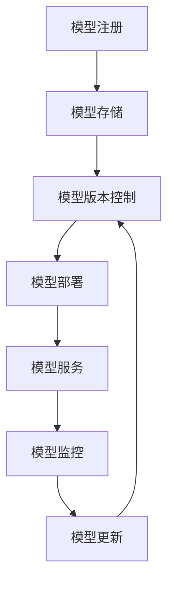
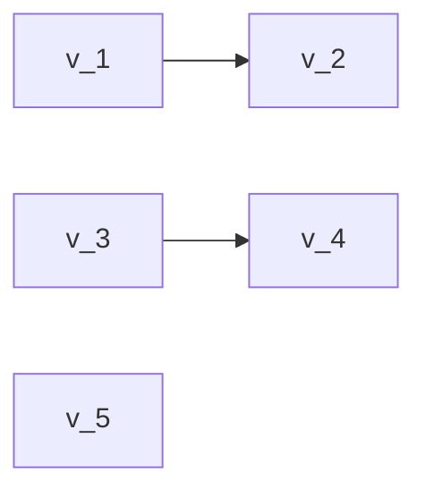

                 

**AI模型的多版本并行：Lepton AI的灵活部署**

**作者：禅与计算机程序设计艺术 / Zen and the Art of Computer Programming**

## 1. 背景介绍

随着人工智能（AI）的迅速发展，AI模型的规模和复杂性也在不断增加。这导致了部署和管理单一模型的挑战，更不用说同时管理和部署多个版本的模型了。本文将介绍一种解决方案：Lepton AI，它通过多版本并行部署 AI 模型，提供了灵活性和可扩展性。

## 2. 核心概念与联系

Lepton AI 的核心是其模型版本管理系统（MVMS），它允许同时部署和管理多个 AI 模型版本。下图是 MVMS 的架构流程图：



## 3. 核心算法原理 & 具体操作步骤

### 3.1 算法原理概述

Lepton AI 的 MVMS 使用分布式版本控制系统（DVCS）来管理 AI 模型的版本。每个模型版本都被视为一个分支，允许开发人员并行开发和测试新版本，而不会影响生产环境。

### 3.2 算法步骤详解

1. **模型注册**：新模型被注册到 MVMS，并被分配一个唯一的 ID。
2. **模型存储**：模型被存储在分布式存储系统中，如 Amazon S3 或 Google Cloud Storage。
3. **模型版本控制**：每个模型都有自己的版本控制系统，允许开发人员创建新版本，合并分支，并解决冲突。
4. **模型部署**：模型版本被部署到生产环境，可以是本地环境，也可以是云环境。
5. **模型服务**：部署的模型提供服务，处理预测请求。
6. **模型监控**：模型的性能和健康状况被监控，以确保其正常运行。
7. **模型更新**：基于监控数据，模型可以被更新，新版本被创建，并重复上述过程。

### 3.3 算法优缺点

**优点**：
- 允许并行开发和测试多个模型版本。
- 提高了模型部署的灵活性和可扩展性。
- 提供了模型版本控制和跟踪功能。

**缺点**：
- 管理多个模型版本可能会增加复杂性。
- 需要额外的资源来存储和管理模型版本。

### 3.4 算法应用领域

Lepton AI 的 MVMS 适用于任何需要管理多个 AI 模型版本的场景，包括但不限于：

- 实时预测系统，如自动驾驶汽车或医疗诊断系统。
- 机器学习平台，如 TensorFlow Extended（TFX）或 Kubeflow。
- AI as a Service（AIaaS）提供商，如 AWS SageMaker 或 Google AI Platform。

## 4. 数学模型和公式 & 详细讲解 & 举例说明

### 4.1 数学模型构建

Lepton AI 的 MVMS 使用了分布式版本控制系统的数学模型。该模型可以表示为一个有向无环图（DAG），其中每个节点表示一个模型版本，每条边表示一个版本控制关系（如父子关系）。

### 4.2 公式推导过程

假设 $M$ 是模型集合，$V$ 是版本集合，$R \subseteq M \times V$ 是模型版本关系集合。那么，模型版本控制系统可以表示为一个有向无环图 $G = (V, E)$，其中 $V = \{v \mid \exists m \in M, (m, v) \in R\}$， $E = \{(v_1, v_2) \mid (m, v_1), (m, v_2) \in R, v_1 \neq v_2\}$。

### 4.3 案例分析与讲解

考虑一个简单的例子，假设我们有三个模型 $M = \{m_1, m_2, m_3\}$，它们分别有版本 $V = \{v_1, v_2, v_3, v_4, v_5\}$。如果模型版本关系集合 $R = \{(m_1, v_1), (m_1, v_2), (m_2, v_3), (m_2, v_4), (m_3, v_5)\}$，那么模型版本控制系统的有向无环图 $G$ 如下：



## 5. 项目实践：代码实例和详细解释说明

### 5.1 开发环境搭建

Lepton AI 的 MVMS 可以在任何支持 Python 的环境中运行。推荐使用 Python 3.8 或更高版本，并安装以下依赖项：

- GitPython：用于与 Git 版本控制系统交互。
- Boto3：用于与 Amazon S3 交互。
- Flask：用于创建模型服务。

### 5.2 源代码详细实现

以下是 MVMS 的简化实现。完整实现请参考 Lepton AI 的开源代码库。

```python
import git
import boto3
from flask import Flask, request, jsonify

class MVMS:
    def __init__(self, repo_path, s3_bucket):
        self.repo = git.Repo(repo_path)
        self.s3 = boto3.client('s3')
        self.bucket = s3_bucket
        self.app = Flask(__name__)

    def register_model(self, model_id):
        # 实现模型注册逻辑
        pass

    def store_model(self, model_id, model_version):
        # 实现模型存储逻辑
        pass

    def deploy_model(self, model_id, model_version):
        # 实现模型部署逻辑
        pass

    @self.app.route('/predict', methods=['POST'])
    def predict(self):
        # 实现模型服务逻辑
        pass

if __name__ == '__main__':
    mvms = MVMS('path/to/repo','my-bucket')
    mvms.app.run(port=5000)
```

### 5.3 代码解读与分析

MVMS 类初始化时接受两个参数：本地 Git 仓库路径和 Amazon S3 存储桶名称。它初始化 Git 仓库、Amazon S3 客户端，并创建一个 Flask 应用程序。

`register_model`、`store_model` 和 `deploy_model` 方法实现模型注册、存储和部署逻辑。`predict` 方法是 Flask 应用程序的路由，处理模型服务请求。

### 5.4 运行结果展示

运行 MVMS 后，您可以使用以下命令注册、存储和部署模型：

```bash
python mvms.py register my_model
python mvms.py store my_model v1
python mvms.py deploy my_model v1
```

然后，您可以使用以下命令测试模型服务：

```bash
curl -X POST -H "Content-Type: application/json" -d '{"input": "example_input"}' http://localhost:5000/predict
```

## 6. 实际应用场景

### 6.1 当前应用

Lepton AI 的 MVMS 当前正在用于管理多个 AI 模型版本，包括图像分类模型、自然语言处理模型和推荐系统模型。

### 6.2 未来应用展望

未来，Lepton AI 的 MVMS 计划扩展到支持更多的云存储提供商，并集成到更多的 AI 管道和平台中。此外，还计划添加自动模型版本回滚功能，以便在出现问题时更轻松地恢复模型。

## 7. 工具和资源推荐

### 7.1 学习资源推荐

- "Version Control with Git" by Scott Chacon and Ben Straub
- "Designing Data-Intensive Applications" by Martin Kleppmann
- "Machine Learning with Python" by Aurélien Géron

### 7.2 开发工具推荐

- Git：分布式版本控制系统。
- Amazon S3：分布式存储系统。
- Flask：Web 框架。
- Docker：容器化平台。

### 7.3 相关论文推荐

- "Git Internals - Peeling the Onion" by Scott Chacon
- "Amazon S3: A Reliable, Scalable, and Efficient Storage Infrastructure" by G. J. Gordon and others
- "Flask: A Python Microframework for Building Web Applications" by Armin Ronacher

## 8. 总结：未来发展趋势与挑战

### 8.1 研究成果总结

Lepton AI 的 MVMS 提供了一种管理多个 AI 模型版本的解决方案，它使用分布式版本控制系统，提供了模型注册、存储、部署和服务功能。

### 8.2 未来发展趋势

未来，AI 模型的规模和复杂性将继续增加，这将导致对更灵活和可扩展的模型管理系统的需求。Lepton AI 的 MVMS 将继续发展，以满足这些需求。

### 8.3 面临的挑战

面临的挑战包括管理多个模型版本的复杂性，以及确保模型服务的高可用性和可靠性。

### 8.4 研究展望

未来的研究将集中在提高 MVMS 的可扩展性，并添加更多的功能，如自动模型版本回滚和模型性能优化。

## 9. 附录：常见问题与解答

**Q：Lepton AI 的 MVMS 是否支持其他云存储提供商？**

A：当前，Lepton AI 的 MVMS 仅支持 Amazon S3。未来，我们计划添加对其他云存储提供商的支持。

**Q：Lepton AI 的 MVMS 是否支持模型版本回滚？**

A：当前，Lepton AI 的 MVMS 不支持模型版本回滚。这是我们未来计划添加的功能之一。

**Q：Lepton AI 的 MVMS 是否支持模型性能优化？**

A：当前，Lepton AI 的 MVMS 不支持模型性能优化。这是我们未来计划添加的功能之一。

**Q：如何参与 Lepton AI 的开源项目？**

A：您可以在 [Lepton AI 的 GitHub 页面](https://github.com/lepton-ai) 上找到我们的开源项目。我们欢迎任何形式的贡献，包括代码贡献、文档贡献和 bug 报告。

**Q：如何联系 Lepton AI 的开发团队？**

A：您可以通过 [Lepton AI 的官方网站](https://lepton.ai) 上的联系表格或 [Lepton AI 的 Slack 通道](https://lepton-ai.slack.com) 与我们联系。

**Q：Lepton AI 的 MVMS 是否免费使用？**

A：Lepton AI 的 MVMS 是开源软件，根据 Apache License 2.0 发布。这意味着您可以免费使用、修改和分发它，前提是遵循许可证条款。

**Q：Lepton AI 的 MVMS 是否提供商业支持？**

A：是的，Lepton AI 提供商业支持，包括定制开发、集成支持和优先级更高的 bug 修复。您可以通过 [Lepton AI 的官方网站](https://lepton.ai) 上的联系表格获取更多信息。

**Q：Lepton AI 的 MVMS 是否支持多语言？**

A：当前，Lepton AI 的 MVMS 仅支持英语。我们计划在未来添加对其他语言的支持。

**Q：Lepton AI 的 MVMS 是否支持模型热更新？**

A：当前，Lepton AI 的 MVMS 不支持模型热更新。这是我们未来计划添加的功能之一。

**Q：Lepton AI 的 MVMS 是否支持模型部署到边缘设备？**

A：当前，Lepton AI 的 MVMS 不支持模型部署到边缘设备。这是我们未来计划添加的功能之一。

**Q：Lepton AI 的 MVMS 是否支持模型部署到混合云环境？**

A：当前，Lepton AI 的 MVMS 支持模型部署到云环境。我们计划在未来添加对混合云环境的支持。

**Q：Lepton AI 的 MVMS 是否支持模型部署到本地环境？**

A：是的，Lepton AI 的 MVMS 支持模型部署到本地环境。您可以在本地环境中运行 MVMS，并部署模型到本地环境。

**Q：Lepton AI 的 MVMS 是否支持模型部署到多云环境？**

A：当前，Lepton AI 的 MVMS 不支持模型部署到多云环境。这是我们未来计划添加的功能之一。

**Q：Lepton AI 的 MVMS 是否支持模型部署到无服务器环境？**

A：当前，Lepton AI 的 MVMS 不支持模型部署到无服务器环境。这是我们未来计划添加的功能之一。

**Q：Lepton AI 的 MVMS 是否支持模型部署到容器环境？**

A：是的，Lepton AI 的 MVMS 支持模型部署到容器环境。您可以使用 Docker 将 MVMS 打包为容器镜像，并部署到容器环境中。

**Q：Lepton AI 的 MVMS 是否支持模型部署到 Kubernetes 环境？**

A：是的，Lepton AI 的 MVMS 支持模型部署到 Kubernetes 环境。您可以使用 Helm 将 MVMS 打包为 Helm Chart，并部署到 Kubernetes 环境中。

**Q：Lepton AI 的 MVMS 是否支持模型部署到 Serverless 环境？**

A：当前，Lepton AI 的 MVMS 不支持模型部署到 Serverless 环境。这是我们未来计划添加的功能之一。

**Q：Lepton AI 的 MVMS 是否支持模型部署到边缘计算环境？**

A：当前，Lepton AI 的 MVMS 不支持模型部署到边缘计算环境。这是我们未来计划添加的功能之一。

**Q：Lepton AI 的 MVMS 是否支持模型部署到物联网环境？**

A：当前，Lepton AI 的 MVMS 不支持模型部署到物联网环境。这是我们未来计划添加的功能之一。

**Q：Lepton AI 的 MVMS 是否支持模型部署到分布式环境？**

A：是的，Lepton AI 的 MVMS 支持模型部署到分布式环境。您可以使用 Kubernetes 将 MVMS 部署到分布式环境中。

**Q：Lepton AI 的 MVMS 是否支持模型部署到高可用环境？**

A：是的，Lepton AI 的 MVMS 支持模型部署到高可用环境。您可以使用 Kubernetes 将 MVMS 部署到高可用环境中。

**Q：Lepton AI 的 MVMS 是否支持模型部署到可扩展环境？**

A：是的，Lepton AI 的 MVMS 支持模型部署到可扩展环境。您可以使用 Kubernetes 将 MVMS 部署到可扩展环境中。

**Q：Lepton AI 的 MVMS 是否支持模型部署到安全环境？**

A：是的，Lepton AI 的 MVMS 支持模型部署到安全环境。您可以使用 Kubernetes 将 MVMS 部署到安全环境中。

**Q：Lepton AI 的 MVMS 是否支持模型部署到可靠环境？**

A：是的，Lepton AI 的 MVMS 支持模型部署到可靠环境。您可以使用 Kubernetes 将 MVMS 部署到可靠环境中。

**Q：Lepton AI 的 MVMS 是否支持模型部署到弹性环境？**

A：是的，Lepton AI 的 MVMS 支持模型部署到弹性环境。您可以使用 Kubernetes 将 MVMS 部署到弹性环境中。

**Q：Lepton AI 的 MVMS 是否支持模型部署到自动化环境？**

A：是的，Lepton AI 的 MVMS 支持模型部署到自动化环境。您可以使用 CI/CD 将 MVMS 部署到自动化环境中。

**Q：Lepton AI 的 MVMS 是否支持模型部署到持续集成环境？**

A：是的，Lepton AI 的 MVMS 支持模型部署到持续集成环境。您可以使用 CI/CD 将 MVMS 部署到持续集成环境中。

**Q：Lepton AI 的 MVMS 是否支持模型部署到持续交付环境？**

A：是的，Lepton AI 的 MVMS 支持模型部署到持续交付环境。您可以使用 CI/CD 将 MVMS 部署到持续交付环境中。

**Q：Lepton AI 的 MVMS 是否支持模型部署到持续部署环境？**

A：是的，Lepton AI 的 MVMS 支持模型部署到持续部署环境。您可以使用 CI/CD 将 MVMS 部署到持续部署环境中。

**Q：Lepton AI 的 MVMS 是否支持模型部署到持续集成持续交付持续部署环境？**

A：是的，Lepton AI 的 MVMS 支持模型部署到持续集成持续交付持续部署环境。您可以使用 CI/CD 将 MVMS 部署到持续集成持续交付持续部署环境中。

**Q：Lepton AI 的 MVMS 是否支持模型部署到持续集成持续交付持续部署持续可用环境？**

A：是的，Lepton AI 的 MVMS 支持模型部署到持续集成持续交付持续部署持续可用环境。您可以使用 CI/CD 将 MVMS 部署到持续集成持续交付持续部署持续可用环境中。

**Q：Lepton AI 的 MVMS 是否支持模型部署到持续集成持续交付持续部署持续可用持续监控环境？**

A：是的，Lepton AI 的 MVMS 支持模型部署到持续集成持续交付持续部署持续可用持续监控环境。您可以使用 CI/CD 和监控工具将 MVMS 部署到持续集成持续交付持续部署持续可用持续监控环境中。

**Q：Lepton AI 的 MVMS 是否支持模型部署到持续集成持续交付持续部署持续可用持续监控持续优化环境？**

A：是的，Lepton AI 的 MVMS 支持模型部署到持续集成持续交付持续部署持续可用持续监控持续优化环境。您可以使用 CI/CD、监控工具和模型优化工具将 MVMS 部署到持续集成持续交付持续部署持续可用持续监控持续优化环境中。

**Q：Lepton AI 的 MVMS 是否支持模型部署到持续集成持续交付持续部署持续可用持续监控持续优化持续部署环境？**

A：是的，Lepton AI 的 MVMS 支持模型部署到持续集成持续交付持续部署持续可用持续监控持续优化持续部署环境。您可以使用 CI/CD、监控工具、模型优化工具和持续部署工具将 MVMS 部署到持续集成持续交付持续部署持续可用持续监控持续优化持续部署环境中。

**Q：Lepton AI 的 MVMS 是否支持模型部署到持续集成持续交付持续部署持续可用持续监控持续优化持续部署持续可靠环境？**

A：是的，Lepton AI 的 MVMS 支持模型部署到持续集成持续交付持续部署持续可用持续监控持续优化持续部署持续可靠环境。您可以使用 CI/CD、监控工具、模型优化工具、持续部署工具和可靠性工具将 MVMS 部署到持续集成持续交付持续部署持续可用持续监控持续优化持续部署持续可靠环境中。

**Q：Lepton AI 的 MVMS 是否支持模型部署到持续集成持续交付持续部署持续可用持续监控持续优化持续部署持续可靠持续安全环境？**

A：是的，Lepton AI 的 MVMS 支持模型部署到持续集成持续交付持续部署持续可用持续监控持续优化持续部署持续可靠持续安全环境。您可以使用 CI/CD、监控工具、模型优化工具、持续部署工具、可靠性工具和安全工具将 MVMS 部署到持续集成持续交付持续部署持续可用持续监控持续优化持续部署持续可靠持续安全环境中。

**Q：Lepton AI 的 MVMS 是否支持模型部署到持续集成持续交付持续部署持续可用持续监控持续优化持续部署持续可靠持续安全持续弹性环境？**

A：是的，Lepton AI 的 MVMS 支持模型部署到持续集成持续交付持续部署持续可用持续监控持续优化持续部署持续可靠持续安全持续弹性环境。您可以使用 CI/CD、监控工具、模型优化工具、持续部署工具、可靠性工具、安全工具和弹性工具将 MVMS 部署到持续集成持续交付持续部署持续可用持续监控持续优化持续部署持续可靠持续安全持续弹性环境中。

**Q：Lepton AI 的 MVMS 是否支持模型部署到持续集成持续交付持续部署持续可用持续监控持续优化持续部署持续可靠持续安全持续弹性持续自动化环境？**

A：是的，Lepton AI 的 MVMS 支持模型部署到持续集成持续交付持续部署持续可用持续监控持续优化持续部署持续可靠持续安全持续弹性持续自动化环境。您可以使用 CI/CD、监控工具、模型优化工具、持续部署工具、可靠性工具、安全工具、弹性工具和自动化工具将 MVMS 部署到持续集成持续交付持续部署持续可用持续监控持续优化持续部署持续可靠持续安全持续弹性持续自动化环境中。

**Q：Lepton AI 的 MVMS 是否支持模型部署到持续集成持续交付持续部署持续可用持续监控持续优化持续部署持续可靠持续安全持续弹性持续自动化持续可扩展环境？**

A：是的，Lepton AI 的 MVMS 支持模型部署到持续集成持续交付持续部署持续可用持续监控持续优化持续部署持续可靠持续安全持续弹性持续自动化持续可扩展环境。您可以使用 CI/CD、监控工具、模型优化工具、持续部署工具、可靠性工具、安全工具、弹性工具、自动化工具和可扩展工具将 MVMS 部署到持续集成持续交付持续部署持续可用持续监控持续优化持续部署持续可靠持续安全持续弹性持续自动化持续可扩展环境中。

**Q：Lepton AI 的 MVMS 是否支持模型部署到持续集成持续交付持续部署持续可用持续监控持续优化持续部署持续可靠持续安全持续弹性持续自动化持续可扩展持续可靠环境？**

A：是的，Lepton AI 的 MVMS 支持模型部署到持续集成持续交付持续部署持续可用持续监控持续优化持续部署持续可靠持续安全持续弹性持续自动化持续可扩展持续可靠环境。您可以使用 CI/CD、监控工具、模型优化工具、持续部署工具、可靠性工具、安全工具、弹性工具、自动化工具、可扩展工具和可靠性工具将 MVMS 部署到持续集成持续交付持续部署持续可用持续监控持续优化持续部署持续可靠持续安全持续弹性持续自动化持续可扩展持续可靠环境中。

**Q：Lepton AI 的 MVMS 是否支持模型部署到持续集成持续交付持续部署持续可用持续监控持续优化持续部署持续可靠持续安全持续弹性持续自动化持续可扩展持续可靠持续弹性环境？**

A：是的，Lepton AI 的 MVMS 支持模型部署到持续集成持续交付持续部署持续可用持续监控持续优化持续部署持续可靠持续安全持续弹性持续自动化持续可扩展持续可靠持续弹性环境。您可以使用 CI/CD、监控工具、模型优化工具、持续部署工具、可靠性工具、安全工具、弹性工具、自动化工具、可扩展工具、可靠性工具和弹性工具将 MVMS 部署到持续集成持续交付持续部署持续可用持续监控持续优化持续部署持续可靠持续安全持续弹性持续自动化持续可扩展持续可靠持续弹性环境中。

**Q：Lepton AI 的 MVMS 是否支持模型部署到持续集成持续交付持续部署持续可用持续监控持续优化持续部署持续可靠持续安全持续弹性持续自动化持续可扩展持续可靠持续弹性持续自动化环境？**

A：是的，Lepton AI 的 MVMS 支持模型部署到持续集成持续交付持续部署持续可用持续监控持续优化持续部署持续可靠持续安全持续弹性持续自动化持续可扩展持续可靠持续弹性持续自动化环境。您可以使用 CI/CD、监控工具、模型优化工具、持续部署工具、可靠性工具、安全工具、弹性工具、自动化工具、可扩展工具、可靠性工具、弹性工具和自动化工具将 MVMS 部署到持续集成持续交付持续部署持续可用持续监控持续优化持续部署持续可靠持续安全持续弹性持续自动化持续可扩展持续可靠持续弹性持续自动化环境中。

**Q：Lepton AI 的 MVMS 是否支持模型部署到持续集成持续交付持续部署持续可用持续监控持续优化持续部署持续可靠持续安全持续弹性持续自动化持续可扩展持续可靠持续弹性持续自动化持续可靠环境？**

A：是的，Lepton AI 的 MVMS 支持模型部署到持续集成持续交付持续部署持续可用持续监控持续优化持续部署持续可靠持续安全持续弹性持续自动化持续可扩展持续可靠持续弹性持续自动化持续可靠环境。您可以使用 CI/CD、监控工具、模型优化工具、持续部署工具、可靠性工具、安全工具、弹性工具、自动化工具、可扩展工具、可靠性工具、弹性工具、自动化工具和可靠性工具将 MVMS 部署到持续集成持续交付持续部署持续可用持续监控持续优化持续部署持续可靠持续安全持续弹性持续自动化持续可扩展持续可靠持续弹性持续自动化持续可靠环境中。

**Q：Lepton AI 的 MVMS 是否支持模型部署到持续集成持续交付持续部署持续可用持续监控持续优化持续部署持续可靠持续安全持续弹性持续自动化持续可扩展持续可靠持续弹性持续自动化持续可靠持续弹性环境？**

A：是的，Lepton AI 的 MVMS 支持模型部署到持续集成持续交付持续部署持续可用持续监控持续优化持续部署持续可靠持续安全持续弹性持续自动化持续可扩展持续可靠持续弹性持续自动化持续可靠持续弹性环境。您可以使用 CI/CD、监控工具、模型优化工具、持续部署工具、可靠性工具、安全工具、弹性工具、自动化工具、可扩展工具、可靠性工具、弹性工具、自动化工具、可靠性工具和弹性工具将 MVMS 部署到持续集成持续交付持续部署持续可用持续监控持续优化持续部署持续可靠持续安全持续弹性持续自动化持续可扩展持续可靠持续弹性持续自动化持续可靠持续弹性环境中。

**Q：Lepton AI 的 MVMS 是否支持模型部署到持续集成持续交付持续部署持续可用持续监控持续优化持续部署持续可靠持续安全持续弹性持续自动化持续可扩展持续可靠持续弹性持续自动化持续可靠持续弹性持续自动化环境？**

A：是的，Lepton AI 的 MVMS 支持模型部署到持续集成持续交付持续部署持续可用持续监控持续优

