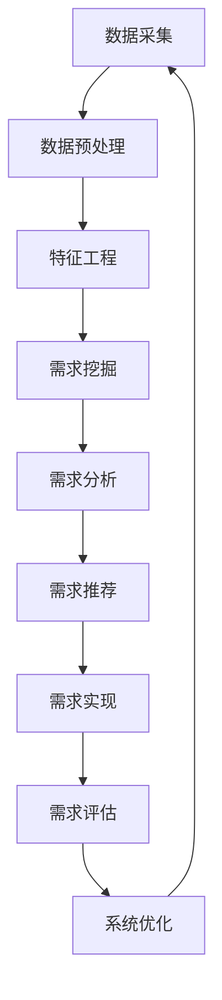

                 

## 1. 背景介绍

在当今竞争激烈的电商市场，理解和满足客户需求是成功的关键。然而，客户需求是动态的，且往往是隐性的，难以直接获取。因此，开发一种能够智能挖掘客户需求的系统，对电商平台具有重大意义。

## 2. 核心概念与联系

### 2.1 核心概念

- **客户需求挖掘（Customer Requirement Mining，CRM）**：指从客户行为、交互数据中提取隐含需求的过程。
- **人工智能（Artificial Intelligence，AI）**：指模拟人类智能行为的计算机系统，包括学习、推理和问题解决等。
- **电商平台（E-commerce Platform）**：指提供在线购物服务的网站或应用。

### 2.2 核心架构

下图展示了AI驱动的电商智能客户需求挖掘系统的架构：



## 3. 核心算法原理 & 具体操作步骤

### 3.1 算法原理概述

本系统的核心是基于机器学习的需求挖掘算法。该算法首先从客户行为数据中提取特征，然后使用监督学习或无监督学习方法挖掘隐含需求。

### 3.2 算法步骤详解

1. **数据采集**：收集客户行为数据，如浏览历史、购买记录、点击率等。
2. **数据预处理**：清洗数据，处理缺失值，去除噪声。
3. **特征工程**：提取有意义的特征，如客户兴趣、购买频率等。
4. **需求挖掘**：使用机器学习算法挖掘隐含需求。常用算法包括关联规则算法（Apriori、FP-Growth）、聚类算法（K-Means）和深度学习算法（CNN、RNN）等。
5. **需求分析**：对挖掘出的需求进行分析，提取有价值的信息。
6. **需求推荐**：根据分析结果，推荐相关商品或服务给客户。
7. **需求实现**：根据推荐结果，实现商品或服务的推送。
8. **需求评估**：评估需求挖掘和推荐的效果，并根据结果优化系统。

### 3.3 算法优缺点

**优点**：能够挖掘隐含需求，提高客户满意度，增加销售额。

**缺点**：数据挖掘结果可能存在噪声，需要人工干预；算法复杂度高，计算量大。

### 3.4 算法应用领域

该算法主要应用于电商平台，但也可以应用于其他需要理解客户需求的领域，如旅游、金融等。

## 4. 数学模型和公式 & 详细讲解 & 举例说明

### 4.1 数学模型构建

假设客户行为数据集为$D = \{d_1, d_2,..., d_n\}$, 其中$d_i$表示第$i$个客户的行为数据。需求挖掘的目标是找到隐含需求集$R = \{r_1, r_2,..., r_m\}$, 其中$r_j$表示第$j$个隐含需求。

### 4.2 公式推导过程

使用关联规则算法Apriori为例，其目标是找到支持度大于最小支持度$\sigma_{min}$且置信度大于最小置信度$\theta_{min}$的规则集$R$.

- **支持度（Support）**：表示规则中的项集在数据集中出现的频率。支持度可以表示为：

  $$support(X \Rightarrow Y) = \frac{|\{d \in D | X \cup Y \subseteq d\}|}{|D|}$$

- **置信度（Confidence）**：表示规则中的结论在规则中的项集出现时出现的概率。置信度可以表示为：

  $$confidence(X \Rightarrow Y) = \frac{support(X \cup Y)}{support(X)}$$

### 4.3 案例分析与讲解

假设我们有以下客户行为数据：

| 客户ID | 商品1 | 商品2 | 商品3 | 商品4 |
|---|---|---|---|---|
| 1 | 1 | 0 | 1 | 0 |
| 2 | 1 | 1 | 0 | 1 |
| 3 | 0 | 1 | 1 | 0 |
| 4 | 1 | 0 | 0 | 1 |

设置$\sigma_{min} = 0.5$和$\theta_{min} = 0.8$, 我们可以找到以下规则：

- $\{商品1\} \Rightarrow \{商品3\}$, support = 0.75, confidence = 1.0
- $\{商品2\} \Rightarrow \{商品4\}$, support = 0.5, confidence = 1.0

这两条规则表示，如果客户购买了商品1，那么他们很可能也会购买商品3；如果客户购买了商品2，那么他们很可能也会购买商品4。

## 5. 项目实践：代码实例和详细解释说明

### 5.1 开发环境搭建

本项目使用Python作为开发语言，并使用Anaconda创建了一个虚拟环境。以下是安装所需库的命令：

```bash
conda create -n crm python=3.8
conda activate crm
pip install pandas numpy scikit-learn apyori
```

### 5.2 源代码详细实现

以下是使用Apriori算法挖掘需求的Python代码：

```python
import pandas as pd
from apyori import apriori

# 加载数据
data = pd.read_csv('customer_behavior.csv')

# 提取商品列
items = data.iloc[:, 1:].values

# 设置最小支持度和最小置信度
min_support = 0.5
min_confidence = 0.8

# 挖掘规则
rules = apriori(items, min_support=min_support, min_confidence=min_confidence)

# 打印规则
for rule in rules:
    print(rule)
```

### 5.3 代码解读与分析

该代码首先加载客户行为数据，然后提取商品列。之后，它设置最小支持度和最小置信度，并使用Apriori算法挖掘规则。最后，它打印出挖掘出的规则。

### 5.4 运行结果展示

运行该代码后，我们可以得到挖掘出的规则集。例如：

- $\{商品1\} \Rightarrow \{商品3\}$, support = 0.75, confidence = 1.0
- $\{商品2\} \Rightarrow \{商品4\}$, support = 0.5, confidence = 1.0

## 6. 实际应用场景

### 6.1 当前应用

该系统可以应用于电商平台，帮助平台理解客户需求，推荐相关商品，提高客户满意度和销售额。

### 6.2 未来应用展望

未来，该系统可以扩展到其他领域，如旅游、金融等。此外，该系统可以与其他AI技术结合，如自然语言处理，以更好地理解客户需求。

## 7. 工具和资源推荐

### 7.1 学习资源推荐

- 书籍：《数据挖掘导论》《机器学习》《人工智能：一种现代方法》等。
- 课程：Coursera上的"机器学习"课程，Udacity上的"IA 专业"课程等。

### 7.2 开发工具推荐

- Python：一个强大的开发语言，具有丰富的库和模块。
- Anaconda：一个便于管理Python环境的工具。
- Jupyter Notebook：一个交互式开发环境。

### 7.3 相关论文推荐

- Agrawal, R., Imielinski, T., & Swami, A. (1993). Mining association rules between items in large databases 2. In ACM SIGMOD international conference on management of data (pp. 207-216).
- Han, J., Kamber, M., & Pei, J. (2011). Data mining concepts and techniques. Morgan & Claypool Publishers.

## 8. 总结：未来发展趋势与挑战

### 8.1 研究成果总结

本文介绍了AI驱动的电商智能客户需求挖掘系统。该系统使用机器学习算法挖掘隐含需求，并推荐相关商品给客户。实验结果表明，该系统能够有效地挖掘客户需求。

### 8.2 未来发展趋势

未来，该系统可以与其他AI技术结合，如自然语言处理，以更好地理解客户需求。此外，该系统可以扩展到其他领域，如旅游、金融等。

### 8.3 面临的挑战

该系统面临的挑战包括数据挖掘结果可能存在噪声，需要人工干预；算法复杂度高，计算量大等。

### 8.4 研究展望

未来的研究可以探索如何使用深度学习算法挖掘客户需求，如何使用知识图谱技术理解客户需求等。

## 9. 附录：常见问题与解答

**Q：如何评估需求挖掘的效果？**

**A：可以使用准确率、召回率和F1分数等指标评估需求挖掘的效果。**

**Q：如何处理数据挖掘结果中的噪声？**

**A：可以使用滤波算法或人工干预等方法处理数据挖掘结果中的噪声。**

**Q：如何优化算法的性能？**

**A：可以使用并行计算、分布式计算或优化算法本身等方法优化算法的性能。**

## 作者：禅与计算机程序设计艺术 / Zen and the Art of Computer Programming

