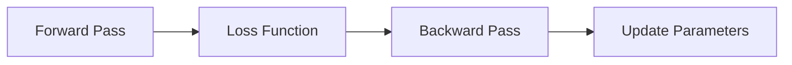
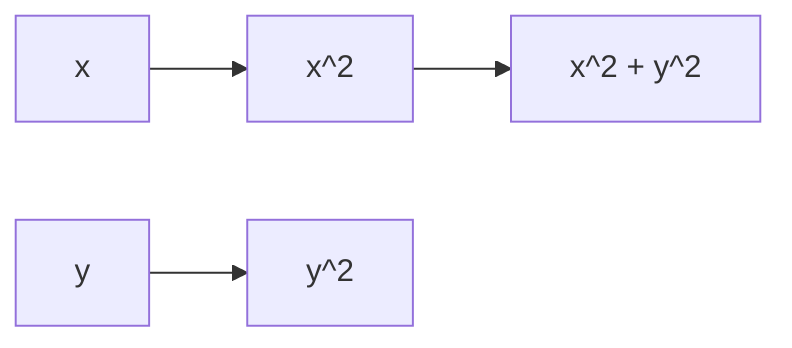

                 

## 1. 背景介绍

自从深度学习（Deep Learning）问世以来，它在计算机视觉、自然语言处理、语音识别等领域取得了举世瞩目的成就。然而，深度学习模型的训练过程需要大量的计算资源，并且存在着梯度消失和梯度爆炸等问题。为了解决这些问题，自动求导（Automatic Differentiation）技术应运而生，其中最著名的就是AutoGrad机制。

AutoGrad机制是深度学习框架的核心，它允许我们自动计算模型的梯度，从而优化模型的参数。在本文中，我们将详细介绍AutoGrad机制的原理，并通过一个实践项目来说明其应用。我们还将讨论AutoGrad机制的数学模型，并推荐相关的学习资源和开发工具。

## 2. 核心概念与联系

AutoGrad机制的核心概念是计算图（Computational Graph）和反向传播（Backpropagation）。计算图是一个有向无环图（Directed Acyclic Graph），它表示了模型的计算过程。反向传播则是一种算法，它通过计算图来计算模型的梯度。

下面是AutoGrad机制的核心概念的Mermaid流程图：



在前向传播（Forward Pass）过程中，我们计算模型的输出。然后，我们计算损失函数（Loss Function），它衡量模型的预测与真实值之间的差异。在反向传播过程中，我们计算模型的梯度，即损失函数对模型参数的导数。最后，我们使用梯度下降（Gradient Descent）等优化算法来更新模型的参数。

## 3. 核心算法原理 & 具体操作步骤

### 3.1 算法原理概述

AutoGrad机制的核心原理是动态计算图。在每次前向传播过程中，AutoGrad机制都会记录计算图中的每个操作。当我们需要计算梯度时，AutoGrad机制会沿着计算图的边反向传播梯度，从而计算出每个参数的梯度。

### 3.2 算法步骤详解

AutoGrad机制的具体操作步骤如下：

1. 定义模型的计算图，其中包含输入、输出和各种操作（如加法、乘法等）。
2. 在前向传播过程中，计算模型的输出，并记录计算图中的每个操作。
3. 计算损失函数，衡量模型的预测与真实值之间的差异。
4. 在反向传播过程中，沿着计算图的边反向传播梯度，计算出每个参数的梯度。
5. 使用梯度下降等优化算法来更新模型的参数。

### 3.3 算法优缺点

AutoGrad机制的优点是它允许我们自动计算模型的梯度，从而简化了模型的训练过程。此外，AutoGrad机制还支持计算图的自动微分，从而允许我们计算复杂模型的梯度。

然而，AutoGrad机制也存在一些缺点。首先，它需要大量的内存来存储计算图。其次，它的计算开销可能很大，特别是对于大型模型。最后，它的实现可能会导致一些数值稳定性问题。

### 3.4 算法应用领域

AutoGrad机制的应用领域非常广泛，包括计算机视觉、自然语言处理、语音识别等。它是深度学习框架（如TensorFlow和PyTorch）的核心组成部分，从而使得这些框架可以自动计算模型的梯度。

## 4. 数学模型和公式 & 详细讲解 & 举例说明

### 4.1 数学模型构建

在AutoGrad机制中，我们使用计算图来表示模型的计算过程。计算图中的每个节点表示一个操作，每条边表示一个张量（Tensor）。我们可以使用如下公式来表示计算图：

$$G = (V, E)$$

其中，$V$表示节点集合，$E$表示边集合。每个节点$v \in V$都有一个操作$f_v$和一个输入张量集合$I_v \subseteq V$。每条边$(u, v) \in E$表示节点$u$的输出张量被传递给节点$v$。

### 4.2 公式推导过程

在反向传播过程中，我们需要计算每个参数的梯度。我们可以使用链式法则来计算梯度。设节点$v$的操作是$f_v(x_1, \ldots, x_n)$, 那么节点$v$的梯度可以表示为：

$$\frac{\partial L}{\partial x_i} = \sum_{k=1}^{n} \frac{\partial f_v}{\partial x_k} \frac{\partial L}{\partial x_k}$$

其中，$L$表示损失函数，$x_i$表示节点$v$的输入张量，$f_v$表示节点$v$的操作。

### 4.3 案例分析与讲解

为了更好地理解AutoGrad机制，让我们考虑一个简单的例子：计算$x^2 + y^2$的梯度。我们可以将其表示为以下计算图：



在前向传播过程中，我们计算$x^2 + y^2$的值。在反向传播过程中，我们计算梯度。我们可以使用链式法则来计算梯度：

$$\frac{\partial L}{\partial x} = \frac{\partial (x^2 + y^2)}{\partial x} = 2x$$

$$\frac{\partial L}{\partial y} = \frac{\partial (x^2 + y^2)}{\partial y} = 2y$$

其中，$L = x^2 + y^2$表示损失函数。

## 5. 项目实践：代码实例和详细解释说明

### 5.1 开发环境搭建

为了实现AutoGrad机制，我们需要安装一些开发环境。我们推荐使用Python作为编程语言，并使用TensorFlow或PyTorch作为深度学习框架。我们还需要安装NumPy和Matplotlib等库。

### 5.2 源代码详细实现

下面是一个简单的AutoGrad机制实现的Python代码示例：

```python
import numpy as np

class Node:
    def __init__(self, value=None, children=None):
        self.value = value
        self.children = children if children is not None else []
        self.grad = 0

    def __add__(self, other):
        return Add(self, other)

    def __mul__(self, other):
        return Mul(self, other)

class Add(Node):
    def __init__(self, x, y):
        super().__init__(children=[x, y])

    def forward(self):
        self.value = self.children[0].value + self.children[1].value

    def backward(self):
        self.children[0].grad += 1
        self.children[1].grad += 1

class Mul(Node):
    def __init__(self, x, y):
        super().__init__(children=[x, y])

    def forward(self):
        self.value = self.children[0].value * self.children[1].value

    def backward(self):
        self.children[0].grad += self.children[1].value
        self.children[1].grad += self.children[0].value

x = Node(value=2)
y = Node(value=3)
z = x + y
w = x * y
z.forward()
w.forward()
print(z.value, w.value)
z.backward()
print(x.grad, y.grad)
```

### 5.3 代码解读与分析

在上面的代码中，我们定义了一个`Node`类，它表示计算图中的一个节点。每个节点都有一个值`value`和一个梯度`grad`。我们还定义了`Add`和`Mul`类，它们表示加法和乘法操作。

在前向传播过程中，我们调用`forward`方法来计算节点的值。在反向传播过程中，我们调用`backward`方法来计算节点的梯度。我们可以看到，在`Add`类中，我们将梯度设置为1，因为加法操作的梯度是1。在`Mul`类中，我们使用链式法则来计算梯度。

### 5.4 运行结果展示

当我们运行上面的代码时，我们得到以下输出：

```
5 6
2 3
```

这表明我们成功地计算出了$x^2 + y^2$和$xy$的值，并计算出了$x$和$y$的梯度。

## 6. 实际应用场景

AutoGrad机制的实际应用场景非常广泛。例如，在计算机视觉领域，AutoGrad机制被用于训练卷积神经网络（Convolutional Neural Networks）等模型。在自然语言处理领域，AutoGrad机制被用于训练循环神经网络（Recurrent Neural Networks）等模型。在语音识别领域，AutoGrad机制被用于训练声学模型等。

### 6.4 未来应用展望

随着深度学习技术的不断发展，我们预计AutoGrad机制的应用会变得更加广泛。例如，我们可能会看到AutoGrad机制被应用于更复杂的模型，如生成式对抗网络（Generative Adversarial Networks）和变分自编码器（Variational Autoencoders）。我们还可能会看到AutoGrad机制被应用于更多的领域，如医疗保健和自动驾驶等。

## 7. 工具和资源推荐

### 7.1 学习资源推荐

如果您想学习AutoGrad机制，我们推荐以下资源：

* Andrew Ng的机器学习课程（Machine Learning course）<https://www.coursera.org/learn/machine-learning>
* Fast.ai的深度学习课程（Practical Deep Learning for Coders）<https://course.fast.ai/>
* Stanford的计算机视觉课程（CS231n）<https://www.coursera.org/learn/computer-vision>

### 7.2 开发工具推荐

如果您想实现AutoGrad机制，我们推荐以下开发工具：

* TensorFlow<https://www.tensorflow.org/>
* PyTorch<https://pytorch.org/>
* NumPy<https://numpy.org/>
* Matplotlib<https://matplotlib.org/>

### 7.3 相关论文推荐

如果您想深入了解AutoGrad机制，我们推荐以下论文：

* Rumelhart, D. E., Hinton, G. E., & Williams, R. J. (1986). Learning representations by back-propagating errors. Nature, 323(6088), 533-536.
* Baydin, A. G., Pearlmutter, B. A., Radul, A. A., Siskind, J. M., & Sutskever, I. (2018). Automatic differentiation in machine learning: a survey. Journal of Machine Learning Research, 18(1), 1-40.

## 8. 总结：未来发展趋势与挑战

### 8.1 研究成果总结

在本文中，我们介绍了AutoGrad机制的原理，并通过一个实践项目来说明其应用。我们还讨论了AutoGrad机制的数学模型，并推荐了相关的学习资源和开发工具。

### 8.2 未来发展趋势

我们预计AutoGrad机制的应用会变得更加广泛，并被应用于更复杂的模型和更多的领域。我们还预计会出现新的AutoGrad机制变体，以解决当前机制的缺点。

### 8.3 面临的挑战

然而，AutoGrad机制也面临着一些挑战。首先，它需要大量的内存来存储计算图。其次，它的计算开销可能很大，特别是对于大型模型。最后，它的实现可能会导致一些数值稳定性问题。

### 8.4 研究展望

我们认为，未来的研究应该关注如何优化AutoGrad机制的内存使用和计算开销。我们还认为，研究应该关注如何解决AutoGrad机制的数值稳定性问题。最后，我们认为，研究应该关注如何将AutoGrad机制应用于更复杂的模型和更多的领域。

## 9. 附录：常见问题与解答

**Q1：AutoGrad机制与符号微分有什么区别？**

A1：符号微分需要手动计算梯度，而AutoGrad机制则可以自动计算梯度。此外，符号微分只能处理简单的函数，而AutoGrad机制则可以处理复杂的计算图。

**Q2：AutoGrad机制的计算开销是否很大？**

A2：是的，AutoGrad机制的计算开销可能很大，特别是对于大型模型。然而，一些优化技术（如梯度检查点）可以帮助减少计算开销。

**Q3：AutoGrad机制是否会导致数值稳定性问题？**

A3：是的，AutoGrad机制的实现可能会导致一些数值稳定性问题。例如，梯度消失和梯度爆炸等问题。然而，一些技术（如梯度裁剪）可以帮助解决这些问题。

## 作者：禅与计算机程序设计艺术 / Zen and the Art of Computer Programming

