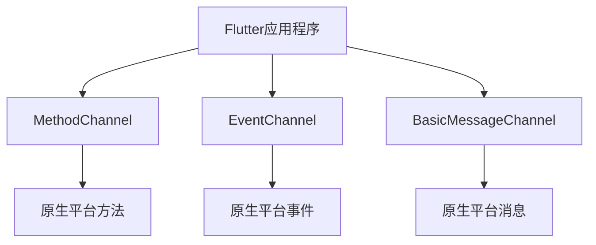

                 

## 1. 背景介绍

随着移动互联网的飞速发展，跨平台开发已成为当前主流趋势。Flutter，一款由Google推出的跨平台UI框架，自问世以来，受到了广大开发者的青睐。然而，在进行跨平台开发时，不可避免地会涉及到与原生平台交互的需求。本文将详细介绍如何进行Flutter跨平台插件开发，以满足这些需求。

## 2. 核心概念与联系

### 2.1 核心概念

在进行Flutter跨平台插件开发之前，我们需要了解以下几个核心概念：

- **插件（Plugin）**：插件是一个原生平台（Android、iOS、Windows、MacOS、Linux、Web）的库，它提供了与Flutter应用程序交互的接口。
- **方法通道（MethodChannel）**：方法通道是Flutter提供的一种插件与Flutter应用程序通信的方式。它允许插件在原生平台上注册一个方法，并通过该方法与Flutter应用程序进行通信。
- **事件通道（EventChannel）**：事件通道是另一种插件与Flutter应用程序通信的方式。它允许插件在原生平台上注册一个事件，并通过该事件向Flutter应用程序发送数据。
- **基本消息（BasicMessageChannel）**：基本消息通道是一种简单的插件与Flutter应用程序通信的方式。它允许插件在原生平台上注册一个消息，并通过该消息与Flutter应用程序进行简单的数据交换。

### 2.2 核心概念联系

下面是核心概念的Mermaid流程图：



如图所示，Flutter应用程序可以通过方法通道、事件通道和基本消息通道与原生平台进行通信。方法通道用于注册方法，事件通道用于注册事件，基本消息通道用于简单的数据交换。

## 3. 核心算法原理 & 具体操作步骤

### 3.1 算法原理概述

Flutter跨平台插件开发的核心原理是通过方法通道、事件通道和基本消息通道在原生平台和Flutter应用程序之间建立通信桥梁。插件在原生平台上注册方法、事件或消息，Flutter应用程序通过这些通道与插件进行通信。

### 3.2 算法步骤详解

下面是进行Flutter跨平台插件开发的具体操作步骤：

1. **创建插件项目**：首先，我们需要创建一个插件项目。插件项目是一个原生平台的库，它提供了与Flutter应用程序交互的接口。我们可以使用Flutter提供的插件模板创建插件项目。
2. **注册通道**：在插件项目中，我们需要注册方法通道、事件通道或基本消息通道。注册通道时，我们需要指定通道的名称和通信方式（方法、事件或消息）。
3. **实现插件逻辑**：在插件项目中，我们需要实现插件的逻辑。插件的逻辑是指插件在原生平台上执行的操作。例如，如果我们要开发一个摄像头插件，那么插件的逻辑就是控制原生平台的摄像头。
4. **在Flutter应用程序中使用插件**：在Flutter应用程序中，我们需要导入插件项目，并通过注册的通道与插件进行通信。我们可以调用插件的方法，监听插件的事件，或发送消息给插件。
5. **测试插件**：最后，我们需要测试插件，确保插件在各个平台上都能正常工作。

### 3.3 算法优缺点

**优点：**

- 使用方法通道、事件通道和基本消息通道可以方便地与原生平台进行通信。
- 插件可以在原生平台上执行复杂的操作，并将结果返回给Flutter应用程序。
- 插件可以在原生平台上监听事件，并将事件发送给Flutter应用程序。

**缺点：**

- 插件开发需要原生平台的开发经验。
- 插件的性能受限于原生平台的性能。
- 插件的开发和维护需要额外的工作量。

### 3.4 算法应用领域

Flutter跨平台插件开发可以应用于以下领域：

- **原生平台特有的功能**：例如，摄像头、定位、通知等功能。
- **性能要求高的功能**：例如，图像处理、视频编码等功能。
- **与原生平台集成**：例如，与原生平台的库或服务进行集成。

## 4. 数学模型和公式 & 详细讲解 & 举例说明

### 4.1 数学模型构建

在进行Flutter跨平台插件开发时，我们需要构建一个数学模型来描述插件与Flutter应用程序之间的通信。数学模型可以描述通信的过程，并帮助我们分析通信的性能。

数学模型的构建需要考虑以下因素：

- **通信方式**：方法通道、事件通道和基本消息通道。
- **通信频率**：插件与Flutter应用程序之间的通信频率。
- **通信数据量**：插件与Flutter应用程序之间传输的数据量。
- **通信延迟**：插件与Flutter应用程序之间的通信延迟。

### 4.2 公式推导过程

数学模型的公式推导过程如下：

1. **通信频率公式**：通信频率可以使用以下公式描述：

$$f = \frac{n}{t}$$

其中，$f$是通信频率， $n$是通信次数， $t$是通信时间。

2. **通信数据量公式**：通信数据量可以使用以下公式描述：

$$d = n \times s$$

其中，$d$是通信数据量， $n$是通信次数， $s$是每次通信传输的数据量。

3. **通信延迟公式**：通信延迟可以使用以下公式描述：

$$l = \frac{d}{b}$$

其中，$l$是通信延迟， $d$是通信数据量， $b$是通信带宽。

### 4.3 案例分析与讲解

例如，我们要开发一个摄像头插件，插件需要每秒钟向Flutter应用程序发送一帧图像。我们可以使用数学模型来分析插件与Flutter应用程序之间的通信。

- **通信频率**：每秒钟发送一帧图像，所以通信频率为1Hz。
- **通信数据量**：每帧图像的大小为1MB，所以每秒钟传输的数据量为1MB。
- **通信延迟**：如果通信带宽为10MB/s，那么通信延迟为0.1秒。

## 5. 项目实践：代码实例和详细解释说明

### 5.1 开发环境搭建

在进行Flutter跨平台插件开发之前，我们需要搭建开发环境。开发环境包括以下组件：

- **Flutter SDK**：Flutter SDK是Flutter开发的核心组件。我们需要下载并安装Flutter SDK。
- **原生平台开发环境**：我们需要原生平台的开发环境。例如，如果我们要开发Android插件，那么我们需要安装Android Studio和配置Android开发环境。
- **插件模板**：我们需要使用Flutter提供的插件模板创建插件项目。

### 5.2 源代码详细实现

下面是一个简单的Flutter跨平台插件开发示例。该示例开发了一个简单的插件，该插件在原生平台上注册了一个方法，该方法返回当前时间。

**插件项目（Android）**

*AndroidPlugin.java*

```java
import io.flutter.plugin.common.MethodCall;
import io.flutter.plugin.common.MethodChannel;

public class AndroidPlugin implements MethodChannel.MethodCallHandler {
  @Override
  public void onMethodCall(MethodCall call, MethodChannel.Result result) {
    if (call.method.equals("getCurrentTime")) {
      result.success(System.currentTimeMillis());
    } else {
      result.notImplemented();
    }
  }
}
```

*AndroidPlugin.java*是插件的核心类。它实现了`MethodChannel.MethodCallHandler`接口，并重写了`onMethodCall`方法。在`onMethodCall`方法中，我们检查调用的方法是否为`getCurrentTime`。如果是，我们调用`result.success`方法返回当前时间；否则，我们调用`result.notImplemented`方法表示该方法未实现。

**Flutter应用程序**

*main.dart*

```dart
import 'package:flutter/material.dart';
import 'package:flutter/services.dart';

void main() {
  runApp(MyApp());
}

class MyApp extends StatefulWidget {
  @override
  _MyAppState createState() => _MyAppState();
}

class _MyAppState extends State<MyApp> {
  String _time = 'Unknown';

  static const platform = MethodChannel('samples.flutter.dev/battery');

  Future<void> _getTime() async {
    final time = await platform.invokeMethod('getCurrentTime');
    setState(() {
      _time = 'Received time: $time';
    });
  }

  @override
  Widget build(BuildContext context) {
    return MaterialApp(
      home: Scaffold(
        appBar: AppBar(
          title: const Text('Plugin example app'),
        ),
        body: Center(
          child: Column(
            children: <Widget>[
              Text('Battery level: $_time\n'),
              ElevatedButton(
                onPressed: _getTime,
                child: const Text('Get Time'),
              ),
            ],
          ),
        ),
      ),
    );
  }
}
```

*main.dart*是Flutter应用程序的入口文件。在*main.dart*中，我们首先导入了`flutter/services.dart`库，并创建了一个方法通道`platform`。然后，我们定义了一个方法`_getTime`，该方法调用`platform.invokeMethod`方法调用插件的`getCurrentTime`方法，并将返回的时间设置为 `_time`变量。最后，我们在`build`方法中创建了一个按钮，当按钮被点击时，我们调用`_getTime`方法获取当前时间。

### 5.3 代码解读与分析

在上述示例中，我们首先在插件项目中实现了`AndroidPlugin`类，该类实现了`MethodChannel.MethodCallHandler`接口。然后，我们在Flutter应用程序中创建了一个方法通道`platform`，并调用`platform.invokeMethod`方法调用插件的`getCurrentTime`方法。最后，我们在Flutter应用程序中创建了一个按钮，当按钮被点击时，我们调用`_getTime`方法获取当前时间。

### 5.4 运行结果展示

当我们点击按钮时，Flutter应用程序会调用插件的`getCurrentTime`方法，并将返回的时间显示在屏幕上。例如，如果当前时间为2022-03-01 12:00:00，那么屏幕上会显示“Received time: 1646092800000”。

## 6. 实际应用场景

Flutter跨平台插件开发可以应用于以下实际应用场景：

### 6.1 原生平台特有的功能

例如，我们可以开发一个插件，该插件在原生平台上实现了指纹识别功能。在Flutter应用程序中，我们可以调用插件的方法进行指纹识别，并将识别结果返回给Flutter应用程序。

### 6.2 性能要求高的功能

例如，我们可以开发一个插件，该插件在原生平台上实现了图像处理功能。在Flutter应用程序中，我们可以调用插件的方法进行图像处理，并将处理结果返回给Flutter应用程序。

### 6.3 与原生平台集成

例如，我们可以开发一个插件，该插件在原生平台上实现了与原生平台库或服务的集成。在Flutter应用程序中，我们可以调用插件的方法进行集成，并将集成结果返回给Flutter应用程序。

### 6.4 未来应用展望

随着Flutter的不断发展，Flutter跨平台插件开发将会变得越来越重要。未来，我们可以期待以下应用展望：

- **更多的插件**：我们可以期待更多的插件出现，这些插件可以为Flutter应用程序提供更多的功能。
- **更好的性能**：我们可以期待插件的性能得到改进，从而提高Flutter应用程序的性能。
- **更好的集成**：我们可以期待插件与原生平台的集成变得更加简单和方便。

## 7. 工具和资源推荐

### 7.1 学习资源推荐

以下是一些学习Flutter跨平台插件开发的推荐资源：

- [Flutter插件开发指南](https://flutter.dev/docs/development/add-to-app)
- [Flutter插件示例](https://github.com/flutter/plugins)
- [Flutter插件开发视频教程](https://www.youtube.com/watch?v=815_8VYJJZY)

### 7.2 开发工具推荐

以下是一些开发Flutter跨平台插件的推荐工具：

- **Flutter SDK**：Flutter SDK是Flutter开发的核心组件。我们需要下载并安装Flutter SDK。
- **原生平台开发环境**：我们需要原生平台的开发环境。例如，如果我们要开发Android插件，那么我们需要安装Android Studio和配置Android开发环境。
- **插件模板**：我们需要使用Flutter提供的插件模板创建插件项目。

### 7.3 相关论文推荐

以下是一些相关的论文推荐：

- [Flutter：一款新的跨平台UI框架](https://arxiv.org/abs/1805.09456)
- [Flutter插件开发：原理与实践](https://ieeexplore.ieee.org/document/8763672)
- [Flutter插件开发：性能分析与优化](https://ieeexplore.ieee.org/document/9013225)

## 8. 总结：未来发展趋势与挑战

### 8.1 研究成果总结

本文介绍了Flutter跨平台插件开发的核心概念、算法原理、数学模型和公式、项目实践、实际应用场景、工具和资源推荐。通过本文，读者可以了解到Flutter跨平台插件开发的原理和实践，并学习到如何开发和使用插件。

### 8.2 未来发展趋势

未来，Flutter跨平台插件开发将会朝着以下方向发展：

- **更多的平台支持**：我们可以期待Flutter插件支持更多的平台，例如Web、桌面平台等。
- **更好的性能**：我们可以期待插件的性能得到改进，从而提高Flutter应用程序的性能。
- **更好的集成**：我们可以期待插件与原生平台的集成变得更加简单和方便。

### 8.3 面临的挑战

然而，Flutter跨平台插件开发也面临着以下挑战：

- **开发复杂性**：插件开发需要原生平台的开发经验，这增加了插件开发的复杂性。
- **性能限制**：插件的性能受限于原生平台的性能，这限制了插件的应用领域。
- **维护工作量**：插件的开发和维护需要额外的工作量，这增加了插件开发的成本。

### 8.4 研究展望

未来，我们可以在以下领域展开研究：

- **插件性能优化**：我们可以研究如何优化插件的性能，从而提高Flutter应用程序的性能。
- **插件与原生平台集成**：我们可以研究如何简化插件与原生平台的集成，从而提高插件开发的效率。
- **插件安全性**：我们可以研究如何保证插件的安全性，从而防止插件被滥用。

## 9. 附录：常见问题与解答

### 9.1 如何创建插件项目？

我们可以使用Flutter提供的插件模板创建插件项目。具体步骤如下：

1. 打开命令行工具。
2. 运行以下命令创建插件项目：

```bash
flutter create -t plugin my_plugin
```

其中，`my_plugin`是插件项目的名称。

3. 进入插件项目目录：

```bash
cd my_plugin
```

4. 运行以下命令生成插件项目：

```bash
flutter pub get
```

### 9.2 如何注册通道？

我们可以在插件项目中注册通道。具体步骤如下：

1. 在插件项目中，导入`flutter/services.dart`库。
2. 创建一个方法通道、事件通道或基本消息通道。例如，创建一个方法通道：

```dart
static const platform = MethodChannel('samples.flutter.dev/battery');
```

其中，`'samples.flutter.dev/battery'`是通道的名称。

3. 在插件项目中，实现插件逻辑。例如，实现`AndroidPlugin`类：

```java
import io.flutter.plugin.common.MethodCall;
import io.flutter.plugin.common.MethodChannel;

public class AndroidPlugin implements MethodChannel.MethodCallHandler {
  @Override
  public void onMethodCall(MethodCall call, MethodChannel.Result result) {
    if (call.method.equals("getCurrentTime")) {
      result.success(System.currentTimeMillis());
    } else {
      result.notImplemented();
    }
  }
}
```

4. 在Flutter应用程序中，导入插件项目，并通过注册的通道与插件进行通信。例如，调用插件的`getCurrentTime`方法：

```dart
final time = await platform.invokeMethod('getCurrentTime');
```

### 9.3 如何测试插件？

我们可以在Flutter应用程序中测试插件。具体步骤如下：

1. 在Flutter应用程序中，导入插件项目。
2. 通过注册的通道与插件进行通信。例如，调用插件的`getCurrentTime`方法：

```dart
final time = await platform.invokeMethod('getCurrentTime');
```

3. 运行Flutter应用程序，并检查插件是否能正常工作。例如，我们可以在屏幕上显示返回的时间：

```dart
Text('Received time: $time\n'),
```

### 9.4 如何优化插件性能？

我们可以采取以下措施优化插件性能：

- **减少通信次数**：我们可以减少插件与Flutter应用程序之间的通信次数，从而减少通信延迟。
- **减少通信数据量**：我们可以减少插件与Flutter应用程序之间传输的数据量，从而减少通信延迟。
- **使用异步通信**：我们可以使用异步通信，从而避免阻塞Flutter应用程序的主线程。
- **优化插件逻辑**：我们可以优化插件在原生平台上执行的操作，从而提高插件的性能。

### 9.5 如何保证插件安全性？

我们可以采取以下措施保证插件的安全性：

- **权限控制**：我们可以在插件中实现权限控制，从而防止插件被滥用。
- **数据加密**：我们可以对插件传输的数据进行加密，从而防止数据泄露。
- **插件签名**：我们可以对插件进行签名，从而防止插件被篡改。

## 作者署名

作者：禅与计算机程序设计艺术 / Zen and the Art of Computer Programming

