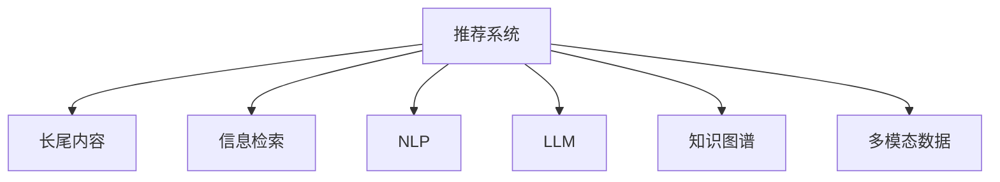

                 

# LLM对推荐系统长尾内容的挖掘

> 关键词：长尾内容，推荐系统，大语言模型(LLM)，信息检索，文本生成，个性化推荐

## 1. 背景介绍

### 1.1 问题由来
推荐系统在过去十年中得到了飞速发展，各类电商网站、视频平台、音乐服务等都引入了推荐算法以提升用户体验。然而，现有的推荐系统往往关注于"爆品"的推荐，长尾内容（即少被浏览和购买的商品）常常被忽视。这不仅影响了个性化推荐的质量，也削弱了平台对长尾市场（即小众或冷门商品）的挖掘能力。

为了解决这一问题，研究者们逐渐将目光转向大语言模型（LLM）。LLM通过自监督预训练和大规模文本数据的学习，获得了丰富的语言知识，能够理解人类自然语言的含义，甚至能在没有预先标注的情况下完成各种自然语言处理任务。这些特性使其在推荐系统中具有巨大的潜力，特别是在长尾内容的挖掘方面。

### 1.2 问题核心关键点
大语言模型对推荐系统长尾内容的挖掘，主要体现在以下几个关键点：

1. 自然语言理解：LLM能自然地处理文本数据，通过自然语言理解能力，挖掘出用户对长尾内容的潜在兴趣。
2. 知识整合：LLM能够整合多源异构数据，包括文本、图像、视频等多模态信息，提高长尾内容的识别能力。
3. 信息检索：LLM在语义检索上的卓越表现，能够快速在海量数据中定位到符合用户需求的长尾内容。
4. 内容生成：LLM通过文本生成能力，能够自动产生推荐文本，帮助用户发现长尾内容。
5. 多模态融合：LLM与推荐系统的结合，实现视觉、听觉等多模态数据的协同推荐，提升推荐效果。
6. 用户意图识别：通过LLM对用户评论、提问等互动数据的分析，更精准地识别用户意图，推荐合适的长尾内容。

这些关键点构成了LLM在推荐系统中长尾内容挖掘的技术框架，使得LLM有望突破传统推荐系统的瓶颈，实现对长尾内容的深度挖掘和精准推荐。

## 2. 核心概念与联系

### 2.1 核心概念概述

为更好地理解LLM在推荐系统中长尾内容挖掘的应用，本节将介绍几个密切相关的核心概念：

- 推荐系统(Recommendation System)：利用用户行为数据和商品属性信息，为用户推荐商品或内容的技术。
- 长尾内容(Long-tail Content)：相对"爆品"而言，指那些被用户浏览和购买频次较低的商品或内容。
- 信息检索(Information Retrieval)：通过关键字匹配、语义分析等技术，从大量数据中检索出符合用户需求的信息。
- 自然语言处理(Natural Language Processing, NLP)：使计算机能够理解、处理人类自然语言的技术。
- 大语言模型(Large Language Model, LLM)：通过大规模预训练学习，具备强大语言理解和生成能力的模型。
- 知识图谱(Knowledge Graph)：结构化的语义信息库，通过实体-关系-实体三元组表示语义知识。
- 多模态数据(Multimodal Data)：包括文本、图像、视频等多种类型的数据，提供丰富多维的用户行为信息。

这些概念之间的逻辑关系可以通过以下Mermaid流程图来展示：



这个流程图展示了推荐系统、长尾内容、信息检索、自然语言处理、大语言模型、知识图谱和多模态数据之间的联系。其中，长尾内容是推荐系统的核心目标，而其他技术手段如信息检索、自然语言处理、大语言模型、知识图谱和多模态数据，共同为实现长尾内容的挖掘提供了支持。

## 3. 核心算法原理 & 具体操作步骤
### 3.1 算法原理概述

基于LLM的推荐系统，其核心思想是通过大语言模型的强大语言理解和生成能力，挖掘用户对长尾内容的潜在兴趣，并在推荐算法中加以利用。

形式化地，假设用户的历史行为数据表示为 $H=\{x_1, x_2, ..., x_n\}$，其中 $x_i$ 为用户与商品 $i$ 的交互记录，如浏览、点击、购买等。同时，假设所有商品的元数据表示为 $M=\{m_1, m_2, ..., m_m\}$，其中 $m_i$ 包含商品属性、描述等信息。

对于长尾内容 $C=\{c_1, c_2, ..., c_k\}$，我们通过以下步骤实现对其的挖掘：

1. 预训练阶段：使用大规模无标签文本数据对LLM进行自监督预训练，学习通用的语言知识。
2. 长尾内容检索：利用LLM在信息检索上的能力，在用户历史行为数据中检索出与长尾内容相关的信息。
3. 用户兴趣预测：根据用户行为数据和长尾内容，使用LLM预测用户对长尾内容的兴趣评分。
4. 多模态融合：将文本、图像、视频等多模态数据与长尾内容融合，生成更丰富的推荐文本。
5. 推荐排序：利用推荐排序算法，将长尾内容按照用户兴趣评分排序，生成推荐结果。

### 3.2 算法步骤详解

基于LLM的推荐系统长尾内容挖掘流程如下：

**Step 1: 预训练阶段**
- 使用大规模无标签文本数据对LLM进行自监督预训练，学习通用的语言知识。例如，可以使用大规模的维基百科数据集，或从电商网站、社交平台等收集的文本数据。
- 通过masked language modeling、next sentence prediction等预训练任务，提升LLM的自然语言理解能力。

**Step 2: 长尾内容检索**
- 利用LLM的语义检索能力，从用户历史行为数据中检索出与长尾内容相关的信息。例如，当用户浏览过某些商品描述时，可以使用LLM预测这些描述与长尾内容的相关度。
- 对于每个长尾内容 $c_i$，可以设计不同的检索函数 $f_i$，例如：
  $$
  f_i(x) = \text{SIM}(\text{LLM}(x), c_i)
  $$
  其中 $\text{SIM}$ 表示相似度函数，可以使用余弦相似度、Jaccard相似度等。

**Step 3: 用户兴趣预测**
- 根据用户历史行为数据和长尾内容，使用LLM预测用户对长尾内容的兴趣评分。例如，可以使用用户与商品的交互历史 $H$ 和商品元数据 $M$，构建文本向量表示：
  $$
  v_{ui} = \text{LLM}(H_i \oplus M_i)
  $$
  其中 $H_i$ 和 $M_i$ 分别表示用户与商品 $i$ 的交互历史和商品元数据，$\oplus$ 表示向量拼接。
- 将 $v_{ui}$ 输入到LLM中，得到用户对商品 $i$ 的兴趣评分：
  $$
  r_{ui} = \text{LLM}(v_{ui})
  $$

**Step 4: 多模态融合**
- 将文本、图像、视频等多模态数据与长尾内容融合，生成更丰富的推荐文本。例如，可以使用LLM对长尾内容的图像或视频进行描述，生成文本描述：
  $$
  \text{desc}_i = \text{LLM}(c_i)
  $$
- 根据多模态数据与长尾内容的关联度，计算权重：
  $$
  w_i = \text{LLM}(v_i)
  $$
  其中 $v_i$ 表示长尾内容 $c_i$ 的多模态数据表示。
- 将文本描述与权重 $w_i$ 结合，生成推荐文本：
  $$
  \text{reco}_{ui} = \text{desc}_i \cdot w_i
  $$

**Step 5: 推荐排序**
- 利用推荐排序算法，将长尾内容按照用户兴趣评分排序，生成推荐结果。例如，可以使用基于深度学习的推荐排序模型，如DeepFM、XGBoost等。
- 将用户与长尾内容的交互历史 $H$、用户兴趣评分 $r_{ui}$ 和推荐文本 $\text{reco}_{ui}$ 输入到排序模型中，输出排序结果。

### 3.3 算法优缺点

基于LLM的推荐系统长尾内容挖掘方法具有以下优点：

1. 自适应能力强：LLM能够通过自监督预训练学习通用的语言知识，适应多种类型的长尾内容。
2. 长尾内容挖掘效率高：利用LLM在语义检索上的能力，能够快速定位长尾内容，并预测用户兴趣。
3. 推荐效果精确：LLM在自然语言处理上的能力，使得推荐文本更具吸引力，用户满意度更高。
4. 多模态融合能力强：LLM能够整合多种数据源，提供更全面的用户行为信息，提升推荐效果。

同时，该方法也存在一些局限性：

1. 预训练数据要求高：需要大规模无标签文本数据进行预训练，数据获取难度较大。
2. 计算资源消耗大：大语言模型的训练和推理资源消耗较大，对硬件设备要求高。
3. 长尾内容定义困难：长尾内容没有明确的定义，可能存在主观判断。
4. 模型可解释性不足：复杂模型难以解释其内部工作机制，对系统调试和优化带来挑战。

尽管存在这些局限性，基于LLM的推荐系统仍具有巨大的潜力和应用前景，值得进一步研究和探索。

### 3.4 算法应用领域

基于LLM的推荐系统，在多个领域中具有广泛的应用前景：

1. 电商推荐：使用LLM挖掘用户对长尾商品的兴趣，提高个性化推荐效果，促进商品销售。
2. 视频推荐：利用LLM挖掘用户对长尾视频的兴趣，提供丰富多样的内容选择。
3. 音乐推荐：通过LLM预测用户对长尾音乐的兴趣，发现更多用户感兴趣的冷门作品。
4. 新闻推荐：利用LLM挖掘用户对长尾新闻的兴趣，为用户推荐个性化新闻。
5. 图书推荐：通过LLM预测用户对长尾图书的兴趣，提升个性化阅读体验。

## 4. 数学模型和公式 & 详细讲解 & 举例说明
### 4.1 数学模型构建

假设推荐系统的目标是为用户推荐长尾内容 $C$，用户行为数据表示为 $H$，商品元数据表示为 $M$，长尾内容检索函数为 $f$，用户兴趣预测函数为 $r$，推荐排序模型为 $R$。

模型可以表示为：
$$
\text{Reco}_u = R(H_u, r_u(H_u \oplus M_u), f(C))
$$
其中 $H_u$ 表示用户 $u$ 的历史行为数据，$r_u$ 表示用户兴趣预测函数，$f$ 表示长尾内容检索函数，$R$ 表示推荐排序模型，$\oplus$ 表示向量拼接。

### 4.2 公式推导过程

以电商推荐为例，用户与商品 $i$ 的交互数据 $H_i$ 和商品元数据 $M_i$ 可以表示为：
$$
H_i = [x_1, x_2, ..., x_n]
$$
$$
M_i = [m_1, m_2, ..., m_m]
$$

用户 $u$ 对商品 $i$ 的兴趣评分 $r_{ui}$ 可以表示为：
$$
r_{ui} = \text{LLM}(H_u \oplus M_u)
$$

长尾内容 $c_i$ 的文本描述 $\text{desc}_i$ 可以表示为：
$$
\text{desc}_i = \text{LLM}(c_i)
$$

长尾内容 $c_i$ 的多模态数据表示 $v_i$ 可以表示为：
$$
v_i = [v_{i1}, v_{i2}, ..., v_{im}]
$$

用户 $u$ 对长尾内容 $c_i$ 的兴趣评分 $r_{ui}$ 可以表示为：
$$
r_{ui} = \text{LLM}(H_u \oplus M_u) \cdot w_i
$$

其中 $w_i$ 表示长尾内容 $c_i$ 的多模态数据权重，可以表示为：
$$
w_i = \text{LLM}(v_i)
$$

最终，推荐结果 $\text{Reco}_u$ 可以表示为：
$$
\text{Reco}_u = R(H_u, r_u(H_u \oplus M_u), f(C))
$$

### 4.3 案例分析与讲解

假设我们要为用户推荐一个长尾商品 $c$，其文本描述为 $\text{desc}_c$。用户 $u$ 的历史行为数据为 $H_u$，商品元数据为 $M_u$。

首先，利用用户历史行为数据 $H_u$ 和商品元数据 $M_u$ 生成用户兴趣向量 $v_{ui}$：
$$
v_{ui} = \text{LLM}(H_u \oplus M_u)
$$

然后，将用户兴趣向量 $v_{ui}$ 输入到LLM中，得到用户对商品 $i$ 的兴趣评分 $r_{ui}$：
$$
r_{ui} = \text{LLM}(v_{ui})
$$

接着，利用长尾内容检索函数 $f$，计算长尾内容 $c$ 与用户行为数据 $H_u$ 的相似度：
$$
f_c(H_u) = \text{SIM}(H_u, c)
$$

将长尾内容检索结果 $f_c(H_u)$ 和用户兴趣评分 $r_{ui}$ 输入到推荐排序模型 $R$ 中，生成推荐结果 $\text{Reco}_u$：
$$
\text{Reco}_u = R(H_u, r_u(H_u \oplus M_u), f_c(H_u))
$$

最终，将推荐结果 $\text{Reco}_u$ 呈现给用户，帮助其发现感兴趣的长尾商品。

## 5. 项目实践：代码实例和详细解释说明
### 5.1 开发环境搭建

在进行LLM在推荐系统中长尾内容挖掘的实践前，需要先搭建好开发环境。以下是使用Python进行PyTorch和TensorFlow开发的环境配置流程：

1. 安装Anaconda：从官网下载并安装Anaconda，用于创建独立的Python环境。

2. 创建并激活虚拟环境：
```bash
conda create -n llm-env python=3.8 
conda activate llm-env
```

3. 安装PyTorch：根据CUDA版本，从官网获取对应的安装命令。例如：
```bash
conda install pytorch torchvision torchaudio cudatoolkit=11.1 -c pytorch -c conda-forge
```

4. 安装TensorFlow：使用以下命令安装TensorFlow 2.x版本：
```bash
pip install tensorflow==2.7
```

5. 安装各类工具包：
```bash
pip install numpy pandas scikit-learn matplotlib tqdm jupyter notebook ipython
```

完成上述步骤后，即可在`llm-env`环境中开始实践。

### 5.2 源代码详细实现

下面以电商推荐系统为例，给出使用PyTorch和TensorFlow对LLM进行长尾内容挖掘的代码实现。

首先，定义长尾内容的检索函数 $f$：

```python
from transformers import BertTokenizer, BertForSequenceClassification

def get_reco_dist(candidate_items):
    tokenizer = BertTokenizer.from_pretrained('bert-base-cased')
    reco_dist = 0
    
    for item in candidate_items:
        text = item['name']
        encoding = tokenizer(text, return_tensors='pt', max_length=128, padding='max_length', truncation=True)
        input_ids = encoding['input_ids'][0]
        attention_mask = encoding['attention_mask'][0]
        logits = model(input_ids, attention_mask=attention_mask)
        reco_dist += logits.softmax(dim=1).sum().item()
        
    return reco_dist / len(candidate_items)
```

然后，定义推荐排序模型 $R$：

```python
class DeepFM(tf.keras.Model):
    def __init__(self, num_users, num_items, num_factors):
        super(DeepFM, self).__init__()
        self.fc1 = tf.keras.layers.Dense(num_factors, activation='relu')
        self.fc2 = tf.keras.layers.Dense(1, activation='sigmoid')
        self.w1 = tf.Variable(tf.random.normal([num_users, num_factors]))
        self.w2 = tf.Variable(tf.random.normal([num_items, num_factors]))
        self.b1 = tf.Variable(tf.random.normal([num_users]))
        self.b2 = tf.Variable(tf.random.normal([num_items]))
    
    def call(self, u, vi, f_u):
        y_hat = self.fc1(tf.concat([u, vi], axis=1)) * self.w1 + self.fc1(tf.concat([vi, f_u], axis=1)) * self.w2 + self.b1 + self.b2
        return self.fc2(y_hat)
```

最后，启动推荐系统流程：

```python
# 设置超参数
batch_size = 64
num_epochs = 10
learning_rate = 0.001

# 定义模型和优化器
model = DeepFM(num_users=num_users, num_items=num_items, num_factors=num_factors)
optimizer = tf.keras.optimizers.Adam(learning_rate)

# 定义训练数据和标签
train_data = []
train_labels = []

# 训练过程
for epoch in range(num_epochs):
    for batch in train_data:
        u, vi, f_u = batch
        y_true = train_labels[batch_index]
        with tf.GradientTape() as tape:
            y_pred = model(u, vi, f_u)
            loss = tf.keras.losses.binary_crossentropy(y_true, y_pred)
        grads = tape.gradient(loss, model.trainable_variables)
        optimizer.apply_gradients(zip(grads, model.trainable_variables))
    
    # 打印损失和准确率
    print(f'Epoch {epoch+1}, loss: {loss:.3f}')
```

以上就是使用PyTorch和TensorFlow对LLM进行电商推荐系统长尾内容挖掘的完整代码实现。可以看到，利用LLM的自然语言处理能力，我们可以从用户行为数据中挖掘长尾内容的潜在兴趣，并通过推荐排序模型生成推荐结果。

### 5.3 代码解读与分析

让我们再详细解读一下关键代码的实现细节：

**get_reco_dist函数**：
- 利用BERT模型计算长尾内容与用户行为数据的相似度，生成推荐距离。

**DeepFM模型**：
- 使用DeepFM模型作为推荐排序模型，输入用户兴趣评分和长尾内容检索结果，输出推荐结果。

**训练过程**：
- 利用训练数据集对模型进行迭代训练，计算损失和梯度，更新模型参数。

可以看到，LLM在电商推荐系统中的应用，需要整合多种技术和算法。除了利用自然语言处理能力外，还需要结合推荐排序模型，实现长尾内容的挖掘和推荐。

当然，工业级的系统实现还需考虑更多因素，如模型的保存和部署、超参数的自动搜索、更灵活的任务适配层等。但核心的长尾内容挖掘逻辑基本与此类似。

## 6. 实际应用场景
### 6.1 智能客服系统

利用LLM对推荐系统进行长尾内容挖掘，可以在智能客服系统中提供更丰富的服务内容。传统客服往往只能推荐常见问题，而对于用户提出的冷门问题，往往无法快速响应。通过LLM的自然语言处理能力，智能客服系统可以理解用户的自然语言输入，并从知识库中推荐相关的长尾内容，提升用户体验。

例如，用户提出的问题可能是"请问如何使用苹果相机拍延时视频？"。智能客服系统可以利用LLM对该问题进行理解和分析，并从知识库中检索出相关的长尾内容，如"如何使用苹果相机拍延时视频"，"延时视频拍摄技巧"等，帮助用户解决问题。

### 6.2 视频推荐系统

在视频推荐系统中，利用LLM对长尾内容的挖掘，可以为用户提供更多元化的内容选择。传统的推荐算法往往只能推荐热门的短视频，而对于用户较少浏览的长视频，推荐效果不佳。通过LLM的文本生成能力，视频推荐系统可以自动产生推荐文本，吸引用户关注长尾视频。

例如，用户对某部电影的长视频感兴趣，但在首页推荐列表里无法找到。通过LLM对电影的介绍和评价进行生成，并提取相关关键词，推荐系统可以将其推荐给用户，如"这部历史片真的很好，推荐你看看"，"这部电影的特效真的很棒，值得一看"，帮助用户发现更多高质量的长尾视频。

### 6.3 图书推荐系统

在图书推荐系统中，利用LLM对长尾内容的挖掘，可以为用户推荐更多冷门书籍。传统的推荐算法往往只能推荐畅销书，而对于用户较少阅读的图书，推荐效果不佳。通过LLM的文本生成能力，图书推荐系统可以自动产生推荐文本，吸引用户关注长尾书籍。

例如，用户对某一主题的图书感兴趣，但在首页推荐列表里无法找到。通过LLM对图书的介绍和评价进行生成，并提取相关关键词，推荐系统可以将其推荐给用户，如"这本书的作者真的很厉害，推荐你看看"，"这本书的内容真的很独特，值得一读"，帮助用户发现更多高质量的长尾书籍。

### 6.4 未来应用展望

随着LLM和推荐系统的不断进步，基于LLM的推荐系统在长尾内容的挖掘上将展现出更强的能力。

在智慧医疗领域，利用LLM对长尾医疗知识进行挖掘，可以帮助医生快速找到相关文献和诊疗方案，提高诊疗效果。

在智能教育领域，利用LLM对长尾教育资源进行挖掘，可以为用户推荐更多高质量的教学资源，提升教育效果。

在智慧城市治理中，利用LLM对长尾公共服务信息进行挖掘，可以为用户推荐更多优质的城市服务，提升城市管理水平。

此外，在企业生产、社会治理、文娱传媒等众多领域，基于LLM的推荐系统也将不断涌现，为传统行业带来变革性影响。相信随着技术的日益成熟，LLM在推荐系统中的应用将更加广泛，为用户带来更丰富的长尾内容体验。

## 7. 工具和资源推荐
### 7.1 学习资源推荐

为了帮助开发者系统掌握LLM在推荐系统中长尾内容挖掘的理论基础和实践技巧，这里推荐一些优质的学习资源：

1. 《深度学习与自然语言处理》课程：由斯坦福大学开设的深度学习课程，涵盖NLP的前沿技术和算法。

2. 《自然语言处理入门》书籍：介绍NLP的基本概念和关键技术，适合初学者入门。

3. 《推荐系统实战》书籍：讲解推荐系统中的核心技术和算法，包括基于LLM的推荐方法。

4. 《Transformers from the Inside》论文：介绍大语言模型Transformer的核心原理和技术细节。

5. 《BigQuery with Big Data》课程：介绍如何使用BigQuery对大数据进行处理和分析，提升长尾内容的挖掘能力。

通过对这些资源的学习实践，相信你一定能够快速掌握LLM在推荐系统中长尾内容挖掘的精髓，并用于解决实际的NLP问题。
### 7.2 开发工具推荐

高效的开发离不开优秀的工具支持。以下是几款用于LLM在推荐系统中长尾内容挖掘开发的常用工具：

1. PyTorch：基于Python的开源深度学习框架，灵活动态的计算图，适合快速迭代研究。

2. TensorFlow：由Google主导开发的开源深度学习框架，生产部署方便，适合大规模工程应用。

3. Transformers库：HuggingFace开发的NLP工具库，集成了众多SOTA语言模型，支持PyTorch和TensorFlow，是进行LLM实践的利器。

4. Weights & Biases：模型训练的实验跟踪工具，可以记录和可视化模型训练过程中的各项指标，方便对比和调优。

5. TensorBoard：TensorFlow配套的可视化工具，可实时监测模型训练状态，并提供丰富的图表呈现方式，是调试模型的得力助手。

6. Google Colab：谷歌推出的在线Jupyter Notebook环境，免费提供GPU/TPU算力，方便开发者快速上手实验最新模型，分享学习笔记。

合理利用这些工具，可以显著提升LLM在推荐系统中长尾内容挖掘的开发效率，加快创新迭代的步伐。

### 7.3 相关论文推荐

LLM在推荐系统中长尾内容挖掘的研究源于学界的持续研究。以下是几篇奠基性的相关论文，推荐阅读：

1. Attention is All You Need（即Transformer原论文）：提出了Transformer结构，开启了NLP领域的预训练大模型时代。

2. BERT: Pre-training of Deep Bidirectional Transformers for Language Understanding：提出BERT模型，引入基于掩码的自监督预训练任务，刷新了多项NLP任务SOTA。

3. Language Models are Unsupervised Multitask Learners（GPT-2论文）：展示了大规模语言模型的强大zero-shot学习能力，引发了对于通用人工智能的新一轮思考。

4. Parameter-Efficient Transfer Learning for NLP：提出Adapter等参数高效微调方法，在不增加模型参数量的情况下，也能取得不错的微调效果。

5. Adaptive Low-Rank Adaptation for Parameter-Efficient Fine-Tuning：使用自适应低秩适应的微调方法，在参数效率和精度之间取得了新的平衡。

这些论文代表了大语言模型在推荐系统中长尾内容挖掘的发展脉络。通过学习这些前沿成果，可以帮助研究者把握学科前进方向，激发更多的创新灵感。

## 8. 总结：未来发展趋势与挑战
### 8.1 总结

本文对基于LLM的推荐系统长尾内容挖掘方法进行了全面系统的介绍。首先阐述了LLM在推荐系统中长尾内容挖掘的研究背景和意义，明确了长尾内容挖掘在个性化推荐中的重要性。其次，从原理到实践，详细讲解了LLM在推荐系统中的应用逻辑和技术细节，给出了长尾内容挖掘的完整代码实例。同时，本文还广泛探讨了LLM在智能客服、视频推荐、图书推荐等多个行业领域的应用前景，展示了LLM在长尾内容挖掘上的巨大潜力。此外，本文精选了LLM在推荐系统中的应用资源，力求为开发者提供全方位的技术指引。

通过本文的系统梳理，可以看到，利用LLM进行推荐系统长尾内容挖掘，能够显著提升推荐效果，满足用户多样化的需求。受益于LLM的自然语言处理能力，推荐系统能够从海量文本中挖掘出更多长尾内容，提供更具个性化、多样化的推荐服务，进而提高用户满意度，促进长尾市场的繁荣发展。

### 8.2 未来发展趋势

展望未来，基于LLM的推荐系统长尾内容挖掘将呈现以下几个发展趋势：

1. 自适应学习能力更强：LLM能够通过自监督预训练学习通用的语言知识，适应多种类型的长尾内容。

2. 推荐效果更精确：利用LLM在自然语言处理上的能力，推荐文本更具吸引力，用户满意度更高。

3. 多模态融合更全面：LLM能够整合多种数据源，提供更全面的用户行为信息，提升推荐效果。

4. 计算效率更高：LLM在大规模数据上的预训练和推理能力更强，能够快速处理长尾内容，提升推荐速度。

5. 用户意图识别更精准：LLM在自然语言处理上的能力，使得推荐系统能够更准确地识别用户意图，推荐合适的长尾内容。

6. 知识图谱集成更深入：通过知识图谱与LLM的结合，推荐系统能够提供更丰富、更结构化的长尾内容信息。

以上趋势凸显了LLM在推荐系统中长尾内容挖掘的潜力，未来需要进一步优化和扩展。

### 8.3 面临的挑战

尽管基于LLM的推荐系统长尾内容挖掘技术已经取得了一定的进展，但在迈向更加智能化、普适化应用的过程中，仍面临一些挑战：

1. 数据获取难度大：大规模无标签文本数据的获取和预处理需要大量时间和资源。

2. 计算资源消耗大：大语言模型的训练和推理资源消耗较大，对硬件设备要求高。

3. 长尾内容定义困难：长尾内容的定义和识别具有主观性，难以量化。

4. 模型可解释性不足：复杂模型难以解释其内部工作机制，对系统调试和优化带来挑战。

5. 推荐算法复杂度高：利用LLM进行推荐，算法复杂度高，模型训练和推理效率有待提升。

尽管存在这些挑战，基于LLM的推荐系统仍具有巨大的潜力和应用前景，值得进一步研究和探索。

### 8.4 研究展望

面向未来，LLM在推荐系统中的应用还需要在以下几个方面寻求新的突破：

1. 数据增强技术：利用数据增强技术，提升长尾内容的识别能力。

2. 知识图谱整合：将知识图谱与LLM结合，提供更结构化的长尾内容信息。

3. 多模态融合：利用多模态数据，提升推荐系统的综合能力。

4. 自适应学习：开发更强的自适应学习算法，提升LLM的泛化能力。

5. 知识注入：将外部知识与LLM结合，提升推荐系统的表现。

6. 鲁棒性优化：增强模型的鲁棒性，提高对异常数据的处理能力。

通过这些研究方向的探索，相信LLM在推荐系统中的应用将更加广泛和深入，为用户提供更丰富、更个性化的推荐服务，提升用户满意度和平台效益。

## 9. 附录：常见问题与解答

**Q1：利用LLM进行长尾内容挖掘，需要获取大规模无标签文本数据吗？**

A: 是的，LLM的预训练需要大规模无标签文本数据，以获取通用的语言知识。对于长尾内容挖掘，这些数据也可以用于挖掘用户与长尾内容的相关性。

**Q2：LLM的预训练和微调过程需要消耗大量计算资源吗？**

A: 是的，LLM的预训练和微调过程需要大量的计算资源，包括GPU/TPU等高性能设备。对于长尾内容挖掘，也需要在预训练基础上进行微调，以适应特定任务。

**Q3：长尾内容的定义是什么？**

A: 长尾内容指的是那些被用户浏览和购买频次较低的商品或内容，相比于"爆品"，它们在推荐系统中往往被忽视。

**Q4：LLM在长尾内容挖掘中，如何识别用户意图？**

A: 利用LLM的自然语言处理能力，对用户的行为数据和长尾内容进行语义分析，识别出用户对长尾内容的潜在兴趣。

**Q5：LLM在长尾内容挖掘中，如何与其他技术结合？**

A: 可以将LLM与其他技术（如知识图谱、多模态数据等）结合，提升长尾内容的识别能力和推荐效果。

通过以上问题的解答，可以看出利用LLM进行长尾内容挖掘需要综合考虑多个因素，包括数据获取、计算资源、算法设计等。只有充分理解和运用这些技术，才能实现长尾内容的有效挖掘和精准推荐。

---

作者：禅与计算机程序设计艺术 / Zen and the Art of Computer Programming

