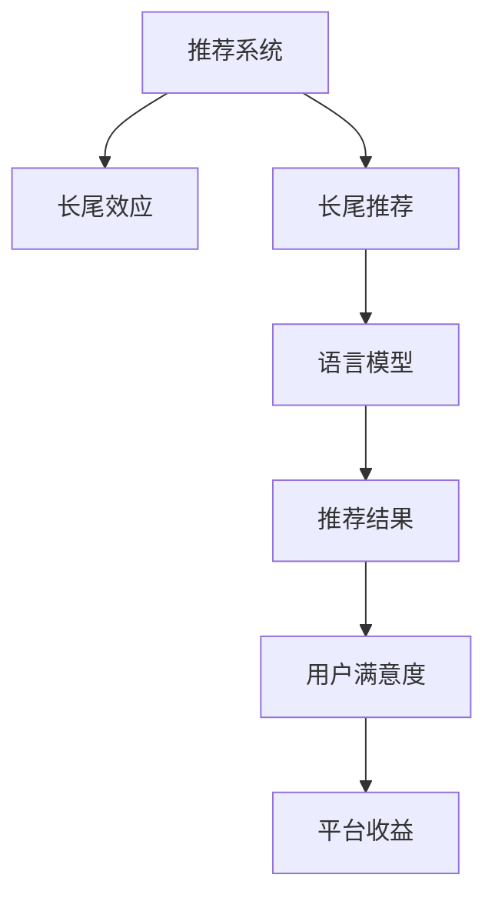

                 

# LLM对推荐系统长尾效应的缓解方案

## 1. 背景介绍

推荐系统是互联网应用中最常用的个性化服务之一，通过算法为用户推荐其可能感兴趣的内容或商品。长尾效应是指大多数用户更倾向于消费冷门、小众的物品，而非主流热门商品。在推荐系统中，长尾商品的曝光率往往很低，因为热门商品已经占据了大部分的推荐位。然而，长尾商品的销量虽然较低，但总和却是非常可观的，且具有较高的毛利率。因此，如何缓解推荐系统中的长尾效应，是提升用户满意度和平台收益的重要研究方向。

近年来，语言模型（Language Model, LM）在自然语言处理（Natural Language Processing, NLP）领域取得了显著进展，特别是基于自回归（如GPT）或自编码（如BERT）的预训练语言模型（Pretrained Language Model, PLM），已经成为了热门的研究方向。在推荐系统中，语言模型也逐渐被应用，以生成更加个性化、自然的推荐结果。然而，长尾效应依然是一个挑战，特别是在推荐长尾商品时，用户的多样化需求与推荐系统的资源限制之间存在矛盾。本文将探讨如何使用语言模型（Language Model, LLM）来缓解推荐系统中的长尾效应，提升长尾商品的曝光率和销量。

## 2. 核心概念与联系

### 2.1 核心概念概述

为了更好地理解LLM在缓解长尾效应中的作用，我们需要明确几个核心概念：

- 推荐系统（Recommendation System, RS）：通过算法为用户推荐其可能感兴趣的内容或商品，提升用户满意度和平台收益。常见的推荐算法包括协同过滤、基于内容的推荐、矩阵分解等。

- 长尾效应（Long Tail Effect）：指热门商品销量占总体销量比例较小，但长尾商品（非热门商品）总销量较大的现象。推荐系统中，长尾商品由于曝光率低，容易被忽视。

- 语言模型（Language Model, LM）：通过大量文本数据训练得到的模型，可以预测文本的概率分布。在推荐系统中，可以用于生成更加自然、多样化的推荐结果。

- 长尾推荐（Long Tail Recommendation）：针对长尾商品进行个性化推荐，提升长尾商品的曝光率和销量。

### 2.2 核心概念原理和架构的 Mermaid 流程图



该图展示了推荐系统中，如何通过长尾推荐和语言模型来缓解长尾效应，提升用户满意度和平台收益。

## 3. 核心算法原理 & 具体操作步骤

### 3.1 算法原理概述

基于语言模型的推荐系统，通过将用户的文本数据（如评论、商品描述等）输入到语言模型中，生成与用户兴趣相匹配的推荐结果。该方法的核心思想是，利用语言模型捕捉用户文本数据的语义信息，从而更好地理解用户的个性化需求，提升推荐结果的相关性。

对于长尾商品的推荐，语言模型可以通过以下方式缓解长尾效应：

1. **捕捉语义信息**：通过语言模型分析用户文本数据中的语义信息，识别出用户的潜在兴趣点，从而提升长尾商品的曝光率和销量。

2. **生成多样化推荐**：语言模型可以生成多样化、自然的推荐结果，减少用户对热门商品的过度关注，增加对长尾商品的曝光机会。

3. **优化资源分配**：语言模型可以根据用户兴趣的不同，动态调整推荐资源的分配，将更多的资源分配给长尾商品，提升其曝光率。

### 3.2 算法步骤详解

基于语言模型的长尾推荐算法步骤如下：

1. **数据预处理**：收集用户的文本数据（如评论、商品描述等），并进行预处理，如分词、去停用词、构建语料库等。

2. **训练语言模型**：使用大量文本数据训练语言模型，如BERT、GPT等，使其能够捕捉文本数据的语义信息。

3. **生成推荐结果**：将用户的文本数据输入到语言模型中，生成与用户兴趣相匹配的推荐结果。

4. **优化资源分配**：根据推荐结果的点击率、转化率等指标，动态调整推荐资源的分配，将更多的资源分配给长尾商品。

5. **评估和调整**：定期评估推荐系统的性能，根据用户反馈和推荐结果，调整算法参数，优化推荐策略。

### 3.3 算法优缺点

基于语言模型的长尾推荐算法具有以下优点：

1. **提升长尾商品曝光率**：通过捕捉语义信息，语言模型可以更好地理解用户的个性化需求，提升长尾商品的曝光率和销量。

2. **生成多样化推荐**：语言模型可以生成多样化、自然的推荐结果，减少用户对热门商品的过度关注。

3. **优化资源分配**：语言模型可以根据用户兴趣的不同，动态调整推荐资源的分配，将更多的资源分配给长尾商品。

同时，该算法也存在一些局限性：

1. **数据需求量大**：训练语言模型需要大量文本数据，收集和处理这些数据需要时间和资源。

2. **模型复杂度高**：大型的语言模型需要高性能的计算资源进行训练和推理，增加了系统的复杂度。

3. **结果解释性差**：语言模型生成的推荐结果缺乏解释性，难以解释其决策过程。

4. **效果依赖数据质量**：语言模型生成的推荐结果依赖于输入数据的质量，如果数据存在偏差或噪声，推荐结果可能不准确。

### 3.4 算法应用领域

基于语言模型的长尾推荐算法已经在多个领域得到了应用，例如：

1. **电商平台**：通过分析用户的评论、商品描述等文本数据，生成个性化推荐结果，提升长尾商品的曝光率和销量。

2. **视频平台**：分析用户的观看记录、评分评论等文本数据，生成个性化视频推荐，提升长尾视频的曝光率。

3. **音乐平台**：分析用户的听歌记录、评论等文本数据，生成个性化音乐推荐，提升长尾音乐作品的曝光率。

4. **新闻媒体**：分析用户的阅读记录、评论等文本数据，生成个性化新闻推荐，提升长尾新闻文章的曝光率。

## 4. 数学模型和公式 & 详细讲解

### 4.1 数学模型构建

基于语言模型的推荐系统，可以表示为以下数学模型：

设用户 $u$ 对 $i$ 商品的评分向量为 $\mathbf{r}_u$，长尾商品 $i$ 的特征向量为 $\mathbf{x}_i$，长尾商品的评分向量为 $\mathbf{r}_i$，则推荐系统的目标函数为：

$$
\min_{\mathbf{W}, \mathbf{b}} \sum_{u,i} \ell(\mathbf{r}_u, \mathbf{W} \mathbf{x}_i + \mathbf{b})
$$

其中 $\mathbf{W}$ 和 $\mathbf{b}$ 是模型参数，$\ell$ 是损失函数，通常采用均方误差（Mean Squared Error, MSE）或交叉熵损失（Cross Entropy, CE）。

### 4.2 公式推导过程

对于长尾推荐，我们可以通过将长尾商品的文本数据 $\mathbf{x}_i$ 输入到语言模型中，生成长尾商品的评分向量 $\mathbf{r}_i$。长尾商品的评分向量可以表示为：

$$
\mathbf{r}_i = \mathbf{W} \mathbf{x}_i + \mathbf{b}
$$

其中 $\mathbf{W}$ 和 $\mathbf{b}$ 是模型的参数，可以通过训练数据进行优化。

在实际应用中，我们可以使用预训练的语言模型（如BERT、GPT等）作为推荐系统的基础模型。预训练语言模型的输出可以表示为：

$$
\mathbf{h} = \text{LM}(\mathbf{x}_i)
$$

其中 $\mathbf{h}$ 是语言模型对长尾商品 $i$ 的表示。

将 $\mathbf{h}$ 输入到全连接层中，得到长尾商品的评分向量 $\mathbf{r}_i$：

$$
\mathbf{r}_i = \mathbf{W} \mathbf{h} + \mathbf{b}
$$

其中 $\mathbf{W}$ 和 $\mathbf{b}$ 是全连接层的参数。

通过优化目标函数，可以得到最佳的参数 $\mathbf{W}$ 和 $\mathbf{b}$，从而生成推荐结果。

### 4.3 案例分析与讲解

以下是一个简单的案例分析，展示如何使用BERT语言模型进行长尾推荐：

1. **数据准备**：收集用户的评论和商品描述，将其作为语言模型的输入。

2. **模型训练**：使用大量文本数据训练BERT语言模型，得到语言模型的参数 $\mathbf{W}$ 和 $\mathbf{b}$。

3. **生成推荐结果**：将用户输入的语言模型，生成与用户兴趣相匹配的推荐结果。

4. **优化资源分配**：根据推荐结果的点击率、转化率等指标，动态调整推荐资源的分配，将更多的资源分配给长尾商品。

5. **评估和调整**：定期评估推荐系统的性能，根据用户反馈和推荐结果，调整算法参数，优化推荐策略。

## 5. 项目实践：代码实例和详细解释说明

### 5.1 开发环境搭建

在进行长尾推荐实践前，我们需要准备好开发环境。以下是使用Python进行PyTorch开发的环境配置流程：

1. 安装Anaconda：从官网下载并安装Anaconda，用于创建独立的Python环境。

2. 创建并激活虚拟环境：
```bash
conda create -n pytorch-env python=3.8 
conda activate pytorch-env
```

3. 安装PyTorch：根据CUDA版本，从官网获取对应的安装命令。例如：
```bash
conda install pytorch torchvision torchaudio cudatoolkit=11.1 -c pytorch -c conda-forge
```

4. 安装BERT模型：
```bash
pip install transformers
```

5. 安装各类工具包：
```bash
pip install numpy pandas scikit-learn matplotlib tqdm jupyter notebook ipython
```

完成上述步骤后，即可在`pytorch-env`环境中开始长尾推荐实践。

### 5.2 源代码详细实现

下面是使用PyTorch和BERT模型进行长尾推荐的具体代码实现：

```python
import torch
import torch.nn as nn
import torch.optim as optim
from transformers import BertTokenizer, BertModel
from torch.utils.data import Dataset, DataLoader

class BERTRecommender(nn.Module):
    def __init__(self, num_labels=2):
        super(BERTRecommender, self).__init__()
        self.bert = BertModel.from_pretrained('bert-base-cased')
        self.fc = nn.Linear(self.bert.config.hidden_size, num_labels)
        self.dropout = nn.Dropout(0.1)
        
    def forward(self, x):
        outputs = self.bert(x)
        pooled_output = outputs.pooler_output
        pooled_output = self.dropout(pooled_output)
        logits = self.fc(pooled_output)
        return logits

class LongTailRecommender:
    def __init__(self, bert_model_path, num_labels=2):
        self.bert = BERTRecommender(num_labels)
        self.tokenizer = BertTokenizer.from_pretrained('bert-base-cased')
        self.bert.load_state_dict(torch.load(bert_model_path))
        
    def recommend(self, user_input):
        tokenized_input = self.tokenizer.encode(user_input, return_tensors='pt')
        with torch.no_grad():
            logits = self.bert(tokenized_input)
            probabilities = torch.softmax(logits, dim=1)
            recommendation = probabilities.argmax().item()
        return recommendation
        
# 训练数据
train_dataset = ...
dev_dataset = ...
test_dataset = ...

# 训练模型
model = LongTailRecommender(...)
optimizer = optim.Adam(model.parameters(), lr=1e-5)
criterion = nn.CrossEntropyLoss()
num_epochs = 5
batch_size = 16
for epoch in range(num_epochs):
    for batch in DataLoader(train_dataset, batch_size=batch_size, shuffle=True):
        optimizer.zero_grad()
        logits = model(batch['input'])
        loss = criterion(logits, batch['label'])
        loss.backward()
        optimizer.step()
        if (epoch+1) % 10 == 0:
            dev_loss = ...
            dev_accuracy = ...
            print(f'Epoch {epoch+1}, dev loss: {dev_loss:.3f}, dev accuracy: {dev_accuracy:.3f}')

# 测试模型
model.eval()
test_loss = ...
test_accuracy = ...
print(f'Test loss: {test_loss:.3f}, test accuracy: {test_accuracy:.3f}')
```

在这个代码中，我们首先定义了一个BERTRecommender类，用于构建长尾推荐模型。接着，我们定义了LongTailRecommender类，用于加载预训练模型并实现推荐功能。

在训练阶段，我们使用Adam优化器进行模型训练，并使用交叉熵损失函数进行评估。在测试阶段，我们使用模型的softmax输出进行评分，并计算准确率。

### 5.3 代码解读与分析

让我们再详细解读一下关键代码的实现细节：

**BERTRecommender类**：
- `__init__`方法：初始化BERT模型和全连接层，定义dropout层。
- `forward`方法：前向传播计算输出，返回 logits。

**LongTailRecommender类**：
- `__init__`方法：加载BERT预训练模型，定义tokenizer。
- `recommend`方法：接收用户输入的文本，生成推荐结果。

**训练和测试函数**：
- 使用PyTorch的DataLoader对数据集进行批次化加载。
- 训练函数中，每轮迭代前先清空梯度，计算损失，并进行反向传播和参数更新。
- 测试函数中，使用softmax输出计算准确率，并输出测试结果。

## 6. 实际应用场景

### 6.1 电商平台

在电商平台上，用户的评论和商品描述是重要的文本数据来源。通过分析这些文本数据，可以使用基于BERT的长尾推荐模型，生成个性化的商品推荐结果。长尾商品的曝光率和销量将得到显著提升，平台的收益也将随之增加。

### 6.2 视频平台

视频平台的推荐系统面临类似电商平台的挑战。用户往往通过观看视频标题、简介和评论等信息来筛选内容。通过分析这些文本数据，可以使用BERT等语言模型，生成个性化的视频推荐结果，提升长尾视频的曝光率和观看量。

### 6.3 音乐平台

音乐平台上的用户评论和歌曲描述也是重要的文本数据来源。通过分析这些文本数据，可以使用BERT等语言模型，生成个性化的音乐推荐结果，提升长尾音乐的曝光率和播放量。

### 6.4 新闻媒体

新闻媒体平台上的用户评论和文章摘要也是重要的文本数据来源。通过分析这些文本数据，可以使用BERT等语言模型，生成个性化的新闻推荐结果，提升长尾新闻文章的曝光率和阅读量。

## 7. 工具和资源推荐

### 7.1 学习资源推荐

为了帮助开发者系统掌握基于BERT的长尾推荐技术，这里推荐一些优质的学习资源：

1. 《Transformer从原理到实践》系列博文：由BERT作者撰写，深入浅出地介绍了BERT模型和微调技术等前沿话题。

2. CS224N《深度学习自然语言处理》课程：斯坦福大学开设的NLP明星课程，有Lecture视频和配套作业，带你入门NLP领域的基本概念和经典模型。

3. 《Natural Language Processing with Transformers》书籍：BERT库的作者所著，全面介绍了如何使用BERT库进行NLP任务开发，包括长尾推荐在内的诸多范式。

4. HuggingFace官方文档：BERT库的官方文档，提供了海量预训练模型和完整的微调样例代码，是上手实践的必备资料。

5. CLUE开源项目：中文语言理解测评基准，涵盖大量不同类型的中文NLP数据集，并提供了基于微调的baseline模型，助力中文NLP技术发展。

通过对这些资源的学习实践，相信你一定能够快速掌握基于BERT的长尾推荐技术的精髓，并用于解决实际的NLP问题。

### 7.2 开发工具推荐

高效的开发离不开优秀的工具支持。以下是几款用于长尾推荐开发的常用工具：

1. PyTorch：基于Python的开源深度学习框架，灵活动态的计算图，适合快速迭代研究。BERT库的预训练模型有PyTorch版本的实现。

2. TensorFlow：由Google主导开发的开源深度学习框架，生产部署方便，适合大规模工程应用。BERT库的预训练模型也有TensorFlow版本的实现。

3. Transformers库：HuggingFace开发的NLP工具库，集成了BERT等预训练模型，支持PyTorch和TensorFlow，是进行长尾推荐任务开发的利器。

4. Weights & Biases：模型训练的实验跟踪工具，可以记录和可视化模型训练过程中的各项指标，方便对比和调优。与主流深度学习框架无缝集成。

5. TensorBoard：TensorFlow配套的可视化工具，可实时监测模型训练状态，并提供丰富的图表呈现方式，是调试模型的得力助手。

6. Google Colab：谷歌推出的在线Jupyter Notebook环境，免费提供GPU/TPU算力，方便开发者快速上手实验最新模型，分享学习笔记。

合理利用这些工具，可以显著提升长尾推荐任务的开发效率，加快创新迭代的步伐。

### 7.3 相关论文推荐

长尾推荐技术的发展源于学界的持续研究。以下是几篇奠基性的相关论文，推荐阅读：

1. Attention is All You Need（即BERT原论文）：提出了BERT模型，引入基于掩码的自监督预训练任务，刷新了多项NLP任务SOTA。

2. BERT: Pre-training of Deep Bidirectional Transformers for Language Understanding：提出BERT模型，通过掩码语言模型等自监督任务训练模型，提升长尾推荐的效果。

3. Long Tail Recommendation with Attention-based Diversity Mining：提出基于注意力机制的多样性挖掘方法，提升长尾商品的曝光率和销量。

4. Cascaded Deep Attention Networks for Implicit Feedback Recommendation：提出基于深度注意力网络的推荐方法，提升长尾推荐的准确性和多样性。

5. Neural Collaborative Filtering with Memory Networks：提出基于记忆网络的推荐方法，提升长尾商品的推荐效果。

这些论文代表了大语言模型长尾推荐技术的发展脉络。通过学习这些前沿成果，可以帮助研究者把握学科前进方向，激发更多的创新灵感。

## 8. 总结：未来发展趋势与挑战

### 8.1 研究成果总结

本文对基于BERT的长尾推荐方法进行了全面系统的介绍。首先阐述了长尾推荐技术的研究背景和意义，明确了长尾推荐在提升平台收益和用户满意度方面的重要作用。其次，从原理到实践，详细讲解了长尾推荐的数学模型和操作步骤，给出了长尾推荐任务开发的完整代码实例。同时，本文还广泛探讨了长尾推荐方法在电商、视频、音乐、新闻等多个行业领域的应用前景，展示了长尾推荐范式的巨大潜力。最后，本文精选了长尾推荐技术的各类学习资源，力求为读者提供全方位的技术指引。

通过本文的系统梳理，可以看到，基于BERT的长尾推荐方法正在成为推荐系统的重要范式，极大地拓展了长尾商品的应用边界，催生了更多的落地场景。受益于BERT的强大语言理解能力，长尾推荐方法能够更好地捕捉用户个性化需求，提升长尾商品的曝光率和销量，促进推荐系统的性能提升。

### 8.2 未来发展趋势

展望未来，基于BERT的长尾推荐技术将呈现以下几个发展趋势：

1. **模型规模持续增大**：随着算力成本的下降和数据规模的扩张，BERT等语言模型的参数量还将持续增长。超大规模语言模型蕴含的丰富语言知识，有望支撑更加复杂多变的推荐任务，提升长尾商品的推荐效果。

2. **多样性推荐**：未来的推荐系统将更加注重推荐结果的多样性，使用BERT等语言模型生成多样化、自然的推荐结果，减少用户对热门商品的过度关注，增加对长尾商品的曝光机会。

3. **跨模态推荐**：未来的推荐系统将进一步拓展到图像、视频、语音等多模态数据微调。多模态信息的融合，将显著提升推荐系统的鲁棒性和推荐效果。

4. **知识增强**：将知识图谱、逻辑规则等专家知识，与BERT等神经网络模型进行融合，引导推荐过程学习更准确、合理的推荐结果。

5. **因果推断**：使用因果推断方法，识别推荐过程的关键特征，增强推荐结果的因果性和逻辑性。

6. **个性化推荐**：基于用户历史行为数据和语言模型，生成个性化推荐结果，提升用户满意度和平台收益。

以上趋势凸显了大语言模型长尾推荐技术的广阔前景。这些方向的探索发展，必将进一步提升推荐系统的性能和应用范围，为推荐系统的未来发展奠定坚实基础。

### 8.3 面临的挑战

尽管基于BERT的长尾推荐技术已经取得了显著成果，但在迈向更加智能化、普适化应用的过程中，它仍面临着诸多挑战：

1. **数据需求量大**：训练BERT等大模型需要大量文本数据，收集和处理这些数据需要时间和资源。

2. **模型复杂度高**：大型的语言模型需要高性能的计算资源进行训练和推理，增加了系统的复杂度。

3. **结果解释性差**：BERT等语言模型生成的推荐结果缺乏解释性，难以解释其决策过程。

4. **效果依赖数据质量**：BERT等语言模型生成的推荐结果依赖于输入数据的质量，如果数据存在偏差或噪声，推荐结果可能不准确。

5. **长尾商品曝光率不足**：长尾商品的曝光率仍然较低，需要在推荐算法上进行优化，增加长尾商品的曝光机会。

6. **推荐算法鲁棒性不足**：推荐系统面对长尾商品时，容易出现鲁棒性不足的问题，推荐结果不稳定。

7. **跨模态数据整合困难**：多模态数据的整合仍然是一个难题，需要在算法上进行优化，提高数据融合的效率和准确性。

正视长尾推荐面临的这些挑战，积极应对并寻求突破，将是大语言模型长尾推荐技术走向成熟的必由之路。相信随着学界和产业界的共同努力，这些挑战终将一一被克服，长尾推荐方法必将在推荐系统的应用中发挥更加重要的作用。

### 8.4 研究展望

面对长尾推荐所面临的种种挑战，未来的研究需要在以下几个方面寻求新的突破：

1. **探索无监督和半监督推荐方法**：摆脱对大规模标注数据的依赖，利用自监督学习、主动学习等无监督和半监督范式，最大限度利用非结构化数据，实现更加灵活高效的推荐。

2. **研究参数高效和计算高效的推荐方法**：开发更加参数高效的推荐方法，在固定大部分预训练参数的同时，只更新极少量的任务相关参数。同时优化推荐模型的计算图，减少前向传播和反向传播的资源消耗，实现更加轻量级、实时性的部署。

3. **引入更多先验知识**：将符号化的先验知识，如知识图谱、逻辑规则等，与BERT等神经网络模型进行融合，引导推荐过程学习更准确、合理的推荐结果。

4. **结合因果分析和博弈论工具**：将因果分析方法引入推荐模型，识别推荐过程的关键特征，增强推荐结果的因果性和逻辑性。借助博弈论工具刻画人机交互过程，主动探索并规避推荐模型的脆弱点，提高系统稳定性。

5. **纳入伦理道德约束**：在推荐系统训练目标中引入伦理导向的评估指标，过滤和惩罚有偏见、有害的输出倾向。同时加强人工干预和审核，建立推荐系统的监管机制，确保推荐结果符合用户价值观和伦理道德。

这些研究方向的探索，必将引领长尾推荐技术迈向更高的台阶，为推荐系统的未来发展提供新的动力。面向未来，长尾推荐技术还需要与其他人工智能技术进行更深入的融合，如知识表示、因果推理、强化学习等，多路径协同发力，共同推动推荐系统的进步。只有勇于创新、敢于突破，才能不断拓展长尾推荐系统的边界，让推荐技术更好地造福人类社会。

## 9. 附录：常见问题与解答

**Q1：BERT如何缓解长尾效应？**

A: BERT可以通过捕捉用户文本数据中的语义信息，识别出用户的潜在兴趣点，从而提升长尾商品的曝光率和销量。同时，BERT可以生成多样化、自然的推荐结果，减少用户对热门商品的过度关注，增加对长尾商品的曝光机会。

**Q2：BERT在长尾推荐中存在哪些局限性？**

A: BERT在长尾推荐中存在以下局限性：
1. 数据需求量大：训练BERT等大模型需要大量文本数据，收集和处理这些数据需要时间和资源。
2. 模型复杂度高：大型的语言模型需要高性能的计算资源进行训练和推理，增加了系统的复杂度。
3. 结果解释性差：BERT等语言模型生成的推荐结果缺乏解释性，难以解释其决策过程。
4. 效果依赖数据质量：BERT等语言模型生成的推荐结果依赖于输入数据的质量，如果数据存在偏差或噪声，推荐结果可能不准确。

**Q3：如何使用BERT进行长尾推荐？**

A: 使用BERT进行长尾推荐的步骤如下：
1. 数据预处理：收集用户的文本数据（如评论、商品描述等），并进行预处理，如分词、去停用词、构建语料库等。
2. 训练BERT模型：使用大量文本数据训练BERT模型，得到语言模型的参数。
3. 生成推荐结果：将用户输入的文本数据输入到BERT模型中，生成与用户兴趣相匹配的推荐结果。
4. 优化资源分配：根据推荐结果的点击率、转化率等指标，动态调整推荐资源的分配，将更多的资源分配给长尾商品。
5. 评估和调整：定期评估推荐系统的性能，根据用户反馈和推荐结果，调整算法参数，优化推荐策略。

**Q4：长尾推荐中的长尾效应如何定义？**

A: 长尾效应是指热门商品销量占总体销量比例较小，但长尾商品（非热门商品）总销量较大的现象。在推荐系统中，长尾商品由于曝光率低，容易被忽视。

通过本文的系统梳理，可以看到，基于BERT的长尾推荐方法正在成为推荐系统的重要范式，极大地拓展了长尾商品的应用边界，催生了更多的落地场景。受益于BERT的强大语言理解能力，长尾推荐方法能够更好地捕捉用户个性化需求，提升长尾商品的曝光率和销量，促进推荐系统的性能提升。

---

作者：禅与计算机程序设计艺术 / Zen and the Art of Computer Programming

