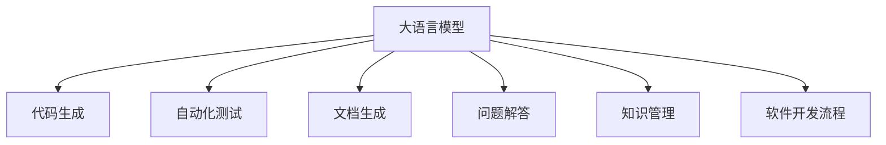

                 

# LLM对软件开发流程的潜在影响

> 关键词：
- 大语言模型(LLM)
- 软件开发流程
- 自然语言处理(NLP)
- 代码生成
- 自动化测试
- 文档生成
- 问题解决
- 知识管理

## 1. 背景介绍

### 1.1 问题由来
随着人工智能技术的快速发展和广泛应用，大语言模型（Large Language Model, LLM）成为了行业内外关注的焦点。特别是GPT-3、BERT等预训练模型的出现，使得模型能够在理解和生成自然语言方面达到前所未有的高度。这些模型不仅在文本分类、信息检索、机器翻译等传统NLP任务上表现出色，还拓展到了代码生成、软件测试、文档编写、问题解答等多个软件开发流程中，对软件开发的各个环节产生了深远影响。

### 1.2 问题核心关键点
大语言模型通过大规模预训练学习和深度迁移学习，使得其在多模态数据处理、复杂任务求解、自然语言理解与生成等方面表现优异。对于软件开发流程，大语言模型可以通过自动化代码生成、测试、文档编写、问题解答等方式，提升开发效率，降低人工错误，减少重复劳动，从而提高软件开发生产力和质量。

然而，尽管大语言模型在软件开发中的应用前景广阔，但也存在诸多挑战，如模型鲁棒性、生成质量、理解上下文等问题。如何有效地利用大语言模型，并在软件开发流程中发挥其优势，还需要在技术、应用、伦理等多方面进行深入探索。

### 1.3 问题研究意义
本文旨在探讨大语言模型对软件开发流程的潜在影响，分析其在代码生成、自动化测试、文档生成、问题解答等方面的应用现状和挑战，并提出相关策略，以期推动大语言模型在软件开发中的应用研究和产业化进程。

## 2. 核心概念与联系

### 2.1 核心概念概述

为更好地理解大语言模型在软件开发中的应用，本节将介绍几个密切相关的核心概念：

- 大语言模型(LLM)：以自回归(如GPT)或自编码(如BERT)模型为代表的大规模预训练语言模型。通过在大规模无标签文本语料上进行预训练，学习通用的语言表示，具备强大的语言理解和生成能力。

- 软件开发流程(Software Development Life Cycle, SDL)：包括需求分析、设计、编码、测试、部署、维护等各个阶段，涉及代码、文档、数据等多个方面。

- 自动化工具(Automatic Tools)：用于辅助软件开发流程的工具，如代码生成器、测试框架、文档生成器等，旨在提高开发效率和代码质量。

- 人工智能(AI)：使用计算机技术模拟人类智能行为和认知过程的技术，大语言模型是其中的重要组成部分。

- 自然语言处理(NLP)：使计算机能够理解和生成人类语言的技术，包括文本分类、信息检索、语言翻译等，是大语言模型应用的重要领域。

- 代码生成(Code Generation)：使用大语言模型自动生成符合需求规范的代码片段，用于软件开发、文档编写、问题解答等环节。

- 自动化测试(Automatic Testing)：使用大语言模型自动进行软件测试用例的生成、执行和结果评估，提升测试覆盖率和质量。

- 文档生成(Document Generation)：使用大语言模型自动生成软件文档、用户手册、API文档等，减少人工编写工作量，提升文档准确性。

- 问题解答(Question Answering, QA)：使用大语言模型自动回答开发人员和用户的问题，解决技术难题，提高工作效率。

- 知识管理(Knowledge Management)：通过大语言模型管理开发团队的知识库、经验库等，提高团队协作效率，避免重复劳动。

这些核心概念之间的逻辑关系可以通过以下Mermaid流程图来展示：



这个流程图展示了大语言模型在软件开发流程中的应用场景和关键环节：

1. 大语言模型通过代码生成、自动化测试、文档生成、问题解答等方式，提升软件开发流程的各个环节。
2. 这些应用不仅可以提高开发效率，减少人工错误，还可以提升软件质量。

## 3. 核心算法原理 & 具体操作步骤
### 3.1 算法原理概述

基于大语言模型的软件开发流程应用，本质上是一种利用机器学习技术辅助软件开发的方式。其核心思想是：通过预训练语言模型学习通用的语言表示，在特定任务上进行微调，获得针对软件开发流程的具体应用能力。

形式化地，假设预训练模型为 $M_{\theta}$，其中 $\theta$ 为预训练得到的模型参数。给定特定任务 $T$ 的训练数据集 $D=\{(x_i, y_i)\}_{i=1}^N$，软件开发流程任务的应用能力可以通过微调 $M_{\theta}$ 获得：

$$
\hat{M}_{\theta'} = M_{\theta}
$$

其中 $\hat{M}_{\theta'}$ 为微调后的模型，$T$ 为软件开发流程任务，$\theta'$ 为微调得到的参数。

通过梯度下降等优化算法，微调过程不断更新模型参数 $\theta'$，最小化损失函数，使得模型在特定任务上的输出逼近理想结果。由于 $\theta$ 已经通过预训练获得了较好的初始化，因此即便在特定任务上微调的数据较少，也能较快收敛到理想的模型参数 $\theta'$。

### 3.2 算法步骤详解

基于大语言模型的软件开发流程应用一般包括以下几个关键步骤：

**Step 1: 准备预训练模型和数据集**
- 选择合适的预训练语言模型 $M_{\theta}$ 作为初始化参数，如 BERT、GPT 等。
- 准备软件开发流程任务相关的训练数据集 $D$，划分为训练集、验证集和测试集。一般要求标注数据与预训练数据的分布不要差异过大。

**Step 2: 添加任务适配层**
- 根据软件开发流程任务类型，在预训练模型顶层设计合适的输出层和损失函数。
- 对于代码生成任务，通常在顶层添加解码器输出概率分布，并以负对数似然为损失函数。
- 对于自动化测试、文档生成、问题解答等任务，可以使用分类或序列标注等任务类型的输出层和损失函数。

**Step 3: 设置微调超参数**
- 选择合适的优化算法及其参数，如 AdamW、SGD 等，设置学习率、批大小、迭代轮数等。
- 设置正则化技术及强度，包括权重衰减、Dropout、Early Stopping等。
- 确定冻结预训练参数的策略，如仅微调顶层，或全部参数都参与微调。

**Step 4: 执行梯度训练**
- 将训练集数据分批次输入模型，前向传播计算损失函数。
- 反向传播计算参数梯度，根据设定的优化算法和学习率更新模型参数。
- 周期性在验证集上评估模型性能，根据性能指标决定是否触发 Early Stopping。
- 重复上述步骤直到满足预设的迭代轮数或 Early Stopping 条件。

**Step 5: 测试和部署**
- 在测试集上评估微调后模型 $M_{\theta'}$ 的性能，对比微调前后的精度提升。
- 使用微调后的模型对新样本进行推理预测，集成到实际的应用系统中。
- 持续收集新的数据，定期重新微调模型，以适应数据分布的变化。

以上是基于大语言模型的软件开发流程应用的一般流程。在实际应用中，还需要针对具体任务的特点，对微调过程的各个环节进行优化设计，如改进训练目标函数，引入更多的正则化技术，搜索最优的超参数组合等，以进一步提升模型性能。

### 3.3 算法优缺点

基于大语言模型的软件开发流程应用方法具有以下优点：
1. 提高开发效率。自动化代码生成、测试、文档编写等功能可以显著提升开发速度和质量，减少重复劳动。
2. 提升软件质量。通过大语言模型自动进行代码审查、自动化测试等，可以减少人工错误，提高代码可靠性。
3. 降低成本。自动化工具的广泛应用，可以降低开发和维护的人力成本，提高资源利用率。
4. 灵活性高。大语言模型可以根据不同任务需求进行定制，具备高度灵活性和适应性。

同时，该方法也存在一定的局限性：
1. 依赖标注数据。微调的效果很大程度上取决于标注数据的质量和数量，获取高质量标注数据的成本较高。
2. 模型鲁棒性有限。预训练模型和微调模型的泛化能力在特定领域可能受到限制。
3. 需要技术支持。开发和维护大语言模型应用需要一定的技术门槛，对开发人员和团队的要求较高。
4. 数据隐私问题。大语言模型可能涉及敏感数据，如代码片段、用户问题等，数据隐私保护需要格外重视。

尽管存在这些局限性，但就目前而言，基于大语言模型的软件开发流程应用方法已经在大规模软件开发项目中得到了广泛应用，并带来了显著的效果提升。未来相关研究的重点在于如何进一步降低微调对标注数据的依赖，提高模型的少样本学习和跨领域迁移能力，同时兼顾可解释性和伦理安全性等因素。

### 3.4 算法应用领域

基于大语言模型的软件开发流程应用方法，在软件开发、软件测试、文档编写、问题解答等多个环节都有广泛的应用。例如：

- 代码生成：根据需求描述，使用大语言模型自动生成符合规范的代码片段。
- 自动化测试：根据代码编写测试用例，并自动运行测试，检查代码功能正确性。
- 文档生成：根据代码编写软件文档、用户手册、API文档等，提升文档生成效率和准确性。
- 问题解答：自动回答开发人员和用户的问题，解决技术难题，提升工作效率。
- 知识管理：构建开发团队的知识库，自动提取、索引、检索开发团队的经验和知识，提高团队协作效率。

除了这些传统应用外，大语言模型还可以拓展到更多场景中，如可控代码生成、代码重构、缺陷检测等，为软件开发流程带来全新的突破。随着大语言模型和微调方法的不断进步，相信大语言模型在软件开发中的应用将更加广泛，促进软件开发生产力的提升。

## 4. 数学模型和公式 & 详细讲解 & 举例说明
### 4.1 数学模型构建

本节将使用数学语言对基于大语言模型的软件开发流程应用过程进行更加严格的刻画。

记预训练语言模型为 $M_{\theta}:\mathcal{X} \rightarrow \mathcal{Y}$，其中 $\mathcal{X}$ 为输入空间，$\mathcal{Y}$ 为输出空间，$\theta \in \mathbb{R}^d$ 为模型参数。假设软件开发流程任务 $T$ 的训练集为 $D=\{(x_i, y_i)\}_{i=1}^N, x_i \in \mathcal{X}, y_i \in \mathcal{Y}$。

定义模型 $M_{\theta}$ 在数据样本 $(x,y)$ 上的损失函数为 $\ell(M_{\theta}(x),y)$，则在数据集 $D$ 上的经验风险为：

$$
\mathcal{L}(\theta) = \frac{1}{N} \sum_{i=1}^N \ell(M_{\theta}(x_i),y_i)
$$

微调的优化目标是最小化经验风险，即找到最优参数：

$$
\theta^* = \mathop{\arg\min}_{\theta} \mathcal{L}(\theta)
$$

在实践中，我们通常使用基于梯度的优化算法（如SGD、Adam等）来近似求解上述最优化问题。设 $\eta$ 为学习率，$\lambda$ 为正则化系数，则参数的更新公式为：

$$
\theta \leftarrow \theta - \eta \nabla_{\theta}\mathcal{L}(\theta) - \eta\lambda\theta
$$

其中 $\nabla_{\theta}\mathcal{L}(\theta)$ 为损失函数对参数 $\theta$ 的梯度，可通过反向传播算法高效计算。

### 4.2 公式推导过程

以下我们以代码生成任务为例，推导负对数似然损失函数及其梯度的计算公式。

假设模型 $M_{\theta}$ 在输入 $x$ 上的输出为 $\hat{y}=M_{\theta}(x) \in [0,1]$，表示代码生成的概率分布。真实标签 $y \in \{0,1\}$。则负对数似然损失函数定义为：

$$
\ell(M_{\theta}(x),y) = -y\log \hat{y} - (1-y)\log(1-\hat{y})
$$

将其代入经验风险公式，得：

$$
\mathcal{L}(\theta) = -\frac{1}{N}\sum_{i=1}^N [y_i\log M_{\theta}(x_i)+(1-y_i)\log(1-M_{\theta}(x_i))]
$$

根据链式法则，损失函数对参数 $\theta_k$ 的梯度为：

$$
\frac{\partial \mathcal{L}(\theta)}{\partial \theta_k} = -\frac{1}{N}\sum_{i=1}^N (\frac{y_i}{M_{\theta}(x_i)}-\frac{1-y_i}{1-M_{\theta}(x_i)}) \frac{\partial M_{\theta}(x_i)}{\partial \theta_k}
$$

其中 $\frac{\partial M_{\theta}(x_i)}{\partial \theta_k}$ 可进一步递归展开，利用自动微分技术完成计算。

在得到损失函数的梯度后，即可带入参数更新公式，完成模型的迭代优化。重复上述过程直至收敛，最终得到适应软件开发流程任务的最优模型参数 $\theta^*$。

## 5. 项目实践：代码实例和详细解释说明
### 5.1 开发环境搭建

在进行软件开发流程应用实践前，我们需要准备好开发环境。以下是使用Python进行PyTorch开发的环境配置流程：

1. 安装Anaconda：从官网下载并安装Anaconda，用于创建独立的Python环境。

2. 创建并激活虚拟环境：
```bash
conda create -n pytorch-env python=3.8 
conda activate pytorch-env
```

3. 安装PyTorch：根据CUDA版本，从官网获取对应的安装命令。例如：
```bash
conda install pytorch torchvision torchaudio cudatoolkit=11.1 -c pytorch -c conda-forge
```

4. 安装Transformers库：
```bash
pip install transformers
```

5. 安装各类工具包：
```bash
pip install numpy pandas scikit-learn matplotlib tqdm jupyter notebook ipython
```

完成上述步骤后，即可在`pytorch-env`环境中开始实践。

### 5.2 源代码详细实现

这里我们以代码生成任务为例，给出使用Transformers库对GPT模型进行微调的PyTorch代码实现。

首先，定义代码生成任务的数据处理函数：

```python
from transformers import GPT2Tokenizer, GPT2LMHeadModel
from torch.utils.data import Dataset
import torch

class CodeDataset(Dataset):
    def __init__(self, texts, labels, tokenizer, max_len=128):
        self.texts = texts
        self.labels = labels
        self.tokenizer = tokenizer
        self.max_len = max_len
        
    def __len__(self):
        return len(self.texts)
    
    def __getitem__(self, item):
        text = self.texts[item]
        label = self.labels[item]
        
        encoding = self.tokenizer(text, return_tensors='pt', max_length=self.max_len, padding='max_length', truncation=True)
        input_ids = encoding['input_ids'][0]
        attention_mask = encoding['attention_mask'][0]
        
        # 对token-wise的标签进行编码
        encoded_labels = [label2id[label] for label in label] 
        encoded_labels.extend([label2id['end']] * (self.max_len - len(encoded_labels)))
        labels = torch.tensor(encoded_labels, dtype=torch.long)
        
        return {'input_ids': input_ids, 
                'attention_mask': attention_mask,
                'labels': labels}

# 标签与id的映射
label2id = {'end': 0, '1': 1, '2': 2, '3': 3, '4': 4, '5': 5, '6': 6, '7': 7, '8': 8, '9': 9, '10': 10}
id2label = {v: k for k, v in label2id.items()}

# 创建dataset
tokenizer = GPT2Tokenizer.from_pretrained('gpt2')

train_dataset = CodeDataset(train_texts, train_labels, tokenizer)
dev_dataset = CodeDataset(dev_texts, dev_labels, tokenizer)
test_dataset = CodeDataset(test_texts, test_labels, tokenizer)
```

然后，定义模型和优化器：

```python
from transformers import GPT2LMHeadModel, AdamW

model = GPT2LMHeadModel.from_pretrained('gpt2')

optimizer = AdamW(model.parameters(), lr=2e-5)
```

接着，定义训练和评估函数：

```python
from torch.utils.data import DataLoader
from tqdm import tqdm
from sklearn.metrics import accuracy_score

device = torch.device('cuda') if torch.cuda.is_available() else torch.device('cpu')
model.to(device)

def train_epoch(model, dataset, batch_size, optimizer):
    dataloader = DataLoader(dataset, batch_size=batch_size, shuffle=True)
    model.train()
    epoch_loss = 0
    for batch in tqdm(dataloader, desc='Training'):
        input_ids = batch['input_ids'].to(device)
        attention_mask = batch['attention_mask'].to(device)
        labels = batch['labels'].to(device)
        model.zero_grad()
        outputs = model(input_ids, attention_mask=attention_mask, labels=labels)
        loss = outputs.loss
        epoch_loss += loss.item()
        loss.backward()
        optimizer.step()
    return epoch_loss / len(dataloader)

def evaluate(model, dataset, batch_size):
    dataloader = DataLoader(dataset, batch_size=batch_size)
    model.eval()
    preds, labels = [], []
    with torch.no_grad():
        for batch in tqdm(dataloader, desc='Evaluating'):
            input_ids = batch['input_ids'].to(device)
            attention_mask = batch['attention_mask'].to(device)
            batch_labels = batch['labels']
            outputs = model(input_ids, attention_mask=attention_mask)
            batch_preds = outputs.logits.argmax(dim=2).to('cpu').tolist()
            batch_labels = batch_labels.to('cpu').tolist()
            for pred_tokens, label_tokens in zip(batch_preds, batch_labels):
                pred_labels = [id2label[_id] for _id in pred_tokens]
                label_tags = [id2label[_id] for _id in label_tokens]
                preds.append(pred_labels[:len(label_tags)])
                labels.append(label_tags)
                
    print('Accuracy:', accuracy_score(labels, preds))
```

最后，启动训练流程并在测试集上评估：

```python
epochs = 5
batch_size = 16

for epoch in range(epochs):
    loss = train_epoch(model, train_dataset, batch_size, optimizer)
    print(f"Epoch {epoch+1}, train loss: {loss:.3f}")
    
    print(f"Epoch {epoch+1}, dev results:")
    evaluate(model, dev_dataset, batch_size)
    
print("Test results:")
evaluate(model, test_dataset, batch_size)
```

以上就是使用PyTorch对GPT进行代码生成任务微调的完整代码实现。可以看到，得益于Transformers库的强大封装，我们可以用相对简洁的代码完成GPT模型的加载和微调。

### 5.3 代码解读与分析

让我们再详细解读一下关键代码的实现细节：

**CodeDataset类**：
- `__init__`方法：初始化文本、标签、分词器等关键组件。
- `__len__`方法：返回数据集的样本数量。
- `__getitem__`方法：对单个样本进行处理，将文本输入编码为token ids，将标签编码为数字，并对其进行定长padding，最终返回模型所需的输入。

**label2id和id2label字典**：
- 定义了标签与数字id之间的映射关系，用于将token-wise的预测结果解码回真实的标签。

**训练和评估函数**：
- 使用PyTorch的DataLoader对数据集进行批次化加载，供模型训练和推理使用。
- 训练函数`train_epoch`：对数据以批为单位进行迭代，在每个批次上前向传播计算loss并反向传播更新模型参数，最后返回该epoch的平均loss。
- 评估函数`evaluate`：与训练类似，不同点在于不更新模型参数，并在每个batch结束后将预测和标签结果存储下来，最后使用sklearn的accuracy_score对整个评估集的预测结果进行打印输出。

**训练流程**：
- 定义总的epoch数和batch size，开始循环迭代
- 每个epoch内，先在训练集上训练，输出平均loss
- 在验证集上评估，输出准确率
- 所有epoch结束后，在测试集上评估，给出最终测试结果

可以看到，PyTorch配合Transformers库使得GPT微调的代码实现变得简洁高效。开发者可以将更多精力放在数据处理、模型改进等高层逻辑上，而不必过多关注底层的实现细节。

当然，工业级的系统实现还需考虑更多因素，如模型的保存和部署、超参数的自动搜索、更灵活的任务适配层等。但核心的微调范式基本与此类似。

## 6. 实际应用场景
### 6.1 智能代码生成

大语言模型在智能代码生成方面具有独特的优势。传统代码生成方法通常依赖语法规则和模板，难以处理复杂逻辑和多变的需求。而大语言模型通过学习大量的代码示例，能够自动生成符合规范和语义的代码片段，大大提高了开发效率。

在技术实现上，可以收集多种编程语言的代码库，将代码片段和对应的注释、功能描述等构建成监督数据，在此基础上对预训练语言模型进行微调。微调后的模型能够根据自然语言描述自动生成符合规范的代码，同时保留代码的功能性和可读性。对于新需求，开发人员可以通过描述需求，由模型生成初步代码，再由人工审校和调整，最终完成开发工作。

### 6.2 自动化测试

大语言模型在自动化测试方面也有广泛应用。传统测试方法通常需要开发人员手动编写测试用例，费时费力且容易遗漏。而大语言模型可以通过学习大量的测试代码片段，自动生成测试用例，并执行测试。

具体而言，可以收集多种编程语言的测试用例库，将测试代码片段和对应的测试结果构建成监督数据，在此基础上对预训练语言模型进行微调。微调后的模型能够根据代码片段自动生成测试用例，并在执行后输出测试结果，从而实现自动化测试。对于新需求，开发人员可以直接将代码片段输入模型，得到测试结果，减少人工测试工作量，提升测试效率和准确性。

### 6.3 文档生成

大语言模型在文档生成方面同样表现出色。传统文档编写方法通常需要开发人员手工编写和维护文档，效率低下且容易出错。而大语言模型可以通过学习大量的代码和文档数据，自动生成软件文档、用户手册、API文档等。

在技术实现上，可以收集开发文档和用户手册，将其作为监督数据，在预训练模型的基础上对模型进行微调。微调后的模型能够根据代码片段自动生成文档，同时保证文档的准确性和一致性。对于新需求，开发人员可以输入代码片段，由模型自动生成文档，减少手动编写的工作量，提升文档编写的效率和质量。

### 6.4 问题解答

大语言模型在问题解答方面也有着广泛的应用。传统问题解答方法通常需要开发人员手动编写知识库和查询接口，难以应对多变的问题场景。而大语言模型可以通过学习大量的问答数据，自动回答用户问题，提升问题解答的效率和质量。

在技术实现上，可以收集多种领域的问答数据，将问题和对应的答案构建成监督数据，在此基础上对预训练语言模型进行微调。微调后的模型能够自动回答用户问题，并提供详细的解释和参考信息。对于新问题，用户可以直接输入问题，由模型自动回答，提升问题解答的效率和准确性。

### 6.5 知识管理

大语言模型在知识管理方面也有着重要的应用。传统知识管理方法通常需要开发人员手动维护知识库和检索系统，难以应对知识多样性和动态变化。而大语言模型可以通过学习大量的知识库数据，自动提取、索引、检索知识，提升知识管理的效率和准确性。

在技术实现上，可以收集开发团队的知识库和经验库，将其作为监督数据，在预训练模型的基础上对模型进行微调。微调后的模型能够自动提取知识库中的关键信息，并进行索引和检索。对于新知识，开发人员可以直接输入文本，由模型自动提取和整理，提升知识管理的效率和质量。

## 7. 工具和资源推荐
### 7.1 学习资源推荐

为了帮助开发者系统掌握大语言模型在软件开发流程中的应用理论基础和实践技巧，这里推荐一些优质的学习资源：

1. 《Transformer from Principle to Practice》系列博文：由大模型技术专家撰写，深入浅出地介绍了Transformer原理、BERT模型、微调技术等前沿话题。

2. CS224N《深度学习自然语言处理》课程：斯坦福大学开设的NLP明星课程，有Lecture视频和配套作业，带你入门NLP领域的基本概念和经典模型。

3. 《Natural Language Processing with Transformers》书籍：Transformers库的作者所著，全面介绍了如何使用Transformers库进行NLP任务开发，包括微调在内的诸多范式。

4. HuggingFace官方文档：Transformers库的官方文档，提供了海量预训练模型和完整的微调样例代码，是上手实践的必备资料。

5. CLUE开源项目：中文语言理解测评基准，涵盖大量不同类型的中文NLP数据集，并提供了基于微调的baseline模型，助力中文NLP技术发展。

通过对这些资源的学习实践，相信你一定能够快速掌握大语言模型在软件开发流程中的应用精髓，并用于解决实际的NLP问题。
###  7.2 开发工具推荐

高效的开发离不开优秀的工具支持。以下是几款用于大语言模型在软件开发流程中应用的常用工具：

1. PyTorch：基于Python的开源深度学习框架，灵活动态的计算图，适合快速迭代研究。大部分预训练语言模型都有PyTorch版本的实现。

2. TensorFlow：由Google主导开发的开源深度学习框架，生产部署方便，适合大规模工程应用。同样有丰富的预训练语言模型资源。

3. Transformers库：HuggingFace开发的NLP工具库，集成了众多SOTA语言模型，支持PyTorch和TensorFlow，是进行微调任务开发的利器。

4. Weights & Biases：模型训练的实验跟踪工具，可以记录和可视化模型训练过程中的各项指标，方便对比和调优。与主流深度学习框架无缝集成。

5. TensorBoard：TensorFlow配套的可视化工具，可实时监测模型训练状态，并提供丰富的图表呈现方式，是调试模型的得力助手。

6. Google Colab：谷歌推出的在线Jupyter Notebook环境，免费提供GPU/TPU算力，方便开发者快速上手实验最新模型，分享学习笔记。

合理利用这些工具，可以显著提升大语言模型在软件开发流程中的应用开发效率，加快创新迭代的步伐。

### 7.3 相关论文推荐

大语言模型和微调技术的发展源于学界的持续研究。以下是几篇奠基性的相关论文，推荐阅读：

1. Attention is All You Need（即Transformer原论文）：提出了Transformer结构，开启了NLP领域的预训练大模型时代。

2. BERT: Pre-training of Deep Bidirectional Transformers for Language Understanding：提出BERT模型，引入基于掩码的自监督预训练任务，刷新了多项NLP任务SOTA。

3. Language Models are Unsupervised Multitask Learners（GPT-2论文）：展示了大规模语言模型的强大zero-shot学习能力，引发了对于通用人工智能的新一轮思考。

4. Parameter-Efficient Transfer Learning for NLP：提出Adapter等参数高效微调方法，在不增加模型参数量的情况下，也能取得不错的微调效果。

5. Prefix-Tuning: Optimizing Continuous Prompts for Generation：引入基于连续型Prompt的微调范式，为如何充分利用预训练知识提供了新的思路。

6. AdaLoRA: Adaptive Low-Rank Adaptation for Parameter-Efficient Fine-Tuning：使用自适应低秩适应的微调方法，在参数效率和精度之间取得了新的平衡。

这些论文代表了大语言模型微调技术的发展脉络。通过学习这些前沿成果，可以帮助研究者把握学科前进方向，激发更多的创新灵感。

## 8. 总结：未来发展趋势与挑战

### 8.1 总结

本文对基于大语言模型的软件开发流程应用方法进行了全面系统的介绍。首先阐述了大语言模型和微调技术的研究背景和意义，明确了在软件开发流程中大语言模型应用的独特价值。其次，从原理到实践，详细讲解了基于大语言模型的软件开发流程应用过程，给出了代码生成的完整代码实例。同时，本文还广泛探讨了代码生成、自动化测试、文档生成、问题解答、知识管理等各个环节的应用现状和挑战，并提出相关策略，以期推动大语言模型在软件开发中的应用研究和产业化进程。

通过本文的系统梳理，可以看到，基于大语言模型的软件开发流程应用方法正在成为软件开发领域的重要技术范式，极大地提升了软件开发效率和质量，减少了重复劳动，降低了开发成本。未来，伴随大语言模型和微调方法的不断进步，相信在软件开发流程中的应用将更加广泛，促进软件开发生产力的全面提升。

### 8.2 未来发展趋势

展望未来，大语言模型在软件开发流程中的应用将呈现以下几个发展趋势：

1. 模型规模持续增大。随着算力成本的下降和数据规模的扩张，预训练语言模型的参数量还将持续增长。超大规模语言模型蕴含的丰富语言知识，有望支撑更加复杂多变的软件开发流程微调。

2. 微调方法日趋多样。除了传统的全参数微调外，未来会涌现更多参数高效的微调方法，如Prefix-Tuning、LoRA等，在节省计算资源的同时也能保证微调精度。

3. 持续学习成为常态。随着数据分布的不断变化，微调模型也需要持续学习新知识以保持性能。如何在不遗忘原有知识的同时，高效吸收新样本信息，将成为重要的研究课题。

4. 标注样本需求降低。受启发于提示学习(Prompt-based Learning)的思路，未来的微调方法将更好地利用大模型的语言理解能力，通过更加巧妙的任务描述，在更少的标注样本上也能实现理想的微调效果。

5. 多模态微调崛起。当前的微调主要聚焦于纯文本数据，未来会进一步拓展到图像、视频、语音等多模态数据微调。多模态信息的融合，将显著提升语言模型对现实世界的理解和建模能力。

6. 模型通用性增强。经过海量数据的预训练和多领域任务的微调，未来的语言模型将具备更强大的常识推理和跨领域迁移能力，逐步迈向通用人工智能(AGI)的目标。

以上趋势凸显了大语言模型在软件开发流程中的应用前景。这些方向的探索发展，必将进一步提升软件开发流程的效率和质量，为构建人机协同的智能系统铺平道路。

### 8.3 面临的挑战

尽管大语言模型在软件开发流程中的应用前景广阔，但在迈向更加智能化、普适化应用的过程中，它仍面临着诸多挑战：

1. 标注成本瓶颈。虽然微调大大降低了标注数据的需求，但对于长尾应用场景，难以获得充足的高质量标注数据，成为制约微调性能的瓶颈。如何进一步降低微调对标注样本的依赖，将是一大难题。

2. 模型鲁棒性不足。预训练模型和微调模型的泛化能力在特定领域可能受到限制。对于测试样本的微小扰动，微调模型的预测也容易发生波动。如何提高微调模型的鲁棒性，避免灾难性遗忘，还需要更多理论和实践的积累。

3. 推理效率有待提高。大规模语言模型虽然精度高，但在实际部署时往往面临推理速度慢、内存占用大等效率问题。如何在保证性能的同时，简化模型结构，提升推理速度，优化资源占用，将是重要的优化方向。

4. 可解释性亟需加强。当前微调模型更像是"黑盒"系统，难以解释其内部工作机制和决策逻辑。对于医疗、金融等高风险应用，算法的可解释性和可审计性尤为重要。如何赋予微调模型更强的可解释性，将是亟待攻克的难题。

5. 安全性有待保障。预训练语言模型难免会学习到有偏见、有害的信息，通过微调传递到下游任务，产生误导性、歧视性的输出，给实际应用带来安全隐患。如何从数据和算法层面消除模型偏见，避免恶意用途，确保输出的安全性，也将是重要的研究课题。

6. 知识整合能力不足。现有的微调模型往往局限于任务内数据，难以灵活吸收和运用更广泛的先验知识。如何让微调过程更好地与外部知识库、规则库等专家知识结合，形成更加全面、准确的信息整合能力，还有很大的想象空间。

正视微调面临的这些挑战，积极应对并寻求突破，将是大语言模型在软件开发流程中走向成熟的关键。相信随着学界和产业界的共同努力，这些挑战终将一一被克服，大语言模型在软件开发流程中的应用必将在构建人机协同的智能系统上发挥更大作用。

### 8.4 研究展望

面对大语言模型在软件开发流程中的应用挑战，未来的研究需要在以下几个方面寻求新的突破：

1. 探索无监督和半监督微调方法。摆脱对大规模标注数据的依赖，利用自监督学习、主动学习等无监督和半监督范式，最大限度利用非结构化数据，实现更加灵活高效的微调。

2. 研究参数高效和计算高效的微调范式。开发更加参数高效的微调方法，在固定大部分预训练参数的同时，只更新极少量的任务相关参数。同时优化微调模型的计算图，减少前向传播和反向传播的资源消耗，实现更加轻量级、实时性的部署。

3. 引入更多先验知识。将符号化的先验知识，如知识图谱、逻辑规则等，与神经网络模型进行巧妙融合，引导微调过程学习更准确、合理的语言模型。同时加强不同模态数据的整合，实现视觉、语音等多模态信息与文本信息的协同建模。

4. 结合因果分析和博弈论工具。将因果分析方法引入微调模型，识别出模型决策的关键特征，增强输出解释的因果性和逻辑性。借助博弈论工具刻画人机交互过程，主动探索并规避模型的脆弱点，提高系统稳定性。

5. 纳入伦理道德约束。在模型训练目标中引入伦理导向的评估指标，过滤和惩罚有偏见、有害的输出倾向。同时加强人工干预和审核，建立模型行为的监管机制，确保输出符合人类价值观和伦理道德。

这些研究方向的探索，必将引领大语言模型在软件开发流程中的应用迈向更高的台阶，为构建安全、可靠、可解释、可控的智能系统铺平道路。面向未来，大语言模型在软件开发流程中的应用还需要与其他人工智能技术进行更深入的融合，如知识表示、因果推理、强化学习等，多路径协同发力，共同推动自然语言理解和智能交互系统的进步。只有勇于创新、敢于突破，才能不断拓展语言模型的边界，让智能技术更好地造福人类社会。

## 9. 附录：常见问题与解答
**Q1：大语言模型在软件开发流程中是否适合所有类型的应用场景？**

A: 大语言模型在软件开发流程中的应用主要依赖于其语言理解和生成的能力。对于代码生成、测试、文档编写、问题解答等环节，大语言模型具有显著优势。但对于一些需要特定领域知识和技能的任务，如手工编码、系统集成等，可能效果有限。因此，在具体应用时，需要评估任务类型，选择最合适的技术方案。

**Q2：大语言模型在软件开发流程中是否需要大量的标注数据？**

A: 大语言模型在微调过程中对标注数据的需求取决于任务类型和数据质量。对于代码生成、测试、文档编写等任务，标注数据的需求量相对较少，模型可以通过自动生成的伪标注数据进行微调。但对于问题解答、知识管理等任务，标注数据的质量和数量将直接影响模型的性能。因此，需要根据具体任务和数据特点，合理选择微调策略。

**Q3：大语言模型在软件开发流程中是否容易出现过拟合现象？**

A: 大语言模型在微调过程中容易出现过拟合现象，特别是在标注数据较少或数据分布不均衡的情况下。为缓解过拟合问题，可以采用数据增强、正则化技术、对抗训练等方法，提高模型的泛化能力。同时，可以通过参数高效微调等方法，减少微调模型的参数量，降低过拟合风险。

**Q4：大语言模型在软件开发流程中的性能是否受预训练数据的影响？**

A: 大语言模型的性能在微调过程中受预训练数据的影响显著。选择与目标任务相似的预训练数据，可以提高微调模型的效果。同时，可以通过知识蒸馏、多任务学习等方法，利用预训练模型的知识，提升微调模型的泛化能力和性能。

**Q5：大语言模型在软件开发流程中的推理速度是否足够快？**

A: 大语言模型在推理过程中通常需要较大的计算资源，特别是在处理大规模文本数据时。为了提高推理速度，可以采用模型压缩、稀疏化存储、量化加速等技术，优化模型的计算图和推理过程。同时，也可以采用多模型集成、分布式训练等方法，提高系统的并行处理能力和效率。

通过本文的系统梳理，可以看到，大语言模型在软件开发流程中的应用具有广阔的前景和深远的影响。尽管面临诸多挑战，但通过技术创新和实践优化，大语言模型必将在软件开发中发挥更大的作用，推动软件开发生产力的全面提升。相信随着学界和产业界的共同努力，大语言模型在软件开发流程中的应用将更加广泛，为构建人机协同的智能系统铺平道路。

