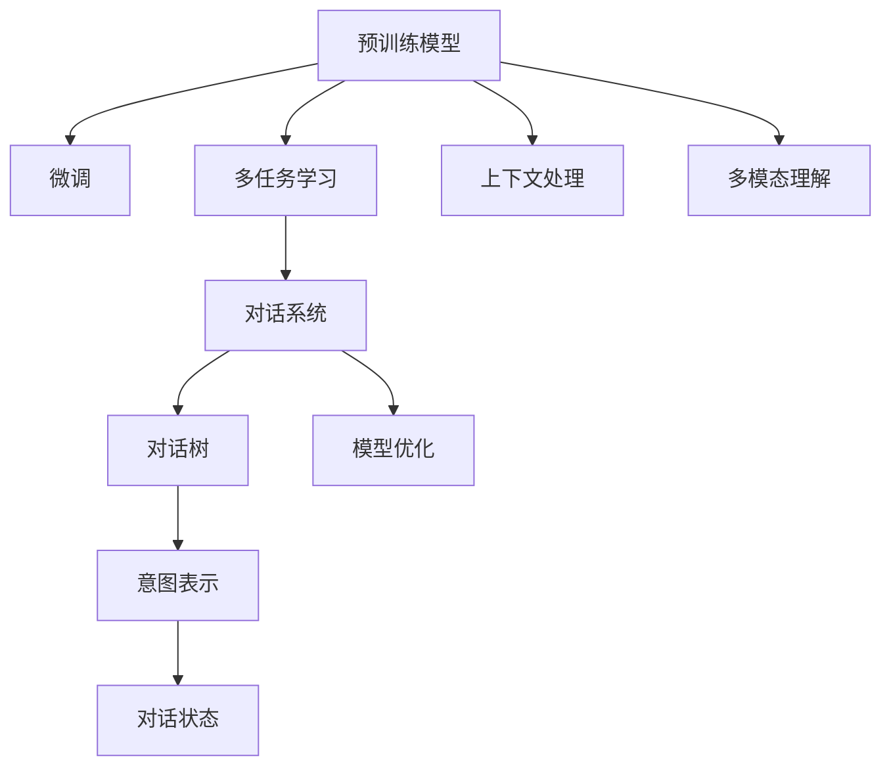

                 

# LLM意图对齐:挑战与解决方案探索

> 关键词：意图对齐,自然语言处理(NLP),机器学习,深度学习,对话系统,预训练模型,微调,强化学习

## 1. 背景介绍

### 1.1 问题由来

随着预训练语言模型(LLM)在自然语言处理(NLP)领域的广泛应用，语言模型如GPT、BERT等在问答、对话、翻译、摘要等任务上取得了显著进展。然而，尽管这些模型具有强大的语言理解和生成能力，但它们仍存在一个关键问题——意图对齐。

意图对齐是指将用户的输入文本与模型期望的行为目标进行匹配，从而生成符合用户期望的输出。这对于构建具有良好用户体验和上下文感知能力的智能对话系统和问答系统至关重要。

然而，意图对齐是一个复杂且多面的问题，涉及多个层面的挑战，包括：

- 语言理解的歧义性：用户表达相同意图时，可能会使用不同的语言表达方式。
- 上下文保持的困难：模型需要理解长距离的上下文信息，以便正确生成响应。
- 多模态输入的整合：在对话系统中，模型可能需要整合文本、语音、图像等多模态信息，以提升理解力和生成能力。
- 训练数据的稀缺性：收集足够的、高质量的标注数据以训练模型，仍然是一个巨大的挑战。

为了解决这些挑战，本文将从原理、技术、实践等多个角度，探讨如何更好地进行LLM的意图对齐，为NLP领域的智能系统构建提供指导。

### 1.2 问题核心关键点

本节将梳理意图对齐中涉及的核心概念，并绘制其核心原理的Mermaid流程图，展示各个组件之间的关联。

- **预训练模型(Pretrained Model)**：作为意图对齐的基础，预训练模型通过大规模无标签文本进行预训练，学习通用的语言表示。
- **微调(Fine-tuning)**：在特定任务上，对预训练模型进行有监督学习，优化其对特定意图的理解能力。
- **多任务学习(Multi-task Learning)**：模型同时学习多个相关任务，提升其泛化能力和上下文理解力。
- **对话系统(Dialogue System)**：用于模拟人与机器之间的交互，通过理解用户的输入意图，生成合适的响应。
- **强化学习(Reinforcement Learning)**：通过奖励机制，优化模型对用户意图的理解和生成，提高对话质量。
- **深度学习(Deep Learning)**：作为意图对齐的核心技术手段，深度学习模型能够从大量数据中学习到复杂的非线性关系。
- **自然语言理解(NLU)**：理解用户输入的自然语言，提取关键信息，作为意图对齐的依据。
- **上下文处理(Context Handling)**：模型需要保持对长距离上下文的理解，以便正确生成响应。
- **多模态处理(Multi-modal Processing)**：在对话系统中，模型需要整合文本、语音、图像等多模态信息。
- **意图分类(Intent Classification)**：对用户输入进行意图分类，确定模型需要执行的特定任务。

这个流程图展示了意图对齐涉及的核心组件及其相互关系，为后续深入探讨提供了方向。

## 2. 核心概念与联系

### 2.1 核心概念概述

意图对齐涉及多个核心概念，以下是它们的简要介绍：

- **意图表示(Intent Representation)**：意图表示是用户意图的抽象表示，通常用意图类别来表示，如“预订”、“询问天气”等。
- **对话树(Dialogue Tree)**：对话树是对话系统中的核心结构，用于描述对话过程中每个轮次的意图和响应。
- **对话状态(Dialogue State)**：对话状态记录了对话过程中模型已经接收到的信息，以及后续需要执行的任务。
- **上下文处理(Contextual Understanding)**：模型需要理解上下文中隐含的信息，如先前的对话历史、当前对话轮次等。
- **多模态理解(Multimodal Understanding)**：在对话系统中，模型需要整合多种信息源，如文本、语音、图像等，以提供更全面和准确的响应。
- **模型优化(Model Optimization)**：通过训练和微调，提升模型的意图对齐能力和对话质量。

这些概念之间的联系可以通过以下Mermaid流程图来展示：



这个流程图展示了意图对齐中各个概念之间的逻辑关系。

## 3. 核心算法原理 & 具体操作步骤

### 3.1 算法原理概述

意图对齐的核心在于将用户的输入文本与模型期望的行为目标进行匹配。这通常通过以下步骤实现：

1. **输入文本处理**：将用户的输入文本转换为模型可以理解的格式。
2. **意图表示提取**：从输入文本中提取意图表示。
3. **上下文理解**：理解输入文本的前后文信息，以保持对话的一致性。
4. **响应生成**：根据意图表示和上下文信息，生成模型期望的响应。

具体而言，意图对齐可以分为以下几个步骤：

- **文本处理**：将自然语言输入转换为模型可以理解的格式，如分词、词性标注等。
- **意图提取**：使用意图分类器或对话树，从输入文本中提取意图表示。
- **上下文理解**：通过模型对对话历史和当前对话轮次的理解，生成上下文表示。
- **响应生成**：根据意图表示和上下文表示，生成模型期望的响应。

### 3.2 算法步骤详解

以下详细介绍意图对齐的详细步骤：

#### 步骤1: 输入文本处理

文本处理通常包括分词、词性标注、命名实体识别等步骤。例如，使用BERT等预训练模型可以自动完成这些处理。

```python
from transformers import BertTokenizer
tokenizer = BertTokenizer.from_pretrained('bert-base-cased')
inputs = tokenizer.encode(input_text, return_tensors='pt')
```

#### 步骤2: 意图表示提取

意图表示可以通过意图分类器或对话树来提取。例如，使用GPT模型可以直接输出意图表示：

```python
from transformers import GPT2Tokenizer, GPT2LMHeadModel
model = GPT2LMHeadModel.from_pretrained('gpt2')
tokenizer = GPT2Tokenizer.from_pretrained('gpt2')
inputs = tokenizer.encode(input_text, return_tensors='pt')
intent = model(inputs).logits.argmax(dim=-1).item()
```

#### 步骤3: 上下文理解

上下文理解可以通过模型对对话历史和当前对话轮次的理解来实现。例如，使用Seq2Seq模型或Transformer模型可以对上下文进行编码，生成上下文表示：

```python
from transformers import Seq2SeqModel, Seq2SeqTokenizer
model = Seq2SeqModel.from_pretrained('seq2seq')
tokenizer = Seq2SeqTokenizer.from_pretrained('seq2seq')
history = [input_text] + chat_history
context = tokenizer(history, return_tensors='pt')
context = model(context).last_hidden_state[:, -1, :]
```

#### 步骤4: 响应生成

响应生成通常通过生成模型实现。例如，使用GPT模型可以生成符合用户意图的响应：

```python
inputs = torch.cat([inputs, context], dim=-1)
output = model(inputs)
response = tokenizer.decode(output.argmax(dim=-1).tolist(), skip_special_tokens=True)
```

### 3.3 算法优缺点

意图对齐方法具有以下优点：

- **高效性**：可以使用预训练模型进行高效的处理，减少了手动编写的代码量。
- **灵活性**：可以结合多模态信息，提升系统的理解力和生成能力。
- **鲁棒性**：基于深度学习的模型具有较强的泛化能力，可以在多种场景下取得良好的效果。

但同时也存在一些缺点：

- **资源消耗**：预训练模型和深度学习模型需要大量的计算资源和时间，训练成本较高。
- **训练数据需求**：收集足够的、高质量的标注数据仍然是一个挑战，尤其是在特定任务上。
- **可解释性**：深度学习模型通常是“黑盒”，难以解释其内部工作机制和决策逻辑。

### 3.4 算法应用领域

意图对齐方法可以应用于多种NLP任务，例如：

- **智能客服**：用于理解用户查询，生成合适的回复。
- **智能助手**：提供个性化建议和信息检索。
- **问答系统**：用于理解和回答用户提出的问题。
- **对话系统**：模拟人与机器之间的交互，提供上下文感知的响应。

这些应用场景展示了意图对齐的广泛应用和重要价值。

## 4. 数学模型和公式 & 详细讲解 & 举例说明

### 4.1 数学模型构建

意图对齐的数学模型通常基于序列到序列(seq2seq)架构构建，通过编码器-解码器结构进行文本处理和响应生成。

假设输入文本为 $x = (x_1, x_2, ..., x_T)$，输出文本为 $y = (y_1, y_2, ..., y_T)$，上下文表示为 $c$。则意图对齐的模型可以表示为：

$$
y = f(x, c; \theta)
$$

其中 $f$ 为编码器-解码器模型，$\theta$ 为模型参数。

### 4.2 公式推导过程

以下推导意图对齐的数学公式：

假设使用Transformer模型进行编码和解码，输入文本 $x$ 和上下文 $c$ 通过编码器编码得到 $h$，解码器对 $h$ 和 $c$ 进行解码得到输出文本 $y$。则模型的预测概率分布为：

$$
p(y|x, c; \theta) = \prod_{t=1}^T p(y_t|y_{<t}, c; \theta)
$$

其中 $p(y_t|y_{<t}, c; \theta)$ 为解码器在给定上下文和前文条件下的预测概率。

假设解码器为自回归模型，其预测概率可以表示为：

$$
p(y_t|y_{<t}, c; \theta) = \frac{e^{\log p(y_t|y_{<t-1}, c; \theta)}}{Z}
$$

其中 $Z$ 为归一化常数。

解码器的目标是最小化预测误差，即：

$$
\min_{\theta} \sum_{t=1}^T \log p(y_t|y_{<t}, c; \theta)
$$

通过梯度下降等优化算法，最小化上述损失函数，即可更新模型参数 $\theta$，实现意图对齐。

### 4.3 案例分析与讲解

以智能客服系统为例，分析意图对齐的应用。

假设智能客服系统的输入为用户的查询文本 $x$，上下文为客服和用户之间的对话历史 $c$。系统需要理解用户的查询意图，生成合适的回复 $y$。

假设使用BERT作为编码器，Seq2Seq作为解码器。首先，对查询文本进行分词和编码，得到向量表示 $h_x$。然后，将 $h_x$ 和对话历史 $c$ 输入解码器，得到响应向量 $h_y$。最后，使用softmax函数将 $h_y$ 转换为预测概率分布，选择概率最大的响应作为输出。

```python
from transformers import BertTokenizer, Seq2SeqModel
tokenizer = BertTokenizer.from_pretrained('bert-base-cased')
model = Seq2SeqModel.from_pretrained('seq2seq')
inputs = tokenizer.encode(query_text, return_tensors='pt')
outputs = model(inputs, context)
response = tokenizer.decode(outputs.argmax(dim=-1).tolist(), skip_special_tokens=True)
```

## 5. 项目实践：代码实例和详细解释说明

### 5.1 开发环境搭建

在进行意图对齐实践前，我们需要准备好开发环境。以下是使用Python进行PyTorch开发的环境配置流程：

1. 安装Anaconda：从官网下载并安装Anaconda，用于创建独立的Python环境。

2. 创建并激活虚拟环境：
```bash
conda create -n intent-align-env python=3.8 
conda activate intent-align-env
```

3. 安装PyTorch：根据CUDA版本，从官网获取对应的安装命令。例如：
```bash
conda install pytorch torchvision torchaudio cudatoolkit=11.1 -c pytorch -c conda-forge
```

4. 安装Transformers库：
```bash
pip install transformers
```

5. 安装各类工具包：
```bash
pip install numpy pandas scikit-learn matplotlib tqdm jupyter notebook ipython
```

完成上述步骤后，即可在`intent-align-env`环境中开始意图对齐实践。

### 5.2 源代码详细实现

这里我们以对话系统中的意图对齐为例，给出使用Transformers库对BERT模型进行意图对齐的PyTorch代码实现。

首先，定义意图对齐的任务处理函数：

```python
from transformers import BertTokenizer
from torch.utils.data import Dataset
import torch

class IntentAlignmentDataset(Dataset):
    def __init__(self, texts, labels, tokenizer, max_len=128):
        self.texts = texts
        self.labels = labels
        self.tokenizer = tokenizer
        self.max_len = max_len
        
    def __len__(self):
        return len(self.texts)
    
    def __getitem__(self, item):
        text = self.texts[item]
        label = self.labels[item]
        
        encoding = self.tokenizer(text, return_tensors='pt', max_length=self.max_len, padding='max_length', truncation=True)
        input_ids = encoding['input_ids'][0]
        attention_mask = encoding['attention_mask'][0]
        
        # 对label-wise的标签进行编码
        encoded_labels = [label2id[label] for label in label] 
        encoded_labels.extend([label2id['O']] * (self.max_len - len(encoded_labels)))
        labels = torch.tensor(encoded_labels, dtype=torch.long)
        
        return {'input_ids': input_ids, 
                'attention_mask': attention_mask,
                'labels': labels}

# 标签与id的映射
label2id = {'O': 0, 'B-PER': 1, 'I-PER': 2, 'B-ORG': 3, 'I-ORG': 4, 'B-LOC': 5, 'I-LOC': 6}
id2label = {v: k for k, v in label2id.items()}

# 创建dataset
tokenizer = BertTokenizer.from_pretrained('bert-base-cased')

train_dataset = IntentAlignmentDataset(train_texts, train_labels, tokenizer)
dev_dataset = IntentAlignmentDataset(dev_texts, dev_labels, tokenizer)
test_dataset = IntentAlignmentDataset(test_texts, test_labels, tokenizer)
```

然后，定义模型和优化器：

```python
from transformers import BertForTokenClassification, AdamW

model = BertForTokenClassification.from_pretrained('bert-base-cased', num_labels=len(label2id))

optimizer = AdamW(model.parameters(), lr=2e-5)
```

接着，定义训练和评估函数：

```python
from torch.utils.data import DataLoader
from tqdm import tqdm
from sklearn.metrics import classification_report

device = torch.device('cuda') if torch.cuda.is_available() else torch.device('cpu')
model.to(device)

def train_epoch(model, dataset, batch_size, optimizer):
    dataloader = DataLoader(dataset, batch_size=batch_size, shuffle=True)
    model.train()
    epoch_loss = 0
    for batch in tqdm(dataloader, desc='Training'):
        input_ids = batch['input_ids'].to(device)
        attention_mask = batch['attention_mask'].to(device)
        labels = batch['labels'].to(device)
        model.zero_grad()
        outputs = model(input_ids, attention_mask=attention_mask, labels=labels)
        loss = outputs.loss
        epoch_loss += loss.item()
        loss.backward()
        optimizer.step()
    return epoch_loss / len(dataloader)

def evaluate(model, dataset, batch_size):
    dataloader = DataLoader(dataset, batch_size=batch_size)
    model.eval()
    preds, labels = [], []
    with torch.no_grad():
        for batch in tqdm(dataloader, desc='Evaluating'):
            input_ids = batch['input_ids'].to(device)
            attention_mask = batch['attention_mask'].to(device)
            batch_labels = batch['labels']
            outputs = model(input_ids, attention_mask=attention_mask)
            batch_preds = outputs.logits.argmax(dim=2).to('cpu').tolist()
            batch_labels = batch_labels.to('cpu').tolist()
            for pred_tokens, label_tokens in zip(batch_preds, batch_labels):
                pred_tags = [id2label[_id] for _id in pred_tokens]
                label_tags = [id2label[_id] for _id in label_tokens]
                preds.append(pred_tags[:len(label_tags)])
                labels.append(label_tags)
                
    print(classification_report(labels, preds))
```

最后，启动训练流程并在测试集上评估：

```python
epochs = 5
batch_size = 16

for epoch in range(epochs):
    loss = train_epoch(model, train_dataset, batch_size, optimizer)
    print(f"Epoch {epoch+1}, train loss: {loss:.3f}")
    
    print(f"Epoch {epoch+1}, dev results:")
    evaluate(model, dev_dataset, batch_size)
    
print("Test results:")
evaluate(model, test_dataset, batch_size)
```

以上就是使用PyTorch对BERT进行意图对齐的完整代码实现。可以看到，得益于Transformers库的强大封装，我们可以用相对简洁的代码完成BERT模型的加载和意图对齐。

### 5.3 代码解读与分析

让我们再详细解读一下关键代码的实现细节：

**IntentAlignmentDataset类**：
- `__init__`方法：初始化文本、标签、分词器等关键组件。
- `__len__`方法：返回数据集的样本数量。
- `__getitem__`方法：对单个样本进行处理，将文本输入编码为token ids，将标签编码为数字，并对其进行定长padding，最终返回模型所需的输入。

**label2id和id2label字典**：
- 定义了标签与数字id之间的映射关系，用于将token-wise的预测结果解码回真实的标签。

**训练和评估函数**：
- 使用PyTorch的DataLoader对数据集进行批次化加载，供模型训练和推理使用。
- 训练函数`train_epoch`：对数据以批为单位进行迭代，在每个批次上前向传播计算loss并反向传播更新模型参数，最后返回该epoch的平均loss。
- 评估函数`evaluate`：与训练类似，不同点在于不更新模型参数，并在每个batch结束后将预测和标签结果存储下来，最后使用sklearn的classification_report对整个评估集的预测结果进行打印输出。

**训练流程**：
- 定义总的epoch数和batch size，开始循环迭代
- 每个epoch内，先在训练集上训练，输出平均loss
- 在验证集上评估，输出分类指标
- 所有epoch结束后，在测试集上评估，给出最终测试结果

可以看到，PyTorch配合Transformers库使得BERT意图对齐的代码实现变得简洁高效。开发者可以将更多精力放在数据处理、模型改进等高层逻辑上，而不必过多关注底层的实现细节。

当然，工业级的系统实现还需考虑更多因素，如模型的保存和部署、超参数的自动搜索、更灵活的任务适配层等。但核心的意图对齐范式基本与此类似。

## 6. 实际应用场景

### 6.1 智能客服系统

基于意图对齐的智能客服系统可以广泛应用。传统的客服系统需要配备大量人力，高峰期响应缓慢，且一致性和专业性难以保证。而使用意图对齐的智能客服系统，可以7x24小时不间断服务，快速响应客户咨询，用自然流畅的语言解答各类常见问题。

在技术实现上，可以收集企业内部的历史客服对话记录，将问题和最佳答复构建成监督数据，在此基础上对预训练对话模型进行意图对齐微调。微调后的对话模型能够自动理解用户意图，匹配最合适的答案模板进行回复。对于客户提出的新问题，还可以接入检索系统实时搜索相关内容，动态组织生成回答。如此构建的智能客服系统，能大幅提升客户咨询体验和问题解决效率。

### 6.2 金融舆情监测

金融机构需要实时监测市场舆论动向，以便及时应对负面信息传播，规避金融风险。传统的人工监测方式成本高、效率低，难以应对网络时代海量信息爆发的挑战。基于意图对齐的文本分类和情感分析技术，为金融舆情监测提供了新的解决方案。

具体而言，可以收集金融领域相关的新闻、报道、评论等文本数据，并对其进行主题标注和情感标注。在此基础上对预训练语言模型进行意图对齐微调，使其能够自动判断文本属于何种主题，情感倾向是正面、中性还是负面。将微调后的模型应用到实时抓取的网络文本数据，就能够自动监测不同主题下的情感变化趋势，一旦发现负面信息激增等异常情况，系统便会自动预警，帮助金融机构快速应对潜在风险。

### 6.3 个性化推荐系统

当前的推荐系统往往只依赖用户的历史行为数据进行物品推荐，无法深入理解用户的真实兴趣偏好。基于意图对齐的个性化推荐系统可以更好地挖掘用户行为背后的语义信息，从而提供更精准、多样的推荐内容。

在实践中，可以收集用户浏览、点击、评论、分享等行为数据，提取和用户交互的物品标题、描述、标签等文本内容。将文本内容作为模型输入，用户的后续行为（如是否点击、购买等）作为监督信号，在此基础上微调预训练语言模型。微调后的模型能够从文本内容中准确把握用户的兴趣点。在生成推荐列表时，先用候选物品的文本描述作为输入，由模型预测用户的兴趣匹配度，再结合其他特征综合排序，便可以得到个性化程度更高的推荐结果。

### 6.4 未来应用展望

随着意图对齐技术的不断发展，基于意图对齐的NLP系统将广泛应用于各个领域，为人类认知智能的进化带来深远影响。

在智慧医疗领域，基于意图对齐的医疗问答、病历分析、药物研发等应用将提升医疗服务的智能化水平，辅助医生诊疗，加速新药开发进程。

在智能教育领域，意图对齐技术可应用于作业批改、学情分析、知识推荐等方面，因材施教，促进教育公平，提高教学质量。

在智慧城市治理中，意图对齐模型可应用于城市事件监测、舆情分析、应急指挥等环节，提高城市管理的自动化和智能化水平，构建更安全、高效的未来城市。

此外，在企业生产、社会治理、文娱传媒等众多领域，基于意图对齐的智能系统也将不断涌现，为经济社会发展注入新的动力。相信随着技术的日益成熟，意图对齐技术将成为人工智能落地应用的重要范式，推动人工智能向更广阔的领域加速渗透。

## 7. 工具和资源推荐

### 7.1 学习资源推荐

为了帮助开发者系统掌握意图对齐的理论基础和实践技巧，这里推荐一些优质的学习资源：

1. 《自然语言处理综述》系列博文：由NLP专家撰写，深入浅出地介绍了意图对齐、文本分类、情感分析等NLP领域的核心概念和技术。

2. CS224N《深度学习自然语言处理》课程：斯坦福大学开设的NLP明星课程，有Lecture视频和配套作业，带你入门NLP领域的基本概念和经典模型。

3. 《深度学习与自然语言处理》书籍：深入讲解深度学习在自然语言处理中的应用，包括意图对齐在内的多个NLP任务。

4. HuggingFace官方文档：Transformers库的官方文档，提供了海量预训练模型和完整的意图对齐样例代码，是上手实践的必备资料。

5. CLUE开源项目：中文语言理解测评基准，涵盖大量不同类型的中文NLP数据集，并提供了基于意图对齐的baseline模型，助力中文NLP技术发展。

通过对这些资源的学习实践，相信你一定能够快速掌握意图对齐的精髓，并用于解决实际的NLP问题。
###  7.2 开发工具推荐

高效的开发离不开优秀的工具支持。以下是几款用于意图对齐开发的常用工具：

1. PyTorch：基于Python的开源深度学习框架，灵活动态的计算图，适合快速迭代研究。大部分预训练语言模型都有PyTorch版本的实现。

2. TensorFlow：由Google主导开发的开源深度学习框架，生产部署方便，适合大规模工程应用。同样有丰富的预训练语言模型资源。

3. Transformers库：HuggingFace开发的NLP工具库，集成了众多SOTA语言模型，支持PyTorch和TensorFlow，是进行意图对齐开发的利器。

4. Weights & Biases：模型训练的实验跟踪工具，可以记录和可视化模型训练过程中的各项指标，方便对比和调优。与主流深度学习框架无缝集成。

5. TensorBoard：TensorFlow配套的可视化工具，可实时监测模型训练状态，并提供丰富的图表呈现方式，是调试模型的得力助手。

6. Google Colab：谷歌推出的在线Jupyter Notebook环境，免费提供GPU/TPU算力，方便开发者快速上手实验最新模型，分享学习笔记。

合理利用这些工具，可以显著提升意图对齐任务的开发效率，加快创新迭代的步伐。

### 7.3 相关论文推荐

意图对齐涉及多个领域的前沿研究，以下是几篇奠基性的相关论文，推荐阅读：

1. Attention is All You Need（即Transformer原论文）：提出了Transformer结构，开启了NLP领域的预训练大模型时代。

2. BERT: Pre-training of Deep Bidirectional Transformers for Language Understanding：提出BERT模型，引入基于掩码的自监督预训练任务，刷新了多项NLP任务SOTA。

3. Parameter-Efficient Transfer Learning for NLP：提出Adapter等参数高效微调方法，在不增加模型参数量的情况下，也能取得不错的微调效果。

4. Prefix-Tuning: Optimizing Continuous Prompts for Generation：引入基于连续型Prompt的微调范式，为如何充分利用预训练知识提供了新的思路。

5. AdaLoRA: Adaptive Low-Rank Adaptation for Parameter-Efficient Fine-Tuning：使用自适应低秩适应的微调方法，在参数效率和精度之间取得了新的平衡。

6. IBM's DeepQA Challenge 2022 Winning System: A Natural Language Understanding and Generation Pipeline: 展示了意图对齐技术在智能问答系统中的应用，取得了显著的性能提升。

这些论文代表了大语言模型意图对齐技术的发展脉络。通过学习这些前沿成果，可以帮助研究者把握学科前进方向，激发更多的创新灵感。

## 8. 总结：未来发展趋势与挑战

### 8.1 总结

本文对意图对齐方法进行了全面系统的介绍。首先阐述了意图对齐在NLP领域的重要性，明确了其对于构建智能对话系统和问答系统的关键作用。其次，从原理到实践，详细讲解了意图对齐的数学模型、关键步骤和代码实现，给出了意图对齐任务开发的完整代码实例。同时，本文还广泛探讨了意图对齐方法在智能客服、金融舆情、个性化推荐等多个行业领域的应用前景，展示了意图对齐范式的巨大潜力。此外，本文精选了意图对齐技术的各类学习资源，力求为读者提供全方位的技术指引。

通过本文的系统梳理，可以看到，意图对齐方法在NLP领域的应用前景广阔，能够显著提升智能系统的人机交互体验和应用效率。未来，伴随意图对齐技术的不断演进，基于意图对齐的NLP系统必将在更多领域得到应用，为人工智能技术的产业化进程贡献力量。

### 8.2 未来发展趋势

展望未来，意图对齐技术将呈现以下几个发展趋势：

1. **模型规模继续增大**：随着算力成本的下降和数据规模的扩张，预训练语言模型的参数量还将持续增长。超大规模语言模型蕴含的丰富语言知识，有望支撑更加复杂多变的意图对齐。

2. **意图表示学习**：除了传统的分类任务，未来意图对齐技术将更加注重意图的深度学习，如通过序列标注、语言生成等任务，提升对复杂意图的理解能力。

3. **多模态意图对齐**：在对话系统中，模型需要整合文本、语音、图像等多模态信息，以提升理解力和生成能力。多模态意图对齐技术将为跨模态人机交互提供新的突破。

4. **上下文增强**：基于预训练语言模型的上下文增强技术，如Longformer、XLNet等，将进一步提升模型的上下文理解力和长距离依赖关系。

5. **少样本和零样本学习**：在数据稀缺的情况下，意图对齐技术需要进一步提升其少样本和零样本学习能力，利用预训练知识进行快速推理和生成。

6. **模型解释性增强**：意图对齐模型通常缺乏可解释性，未来需要在模型设计上引入更多可解释性技术，如基于规则的推理、可解释性优化等，提升模型的透明度和可信度。

7. **跨领域迁移**：意图对齐技术将探索更多的跨领域迁移能力，提升模型在不同领域和任务上的泛化性能。

8. **伦理和安全性**：意图对齐技术将更加注重伦理和安全性，避免模型的偏见和有害信息输出，确保系统的公平性和稳定性。

以上趋势凸显了意图对齐技术的广阔前景。这些方向的探索发展，必将进一步提升意图对齐模型的性能和应用范围，为构建安全、可靠、可解释、可控的智能系统铺平道路。

### 8.3 面临的挑战

尽管意图对齐技术已经取得了瞩目成就，但在迈向更加智能化、普适化应用的过程中，它仍面临着诸多挑战：

1. **数据稀缺**：高质量的标注数据是意图对齐的瓶颈，尤其是在特定领域和任务上。如何获取更多的标注数据，是未来意图对齐技术需要解决的重要问题。

2. **模型过拟合**：意图对齐模型在特定任务上的泛化性能有待提升。如何设计更好的正则化方法，避免模型过拟合，仍是未来研究的重点。

3. **计算资源消耗**：预训练语言模型和意图对齐模型需要大量的计算资源，如何优化模型结构，降低资源消耗，是未来研究的重要方向。

4. **模型鲁棒性**：意图对齐模型需要适应多种自然语言表达方式，避免因输入微小变化而引起模型预测的较大波动。如何提升模型的鲁棒性，增强其对抗能力，是未来研究的难点。

5. **用户意图理解**：用户意图表达的复杂性和多样性，给意图对齐带来了挑战。如何更好地理解不同表达方式的意图，是未来意图对齐技术的核心问题。

6. **多模态数据融合**：在多模态人机交互中，如何有效融合文本、语音、图像等多种信息，是未来意图对齐技术的难点。

7. **伦理和安全性**：意图对齐模型可能会学习到有害信息和偏见，如何设计公平、安全的意图对齐模型，避免恶意用途，确保输出的安全性，仍需加强研究和监管。

8. **模型解释性**：意图对齐模型通常是“黑盒”，难以解释其内部工作机制和决策逻辑。如何赋予意图对齐模型更强的可解释性，是未来研究的重要方向。

9. **跨领域迁移能力**：现有意图对齐模型局限于特定领域和任务，如何提升模型在不同领域和任务上的泛化性能，是未来研究的挑战。

10. **计算成本**：意图对齐模型的训练和推理成本较高，如何优化模型结构和算法，降低计算成本，是未来研究的重点。

正视意图对齐面临的这些挑战，积极应对并寻求突破，将是大语言模型意图对齐技术走向成熟的必由之路。相信随着学界和产业界的共同努力，这些挑战终将一一被克服，意图对齐技术必将在构建安全、可靠、可解释、可控的智能系统方面发挥更大作用。

### 8.4 研究展望

面对意图对齐面临的挑战，未来的研究需要在以下几个方面寻求新的突破：

1. **无监督和半监督意图对齐**：摆脱对大规模标注数据的依赖，利用自监督学习、主动学习等无监督和半监督范式，最大限度利用非结构化数据，实现更加灵活高效的意图对齐。

2. **参数高效意图对齐**：开发更加参数高效的意图对齐方法，在固定大部分预训练参数的同时，只更新极少量的任务相关参数。同时优化意图对齐模型的计算图，减少前向传播和反向传播的资源消耗，实现更加轻量级、实时性的部署。

3. **因果推断和对比学习**：引入因果推断和对比学习思想，增强意图对齐模型建立稳定因果关系的能力，学习更加普适、鲁棒的语言表征，从而提升模型泛化性和抗干扰能力。

4. **知识表示和规则结合**：将符号化的先验知识，如知识图谱、逻辑规则等，与神经网络模型进行巧妙融合，引导意图对齐过程学习更准确、合理的语言模型。同时加强不同模态数据的整合，实现视觉、语音等多模态信息与文本信息的协同建模。

5. **强化学习和多任务学习**：结合强化学习和多任务学习，通过奖励机制和任务共享，优化意图对齐模型对用户意图的理解和生成。

6. **伦理和安全性**：在模型训练目标中引入伦理导向的评估指标，过滤和惩罚有偏见、有害的输出倾向。同时加强人工干预和审核，建立模型行为的监管机制，确保输出符合人类价值观和伦理道德。

7. **跨领域迁移能力**：探索更多的跨领域迁移能力，提升模型在不同领域和任务上的泛化性能，提升模型的普适性和灵活性。

8. **模型解释性和可解释性优化**：引入更多可解释性技术，如基于规则的推理、可解释性优化等，提升意图对齐模型的透明度和可信度。

9. **多模态意图对齐**：在对话系统中，模型需要整合文本、语音、图像等多模态信息，以提升理解力和生成能力。多模态意图对齐技术将为跨模态人机交互提供新的突破。

10. **上下文增强**：基于预训练语言模型的上下文增强技术，如Longformer、XLNet等，将进一步提升模型的上下文理解力和长距离依赖关系。

这些研究方向的探索，必将引领意图对齐技术迈向更高的台阶，为构建安全、可靠、可解释、可控的智能系统铺平道路。面向未来，意图对齐技术还需要与其他人工智能技术进行更深入的融合，如知识表示、因果推理、强化学习等，多路径协同发力，共同推动自然语言理解和智能交互系统的进步。只有勇于创新、敢于突破，才能不断拓展意图对齐的边界，让智能技术更好地造福人类社会。

## 9. 附录：常见问题与解答

**Q1：意图对齐是否可以应用于任何NLP任务？**

A: 意图对齐主要应用于对话系统和问答系统等任务，能够理解用户的输入意图并生成合适的回复。但对于某些特定领域的任务，如医学、法律等，仍然需要结合领域的先验知识进行微调或定制。

**Q2：意图对齐模型的训练过程中需要注意哪些问题？**

A: 意图对齐模型的训练过程中需要注意以下问题：

1. 数据质量：高质量的标注数据是意图对齐的基础，收集足够的、高质量的标注数据是一个挑战。
2. 数据标注：标注数据的生成需要花费大量人力和时间，如何自动标注和验证标注数据，是未来研究的重点。
3. 过拟合：意图对齐模型容易过拟合，需要通过正则化、Dropout等技术来避免过拟合。
4. 计算资源：意图对齐模型需要大量的计算资源，如何优化模型结构和算法，降低计算成本，是未来研究的重要方向。
5. 模型解释性：意图对齐模型通常是“黑盒”，难以解释其内部工作机制和决策逻辑。如何赋予意图对齐模型更强的可解释性，是未来研究的重要方向。
6. 跨领域迁移：现有意图对齐模型局限于特定领域和任务，如何提升模型在不同领域和任务上的泛化性能，是未来研究的挑战。

**Q3：意图对齐模型在落地部署时需要注意哪些问题？**

A: 将意图对齐模型转化为实际应用，还需要考虑以下问题：

1. 模型裁剪：去除不必要的层和参数，减小模型尺寸，加快推理速度。
2. 量化加速：将浮点模型转为定点模型，压缩存储空间，提高计算效率。
3. 服务化封装：将模型封装为标准化服务接口，便于集成调用。
4. 弹性伸缩：根据请求流量动态调整资源配置，平衡服务质量和成本。
5. 监控告警：实时采集系统指标，设置异常告警阈值，确保服务稳定性。
6. 安全防护：采用访问鉴权、数据脱敏等措施，保障数据和模型安全。

合理利用这些工具，可以显著提升意图对齐任务的开发效率，加快创新迭代的步伐。唯有从数据、算法、工程、业务等多个维度协同发力，才能真正实现人工智能技术在垂直行业的规模化落地。总之，意图对齐需要开发者根据具体任务，不断迭代和优化模型、数据和算法，方能得到理想的效果。

---

作者：禅与计算机程序设计艺术 / Zen and the Art of Computer Programming

