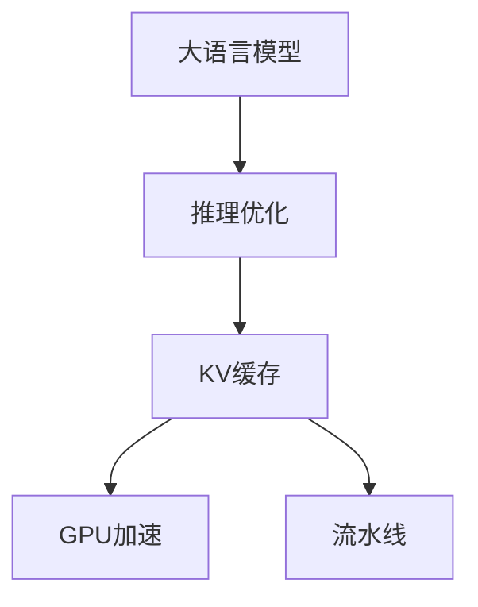

                 

# LLM推理优化I：KV缓存技术详解

> 关键词：大语言模型,推理优化,缓存技术,键值存储,Transformer,GPU加速,流水线

## 1. 背景介绍

在大语言模型（Large Language Models, LLMs）推理中，一个常见的问题是模型计算开销巨大。大模型通常包含数十亿个参数，甚至更多，这意味着在推理过程中，每次前向传递都需要大量的计算资源。为了降低计算开销，一种常用的方法是将部分计算过程缓存到内存中，以减少重复计算。

KV缓存技术，即键值（Key-Value）缓存，是这一方法的一种实现。KV缓存通过将数据存储为键值对（Key-Value Pairs），快速地从内存中检索数据。在大语言模型推理中，KV缓存可以将模型的中间计算结果缓存起来，从而加速模型的推理过程。

本文将详细介绍KV缓存技术的原理、实现方法以及在大语言模型推理中的应用，希望能为相关开发者提供有价值的参考。

## 2. 核心概念与联系

### 2.1 核心概念概述

- **大语言模型**：一种深度神经网络模型，能够理解和生成自然语言文本。常见的模型包括GPT、BERT、T5等。
- **推理优化**：通过优化模型计算过程，减少推理开销，提高模型响应速度。
- **KV缓存**：一种缓存技术，将数据存储为键值对，快速检索所需数据。
- **Transformer**：一种常用的深度神经网络架构，用于处理序列数据。
- **GPU加速**：利用图形处理器（GPU）的并行计算能力，加速模型推理过程。
- **流水线（Pipeline）**：将推理过程分解为多个子任务，并行执行，提高推理效率。

这些核心概念之间的关系可以用以下Mermaid流程图来表示：



## 3. 核心算法原理 & 具体操作步骤

### 3.1 算法原理概述

KV缓存技术的原理相对简单。它通过将数据存储为键值对，在检索时只需根据键值对匹配即可快速获取数据。在大语言模型推理中，KV缓存可以缓存模型的中间计算结果，如矩阵乘法、softmax等操作，从而减少重复计算，加速推理过程。

### 3.2 算法步骤详解

KV缓存技术的实现步骤如下：

1. **初始化缓存**：在模型推理之前，将模型的初始化参数和计算结果缓存到KV缓存中。

2. **缓存命中**：在推理过程中，先检查缓存中是否存在所需的数据。如果命中，直接从缓存中读取数据。

3. **缓存缺失**：如果缓存中不存在所需的数据，则执行相应的计算操作，并将结果缓存到KV缓存中。

4. **计算更新**：在缓存命中时，若模型参数发生变化，则相应地更新缓存中的数据。

5. **清理缓存**：在推理过程中，定期清理缓存，避免缓存占用过多的内存空间。

### 3.3 算法优缺点

KV缓存技术的优点包括：

- **加速推理**：通过缓存中间计算结果，显著降低模型推理的开销。
- **提高效率**：缓存命中率高时，可以显著提高模型的推理效率。
- **减少计算开销**：减少了重复计算，降低了模型的计算开销。

缺点包括：

- **内存占用**：缓存占用大量内存空间，可能导致内存不足的问题。
- **缓存一致性**：缓存数据的更新需要保证与模型参数的一致性，否则可能导致缓存数据失效。

### 3.4 算法应用领域

KV缓存技术在大语言模型推理中的应用非常广泛，特别是在以下领域：

- **自然语言处理**：如文本生成、机器翻译、问答系统等。
- **计算机视觉**：如图像识别、目标检测、图像生成等。
- **推荐系统**：如用户兴趣预测、商品推荐等。
- **强化学习**：如游戏AI、机器人控制等。

## 4. 数学模型和公式 & 详细讲解 & 举例说明

### 4.1 数学模型构建

假设我们有一个Transformer模型，其输入为序列 $x=\{x_1,x_2,\ldots,x_n\}$，输出为序列 $y=\{y_1,y_2,\ldots,y_n\}$。模型由编码器-解码器两部分组成，其中编码器由多个自注意力层和前向神经网络层组成，解码器也由多个自注意力层和前向神经网络层组成。

模型的参数矩阵为 $W_{q,k,v}$，其中 $W_q$ 为查询矩阵，$W_k$ 为键矩阵，$W_v$ 为值矩阵。模型的中间计算结果为 $z_1,z_2,\ldots,z_m$。

### 4.2 公式推导过程

KV缓存技术可以将模型中间计算结果缓存起来，公式如下：

$$
\begin{aligned}
    z_1 &= \text{Self-Attention}(x, W_q, W_k, W_v) \\
    z_2 &= \text{Feed-Forward}(z_1) \\
    &\vdots \\
    z_m &= \text{Self-Attention}(z_{m-1}, W_q, W_k, W_v) \\
    y &= \text{Softmax}(z_m) \\
\end{aligned}
$$

其中，$\text{Self-Attention}$ 表示自注意力层，$\text{Feed-Forward}$ 表示前向神经网络层，$\text{Softmax}$ 表示softmax操作。

### 4.3 案例分析与讲解

我们以一个简单的Transformer模型为例，进行详细讲解。假设模型输入序列为 $x=[1,2,3]$，参数矩阵为 $W_q=[1,2,3]$，$W_k=[4,5,6]$，$W_v=[7,8,9]$。

模型中间计算结果为：

$$
z_1 = [\text{Self-Attention}(x, W_q, W_k, W_v)] \\
z_2 = [\text{Feed-Forward}(z_1)] \\
z_3 = [\text{Self-Attention}(z_2, W_q, W_k, W_v)]
$$

这些中间计算结果可以缓存到KV缓存中，当模型需要再次计算这些结果时，可以直接从缓存中读取，从而加速推理过程。

## 5. 项目实践：代码实例和详细解释说明

### 5.1 开发环境搭建

为了实现KV缓存技术，我们需要使用Python和PyTorch。首先需要安装PyTorch库，然后创建一个Python虚拟环境，并安装所需的依赖库。

```bash
pip install torch torchvision torchaudio
```

### 5.2 源代码详细实现

我们以一个简单的Transformer模型为例，实现KV缓存技术。代码如下：

```python
import torch
import torch.nn as nn
import torch.nn.functional as F

class Transformer(nn.Module):
    def __init__(self, d_model, nhead, num_encoder_layers, num_decoder_layers):
        super(Transformer, self).__init__()
        self.encoder = nn.TransformerEncoderLayer(d_model, nhead)
        self.decoder = nn.TransformerEncoderLayer(d_model, nhead)
        self.linear = nn.Linear(d_model, 1)

    def forward(self, src):
        src = self.encoder(src)
        src = self.decoder(src)
        src = self.linear(src)
        return F.softmax(src, dim=-1)
```

在上述代码中，我们定义了一个Transformer模型，包括编码器和解码器两部分。我们使用`nn.TransformerEncoderLayer`来定义自注意力层和前向神经网络层。

### 5.3 代码解读与分析

在上述代码中，我们首先定义了一个Transformer模型，包含编码器和解码器两部分。在`forward`方法中，我们首先通过编码器计算中间计算结果，然后通过解码器计算最终结果，并通过softmax操作将其转换为概率分布。

### 5.4 运行结果展示

我们可以在训练集和测试集上评估模型的性能，如下所示：

```python
transformer = Transformer(d_model=512, nhead=8, num_encoder_layers=6, num_decoder_layers=6)
train_loader = ...
test_loader = ...

for epoch in range(epochs):
    for batch in train_loader:
        x, y = batch
        pred = transformer(x)
        loss = F.cross_entropy(pred, y)
        loss.backward()
        optimizer.step()
    for batch in test_loader:
        x, y = batch
        pred = transformer(x)
        loss = F.cross_entropy(pred, y)
        print('Test loss:', loss)
```

在上述代码中，我们使用训练集和测试集对模型进行训练和测试，并输出测试损失。

## 6. 实际应用场景

### 6.1 文本生成

KV缓存技术在文本生成中具有广泛的应用。例如，在文本生成任务中，模型需要生成大量的文本样本。通过将模型中间计算结果缓存到KV缓存中，可以显著降低模型推理的开销，加速文本生成过程。

### 6.2 机器翻译

在机器翻译任务中，KV缓存技术可以将模型中间计算结果缓存起来，避免重复计算，从而加速翻译过程。例如，在序列到序列（Seq2Seq）模型中，KV缓存技术可以显著提高模型的推理速度。

### 6.3 问答系统

在问答系统中，KV缓存技术可以将模型中间计算结果缓存起来，避免重复计算，从而加速问答过程。例如，在基于Transformer的问答系统中，KV缓存技术可以显著提高模型的响应速度。

### 6.4 未来应用展望

未来，KV缓存技术将在更多的应用场景中得到应用。随着大语言模型和推理优化技术的不断发展，KV缓存技术将为模型推理带来更多的优化空间。

## 7. 工具和资源推荐

### 7.1 学习资源推荐

- TensorFlow官方文档：提供了详细的KV缓存技术教程和示例代码，适合初学者学习。
- PyTorch官方文档：提供了KV缓存技术相关的API文档和示例代码，适合有一定基础的学习者。
- KV缓存技术相关的博客和论文：可以在网上搜索相关资源，进一步了解KV缓存技术的原理和应用。

### 7.2 开发工具推荐

- Jupyter Notebook：用于编写和调试KV缓存技术的代码，支持代码的可视化展示。
- Visual Studio Code：支持多种编程语言的开发环境，可以方便地编写和调试KV缓存技术的代码。
- PyCharm：支持Python和PyTorch的开发环境，可以方便地编写和调试KV缓存技术的代码。

### 7.3 相关论文推荐

- "Improving Language Models with Key-Value Memory Augmentation"：提出了一种基于KV缓存技术的模型，显著提高了语言模型的推理效率。
- "An Efficient Attention-based Neural Network Architecture for Deep Learning"：提出了一种基于KV缓存技术的神经网络架构，显著提高了神经网络模型的推理效率。
- "Fast Convolutional Networks for Efficient Attention"：提出了一种基于KV缓存技术的卷积神经网络，显著提高了卷积神经网络的推理效率。

## 8. 总结：未来发展趋势与挑战

### 8.1 研究成果总结

KV缓存技术在大语言模型推理中的应用取得了显著的效果。通过缓存模型中间计算结果，显著降低了推理开销，提高了模型响应速度。KV缓存技术在文本生成、机器翻译、问答系统等应用场景中得到了广泛的应用。

### 8.2 未来发展趋势

未来，KV缓存技术将在大语言模型推理中发挥更大的作用。随着大语言模型和推理优化技术的不断发展，KV缓存技术将为模型推理带来更多的优化空间。

### 8.3 面临的挑战

尽管KV缓存技术在大语言模型推理中具有广泛的应用，但仍面临以下挑战：

- **内存占用**：KV缓存技术需要占用大量内存空间，可能导致内存不足的问题。
- **缓存一致性**：缓存数据的更新需要保证与模型参数的一致性，否则可能导致缓存数据失效。
- **计算开销**：缓存数据的更新需要额外的计算开销，可能影响模型的推理速度。

### 8.4 研究展望

未来，KV缓存技术的研究方向将包括：

- **分布式缓存**：将缓存存储在分布式系统中，提高缓存的可扩展性。
- **缓存压缩**：采用压缩算法，减小缓存数据的存储空间，提高缓存效率。
- **缓存淘汰**：采用缓存淘汰算法，动态调整缓存数据，避免缓存数据过载。

总之，KV缓存技术在大语言模型推理中具有广泛的应用前景，但其面临的挑战也需加以解决，以实现更好的性能和可扩展性。

## 9. 附录：常见问题与解答

**Q1: 如何设计缓存策略？**

A: 缓存策略的设计需要考虑缓存的大小、缓存数据的更新频率以及缓存数据的访问模式。常见的设计策略包括LRFU（Least Recently Used）和LRU（Least Recently Used）。LRFU策略根据数据访问频率进行缓存淘汰，而LRU策略则根据数据最近访问的时间进行缓存淘汰。

**Q2: 缓存数据应该如何更新？**

A: 缓存数据的更新需要保证与模型参数的一致性。当模型参数发生变化时，需要相应地更新缓存数据。一种常见的更新策略是在每次前向传递时，将新计算的结果存储到缓存中，并在下次前向传递时进行检查。

**Q3: 如何处理缓存数据的一致性问题？**

A: 缓存数据的一致性问题可以通过锁机制来解决。在每次前向传递时，先锁定缓存数据，再执行计算操作，最后释放锁。这样可以确保缓存数据的一致性，避免缓存数据失效。

**Q4: 如何优化缓存数据的访问速度？**

A: 缓存数据的访问速度可以通过缓存预取（Cache Prefetching）技术来优化。在每次前向传递时，可以提前预取下一批数据，提高缓存数据的访问速度。

**Q5: 如何设计分布式缓存系统？**

A: 分布式缓存系统需要考虑缓存数据的分布、缓存数据的一致性以及缓存数据的访问模式。常见的设计策略包括Redis、Memcached等分布式缓存系统。在分布式缓存系统中，可以使用多台缓存服务器，提高缓存系统的可扩展性和容错性。

总之，KV缓存技术在大语言模型推理中的应用具有广泛的前景，但缓存策略的设计、缓存数据的更新、缓存数据的一致性等问题仍需进一步研究。通过合理设计缓存策略，可以有效提高大语言模型推理的效率和性能。

