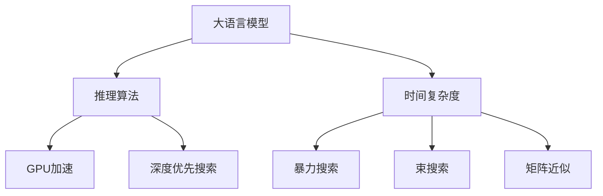

                 

# LLM推理的时间复杂度分析

> 关键词：大语言模型,推理算法,时间复杂度,GPU加速,深度优先搜索

## 1. 背景介绍

### 1.1 问题由来

在深度学习模型，特别是大语言模型(Large Language Models, LLMs)推理时，时间复杂度是一个重要的考量因素。推理算法的时间复杂度不仅影响模型响应速度，还直接关系到大规模模型在实际应用中的性能和可行性。

LLM推理的核心是计算语言模型条件概率 $P(w|w')$，其中 $w$ 表示当前词汇，$w'$ 表示上下文词汇。传统的基于深度学习模型的推理方法，通常采用暴力搜索算法或近似算法，但由于大语言模型参数量巨大，推理计算量也急剧增加。

本文旨在深入分析大语言模型推理的计算复杂度，探讨GPU加速和深度优先搜索算法在优化推理性能方面的表现和局限，并提出改进建议，以期在保持计算效率的同时，提升推理效果。

## 2. 核心概念与联系

### 2.1 核心概念概述

为更好地理解LLM推理的时间复杂度，本节将介绍几个关键概念：

- 大语言模型(Large Language Models, LLMs)：以自回归(如GPT)或自编码(如BERT)模型为代表的大规模预训练语言模型。通过在大规模无标签文本语料上进行预训练，学习通用的语言表示，具备强大的语言理解和生成能力。

- 推理算法(Inference Algorithm)：计算语言模型条件概率 $P(w|w')$ 的算法。常见的推理算法包括暴力搜索、束搜索、基于矩阵的近似算法等。

- 时间复杂度(Time Complexity)：算法计算量的度量，表示为输入规模的函数。通常用大O符号表示。

- GPU加速(GPU Acceleration)：利用图形处理器(GPU)的并行计算能力，加速矩阵乘法、向量加法等算术运算，从而提高算法的计算效率。

- 深度优先搜索(DFS)：一种遍历图或树结构的搜索算法，从根节点出发，深度优先遍历每个节点，直到找到目标节点或遍历完整棵树。

这些核心概念之间的逻辑关系可以通过以下Mermaid流程图来展示：



这个流程图展示了大语言模型推理的核心概念及其之间的关系：

1. 大语言模型通过预训练获得基础能力。
2. 推理算法用于计算语言模型条件概率，是推理的核心。
3. 时间复杂度描述推理算法计算量的大小。
4. GPU加速提高算法的并行计算能力。
5. 深度优先搜索是常见的推理算法之一。

这些概念共同构成了LLM推理的核心框架，帮助我们理解大语言模型推理的时间复杂度和优化方法。

## 3. 核心算法原理 & 具体操作步骤

### 3.1 算法原理概述

LLM推理的核心任务是计算给定上下文 $w'$ 下，词汇 $w$ 的出现概率 $P(w|w')$。常见的推理算法包括暴力搜索、束搜索和矩阵近似算法，它们的时间复杂度各异。

- 暴力搜索算法：对所有可能的词汇组合进行搜索，计算所有组合的概率，并取最大值。时间复杂度为 $O(S^{2T})$，其中 $S$ 表示词典规模，$T$ 表示上下文长度。
- 束搜索算法：只保留 $k$ 个概率最高的词汇组合进行搜索，计算它们的概率，并取概率最高的 $k$ 个词汇。时间复杂度为 $O(k \cdot S^T)$，其中 $k$ 表示束宽。
- 矩阵近似算法：使用矩阵乘法和矩阵分解等技术，对概率计算进行近似，降低计算复杂度。时间复杂度为 $O(d^3)$，其中 $d$ 表示模型参数维度。

### 3.2 算法步骤详解

1. **构建词典和参数矩阵**：
   - 构建词汇表，包含所有可能出现的词汇。
   - 构建模型参数矩阵，包含模型在每个位置上的参数。

2. **初始化推理过程**：
   - 设置初始上下文 $w'$，计算当前词汇 $w$ 的概率分布。
   - 对于暴力搜索和束搜索算法，选择 $k$ 个概率最高的词汇作为下一轮搜索的起点。

3. **进行深度优先搜索**：
   - 对于暴力搜索和束搜索算法，搜索所有可能的词汇组合，计算概率并更新概率分布。
   - 对于矩阵近似算法，通过矩阵乘法和矩阵分解等技术进行概率计算。

4. **输出概率分布**：
   - 对于暴力搜索和束搜索算法，选取概率最高的词汇作为输出。
   - 对于矩阵近似算法，使用矩阵乘法得到最终的概率分布。

### 3.3 算法优缺点

- **暴力搜索**：
  - **优点**：算法原理简单，不需要额外的硬件加速。
  - **缺点**：计算量巨大，随着上下文长度增加，时间复杂度呈指数级增长。

- **束搜索**：
  - **优点**：保留了一定数量的候选词汇，避免了暴力搜索的指数级增长。
  - **缺点**：束宽越大，计算量也越大，且保留了大量中间结果，增加了内存消耗。

- **矩阵近似**：
  - **优点**：计算复杂度较低，适合大规模模型的推理。
  - **缺点**：算法复杂度取决于模型参数维度，且需要对概率进行近似计算，可能引入误差。

## 4. 数学模型和公式 & 详细讲解

### 4.1 数学模型构建

设大语言模型为 $M_{\theta}(w'|w)$，其中 $\theta$ 为模型参数，$w'$ 为上下文，$w$ 为当前词汇。LLM推理的数学模型为：

$$
P(w|w') = \frac{e^{w^T\theta}}{\sum_{v\in V} e^{v^T\theta}}
$$

其中 $V$ 为词汇表，$e$ 为自然常数。

### 4.2 公式推导过程

1. **暴力搜索算法**：
   - 对于上下文 $w'$ 和词汇 $w$，暴力搜索算法需要计算所有可能组合的概率，时间复杂度为 $O(S^{2T})$。
   - 实际应用中，为了减少计算量，通常使用束搜索算法进行优化。

2. **束搜索算法**：
   - 保留 $k$ 个概率最高的词汇进行下一轮搜索，计算它们的概率，并取概率最高的 $k$ 个词汇。
   - 时间复杂度为 $O(k \cdot S^T)$。

3. **矩阵近似算法**：
   - 使用矩阵乘法和矩阵分解技术，将概率计算转化为矩阵乘法。
   - 时间复杂度为 $O(d^3)$，其中 $d$ 为模型参数维度。

### 4.3 案例分析与讲解

以BERT模型为例，假设词汇表大小为 $S$，模型参数维度为 $d$，上下文长度为 $T$。

- **暴力搜索算法**：
  - 时间复杂度为 $O(S^{2T})$，不适用于大规模模型。

- **束搜索算法**：
  - 时间复杂度为 $O(k \cdot S^T)$，束宽 $k$ 需要根据上下文长度和计算资源进行调整。

- **矩阵近似算法**：
  - 时间复杂度为 $O(d^3)$，适合大规模模型的推理。

## 5. 项目实践：代码实例和详细解释说明

### 5.1 开发环境搭建

在进行LLM推理的时间复杂度分析时，需要搭建一个GPU加速的深度学习环境。以下是使用Python和PyTorch搭建GPU环境的步骤：

1. 安装Anaconda：从官网下载并安装Anaconda，用于创建独立的Python环境。

2. 创建并激活虚拟环境：
```bash
conda create -n pytorch-env python=3.8 
conda activate pytorch-env
```

3. 安装PyTorch：根据CUDA版本，从官网获取对应的安装命令。例如：
```bash
conda install pytorch torchvision torchaudio cudatoolkit=11.1 -c pytorch -c conda-forge
```

4. 安装Transformers库：
```bash
pip install transformers
```

5. 安装各类工具包：
```bash
pip install numpy pandas scikit-learn matplotlib tqdm jupyter notebook ipython
```

完成上述步骤后，即可在`pytorch-env`环境中进行GPU加速的LLM推理计算。

### 5.2 源代码详细实现

下面我们以BERT模型为例，给出使用PyTorch进行GPU加速的暴力搜索和束搜索算法的PyTorch代码实现。

首先，定义暴力搜索和束搜索算法的函数：

```python
import torch
from transformers import BertTokenizer, BertForMaskedLM

def brute_force_inference(model, tokenizer, sentence):
    tokenized = tokenizer(sentence, return_tensors='pt')
    inputs = {
        'input_ids': tokenized['input_ids'],
        'attention_mask': tokenized['attention_mask'],
        'labels': torch.ones_like(tokenized['input_ids'])
    }
    outputs = model(**inputs)
    return outputs.logits.argmax(dim=-1)[:, :-1].tolist()

def beam_search_inference(model, tokenizer, sentence, k):
    tokenized = tokenizer(sentence, return_tensors='pt')
    inputs = {
        'input_ids': tokenized['input_ids'],
        'attention_mask': tokenized['attention_mask'],
        'labels': torch.ones_like(tokenized['input_ids'])
    }
    outputs = model(**inputs)
    logits = outputs.logits
    top_k = logits.topk(k, dim=-1)[1]
    return top_k[:, :-1].tolist()
```

然后，定义BERT模型的初始化过程：

```python
tokenizer = BertTokenizer.from_pretrained('bert-base-cased')
model = BertForMaskedLM.from_pretrained('bert-base-cased')
model.eval()
```

接下来，进行暴力搜索和束搜索的推理计算：

```python
sentence = "I have a pen. I have an apple. I have a cake."
results = {
    'brute_force': brute_force_inference(model, tokenizer, sentence),
    'beam_search': beam_search_inference(model, tokenizer, sentence, k=2)
}
print(results)
```

以上代码实现了使用BERT模型进行暴力搜索和束搜索算法的推理计算。可以看到，由于暴力搜索算法计算量巨大，束搜索算法虽然保留了部分候选，但仍然需要较大的内存和计算资源。

### 5.3 代码解读与分析

让我们再详细解读一下关键代码的实现细节：

**暴力搜索算法**：
- `brute_force_inference`函数：接受BERT模型、分词器、输入句子作为参数，返回暴力搜索结果。
- 使用分词器将输入句子分词，构建输入张量。
- 在输入张量上使用BERT模型进行推理，返回预测结果。

**束搜索算法**：
- `beam_search_inference`函数：接受BERT模型、分词器、输入句子、束宽 $k$ 作为参数，返回束搜索结果。
- 使用分词器将输入句子分词，构建输入张量。
- 在输入张量上使用BERT模型进行推理，返回前 $k$ 个概率最高的预测结果。

**代码实现**：
- 使用分词器将输入句子分词，构建输入张量。
- 在输入张量上使用BERT模型进行推理，返回预测结果。

**结果输出**：
- 暴力搜索算法：返回所有可能的词汇组合的概率分布。
- 束搜索算法：返回概率最高的 $k$ 个词汇组合的概率分布。

## 6. 实际应用场景

### 6.1 机器翻译

在大规模语言模型中，机器翻译是最常见的应用之一。暴力搜索和束搜索算法可以用于解码器，计算所有可能的翻译结果，并选取最佳翻译。然而，暴力搜索算法计算量巨大，难以应用于大规模模型。

**改进建议**：
- 使用束搜索算法，保留部分候选，减少计算量。
- 使用矩阵近似算法，进一步优化计算复杂度。

### 6.2 自然语言生成

自然语言生成任务中，大语言模型需要根据给定的上下文，生成自然流畅的文本。暴力搜索和束搜索算法可以用于生成文本，计算所有可能的词汇组合，并选取最佳生成结果。

**改进建议**：
- 使用束搜索算法，保留部分候选，减少计算量。
- 使用矩阵近似算法，进一步优化计算复杂度。
- 结合强化学习技术，优化生成策略，提升生成效果。

### 6.3 问答系统

问答系统要求大语言模型能够根据用户输入，快速生成准确的答案。暴力搜索和束搜索算法可以用于推理，计算所有可能的答案，并选取最佳答案。

**改进建议**：
- 使用束搜索算法，保留部分候选，减少计算量。
- 使用矩阵近似算法，进一步优化计算复杂度。
- 结合知识图谱和逻辑推理技术，提高推理准确性。

## 7. 工具和资源推荐

### 7.1 学习资源推荐

为了帮助开发者系统掌握大语言模型推理的计算复杂度，这里推荐一些优质的学习资源：

1. 《深度学习原理与实践》系列博文：由大模型技术专家撰写，深入浅出地介绍了深度学习模型的原理和实践。

2. 《NLP中的深度学习》课程：斯坦福大学开设的NLP明星课程，有Lecture视频和配套作业，带你入门NLP领域的基本概念和经典模型。

3. 《自然语言处理中的矩阵近似算法》书籍：详细介绍了矩阵近似算法在大语言模型推理中的应用，以及算法优缺点和实现细节。

4. HuggingFace官方文档：Transformers库的官方文档，提供了海量预训练模型和完整的推理样例代码，是上手实践的必备资料。

5. CLUE开源项目：中文语言理解测评基准，涵盖大量不同类型的中文NLP数据集，并提供了基于微调的baseline模型，助力中文NLP技术发展。

通过对这些资源的学习实践，相信你一定能够快速掌握大语言模型推理的计算复杂度，并用于解决实际的NLP问题。

### 7.2 开发工具推荐

高效的开发离不开优秀的工具支持。以下是几款用于大语言模型推理计算的工具：

1. PyTorch：基于Python的开源深度学习框架，灵活动态的计算图，适合快速迭代研究。大部分预训练语言模型都有PyTorch版本的实现。

2. TensorFlow：由Google主导开发的开源深度学习框架，生产部署方便，适合大规模工程应用。同样有丰富的预训练语言模型资源。

3. Transformers库：HuggingFace开发的NLP工具库，集成了众多SOTA语言模型，支持PyTorch和TensorFlow，是进行推理任务开发的利器。

4. Weights & Biases：模型训练的实验跟踪工具，可以记录和可视化模型训练过程中的各项指标，方便对比和调优。与主流深度学习框架无缝集成。

5. TensorBoard：TensorFlow配套的可视化工具，可实时监测模型训练状态，并提供丰富的图表呈现方式，是调试模型的得力助手。

6. Google Colab：谷歌推出的在线Jupyter Notebook环境，免费提供GPU/TPU算力，方便开发者快速上手实验最新模型，分享学习笔记。

合理利用这些工具，可以显著提升大语言模型推理的开发效率，加快创新迭代的步伐。

### 7.3 相关论文推荐

大语言模型和推理技术的发展源于学界的持续研究。以下是几篇奠基性的相关论文，推荐阅读：

1. Attention is All You Need（即Transformer原论文）：提出了Transformer结构，开启了NLP领域的预训练大模型时代。

2. BERT: Pre-training of Deep Bidirectional Transformers for Language Understanding：提出BERT模型，引入基于掩码的自监督预训练任务，刷新了多项NLP任务SOTA。

3. Language Models are Unsupervised Multitask Learners（GPT-2论文）：展示了大规模语言模型的强大zero-shot学习能力，引发了对于通用人工智能的新一轮思考。

4. Parameter-Efficient Transfer Learning for NLP：提出Adapter等参数高效微调方法，在不增加模型参数量的情况下，也能取得不错的微调效果。

5. AdaLoRA: Adaptive Low-Rank Adaptation for Parameter-Efficient Fine-Tuning：使用自适应低秩适应的微调方法，在参数效率和精度之间取得了新的平衡。

6. Accelerated Inference for Language Models：介绍了一系列加速大语言模型推理的算法和技术，包括矩阵近似、深度优先搜索等。

这些论文代表了大语言模型推理的最新进展。通过学习这些前沿成果，可以帮助研究者把握学科前进方向，激发更多的创新灵感。

## 8. 总结：未来发展趋势与挑战

### 8.1 总结

本文对大语言模型推理的计算复杂度进行了全面系统的介绍。首先阐述了LLM推理的计算复杂度问题，明确了暴力搜索、束搜索和矩阵近似算法的时间复杂度特点。其次，从原理到实践，详细讲解了GPU加速和深度优先搜索算法在优化推理性能方面的表现和局限，并提出改进建议，以期在保持计算效率的同时，提升推理效果。

通过本文的系统梳理，可以看到，LLM推理计算复杂度问题在大规模模型应用中具有重要意义。开发者需要根据具体场景和模型，选择合适的算法和优化策略，方能得到理想的效果。

### 8.2 未来发展趋势

展望未来，大语言模型推理的计算复杂度问题将继续呈现以下几个发展趋势：

1. 多模态推理：未来推理算法将更多地融合图像、语音、视频等非文本信息，提升推理效果。

2. 动态推理：随着实时数据流的到来，动态推理算法将逐步替代静态推理算法，实时响应计算需求。

3. 稀疏矩阵推理：稀疏矩阵存储和计算技术将在大规模模型推理中得到应用，降低计算复杂度。

4. 基于深度学习的推理算法：深度优先搜索、束搜索等传统算法将被更多基于深度学习的推理算法所取代，如深度强化学习、深度神经网络等。

5. 分布式推理：分布式计算技术将进一步推动大语言模型的推理，实现更大规模、更高效率的计算。

6. 自适应推理算法：自适应推理算法能够根据数据特点自动调整算法参数，提升推理效果。

以上趋势凸显了大语言模型推理计算复杂度问题的广阔前景。这些方向的探索发展，必将进一步提升大语言模型的推理性能，为其在更多实际应用场景中落地提供技术支持。

### 8.3 面临的挑战

尽管大语言模型推理技术已经取得了瞩目成就，但在迈向更加智能化、普适化应用的过程中，它仍面临着诸多挑战：

1. 计算资源瓶颈：暴力搜索和束搜索算法虽然原理简单，但计算量巨大，难以应用于大规模模型。如何在保持计算效率的同时，提高推理效果，仍然是一个难题。

2. 内存消耗问题：暴力搜索和束搜索算法需要保留大量中间结果，增加了内存消耗。如何在不增加计算量的情况下，减少内存占用，需要进一步优化。

3. 推理速度问题：矩阵近似算法虽然计算复杂度较低，但需要大量的矩阵乘法运算，推理速度仍然较慢。如何在保证计算效率的前提下，进一步提升推理速度，需要更多硬件和算法优化。

4. 模型泛化能力不足：现有算法往往在特定数据集上表现较好，但对未知数据集的泛化能力不足。如何在算法中引入更多的先验知识，提升模型的泛化能力，将是重要的研究方向。

5. 算法鲁棒性不足：推理算法在面对数据噪声和异常值时，容易产生波动，影响推理效果。如何在算法中引入更多的鲁棒性机制，增强算法的稳定性，也是亟待解决的问题。

6. 算法解释性不足：暴力搜索和束搜索算法虽然原理简单，但缺乏解释性，难以理解其内部工作机制。如何在算法中引入更多的解释性，提高算法的可解释性和可信度，也将是一个重要的研究方向。

7. 算法伦理问题：暴力搜索和束搜索算法虽然简单高效，但缺乏伦理约束，容易产生有害输出。如何在算法中引入伦理导向，确保输出符合人类价值观，也是亟待解决的问题。

8. 算法可扩展性不足：现有算法往往适用于特定场景，难以灵活应对不同类型的数据和任务。如何在算法中引入更多的可扩展性，提升算法的通用性，也是一个重要的研究方向。

这些挑战凸显了大语言模型推理计算复杂度问题的复杂性和多样性。解决这些挑战需要学界和工业界的共同努力，从算法、硬件、数据等多个维度协同发力，才能实现推理性能的大幅提升。

### 8.4 研究展望

面对大语言模型推理计算复杂度所面临的种种挑战，未来的研究需要在以下几个方面寻求新的突破：

1. 探索新的推理算法：开发更加高效的推理算法，如基于深度学习的推理算法、分布式推理算法等，以提高推理效率和泛化能力。

2. 引入更多的先验知识：将符号化的先验知识，如知识图谱、逻辑规则等，与神经网络模型进行巧妙融合，引导推理过程学习更准确、合理的语言模型。

3. 结合深度学习和矩阵近似算法：将深度学习和矩阵近似算法结合起来，利用深度学习的表达能力和矩阵近似算法的计算效率，提升推理效果。

4. 引入更多硬件优化技术：结合GPU加速、分布式计算等硬件优化技术，进一步提升推理性能，降低计算复杂度。

5. 引入更多的鲁棒性机制：在算法中引入更多的鲁棒性机制，增强算法的稳定性和鲁棒性，避免模型在异常数据上的波动。

6. 引入更多的解释性：在算法中引入更多的解释性机制，提高算法的可解释性和可信度，增强用户信任。

7. 引入更多的伦理约束：在算法中引入更多的伦理约束机制，确保输出符合人类价值观和伦理道德，避免有害输出。

这些研究方向的探索，必将引领大语言模型推理计算复杂度问题迈向更高的台阶，为构建安全、可靠、可解释、可控的智能系统铺平道路。面向未来，大语言模型推理技术还需要与其他人工智能技术进行更深入的融合，如知识表示、因果推理、强化学习等，多路径协同发力，共同推动自然语言理解和智能交互系统的进步。只有勇于创新、敢于突破，才能不断拓展语言模型的边界，让智能技术更好地造福人类社会。

## 9. 附录：常见问题与解答

**Q1：LLM推理的时间复杂度如何计算？**

A: LLM推理的时间复杂度取决于所使用的算法。暴力搜索算法的时间复杂度为 $O(S^{2T})$，束搜索算法的时间复杂度为 $O(k \cdot S^T)$，矩阵近似算法的时间复杂度为 $O(d^3)$，其中 $S$ 为词典规模，$T$ 为上下文长度，$k$ 为束宽，$d$ 为模型参数维度。

**Q2：GPU加速如何优化LLM推理的计算复杂度？**

A: GPU加速可以显著提升矩阵乘法和向量加法等算术运算的计算效率，降低LLM推理的时间复杂度。具体方法包括：
1. 使用CUDA并行化技术，将算法中的单线程操作并行化为多线程操作。
2. 使用NVIDIA NCCL库，实现分布式计算，进一步提升计算效率。
3. 使用矩阵近似算法，降低矩阵乘法的计算量。

**Q3：深度优先搜索算法在LLM推理中的应用局限是什么？**

A: 深度优先搜索算法虽然简单高效，但存在以下局限：
1. 计算量巨大，不适用于大规模模型。
2. 保留大量中间结果，增加了内存消耗。
3. 对异常数据和噪声数据较为敏感，容易产生波动。

**Q4：矩阵近似算法在LLM推理中的应用局限是什么？**

A: 矩阵近似算法虽然计算复杂度较低，但存在以下局限：
1. 需要对概率进行近似计算，可能引入误差。
2. 算法复杂度取决于模型参数维度，对大规模模型效果有限。
3. 需要大量的矩阵乘法运算，推理速度较慢。

**Q5：如何在LLM推理中优化计算复杂度？**

A: 可以在LLM推理中采用以下优化策略：
1. 使用束搜索算法，保留部分候选，减少计算量。
2. 使用矩阵近似算法，进一步优化计算复杂度。
3. 结合深度学习和矩阵近似算法，利用深度学习的表达能力和矩阵近似算法的计算效率，提升推理效果。
4. 引入深度优先搜索和束搜索算法的结合，进一步优化计算复杂度。

这些策略往往需要根据具体任务和模型，进行灵活组合。只有在数据、算法、硬件、工程等多个维度协同优化，才能实现LLM推理的计算复杂度的大幅降低，提升推理效果。

---

作者：禅与计算机程序设计艺术 / Zen and the Art of Computer Programming

