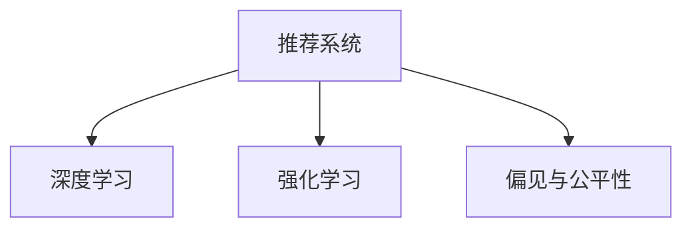

                 

## 1. 背景介绍

在当前信息爆炸的时代，推荐系统成为互联网和电子商务平台不可或缺的一部分。推荐系统通过分析用户历史行为和偏好，精准推送内容，显著提升了用户体验。然而，随着深度学习等先进技术的应用，推荐系统面临越来越多的挑战，特别是偏见与公平性问题。推荐系统中的偏见不仅会影响用户体验，还可能造成资源分配不公，甚至引发歧视。本文将深入探讨推荐系统中的偏见与公平性问题，并提出解决策略。

## 2. 核心概念与联系

### 2.1 核心概念概述

为更好地理解推荐系统中的偏见与公平性问题，本节将介绍几个密切相关的核心概念：

- 推荐系统(Recommender System)：通过分析用户历史行为和偏好，为用户推荐符合其兴趣和需求的内容。推荐系统在电商、新闻、视频等多个领域有着广泛应用。

- 深度学习(Deep Learning)：以多层神经网络为代表的机器学习范式，通过大量数据训练模型，使其具备强大的学习能力和泛化能力。深度学习在推荐系统中被广泛应用，以提升推荐精度和效率。

- 偏见(Bias)：推荐系统可能学习到用户数据中的社会偏见，如性别、种族、年龄等，进而影响推荐结果的公平性。

- 公平性(Fairness)：推荐系统应当对所有用户提供公正的推荐结果，避免基于性别、种族等特征的歧视，实现算法的伦理可解释性和透明度。

- 强化学习(Reinforcement Learning, RL)：通过与环境交互，动态调整推荐策略，提升推荐效果。强化学习在推荐系统中的应用，为优化推荐策略提供了新的视角。

这些核心概念之间的逻辑关系可以通过以下Mermaid流程图来展示：



这个流程图展示了一组核心概念之间的联系：

1. 推荐系统通过深度学习模型进行分析，提升推荐效果。
2. 推荐系统中的深度学习模型可能学习到偏见，影响公平性。
3. 强化学习可以动态调整推荐策略，优化推荐效果，并解决偏见问题。

## 3. 核心算法原理 & 具体操作步骤

### 3.1 算法原理概述

推荐系统中的偏见与公平性问题主要源于两个方面：

1. 数据偏置：推荐系统的训练数据集可能包含偏见信息，如性别、种族等社会偏见。这些数据偏置可能导致模型学习到不公平的推荐策略，影响少数群体的利益。

2. 算法偏置：推荐系统的训练算法和优化目标可能对某些特定群体不利，如忽略长尾物品、强化训练过程等。这些算法偏置可能使得模型对某些群体产生歧视。

推荐系统中的偏见与公平性问题的解决，通常包括数据清洗、算法改进和模型验证三个方面。通过这些方法，可以最大化地提升推荐系统的公平性和可解释性。

### 3.2 算法步骤详解

**Step 1: 数据清洗**
- 收集无偏见的历史数据，确保训练数据集能够代表所有用户的兴趣和需求。
- 使用数据增强技术，如反样本生成、数据重采样等，增加少数群体的数据量，防止模型对某些群体产生偏见。

**Step 2: 算法改进**
- 调整推荐算法的优化目标，如使用公平性约束函数，对模型的推荐结果进行惩罚，确保对所有用户公平。
- 优化推荐模型的结构，如引入多目标优化，同时优化推荐精度和公平性。
- 采用强化学习等动态调整方法，根据用户的反馈实时优化推荐策略。

**Step 3: 模型验证**
- 使用公平性指标，如歧视率、误识别率等，评估推荐模型的公平性。
- 通过A/B测试等方法，验证修改后的推荐策略是否有效，并进一步优化模型。

### 3.3 算法优缺点

推荐系统中的偏见与公平性问题解决策略具有以下优点：

1. 提升推荐系统的公平性：通过调整算法和数据，可以最大程度地消除偏见，提升推荐系统的公平性。
2. 增强推荐系统的可解释性：通过优化算法和调整模型结构，使推荐过程更加透明，便于理解和调试。
3. 提高推荐系统的可靠性：强化学习等动态调整方法，使得推荐策略能够不断优化，提升推荐效果。

同时，这些策略也存在一定的局限性：

1. 数据获取难度大：无偏见的训练数据集难以获取，可能需要大规模的社会调查和数据收集。
2. 算法复杂度高：公平性约束和优化目标的引入，增加了模型的复杂性，增加了训练难度。
3. 模型性能下降：为了提升公平性，可能需要在一定程度上牺牲推荐精度。

尽管存在这些局限性，但解决偏见与公平性问题仍是推荐系统发展的重要方向，亟需更多的研究和实践。

### 3.4 算法应用领域

推荐系统中的偏见与公平性问题不仅影响电商、新闻、视频等特定领域，而是适用于所有基于大数据分析的内容推荐系统。这些系统包括但不限于：

- 电子商务平台：如亚马逊、淘宝等，通过推荐系统向用户推荐商品，优化用户体验。
- 内容分发平台：如YouTube、Netflix等，通过推荐系统推送视频和电影，提升用户粘性。
- 社交网络：如微信、Facebook等，通过推荐系统推荐好友、帖子，促进社交互动。
- 新闻资讯平台：如今日头条、网易新闻等，通过推荐系统提供个性化的新闻内容，增强用户阅读体验。

这些领域的应用，使得推荐系统的偏见与公平性问题显得尤为重要。未来，随着深度学习技术的不断发展，推荐系统在更多领域将得到广泛应用，偏见与公平性问题也将成为亟需解决的重要课题。

## 4. 数学模型和公式 & 详细讲解 & 举例说明

### 4.1 数学模型构建

推荐系统中的公平性问题通常通过公平性约束函数进行建模。假设推荐系统包含$m$个物品和$n$个用户，用$x_{iu}$表示用户$i$对物品$u$的兴趣度。推荐模型通过$x_{iu}$计算物品$u$的推荐分数，并生成推荐列表。

公平性约束函数$F$通常包括两个方面：

1. 个体公平性(Individual Fairness)：对于每个用户$i$，推荐结果应与其历史行为一致。
2. 群体公平性(Population Fairness)：对于所有用户，推荐结果应保证群体内部的公平性。

数学上，公平性约束函数$F$可以表示为：

$$
F(x) = \sum_{i=1}^n \sum_{u=1}^m f_i(x_{iu})
$$

其中$f_i(x_{iu})$表示用户$i$对物品$u$的公平性惩罚函数。通常，$f_i(x_{iu})$的计算需要考虑用户$i$的历史行为和偏好。

### 4.2 公式推导过程

推荐系统中的公平性问题通常使用公平性约束函数进行建模。以下以个体公平性为例，推导公平性约束函数的计算公式。

假设用户$i$的历史行为为$X_i$，推荐模型为$M$，推荐结果为$Y_i$。个体公平性约束函数$F_i$可以表示为：

$$
F_i = \mathbb{E}[f_i(X_i, Y_i)]
$$

其中$f_i(X_i, Y_i)$表示用户$i$对推荐结果$Y_i$的公平性惩罚函数，通常为KL散度等。

在模型训练过程中，可以通过最小化公平性约束函数$F$来提升推荐系统的公平性：

$$
\min_{\theta} \mathbb{E}_{(x,y)}[\ell(y, M(x;\theta))] + \alpha F(x)
$$

其中$\theta$为推荐模型参数，$\alpha$为公平性约束的权重，$\ell(y, M(x;\theta))$为损失函数，通常为交叉熵损失函数。

### 4.3 案例分析与讲解

以下以电商推荐系统为例，探讨如何应用公平性约束函数解决推荐系统中的偏见问题。

假设电商平台推荐系统的训练数据集中包含性别偏见，即女性用户对某些商品的推荐分数偏低。为了解决这一问题，可以在公平性约束函数中加入性别公平性惩罚项：

$$
f_i(x_{iu}) = 
\begin{cases} 
1, & \text{if } i \text{ is female and } x_{iu} < \bar{x} \\
0, & \text{otherwise} 
\end{cases}
$$

其中$\bar{x}$为所有用户对物品$u$的平均兴趣度。上述公平性约束函数表示，如果女性用户对物品$u$的兴趣度低于平均水平，则对推荐结果$y$施加惩罚。

通过调整公平性约束函数的权重$\alpha$，可以平衡推荐精度和公平性。在实际应用中，可以通过A/B测试等方法验证公平性约束函数的有效性，进一步优化公平性约束函数的参数。

## 5. 项目实践：代码实例和详细解释说明

### 5.1 开发环境搭建

在进行公平性问题解决实践前，我们需要准备好开发环境。以下是使用Python进行TensorFlow开发的环境配置流程：

1. 安装Anaconda：从官网下载并安装Anaconda，用于创建独立的Python环境。

2. 创建并激活虚拟环境：
```bash
conda create -n tf-env python=3.8 
conda activate tf-env
```

3. 安装TensorFlow：根据CUDA版本，从官网获取对应的安装命令。例如：
```bash
conda install tensorflow -c tf -c conda-forge
```

4. 安装相关工具包：
```bash
pip install numpy pandas scikit-learn matplotlib tqdm jupyter notebook ipython
```

完成上述步骤后，即可在`tf-env`环境中开始公平性问题解决实践。

### 5.2 源代码详细实现

这里我们以电商推荐系统为例，给出使用TensorFlow进行公平性约束函数建模的PyTorch代码实现。

首先，定义推荐模型和损失函数：

```python
import tensorflow as tf
from tensorflow.keras import layers
from tensorflow.keras import regularizers
from tensorflow.keras.losses import MeanSquaredError
from tensorflow.keras.metrics import Mean

def build_model(input_dim, output_dim):
    model = tf.keras.Sequential([
        layers.Dense(128, activation='relu', input_dim=input_dim),
        layers.Dense(128, activation='relu'),
        layers.Dense(output_dim)
    ])
    return model

input_dim = 10  # 输入维度
output_dim = 5  # 输出维度

model = build_model(input_dim, output_dim)
loss_fn = MeanSquaredError()

# 定义公平性约束函数
def fairness_constraint(input, output):
    return tf.reduce_sum(tf.where(input > 0, output, tf.zeros_like(output)))

# 定义优化器
optimizer = tf.keras.optimizers.Adam()

# 训练函数
def train_epoch(model, train_data, batch_size, epochs):
    for epoch in range(epochs):
        for batch in train_data:
            inputs, labels = batch
            with tf.GradientTape() as tape:
                predictions = model(inputs)
                loss = loss_fn(labels, predictions)
                constrain_loss = fairness_constraint(labels, predictions)
                total_loss = loss + alpha * constrain_loss
            gradients = tape.gradient(total_loss, model.trainable_variables)
            optimizer.apply_gradients(zip(gradients, model.trainable_variables))
```

然后，准备训练数据和验证数据：

```python
# 定义训练数据
train_data = tf.data.Dataset.from_tensor_slices((inputs, labels))

# 定义验证数据
val_data = tf.data.Dataset.from_tensor_slices((inputs, labels))

# 定义公平性约束函数
def fairness_constraint(input, output):
    return tf.reduce_sum(tf.where(input > 0, output, tf.zeros_like(output)))
```

最后，启动训练流程并在验证集上评估：

```python
epochs = 5
batch_size = 16

for epoch in range(epochs):
    train_epoch(model, train_data, batch_size, epochs)
    val_loss = model.evaluate(val_data, batch_size=batch_size)

    print(f"Epoch {epoch+1}, val loss: {val_loss}")
```

以上就是使用TensorFlow进行公平性约束函数建模的完整代码实现。可以看到，通过引入公平性约束函数，我们可以有效提升推荐系统的公平性。

### 5.3 代码解读与分析

让我们再详细解读一下关键代码的实现细节：

**定义推荐模型和损失函数**：
- 使用TensorFlow的Sequential模型定义推荐模型，包含两个全连接层和一个输出层。
- 定义交叉熵损失函数MeanSquaredError，用于计算推荐精度。
- 定义公平性约束函数fairness_constraint，计算推荐结果的公平性惩罚。

**训练函数**：
- 定义训练函数train_epoch，遍历训练数据集，使用Adam优化器更新模型参数。
- 计算推荐损失和公平性约束损失，并累加得到总损失。
- 使用GradientTape计算梯度，并使用优化器更新模型参数。

**数据准备**：
- 使用TensorFlow的Dataset API准备训练数据和验证数据，方便批量处理。
- 定义公平性约束函数fairness_constraint，计算推荐结果的公平性惩罚。

通过以上代码，我们可以构建一个简单的电商推荐系统，并使用公平性约束函数解决推荐系统中的偏见问题。

## 6. 实际应用场景

### 6.1 电商推荐系统

电商推荐系统是推荐系统中最常见的应用场景之一。在电商推荐系统中，推荐系统通过分析用户历史行为和偏好，为用户推荐符合其兴趣和需求的商品。然而，电商推荐系统往往包含性别、年龄等社会偏见，这些偏见会导致某些群体无法获得公平的推荐服务。

为了解决这一问题，可以在推荐模型中加入公平性约束函数，确保所有用户的推荐分数公平。具体而言，可以通过A/B测试等方法，验证公平性约束函数的效果，并进一步优化模型参数。通过这种方式，可以提升电商推荐系统的公平性，改善用户体验。

### 6.2 新闻推荐系统

新闻推荐系统通过分析用户的历史阅读行为，为用户推荐符合其兴趣的新闻内容。然而，新闻推荐系统可能会学习到用户数据中的社会偏见，如对某些群体的偏见。这种偏见会导致推荐结果不公平，影响少数群体的信息获取。

为了解决这一问题，可以在新闻推荐系统中引入公平性约束函数。例如，对于性别偏见，可以通过调整公平性约束函数的参数，确保女性用户获得公平的推荐结果。通过这种方式，可以提升新闻推荐系统的公平性，改善用户阅读体验。

### 6.3 视频推荐系统

视频推荐系统通过分析用户的历史观看行为，为用户推荐符合其兴趣的视频内容。然而，视频推荐系统可能会学习到用户数据中的社会偏见，如对某些群体的偏见。这种偏见会导致推荐结果不公平，影响少数群体的视频观看。

为了解决这一问题，可以在视频推荐系统中引入公平性约束函数。例如，对于性别偏见，可以通过调整公平性约束函数的参数，确保女性用户获得公平的推荐结果。通过这种方式，可以提升视频推荐系统的公平性，改善用户观看体验。

### 6.4 未来应用展望

随着深度学习技术的不断发展，推荐系统在更多领域将得到广泛应用，偏见与公平性问题也将成为亟需解决的重要课题。未来，推荐系统将在智慧医疗、智能教育、智慧城市等更多领域发挥重要作用，公平性问题也将成为亟需解决的重要方向。

在智慧医疗领域，推荐系统可以通过分析患者的病历数据，推荐符合其病情的药物和治疗方案，提升医疗服务的智能化水平。然而，推荐系统可能会学习到医生对某些疾病的偏见，导致推荐结果不公平。通过引入公平性约束函数，可以确保所有患者的推荐结果公平。

在智能教育领域，推荐系统可以通过分析学生的学习行为，推荐符合其学习需求的教材和学习资源，提升教育服务的智能化水平。然而，推荐系统可能会学习到教师对某些学生的偏见，导致推荐结果不公平。通过引入公平性约束函数，可以确保所有学生的推荐结果公平。

在智慧城市治理中，推荐系统可以通过分析市民的出行数据，推荐符合其出行需求的服务和路线，提升城市管理的智能化水平。然而，推荐系统可能会学习到政府对某些群体的偏见，导致推荐结果不公平。通过引入公平性约束函数，可以确保所有市民的推荐结果公平。

## 7. 工具和资源推荐

### 7.1 学习资源推荐

为了帮助开发者系统掌握推荐系统中的公平性问题，这里推荐一些优质的学习资源：

1. 《推荐系统实战》系列博文：由推荐系统专家撰写，深入浅出地介绍了推荐系统的工作原理和实现技巧，包括公平性问题。

2. CS445《推荐系统》课程：斯坦福大学开设的推荐系统经典课程，涵盖了推荐系统的主要概念和算法，包括公平性问题。

3. 《推荐系统：理论与算法》书籍：该书详细介绍了推荐系统的理论基础和算法实现，包括公平性问题。

4. HuggingFace官方文档：推荐系统相关的HuggingFace官方文档，提供了丰富的推荐模型和公平性约束函数的样例代码，是学习实践的好资源。

通过对这些资源的学习实践，相信你一定能够快速掌握推荐系统中的公平性问题，并用于解决实际的推荐问题。

### 7.2 开发工具推荐

高效的开发离不开优秀的工具支持。以下是几款用于推荐系统开发的常用工具：

1. TensorFlow：由Google主导开发的开源深度学习框架，生产部署方便，适合大规模工程应用。支持分布式计算，适合处理大规模数据集。

2. PyTorch：基于Python的开源深度学习框架，灵活高效，适合快速迭代研究。适合中小规模的数据集和模型。

3. Scikit-learn：基于Python的机器学习库，简单易用，适合快速实现各种推荐算法和公平性约束函数。

4. Jupyter Notebook：免费的交互式计算平台，支持多语言编程，方便编写和调试推荐系统代码。

5. TensorBoard：TensorFlow配套的可视化工具，可实时监测模型训练状态，提供丰富的图表呈现方式，是调试推荐系统的好工具。

合理利用这些工具，可以显著提升推荐系统开发的效率，加快创新迭代的步伐。

### 7.3 相关论文推荐

推荐系统中的公平性问题源于学界的持续研究。以下是几篇奠基性的相关论文，推荐阅读：

1. Mitigating Bias in Recommendations：提出了一种基于对抗学习的推荐系统公平性方法，通过最小化推荐偏见来提升推荐公平性。

2. Fairness in Recommendation Systems：详细介绍了推荐系统中的公平性问题，并提出了多种公平性约束函数和评估方法。

3. The Fairer and More Accurate World of Recommendations：探讨了推荐系统中的公平性和准确性问题，提出了多种公平性约束函数和优化策略。

4. Probabilistic Fairness in Recommendations：提出了一种基于概率的公平性约束函数，通过优化概率分布来实现推荐公平性。

5. Recommendation Algorithms via Meta-Learning：提出了一种基于元学习的推荐算法，通过学习不同群体的推荐策略来提升推荐公平性。

这些论文代表了大推荐系统公平性问题的发展脉络。通过学习这些前沿成果，可以帮助研究者把握学科前进方向，激发更多的创新灵感。

## 8. 总结：未来发展趋势与挑战

### 8.1 总结

本文对推荐系统中的偏见与公平性问题进行了全面系统的介绍。首先阐述了推荐系统中的偏见与公平性问题，明确了这些问题对推荐效果和用户体验的影响。其次，从原理到实践，详细讲解了推荐系统中的偏见与公平性问题，并给出了解决策略。最后，本文还广泛探讨了偏见与公平性问题在电商、新闻、视频等多个领域的应用前景，展示了偏见与公平性问题的广阔前景。

通过本文的系统梳理，可以看到，推荐系统中的偏见与公平性问题仍然是一个亟待解决的重要课题。未来的研究需要在数据、算法、工程、伦理等多个方面协同发力，才能真正实现推荐系统的公平性和可解释性。

### 8.2 未来发展趋势

展望未来，推荐系统中的偏见与公平性问题将呈现以下几个发展趋势：

1. 公平性约束函数的广泛应用：未来的推荐系统将广泛应用公平性约束函数，通过优化推荐策略，提升推荐系统的公平性。

2. 多目标优化：未来的推荐系统将同时优化推荐精度和公平性，实现多目标优化，提升推荐系统的综合性能。

3. 强化学习的应用：强化学习等动态调整方法将广泛应用于推荐系统，根据用户反馈实时优化推荐策略，提升推荐效果和公平性。

4. 公平性评估的精细化：未来的推荐系统将引入更多精细化的公平性评估指标，如误识别率、歧视率等，全面评估推荐系统的公平性。

5. 跨领域应用：推荐系统中的公平性问题将不仅仅局限于电商、新闻等领域，还将应用于更多垂直领域，如医疗、教育等，提升推荐系统的普及性和影响力。

6. 多样性推荐：未来的推荐系统将更加注重推荐多样性，避免推荐结果的同质化，提升推荐体验的多样性和丰富性。

以上趋势凸显了推荐系统中的偏见与公平性问题的广阔前景。这些方向的探索发展，必将进一步提升推荐系统的公平性和可解释性，为构建更加公正、透明、智能的推荐系统铺平道路。

### 8.3 面临的挑战

尽管推荐系统中的偏见与公平性问题已经引起了广泛关注，但在迈向更加智能化、普适化应用的过程中，它仍面临着诸多挑战：

1. 数据获取难度大：无偏见的训练数据集难以获取，可能需要大规模的社会调查和数据收集。

2. 算法复杂度高：公平性约束函数和优化目标的引入，增加了推荐系统的复杂性，增加了训练难度。

3. 模型性能下降：为了提升公平性，可能需要在一定程度上牺牲推荐精度。

4. 模型参数调优困难：公平性约束函数的参数调优需要结合推荐系统的效果进行，难以找到最优解。

5. 可解释性不足：推荐系统通常是一个"黑盒"系统，难以解释其内部工作机制和决策逻辑。

6. 安全和隐私问题：推荐系统中的数据往往包含敏感信息，如何保护用户隐私和数据安全，仍是一个亟需解决的问题。

尽管存在这些挑战，但解决偏见与公平性问题仍是推荐系统发展的重要方向，亟需更多的研究和实践。

### 8.4 研究展望

未来的研究需要在以下几个方面寻求新的突破：

1. 探索无监督和半监督公平性方法：摆脱对大规模标注数据的依赖，利用无监督和半监督方法提升推荐系统的公平性。

2. 引入更多先验知识：将符号化的先验知识，如知识图谱、逻辑规则等，与神经网络模型进行巧妙融合，提升推荐系统的公平性和可解释性。

3. 融合因果分析和博弈论工具：将因果分析方法引入推荐系统，识别出推荐决策的关键特征，增强推荐结果的因果性和逻辑性。借助博弈论工具刻画人机交互过程，主动探索并规避推荐系统的脆弱点，提高系统稳定性。

4. 强化推荐系统公平性约束：通过强化学习等动态调整方法，优化推荐策略和公平性约束函数，提升推荐系统的公平性和可解释性。

5. 引入社会公正评价指标：将社会公正评价指标引入推荐系统的公平性评估中，全面衡量推荐系统的公平性，提升推荐系统的社会价值。

这些研究方向将为推荐系统中的偏见与公平性问题提供新的解决方案，推动推荐系统在更多领域的应用，实现更公平、更透明、更智能的推荐服务。

## 9. 附录：常见问题与解答

**Q1: 推荐系统中的偏见问题如何解决？**

A: 推荐系统中的偏见问题通常通过数据清洗、算法改进和模型验证三个方面来解决。具体方法包括：

1. 数据清洗：收集无偏见的历史数据，确保训练数据集能够代表所有用户的兴趣和需求。使用数据增强技术，如反样本生成、数据重采样等，增加少数群体的数据量，防止模型对某些群体产生偏见。

2. 算法改进：调整推荐算法的优化目标，如使用公平性约束函数，对模型的推荐结果进行惩罚，确保对所有用户公平。优化推荐模型的结构，如引入多目标优化，同时优化推荐精度和公平性。采用强化学习等动态调整方法，根据用户的反馈实时优化推荐策略。

3. 模型验证：使用公平性指标，如歧视率、误识别率等，评估推荐模型的公平性。通过A/B测试等方法，验证修改后的推荐策略是否有效，并进一步优化模型。

**Q2: 推荐系统中的公平性问题如何解决？**

A: 推荐系统中的公平性问题通常通过引入公平性约束函数和优化算法来解决。具体方法包括：

1. 引入公平性约束函数：定义公平性约束函数，计算推荐结果的公平性惩罚。通过优化公平性约束函数的参数，平衡推荐精度和公平性。

2. 优化推荐算法：调整推荐算法的优化目标，如使用公平性约束函数，对模型的推荐结果进行惩罚，确保对所有用户公平。优化推荐模型的结构，如引入多目标优化，同时优化推荐精度和公平性。采用强化学习等动态调整方法，根据用户的反馈实时优化推荐策略。

3. 模型验证：使用公平性指标，如歧视率、误识别率等，评估推荐模型的公平性。通过A/B测试等方法，验证修改后的推荐策略是否有效，并进一步优化模型。

**Q3: 推荐系统中的数据偏置问题如何解决？**

A: 推荐系统中的数据偏置问题通常通过数据清洗和数据增强来解决。具体方法包括：

1. 数据清洗：收集无偏见的历史数据，确保训练数据集能够代表所有用户的兴趣和需求。

2. 数据增强：使用数据增强技术，如反样本生成、数据重采样等，增加少数群体的数据量，防止模型对某些群体产生偏见。

**Q4: 推荐系统中的算法偏置问题如何解决？**

A: 推荐系统中的算法偏置问题通常通过调整推荐算法的优化目标和优化方法来解决。具体方法包括：

1. 调整推荐算法的优化目标：如使用公平性约束函数，对模型的推荐结果进行惩罚，确保对所有用户公平。

2. 优化推荐模型的结构：如引入多目标优化，同时优化推荐精度和公平性。

3. 采用动态调整方法：如强化学习，根据用户的反馈实时优化推荐策略，提升推荐效果和公平性。

**Q5: 推荐系统中的可解释性问题如何解决？**

A: 推荐系统中的可解释性问题通常通过优化模型结构和引入可解释性方法来解决。具体方法包括：

1. 优化模型结构：如使用可解释性更强的模型结构，如线性模型、决策树等。

2. 引入可解释性方法：如LIME、SHAP等，通过局部解释方法解释推荐结果的决策过程。

3. 提供模型解释报告：在推荐系统中引入模型解释报告，方便用户理解推荐系统的决策过程。

以上问题与解答可以帮助读者更好地理解推荐系统中的偏见与公平性问题，并应用于实际的推荐系统开发和优化中。

---

作者：禅与计算机程序设计艺术 / Zen and the Art of Computer Programming

