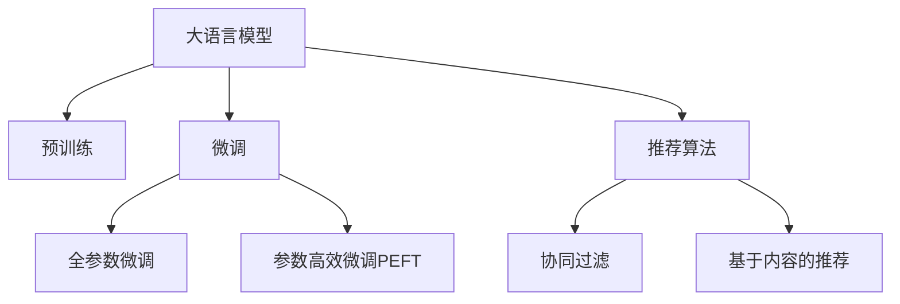

                 

# LLM推荐系统局限：硬件与算力需求

## 1. 背景介绍

### 1.1 问题由来

推荐系统是现代信息系统中不可或缺的组件，通过分析用户行为和兴趣，为用户推荐感兴趣的内容，提升用户体验，增加收入和流量。目前主流的推荐系统主要包括基于协同过滤、内容推荐、深度学习等技术，但这些系统在面对复杂和多样化需求时，往往难以提供满意的个性化推荐。

随着深度学习技术的不断发展，大语言模型（Large Language Models, LLMs）如BERT、GPT等，凭借其强大的语言理解和生成能力，逐渐成为推荐系统中的一种新兴力量。但与此同时，大语言模型推荐系统面临硬件与算力需求庞大的问题，严重制约了其落地应用。因此，本文将深入探讨大语言模型推荐系统的局限性，特别是硬件与算力需求问题。

### 1.2 问题核心关键点

大语言模型推荐系统的局限性主要体现在硬件与算力需求上。具体包括：

- 高存储需求：大语言模型的预训练和微调需要存储大量的模型参数和数据，给存储系统带来极大压力。
- 高计算需求：大语言模型的推理和微调涉及复杂的神经网络计算，对算力要求极高。
- 资源消耗：大规模模型的训练和推理过程中，GPU、TPU等高性能计算资源消耗巨大，费用昂贵。
- 系统部署：复杂的多层级模型和高性能硬件要求，导致系统部署和运维成本高昂。

本文将对大语言模型推荐系统的硬件与算力需求进行深入分析，并探讨相关优化策略，以期为解决这些问题提供参考。

## 2. 核心概念与联系

### 2.1 核心概念概述

为了更好地理解大语言模型推荐系统的局限性，本节将介绍几个密切相关的核心概念：

- 大语言模型（LLMs）：以BERT、GPT等自回归或自编码模型为代表的大规模预训练语言模型。通过在大规模无标签文本语料上进行预训练，学习通用的语言表示，具备强大的语言理解和生成能力。
- 推荐系统（Recommender System）：基于用户行为、兴趣、内容特征等信息，为用户推荐感兴趣的商品、文章、视频等内容。
- 微调（Fine-Tuning）：指在预训练模型的基础上，使用下游任务的少量标注数据，通过有监督学习优化模型在特定任务上的性能。通常只需要调整顶层分类器或解码器，并以较小的学习率更新全部或部分的模型参数。
- 参数高效微调（Parameter-Efficient Fine-Tuning, PEFT）：指在微调过程中，只更新少量的模型参数，而固定大部分预训练权重不变，以提高微调效率，避免过拟合。
- 推荐算法：包括协同过滤、基于内容的推荐、矩阵分解、深度学习等技术，用于实现推荐系统。
- 协同过滤（Collaborative Filtering）：通过分析用户行为和物品属性，建立用户与物品的协同关系，实现个性化推荐。
- 基于内容的推荐（Content-Based Recommendation）：通过分析物品的属性和特征，直接向用户推荐与用户兴趣相似的物品。

这些核心概念之间的逻辑关系可以通过以下Mermaid流程图来展示：



这个流程图展示了大语言模型推荐系统的核心概念及其之间的关系：

1. 大语言模型通过预训练获得基础能力。
2. 微调是对预训练模型进行任务特定的优化，可以分为全参数微调和参数高效微调（PEFT）。
3. 推荐算法是推荐系统的核心技术，包括协同过滤、基于内容的推荐等。
4. 参数高效微调技术可以减少微调过程中的资源消耗，提高效率。

这些概念共同构成了大语言模型推荐系统的学习框架，使其能够在各种场景下发挥强大的语言理解和生成能力。通过理解这些核心概念，我们可以更好地把握大语言模型推荐系统的基本原理和优化方向。

## 3. 核心算法原理 & 具体操作步骤

### 3.1 算法原理概述

大语言模型推荐系统的主要算法原理包括：

- 基于语义的推荐：利用预训练语言模型的语义表示，捕捉用户和物品之间的语义关系。
- 知识增强的推荐：结合外部知识库和规则库，增强语言模型的推荐能力。
- 基于用户偏好的推荐：通过分析用户行为和偏好，建立用户-物品关联。
- 多模态推荐：结合文本、图像、音频等多模态信息，提升推荐效果。
- 深度学习推荐：利用深度神经网络模型，对用户行为和物品特征进行建模。

这些算法原理通过与大语言模型的结合，实现了推荐系统从基于行为数据的浅层次推荐，到基于语义深层次推荐的跨越。

### 3.2 算法步骤详解

大语言模型推荐系统的一般步骤包括：

**Step 1: 准备预训练模型和数据集**

- 选择合适的预训练语言模型 $M_{\theta}$ 作为初始化参数，如 BERT、GPT等。
- 准备推荐任务的数据集 $D=\{(u_i, i_i)\}_{i=1}^N$，其中 $u_i$ 为用户ID，$i_i$ 为物品ID。

**Step 2: 设计推荐模型**

- 根据任务类型，在预训练模型顶层设计合适的输出层和损失函数。
- 对于推荐任务，通常使用交叉熵损失函数来衡量预测输出与真实标签之间的差异。

**Step 3: 设置微调超参数**

- 选择合适的优化算法及其参数，如 AdamW、SGD 等，设置学习率、批大小、迭代轮数等。
- 设置正则化技术及强度，包括权重衰减、Dropout、Early Stopping等。
- 确定冻结预训练参数的策略，如仅微调顶层，或全部参数都参与微调。

**Step 4: 执行梯度训练**

- 将推荐集数据分批次输入模型，前向传播计算损失函数。
- 反向传播计算参数梯度，根据设定的优化算法和学习率更新模型参数。
- 周期性在验证集上评估模型性能，根据性能指标决定是否触发 Early Stopping。
- 重复上述步骤直到满足预设的迭代轮数或 Early Stopping 条件。

**Step 5: 测试和部署**

- 在测试集上评估微调后模型 $M_{\hat{\theta}}$ 的性能，对比微调前后的推荐效果。
- 使用微调后的模型对新样本进行推理预测，集成到实际的应用系统中。
- 持续收集新的用户行为数据，定期重新微调模型，以适应数据分布的变化。

以上是基于监督学习微调大语言模型的一般流程。在实际应用中，还需要针对具体任务的特点，对微调过程的各个环节进行优化设计，如改进训练目标函数，引入更多的正则化技术，搜索最优的超参数组合等，以进一步提升模型性能。

### 3.3 算法优缺点

大语言模型推荐系统的优点包括：

1. 强大的语言理解能力：通过预训练和微调，大语言模型具备强大的语义理解和生成能力，能更好地捕捉用户和物品之间的语义关系。
2. 泛化能力强：大语言模型在处理多模态数据时具有较强的泛化能力，能更好地适应多样化的推荐场景。
3. 灵活性高：通过微调和参数高效微调，大语言模型推荐系统可以根据不同任务需求进行灵活调整，适应多样化的推荐目标。

但同时，该方法也存在一定的局限性：

1. 资源消耗大：大语言模型的存储和计算需求高，需要高性能计算资源和存储设备，成本昂贵。
2. 部署复杂：多层的模型结构和复杂的推理过程，导致系统部署和运维成本高。
3. 数据需求大：微调过程中需要大量的标注数据，数据获取和处理成本高，且对标注数据质量要求高。
4. 推理效率低：大语言模型的推理速度慢，特别是在硬件资源不足的情况下，用户体验差。
5. 结果可解释性差：大语言模型的黑盒特性，使得其推荐结果缺乏可解释性，难以满足用户需求。

尽管存在这些局限性，但大语言模型推荐系统以其强大的语言理解和生成能力，有望成为推荐系统的新范式。未来相关研究的重点在于如何进一步降低资源消耗，提高推理效率，提高结果可解释性，以及如何更好地与外部知识库和规则库结合，增强推荐效果。

### 3.4 算法应用领域

大语言模型推荐系统已经在多个领域得到了应用，例如：

- 电商推荐：通过分析用户浏览、购买行为，为用户推荐商品。
- 视频推荐：根据用户观看的视频内容和历史行为，推荐类似视频。
- 音乐推荐：根据用户听歌行为，推荐相似的歌曲和艺人。
- 新闻推荐：分析用户阅读兴趣，推荐相关新闻文章。
- 阅读推荐：根据用户阅读历史，推荐感兴趣的书籍和文章。
- 旅游推荐：分析用户旅游兴趣和行为，推荐旅游景点和线路。
- 教育推荐：根据学生的学习历史和兴趣，推荐相关课程和资料。

除了这些经典任务外，大语言模型推荐系统还被创新性地应用到更多场景中，如可控推荐、跨领域推荐、实时推荐等，为推荐系统带来了新的突破。随着预训练模型和推荐方法的不断进步，相信大语言模型推荐系统必将在更广阔的应用领域大放异彩。

## 4. 数学模型和公式 & 详细讲解

### 4.1 数学模型构建

本节将使用数学语言对大语言模型推荐系统的数学模型进行更加严格的刻画。

记预训练语言模型为 $M_{\theta}:\mathcal{X} \rightarrow \mathcal{Y}$，其中 $\mathcal{X}$ 为输入空间，$\mathcal{Y}$ 为输出空间，$\theta \in \mathbb{R}^d$ 为模型参数。假设推荐任务的数据集为 $D=\{(u_i, i_i)\}_{i=1}^N, u_i \in U, i_i \in I$，其中 $U$ 为用户集合，$I$ 为物品集合。

定义模型 $M_{\theta}$ 在用户行为序列 $u_i$ 上的输出为 $\hat{i}=M_{\theta}(u_i) \in I$，表示模型预测物品 $i_i$ 为用户 $u_i$ 的推荐结果。

### 4.2 公式推导过程

以下我们以二分类任务为例，推导交叉熵损失函数及其梯度的计算公式。

假设模型 $M_{\theta}$ 在用户行为序列 $u_i$ 上的输出为 $\hat{y}=M_{\theta}(u_i) \in [0,1]$，表示用户 $u_i$ 对物品 $i_i$ 的偏好程度。真实标签 $y \in \{0,1\}$。则二分类交叉熵损失函数定义为：

$$
\ell(M_{\theta}(u_i),y) = -[y\log \hat{y} + (1-y)\log (1-\hat{y})]
$$

将其代入经验风险公式，得：

$$
\mathcal{L}(\theta) = \frac{1}{N}\sum_{i=1}^N [y_i\log M_{\theta}(u_i)+(1-y_i)\log(1-M_{\theta}(u_i))]
$$

根据链式法则，损失函数对参数 $\theta_k$ 的梯度为：

$$
\frac{\partial \mathcal{L}(\theta)}{\partial \theta_k} = -\frac{1}{N}\sum_{i=1}^N (\frac{y_i}{M_{\theta}(u_i)}-\frac{1-y_i}{1-M_{\theta}(u_i)}) \frac{\partial M_{\theta}(u_i)}{\partial \theta_k}
$$

其中 $\frac{\partial M_{\theta}(u_i)}{\partial \theta_k}$ 可进一步递归展开，利用自动微分技术完成计算。

在得到损失函数的梯度后，即可带入参数更新公式，完成模型的迭代优化。重复上述过程直至收敛，最终得到适应下游任务的最优模型参数 $\theta^*$。

## 5. 项目实践：代码实例和详细解释说明

### 5.1 开发环境搭建

在进行大语言模型推荐系统开发前，我们需要准备好开发环境。以下是使用Python进行PyTorch开发的环境配置流程：

1. 安装Anaconda：从官网下载并安装Anaconda，用于创建独立的Python环境。

2. 创建并激活虚拟环境：
```bash
conda create -n pytorch-env python=3.8 
conda activate pytorch-env
```

3. 安装PyTorch：根据CUDA版本，从官网获取对应的安装命令。例如：
```bash
conda install pytorch torchvision torchaudio cudatoolkit=11.1 -c pytorch -c conda-forge
```

4. 安装Transformers库：
```bash
pip install transformers
```

5. 安装各类工具包：
```bash
pip install numpy pandas scikit-learn matplotlib tqdm jupyter notebook ipython
```

完成上述步骤后，即可在`pytorch-env`环境中开始开发。

### 5.2 源代码详细实现

下面我们以电商推荐任务为例，给出使用Transformers库对BERT模型进行推荐微调的PyTorch代码实现。

首先，定义推荐任务的数据处理函数：

```python
from transformers import BertTokenizer
from torch.utils.data import Dataset
import torch

class RecommendationDataset(Dataset):
    def __init__(self, user_ids, item_ids, tokenizer, max_len=128):
        self.user_ids = user_ids
        self.item_ids = item_ids
        self.tokenizer = tokenizer
        self.max_len = max_len
        
    def __len__(self):
        return len(self.user_ids)
    
    def __getitem__(self, item):
        user_id = self.user_ids[item]
        item_id = self.item_ids[item]
        
        encoding = self.tokenizer(user_id, return_tensors='pt', max_length=self.max_len, padding='max_length', truncation=True)
        user_input_ids = encoding['input_ids'][0]
        user_attention_mask = encoding['attention_mask'][0]
        
        # 对物品id进行编码
        encoded_item_id = [item2id[item_id] for item_id in item_id]
        encoded_item_id.extend([item2id['<PAD>']] * (self.max_len - len(encoded_item_id)))
        labels = torch.tensor(encoded_item_id, dtype=torch.long)
        
        return {'user_input_ids': user_input_ids, 
                'user_attention_mask': user_attention_mask,
                'labels': labels}

# 物品id与数字id的映射
item2id = {'<PAD>': 0, 'item1': 1, 'item2': 2, 'item3': 3, 'item4': 4}
id2item = {v: k for k, v in item2id.items()}

# 创建dataset
tokenizer = BertTokenizer.from_pretrained('bert-base-cased')

train_dataset = RecommendationDataset(train_user_ids, train_item_ids, tokenizer)
dev_dataset = RecommendationDataset(dev_user_ids, dev_item_ids, tokenizer)
test_dataset = RecommendationDataset(test_user_ids, test_item_ids, tokenizer)
```

然后，定义模型和优化器：

```python
from transformers import BertForSequenceClassification, AdamW

model = BertForSequenceClassification.from_pretrained('bert-base-cased', num_labels=len(item2id))

optimizer = AdamW(model.parameters(), lr=2e-5)
```

接着，定义训练和评估函数：

```python
from torch.utils.data import DataLoader
from tqdm import tqdm
from sklearn.metrics import classification_report

device = torch.device('cuda') if torch.cuda.is_available() else torch.device('cpu')
model.to(device)

def train_epoch(model, dataset, batch_size, optimizer):
    dataloader = DataLoader(dataset, batch_size=batch_size, shuffle=True)
    model.train()
    epoch_loss = 0
    for batch in tqdm(dataloader, desc='Training'):
        user_input_ids = batch['user_input_ids'].to(device)
        user_attention_mask = batch['user_attention_mask'].to(device)
        labels = batch['labels'].to(device)
        model.zero_grad()
        outputs = model(user_input_ids, attention_mask=user_attention_mask, labels=labels)
        loss = outputs.loss
        epoch_loss += loss.item()
        loss.backward()
        optimizer.step()
    return epoch_loss / len(dataloader)

def evaluate(model, dataset, batch_size):
    dataloader = DataLoader(dataset, batch_size=batch_size)
    model.eval()
    preds, labels = [], []
    with torch.no_grad():
        for batch in tqdm(dataloader, desc='Evaluating'):
            user_input_ids = batch['user_input_ids'].to(device)
            user_attention_mask = batch['user_attention_mask'].to(device)
            batch_labels = batch['labels']
            outputs = model(user_input_ids, attention_mask=user_attention_mask)
            batch_preds = outputs.logits.argmax(dim=2).to('cpu').tolist()
            batch_labels = batch_labels.to('cpu').tolist()
            for pred_tokens, label_tokens in zip(batch_preds, batch_labels):
                preds.append(pred_tokens[:len(label_tokens)])
                labels.append(label_tokens)
                
    print(classification_report(labels, preds))
```

最后，启动训练流程并在测试集上评估：

```python
epochs = 5
batch_size = 16

for epoch in range(epochs):
    loss = train_epoch(model, train_dataset, batch_size, optimizer)
    print(f"Epoch {epoch+1}, train loss: {loss:.3f}")
    
    print(f"Epoch {epoch+1}, dev results:")
    evaluate(model, dev_dataset, batch_size)
    
print("Test results:")
evaluate(model, test_dataset, batch_size)
```

以上就是使用PyTorch对BERT进行推荐任务微调的完整代码实现。可以看到，得益于Transformers库的强大封装，我们可以用相对简洁的代码完成BERT模型的加载和微调。

### 5.3 代码解读与分析

让我们再详细解读一下关键代码的实现细节：

**RecommendationDataset类**：
- `__init__`方法：初始化用户ID、物品ID、分词器等关键组件。
- `__len__`方法：返回数据集的样本数量。
- `__getitem__`方法：对单个样本进行处理，将用户ID输入编码为token ids，将物品ID进行编码，并对其进行定长padding，最终返回模型所需的输入。

**item2id和id2item字典**：
- 定义了物品ID与数字id之间的映射关系，用于将token-wise的预测结果解码回物品ID。

**训练和评估函数**：
- 使用PyTorch的DataLoader对数据集进行批次化加载，供模型训练和推理使用。
- 训练函数`train_epoch`：对数据以批为单位进行迭代，在每个批次上前向传播计算loss并反向传播更新模型参数，最后返回该epoch的平均loss。
- 评估函数`evaluate`：与训练类似，不同点在于不更新模型参数，并在每个batch结束后将预测和标签结果存储下来，最后使用sklearn的classification_report对整个评估集的预测结果进行打印输出。

**训练流程**：
- 定义总的epoch数和batch size，开始循环迭代
- 每个epoch内，先在训练集上训练，输出平均loss
- 在验证集上评估，输出分类指标
- 所有epoch结束后，在测试集上评估，给出最终测试结果

可以看到，PyTorch配合Transformers库使得BERT微调的代码实现变得简洁高效。开发者可以将更多精力放在数据处理、模型改进等高层逻辑上，而不必过多关注底层的实现细节。

当然，工业级的系统实现还需考虑更多因素，如模型的保存和部署、超参数的自动搜索、更灵活的任务适配层等。但核心的微调范式基本与此类似。

## 6. 实际应用场景

### 6.1 电商推荐

基于大语言模型推荐系统的电商推荐系统，可以为用户推荐感兴趣的商品，提升用户满意度和转化率。具体而言，可以收集用户浏览、购买行为数据，将行为序列作为输入，模型输出物品ID作为推荐结果。推荐模型可以对用户行为序列进行编码，学习用户行为与物品之间的关联，从而实现个性化推荐。

在技术实现上，可以使用BERT等大语言模型，结合序列编码技术，对用户行为序列进行编码，输出推荐物品ID。具体步骤如下：

1. 收集用户浏览、购买历史数据，提取用户ID、物品ID、时间戳等特征。
2. 将用户ID、物品ID进行编码，作为模型的输入序列。
3. 将时间戳等特征作为额外的输入，用于模型训练和推理。
4. 训练模型，优化损失函数，得到推荐物品ID。
5. 在测试集上评估推荐效果，使用分类指标评估模型性能。
6. 集成到电商系统，实时推荐商品，提高用户满意度。

### 6.2 视频推荐

基于大语言模型推荐系统的视频推荐系统，可以根据用户观看的视频内容和历史行为，推荐相关视频。具体而言，可以收集用户观看行为数据，将视频ID作为输入，模型输出推荐视频ID。推荐模型可以对视频ID进行编码，学习视频内容与用户之间的关联，从而实现个性化推荐。

在技术实现上，可以使用BERT等大语言模型，结合序列编码技术，对视频ID进行编码，输出推荐视频ID。具体步骤如下：

1. 收集用户观看行为数据，提取用户ID、视频ID、时间戳等特征。
2. 将视频ID进行编码，作为模型的输入序列。
3. 将时间戳等特征作为额外的输入，用于模型训练和推理。
4. 训练模型，优化损失函数，得到推荐视频ID。
5. 在测试集上评估推荐效果，使用分类指标评估模型性能。
6. 集成到视频平台，实时推荐视频，提高用户满意度。

### 6.3 音乐推荐

基于大语言模型推荐系统的音乐推荐系统，可以根据用户听歌行为，推荐相似的歌曲和艺人。具体而言，可以收集用户听歌历史数据，将歌曲ID作为输入，模型输出推荐歌曲ID。推荐模型可以对歌曲ID进行编码，学习歌曲内容与用户之间的关联，从而实现个性化推荐。

在技术实现上，可以使用BERT等大语言模型，结合序列编码技术，对歌曲ID进行编码，输出推荐歌曲ID。具体步骤如下：

1. 收集用户听歌历史数据，提取用户ID、歌曲ID、时间戳等特征。
2. 将歌曲ID进行编码，作为模型的输入序列。
3. 将时间戳等特征作为额外的输入，用于模型训练和推理。
4. 训练模型，优化损失函数，得到推荐歌曲ID。
5. 在测试集上评估推荐效果，使用分类指标评估模型性能。
6. 集成到音乐平台，实时推荐歌曲，提高用户满意度。

### 6.4 未来应用展望

随着大语言模型推荐系统的发展，其在多个领域的应用前景广阔，有望带来更多的创新和突破。

在智慧医疗领域，基于大语言模型的推荐系统可以为用户推荐相关医疗知识和健康建议，辅助医生诊疗，提高医疗效率和质量。

在智能教育领域，推荐系统可以为用户推荐相关学习资源和课程，因材施教，提高学习效率。

在智慧城市治理中，推荐系统可以为用户推荐相关城市服务和活动，提高城市管理效率和居民满意度。

此外，在企业生产、社会治理、文娱传媒等众多领域，基于大语言模型的推荐系统也将不断涌现，为各行各业带来新的突破。相信随着技术的日益成熟，推荐系统必将在更广阔的应用领域大放异彩。

## 7. 工具和资源推荐

### 7.1 学习资源推荐

为了帮助开发者系统掌握大语言模型推荐系统的理论基础和实践技巧，这里推荐一些优质的学习资源：

1. 《深度学习推荐系统》书籍：详细介绍了深度学习推荐系统的基本原理和经典模型，包括协同过滤、矩阵分解、深度神经网络等。
2. 《推荐系统实战》课程：国内知名推荐系统专家课程，涵盖协同过滤、深度学习、多模态推荐等技术，适合实战学习。
3. 《自然语言处理与推荐系统》博文：介绍了自然语言处理和推荐系统的结合方法，探讨了语义表示、知识图谱等技术的应用。
4. CS229《机器学习》课程：斯坦福大学开设的机器学习明星课程，涵盖深度学习、推荐系统等前沿技术，适合系统学习。
5. Kaggle推荐系统竞赛：数据科学竞赛平台，可以参与实际推荐系统开发和优化，提升实战经验。

通过对这些资源的学习实践，相信你一定能够快速掌握大语言模型推荐系统的精髓，并用于解决实际的推荐问题。

### 7.2 开发工具推荐

高效的开发离不开优秀的工具支持。以下是几款用于大语言模型推荐系统开发的常用工具：

1. PyTorch：基于Python的开源深度学习框架，灵活动态的计算图，适合快速迭代研究。大部分预训练语言模型都有PyTorch版本的实现。
2. TensorFlow：由Google主导开发的开源深度学习框架，生产部署方便，适合大规模工程应用。同样有丰富的预训练语言模型资源。
3. Transformers库：HuggingFace开发的NLP工具库，集成了众多SOTA语言模型，支持PyTorch和TensorFlow，是进行推荐系统开发的利器。
4. Weights & Biases：模型训练的实验跟踪工具，可以记录和可视化模型训练过程中的各项指标，方便对比和调优。与主流深度学习框架无缝集成。
5. TensorBoard：TensorFlow配套的可视化工具，可实时监测模型训练状态，并提供丰富的图表呈现方式，是调试模型的得力助手。
6. Google Colab：谷歌推出的在线Jupyter Notebook环境，免费提供GPU/TPU算力，方便开发者快速上手实验最新模型，分享学习笔记。

合理利用这些工具，可以显著提升大语言模型推荐系统的开发效率，加快创新迭代的步伐。

### 7.3 相关论文推荐

大语言模型推荐系统的研究源于学界的持续研究。以下是几篇奠基性的相关论文，推荐阅读：

1. Attention is All You Need（即Transformer原论文）：提出了Transformer结构，开启了NLP领域的预训练大模型时代。
2. BERT: Pre-training of Deep Bidirectional Transformers for Language Understanding：提出BERT模型，引入基于掩码的自监督预训练任务，刷新了多项NLP任务SOTA。
3. Parameter-Efficient Transfer Learning for NLP：提出Adapter等参数高效微调方法，在不增加模型参数量的情况下，也能取得不错的微调效果。
4. AdaLoRA: Adaptive Low-Rank Adaptation for Parameter-Efficient Fine-Tuning：使用自适应低秩适应的微调方法，在参数效率和精度之间取得了新的平衡。
5. Large-Scale Hierarchical Object Recognition from Captured Video Streams：提出了层次化的视频理解模型，结合了多模态信息，为推荐系统提供了新的思路。

这些论文代表了大语言模型推荐系统的发展脉络。通过学习这些前沿成果，可以帮助研究者把握学科前进方向，激发更多的创新灵感。

## 8. 总结：未来发展趋势与挑战

### 8.1 总结

本文对大语言模型推荐系统进行了全面系统的介绍。首先阐述了大语言模型和推荐系统的研究背景和意义，明确了推荐系统从基于行为数据到基于语义深层次推荐的跨越。其次，从原理到实践，详细讲解了推荐系统的数学原理和关键步骤，给出了推荐任务开发的完整代码实例。同时，本文还广泛探讨了推荐系统在电商、视频、音乐等多个领域的应用前景，展示了推荐系统的新突破。

通过本文的系统梳理，可以看到，大语言模型推荐系统以其强大的语言理解和生成能力，有望成为推荐系统的新范式，极大地提升推荐系统的个性化和精准度。未来，伴随预训练语言模型和推荐方法的不断进步，相信推荐系统必将在更广阔的应用领域大放异彩，深刻影响人类的生产生活方式。

### 8.2 未来发展趋势

展望未来，大语言模型推荐系统将呈现以下几个发展趋势：

1. 更强大的语言理解能力：未来的大语言模型推荐系统将具备更强大的语义理解能力，能够更好地捕捉用户和物品之间的语义关系。
2. 更高效的学习方法：参数高效微调、自适应学习等方法，将使得大语言模型推荐系统在微调过程中更加高效，能够适应更多的下游任务。
3. 更智能的决策过程：结合因果推断、对抗学习等方法，将使得推荐系统具备更智能的决策过程，能够更好地应对复杂和多样化的推荐场景。
4. 更广泛的模态整合：结合视觉、语音等多模态信息，将使得推荐系统能够处理更复杂的多模态数据，提升推荐效果。
5. 更灵活的部署方式：边缘计算、云计算等部署方式将使得大语言模型推荐系统更加灵活和高效，能够更好地适应各种场景。

以上趋势凸显了大语言模型推荐系统的广阔前景。这些方向的探索发展，必将进一步提升推荐系统的性能和应用范围，为推荐系统带来新的突破。

### 8.3 面临的挑战

尽管大语言模型推荐系统已经取得了瞩目成就，但在迈向更加智能化、普适化应用的过程中，它仍面临着诸多挑战：

1. 存储和计算需求高：大语言模型推荐系统对存储和计算资源需求高，需要高性能计算资源和存储设备，成本昂贵。
2. 部署复杂：多层的模型结构和复杂的推理过程，导致系统部署和运维成本高。
3. 数据需求大：微调过程中需要大量的标注数据，数据获取和处理成本高，且对标注数据质量要求高。
4. 推理效率低：大语言模型的推理速度慢，特别是在硬件资源不足的情况下，用户体验差。
5. 结果可解释性差：大语言模型的黑盒特性，使得其推荐结果缺乏可解释性，难以满足用户需求。
6. 偏见和有害信息：大语言模型可能学习到有偏见、有害的信息，通过推荐传递到用户，造成不良影响。

尽管存在这些局限性，但大语言模型推荐系统以其强大的语言理解和生成能力，有望成为推荐系统的新范式。未来相关研究的重点在于如何进一步降低资源消耗，提高推理效率，提高结果可解释性，以及如何更好地与外部知识库和规则库结合，增强推荐效果。

### 8.4 研究展望

面对大语言模型推荐系统所面临的挑战，未来的研究需要在以下几个方面寻求新的突破：

1. 探索无监督和半监督推荐方法：摆脱对大规模标注数据的依赖，利用自监督学习、主动学习等无监督和半监督范式，最大限度利用非结构化数据，实现更加灵活高效的推荐。
2. 研究参数高效和计算高效的推荐方法：开发更加参数高效的推荐方法，在固定大部分预训练参数的同时，只更新极少量的任务相关参数。同时优化推荐模型的计算图，减少前向传播和反向传播的资源消耗，实现更加轻量级、实时性的部署。
3. 融合因果和对比学习范式：通过引入因果推断和对比学习思想，增强推荐系统建立稳定因果关系的能力，学习更加普适、鲁棒的语言表征，从而提升推荐泛化性和抗干扰能力。
4. 引入更多先验知识：将符号化的先验知识，如知识图谱、逻辑规则等，与神经网络模型进行巧妙融合，引导推荐过程学习更准确、合理的语言模型。同时加强不同模态数据的整合，实现视觉、语音等多模态信息与文本信息的协同建模。
5. 结合因果分析和博弈论工具：将因果分析方法引入推荐系统，识别出系统决策的关键特征，增强推荐结果的因果性和逻辑性。借助博弈论工具刻画人机交互过程，主动探索并规避系统的脆弱点，提高系统稳定性。
6. 纳入伦理道德约束：在推荐系统训练目标中引入伦理导向的评估指标，过滤和惩罚有偏见、有害的输出倾向。同时加强人工干预和审核，建立推荐系统的监管机制，确保输出符合人类价值观和伦理道德。

这些研究方向的探索，必将引领大语言模型推荐系统迈向更高的台阶，为构建安全、可靠、可解释、可控的推荐系统铺平道路。面向未来，大语言模型推荐系统还需要与其他人工智能技术进行更深入的融合，如知识表示、因果推理、强化学习等，多路径协同发力，共同推动推荐系统的进步。只有勇于创新、敢于突破，才能不断拓展推荐系统的边界，让推荐技术更好地造福人类社会。

## 9. 附录：常见问题与解答

**Q1：大语言模型推荐系统是否适用于所有推荐场景？**

A: 大语言模型推荐系统在大多数推荐场景中都能取得不错的效果，特别是对于数据量较小的场景。但对于一些特定领域的推荐场景，如医药、法律等，仅仅依靠通用语料预训练的模型可能难以很好地适应。此时需要在特定领域语料上进一步预训练，再进行微调，才能获得理想效果。此外，对于一些需要时效性、个性化很强的场景，如电商推荐、视频推荐等，微调方法也需要针对性的改进优化。

**Q2：大语言模型推荐系统在微调过程中如何选择合适的学习率？**

A: 大语言模型推荐系统在微调过程中的学习率一般要比预训练时小1-2个数量级，如果使用过大的学习率，容易破坏预训练权重，导致过拟合。一般建议从1e-5开始调参，逐步减小学习率，直至收敛。也可以使用warmup策略，在开始阶段使用较小的学习率，再逐渐过渡到预设值。需要注意的是，不同的优化器(如AdamW、Adafactor等)以及不同的学习率调度策略，可能需要设置不同的学习率阈值。

**Q3：大语言模型推荐系统在落地部署时需要注意哪些问题？**

A: 将大语言模型推荐系统转化为实际应用，还需要考虑以下因素：
1. 模型裁剪：去除不必要的层和参数，减小模型尺寸，加快推理速度。
2. 量化加速：将浮点模型转为定点模型，压缩存储空间，提高计算效率。
3. 服务化封装：将模型封装为标准化服务接口，便于集成调用。
4. 弹性伸缩：根据请求流量动态调整资源配置，平衡服务质量和成本。
5. 监控告警：实时采集系统指标，设置异常告警阈值，确保服务稳定性。
6. 安全防护：采用访问鉴权、数据脱敏等措施，保障数据和模型安全。

大语言模型推荐系统为推荐系统带来了新的突破，但如何将强大的性能转化为稳定、高效、安全的业务价值，还需要工程实践的不断打磨。唯有从数据、算法、工程、业务等多个维度协同发力，才能真正实现人工智能技术在垂直行业的规模化落地。总之，大语言模型推荐系统需要开发者根据具体任务，不断迭代和优化模型、数据和算法，方能得到理想的效果。

---

作者：禅与计算机程序设计艺术 / Zen and the Art of Computer Programming

