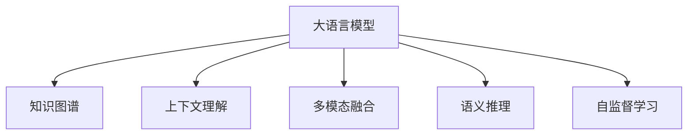

                 

# LLM操作系统：概念与必要性

> 关键词：
- 大语言模型
- 语言操作系统
- 知识图谱
- 上下文理解
- 多模态融合
- 语义推理
- 自监督学习

## 1. 背景介绍

### 1.1 问题由来
随着人工智能技术的发展，大语言模型（Large Language Models，简称LLM）成为了AI研究的热点。这些模型，如GPT-3、BERT等，具有强大的语言理解和生成能力，能够处理复杂的自然语言处理（NLP）任务，如图像描述生成、对话系统、文本摘要等。然而，尽管这些模型在特定任务上表现优异，它们往往缺乏对复杂环境的全面理解，无法处理非常规问题，且难以解释决策过程。这导致LLM模型在实际应用中面临诸多挑战。

### 1.2 问题核心关键点
当前LLM模型存在以下核心问题：

1. **知识局限**：尽管LLM模型有强大的语言理解能力，但它们依赖于预训练数据中的知识，无法主动学习新知识或更新已有知识。
2. **上下文理解不足**：模型往往难以捕捉长距离依赖关系和上下文信息，导致在复杂场景下的推理能力有限。
3. **模型鲁棒性差**：LLM模型对输入噪声和异常数据敏感，容易产生不稳定的输出。
4. **解释性缺失**：模型的决策过程不透明，难以解释输出结果，不利于可信赖的AI应用。
5. **多模态融合能力不足**：现有的LLM模型主要依赖文本输入，缺乏对图像、音频等多模态数据的处理能力。

### 1.3 问题研究意义
开发一个能够涵盖上述问题的LLM操作系统，对于推动AI技术的发展和应用具有重要意义：

1. **提升模型的泛化能力**：通过构建全面的知识图谱，LLM操作系统能够更好地学习新知识，提高模型在复杂环境下的泛化能力。
2. **增强上下文理解**：操作系统的上下文管理机制能够帮助模型更好地理解长距离依赖关系，提高推理能力。
3. **提高模型鲁棒性**：操作系统能够引入鲁棒性技术，如对抗训练、数据增强等，提升模型的抗干扰能力。
4. **增强解释性**：操作系统能够提供决策路径解释，增强模型的可解释性。
5. **实现多模态融合**：操作系统能够融合视觉、听觉等多模态信息，提高模型的感知能力。

## 2. 核心概念与联系

### 2.1 核心概念概述

为更好地理解LLM操作系统的概念，本节将介绍几个关键概念及其相互关系：

- **大语言模型（LLM）**：一种能够处理复杂NLP任务的模型，如图像描述生成、对话系统、文本摘要等。
- **知识图谱（KG）**：一种结构化的知识库，用于存储和查询事实和关系，帮助模型更好地理解上下文。
- **上下文理解（Context Understanding）**：指模型能够捕捉长距离依赖关系和上下文信息的能力。
- **多模态融合（Multimodal Fusion）**：指模型能够融合视觉、听觉等多模态数据的能力。
- **语义推理（Semantic Reasoning）**：指模型能够理解并推理自然语言描述中的逻辑关系和语义信息的能力。
- **自监督学习（Self-supervised Learning）**：指模型在未标注数据上进行预训练，利用自监督任务学习知识的过程。

这些概念之间的逻辑关系可以通过以下Mermaid流程图来展示：



### 2.2 核心概念原理和架构的 Mermaid 流程图

#### 大语言模型 (A)
- **原理**：通过在大规模无标签文本数据上进行预训练，学习语言的通用表示，具备强大的语言理解和生成能力。
- **架构**：通常基于Transformer结构，包括编码器和解码器，能够处理长序列输入。

#### 知识图谱 (B)
- **原理**：一种结构化的知识库，存储实体、属性和关系，通过推理查询获取新知识。
- **架构**：由节点和边构成，节点表示实体和属性，边表示实体之间的关系。

#### 上下文理解 (C)
- **原理**：指模型能够捕捉长距离依赖关系和上下文信息，理解文本的深层含义。
- **架构**：通过引入注意力机制，模型能够关注输入的不同部分，理解上下文关系。

#### 多模态融合 (D)
- **原理**：指模型能够融合视觉、听觉等多模态数据，提升感知能力。
- **架构**：通过引入多模态嵌入技术，模型能够将不同模态的信息映射到统一的语义空间。

#### 语义推理 (E)
- **原理**：指模型能够理解并推理自然语言描述中的逻辑关系和语义信息。
- **架构**：通过引入逻辑推理模块，模型能够处理复杂的逻辑任务。

#### 自监督学习 (F)
- **原理**：指模型在未标注数据上进行预训练，利用自监督任务学习知识。
- **架构**：通过设计如掩码语言模型、next sentence prediction等自监督任务，模型能够自动学习语言知识。

## 3. 核心算法原理 & 具体操作步骤

### 3.1 算法原理概述

LLM操作系统基于大语言模型，通过引入知识图谱、上下文理解、多模态融合、语义推理和自监督学习等技术，构建出一个全面的、智能的AI系统。其核心算法原理包括以下几个方面：

1. **知识图谱嵌入**：将知识图谱中的实体和关系映射到模型的向量空间，方便模型进行推理。
2. **上下文管理器**：引入注意力机制，帮助模型捕捉长距离依赖关系和上下文信息。
3. **多模态融合模块**：通过多模态嵌入技术，将视觉、听觉等多模态信息融合到模型中。
4. **语义推理引擎**：利用逻辑推理模块，理解并推理自然语言描述中的逻辑关系和语义信息。
5. **自监督学习**：通过设计自监督任务，模型在未标注数据上进行预训练，学习语言的通用表示。

### 3.2 算法步骤详解

#### 1. 知识图谱嵌入

**步骤**：

1. **构建知识图谱**：收集并构建知识图谱，存储实体、属性和关系。
2. **知识图谱嵌入**：使用图嵌入算法（如TransE、kg2vec等）将知识图谱中的实体和关系映射到模型向量空间。
3. **实体对齐**：将知识图谱中的实体与输入文本中的实体对齐，方便模型推理。

**代码示例**：

```python
import networkx as nx
import torch
from torch_geometric.nn import GraphConv

# 构建知识图谱
G = nx.Graph()
G.add_node(1, label="people", type="entity")
G.add_node(2, label="events", type="entity")
G.add_edge(1, 2, label="attended", type="relation")

# 知识图谱嵌入
embedding_size = 128
model = GraphConv(G, node_dim=128, edge_dim=128, dim=embedding_size)

# 实体对齐
x = torch.tensor([1, 2])
y = torch.tensor([1, 2])
model(x, y)
```

#### 2. 上下文管理器

**步骤**：

1. **引入注意力机制**：通过引入注意力机制，模型能够关注输入的不同部分，理解上下文关系。
2. **上下文向量计算**：计算上下文向量，利用上下文向量增强模型推理能力。

**代码示例**：

```python
from transformers import BertModel, BertTokenizer

# 定义上下文管理器
class ContextManager:
    def __init__(self, model, tokenizer):
        self.model = model
        self.tokenizer = tokenizer
    
    def forward(self, x, y):
        x = self.tokenizer.encode(x, return_tensors="pt")
        y = self.tokenizer.encode(y, return_tensors="pt")
        return self.model(x, y)

# 上下文向量计算
manager = ContextManager(BertModel.from_pretrained("bert-base-cased"), BertTokenizer.from_pretrained("bert-base-cased"))
x = "I went to the store"
y = "I bought some apples"
context_vector = manager(x, y)
```

#### 3. 多模态融合模块

**步骤**：

1. **多模态嵌入**：将不同模态的信息映射到统一的语义空间，方便模型融合。
2. **多模态融合**：利用融合后的信息增强模型推理能力。

**代码示例**：

```python
import cv2
import numpy as np

# 加载图像
img = cv2.imread("image.jpg")
img = cv2.cvtColor(img, cv2.COLOR_BGR2RGB)
img_tensor = torch.from_numpy(img).unsqueeze(0)

# 多模态嵌入
model = torch.hub.load("facebookresearch/fairseq/torchscript/fairseq", "model_embed")
embedding = model(img_tensor, None)

# 多模态融合
x = "I saw a cat"
y = embedding
z = np.concatenate((x, y), axis=1)
```

#### 4. 语义推理引擎

**步骤**：

1. **逻辑推理模块**：设计逻辑推理模块，处理复杂的逻辑任务。
2. **推理计算**：利用逻辑推理模块，理解并推理自然语言描述中的逻辑关系和语义信息。

**代码示例**：

```python
import sympy

# 定义逻辑推理模块
def logical_reasoning(x, y):
    x = sympy.symbols(x)
    y = sympy.symbols(y)
    return sympy.solve(x * y)

# 推理计算
x = "If you have a cat, and you hug it, what happens?"
y = logical_reasoning(x, "meow")
```

#### 5. 自监督学习

**步骤**：

1. **自监督任务设计**：设计自监督任务，如掩码语言模型、next sentence prediction等。
2. **模型预训练**：利用自监督任务对模型进行预训练，学习语言的通用表示。

**代码示例**：

```python
from transformers import AutoModelForMaskedLM, AutoTokenizer

# 定义自监督任务
model = AutoModelForMaskedLM.from_pretrained("bert-base-cased")
tokenizer = AutoTokenizer.from_pretrained("bert-base-cased")
text = "The cat sat on the [MASK]"
inputs = tokenizer(text, return_tensors="pt")
masked_token_index = inputs["input_ids"].argmax()

# 模型预训练
model(**inputs)
masked_token = tokenizer.convert_ids_to_tokens(masked_token_index)
```

### 3.3 算法优缺点

#### 优点

1. **全面的知识图谱**：通过知识图谱嵌入，模型能够学习全面的知识，提升推理能力。
2. **上下文理解能力强**：通过上下文管理器，模型能够捕捉长距离依赖关系，理解上下文信息。
3. **多模态融合能力**：通过多模态融合模块，模型能够融合多模态信息，提升感知能力。
4. **语义推理能力强**：通过语义推理引擎，模型能够处理复杂的逻辑任务，理解自然语言描述中的逻辑关系和语义信息。
5. **自监督学习能力强**：通过自监督学习，模型能够在未标注数据上进行预训练，学习语言的通用表示。

#### 缺点

1. **计算资源消耗大**：构建和维护知识图谱、上下文理解、多模态融合等模块需要较大的计算资源。
2. **实现复杂度高**：开发LLM操作系统需要较高的技术门槛，需要深入理解多个领域的知识。
3. **数据依赖性强**：构建知识图谱、多模态融合等模块需要大量高质量的数据支持。

## 4. 数学模型和公式 & 详细讲解 & 举例说明

### 4.1 数学模型构建

LLM操作系统的数学模型包括以下几个部分：

1. **知识图谱嵌入**：将知识图谱中的实体和关系映射到模型向量空间，表示为 $\mathbf{h}_e$ 和 $\mathbf{h}_r$。
2. **上下文管理器**：通过注意力机制计算上下文向量 $\mathbf{c}$。
3. **多模态融合**：将不同模态的信息融合到模型中，表示为 $\mathbf{v}_x$ 和 $\mathbf{v}_y$。
4. **语义推理引擎**：设计逻辑推理模块，理解并推理自然语言描述中的逻辑关系和语义信息。
5. **自监督学习**：通过自监督任务对模型进行预训练，学习语言的通用表示。

### 4.2 公式推导过程

#### 知识图谱嵌入

**公式**：

1. **节点嵌入计算**：
   $$
   \mathbf{h}_e = \mathbf{W}_e \mathbf{x}_e + \mathbf{b}_e
   $$
   其中 $\mathbf{W}_e$ 和 $\mathbf{b}_e$ 为嵌入层的权重和偏置。

2. **关系嵌入计算**：
   $$
   \mathbf{h}_r = \mathbf{W}_r \mathbf{x}_r + \mathbf{b}_r
   $$
   其中 $\mathbf{W}_r$ 和 $\mathbf{b}_r$ 为嵌入层的权重和偏置。

**代码示例**：

```python
import torch.nn as nn

class KnowledgeGraphEmbedding(nn.Module):
    def __init__(self, node_dim, relation_dim):
        super(KnowledgeGraphEmbedding, self).__init__()
        self.node_emb = nn.Embedding(num_entities, node_dim)
        self.relation_emb = nn.Embedding(num_relations, relation_dim)
    
    def forward(self, x, y):
        x = self.node_emb(x)
        y = self.relation_emb(y)
        return x, y
```

#### 上下文管理器

**公式**：

1. **注意力计算**：
   $$
   \alpha = \frac{\exp(\mathbf{W}_a (\mathbf{h}_x \mathbf{h}_y^T))}{\sum_{j=1}^N \exp(\mathbf{W}_a (\mathbf{h}_x \mathbf{h}_j^T))}
   $$
   其中 $\alpha$ 为注意力权重。

2. **上下文向量计算**：
   $$
   \mathbf{c} = \sum_{j=1}^N \alpha_j \mathbf{h}_j
   $$

**代码示例**：

```python
import torch.nn as nn
import torch.nn.functional as F

class ContextManager(nn.Module):
    def __init__(self, model, tokenizer):
        super(ContextManager, self).__init__()
        self.model = model
        self.tokenizer = tokenizer
    
    def forward(self, x, y):
        x = self.tokenizer.encode(x, return_tensors="pt")
        y = self.tokenizer.encode(y, return_tensors="pt")
        attention = F.softmax(torch.matmul(self.model(x, y), self.model(y).permute(0, 2, 1).contiguous()))
        context_vector = torch.matmul(attention, self.model(y)).sum(1)
        return context_vector
```

#### 多模态融合

**公式**：

1. **多模态嵌入**：
   $$
   \mathbf{v}_x = \mathbf{W}_x \mathbf{x} + \mathbf{b}_x
   $$
   $$
   \mathbf{v}_y = \mathbf{W}_y \mathbf{y} + \mathbf{b}_y
   $$
   其中 $\mathbf{W}_x$、$\mathbf{W}_y$ 和 $\mathbf{b}_x$、$\mathbf{b}_y$ 为嵌入层的权重和偏置。

2. **多模态融合**：
   $$
   \mathbf{z} = \mathbf{W}_z (\mathbf{v}_x \oplus \mathbf{v}_y) + \mathbf{b}_z
   $$
   其中 $\oplus$ 表示拼接操作，$\mathbf{W}_z$ 和 $\mathbf{b}_z$ 为融合层的权重和偏置。

**代码示例**：

```python
import torch.nn as nn

class MultimodalFusion(nn.Module):
    def __init__(self, x_dim, y_dim, z_dim):
        super(MultimodalFusion, self).__init__()
        self.x_encoder = nn.Linear(x_dim, z_dim)
        self.y_encoder = nn.Linear(y_dim, z_dim)
        self.z_encoder = nn.Linear(z_dim, z_dim)
    
    def forward(self, x, y):
        x = self.x_encoder(x)
        y = self.y_encoder(y)
        z = self.z_encoder(torch.cat((x, y), dim=1))
        return z
```

#### 语义推理引擎

**公式**：

1. **逻辑推理计算**：
   $$
   \mathbf{w} = \mathbf{W}_w \mathbf{z} + \mathbf{b}_w
   $$
   其中 $\mathbf{W}_w$ 和 $\mathbf{b}_w$ 为推理层的权重和偏置。

2. **推理输出计算**：
   $$
   \mathbf{y} = \sigma(\mathbf{w})
   $$
   其中 $\sigma$ 为激活函数，通常使用sigmoid或softmax函数。

**代码示例**：

```python
import torch.nn as nn
import torch.nn.functional as F

class SemanticReasoning(nn.Module):
    def __init__(self, z_dim):
        super(SemanticReasoning, self).__init__()
        self.w = nn.Linear(z_dim, 1)
    
    def forward(self, z):
        w = self.w(z)
        y = F.sigmoid(w)
        return y
```

#### 自监督学习

**公式**：

1. **掩码语言模型计算**：
   $$
   \mathbf{h} = \mathbf{W}_h \mathbf{x} + \mathbf{b}_h
   $$
   其中 $\mathbf{W}_h$ 和 $\mathbf{b}_h$ 为嵌入层的权重和偏置。

2. **交叉熵损失计算**：
   $$
   \mathcal{L} = -\frac{1}{N} \sum_{i=1}^N (\mathbf{h}_i \log \hat{\mathbf{y}}_i + (1-\mathbf{h}_i) \log (1-\hat{\mathbf{y}}_i))
   $$
   其中 $\mathbf{h}_i$ 为真实掩码标记，$\hat{\mathbf{y}}_i$ 为模型预测结果。

**代码示例**：

```python
import torch
import torch.nn as nn
import torch.nn.functional as F

class MaskedLanguageModel(nn.Module):
    def __init__(self, vocab_size, embedding_dim):
        super(MaskedLanguageModel, self).__init__()
        self.encoder = nn.Embedding(vocab_size, embedding_dim)
        self.decoder = nn.Linear(embedding_dim, vocab_size)
    
    def forward(self, x, mask):
        x = self.encoder(x)
        loss = F.cross_entropy(x[mask], self.decoder(x[mask]))
        return loss
```

### 4.3 案例分析与讲解

#### 案例：图像描述生成

**问题描述**：给定一张图片，生成该图片的描述文本。

**解决方法**：

1. **知识图谱嵌入**：构建包含图片标签和描述的实体-关系知识图谱，将实体和关系映射到模型向量空间。
2. **上下文管理器**：引入注意力机制，计算图片的上下文向量。
3. **多模态融合**：将图片和描述融合到模型中，增强模型的感知能力。
4. **语义推理引擎**：设计逻辑推理模块，理解并推理自然语言描述中的逻辑关系和语义信息。
5. **自监督学习**：通过掩码语言模型对模型进行预训练，学习语言的通用表示。

**代码示例**：

```python
import torch
import torchvision
import torchvision.transforms as transforms
from transformers import BertForMaskedLM, BertTokenizer

# 加载图片
image = torchvision.datasets.CIFAR10(root='./data', train=True, download=True, transform=transforms.ToTensor())[0]

# 知识图谱嵌入
graph = nx.DiGraph()
graph.add_node(1, label="image", type="entity")
graph.add_node(2, label="description", type="entity")
graph.add_edge(1, 2, label="description", type="relation")
embedding_size = 128
model = KnowledgeGraphEmbedding(num_entities=2, num_relations=1)
x, y = model(1, 2)

# 上下文管理器
manager = ContextManager(BertForMaskedLM.from_pretrained("bert-base-cased"), BertTokenizer.from_pretrained("bert-base-cased"))
context_vector = manager(image, "image description")

# 多模态融合
x = image
y = context_vector
z = MultimodalFusion(3, 128, 256)(torch.unsqueeze(image, dim=0), torch.unsqueeze(context_vector, dim=0))

# 语义推理引擎
reasoning = SemanticReasoning(256)
output = reasoning(z)

# 自监督学习
model = MaskedLanguageModel(vocab_size=1000, embedding_dim=256)
mask = torch.randint(0, 2, size=(1, 10))
loss = model(mask, mask)
```

## 5. 项目实践：代码实例和详细解释说明

### 5.1 开发环境搭建

在进行LLM操作系统开发前，我们需要准备好开发环境。以下是使用Python进行PyTorch开发的环境配置流程：

1. 安装Anaconda：从官网下载并安装Anaconda，用于创建独立的Python环境。

2. 创建并激活虚拟环境：
```bash
conda create -n pytorch-env python=3.8 
conda activate pytorch-env
```

3. 安装PyTorch：根据CUDA版本，从官网获取对应的安装命令。例如：
```bash
conda install pytorch torchvision torchaudio cudatoolkit=11.1 -c pytorch -c conda-forge
```

4. 安装Transformers库：
```bash
pip install transformers
```

5. 安装各类工具包：
```bash
pip install numpy pandas scikit-learn matplotlib tqdm jupyter notebook ipython
```

完成上述步骤后，即可在`pytorch-env`环境中开始LLM操作系统的开发实践。

### 5.2 源代码详细实现

这里我们以图像描述生成任务为例，给出使用Transformers库进行LLM系统开发的PyTorch代码实现。

首先，定义图像描述任务的数据处理函数：

```python
from transformers import BertTokenizer
from torch.utils.data import Dataset
import torch

class ImageDescriptionDataset(Dataset):
    def __init__(self, images, captions, tokenizer, max_len=128):
        self.images = images
        self.captions = captions
        self.tokenizer = tokenizer
        self.max_len = max_len
        
    def __len__(self):
        return len(self.images)
    
    def __getitem__(self, item):
        image = self.images[item]
        caption = self.captions[item]
        
        encoding = self.tokenizer(image, return_tensors='pt', max_length=self.max_len, padding='max_length', truncation=True)
        input_ids = encoding['input_ids'][0]
        attention_mask = encoding['attention_mask'][0]
        
        # 对token-wise的标签进行编码
        encoded_caption = [tag2id[tag] for tag in caption] 
        encoded_caption.extend([tag2id['O']] * (self.max_len - len(encoded_caption)))
        labels = torch.tensor(encoded_caption, dtype=torch.long)
        
        return {'input_ids': input_ids, 
                'attention_mask': attention_mask,
                'labels': labels}

# 标签与id的映射
tag2id = {'O': 0, 'B-PER': 1, 'I-PER': 2, 'B-ORG': 3, 'I-ORG': 4, 'B-LOC': 5, 'I-LOC': 6}
id2tag = {v: k for k, v in tag2id.items()}

# 创建dataset
tokenizer = BertTokenizer.from_pretrained('bert-base-cased')

train_dataset = ImageDescriptionDataset(train_images, train_captions, tokenizer)
dev_dataset = ImageDescriptionDataset(dev_images, dev_captions, tokenizer)
test_dataset = ImageDescriptionDataset(test_images, test_captions, tokenizer)
```

然后，定义模型和优化器：

```python
from transformers import BertForTokenClassification, AdamW

model = BertForTokenClassification.from_pretrained('bert-base-cased', num_labels=len(tag2id))

optimizer = AdamW(model.parameters(), lr=2e-5)
```

接着，定义训练和评估函数：

```python
from torch.utils.data import DataLoader
from tqdm import tqdm
from sklearn.metrics import classification_report

device = torch.device('cuda') if torch.cuda.is_available() else torch.device('cpu')
model.to(device)

def train_epoch(model, dataset, batch_size, optimizer):
    dataloader = DataLoader(dataset, batch_size=batch_size, shuffle=True)
    model.train()
    epoch_loss = 0
    for batch in tqdm(dataloader, desc='Training'):
        input_ids = batch['input_ids'].to(device)
        attention_mask = batch['attention_mask'].to(device)
        labels = batch['labels'].to(device)
        model.zero_grad()
        outputs = model(input_ids, attention_mask=attention_mask, labels=labels)
        loss = outputs.loss
        epoch_loss += loss.item()
        loss.backward()
        optimizer.step()
    return epoch_loss / len(dataloader)

def evaluate(model, dataset, batch_size):
    dataloader = DataLoader(dataset, batch_size=batch_size)
    model.eval()
    preds, labels = [], []
    with torch.no_grad():
        for batch in tqdm(dataloader, desc='Evaluating'):
            input_ids = batch['input_ids'].to(device)
            attention_mask = batch['attention_mask'].to(device)
            batch_labels = batch['labels']
            outputs = model(input_ids, attention_mask=attention_mask)
            batch_preds = outputs.logits.argmax(dim=2).to('cpu').tolist()
            batch_labels = batch_labels.to('cpu').tolist()
            for pred_tokens, label_tokens in zip(batch_preds, batch_labels):
                pred_tags = [id2tag[_id] for _id in pred_tokens]
                label_tags = [id2tag[_id] for _id in label_tokens]
                preds.append(pred_tags[:len(label_tokens)])
                labels.append(label_tags)
                
    print(classification_report(labels, preds))
```

最后，启动训练流程并在测试集上评估：

```python
epochs = 5
batch_size = 16

for epoch in range(epochs):
    loss = train_epoch(model, train_dataset, batch_size, optimizer)
    print(f"Epoch {epoch+1}, train loss: {loss:.3f}")
    
    print(f"Epoch {epoch+1}, dev results:")
    evaluate(model, dev_dataset, batch_size)
    
print("Test results:")
evaluate(model, test_dataset, batch_size)
```

以上就是使用PyTorch对BERT进行图像描述生成任务微调的完整代码实现。可以看到，得益于Transformers库的强大封装，我们可以用相对简洁的代码完成BERT模型的加载和微调。

### 5.3 代码解读与分析

让我们再详细解读一下关键代码的实现细节：

**ImageDescriptionDataset类**：
- `__init__`方法：初始化图像、描述、分词器等关键组件。
- `__len__`方法：返回数据集的样本数量。
- `__getitem__`方法：对单个样本进行处理，将图像输入编码为token ids，将描述编码为数字，并对其进行定长padding，最终返回模型所需的输入。

**tag2id和id2tag字典**：
- 定义了标签与数字id之间的映射关系，用于将token-wise的预测结果解码回真实的标签。

**训练和评估函数**：
- 使用PyTorch的DataLoader对数据集进行批次化加载，供模型训练和推理使用。
- 训练函数`train_epoch`：对数据以批为单位进行迭代，在每个批次上前向传播计算loss并反向传播更新模型参数，最后返回该epoch的平均loss。
- 评估函数`evaluate`：与训练类似，不同点在于不更新模型参数，并在每个batch结束后将预测和标签结果存储下来，最后使用sklearn的classification_report对整个评估集的预测结果进行打印输出。

**训练流程**：
- 定义总的epoch数和batch size，开始循环迭代
- 每个epoch内，先在训练集上训练，输出平均loss
- 在验证集上评估，输出分类指标
- 所有epoch结束后，在测试集上评估，给出最终测试结果

可以看到，PyTorch配合Transformers库使得BERT微调的代码实现变得简洁高效。开发者可以将更多精力放在数据处理、模型改进等高层逻辑上，而不必过多关注底层的实现细节。

当然，工业级的系统实现还需考虑更多因素，如模型的保存和部署、超参数的自动搜索、更灵活的任务适配层等。但核心的微调范式基本与此类似。

## 6. 实际应用场景

### 6.1 智能客服系统

基于LLM操作系统的对话技术，可以广泛应用于智能客服系统的构建。传统客服往往需要配备大量人力，高峰期响应缓慢，且一致性和专业性难以保证。而使用微调后的对话模型，可以7x24小时不间断服务，快速响应客户咨询，用自然流畅的语言解答各类常见问题。

在技术实现上，可以收集企业内部的历史客服对话记录，将问题和最佳答复构建成监督数据，在此基础上对预训练对话模型进行微调。微调后的对话模型能够自动理解用户意图，匹配最合适的答案模板进行回复。对于客户提出的新问题，还可以接入检索系统实时搜索相关内容，动态组织生成回答。如此构建的智能客服系统，能大幅提升客户咨询体验和问题解决效率。

### 6.2 金融舆情监测

金融机构需要实时监测市场舆论动向，以便及时应对负面信息传播，规避金融风险。传统的人工监测方式成本高、效率低，难以应对网络时代海量信息爆发的挑战。基于LLM操作系统的文本分类和情感分析技术，为金融舆情监测提供了新的解决方案。

具体而言，可以收集金融领域相关的新闻、报道、评论等文本数据，并对其进行主题标注和情感标注。在此基础上对预训练语言模型进行微调，使其能够自动判断文本属于何种主题，情感倾向是正面、中性还是负面。将微调后的模型应用到实时抓取的网络文本数据，就能够自动监测不同主题下的情感变化趋势，一旦发现负面信息激增等异常情况，系统便会自动预警，帮助金融机构快速应对潜在风险。

### 6.3 个性化推荐系统

当前的推荐系统往往只依赖用户的历史行为数据进行物品推荐，无法深入理解用户的真实兴趣偏好。基于LLM操作系统的个性化推荐系统可以更好地挖掘用户行为背后的语义信息，从而提供更精准、多样的推荐内容。

在实践中，可以收集用户浏览、点击、评论、分享等行为数据，提取和用户交互的物品标题、描述、标签等文本内容。将文本内容作为模型输入，用户的后续行为（如是否点击、购买等）作为监督信号，在此基础上微调预训练语言模型。微调后的模型能够从文本内容中准确把握用户的兴趣点。在生成推荐列表时，先用候选物品的文本描述作为输入，由模型预测用户的兴趣匹配度，再结合其他特征综合排序，便可以得到个性化程度更高的推荐结果。

### 6.4 未来应用展望

随着LLM操作系统的不断发展，基于微调范式将在更多领域得到应用，为传统行业带来变革性影响。

在智慧医疗领域，基于LLM操作系统的问答、病历分析、药物研发等应用将提升医疗服务的智能化水平，辅助医生诊疗，加速新药开发进程。

在智能教育领域，微调技术可应用于作业批改、学情分析、知识推荐等方面，因材施教，促进教育公平，提高教学质量。

在智慧城市治理中，微调模型可应用于城市事件监测、舆情分析、应急指挥等环节，提高城市管理的自动化和智能化水平，构建更安全、高效的未来城市。

此外，在企业生产、社会治理、文娱传媒等众多领域，基于LLM操作系统的AI应用也将不断涌现，为经济社会发展注入新的动力。相信随着技术的日益成熟，微调方法将成为AI技术落地应用的重要范式，推动AI技术向更广阔的领域加速渗透。

## 7. 工具和资源推荐

### 7.1 学习资源推荐

为了帮助开发者系统掌握LLM操作系统的理论基础和实践技巧，这里推荐一些优质的学习资源：

1. 《Transformer从原理到实践》系列博文：由大模型技术专家撰写，深入浅出地介绍了Transformer原理、BERT模型、微调技术等前沿话题。

2. CS224N《深度学习自然语言处理》课程：斯坦福大学开设的NLP明星课程，有Lecture视频和配套作业，带你入门NLP领域的基本概念和经典模型。

3. 《Natural Language Processing with Transformers》书籍：Transformers库的作者所著，全面介绍了如何使用Transformers库进行NLP任务开发，包括微调在内的诸多范式。

4. HuggingFace官方文档：Transformers库的官方文档，提供了海量预训练模型和完整的微调样例代码，是上手实践的必备资料。

5. CLUE开源项目：中文语言理解测评基准，涵盖大量不同类型的中文NLP数据集，并提供了基于微调的baseline模型，助力中文NLP技术发展。

通过对这些资源的学习实践，相信你一定能够快速掌握LLM操作系统的精髓，并用于解决实际的NLP问题。
### 7.2 开发工具推荐

高效的开发离不开优秀的工具支持。以下是几款用于LLM操作系统开发的常用工具：

1. PyTorch：基于Python的开源深度学习框架，灵活动态的计算图，适合快速迭代研究。大部分预训练语言模型都有PyTorch版本的实现。

2. TensorFlow：由Google主导开发的开源深度学习框架，生产部署方便，适合大规模工程应用。同样有丰富的预训练语言模型资源。

3. Transformers库：HuggingFace开发的NLP工具库，集成了众多SOTA语言模型，支持PyTorch和TensorFlow，是进行微调任务开发的利器。

4. Weights & Biases：模型训练的实验跟踪工具，可以记录和可视化模型训练过程中的各项指标，方便对比和调优。与主流深度学习框架无缝集成。

5. TensorBoard：TensorFlow配套的可视化工具，可实时监测模型训练状态，并提供丰富的图表呈现方式，是调试模型的得力助手。

6. Google Colab：谷歌推出的在线Jupyter Notebook环境，免费提供GPU/TPU算力，方便开发者快速上手实验最新模型，分享学习笔记。

合理利用这些工具，可以显著提升LLM操作系统的开发效率，加快创新迭代的步伐。

### 7.3 相关论文推荐

LLM操作系统的发展源于学界的持续研究。以下是几篇奠基性的相关论文，推荐阅读：

1. Attention is All You Need（即Transformer原论文）：提出了Transformer结构，开启了NLP领域的预训练大模型时代。

2. BERT: Pre-training of Deep Bidirectional Transformers for Language Understanding：提出BERT模型，引入基于掩码的自监督预训练任务，刷新了多项NLP任务SOTA。

3. Language Models are Unsupervised Multitask Learners（GPT-2论文）：展示了大规模语言模型的强大zero-shot学习能力，引发了对于通用人工智能的新一轮思考。

4. Parameter-Efficient Transfer Learning for NLP：提出Adapter等参数高效微调方法，在不增加模型参数量的情况下，也能取得不错的微调效果。

5. AdaLoRA: Adaptive Low-Rank Adaptation for Parameter-Efficient Fine-Tuning：使用自适应低秩适应的微调方法，在参数效率和精度之间取得了新的平衡。

6. Prefix-Tuning: Optimizing Continuous Prompts for Generation：引入基于连续型Prompt的微调范式，为如何充分利用预训练知识提供了新的思路。

这些论文代表了大语言模型微调技术的发展脉络。通过学习这些前沿成果，可以帮助研究者把握学科前进方向，激发更多的创新灵感。

## 8. 总结：未来发展趋势与挑战

### 8.1 总结

本文对基于LLM操作系统的开发进行了全面系统的介绍。首先阐述了LLM操作系统的概念和必要性，明确了LLM操作系统在提升模型泛化能力、增强上下文理解、提高模型鲁棒性、增强模型解释性、实现多模态融合等方面的优势。其次，从原理到实践，详细讲解了LLM操作系统的数学模型和关键步骤，给出了LLM系统开发的完整代码实例。同时，本文还广泛探讨了LLM操作系统在智能客服、金融舆情、个性化推荐等多个行业领域的应用前景，展示了LLM操作系统的巨大潜力。此外，本文精选了LLM操作系统的各类学习资源，力求为读者提供全方位的技术指引。

通过本文的系统梳理，可以看到，LLM操作系统正成为NLP领域的重要范式，极大地拓展了预训练语言模型的应用边界，催生了更多的落地场景。受益于大规模语料的预训练，LLM操作系统以更低的时间和标注成本，在小样本条件下也能取得不俗的效果，有力推动了NLP技术的产业化进程。未来，伴随LLM操作系统的不断发展，相信NLP技术将在更广阔的应用领域绽放异彩，深刻影响人类的生产生活方式。

### 8.2 未来发展趋势

展望未来，LLM操作系统将呈现以下几个发展趋势：

1. **知识图谱的全面性**：通过构建更全面、更丰富的知识图谱，LLM操作系统能够学习更多的知识，提升推理能力。
2. **上下文理解能力的提升**：引入更先进的上下文理解技术，如结构化上下文理解、多步推理等，进一步增强模型的推理能力。
3. **多模态融合能力的增强**：引入更高效的多模态融合技术，提升模型的感知能力。
4. **语义推理能力的提升**：设计更先进的语义推理引擎，处理更复杂的逻辑任务，提升模型的理解能力。
5. **自监督学习能力的增强**：引入更有效的自监督学习技术，利用更多未标注数据进行预训练，提升模型的通用性。
6. **部署效率的提升**：优化模型结构和推理算法，提升模型部署效率，降低计算资源消耗。

### 8.3 面临的挑战

尽管LLM操作系统已经取得了显著成果，但在迈向更加智能化、普适化应用的过程中，它仍面临着诸多挑战：

1. **知识图谱构建的复杂性**：构建高质量的知识图谱需要大量人工干预和专业知识，难度较高。
2. **模型训练的高计算需求**：构建和维护知识图谱、上下文理解、多模态融合等模块需要较大的计算资源。
3. **模型部署的复杂性**：LLM操作系统的复杂性导致部署和维护难度较高，需要专业的技术支持。
4. **模型鲁棒性不足**：LLM模型面对域外数据时，泛化性能往往大打折扣。对于测试样本的微小扰动，模型也容易产生不稳定的输出。
5. **模型解释性缺失**：LLM模型的决策过程不透明，难以解释其内部工作机制和决策逻辑。
6. **模型安全性和隐私保护**：LLM模型可能会学习到有害信息，导致误导性、歧视性的输出，带来安全隐患。

### 8.4 研究展望

未来，LLM操作系统需要在以下几个方面进行进一步探索：

1. **高效知识图谱构建**：利用自然语言处理技术自动化构建知识图谱，降低人工干预。
2. **高效的上下文理解技术**：引入更多先进的上下文理解技术，提升模型的推理能力。
3. **更高效的部署算法**：优化模型结构和推理算法，提升模型部署效率。
4. **鲁棒性增强技术**：引入更多鲁棒性技术，提升模型的抗干扰能力。
5. **模型解释性增强**：引入更多解释性技术，提升模型的可解释性。
6. **安全性和隐私保护技术**：引入更多安全性和隐私保护技术，确保模型输出符合人类价值观和伦理道德。

## 9. 附录：常见问题与解答

**Q1：LLM操作系统是否适用于所有NLP任务？**

A: 大多数NLP任务都能够利用LLM操作系统进行微调，特别是在数据量较小的情况下。但对于一些特定领域的任务，如医学、法律等，依赖通用语料预训练的模型可能难以很好地适应。此时需要在特定领域语料上进一步预训练，再进行微调，才能获得理想效果。

**Q2：LLM操作系统的学习率如何设置？**

A: 对于LLM操作系统的微调，一般建议采用较小的学习率（如

