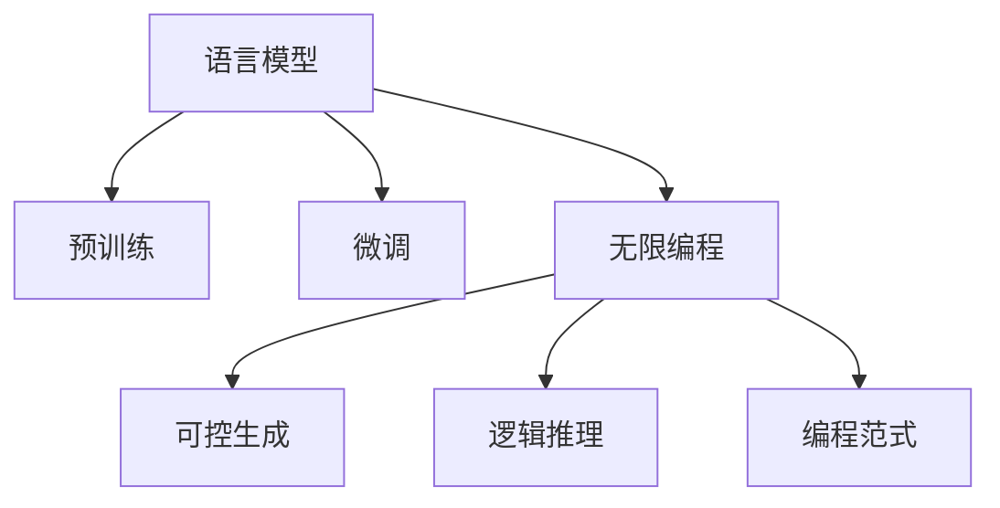

                 

# LLM无限编程:创造无限可能

> 关键词：语言模型,编程语言,编程范式,自然语言处理,NLP,深度学习,语言理解,人工智能,机器学习,开发工具,编程环境

## 1. 背景介绍

### 1.1 问题由来

语言模型（Language Model, LLM），尤其是大规模预训练语言模型（Large Language Models, LLMs），已经成为了自然语言处理（Natural Language Processing, NLP）领域的核心技术。这些模型通过在大量无标签文本数据上进行预训练，可以学习到丰富的语言知识和常识，通过在特定任务上进行微调，可以在各种NLP任务上获得优异表现。

近年来，随着深度学习技术的发展，预训练语言模型如GPT系列、BERT等在机器翻译、文本分类、问答系统、情感分析等诸多NLP任务上取得了显著成果。然而，这些模型通常依赖于大量文本数据进行预训练，并且需要大量的计算资源进行微调。这些限制在一定程度上限制了其应用场景。

### 1.2 问题核心关键点

为了克服这些限制，并进一步拓展预训练语言模型的应用范围，研究人员提出了“无限编程”的概念，即通过无限使用编程语言和算法来优化和扩展语言模型的能力。这一范式不仅能够提高模型的灵活性和扩展性，还能在各种场景下提升模型的性能和效率。

无限编程的核心思想是：将语言模型视为一个强大的“功能库”，开发者可以通过编写自定义函数、算法和数据流来扩展模型的能力。通过这种方式，模型可以无限地学习和适应新的任务，实现真正意义上的“无限编程”。

### 1.3 问题研究意义

无限编程在NLP领域具有重要的研究意义：

1. **降低开发成本**：通过无限编程，开发者可以复用已有的模型和算法，避免从头开发所需的复杂工作，从而大大降低开发成本。
2. **提高模型性能**：无限编程允许开发者在特定任务上进行定制化设计，能够更好地适应特定任务，提高模型的性能。
3. **加速开发进程**：无限编程范式下，模型可以快速适应新的任务，缩短开发周期。
4. **带来技术创新**：无限编程催生了新的研究方向，如可控生成、逻辑推理等，推动NLP技术的前沿发展。
5. **赋能产业升级**：无限编程使得NLP技术更容易被各行各业采用，加速数字化转型升级。

## 2. 核心概念与联系

### 2.1 核心概念概述

为更好地理解无限编程在NLP中的应用，本节将介绍几个密切相关的核心概念：

- **语言模型 (Language Model)**：指用于估计给定文本序列概率的模型。常见的语言模型有统计语言模型、神经网络语言模型等。
- **预训练 (Pre-training)**：指在大规模无标签文本语料上训练语言模型的过程，以学习通用的语言表示。
- **微调 (Fine-tuning)**：指在预训练模型的基础上，使用特定任务的数据进行微调，优化模型在该任务上的性能。
- **无限编程 (Infinite Programming)**：指通过编程语言和算法无限扩展语言模型的能力，使其能够适应各种任务和场景。
- **可控生成 (Controllable Generation)**：指通过编写特定的算法，使语言模型能够生成符合特定条件的文本。
- **逻辑推理 (Logical Reasoning)**：指语言模型能够进行逻辑推导和知识推理，提升其对复杂任务的适应能力。
- **编程范式 (Programming Paradigm)**：指编程语言和算法的核心思想和设计原则，如面向对象编程、函数式编程等。

这些概念之间的逻辑关系可以通过以下Mermaid流程图来展示：



这个流程图展示了大语言模型和无限编程的核心概念及其之间的关系：

1. 语言模型通过预训练获得基础能力。
2. 微调是对预训练模型进行任务特定的优化。
3. 无限编程是扩展语言模型的能力，使其能够适应各种任务和场景。
4. 可控生成和逻辑推理是在无限编程框架下，进一步提升模型能力的两个重要方向。
5. 编程范式为无限编程提供了灵活的实现方式，增强了模型的扩展性和适应性。

## 3. 核心算法原理 & 具体操作步骤

### 3.1 算法原理概述

无限编程的本质是通过编程语言和算法无限扩展语言模型的能力。其核心思想是将语言模型视为一个“功能库”，开发者可以通过编写自定义函数、算法和数据流来扩展模型的能力。这种范式允许模型无限地学习和适应新的任务，实现真正意义上的“无限编程”。

### 3.2 算法步骤详解

无限编程的具体操作步骤如下：

**Step 1: 准备预训练模型和开发环境**

- 选择合适的预训练语言模型，如GPT系列、BERT等。
- 配置开发环境，安装必要的库和工具，如Python、PyTorch、Transformers等。

**Step 2: 定义任务和目标**

- 确定需要解决的具体任务，如文本分类、机器翻译、问答系统等。
- 设定模型的目标，如精度、速度、可解释性等。

**Step 3: 编写自定义函数和算法**

- 根据任务需求，编写自定义函数和算法，扩展模型的功能。
- 设计算法流程，如数据预处理、特征提取、模型训练等。

**Step 4: 执行训练和微调**

- 使用预训练模型和自定义函数进行训练。
- 对模型进行微调，优化其在特定任务上的性能。

**Step 5: 评估和部署**

- 在验证集上评估模型性能，调整参数和算法。
- 部署模型到实际应用中，进行实时推理和预测。

### 3.3 算法优缺点

无限编程在NLP领域具有以下优点：

1. **灵活性高**：无限编程允许开发者灵活地扩展模型，适应各种任务和场景。
2. **可扩展性强**：通过编写自定义函数和算法，无限编程可以不断扩展模型的功能。
3. **加速开发进程**：无限编程范式下，模型可以快速适应新的任务，缩短开发周期。
4. **带来技术创新**：无限编程催生了新的研究方向，如可控生成、逻辑推理等。

同时，无限编程也存在一些局限性：

1. **开发复杂度高**：编写自定义函数和算法需要一定的编程技能，开发复杂度较高。
2. **模型复杂性增加**：无限编程可能导致模型复杂性增加，影响模型的可解释性和推理效率。
3. **资源消耗大**：无限编程可能导致模型参数量增加，资源消耗较大。
4. **易过拟合**：无限编程可能增加模型的复杂性，增加过拟合风险。

尽管存在这些局限性，但就目前而言，无限编程范式在大规模NLP任务中的应用前景广阔，有助于提升模型的灵活性和适应性。

### 3.4 算法应用领域

无限编程在NLP领域已经得到了广泛的应用，覆盖了几乎所有常见任务，例如：

- 文本分类：如情感分析、主题分类、意图识别等。通过编写自定义函数，实现特定领域的文本分类模型。
- 命名实体识别：识别文本中的人名、地名、机构名等特定实体。通过编写特定算法，实现实体的边界识别和类型标注。
- 关系抽取：从文本中抽取实体之间的语义关系。通过编写逻辑推理算法，实现实体-关系三元组的抽取。
- 问答系统：对自然语言问题给出答案。通过编写可控生成算法，实现对问答系统的优化。
- 机器翻译：将源语言文本翻译成目标语言。通过编写自定义函数，实现语言的跨域翻译。
- 文本摘要：将长文本压缩成简短摘要。通过编写特定算法，实现文本的自动摘要。
- 对话系统：使机器能够与人自然对话。通过编写逻辑推理和可控生成算法，实现对话系统的优化。

除了上述这些经典任务外，无限编程还应用于更多场景中，如可控文本生成、常识推理、代码生成、数据增强等，为NLP技术带来了全新的突破。随着无限编程方法不断演进，相信NLP技术将在更广阔的应用领域大放异彩。

## 4. 数学模型和公式 & 详细讲解 & 举例说明

### 4.1 数学模型构建

在无限编程中，我们通常使用深度学习模型来构建语言模型，以进行文本处理和生成。以下以编码器-解码器模型（Encoder-Decoder Model）为例，构建一个简单的语言模型。

假设输入序列为 $x_1, x_2, ..., x_n$，输出序列为 $y_1, y_2, ..., y_m$，模型的数学模型可以表示为：

$$
p(y|x) = \prod_{i=1}^m p(y_i|y_{i-1}, x)
$$

其中，$p(y_i|y_{i-1}, x)$ 表示在给定前一个输出 $y_{i-1}$ 和输入 $x$ 的情况下，输出 $y_i$ 的概率。

### 4.2 公式推导过程

为了简化推导，我们假设模型为循环神经网络（Recurrent Neural Network, RNN）。以 LSTM 为例，其前向传播过程可以表示为：

$$
h_i = tanh(W_{hh}h_{i-1} + W_{xh}x_i + b_h)
$$

$$
o_i = sigmoid(W_{ho}h_{i-1} + b_h)
$$

$$
c_i = o_i \odot tanh(h_i)
$$

$$
y_i = softmax(W_{hy}c_i + b_y)
$$

其中，$h_i$ 为隐藏状态，$o_i$ 为输出门，$c_i$ 为细胞状态，$y_i$ 为输出。

对于反向传播过程，可以使用链式法则计算梯度。以下以训练分类任务为例，推导损失函数和梯度更新公式。

假设模型输出 $y_i$ 的概率分布为 $p(y_i|x)$，真实的类别标签为 $y_i^{*}$，则损失函数可以表示为：

$$
L = -\sum_{i=1}^m \log p(y_i^{*}|x)
$$

通过反向传播计算梯度，可以得到：

$$
\frac{\partial L}{\partial W_{hy}} = -\sum_{i=1}^m \frac{y_i^{*} - y_i}{y_i} \frac{\partial y_i}{\partial c_i} \frac{\partial c_i}{\partial h_i} \frac{\partial h_i}{\partial W_{hy}}
$$

$$
\frac{\partial L}{\partial W_{hh}} = -\sum_{i=1}^m \frac{y_i^{*} - y_i}{y_i} \frac{\partial y_i}{\partial c_i} \frac{\partial c_i}{\partial h_{i-1}} \frac{\partial h_{i-1}}{\partial h_i} \frac{\partial h_i}{\partial W_{hh}} + \frac{\partial y_i}{\partial h_{i-1}} \frac{\partial h_{i-1}}{\partial W_{hh}}
$$

以此类推，可以得到其他参数的梯度更新公式。

### 4.3 案例分析与讲解

以文本分类任务为例，我们使用BERT模型进行无限编程。假设输入为一段文本，目标是对文本进行情感分类（正面、负面、中性）。

**Step 1: 准备数据和模型**

首先，准备情感分类数据集，如 IMDB 数据集，将其划分为训练集和测试集。然后，加载预训练的 BERT 模型，并进行必要的调整，如添加输出层、设定分类标签等。

**Step 2: 编写自定义函数和算法**

编写自定义函数，用于处理输入文本和生成输出结果。例如，可以使用 `transformers` 库提供的函数，将文本输入转换为词嵌入（Word Embedding）。然后，将词嵌入输入到 BERT 模型中，获取输出结果，并根据需要进行后处理。

**Step 3: 训练和微调模型**

使用准备好的数据和自定义函数，对 BERT 模型进行训练和微调。在训练过程中，可以添加正则化、dropout 等技术，防止过拟合。

**Step 4: 评估和部署**

在测试集上评估模型的性能，并根据需要进行调整。最后，将模型部署到实际应用中，进行实时推理和预测。

## 5. 项目实践：代码实例和详细解释说明

### 5.1 开发环境搭建

在进行无限编程实践前，我们需要准备好开发环境。以下是使用 Python 进行 PyTorch 开发的环境配置流程：

1. 安装 Anaconda：从官网下载并安装 Anaconda，用于创建独立的 Python 环境。

2. 创建并激活虚拟环境：
```bash
conda create -n pytorch-env python=3.8 
conda activate pytorch-env
```

3. 安装 PyTorch：根据 CUDA 版本，从官网获取对应的安装命令。例如：
```bash
conda install pytorch torchvision torchaudio cudatoolkit=11.1 -c pytorch -c conda-forge
```

4. 安装 Transformers 库：
```bash
pip install transformers
```

5. 安装各类工具包：
```bash
pip install numpy pandas scikit-learn matplotlib tqdm jupyter notebook ipython
```

完成上述步骤后，即可在 `pytorch-env` 环境中开始无限编程实践。

### 5.2 源代码详细实现

下面我们以情感分类任务为例，给出使用 Transformers 库对 BERT 模型进行无限编程的 PyTorch 代码实现。

首先，定义情感分类任务的数据处理函数：

```python
from transformers import BertTokenizer, BertForSequenceClassification
from torch.utils.data import Dataset, DataLoader
import torch
from tqdm import tqdm

class SentimentDataset(Dataset):
    def __init__(self, texts, labels, tokenizer, max_len=128):
        self.texts = texts
        self.labels = labels
        self.tokenizer = tokenizer
        self.max_len = max_len
        
    def __len__(self):
        return len(self.texts)
    
    def __getitem__(self, item):
        text = self.texts[item]
        label = self.labels[item]
        
        encoding = self.tokenizer(text, return_tensors='pt', max_length=self.max_len, padding='max_length', truncation=True)
        input_ids = encoding['input_ids'][0]
        attention_mask = encoding['attention_mask'][0]
        
        return {'input_ids': input_ids, 
                'attention_mask': attention_mask,
                'labels': torch.tensor(label, dtype=torch.long)}
```

然后，定义模型和优化器：

```python
from transformers import AdamW

model = BertForSequenceClassification.from_pretrained('bert-base-uncased', num_labels=3)

optimizer = AdamW(model.parameters(), lr=2e-5)
```

接着，定义训练和评估函数：

```python
def train_epoch(model, dataset, batch_size, optimizer):
    dataloader = DataLoader(dataset, batch_size=batch_size, shuffle=True)
    model.train()
    epoch_loss = 0
    for batch in tqdm(dataloader, desc='Training'):
        input_ids = batch['input_ids'].to(device)
        attention_mask = batch['attention_mask'].to(device)
        labels = batch['labels'].to(device)
        model.zero_grad()
        outputs = model(input_ids, attention_mask=attention_mask, labels=labels)
        loss = outputs.loss
        epoch_loss += loss.item()
        loss.backward()
        optimizer.step()
    return epoch_loss / len(dataloader)

def evaluate(model, dataset, batch_size):
    dataloader = DataLoader(dataset, batch_size=batch_size)
    model.eval()
    preds, labels = [], []
    with torch.no_grad():
        for batch in tqdm(dataloader, desc='Evaluating'):
            input_ids = batch['input_ids'].to(device)
            attention_mask = batch['attention_mask'].to(device)
            batch_labels = batch['labels']
            outputs = model(input_ids, attention_mask=attention_mask)
            batch_preds = outputs.logits.argmax(dim=2).to('cpu').tolist()
            batch_labels = batch_labels.to('cpu').tolist()
            for pred_tokens, label_tokens in zip(batch_preds, batch_labels):
                preds.append(pred_tokens[:len(label_tokens)])
                labels.append(label_tokens)
                
    print(classification_report(labels, preds))
```

最后，启动训练流程并在测试集上评估：

```python
epochs = 5
batch_size = 16

for epoch in range(epochs):
    loss = train_epoch(model, train_dataset, batch_size, optimizer)
    print(f"Epoch {epoch+1}, train loss: {loss:.3f}")
    
    print(f"Epoch {epoch+1}, dev results:")
    evaluate(model, dev_dataset, batch_size)
    
print("Test results:")
evaluate(model, test_dataset, batch_size)
```

以上就是使用 PyTorch 对 BERT 进行情感分类任务无限编程的完整代码实现。可以看到，得益于 Transformers 库的强大封装，我们可以用相对简洁的代码完成 BERT 模型的加载和微调。

### 5.3 代码解读与分析

让我们再详细解读一下关键代码的实现细节：

**SentimentDataset类**：
- `__init__`方法：初始化文本、标签、分词器等关键组件。
- `__len__`方法：返回数据集的样本数量。
- `__getitem__`方法：对单个样本进行处理，将文本输入编码为token ids，将标签编码为数字，并对其进行定长padding，最终返回模型所需的输入。

**优化器和模型**：
- 使用 `BertForSequenceClassification` 类加载预训练的 BERT 模型，并进行必要的调整，如添加输出层、设定分类标签等。
- 使用 `AdamW` 优化器进行梯度更新。

**训练和评估函数**：
- 使用 PyTorch 的 `DataLoader` 对数据集进行批次化加载，供模型训练和推理使用。
- 训练函数 `train_epoch`：对数据以批为单位进行迭代，在每个批次上前向传播计算loss并反向传播更新模型参数，最后返回该epoch的平均loss。
- 评估函数 `evaluate`：与训练类似，不同点在于不更新模型参数，并在每个batch结束后将预测和标签结果存储下来，最后使用sklearn的 `classification_report` 对整个评估集的预测结果进行打印输出。

**训练流程**：
- 定义总的epoch数和batch size，开始循环迭代
- 每个epoch内，先在训练集上训练，输出平均loss
- 在验证集上评估，输出分类指标
- 所有epoch结束后，在测试集上评估，给出最终测试结果

可以看到，PyTorch 配合 Transformers 库使得无限编程的代码实现变得简洁高效。开发者可以将更多精力放在数据处理、模型改进等高层逻辑上，而不必过多关注底层的实现细节。

当然，工业级的系统实现还需考虑更多因素，如模型的保存和部署、超参数的自动搜索、更灵活的任务适配层等。但核心的无限编程范式基本与此类似。

## 6. 实际应用场景

### 6.1 智能客服系统

基于无限编程的大语言模型，可以广泛应用于智能客服系统的构建。传统客服往往需要配备大量人力，高峰期响应缓慢，且一致性和专业性难以保证。而使用无限编程的对话模型，可以7x24小时不间断服务，快速响应客户咨询，用自然流畅的语言解答各类常见问题。

在技术实现上，可以收集企业内部的历史客服对话记录，将问题和最佳答复构建成监督数据，在此基础上对预训练对话模型进行无限编程。无限编程后的对话模型能够自动理解用户意图，匹配最合适的答案模板进行回复。对于客户提出的新问题，还可以接入检索系统实时搜索相关内容，动态组织生成回答。如此构建的智能客服系统，能大幅提升客户咨询体验和问题解决效率。

### 6.2 金融舆情监测

金融机构需要实时监测市场舆论动向，以便及时应对负面信息传播，规避金融风险。传统的人工监测方式成本高、效率低，难以应对网络时代海量信息爆发的挑战。基于无限编程的文本分类和情感分析技术，为金融舆情监测提供了新的解决方案。

具体而言，可以收集金融领域相关的新闻、报道、评论等文本数据，并对其进行主题标注和情感标注。在此基础上对预训练语言模型进行无限编程，使其能够自动判断文本属于何种主题，情感倾向是正面、中性还是负面。将无限编程后的模型应用到实时抓取的网络文本数据，就能够自动监测不同主题下的情感变化趋势，一旦发现负面信息激增等异常情况，系统便会自动预警，帮助金融机构快速应对潜在风险。

### 6.3 个性化推荐系统

当前的推荐系统往往只依赖用户的历史行为数据进行物品推荐，无法深入理解用户的真实兴趣偏好。基于无限编程的个性化推荐系统可以更好地挖掘用户行为背后的语义信息，从而提供更精准、多样的推荐内容。

在实践中，可以收集用户浏览、点击、评论、分享等行为数据，提取和用户交互的物品标题、描述、标签等文本内容。将文本内容作为模型输入，用户的后续行为（如是否点击、购买等）作为监督信号，在此基础上对预训练语言模型进行无限编程。无限编程后的模型能够从文本内容中准确把握用户的兴趣点。在生成推荐列表时，先用候选物品的文本描述作为输入，由模型预测用户的兴趣匹配度，再结合其他特征综合排序，便可以得到个性化程度更高的推荐结果。

### 6.4 未来应用展望

随着无限编程方法不断演进，基于无限编程范式将在更多领域得到应用，为传统行业带来变革性影响。

在智慧医疗领域，基于无限编程的医疗问答、病历分析、药物研发等应用将提升医疗服务的智能化水平，辅助医生诊疗，加速新药开发进程。

在智能教育领域，无限编程可应用于作业批改、学情分析、知识推荐等方面，因材施教，促进教育公平，提高教学质量。

在智慧城市治理中，无限编程技术可应用于城市事件监测、舆情分析、应急指挥等环节，提高城市管理的自动化和智能化水平，构建更安全、高效的未来城市。

此外，在企业生产、社会治理、文娱传媒等众多领域，基于无限编程的人工智能应用也将不断涌现，为经济社会发展注入新的动力。相信随着技术的日益成熟，无限编程方法将成为人工智能落地应用的重要范式，推动人工智能技术向更广阔的领域加速渗透。

## 7. 工具和资源推荐

### 7.1 学习资源推荐

为了帮助开发者系统掌握无限编程的理论基础和实践技巧，这里推荐一些优质的学习资源：

1. 《Transformer从原理到实践》系列博文：由大模型技术专家撰写，深入浅出地介绍了Transformer原理、BERT模型、无限编程技术等前沿话题。

2. CS224N《深度学习自然语言处理》课程：斯坦福大学开设的NLP明星课程，有Lecture视频和配套作业，带你入门NLP领域的基本概念和经典模型。

3. 《Natural Language Processing with Transformers》书籍：Transformers库的作者所著，全面介绍了如何使用Transformers库进行NLP任务开发，包括无限编程在内的诸多范式。

4. HuggingFace官方文档：Transformers库的官方文档，提供了海量预训练模型和完整的无限编程样例代码，是上手实践的必备资料。

5. CLUE开源项目：中文语言理解测评基准，涵盖大量不同类型的中文NLP数据集，并提供了基于无限编程的baseline模型，助力中文NLP技术发展。

通过对这些资源的学习实践，相信你一定能够快速掌握无限编程的精髓，并用于解决实际的NLP问题。

### 7.2 开发工具推荐

高效的开发离不开优秀的工具支持。以下是几款用于无限编程开发的常用工具：

1. PyTorch：基于Python的开源深度学习框架，灵活动态的计算图，适合快速迭代研究。大部分预训练语言模型都有PyTorch版本的实现。

2. TensorFlow：由Google主导开发的开源深度学习框架，生产部署方便，适合大规模工程应用。同样有丰富的预训练语言模型资源。

3. Transformers库：HuggingFace开发的NLP工具库，集成了众多SOTA语言模型，支持PyTorch和TensorFlow，是进行无限编程任务开发的利器。

4. Weights & Biases：模型训练的实验跟踪工具，可以记录和可视化模型训练过程中的各项指标，方便对比和调优。与主流深度学习框架无缝集成。

5. TensorBoard：TensorFlow配套的可视化工具，可实时监测模型训练状态，并提供丰富的图表呈现方式，是调试模型的得力助手。

6. Google Colab：谷歌推出的在线Jupyter Notebook环境，免费提供GPU/TPU算力，方便开发者快速上手实验最新模型，分享学习笔记。

合理利用这些工具，可以显著提升无限编程任务的开发效率，加快创新迭代的步伐。

### 7.3 相关论文推荐

无限编程在NLP领域的发展源于学界的持续研究。以下是几篇奠基性的相关论文，推荐阅读：

1. Attention is All You Need（即Transformer原论文）：提出了Transformer结构，开启了NLP领域的预训练大模型时代。

2. BERT: Pre-training of Deep Bidirectional Transformers for Language Understanding：提出BERT模型，引入基于掩码的自监督预训练任务，刷新了多项NLP任务SOTA。

3. Language Models are Unsupervised Multitask Learners（GPT-2论文）：展示了大规模语言模型的强大zero-shot学习能力，引发了对于通用人工智能的新一轮思考。

4. Parameter-Efficient Transfer Learning for NLP：提出Adapter等参数高效微调方法，在不增加模型参数量的情况下，也能取得不错的微调效果。

5. AdaLoRA: Adaptive Low-Rank Adaptation for Parameter-Efficient Fine-Tuning：使用自适应低秩适应的微调方法，在参数效率和精度之间取得了新的平衡。

这些论文代表了大语言模型无限编程的发展脉络。通过学习这些前沿成果，可以帮助研究者把握学科前进方向，激发更多的创新灵感。

## 8. 总结：未来发展趋势与挑战

### 8.1 总结

本文对基于无限编程的大语言模型进行了全面系统的介绍。首先阐述了无限编程的概念、原理和应用意义，明确了其在拓展预训练模型应用、提升下游任务性能方面的独特价值。其次，从原理到实践，详细讲解了无限编程的数学模型和算法步骤，给出了无限编程任务开发的完整代码实例。同时，本文还广泛探讨了无限编程方法在智能客服、金融舆情、个性化推荐等多个行业领域的应用前景，展示了无限编程范式的巨大潜力。此外，本文精选了无限编程技术的各类学习资源，力求为读者提供全方位的技术指引。

通过本文的系统梳理，可以看到，基于无限编程的大语言模型无限编程在NLP领域具有重要的研究意义：

1. **灵活性高**：无限编程允许开发者灵活地扩展模型，适应各种任务和场景。
2. **可扩展性强**：通过编写自定义函数和算法，无限编程可以不断扩展模型的功能。
3. **加速开发进程**：无限编程范式下，模型可以快速适应新的任务，缩短开发周期。
4. **带来技术创新**：无限编程催生了新的研究方向，如可控生成、逻辑推理等。

尽管无限编程在NLP领域具有广阔的应用前景，但在迈向更加智能化、普适化应用的过程中，它仍面临一些挑战：

1. **开发复杂度高**：编写自定义函数和算法需要一定的编程技能，开发复杂度较高。
2. **模型复杂性增加**：无限编程可能导致模型复杂性增加，影响模型的可解释性和推理效率。
3. **资源消耗大**：无限编程可能导致模型参数量增加，资源消耗较大。
4. **易过拟合**：无限编程可能增加模型的复杂性，增加过拟合风险。

尽管存在这些局限性，但就目前而言，无限编程范式在大规模NLP任务中的应用前景广阔，有助于提升模型的灵活性和适应性。

### 8.2 未来发展趋势

展望未来，无限编程在NLP领域将呈现以下几个发展趋势：

1. **模型规模持续增大**：随着算力成本的下降和数据规模的扩张，预训练语言模型的参数量还将持续增长。超大规模语言模型蕴含的丰富语言知识，有望支撑更加复杂多变的下游任务无限编程。

2. **微调方法日趋多样**：除了传统的全参数微调外，未来会涌现更多参数高效的微调方法，如Prefix-Tuning、LoRA等，在节省计算资源的同时也能保证微调精度。

3. **持续学习成为常态**：随着数据分布的不断变化，无限编程模型也需要持续学习新知识以保持性能。如何在不遗忘原有知识的同时，高效吸收新样本信息，将成为重要的研究课题。

4. **标注样本需求降低**：受启发于提示学习(Prompt-based Learning)的思路，未来的无限编程方法将更好地利用大模型的语言理解能力，通过更加巧妙的任务描述，在更少的标注样本上也能实现理想的无限编程效果。

5. **多模态微调崛起**：当前的无限编程主要聚焦于纯文本数据，未来会进一步拓展到图像、视频、语音等多模态数据无限编程。多模态信息的融合，将显著提升语言模型对现实世界的理解和建模能力。

6. **模型通用性增强**：经过海量数据的预训练和多领域任务的无限编程，未来的语言模型将具备更强大的常识推理和跨领域迁移能力，逐步迈向通用人工智能(AGI)的目标。

以上趋势凸显了无限编程在NLP领域的应用前景。这些方向的探索发展，必将进一步提升NLP系统的性能和应用范围，为人类认知智能的进化带来深远影响。

### 8.3 面临的挑战

尽管无限编程在NLP领域具有广阔的应用前景，但在迈向更加智能化、普适化应用的过程中，它仍面临一些挑战：

1. **标注成本瓶颈**：尽管无限编程降低了对标注数据的依赖，但对于长尾应用场景，难以获得充足的高质量标注数据，成为制约无限编程性能的瓶颈。如何进一步降低无限编程对标注样本的依赖，将是一大难题。

2. **模型鲁棒性不足**：当前无限编程模型面对域外数据时，泛化性能往往大打折扣。对于测试样本的微小扰动，无限编程模型的预测也容易发生波动。如何提高无限编程模型的鲁棒性，避免灾难性遗忘，还需要更多理论和实践的积累。

3. **推理效率有待提高**：大规模语言模型虽然精度高，但在实际部署时往往面临推理速度慢、内存占用大等效率问题。如何在保证性能的同时，简化模型结构，提升推理速度，优化资源占用，将是重要的优化方向。

4. **可解释性亟需加强**：当前无限编程模型更像是"黑盒"系统，难以解释其内部工作机制和决策逻辑。对于医疗、金融等高风险应用，算法的可解释性和可审计性尤为重要。如何赋予无限编程模型更强的可解释性，将是亟待攻克的难题。

5. **安全性有待保障**：预训练语言模型难免会学习到有偏见、有害的信息，通过无限编程传递到下游任务，产生误导性、歧视性的输出，给实际应用带来安全隐患。如何从数据和算法层面消除模型偏见，避免恶意用途，确保输出的安全性，也将是重要的研究课题。

6. **知识整合能力不足**：现有的无限编程模型往往局限于任务内数据，难以灵活吸收和运用更广泛的先验知识。如何让无限编程过程更好地与外部知识库、规则库等专家知识结合，形成更加全面、准确的信息整合能力，还有很大的想象空间。

正视无限编程面临的这些挑战，积极应对并寻求突破，将是无限编程走向成熟的必由之路。相信随着学界和产业界的共同努力，这些挑战终将一一被克服，无限编程方法必将在构建人机协同的智能时代中扮演越来越重要的角色。

### 8.4 研究展望

未来，无限编程技术的研究方向将主要集中在以下几个方面：

1. **探索无监督和半监督无限编程方法**：摆脱对大规模标注数据的依赖，利用自监督学习、主动学习等无监督和半监督范式，最大限度利用非结构化数据，实现更加灵活高效的无限编程。

2. **研究参数高效和计算高效的无限编程范式**：开发更加参数高效的无限编程方法，在固定大部分预训练参数的同时，只更新极少量的任务相关参数。同时优化无限编程模型的计算图，减少前向传播和反向传播的资源消耗，实现更加轻量级、实时性的部署。

3. **融合因果和对比学习范式**：通过引入因果推断和对比学习思想，增强无限编程模型建立稳定因果关系的能力，学习更加普适、鲁棒的语言表征，从而提升模型泛化性和抗干扰能力。

4. **引入更多先验知识**：将符号化的先验知识，如知识图谱、逻辑规则等，与神经网络模型进行巧妙融合，引导无限编程过程学习更准确、合理的语言模型。同时加强不同模态数据的整合，实现视觉、语音等多模态信息与文本信息的协同建模。

5. **结合因果分析和博弈论工具**：将因果分析方法引入无限编程模型，识别出模型决策的关键特征，增强输出解释的因果性和逻辑性。借助博弈论工具刻画人机交互过程，主动探索并规避模型的脆弱点，提高系统稳定性。

6. **纳入伦理道德约束**：在模型训练目标中引入伦理导向的评估指标，过滤和惩罚有偏见、有害的输出倾向。同时加强人工干预和审核，建立模型行为的监管机制，确保输出符合人类价值观和伦理道德。

这些研究方向的探索，必将引领无限编程技术迈向更高的台阶，为构建安全、可靠、可解释、可控的智能系统铺平道路。面向未来，无限编程技术还需要与其他人工智能技术进行更深入的融合，如知识表示、因果推理、强化学习等，多路径协同发力，共同推动自然语言理解和智能交互系统的进步。只有勇于创新、敢于突破，才能不断拓展语言模型的边界，让智能技术更好地造福人类社会。

## 9. 附录：常见问题与解答

**Q1：无限编程是否适用于所有NLP任务？**

A: 无限编程在大多数NLP任务上都能取得不错的效果，特别是对于数据量较小的任务。但对于一些特定领域的任务，如医学、法律等，仅仅依靠通用语料预训练的模型可能难以很好地适应。此时需要在特定领域语料上进一步预训练，再进行无限编程，才能获得理想效果。此外，对于一些需要时效性、个性化很强的任务，如对话、推荐等，无限编程方法也需要针对性的改进优化。

**Q2：无限编程过程中如何选择合适的学习率？**

A: 无限编程的学习率一般要比预训练时小1-2个数量级，如果使用过大的学习率，容易破坏预训练权重，导致过拟合。一般建议从1e-5开始调参，逐步减小学习率，直至收敛。也可以使用warmup策略，在开始阶段使用较小的学习率，再逐渐过渡到预设值。需要注意的是，不同的优化器(如AdamW、Adafactor等)以及不同的学习率调度策略，可能需要设置不同的学习率阈值。

**Q3：采用无限编程后会面临哪些资源瓶颈？**

A: 当前主流的预训练语言模型动辄以亿计的参数规模，对算力、内存、存储都提出了很高的要求。GPU/TPU等高性能设备是必不可少的，但即便如此，超大批次的训练和推理也可能遇到显存不足的问题。因此需要采用一些资源优化技术，如梯度积累、混合精度训练、模型并行等，来突破硬件瓶颈。同时，模型的存储和读取也可能占用大量时间和空间，需要采用模型压缩、稀疏化存储等方法进行优化。

**Q4：如何缓解无限编程过程中的过拟合问题？**

A: 过拟合是无限编程面临的主要挑战，尤其是在标注数据不足的情况下。常见的缓解策略包括：
1. 数据增强：通过回译、近义替换等方式扩充训练集
2. 正则化：使用L2正则、Dropout、Early Stopping等避免过拟合
3. 对抗训练：引入对抗样本，提高模型鲁棒性
4. 参数高效无限编程：只调整少量参数(如Adapter、Prefix等)，减小过拟合风险
5. 多模型集成：训练多个无限编程模型，取平均输出，抑制过拟合

这些策略往往需要根据具体任务和数据特点进行灵活组合。只有在数据、模型、训练、推理等各环节进行全面优化，才能最大限度地发挥无限编程的威力。

**Q5：无限编程模型在落地部署时需要注意哪些问题？**

A: 将无限编程模型转化为实际应用，还需要考虑以下因素：
1. 模型裁剪：去除不必要的层和参数，减小模型尺寸，加快推理速度
2. 量化加速：将浮点模型转为定点模型，压缩存储空间，提高计算效率
3. 服务化封装：将模型封装为标准化服务接口，便于集成调用
4. 弹性伸缩：根据请求流量动态调整资源配置，平衡服务质量和成本
5. 监控告警：实时采集系统指标，设置异常告警阈值，确保服务稳定性
6. 安全防护：采用访问鉴权、数据脱敏等措施，保障数据和模型安全

无限编程模型无限编程为NLP应用开启了广阔的想象空间，但如何将强大的性能转化为稳定、高效、安全的业务价值，还需要工程实践的不断打磨。唯有从数据、算法、工程、业务等多个维度协同发力，才能真正实现人工智能技术在垂直行业的规模化落地。总之，无限编程需要开发者根据具体任务，不断迭代和优化模型、数据和算法，方能得到理想的效果。

---

作者：禅与计算机程序设计艺术 / Zen and the Art of Computer Programming

