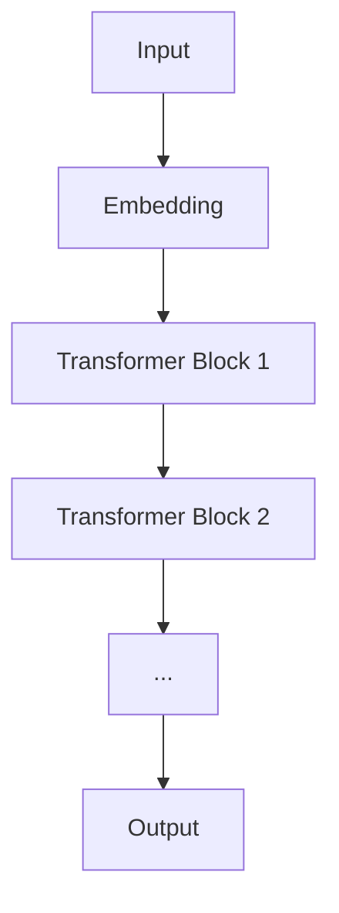

                 

**大型语言模型（LLM）是否会迎来自己的摩尔定律？**

## 1. 背景介绍

自从1965年戈登·摩尔（Gordon Moore）首次提出摩尔定律以来，集成电路中的晶体管数量每隔18个月就会增加一倍，从而推动了计算能力的指数级增长。然而，随着晶体管尺寸接近物理极限，摩尔定律的有效性面临挑战。那么，大型语言模型（LLM）是否会迎来自己的摩尔定律呢？本文将探讨这个问题，并深入分析LLM的核心概念、算法原理、数学模型，以及其在实际应用中的项目实践和挑战。

## 2. 核心概念与联系

### 2.1 大型语言模型（LLM）的定义

大型语言模型（LLM）是一种通过学习大量文本数据来理解和生成人类语言的深度学习模型。LLM可以处理长文本序列，并具有出色的零样本学习能力，能够在没有额外训练的情况下执行各种任务。

### 2.2 LLM与传统语言模型的区别

与传统语言模型相比，LLM具有更多的参数和更大的上下文窗口，从而能够处理更长的文本序列。此外，LLM还具有更强的推理和理解能力，能够在没有额外指令的情况下执行复杂任务。

### 2.3 LLM的架构

LLM通常由多个转换器（transformer）块组成，每个块包含自注意力（self-attention）机制和前向网络（feed-forward network）。自注意力机制允许模型在处理长文本序列时考虑上下文，而前向网络则为模型提供非线性变换能力。



## 3. 核心算法原理 & 具体操作步骤

### 3.1 算法原理概述

LLM的核心算法是自注意力机制，其允许模型在处理长文本序列时考虑上下文。自注意力机制通过计算查询（query）、键（key）和值（value）向量，并将其组合成注意力权重，从而实现上下文感知。

### 3.2 算法步骤详解

1. **词嵌入（Word Embedding）**：将输入文本转换为词嵌入向量。
2. **位置嵌入（Positional Encoding）**：为词嵌入向量添加位置信息，以保持序列顺序。
3. **自注意力（Self-Attention）**：计算查询、键和值向量，并将其组合成注意力权重。
4. **前向网络（Feed-Forward Network）**：对注意力输出进行非线性变换。
5. **层归一化（Layer Normalization）**：对每个转换器块进行层归一化。
6. **输出**：生成输出文本。

### 3.3 算法优缺点

**优点：**

* 可以处理长文本序列
* 具有出色的零样本学习能力
* 可以执行各种任务，如翻译、摘要和问答

**缺点：**

* 训练和推理开销高
* 存在过拟合和泄漏问题
* 缺乏解释性和可控性

### 3.4 算法应用领域

LLM的应用领域包括自然语言处理（NLP）、计算机视觉、生物信息学和强化学习等。LLM还可以用于开发智能助手、搜索引擎和内容生成系统等应用。

## 4. 数学模型和公式 & 详细讲解 & 举例说明

### 4.1 数学模型构建

LLM的数学模型可以表示为以下形式：

$$P(w_{t+1}|w_1,..., w_t) = \text{softmax}(W^V \cdot \text{Attention}(Q=W^Q \cdot w_t, K=W^K \cdot [w_1,..., w_t], V=W^V \cdot [w_1,..., w_t]))$$

其中，$w_1,..., w_t$表示输入文本序列，$W^Q, W^K, W^V$表示查询、键和值矩阵，$W^V$表示输出矩阵。

### 4.2 公式推导过程

自注意力机制的推导过程如下：

1. 计算查询、键和值向量：

$$Q = W^Q \cdot w_t$$
$$K = W^K \cdot [w_1,..., w_t]$$
$$V = W^V \cdot [w_1,..., w_t]$$

2. 计算注意力权重：

$$A = \text{softmax}(\frac{QK^T}{\sqrt{d_k}})$$

3. 计算注意力输出：

$$\text{Attention}(Q, K, V) = A \cdot V$$

### 4.3 案例分析与讲解

例如，假设我们要构建一个简单的LLM来生成文本。我们首先需要准备一个大型文本数据集，然后使用该数据集训练LLM。一旦模型训练完成，我们就可以使用它来生成新的文本。下面是一个简单的示例：

```python
import torch
import torch.nn as nn
import torch.optim as optim

# 定义模型
class LLM(nn.Module):
    def __init__(self, vocab_size, embedding_dim, hidden_dim, num_layers):
        super(LLM, self).__init__()
        self.embedding = nn.Embedding(vocab_size, embedding_dim)
        self.transformer = nn.Transformer(d_model=embedding_dim, nhead=num_layers, num_encoder_layers=num_layers)
        self.fc = nn.Linear(embedding_dim, vocab_size)

    def forward(self, x):
        embedded = self.embedding(x)
        output = self.transformer(embedded)
        output = self.fc(output)
        return output

# 初始化模型、优化器和损失函数
model = LLM(vocab_size=10000, embedding_dim=512, hidden_dim=512, num_layers=6)
optimizer = optim.Adam(model.parameters(), lr=0.001)
criterion = nn.CrossEntropyLoss()

# 训练模型
for epoch in range(num_epochs):
    for batch in train_loader:
        optimizer.zero_grad()
        output = model(batch['input'])
        loss = criterion(output.view(-1, vocab_size), batch['target'].view(-1))
        loss.backward()
        optimizer.step()

# 生成文本
with torch.no_grad():
    generated_text = []
    input = torch.tensor([[1]])  # 起始标记
    for _ in range(max_length):
        output = model(input)
        next_token = torch.argmax(output, dim=-1)
        generated_text.append(next_token.item())
        input = next_token.unsqueeze(0)
    print('Generated text:',''.join([token_to_string[token] for token in generated_text[1:]]))
```

## 5. 项目实践：代码实例和详细解释说明

### 5.1 开发环境搭建

要构建和训练LLM，您需要安装以下软件和库：

* Python 3.8或更高版本
* PyTorch 1.8或更高版本
* Transformers库（Hugging Face）
* NumPy
* Pandas

### 5.2 源代码详细实现

以下是一个简单的LLM实现示例，使用Transformers库预训练模型并 fine-tune它以执行文本分类任务：

```python
from transformers import AutoTokenizer, AutoModelForSequenceClassification, Trainer, TrainingArguments

# 加载预训练模型和分词器
model_name = 'bert-base-uncased'
tokenizer = AutoTokenizer.from_pretrained(model_name)
model = AutoModelForSequenceClassification.from_pretrained(model_name, num_labels=2)

# 准备数据
train_data =...
test_data =...

# 定义训练参数
training_args = TrainingArguments(
    output_dir='./results',
    num_train_epochs=3,
    per_device_train_batch_size=16,
    per_device_eval_batch_size=64,
    warmup_steps=500,
    weight_decay=0.01,
    logging_dir='./logs',
)

# 创建Trainer对象并训练模型
trainer = Trainer(
    model=model,
    args=training_args,
    train_dataset=train_data,
    eval_dataset=test_data
)

trainer.train()

# 保存模型
model.save_pretrained('./saved_model')
```

### 5.3 代码解读与分析

在上述示例中，我们首先加载预训练的BERT模型和分词器。然后，我们准备训练数据和测试数据。我们定义训练参数，并创建Trainer对象来训练模型。最后，我们保存训练好的模型。

### 5.4 运行结果展示

训练完成后，您可以使用保存的模型来预测新文本的类别。以下是一个示例：

```python
from transformers import pipeline

# 加载保存的模型和分词器
model = AutoModelForSequenceClassification.from_pretrained('./saved_model')
tokenizer = AutoTokenizer.from_pretrained(model_name)

# 创建文本分类管道
nlp = pipeline('text-classification', model=model, tokenizer=tokenizer)

# 预测文本类别
text = "Your input text here"
result = nlp(text)
print(f"Text: {text}\nLabel: {result[0]['label']}\nScore: {result[0]['score']}")
```

## 6. 实际应用场景

### 6.1 文本生成

LLM可以用于生成各种类型的文本，如新闻文章、小说、诗歌和代码等。例如，可以使用LLM来自动生成新闻标题或摘要。

### 6.2 问答系统

LLM可以用于构建问答系统，帮助用户快速找到答案。例如，可以使用LLM来构建搜索引擎或智能助手。

### 6.3 机器翻译

LLM可以用于机器翻译，将文本从一种语言翻译为另一种语言。例如，可以使用LLM来构建实时翻译系统。

### 6.4 未来应用展望

LLM的未来应用包括：

* 个性化推荐系统：LLM可以用于分析用户行为和偏好，从而提供个性化推荐。
* 自动内容创作：LLM可以用于自动创作各种类型的内容，如博客文章、社交媒体帖子和广告文案等。
* 智能客服：LLM可以用于构建智能客服系统，帮助用户解决问题和提供支持。

## 7. 工具和资源推荐

### 7.1 学习资源推荐

* "Attention is All You Need" - 维克多·梯特（Vaswani et al.），2017年
* "Language Models are Few-Shot Learners" - Tom B. Brown et al.，2020年
* "The Illustrated Transformer" - Jay Alammar，2018年
* "Hugging Face Transformers Documentation" - Hugging Face

### 7.2 开发工具推荐

* PyTorch
* Transformers库（Hugging Face）
* TensorFlow
* Jupyter Notebook
* Google Colab

### 7.3 相关论文推荐

* "BERT: Pre-training of Deep Bidirectional Transformers for Language Understanding" - Jacob Devlin and Ming-Wei Chang，2018年
* "ELMo: Embeddings for Language Modeling" - Matthew E. Peters et al.，2018年
* "RoBERTa: A Robustly Optimized BERT Pretraining Approach" - Yinhan Liu et al.，2019年
* "T5: Text-to-Text Transfer Transformer" - Colin Raffel et al.，2019年

## 8. 总结：未来发展趋势与挑战

### 8.1 研究成果总结

本文介绍了大型语言模型（LLM）的核心概念、算法原理、数学模型，以及其在实际应用中的项目实践和挑战。我们还讨论了LLM的未来应用和工具资源。

### 8.2 未来发展趋势

LLM的未来发展趋势包括：

* 模型规模扩大：随着计算能力的提高，LLM的规模将进一步扩大，从而提高其性能和泛化能力。
* 多模式学习：LLM将与其他模式（如图像和音频）结合，从而实现更强大的多模式学习能力。
* 解释性和可控性：研究人员将努力提高LLM的解释性和可控性，以便更好地理解和控制模型的行为。

### 8.3 面临的挑战

LLM面临的挑战包括：

* 训练和推理开销：大规模LLM的训练和推理开销很高，需要大量的计算资源和时间。
* 过拟合和泄漏：LLM容易受到过拟合和泄漏问题的影响，从而导致性能下降。
* 伦理和安全问题：LLM可能会生成有偏见、不准确或有害的输出，需要开发相关技术来解决这些问题。

### 8.4 研究展望

未来的研究将关注以下领域：

* 低资源语言：开发针对低资源语言的LLM，以扩展其应用领域。
* 多模式学习：开发能够处理多模式数据的LLM，从而实现更强大的学习能力。
* 可解释性和可控性：开发新的技术来提高LLM的解释性和可控性，从而更好地理解和控制模型的行为。

## 9. 附录：常见问题与解答

**Q1：LLM与传统语言模型有何区别？**

A1：与传统语言模型相比，LLM具有更多的参数和更大的上下文窗口，从而能够处理更长的文本序列。此外，LLM还具有更强的推理和理解能力，能够在没有额外指令的情况下执行复杂任务。

**Q2：LLM的训练和推理开销高是否会成为瓶颈？**

A2：是的，大规模LLM的训练和推理开销很高，需要大量的计算资源和时间。然而，随着计算能力的提高和新技术的开发，这些挑战有望得到解决。

**Q3：LLM是否会取代人类？**

A3：LLM不会取代人类，但它们可以帮助人类完成各种任务，从而提高效率和生产力。此外，LLM还可以用于开发新的应用和服务，从而创造新的就业机会。

**Q4：LLM是否会导致失业问题？**

A4：LLM可能会导致某些岗位的自动化，从而减少人力需求。然而，它们也会创造新的就业机会，并为现有岗位带来新的技能需求。总体而言，LLM的影响是中性的，需要政策和教育体系的调整来适应新的就业格局。

**Q5：LLM是否会导致伦理和安全问题？**

A5：是的，LLM可能会导致伦理和安全问题，如生成有偏见、不准确或有害的输出。需要开发相关技术来解决这些问题，并建立相关政策和标准来规范LLM的开发和使用。

## 作者：禅与计算机程序设计艺术 / Zen and the Art of Computer Programming

