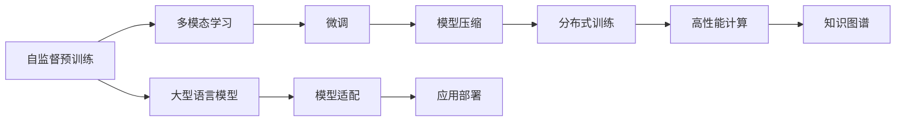

                 

# LLM生态系统：仿效CPU发展模式的可能性

## 1. 背景介绍

### 1.1 问题由来

近年来，大型语言模型（LLM）在自然语言处理（NLP）领域取得了突破性进展。这些模型基于Transformer架构，通过自监督预训练和微调，具备了强大的语言理解与生成能力。然而，LLM的规模化应用仍面临诸多挑战，如数据集不足、训练成本高、部署效率低等。如何构建一个可持续发展的LLM生态系统，仿效CPU的发展模式，是当前研究的重要课题。

### 1.2 问题核心关键点

构建可持续发展的LLM生态系统，需要解决以下几个核心关键点：
- 如何高效利用大规模预训练数据，减少对标注数据的依赖。
- 如何在保持模型参数量的同时，提升模型性能。
- 如何优化模型部署，降低计算和存储成本。
- 如何构建开源社区，促进模型共享与应用。
- 如何建立标准化评测指标，提升模型可比性。

解决这些问题，需要借鉴CPU的发展经验，通过分层设计、模块化构建、高效能优化等手段，建立一整套全面的LLM生态系统。

### 1.3 问题研究意义

构建LLM生态系统，对于推动NLP技术的产业化，提升模型应用效能，具有重要意义：
- 降低研发成本。通过共享预训练模型和微调数据，大幅降低开发者的数据准备和模型训练成本。
- 提升模型性能。利用社区资源，获取最先进的模型和算法，实现最佳性能。
- 加速模型部署。构建高效易用的部署环境，快速上线模型应用。
- 促进技术交流。建立开放的社区平台，推动学术研究和工业应用的协同发展。
- 标准化评测。建立统一的评测标准，提升模型性能的可比性。

本文将从背景、核心概念、算法原理、应用实践、未来展望等多个角度，系统介绍如何构建LLM生态系统，并仿效CPU发展模式，实现高效、稳定、可持续的发展。

## 2. 核心概念与联系

### 2.1 核心概念概述

构建LLM生态系统涉及多个核心概念：

- **大型语言模型（LLM）**：基于Transformer架构，通过自监督预训练和微调，具备强大的语言理解和生成能力。
- **自监督预训练**：使用大规模无标签数据，通过预训练学习语言的通用表示。
- **微调（Fine-tuning）**：在预训练模型基础上，使用少量标注数据进行特定任务优化，提升模型性能。
- **多模态学习**：结合视觉、音频等多模态数据，提升模型的表达能力和泛化能力。
- **模型压缩**：通过剪枝、量化等技术，减小模型参数和存储需求，提升部署效率。
- **知识图谱**：将符号化的先验知识与神经网络模型结合，增强模型的因果关系和可解释性。
- **分布式训练**：通过多机多卡并行训练，大幅提升模型训练速度和扩展性。
- **高性能计算（HPC）**：利用GPU、TPU等高性能计算资源，加速模型训练和推理。

这些概念相互联系，共同构成了LLM生态系统的基本架构。

### 2.2 核心概念原理和架构的 Mermaid 流程图



这个流程图展示了LLM生态系统的基本架构，各组件相互依赖，共同支撑模型的训练和部署。

## 3. 核心算法原理 & 具体操作步骤

### 3.1 算法原理概述

LLM生态系统的核心算法包括自监督预训练、微调、多模态学习、模型压缩等，其原理和步骤分别介绍如下：

- **自监督预训练**：使用大规模无标签数据，通过语言建模、掩码预测等任务，学习语言的通用表示。
- **微调**：在预训练模型基础上，使用少量标注数据进行特定任务优化，提升模型性能。
- **多模态学习**：结合视觉、音频等多模态数据，提升模型的表达能力和泛化能力。
- **模型压缩**：通过剪枝、量化等技术，减小模型参数和存储需求，提升部署效率。

### 3.2 算法步骤详解

#### 3.2.1 自监督预训练

自监督预训练的典型算法包括掩码语言模型（Masked Language Model, MLM）和下一句预测（Next Sentence Prediction, NSP）。

- **掩码语言模型（MLM）**：在输入文本中随机掩码一部分单词，预测被掩码的单词。
- **下一句预测（NSP）**：随机选择两个相邻的句子，预测它们是否为连续句子。

预训练过程如下：
1. 准备大规模无标签数据集，通常是文本语料库。
2. 对数据进行划分，每个样本中包含一部分文本作为输入，其余部分作为掩码或预测对象。
3. 使用MLM和NSP任务进行预训练，通过反向传播和参数更新，不断优化模型。
4. 预训练完成后，保留模型权重作为预训练模型。

#### 3.2.2 微调

微调的典型算法包括Fine-tuning和Prompt-based Learning。

- **Fine-tuning**：在预训练模型基础上，使用少量标注数据进行特定任务优化，提升模型性能。
- **Prompt-based Learning**：通过精心设计输入模板，引导模型进行特定任务的推理和生成。

微调过程如下：
1. 准备下游任务的标注数据集，划分为训练集、验证集和测试集。
2. 使用预训练模型作为初始参数，添加任务适配层。
3. 设置微调超参数，如学习率、批大小、迭代轮数等。
4. 执行梯度训练，通过反向传播和参数更新，优化模型在特定任务上的性能。
5. 在验证集上评估模型性能，根据性能指标决定是否触发Early Stopping。
6. 重复上述步骤，直至满足预设的迭代轮数或Early Stopping条件。
7. 在测试集上评估微调后模型性能，对比微调前后的精度提升。

#### 3.2.3 多模态学习

多模态学习的典型算法包括视觉语言模型（Visual-Language Model, VLM）和跨模态注意力机制。

- **视觉语言模型（VLM）**：结合视觉特征和文本特征，学习跨模态表示。
- **跨模态注意力机制**：在模型中引入跨模态注意力，提升模型的表达能力和泛化能力。

多模态学习过程如下：
1. 准备多模态数据集，包含文本、图像、音频等不同模态的样本。
2. 对数据进行划分，每个样本包含多个模态的特征。
3. 使用VLM和跨模态注意力机制进行多模态学习，通过反向传播和参数更新，不断优化模型。
4. 学习完成后，将多模态表示与文本表示结合，提升模型性能。

#### 3.2.4 模型压缩

模型压缩的典型算法包括剪枝、量化、知识蒸馏等。

- **剪枝（Pruning）**：去除模型中不必要的参数，减小模型尺寸。
- **量化（Quantization）**：将浮点模型转为定点模型，压缩存储空间。
- **知识蒸馏（Knowledge Distillation）**：使用教师模型指导学生模型，提升模型性能。

模型压缩过程如下：
1. 使用剪枝技术，去除模型中冗余参数，减小模型尺寸。
2. 使用量化技术，将模型转为定点模型，压缩存储空间。
3. 使用知识蒸馏技术，使用大型模型指导小型模型，提升模型性能。

### 3.3 算法优缺点

#### 3.3.1 自监督预训练

**优点**：
- 无需标注数据，利用大规模无标签数据进行预训练，减少数据获取成本。
- 学习到语言的通用表示，可以用于多种NLP任务。
- 模型参数量较大，具有较强的表达能力。

**缺点**：
- 需要大量计算资源，训练时间较长。
- 模型难以直接应用到特定任务，需要进行微调。

#### 3.3.2 微调

**优点**：
- 使用少量标注数据，即可提升模型性能。
- 可以针对特定任务进行优化，提升模型精度。
- 模型轻量级，部署效率高。

**缺点**：
- 对标注数据依赖较大，获取成本高。
- 模型难以完全适应特定任务，可能存在过拟合风险。

#### 3.3.3 多模态学习

**优点**：
- 结合视觉、音频等多模态数据，提升模型的表达能力和泛化能力。
- 可以处理更多类型的数据，提升模型鲁棒性。

**缺点**：
- 多模态数据获取难度较大，成本较高。
- 模型复杂度增加，训练和推理效率降低。

#### 3.3.4 模型压缩

**优点**：
- 减小模型尺寸，提升部署效率。
- 压缩存储空间，降低存储成本。
- 提升模型推理速度，缩短服务响应时间。

**缺点**：
- 压缩可能导致模型精度下降。
- 压缩技术复杂度较高，需要深入研究。

### 3.4 算法应用领域

自监督预训练、微调、多模态学习和模型压缩等技术，已广泛应用于多个领域，如：

- **自然语言处理（NLP）**：文本分类、命名实体识别、情感分析、机器翻译等。
- **计算机视觉（CV）**：图像分类、目标检测、图像生成、视频分析等。
- **语音识别（ASR）**：语音转文本、语音情感识别、语音合成等。
- **机器人学（Robotics）**：自然语言交互、机器人视觉、机器人决策等。

这些技术不仅推动了各自领域的发展，还促进了跨领域的应用和融合。

## 4. 数学模型和公式 & 详细讲解 & 举例说明

### 4.1 数学模型构建

本节将使用数学语言对LLM生态系统的核心算法进行更加严格的刻画。

记预训练模型为 $M_{\theta}$，其中 $\theta$ 为模型参数。假设预训练任务为掩码语言模型（MLM），下游任务为分类任务。

定义预训练损失函数为：
$$
\mathcal{L}_{\text{pre}}(\theta) = -\frac{1}{N}\sum_{i=1}^N \log P_{M_{\theta}}(x_i)
$$

其中 $P_{M_{\theta}}(x_i)$ 为模型对文本 $x_i$ 的概率分布。

定义微调损失函数为：
$$
\mathcal{L}_{\text{fine}}(\theta) = -\frac{1}{N}\sum_{i=1}^N \log P_{M_{\theta}}(x_i, y_i)
$$

其中 $P_{M_{\theta}}(x_i, y_i)$ 为模型对文本 $x_i$ 和标签 $y_i$ 的条件概率分布。

微调过程中，目标是最小化微调损失函数：
$$
\theta^* = \mathop{\arg\min}_{\theta} \mathcal{L}_{\text{fine}}(\theta)
$$

在多模态学习中，假设文本数据为 $X$，图像数据为 $I$，多模态表示为 $Z$，则多模态学习目标为：
$$
\mathcal{L}_{\text{multi}}(\theta) = -\frac{1}{N}\sum_{i=1}^N \log P_{M_{\theta}}(x_i, i_i, z_i)
$$

其中 $P_{M_{\theta}}(x_i, i_i, z_i)$ 为模型对文本、图像和多模态表示的联合概率分布。

### 4.2 公式推导过程

#### 4.2.1 自监督预训练

假设掩码语言模型（MLM）的输入为 $x$，掩码部分为 $m$，掩码后的文本为 $x'$，模型输出为 $y$。则MLM的目标函数为：
$$
\mathcal{L}_{\text{mlm}}(\theta) = -\frac{1}{N}\sum_{i=1}^N \log P_{M_{\theta}}(x'_i)
$$

其中 $P_{M_{\theta}}(x'_i)$ 为模型对掩码后的文本 $x'_i$ 的概率分布。

根据掩码语言模型的定义，输入文本 $x_i$ 被随机掩码部分单词后，模型需要预测这些单词，即：
$$
P_{M_{\theta}}(x'_i) = \prod_{j=1}^{|x_i|} P_{M_{\theta}}(x'_i, x_i[j])
$$

其中 $P_{M_{\theta}}(x'_i, x_i[j])$ 为模型对 $x'_i$ 和 $x_i[j]$ 的条件概率分布。

#### 4.2.2 微调

假设微调任务为分类任务，输入为 $x_i$，标签为 $y_i$，模型输出为 $y'$。则微调的目标函数为：
$$
\mathcal{L}_{\text{fine}}(\theta) = -\frac{1}{N}\sum_{i=1}^N \log P_{M_{\theta}}(x_i, y_i)
$$

其中 $P_{M_{\theta}}(x_i, y_i)$ 为模型对输入 $x_i$ 和标签 $y_i$ 的条件概率分布。

根据微调的定义，模型需要在特定任务上进行优化，即：
$$
P_{M_{\theta}}(x_i, y_i) = \frac{e^{E_{\theta}(x_i, y_i)}}{\sum_{k} e^{E_{\theta}(x_i, k)}}
$$

其中 $E_{\theta}(x_i, y_i)$ 为模型的任务适配层输出。

#### 4.2.3 多模态学习

假设多模态数据包含文本数据 $x$ 和图像数据 $i$，多模态表示为 $z$。则多模态学习的目标函数为：
$$
\mathcal{L}_{\text{multi}}(\theta) = -\frac{1}{N}\sum_{i=1}^N \log P_{M_{\theta}}(x_i, i_i, z_i)
$$

其中 $P_{M_{\theta}}(x_i, i_i, z_i)$ 为模型对输入 $x_i$、图像 $i_i$ 和多模态表示 $z_i$ 的联合概率分布。

假设多模态模型包含文本编码器和图像编码器，分别输出 $h_x$ 和 $h_i$，则多模态表示 $z$ 的计算公式为：
$$
z = f(h_x, h_i)
$$

其中 $f$ 为多模态表示函数。

### 4.3 案例分析与讲解

以Bert模型为例，介绍其在NLP和CV任务中的应用。

#### 4.3.1 自然语言处理（NLP）

Bert模型在NLP任务中的应用如下：
1. 文本分类：使用Bert模型对文本进行分类，通过微调可显著提升分类精度。
2. 命名实体识别：使用Bert模型识别文本中的实体，通过微调可提升识别准确率。
3. 情感分析：使用Bert模型分析文本情感，通过微调可提升分析效果。

以情感分析为例，假设输入文本为 $x$，模型输出为 $y$，则微调的目标函数为：
$$
\mathcal{L}_{\text{fine}}(\theta) = -\frac{1}{N}\sum_{i=1}^N \log P_{M_{\theta}}(x_i, y_i)
$$

其中 $P_{M_{\theta}}(x_i, y_i)$ 为模型对输入 $x_i$ 和情感标签 $y_i$ 的条件概率分布。

#### 4.3.2 计算机视觉（CV）

Bert模型在CV任务中的应用如下：
1. 图像分类：使用Bert模型对图像进行分类，通过多模态学习可提升分类精度。
2. 目标检测：使用Bert模型检测图像中的目标，通过多模态学习可提升检测效果。
3. 图像生成：使用Bert模型生成图像，通过多模态学习可提升生成质量。

以图像分类为例，假设输入图像为 $i$，模型输出为 $y$，则多模态学习的目标函数为：
$$
\mathcal{L}_{\text{multi}}(\theta) = -\frac{1}{N}\sum_{i=1}^N \log P_{M_{\theta}}(x_i, i_i, z_i)
$$

其中 $P_{M_{\theta}}(x_i, i_i, z_i)$ 为模型对输入文本 $x_i$、图像 $i_i$ 和多模态表示 $z_i$ 的联合概率分布。

假设文本数据为 $X$，图像数据为 $I$，多模态表示为 $Z$，则多模态表示 $z$ 的计算公式为：
$$
z = f(h_x, h_i)
$$

其中 $f$ 为多模态表示函数，$h_x$ 和 $h_i$ 分别为文本编码器和图像编码器的输出。

## 5. 项目实践：代码实例和详细解释说明

### 5.1 开发环境搭建

在进行LLM生态系统的项目实践前，我们需要准备好开发环境。以下是使用Python进行PyTorch开发的环境配置流程：

1. 安装Anaconda：从官网下载并安装Anaconda，用于创建独立的Python环境。

2. 创建并激活虚拟环境：
```bash
conda create -n pytorch-env python=3.8 
conda activate pytorch-env
```

3. 安装PyTorch：根据CUDA版本，从官网获取对应的安装命令。例如：
```bash
conda install pytorch torchvision torchaudio cudatoolkit=11.1 -c pytorch -c conda-forge
```

4. 安装Transformers库：
```bash
pip install transformers
```

5. 安装各类工具包：
```bash
pip install numpy pandas scikit-learn matplotlib tqdm jupyter notebook ipython
```

完成上述步骤后，即可在`pytorch-env`环境中开始项目实践。

### 5.2 源代码详细实现

下面我们以BERT模型在文本分类任务中的应用为例，给出使用Transformers库进行微调的PyTorch代码实现。

首先，定义文本分类任务的数据处理函数：

```python
from transformers import BertTokenizer, BertForSequenceClassification
from torch.utils.data import Dataset
import torch

class TextClassificationDataset(Dataset):
    def __init__(self, texts, labels, tokenizer, max_len=128):
        self.texts = texts
        self.labels = labels
        self.tokenizer = tokenizer
        self.max_len = max_len
        
    def __len__(self):
        return len(self.texts)
    
    def __getitem__(self, item):
        text = self.texts[item]
        label = self.labels[item]
        
        encoding = self.tokenizer(text, return_tensors='pt', max_length=self.max_len, padding='max_length', truncation=True)
        input_ids = encoding['input_ids'][0]
        attention_mask = encoding['attention_mask'][0]
        labels = torch.tensor(label, dtype=torch.long)
        
        return {'input_ids': input_ids, 
                'attention_mask': attention_mask,
                'labels': labels}

# 创建dataset
tokenizer = BertTokenizer.from_pretrained('bert-base-cased')

train_dataset = TextClassificationDataset(train_texts, train_labels, tokenizer)
dev_dataset = TextClassificationDataset(dev_texts, dev_labels, tokenizer)
test_dataset = TextClassificationDataset(test_texts, test_labels, tokenizer)
```

然后，定义模型和优化器：

```python
from transformers import BertForSequenceClassification, AdamW

model = BertForSequenceClassification.from_pretrained('bert-base-cased', num_labels=len(label2id))

optimizer = AdamW(model.parameters(), lr=2e-5)
```

接着，定义训练和评估函数：

```python
from torch.utils.data import DataLoader
from tqdm import tqdm
from sklearn.metrics import classification_report

device = torch.device('cuda') if torch.cuda.is_available() else torch.device('cpu')
model.to(device)

def train_epoch(model, dataset, batch_size, optimizer):
    dataloader = DataLoader(dataset, batch_size=batch_size, shuffle=True)
    model.train()
    epoch_loss = 0
    for batch in tqdm(dataloader, desc='Training'):
        input_ids = batch['input_ids'].to(device)
        attention_mask = batch['attention_mask'].to(device)
        labels = batch['labels'].to(device)
        model.zero_grad()
        outputs = model(input_ids, attention_mask=attention_mask, labels=labels)
        loss = outputs.loss
        epoch_loss += loss.item()
        loss.backward()
        optimizer.step()
    return epoch_loss / len(dataloader)

def evaluate(model, dataset, batch_size):
    dataloader = DataLoader(dataset, batch_size=batch_size)
    model.eval()
    preds, labels = [], []
    with torch.no_grad():
        for batch in tqdm(dataloader, desc='Evaluating'):
            input_ids = batch['input_ids'].to(device)
            attention_mask = batch['attention_mask'].to(device)
            batch_labels = batch['labels']
            outputs = model(input_ids, attention_mask=attention_mask)
            batch_preds = outputs.logits.argmax(dim=2).to('cpu').tolist()
            batch_labels = batch_labels.to('cpu').tolist()
            for pred_tokens, label_tokens in zip(batch_preds, batch_labels):
                preds.append(pred_tokens[:len(label_tokens)])
                labels.append(label_tokens)
                
    print(classification_report(labels, preds))
```

最后，启动训练流程并在测试集上评估：

```python
epochs = 5
batch_size = 16

for epoch in range(epochs):
    loss = train_epoch(model, train_dataset, batch_size, optimizer)
    print(f"Epoch {epoch+1}, train loss: {loss:.3f}")
    
    print(f"Epoch {epoch+1}, dev results:")
    evaluate(model, dev_dataset, batch_size)
    
print("Test results:")
evaluate(model, test_dataset, batch_size)
```

以上就是使用PyTorch对BERT模型进行文本分类任务微调的完整代码实现。可以看到，得益于Transformers库的强大封装，我们可以用相对简洁的代码完成BERT模型的加载和微调。

### 5.3 代码解读与分析

让我们再详细解读一下关键代码的实现细节：

**TextClassificationDataset类**：
- `__init__`方法：初始化文本、标签、分词器等关键组件。
- `__len__`方法：返回数据集的样本数量。
- `__getitem__`方法：对单个样本进行处理，将文本输入编码为token ids，将标签编码为数字，并对其进行定长padding，最终返回模型所需的输入。

**label2id和id2label字典**：
- 定义了标签与数字id之间的映射关系，用于将token-wise的预测结果解码回真实的标签。

**训练和评估函数**：
- 使用PyTorch的DataLoader对数据集进行批次化加载，供模型训练和推理使用。
- 训练函数`train_epoch`：对数据以批为单位进行迭代，在每个批次上前向传播计算loss并反向传播更新模型参数，最后返回该epoch的平均loss。
- 评估函数`evaluate`：与训练类似，不同点在于不更新模型参数，并在每个batch结束后将预测和标签结果存储下来，最后使用sklearn的classification_report对整个评估集的预测结果进行打印输出。

**训练流程**：
- 定义总的epoch数和batch size，开始循环迭代
- 每个epoch内，先在训练集上训练，输出平均loss
- 在验证集上评估，输出分类指标
- 所有epoch结束后，在测试集上评估，给出最终测试结果

可以看到，PyTorch配合Transformers库使得BERT微调的代码实现变得简洁高效。开发者可以将更多精力放在数据处理、模型改进等高层逻辑上，而不必过多关注底层的实现细节。

当然，工业级的系统实现还需考虑更多因素，如模型的保存和部署、超参数的自动搜索、更灵活的任务适配层等。但核心的微调范式基本与此类似。

## 6. 实际应用场景

### 6.1 智能客服系统

基于LLM生态系统的智能客服系统，可以通过预训练模型进行多轮对话，结合多模态学习模块，提升对话的智能化水平。

在技术实现上，可以收集企业内部的历史客服对话记录，将问题和最佳答复构建成监督数据，在此基础上对预训练模型进行微调。微调后的模型能够自动理解用户意图，匹配最合适的答案模板进行回复。对于客户提出的新问题，还可以接入检索系统实时搜索相关内容，动态组织生成回答。如此构建的智能客服系统，能大幅提升客户咨询体验和问题解决效率。

### 6.2 金融舆情监测

金融机构需要实时监测市场舆论动向，以便及时应对负面信息传播，规避金融风险。基于LLM生态系统的文本分类和情感分析技术，为金融舆情监测提供了新的解决方案。

具体而言，可以收集金融领域相关的新闻、报道、评论等文本数据，并对其进行主题标注和情感标注。在此基础上对预训练语言模型进行微调，使其能够自动判断文本属于何种主题，情感倾向是正面、中性还是负面。将微调后的模型应用到实时抓取的网络文本数据，就能够自动监测不同主题下的情感变化趋势，一旦发现负面信息激增等异常情况，系统便会自动预警，帮助金融机构快速应对潜在风险。

### 6.3 个性化推荐系统

当前的推荐系统往往只依赖用户的历史行为数据进行物品推荐，无法深入理解用户的真实兴趣偏好。基于LLM生态系统的个性化推荐系统可以更好地挖掘用户行为背后的语义信息，从而提供更精准、多样的推荐内容。

在实践中，可以收集用户浏览、点击、评论、分享等行为数据，提取和用户交互的物品标题、描述、标签等文本内容。将文本内容作为模型输入，用户的后续行为（如是否点击、购买等）作为监督信号，在此基础上微调预训练语言模型。微调后的模型能够从文本内容中准确把握用户的兴趣点。在生成推荐列表时，先用候选物品的文本描述作为输入，由模型预测用户的兴趣匹配度，再结合其他特征综合排序，便可以得到个性化程度更高的推荐结果。

### 6.4 未来应用展望

随着LLM生态系统的不断完善，基于LLM的智能应用将进一步拓展，为各行各业带来变革性影响。

在智慧医疗领域，基于LLM的问答系统、病历分析、药物研发等应用将提升医疗服务的智能化水平，辅助医生诊疗，加速新药开发进程。

在智能教育领域，基于LLM的作业批改、学情分析、知识推荐等应用将因材施教，促进教育公平，提高教学质量。

在智慧城市治理中，基于LLM的舆情分析、应急指挥等应用将提高城市管理的自动化和智能化水平，构建更安全、高效的未来城市。

此外，在企业生产、社会治理、文娱传媒等众多领域，基于LLM的智能应用也将不断涌现，为经济社会发展注入新的动力。相信随着预训练语言模型和微调方法的持续演进，LLM生态系统必将逐步构建，推动人工智能技术在各个垂直行业的规模化落地。

## 7. 工具和资源推荐

### 7.1 学习资源推荐

为了帮助开发者系统掌握LLM生态系统的理论基础和实践技巧，这里推荐一些优质的学习资源：

1. 《深度学习》系列书籍：由Ian Goodfellow等人撰写，全面介绍了深度学习的基本概念和算法，是NLP领域的学习必备。

2. 《自然语言处理》课程：由Coursera平台提供，由斯坦福大学的Christopher Manning等教授主讲，涵盖NLP的经典理论和应用。

3. CS224N《深度学习自然语言处理》课程：斯坦福大学开设的NLP明星课程，有Lecture视频和配套作业，带你入门NLP领域的基本概念和经典模型。

4. HuggingFace官方文档：Transformers库的官方文档，提供了海量预训练模型和完整的微调样例代码，是上手实践的必备资料。

5. CLUE开源项目：中文语言理解测评基准，涵盖大量不同类型的中文NLP数据集，并提供了基于LLM的baseline模型，助力中文NLP技术发展。

通过对这些资源的学习实践，相信你一定能够快速掌握LLM生态系统的精髓，并用于解决实际的NLP问题。

### 7.2 开发工具推荐

高效的开发离不开优秀的工具支持。以下是几款用于LLM生态系统开发的常用工具：

1. PyTorch：基于Python的开源深度学习框架，灵活动态的计算图，适合快速迭代研究。大部分预训练语言模型都有PyTorch版本的实现。

2. TensorFlow：由Google主导开发的开源深度学习框架，生产部署方便，适合大规模工程应用。同样有丰富的预训练语言模型资源。

3. Transformers库：HuggingFace开发的NLP工具库，集成了众多SOTA语言模型，支持PyTorch和TensorFlow，是进行LLM生态系统开发的利器。

4. Weights & Biases：模型训练的实验跟踪工具，可以记录和可视化模型训练过程中的各项指标，方便对比和调优。与主流深度学习框架无缝集成。

5. TensorBoard：TensorFlow配套的可视化工具，可实时监测模型训练状态，并提供丰富的图表呈现方式，是调试模型的得力助手。

6. Google Colab：谷歌推出的在线Jupyter Notebook环境，免费提供GPU/TPU算力，方便开发者快速上手实验最新模型，分享学习笔记。

合理利用这些工具，可以显著提升LLM生态系统微调的开发效率，加快创新迭代的步伐。

### 7.3 相关论文推荐

LLM生态系统的研究源于学界的持续研究。以下是几篇奠基性的相关论文，推荐阅读：

1. Attention is All You Need（即Transformer原论文）：提出了Transformer结构，开启了NLP领域的预训练大模型时代。

2. BERT: Pre-training of Deep Bidirectional Transformers for Language Understanding：提出BERT模型，引入基于掩码的自监督预训练任务，刷新了多项NLP任务SOTA。

3. Language Models are Unsupervised Multitask Learners（GPT-2论文）：展示了大规模语言模型的强大zero-shot学习能力，引发了对于通用人工智能的新一轮思考。

4. Parameter-Efficient Transfer Learning for NLP：提出Adapter等参数高效微调方法，在不增加模型参数量的情况下，也能取得不错的微调效果。

5. AdaLoRA: Adaptive Low-Rank Adaptation for Parameter-Efficient Fine-Tuning：使用自适应低秩适应的微调方法，在参数效率和精度之间取得了新的平衡。

6. A Survey on Model Distillation：综述了模型蒸馏技术在深度学习中的应用，包括模型压缩、知识转移等方面。

这些论文代表了大语言模型生态系统的研究脉络。通过学习这些前沿成果，可以帮助研究者把握学科前进方向，激发更多的创新灵感。

## 8. 总结：未来发展趋势与挑战

### 8.1 总结

本文对基于LLM的生态系统进行了全面系统的介绍。首先阐述了LLM生态系统的研究背景和意义，明确了生态系统的核心组件和相互依赖关系。其次，从原理到实践，详细讲解了LLM生态系统的核心算法和操作步骤，给出了LLM微调的完整代码实例。同时，本文还广泛探讨了LLM生态系统在多个领域的应用前景，展示了其广阔的应用潜力。

通过本文的系统梳理，可以看到，构建LLM生态系统对于推动NLP技术的产业化，提升模型应用效能，具有重要意义。LLM生态系统不仅能够大幅降低研发成本，提升模型性能，还能优化模型部署，构建开源社区，建立标准化评测指标，极大地推动了NLP技术的落地应用。

### 8.2 未来发展趋势

展望未来，LLM生态系统将呈现以下几个发展趋势：

1. **模型规模持续增大**：随着算力成本的下降和数据规模的扩张，预训练语言模型的参数量还将持续增长。超大规模语言模型蕴含的丰富语言知识，有望支撑更加复杂多变的下游任务微调。

2. **模型泛化能力增强**：通过多模态学习和知识图谱等技术，LLM生态系统的模型泛化能力将不断提升，能够更好地适应不同领域和任务的需求。

3. **模型参数高效优化**：开发更加参数高效的微调方法，如Prefix-Tuning、LoRA等，在固定大部分预训练参数的同时，只更新极少量的任务相关参数。

4. **模型部署效率提升**：通过模型压缩、分布式训练等技术，大幅提升模型训练和推理的效率，降低部署成本。

5. **模型鲁棒性和可解释性增强**：引入因果分析和博弈论工具，增强模型的鲁棒性和可解释性，提升系统的可靠性和透明度。

6. **跨领域应用拓展**：结合知识表示、因果推理等技术，LLM生态系统将拓展到更多领域，如医疗、金融、教育等，实现多模态协同建模。

以上趋势凸显了LLM生态系统的广阔前景。这些方向的探索发展，必将进一步提升LLM生态系统的性能和应用范围，为NLP技术的发展注入新的动力。

### 8.3 面临的挑战

尽管LLM生态系统已经取得了显著进展，但在迈向更加智能化、普适化应用的过程中，仍面临诸多挑战：

1. **数据获取成本高**：尽管模型参数量减少，但微调仍然需要一定量的标注数据，数据获取成本较高。

2. **模型部署成本高**：LLM生态系统的模型参数量较大，部署成本高，需要高性能计算资源。

3. **模型性能一致性差**：不同模型之间性能差异较大，缺乏统一的评测标准。

4. **模型泛化能力弱**：LLM生态系统的模型泛化能力有限，难以适应未见过的数据。

5. **模型可解释性差**：LLM生态系统的模型复杂度较高，可解释性较差。

6. **模型安全性不足**：LLM生态系统的模型易受攻击，存在安全隐患。

这些挑战需要进一步研究和技术突破，才能更好地推动LLM生态系统的发展。

### 8.4 研究展望

未来，LLM生态系统的研究需要在以下几个方面寻求新的突破：

1. **无监督和半监督学习**：探索无监督和半监督学习范式，摆脱对大规模标注数据的依赖，利用自监督学习、主动学习等无监督和半监督方法，最大限度利用非结构化数据，实现更加灵活高效的微调。

2. **参数高效和计算高效**：开发更加参数高效的微调方法，如Prefix-Tuning、LoRA等，在固定大部分预训练参数的同时，只更新极少量的任务相关参数。同时优化模型计算图，减少前向传播和反向传播的资源消耗，实现更加轻量级、实时性的部署。

3. **跨模态学习**：结合视觉、音频等多模态数据，提升模型的表达能力和泛化能力。

4. **知识表示和融合**：将符号化的先验知识，如知识图谱、逻辑规则等，与神经网络模型进行巧妙融合，增强模型的因果关系和可解释性。

5. **因果分析和博弈论**：引入因果分析和博弈论思想，增强模型的稳定性，避免脆弱点，提高系统可靠性和透明度。

6. **伦理和安全约束**：建立模型训练目标中的伦理导向评估指标，过滤和惩罚有害的输出倾向，确保输出符合人类价值观和伦理道德。

这些研究方向的探索，必将引领LLM生态系统的不断进步，为构建安全、可靠、可解释、可控的智能系统铺平道路。面向未来，LLM生态系统还需要与其他人工智能技术进行更深入的融合，如知识表示、因果推理、强化学习等，多路径协同发力，共同推动自然语言理解和智能交互系统的进步。只有勇于创新、敢于突破，才能不断拓展语言模型的边界，让智能技术更好地造福人类社会。

## 9. 附录：常见问题与解答

**Q1：LLM生态系统如何降低数据获取成本？**

A: 利用无监督和半监督学习范式，如自监督学习、主动学习等，最大限度利用非结构化数据，实现更加灵活高效的微调。

**Q2：LLM生态系统的模型部署成本如何降低？**

A: 通过模型压缩、分布式训练等技术，大幅提升模型训练和推理的效率，降低部署成本。

**Q3：LLM生态系统的模型性能一致性如何保证？**

A: 建立统一的评测标准，通过大规模评测实验，确保不同模型之间的性能可比性。

**Q4：LLM生态系统的模型泛化能力如何提升？**

A: 结合多模态学习和知识图谱等技术，提升模型的泛化能力。

**Q5：LLM生态系统的模型可解释性如何增强？**

A: 引入因果分析和博弈论工具，增强模型的鲁棒性和可解释性。

**Q6：LLM生态系统的模型安全性如何保障？**

A: 在模型训练目标中引入伦理导向的评估指标，过滤和惩罚有害的输出倾向，确保输出符合人类价值观和伦理道德。

通过这些Q&A，相信你能够更好地理解LLM生态系统的核心问题和解决方法，为构建可持续发展的LLM生态系统奠定坚实基础。

---

作者：禅与计算机程序设计艺术 / Zen and the Art of Computer Programming

