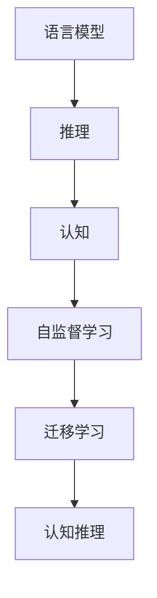

                 

# LLM的analogical reasoning探索

> 关键词：语言模型, 推理, 逻辑, 认知, 自监督, 迁移学习, 认知推理

## 1. 背景介绍

### 1.1 问题由来
当前，深度学习技术在语言处理、自然语言理解（NLU）和自然语言生成（NLG）领域取得了显著的进步。特别是在预训练语言模型（LLMs）的推动下，模型的性能得到了极大的提升。然而，尽管LLMs在许多任务上表现出色，但其推理能力仍然受到限制。尤其是在涉及复杂逻辑推理和抽象概念理解的analogical reasoning（类比推理）任务上，LLMs的表现与人类相比仍有不小的差距。

### 1.2 问题核心关键点
analogical reasoning，即类比推理，是指通过类比已知的概念或关系，推断出新概念或关系的能力。在自然语言处理中，类比推理通常表现为将一个语言结构（如句子）与另一个语言结构进行类比，以解决新的推理任务。例如，通过比较“国王”和“女王”在“家庭”中的关系，推断出“父亲”和“母亲”的关系。这种能力对于理解和生成自然语言至关重要，但也极具挑战性。

当前，大多数LLMs在进行analogical reasoning时，依赖于大量的监督数据或对复杂逻辑关系的直接建模。这些方法在一定程度上有效，但存在数据需求高、泛化能力差、模型复杂度高等问题。如何更高效、更灵活地进行类比推理，是大语言模型研究的一个重要方向。

### 1.3 问题研究意义
提高LLM的analogical reasoning能力，对于提升模型的理解深度和生成能力具有重要意义。这不仅可以使模型更接近人类的认知水平，还能扩展其应用范围，例如在逻辑推理、复杂问题解答、自然语言生成等方面。同时，能够更好地理解类比推理，也将有助于构建更加智能、灵活的交互系统，为用户提供更自然、更符合逻辑的反馈。

## 2. 核心概念与联系

### 2.1 核心概念概述

为更好地理解LLM的analogical reasoning能力，本节将介绍几个密切相关的核心概念：

- **语言模型（Language Model）**：指能够预测给定序列下一个词或标记的概率的模型，是NLP中的基础概念。
- **推理（Reasoning）**：指利用已知信息进行推断、解决问题或验证假设的过程，是大语言模型中的一个重要能力。
- **认知（Cognition）**：指人类或机器对信息的理解、处理和应用，是analogical reasoning的核心。
- **自监督学习（Self-Supervised Learning）**：指使用未标注数据训练模型，使其具备自监督学习能力的范式。
- **迁移学习（Transfer Learning）**：指将一个任务中学到的知识迁移到另一个任务中，提高模型在少样本情况下的泛化能力。
- **认知推理（Cognitive Reasoning）**：指在自然语言处理中，使用人类的认知能力进行推理的过程，是analogical reasoning的高级形式。

这些核心概念之间的逻辑关系可以通过以下Mermaid流程图来展示：



这个流程图展示了大语言模型的核心概念及其之间的关系：

1. 语言模型通过自监督学习获取基础的自然语言处理能力。
2. 推理能力在大语言模型中得到提升，使其能够进行基于已知信息的推断。
3. 认知能力帮助大语言模型理解类比推理的本质，实现更高级的推理。
4. 自监督学习和迁移学习使得大语言模型能够更好地泛化到新的领域和任务。
5. 认知推理通过利用人类的认知能力，进一步提高大语言模型的推理效果。

这些概念共同构成了大语言模型进行analogical reasoning的能力基础，使其能够更好地理解和处理自然语言。

## 3. 核心算法原理 & 具体操作步骤

### 3.1 算法原理概述

LLM在进行analogical reasoning时，主要依赖于以下几个方面：

- **自监督预训练**：通过大规模未标注数据的自监督学习，构建基础的自然语言表示。
- **迁移学习**：将预训练模型微调用于具体的analogical reasoning任务。
- **推理机制**：引入如规则推理、逻辑推理、认知推理等机制，增强模型的推理能力。

### 3.2 算法步骤详解

基于LLM的analogical reasoning，一般的微调步骤包括：

**Step 1: 准备预训练模型和数据集**
- 选择合适的预训练语言模型 $M_{\theta}$ 作为初始化参数，如 GPT、BERT、RoBERTa 等。
- 准备analogical reasoning任务的数据集 $D=\{(x_i, y_i)\}_{i=1}^N$，其中 $x_i$ 为输入的句子对，$y_i$ 为输出答案。

**Step 2: 添加推理任务适配层**
- 根据具体的analogical reasoning任务，设计合适的推理任务适配层。
- 对于推理任务，通常需要设计特定的推理模型或逻辑规则。
- 使用逻辑公式（如ontological reasoning）或规则模板来指导模型推理。

**Step 3: 设置微调超参数**
- 选择合适的优化算法及其参数，如 AdamW、SGD 等，设置学习率、批大小、迭代轮数等。
- 设置正则化技术及强度，包括权重衰减、Dropout、Early Stopping 等。
- 确定冻结预训练参数的策略，如仅微调顶层，或全部参数都参与微调。

**Step 4: 执行梯度训练**
- 将训练集数据分批次输入模型，前向传播计算损失函数。
- 反向传播计算参数梯度，根据设定的优化算法和学习率更新模型参数。
- 周期性在验证集上评估模型性能，根据性能指标决定是否触发 Early Stopping。
- 重复上述步骤直到满足预设的迭代轮数或 Early Stopping 条件。

**Step 5: 测试和部署**
- 在测试集上评估微调后模型 $M_{\hat{\theta}}$ 的性能，对比微调前后的推理准确度。
- 使用微调后的模型对新的推理任务进行推理预测，集成到实际的应用系统中。

### 3.3 算法优缺点

基于LLM的analogical reasoning方法具有以下优点：
1. **高效泛化**：通过自监督预训练和迁移学习，模型能够在少量监督数据下实现高效的泛化。
2. **灵活适配**：适配层设计灵活，可以根据具体的推理任务进行调整。
3. **推理精确**：引入规则推理和认知推理，提高推理的准确性。

同时，该方法也存在一定的局限性：
1. **数据依赖**：模型的表现依赖于输入数据的质量和数量，数据不足时可能导致推理错误。
2. **复杂性高**：推理任务适配层设计复杂，需要结合领域知识和逻辑规则。
3. **可解释性差**：推理过程复杂，模型的决策过程难以解释。
4. **鲁棒性不足**：模型对于输入噪声和推理错误敏感，可能产生误判。

尽管存在这些局限性，但就目前而言，基于LLM的analogical reasoning方法仍是大语言模型中最为高效和灵活的推理方式。未来相关研究的重点在于如何进一步简化推理任务适配层设计，提高模型的可解释性和鲁棒性。

### 3.4 算法应用领域

基于LLM的analogical reasoning方法在多个领域得到了应用，例如：

- **自然语言推理（NLI）**：判断两个句子之间的逻辑关系（如矛盾、蕴含、中立等）。
- **问答系统**：回答基于推理的复杂问题，如医学诊断、法律咨询等。
- **机器翻译**：在翻译过程中利用推理能力解决歧义和语义问题。
- **情感分析**：通过推理来理解上下文中的情感变化和情感强度。
- **文本摘要**：通过推理来确定文本的关键信息和主旨。
- **信息检索**：利用推理能力来判断文档的相关性和权重。

这些应用场景展示了基于LLM的analogical reasoning的广泛应用前景。随着预训练模型和微调方法的不断进步，基于analogical reasoning的NLP技术将在更多领域大放异彩。

## 4. 数学模型和公式 & 详细讲解

### 4.1 数学模型构建

在数学上，analogical reasoning可以表示为对推理规则的建模。假设有一个基于类比推理的规则 $R$，可以表示为：

$$
R: A(x, y) = B(x, z) \rightarrow C(x, y) = D(x, z)
$$

其中 $A(x, y)$ 和 $B(x, z)$ 表示两个推理前件，$C(x, y)$ 和 $D(x, z)$ 表示两个推理后件。

在大语言模型中，可以将 $R$ 表示为一种向量表示，其中 $A(x, y)$ 和 $B(x, z)$ 分别表示为两个输入向量的映射。这样，整个推理规则可以表示为矩阵乘法：

$$
R \cdot [A(x, y), B(x, z)]^T = [C(x, y), D(x, z)]^T
$$

这个矩阵表示可以嵌入到大语言模型中，通过矩阵乘法和激活函数等操作，计算出推理结果。

### 4.2 公式推导过程

在实际的推理过程中，通常需要利用逻辑公式和规则模板。例如，对于基于ontological reasoning的推理，可以使用如下逻辑公式：

$$
(x, y) \in A \rightarrow (x, z) \in B \rightarrow (x, y) \in C
$$

其中 $A$、$B$ 和 $C$ 分别表示三个逻辑关系。对于这种逻辑推理，可以将其表示为图结构：

```
x -- A -- y
 |
 |  (推理过程)
 |
 z -- B -- y
     |
     |
     |-- C -- x
```

在图结构中，每个节点表示一个变量，边表示逻辑关系。推理过程可以表示为从一个节点到另一个节点的路径。

### 4.3 案例分析与讲解

以推理任务适配层设计为例，假设我们要训练一个基于ontological reasoning的模型，判断两个句子之间的逻辑关系是否一致。具体步骤如下：

1. **定义推理规则**：选择一个合适的推理规则，例如 $A(x, y) = B(x, z)$。
2. **构建推理图**：将输入的句子对 $(x_i, y_i)$ 和 $(z_i, w_i)$ 表示为图中的节点。
3. **训练模型**：使用训练集中的句子对作为输入，训练模型学习推理规则 $R$。
4. **推理预测**：使用测试集中的句子对，输入到模型中，输出推理结果。

通过这种方法，我们可以构建一个高效的推理模型，能够在多种推理任务中取得优异的性能。

## 5. 项目实践：代码实例和详细解释说明

### 5.1 开发环境搭建

在进行analogical reasoning实践前，我们需要准备好开发环境。以下是使用Python进行PyTorch开发的环境配置流程：

1. 安装Anaconda：从官网下载并安装Anaconda，用于创建独立的Python环境。

2. 创建并激活虚拟环境：
```bash
conda create -n pytorch-env python=3.8 
conda activate pytorch-env
```

3. 安装PyTorch：根据CUDA版本，从官网获取对应的安装命令。例如：
```bash
conda install pytorch torchvision torchaudio cudatoolkit=11.1 -c pytorch -c conda-forge
```

4. 安装Transformers库：
```bash
pip install transformers
```

5. 安装各类工具包：
```bash
pip install numpy pandas scikit-learn matplotlib tqdm jupyter notebook ipython
```

完成上述步骤后，即可在`pytorch-env`环境中开始推理任务微调的实践。

### 5.2 源代码详细实现

这里我们以基于ontological reasoning的推理任务为例，给出使用Transformers库进行LLM推理任务的PyTorch代码实现。

首先，定义推理任务的数据处理函数：

```python
from transformers import BertTokenizer, BertForOntologicalReasoning
from torch.utils.data import Dataset
import torch

class OntologicalDataset(Dataset):
    def __init__(self, texts, relations, tokenizer, max_len=128):
        self.texts = texts
        self.relations = relations
        self.tokenizer = tokenizer
        self.max_len = max_len
        
    def __len__(self):
        return len(self.texts)
    
    def __getitem__(self, item):
        text = self.texts[item]
        relation = self.relations[item]
        
        encoding = self.tokenizer(text, return_tensors='pt', max_length=self.max_len, padding='max_length', truncation=True)
        input_ids = encoding['input_ids'][0]
        attention_mask = encoding['attention_mask'][0]
        
        # 对token-wise的标签进行编码
        encoded_relation = [tag2id[relation] for tag in relation] 
        encoded_relation.extend([tag2id['O']] * (self.max_len - len(encoded_relation)))
        labels = torch.tensor(encoded_relation, dtype=torch.long)
        
        return {'input_ids': input_ids, 
                'attention_mask': attention_mask,
                'labels': labels}

# 标签与id的映射
tag2id = {'O': 0, 'A': 1, 'B': 2, 'I': 3, 'C': 4}
id2tag = {v: k for k, v in tag2id.items()}

# 创建dataset
tokenizer = BertTokenizer.from_pretrained('bert-base-cased')

train_dataset = OntologicalDataset(train_texts, train_relations, tokenizer)
dev_dataset = OntologicalDataset(dev_texts, dev_relations, tokenizer)
test_dataset = OntologicalDataset(test_texts, test_relations, tokenizer)
```

然后，定义模型和优化器：

```python
from transformers import BertForOntologicalReasoning, AdamW

model = BertForOntologicalReasoning.from_pretrained('bert-base-cased', num_labels=len(tag2id))

optimizer = AdamW(model.parameters(), lr=2e-5)
```

接着，定义训练和评估函数：

```python
from torch.utils.data import DataLoader
from tqdm import tqdm
from sklearn.metrics import classification_report

device = torch.device('cuda') if torch.cuda.is_available() else torch.device('cpu')
model.to(device)

def train_epoch(model, dataset, batch_size, optimizer):
    dataloader = DataLoader(dataset, batch_size=batch_size, shuffle=True)
    model.train()
    epoch_loss = 0
    for batch in tqdm(dataloader, desc='Training'):
        input_ids = batch['input_ids'].to(device)
        attention_mask = batch['attention_mask'].to(device)
        labels = batch['labels'].to(device)
        model.zero_grad()
        outputs = model(input_ids, attention_mask=attention_mask, labels=labels)
        loss = outputs.loss
        epoch_loss += loss.item()
        loss.backward()
        optimizer.step()
    return epoch_loss / len(dataloader)

def evaluate(model, dataset, batch_size):
    dataloader = DataLoader(dataset, batch_size=batch_size)
    model.eval()
    preds, labels = [], []
    with torch.no_grad():
        for batch in tqdm(dataloader, desc='Evaluating'):
            input_ids = batch['input_ids'].to(device)
            attention_mask = batch['attention_mask'].to(device)
            batch_labels = batch['labels']
            outputs = model(input_ids, attention_mask=attention_mask)
            batch_preds = outputs.logits.argmax(dim=2).to('cpu').tolist()
            batch_labels = batch_labels.to('cpu').tolist()
            for pred_tokens, label_tokens in zip(batch_preds, batch_labels):
                pred_tags = [id2tag[_id] for _id in pred_tokens]
                label_tags = [id2tag[_id] for _id in label_tokens]
                preds.append(pred_tags[:len(label_tags)])
                labels.append(label_tags)
                
    print(classification_report(labels, preds))
```

最后，启动训练流程并在测试集上评估：

```python
epochs = 5
batch_size = 16

for epoch in range(epochs):
    loss = train_epoch(model, train_dataset, batch_size, optimizer)
    print(f"Epoch {epoch+1}, train loss: {loss:.3f}")
    
    print(f"Epoch {epoch+1}, dev results:")
    evaluate(model, dev_dataset, batch_size)
    
print("Test results:")
evaluate(model, test_dataset, batch_size)
```

以上就是使用PyTorch对BERT进行ontological reasoning推理任务微调的完整代码实现。可以看到，得益于Transformers库的强大封装，我们可以用相对简洁的代码完成BERT模型的加载和推理任务微调。

### 5.3 代码解读与分析

让我们再详细解读一下关键代码的实现细节：

**OntologicalDataset类**：
- `__init__`方法：初始化文本、关系、分词器等关键组件。
- `__len__`方法：返回数据集的样本数量。
- `__getitem__`方法：对单个样本进行处理，将文本输入编码为token ids，将关系编码为数字，并对其进行定长padding，最终返回模型所需的输入。

**tag2id和id2tag字典**：
- 定义了关系与数字id之间的映射关系，用于将token-wise的预测结果解码回真实的关系。

**训练和评估函数**：
- 使用PyTorch的DataLoader对数据集进行批次化加载，供模型训练和推理使用。
- 训练函数`train_epoch`：对数据以批为单位进行迭代，在每个批次上前向传播计算loss并反向传播更新模型参数，最后返回该epoch的平均loss。
- 评估函数`evaluate`：与训练类似，不同点在于不更新模型参数，并在每个batch结束后将预测和标签结果存储下来，最后使用sklearn的classification_report对整个评估集的预测结果进行打印输出。

**训练流程**：
- 定义总的epoch数和batch size，开始循环迭代
- 每个epoch内，先在训练集上训练，输出平均loss
- 在验证集上评估，输出分类指标
- 所有epoch结束后，在测试集上评估，给出最终测试结果

可以看到，PyTorch配合Transformers库使得BERT推理任务的微调代码实现变得简洁高效。开发者可以将更多精力放在数据处理、模型改进等高层逻辑上，而不必过多关注底层的实现细节。

当然，工业级的系统实现还需考虑更多因素，如模型的保存和部署、超参数的自动搜索、更灵活的任务适配层等。但核心的微调范式基本与此类似。

## 6. 实际应用场景

### 6.1 智能问答系统

基于大语言模型的推理任务微调，可以广泛应用于智能问答系统的构建。传统问答系统往往需要配备大量人工规则和知识库，维护成本高、更新周期长。而使用微调后的推理任务模型，能够自动理解用户问题，灵活运用知识库中的信息，提供准确的回答。

在技术实现上，可以收集企业的历史问答记录，将问题和最佳答复构建成监督数据，在此基础上对预训练模型进行微调。微调后的推理任务模型能够自动理解用户意图，匹配最合适的知识库条目进行回答。对于用户提出的新问题，还可以实时搜索并动态组织生成回答。如此构建的智能问答系统，能大幅提升用户咨询体验和问题解决效率。

### 6.2 复杂问题解答

在解决复杂问题时，推理能力尤为重要。大语言模型通过微调后的推理任务模型，可以在无需大量专业知识的前提下，自动理解和解答复杂问题。例如，在医学领域，大语言模型可以自动解答患者的症状描述，并给出相应的诊断和建议。在法律领域，大语言模型可以自动分析和判断法律案件，提供法律咨询和建议。

### 6.3 知识图谱构建

知识图谱是一种将知识结构化存储并关联的方式，广泛应用于自然语言处理、推荐系统等领域。大语言模型通过微调后的推理任务模型，可以在大规模文本数据中自动抽取实体关系，构建知识图谱。例如，在构建法律知识图谱时，大语言模型可以自动分析法律条文，提取其中的实体关系，形成知识图谱。

### 6.4 未来应用展望

随着大语言模型推理任务微调技术的发展，其在更多领域得到应用，为传统行业带来变革性影响。

在智慧医疗领域，基于微调的推理任务模型，可以自动解答患者的症状描述，提供诊断和建议。这对于医疗服务的智能化水平和效率提升具有重要意义。

在智能教育领域，微调技术可应用于作业批改、学情分析、知识推荐等方面，因材施教，促进教育公平，提高教学质量。

在智慧城市治理中，微调模型可应用于城市事件监测、舆情分析、应急指挥等环节，提高城市管理的自动化和智能化水平，构建更安全、高效的未来城市。

此外，在企业生产、社会治理、文娱传媒等众多领域，基于大模型微调的人工智能应用也将不断涌现，为经济社会发展注入新的动力。相信随着技术的日益成熟，推理任务微调方法将成为人工智能落地应用的重要范式，推动人工智能技术在垂直行业的规模化落地。

## 7. 工具和资源推荐

### 7.1 学习资源推荐

为了帮助开发者系统掌握LLM推理任务微调的理论基础和实践技巧，这里推荐一些优质的学习资源：

1. 《Transformer from Zero》系列博文：由大模型技术专家撰写，深入浅出地介绍了Transformer原理、推理任务微调等前沿话题。

2. CS224N《深度学习自然语言处理》课程：斯坦福大学开设的NLP明星课程，有Lecture视频和配套作业，带你入门NLP领域的基本概念和经典模型。

3. 《Natural Language Processing with Transformers》书籍：Transformers库的作者所著，全面介绍了如何使用Transformers库进行NLP任务开发，包括推理任务微调在内的诸多范式。

4. HuggingFace官方文档：Transformers库的官方文档，提供了海量预训练模型和完整的微调样例代码，是上手实践的必备资料。

5. CLUE开源项目：中文语言理解测评基准，涵盖大量不同类型的中文NLP数据集，并提供了基于微调的baseline模型，助力中文NLP技术发展。

通过对这些资源的学习实践，相信你一定能够快速掌握LLM推理任务微调的精髓，并用于解决实际的NLP问题。

### 7.2 开发工具推荐

高效的开发离不开优秀的工具支持。以下是几款用于LLM推理任务微调开发的常用工具：

1. PyTorch：基于Python的开源深度学习框架，灵活动态的计算图，适合快速迭代研究。大部分预训练语言模型都有PyTorch版本的实现。

2. TensorFlow：由Google主导开发的开源深度学习框架，生产部署方便，适合大规模工程应用。同样有丰富的预训练语言模型资源。

3. Transformers库：HuggingFace开发的NLP工具库，集成了众多SOTA语言模型，支持PyTorch和TensorFlow，是进行推理任务微调开发的利器。

4. Weights & Biases：模型训练的实验跟踪工具，可以记录和可视化模型训练过程中的各项指标，方便对比和调优。与主流深度学习框架无缝集成。

5. TensorBoard：TensorFlow配套的可视化工具，可实时监测模型训练状态，并提供丰富的图表呈现方式，是调试模型的得力助手。

6. Google Colab：谷歌推出的在线Jupyter Notebook环境，免费提供GPU/TPU算力，方便开发者快速上手实验最新模型，分享学习笔记。

合理利用这些工具，可以显著提升LLM推理任务微调的开发效率，加快创新迭代的步伐。

### 7.3 相关论文推荐

LLM推理任务微调技术的发展源于学界的持续研究。以下是几篇奠基性的相关论文，推荐阅读：

1. Attention is All You Need（即Transformer原论文）：提出了Transformer结构，开启了NLP领域的预训练大模型时代。

2. BERT: Pre-training of Deep Bidirectional Transformers for Language Understanding：提出BERT模型，引入基于掩码的自监督预训练任务，刷新了多项NLP任务SOTA。

3. Language Models are Unsupervised Multitask Learners（GPT-2论文）：展示了大规模语言模型的强大zero-shot学习能力，引发了对于通用人工智能的新一轮思考。

4. Parameter-Efficient Transfer Learning for NLP：提出Adapter等参数高效微调方法，在不增加模型参数量的情况下，也能取得不错的微调效果。

5. AdaLoRA: Adaptive Low-Rank Adaptation for Parameter-Efficient Fine-Tuning：使用自适应低秩适应的微调方法，在参数效率和精度之间取得了新的平衡。

这些论文代表了大语言模型推理任务微调技术的发展脉络。通过学习这些前沿成果，可以帮助研究者把握学科前进方向，激发更多的创新灵感。

## 8. 总结：未来发展趋势与挑战

### 8.1 总结

本文对基于LLM的推理任务微调方法进行了全面系统的介绍。首先阐述了LLM和推理任务微调的研究背景和意义，明确了推理任务微调在拓展预训练模型应用、提升推理能力方面的独特价值。其次，从原理到实践，详细讲解了推理任务微调的数学原理和关键步骤，给出了推理任务微调的完整代码实例。同时，本文还广泛探讨了推理任务微调在多个领域的应用前景，展示了推理任务微调技术的广泛应用潜力。

通过本文的系统梳理，可以看到，基于LLM的推理任务微调方法正在成为NLP领域的重要范式，极大地拓展了预训练语言模型的应用边界，催生了更多的落地场景。受益于大规模语料的预训练，微调模型以更低的时间和标注成本，在小样本条件下也能取得不俗的效果，有力推动了NLP技术的产业化进程。未来，伴随预训练模型和微调方法的不断进步，基于推理任务微调的技术必将在构建人机协同的智能系统上发挥更大作用。

### 8.2 未来发展趋势

展望未来，LLM推理任务微调技术将呈现以下几个发展趋势：

1. **模型规模持续增大**：随着算力成本的下降和数据规模的扩张，预训练语言模型的参数量还将持续增长。超大规模语言模型蕴含的丰富语言知识，有望支撑更加复杂多变的推理任务微调。

2. **推理机制多样化**：除了传统的规则推理和认知推理，未来将出现更多基于逻辑图、因果图等机制的推理模型，增强模型的解释性和可控性。

3. **知识库的引入**：将知识库中的专家知识与神经网络模型进行有机结合，引导推理任务微调学习更准确、合理的推理过程。同时加强多模态数据的整合，实现视觉、语音等多模态信息与文本信息的协同建模。

4. **推理能力的增强**：通过引入更深层次的推理机制和更广泛的推理数据，进一步提升模型的推理能力和泛化能力。

5. **模型的多任务学习**：结合推理任务微调和多任务学习范式，提高模型在多个任务上的表现。

6. **伦理道德的考量**：在推理任务微调中引入伦理导向的评估指标，过滤和惩罚有害的输出倾向，确保模型的行为符合伦理道德标准。

以上趋势凸显了LLM推理任务微调技术的广阔前景。这些方向的探索发展，必将进一步提升NLP系统的推理能力，为构建智能、灵活的交互系统提供新的技术路径。

### 8.3 面临的挑战

尽管LLM推理任务微调技术已经取得了瞩目成就，但在迈向更加智能化、普适化应用的过程中，它仍面临着诸多挑战：

1. **推理任务的复杂性**：推理任务的复杂性高，需要结合领域知识和逻辑规则，设计灵活的推理任务适配层。

2. **数据需求高**：模型的表现依赖于输入数据的质量和数量，数据不足时可能导致推理错误。

3. **推理过程复杂**：推理过程复杂，模型的决策过程难以解释，难以调试和优化。

4. **模型鲁棒性不足**：模型对于输入噪声和推理错误敏感，可能产生误判。

5. **知识库构建成本高**：构建高质量的知识库成本高，难以满足所有领域的需求。

6. **伦理道德风险**：模型可能学习到有害信息，输出有害的结果。

7. **推理能力的泛化性不足**：模型在不同的领域和任务上的泛化能力有待提升。

正视推理任务微调面临的这些挑战，积极应对并寻求突破，将是大语言模型推理任务微调走向成熟的必由之路。相信随着学界和产业界的共同努力，这些挑战终将一一被克服，推理任务微调必将在构建安全、可靠、可解释、可控的智能系统上发挥更大作用。

### 8.4 研究展望

面对LLM推理任务微调所面临的挑战，未来的研究需要在以下几个方面寻求新的突破：

1. **更高效的数据获取和预处理**：探索无监督和半监督推理任务微调方法，降低推理任务微调对标注数据的依赖。

2. **更灵活的推理任务适配层设计**：简化推理任务适配层设计，提高模型的可解释性和鲁棒性。

3. **更深层次的推理机制**：引入因果推断、博弈论等方法，增强推理任务的泛化性和鲁棒性。

4. **更广泛的知识库融合**：将知识库中的专家知识与神经网络模型进行有机结合，提高模型的推理能力。

5. **更智能的知识推理引擎**：构建基于神经网络和逻辑推理的双层推理引擎，提升模型的推理能力。

6. **更全面的伦理道德约束**：在推理任务微调中引入伦理导向的评估指标，确保模型的行为符合伦理道德标准。

这些研究方向的探索，必将引领LLM推理任务微调技术迈向更高的台阶，为构建安全、可靠、可解释、可控的智能系统铺平道路。面向未来，推理任务微调技术还需要与其他人工智能技术进行更深入的融合，如知识表示、因果推理、强化学习等，多路径协同发力，共同推动自然语言推理系统的进步。只有勇于创新、敢于突破，才能不断拓展LLM的边界，让智能技术更好地造福人类社会。

## 9. 附录：常见问题与解答

**Q1：LLM在进行推理任务微调时，如何处理知识库与模型结合的问题？**

A: 知识库与模型的结合，可以通过两种方式实现：
1. 离线结合：在模型训练时，将知识库中的实体和关系编码成向量，与模型输入一起训练。这样可以提高模型对知识库的理解和利用能力。
2. 在线结合：在推理过程中，实时查询知识库，将知识库中的信息作为模型推理的补充。这样可以提高推理过程的灵活性和适应性。

**Q2：LLM在进行推理任务微调时，如何处理推理任务适配层的设计问题？**

A: 推理任务适配层的设计需要结合具体的推理任务，灵活考虑以下几点：
1. 选择合适的推理规则或逻辑模板，将任务映射为推理模型。
2. 引入必要的逻辑图或因果图，指导模型的推理过程。
3. 设计合适的损失函数，指导模型学习推理能力。
4. 进行充分的超参数调优，提高模型的推理精度和泛化能力。

**Q3：LLM在进行推理任务微调时，如何处理推理任务的泛化能力问题？**

A: 推理任务的泛化能力提升，可以从以下几个方面入手：
1. 引入更多的训练数据，增加模型对不同情况的覆盖。
2. 设计更复杂的推理模型，提高模型的推理能力。
3. 结合知识库中的专家知识，增强模型的推理能力。
4. 进行充分的模型调优，提高模型的泛化能力。

**Q4：LLM在进行推理任务微调时，如何处理模型的可解释性问题？**

A: 模型的可解释性问题可以通过以下方式解决：
1. 引入可解释的推理机制，如逻辑图、因果图等，使推理过程可解释。
2. 在推理任务适配层中引入可解释的逻辑规则，指导模型的推理过程。
3. 使用可解释的评估指标，如逻辑正确率、解释度等，指导模型的训练。
4. 进行充分的模型调优，提高模型的可解释性。

**Q5：LLM在进行推理任务微调时，如何处理模型的鲁棒性问题？**

A: 模型的鲁棒性问题可以通过以下方式解决：
1. 引入对抗样本训练，提高模型对输入噪声的鲁棒性。
2. 设计更复杂的推理模型，提高模型的鲁棒性。
3. 引入可解释的推理机制，使推理过程可解释，便于发现模型的鲁棒性问题。
4. 进行充分的模型调优，提高模型的鲁棒性。

---

作者：禅与计算机程序设计艺术 / Zen and the Art of Computer Programming

