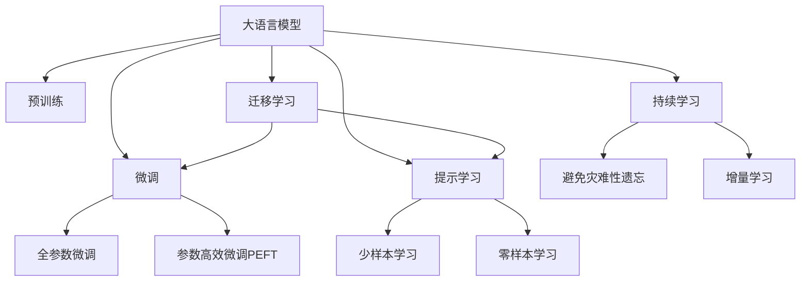

                 

# LLM的半监督学习数据利用策略

> 关键词：大语言模型(Large Language Model, LLM), 半监督学习(Semi-supervised Learning), 数据增强(Data Augmentation), 转移学习(Transfer Learning), 对抗训练(Adversarial Training), 自监督学习(Self-supervised Learning), 无监督学习(Unsupervised Learning)

## 1. 背景介绍

### 1.1 问题由来

在当前深度学习研究中，大语言模型（Large Language Model, LLM）已经成为了热门的研究方向。由于大规模的预训练，这些模型在各种自然语言处理（NLP）任务上取得了显著的进步。然而，大语言模型通常需要大量的标注数据才能在特定任务上进行微调，这对于某些任务来说可能会非常昂贵且耗时。例如，在医疗、金融等垂直领域，获取高质量的标注数据可能非常困难。

为了解决这个问题，研究人员开始探索在大模型预训练的基础上，如何利用更少且更廉价的半监督数据来进行微调。半监督学习（Semi-supervised Learning）是一种介于完全监督学习和完全无监督学习之间的学习方式，它可以利用少量标注数据与大量无标注数据共同训练模型，以提升模型的性能。

### 1.2 问题核心关键点

半监督学习在大模型微调中的应用，涉及到以下几个核心问题：

1. **数据获取**：如何高效、经济地获取高质量的标注数据。
2. **数据增强**：如何利用大规模无标注数据增强模型，提升模型性能。
3. **迁移学习**：如何将预训练模型知识迁移到特定任务上，避免从头开始训练。
4. **对抗训练**：如何利用对抗样本提高模型的鲁棒性。
5. **自监督学习**：如何利用预训练语言模型自身的自监督任务来提升模型。

这些问题的解决将极大促进大语言模型在特定任务上的应用，尤其是在资源有限的领域。

## 2. 核心概念与联系

### 2.1 核心概念概述

为更好地理解半监督学习在大模型微调中的应用，本节将介绍几个密切相关的核心概念：

- **大语言模型(Large Language Model, LLM)**：以自回归(如GPT)或自编码(如BERT)模型为代表的大规模预训练语言模型。通过在大规模无标签文本语料上进行预训练，学习通用的语言知识和常识。
- **半监督学习(Semi-supervised Learning)**：结合少量标注数据和大量无标注数据进行模型训练，以提升模型的泛化能力和性能。
- **数据增强(Data Augmentation)**：通过各种方法对无标注数据进行扩充，增加训练数据的多样性。
- **迁移学习(Transfer Learning)**：将预训练模型在特定任务上的知识迁移到新任务上，以减少标注数据需求。
- **对抗训练(Adversarial Training)**：在训练过程中加入对抗样本，增强模型的鲁棒性。
- **自监督学习(Self-supervised Learning)**：利用模型自身的预测任务进行训练，无需标注数据。
- **无监督学习(Unsupervised Learning)**：完全利用无标注数据进行模型训练。

这些概念之间的逻辑关系可以通过以下Mermaid流程图来展示：



这个流程图展示了大语言模型的核心概念及其之间的关系：

1. 大语言模型通过预训练获得基础能力。
2. 微调是对预训练模型进行任务特定的优化，可以分为全参数微调和参数高效微调（PEFT）。
3. 提示学习是一种不更新模型参数的方法，可以实现少样本学习和零样本学习。
4. 迁移学习是连接预训练模型与下游任务的桥梁，可以通过微调或提示学习来实现。
5. 持续学习旨在使模型能够不断学习新知识，同时避免遗忘旧知识。

这些概念共同构成了大语言模型的学习和应用框架，使其能够在各种场景下发挥强大的语言理解和生成能力。通过理解这些核心概念，我们可以更好地把握大语言模型的工作原理和优化方向。

## 3. 核心算法原理 & 具体操作步骤
### 3.1 算法原理概述

半监督学习在大语言模型微调中的基本原理是利用少量标注数据与大量无标注数据共同训练模型，以提升模型的泛化能力和性能。具体而言，通过在大规模无标注数据上进行自监督学习，预训练模型可以学习到丰富的语言表示。然后，将预训练模型应用到特定任务上，通过少量标注数据进行微调，以适应该任务的特点。

形式化地，假设预训练模型为 $M_{\theta}$，其中 $\theta$ 为预训练得到的模型参数。给定下游任务 $T$ 的少量标注数据集 $D_s=\{(x_i, y_i)\}_{i=1}^n$，其中 $y_i$ 为任务标签，标注数据量 $n$ 远小于全标注数据量。在数据集 $D_s$ 上，通过半监督学习微调模型，得到新的模型参数 $\hat{\theta}$，使得模型在特定任务上的表现得到提升。

### 3.2 算法步骤详解

基于半监督学习的大语言模型微调一般包括以下几个关键步骤：

**Step 1: 准备预训练模型和数据集**
- 选择合适的预训练语言模型 $M_{\theta}$ 作为初始化参数，如 BERT、GPT 等。
- 准备下游任务 $T$ 的少量标注数据集 $D_s$ 和大量无标注数据集 $D_u$。

**Step 2: 添加任务适配层**
- 根据任务类型，在预训练模型顶层设计合适的输出层和损失函数。
- 对于分类任务，通常在顶层添加线性分类器和交叉熵损失函数。
- 对于生成任务，通常使用语言模型的解码器输出概率分布，并以负对数似然为损失函数。

**Step 3: 设置微调超参数**
- 选择合适的优化算法及其参数，如 AdamW、SGD 等，设置学习率、批大小、迭代轮数等。
- 设置正则化技术及强度，包括权重衰减、Dropout、Early Stopping 等。
- 确定冻结预训练参数的策略，如仅微调顶层，或全部参数都参与微调。

**Step 4: 执行半监督训练**
- 将训练集数据分批次输入模型，前向传播计算损失函数。
- 在无标注数据 $D_u$ 上应用自监督学习任务，如掩码语言模型、文本预测等。
- 在标注数据 $D_s$ 上进行有监督的微调，更新模型参数。
- 周期性在验证集上评估模型性能，根据性能指标决定是否触发 Early Stopping。
- 重复上述步骤直到满足预设的迭代轮数或 Early Stopping 条件。

**Step 5: 测试和部署**
- 在测试集上评估微调后模型 $M_{\hat{\theta}}$ 的性能，对比微调前后的精度提升。
- 使用微调后的模型对新样本进行推理预测，集成到实际的应用系统中。
- 持续收集新的数据，定期重新微调模型，以适应数据分布的变化。

以上是基于半监督学习微调大语言模型的一般流程。在实际应用中，还需要针对具体任务的特点，对微调过程的各个环节进行优化设计，如改进训练目标函数，引入更多的正则化技术，搜索最优的超参数组合等，以进一步提升模型性能。

### 3.3 算法优缺点

基于半监督学习的大语言模型微调方法具有以下优点：
1. 可以显著减少标注数据的需求，提高数据获取效率。
2. 可以利用大规模无标注数据进行增强，提升模型泛化能力。
3. 可以结合迁移学习，利用预训练模型知识减少微调风险。
4. 可以引入对抗训练，提高模型鲁棒性。

同时，该方法也存在一定的局限性：
1. 依赖高质量的无标注数据。无标注数据的噪声和偏置可能影响模型性能。
2. 微调过程中的自监督任务需要精心设计，以确保与下游任务的对齐。
3. 对抗训练和正则化可能抑制模型的某些特性，需要平衡使用。
4. 半监督学习的效果很大程度上依赖于标注数据的数量和质量，标注数据不足可能影响效果。

尽管存在这些局限性，但半监督学习在大语言模型微调中的应用仍然具有很大的潜力，特别是在数据稀缺的领域。

### 3.4 算法应用领域

基于半监督学习的大语言模型微调方法，已经在许多NLP任务上取得了良好的效果。以下是几个典型的应用领域：

- **问答系统**：在问答系统中，利用半监督学习可以显著提高模型的回答准确率和流畅度。通过对历史问答数据和无标注对话数据进行训练，模型可以更好地理解用户意图并生成恰当的回答。

- **文本摘要**：在文本摘要任务中，半监督学习可以结合无标注数据和少量标注数据进行训练，提升模型的摘要质量和多样性。通过对大量无标注文章和少量标注摘要数据进行训练，模型可以更好地抓取文章要点并生成摘要。

- **对话系统**：在对话系统中，半监督学习可以利用无标注对话数据和少量标注对话数据进行训练，提升模型的对话连贯性和多样性。通过对大量无标注对话数据进行自监督学习，结合少量标注对话数据进行微调，模型可以更好地生成自然流畅的对话。

- **文本分类**：在文本分类任务中，半监督学习可以结合少量标注数据和大量无标注数据进行训练，提升模型的分类精度和泛化能力。通过对大量无标注文本和少量标注文本进行训练，模型可以更好地学习文本分类规则。

- **命名实体识别**：在命名实体识别任务中，半监督学习可以结合少量标注数据和大量无标注数据进行训练，提升模型的实体识别精度和召回率。通过对大量无标注文本和少量标注实体数据进行训练，模型可以更好地识别文本中的实体。

除了上述这些经典任务外，半监督学习还被创新性地应用到更多场景中，如可控文本生成、常识推理、代码生成、数据增强等，为NLP技术带来了全新的突破。随着预训练模型和微调方法的不断进步，相信NLP技术将在更广阔的应用领域大放异彩。

## 4. 数学模型和公式 & 详细讲解  
### 4.1 数学模型构建

本节将使用数学语言对基于半监督学习的大语言模型微调过程进行更加严格的刻画。

记预训练语言模型为 $M_{\theta}$，其中 $\theta$ 为模型参数。假设微调任务的标注数据集为 $D_s=\{(x_i, y_i)\}_{i=1}^n$，其中 $x_i$ 为输入，$y_i$ 为标签。无标注数据集为 $D_u=\{(x_i, \cdot)\}_{i=1}^m$，其中 $x_i$ 为输入，$\cdot$ 表示无标注标签。

定义模型 $M_{\theta}$ 在数据样本 $(x,y)$ 上的损失函数为 $\ell(M_{\theta}(x),y)$，则在数据集 $D_s$ 上的经验风险为：

$$
\mathcal{L}_s(\theta) = \frac{1}{n}\sum_{i=1}^n \ell(M_{\theta}(x_i),y_i)
$$

在数据集 $D_u$ 上，通过自监督学习任务，定义自监督损失函数为 $\mathcal{L}_u(\theta)$。因此，半监督学习的损失函数为：

$$
\mathcal{L}_{semi}(\theta) = \mathcal{L}_s(\theta) + \alpha\mathcal{L}_u(\theta)
$$

其中 $\alpha$ 为自监督损失函数的权重系数。通过优化 $\mathcal{L}_{semi}(\theta)$ 来最小化半监督学习损失。

### 4.2 公式推导过程

以下我们以掩码语言模型(Masked Language Model, MLM)为例，推导自监督损失函数及其梯度的计算公式。

假设模型 $M_{\theta}$ 在输入 $x$ 上的输出为 $\hat{y}=M_{\theta}(x) \in [0,1]$，表示样本属于正类的概率。实际标签 $y \in \{0,1\}$。则掩码语言模型的自监督损失函数定义为：

$$
\mathcal{L}_{MLM}(\theta) = -\frac{1}{|D_u|}\sum_{x_i \in D_u} \sum_{j=1}^{n} \log P(y_j | x_i, \hat{y}_j)
$$

其中 $y_j$ 为掩码位置 $j$ 处的真实标签，$\hat{y}_j$ 为掩码位置 $j$ 处的预测标签。通过反向传播计算梯度：

$$
\frac{\partial \mathcal{L}_{MLM}(\theta)}{\partial \theta} = -\frac{1}{|D_u|}\sum_{x_i \in D_u} \sum_{j=1}^{n} \frac{\partial \log P(y_j | x_i, \hat{y}_j)}{\partial \theta}
$$

根据链式法则，对每个掩码位置计算梯度：

$$
\frac{\partial \log P(y_j | x_i, \hat{y}_j)}{\partial \theta} = \frac{1}{|D_u|}\sum_{x_i \in D_u} \frac{1}{Z(x_i)} \sum_{k=1}^{n} \left[\hat{y}_k \cdot \frac{\partial P(y_j | x_i, \hat{y}_k)}{\partial \theta} + (1-\hat{y}_k) \cdot \frac{\partial P(y_j | x_i, 1-\hat{y}_k)}{\partial \theta}\right]
$$

其中 $Z(x_i)$ 为归一化因子，用于将概率分布归一化。通过梯度计算，可以更新模型参数 $\theta$。

## 5. 项目实践：代码实例和详细解释说明
### 5.1 开发环境搭建

在进行半监督学习实践前，我们需要准备好开发环境。以下是使用Python进行PyTorch开发的环境配置流程：

1. 安装Anaconda：从官网下载并安装Anaconda，用于创建独立的Python环境。

2. 创建并激活虚拟环境：
```bash
conda create -n pytorch-env python=3.8 
conda activate pytorch-env
```

3. 安装PyTorch：根据CUDA版本，从官网获取对应的安装命令。例如：
```bash
conda install pytorch torchvision torchaudio cudatoolkit=11.1 -c pytorch -c conda-forge
```

4. 安装Transformers库：
```bash
pip install transformers
```

5. 安装各类工具包：
```bash
pip install numpy pandas scikit-learn matplotlib tqdm jupyter notebook ipython
```

完成上述步骤后，即可在`pytorch-env`环境中开始半监督学习实践。

### 5.2 源代码详细实现

这里我们以命名实体识别(NER)任务为例，给出使用Transformers库对BERT模型进行半监督微调的PyTorch代码实现。

首先，定义NER任务的数据处理函数：

```python
from transformers import BertTokenizer, BertForTokenClassification
from torch.utils.data import Dataset, DataLoader
import torch

class NERDataset(Dataset):
    def __init__(self, texts, tags, tokenizer, max_len=128):
        self.texts = texts
        self.tags = tags
        self.tokenizer = tokenizer
        self.max_len = max_len
        
    def __len__(self):
        return len(self.texts)
    
    def __getitem__(self, item):
        text = self.texts[item]
        tags = self.tags[item]
        
        encoding = self.tokenizer(text, return_tensors='pt', max_length=self.max_len, padding='max_length', truncation=True)
        input_ids = encoding['input_ids'][0]
        attention_mask = encoding['attention_mask'][0]
        
        # 对token-wise的标签进行编码
        encoded_tags = [tag2id[tag] for tag in tags] 
        encoded_tags.extend([tag2id['O']] * (self.max_len - len(encoded_tags)))
        labels = torch.tensor(encoded_tags, dtype=torch.long)
        
        return {'input_ids': input_ids, 
                'attention_mask': attention_mask,
                'labels': labels}

# 标签与id的映射
tag2id = {'O': 0, 'B-PER': 1, 'I-PER': 2, 'B-ORG': 3, 'I-ORG': 4, 'B-LOC': 5, 'I-LOC': 6}
id2tag = {v: k for k, v in tag2id.items()}

# 创建dataset
tokenizer = BertTokenizer.from_pretrained('bert-base-cased')

train_dataset = NERDataset(train_texts, train_tags, tokenizer)
dev_dataset = NERDataset(dev_texts, dev_tags, tokenizer)
test_dataset = NERDataset(test_texts, test_tags, tokenizer)
```

然后，定义模型和优化器：

```python
from transformers import BertForTokenClassification, AdamW

model = BertForTokenClassification.from_pretrained('bert-base-cased', num_labels=len(tag2id))

optimizer = AdamW(model.parameters(), lr=2e-5)
```

接着，定义训练和评估函数：

```python
from sklearn.metrics import classification_report

device = torch.device('cuda') if torch.cuda.is_available() else torch.device('cpu')
model.to(device)

def train_epoch(model, dataset, batch_size, optimizer, unlabeled_data_path):
    dataloader = DataLoader(dataset, batch_size=batch_size, shuffle=True)
    model.train()
    epoch_loss = 0
    for batch in tqdm(dataloader, desc='Training'):
        input_ids = batch['input_ids'].to(device)
        attention_mask = batch['attention_mask'].to(device)
        labels = batch['labels'].to(device)
        model.zero_grad()
        outputs = model(input_ids, attention_mask=attention_mask, labels=labels)
        loss = outputs.loss
        epoch_loss += loss.item()
        loss.backward()
        optimizer.step()
    
    # 在无标注数据上应用自监督学习
    unlabeled_data_loader = DataLoader(UnlabeledDataLoader(unlabeled_data_path, tokenizer, model, batch_size), batch_size=batch_size, shuffle=True)
    model.eval()
    unlabeled_loss = 0
    for batch in tqdm(unlabeled_data_loader, desc='Unsupervised'):
        input_ids = batch['input_ids'].to(device)
        attention_mask = batch['attention_mask'].to(device)
        with torch.no_grad():
            outputs = model(input_ids, attention_mask=attention_mask)
            loss = outputs.loss
            unlabeled_loss += loss.item()
    
    return epoch_loss / len(dataloader), unlabeled_loss / len(unlabeled_data_loader)
    
def evaluate(model, dataset, batch_size):
    dataloader = DataLoader(dataset, batch_size=batch_size)
    model.eval()
    preds, labels = [], []
    with torch.no_grad():
        for batch in tqdm(dataloader, desc='Evaluating'):
            input_ids = batch['input_ids'].to(device)
            attention_mask = batch['attention_mask'].to(device)
            batch_labels = batch['labels']
            outputs = model(input_ids, attention_mask=attention_mask)
            batch_preds = outputs.logits.argmax(dim=2).to('cpu').tolist()
            batch_labels = batch_labels.to('cpu').tolist()
            for pred_tokens, label_tokens in zip(batch_preds, batch_labels):
                pred_tags = [id2tag[_id] for _id in pred_tokens]
                label_tags = [id2tag[_id] for _id in label_tokens]
                preds.append(pred_tags[:len(label_tags)])
                labels.append(label_tags)
                
    print(classification_report(labels, preds))
```

最后，启动训练流程并在测试集上评估：

```python
epochs = 5
batch_size = 16
unlabeled_data_path = 'unlabeled_data.txt'

for epoch in range(epochs):
    train_loss, unlabeled_loss = train_epoch(model, train_dataset, batch_size, optimizer, unlabeled_data_path)
    print(f"Epoch {epoch+1}, train loss: {train_loss:.3f}, unsupervised loss: {unlabeled_loss:.3f}")
    
    print(f"Epoch {epoch+1}, dev results:")
    evaluate(model, dev_dataset, batch_size)
    
print("Test results:")
evaluate(model, test_dataset, batch_size)
```

以上就是使用PyTorch对BERT进行命名实体识别任务半监督微调的完整代码实现。可以看到，得益于Transformers库的强大封装，我们可以用相对简洁的代码完成BERT模型的加载和半监督微调。

### 5.3 代码解读与分析

让我们再详细解读一下关键代码的实现细节：

**NERDataset类**：
- `__init__`方法：初始化文本、标签、分词器等关键组件。
- `__len__`方法：返回数据集的样本数量。
- `__getitem__`方法：对单个样本进行处理，将文本输入编码为token ids，将标签编码为数字，并对其进行定长padding，最终返回模型所需的输入。

**tag2id和id2tag字典**：
- 定义了标签与数字id之间的映射关系，用于将token-wise的预测结果解码回真实的标签。

**训练和评估函数**：
- 使用PyTorch的DataLoader对数据集进行批次化加载，供模型训练和推理使用。
- 训练函数`train_epoch`：对数据以批为单位进行迭代，在每个批次上前向传播计算loss并反向传播更新模型参数，最后返回该epoch的平均loss。同时，在无标注数据上进行自监督学习，计算无监督损失。
- 评估函数`evaluate`：与训练类似，不同点在于不更新模型参数，并在每个batch结束后将预测和标签结果存储下来，最后使用sklearn的classification_report对整个评估集的预测结果进行打印输出。

**训练流程**：
- 定义总的epoch数和batch size，开始循环迭代
- 每个epoch内，先在标注数据集上进行训练，输出平均loss
- 在无标注数据集上进行自监督学习，输出平均无监督loss
- 所有epoch结束后，在验证集和测试集上评估，给出最终测试结果

可以看到，PyTorch配合Transformers库使得BERT半监督微调的代码实现变得简洁高效。开发者可以将更多精力放在数据处理、模型改进等高层逻辑上，而不必过多关注底层的实现细节。

当然，工业级的系统实现还需考虑更多因素，如模型的保存和部署、超参数的自动搜索、更灵活的任务适配层等。但核心的微调范式基本与此类似。

## 6. 实际应用场景
### 6.1 智能客服系统

基于大语言模型半监督学习的数据利用策略，可以广泛应用于智能客服系统的构建。传统客服往往需要配备大量人力，高峰期响应缓慢，且一致性和专业性难以保证。使用半监督学习策略，可以利用大量无标注的客服对话数据进行增强，提升模型的对话理解和生成能力。

在技术实现上，可以收集企业内部的历史客服对话记录，将问题和最佳答复构建成监督数据，在此基础上对预训练对话模型进行微调。半监督学习可以进一步利用无标注对话数据进行自监督学习，增强模型的泛化能力。微调后的对话模型能够自动理解用户意图，匹配最合适的答案模板进行回复。对于客户提出的新问题，还可以接入检索系统实时搜索相关内容，动态组织生成回答。如此构建的智能客服系统，能大幅提升客户咨询体验和问题解决效率。

### 6.2 金融舆情监测

金融机构需要实时监测市场舆论动向，以便及时应对负面信息传播，规避金融风险。传统的人工监测方式成本高、效率低，难以应对网络时代海量信息爆发的挑战。利用半监督学习策略，可以收集金融领域相关的新闻、报道、评论等文本数据，并对其进行主题标注和情感标注。在此基础上对预训练语言模型进行微调，使其能够自动判断文本属于何种主题，情感倾向是正面、中性还是负面。将半监督学习策略应用于实时抓取的网络文本数据，就能够自动监测不同主题下的情感变化趋势，一旦发现负面信息激增等异常情况，系统便会自动预警，帮助金融机构快速应对潜在风险。

### 6.3 个性化推荐系统

当前的推荐系统往往只依赖用户的历史行为数据进行物品推荐，无法深入理解用户的真实兴趣偏好。利用半监督学习策略，个性化推荐系统可以更好地挖掘用户行为背后的语义信息，从而提供更精准、多样的推荐内容。

在实践中，可以收集用户浏览、点击、评论、分享等行为数据，提取和用户交互的物品标题、描述、标签等文本内容。将文本内容作为模型输入，用户的后续行为（如是否点击、购买等）作为监督信号，在此基础上微调预训练语言模型。半监督学习可以进一步利用无标注文本数据进行自监督学习，增强模型的泛化能力。微调后的模型能够从文本内容中准确把握用户的兴趣点。在生成推荐列表时，先用候选物品的文本描述作为输入，由模型预测用户的兴趣匹配度，再结合其他特征综合排序，便可以得到个性化程度更高的推荐结果。

### 6.4 未来应用展望

随着半监督学习策略和大语言模型微调技术的不断发展，基于半监督学习范式将在更多领域得到应用，为传统行业带来变革性影响。

在智慧医疗领域，利用半监督学习策略进行问答、病历分析、药物研发等应用，提升医疗服务的智能化水平，辅助医生诊疗，加速新药开发进程。

在智能教育领域，半监督学习可以应用于作业批改、学情分析、知识推荐等方面，因材施教，促进教育公平，提高教学质量。

在智慧城市治理中，半监督学习可以应用于城市事件监测、舆情分析、应急指挥等环节，提高城市管理的自动化和智能化水平，构建更安全、高效的未来城市。

此外，在企业生产、社会治理、文娱传媒等众多领域，基于半监督学习策略的AI应用也将不断涌现，为经济社会发展注入新的动力。相信随着技术的日益成熟，半监督学习策略必将在构建人机协同的智能系统方面发挥越来越重要的作用。

## 7. 工具和资源推荐
### 7.1 学习资源推荐

为了帮助开发者系统掌握大语言模型微调的理论基础和实践技巧，这里推荐一些优质的学习资源：

1. 《Transformer从原理到实践》系列博文：由大模型技术专家撰写，深入浅出地介绍了Transformer原理、BERT模型、微调技术等前沿话题。

2. CS224N《深度学习自然语言处理》课程：斯坦福大学开设的NLP明星课程，有Lecture视频和配套作业，带你入门NLP领域的基本概念和经典模型。

3. 《Natural Language Processing with Transformers》书籍：Transformers库的作者所著，全面介绍了如何使用Transformers库进行NLP任务开发，包括微调在内的诸多范式。

4. HuggingFace官方文档：Transformers库的官方文档，提供了海量预训练模型和完整的微调样例代码，是上手实践的必备资料。

5. CLUE开源项目：中文语言理解测评基准，涵盖大量不同类型的中文NLP数据集，并提供了基于半监督微调的baseline模型，助力中文NLP技术发展。

通过对这些资源的学习实践，相信你一定能够快速掌握大语言模型半监督微调的精髓，并用于解决实际的NLP问题。
###  7.2 开发工具推荐

高效的开发离不开优秀的工具支持。以下是几款用于大语言模型半监督微调开发的常用工具：

1. PyTorch：基于Python的开源深度学习框架，灵活动态的计算图，适合快速迭代研究。大部分预训练语言模型都有PyTorch版本的实现。

2. TensorFlow：由Google主导开发的开源深度学习框架，生产部署方便，适合大规模工程应用。同样有丰富的预训练语言模型资源。

3. Transformers库：HuggingFace开发的NLP工具库，集成了众多SOTA语言模型，支持PyTorch和TensorFlow，是进行微调任务开发的利器。

4. Weights & Biases：模型训练的实验跟踪工具，可以记录和可视化模型训练过程中的各项指标，方便对比和调优。与主流深度学习框架无缝集成。

5. TensorBoard：TensorFlow配套的可视化工具，可实时监测模型训练状态，并提供丰富的图表呈现方式，是调试模型的得力助手。

6. Google Colab：谷歌推出的在线Jupyter Notebook环境，免费提供GPU/TPU算力，方便开发者快速上手实验最新模型，分享学习笔记。

合理利用这些工具，可以显著提升大语言模型半监督微调任务的开发效率，加快创新迭代的步伐。

### 7.3 相关论文推荐

大语言模型和半监督学习的发展源于学界的持续研究。以下是几篇奠基性的相关论文，推荐阅读：

1. Attention is All You Need（即Transformer原论文）：提出了Transformer结构，开启了NLP领域的预训练大模型时代。

2. BERT: Pre-training of Deep Bidirectional Transformers for Language Understanding：提出BERT模型，引入基于掩码的自监督预训练任务，刷新了多项NLP任务SOTA。

3. Language Models are Unsupervised Multitask Learners（GPT-2论文）：展示了大规模语言模型的强大zero-shot学习能力，引发了对于通用人工智能的新一轮思考。

4. Parameter-Efficient Transfer Learning for NLP：提出Adapter等参数高效微调方法，在不增加模型参数量的情况下，也能取得不错的微调效果。

5. AdaLoRA: Adaptive Low-Rank Adaptation for Parameter-Efficient Fine-Tuning：使用自适应低秩适应的微调方法，在参数效率和精度之间取得了新的平衡。

6. Premier: Adaptive Incremental Model Training by Online Knowledge Distillation：提出了在线知识蒸馏方法，可以在增量学习中动态适应新任务。

这些论文代表了大语言模型半监督微调技术的发展脉络。通过学习这些前沿成果，可以帮助研究者把握学科前进方向，激发更多的创新灵感。

## 8. 总结：未来发展趋势与挑战

### 8.1 总结

本文对基于半监督学习的大语言模型微调方法进行了全面系统的介绍。首先阐述了半监督学习在大模型微调中的应用背景和意义，明确了半监督学习在减少标注数据需求方面的独特价值。其次，从原理到实践，详细讲解了半监督学习的数学原理和关键步骤，给出了半监督学习任务开发的完整代码实例。同时，本文还广泛探讨了半监督学习方法在智能客服、金融舆情、个性化推荐等多个行业领域的应用前景，展示了半监督学习范式的巨大潜力。此外，本文精选了半监督学习技术的各类学习资源，力求为读者提供全方位的技术指引。

通过本文的系统梳理，可以看到，基于半监督学习的大语言模型微调方法正在成为NLP领域的重要范式，极大地拓展了预训练语言模型的应用边界，催生了更多的落地场景。得益于大规模语料的预训练和半监督学习策略，半监督学习范式在大模型微调中展现了强大的生命力，为NLP技术在更广阔的应用领域大放异彩提供了坚实的基础。未来，伴随半监督学习策略和微调方法的不断进步，相信NLP技术将在更多领域得到应用，为传统行业带来变革性影响。

### 8.2 未来发展趋势

展望未来，大语言模型半监督学习的数据利用策略将呈现以下几个发展趋势：

1. 模型规模持续增大。随着算力成本的下降和数据规模的扩张，预训练语言模型的参数量还将持续增长。超大规模语言模型蕴含的丰富语言知识，有望支撑更加复杂多变的下游任务半监督学习。

2. 半监督方法日趋多样。除了传统的半监督方法外，未来会涌现更多半监督学习策略，如自监督学习、半监督自监督学习、自适应增量学习等，在节省计算资源的同时也能保证模型性能。

3. 持续学习成为常态。随着数据分布的不断变化，半监督学习模型也需要持续学习新知识以保持性能。如何在不遗忘原有知识的同时，高效吸收新样本信息，将是重要的研究课题。

4. 数据增强策略优化。数据增强在半监督学习中起着关键作用，未来的数据增强策略将更加智能化，能够更好地利用无标注数据进行增强。

5. 对抗训练和正则化优化。对抗训练和正则化技术在半监督学习中也有着重要作用，未来的研究将更加深入，以提高模型的泛化能力和鲁棒性。

6. 知识整合能力增强。未来的半监督学习模型将能够更好地与外部知识库、规则库等专家知识结合，形成更加全面、准确的信息整合能力。

以上趋势凸显了半监督学习策略在大语言模型微调中的广阔前景。这些方向的探索发展，必将进一步提升NLP系统的性能和应用范围，为人类认知智能的进化带来深远影响。

### 8.3 面临的挑战

尽管大语言模型半监督学习的数据利用策略已经取得了显著进展，但在迈向更加智能化、普适化应用的过程中，它仍面临着诸多挑战：

1. 标注成本瓶颈。虽然半监督学习可以显著减少标注数据的需求，但对于某些任务，获取高质量的标注数据仍然是一个挑战。如何进一步降低半监督学习对标注数据的依赖，将是一大难题。

2. 模型鲁棒性不足。半监督学习模型在面对域外数据时，泛化性能往往大打折扣。对于测试样本的微小扰动，模型容易出现偏差。如何提高模型的鲁棒性，避免灾难性遗忘，还需要更多理论和实践的积累。

3. 推理效率有待提高。虽然半监督学习模型精度较高，但在实际部署时往往面临推理速度慢、内存占用大等效率问题。如何在保证性能的同时，简化模型结构，提升推理速度，优化资源占用，将是重要的优化方向。

4. 可解释性亟需加强。当前半监督学习模型通常缺乏可解释性，难以解释其内部工作机制和决策逻辑。对于医疗、金融等高风险应用，算法的可解释性和可审计性尤为重要。如何赋予半监督学习模型更强的可解释性，将是亟待攻克的难题。

5. 安全性有待保障。半监督学习模型可能学习到有害信息，通过微调传递到下游任务，产生误导性、歧视性的输出，给实际应用带来安全隐患。如何从数据和算法层面消除模型偏见，避免恶意用途，确保输出的安全性，也将是重要的研究课题。

6. 知识整合能力不足。现有的半监督学习模型往往局限于任务内数据，难以灵活吸收和运用更广泛的先验知识。如何让半监督学习过程更好地与外部知识库、规则库等专家知识结合，形成更加全面、准确的信息整合能力，还有很大的想象空间。

正视半监督学习面临的这些挑战，积极应对并寻求突破，将是大语言模型半监督学习走向成熟的必由之路。相信随着学界和产业界的共同努力，这些挑战终将一一被克服，大语言模型半监督学习必将在构建安全、可靠、可解释、可控的智能系统方面发挥越来越重要的作用。

### 8.4 研究展望

面对大语言模型半监督学习所面临的挑战，未来的研究需要在以下几个方面寻求新的突破：

1. 探索无监督和半监督微调方法。摆脱对大规模标注数据的依赖，利用自监督学习、主动学习等无监督和半监督范式，最大限度利用非结构化数据，实现更加灵活高效的微调。

2. 研究参数高效和计算高效的微调范式。开发更加参数高效的微调方法，在固定大部分预训练参数的同时，只更新极少量的任务相关参数。同时优化微调模型的计算图，减少前向传播和反向传播的资源消耗，实现更加轻量级、实时性的部署。

3. 融合因果和对比学习范式。通过引入因果推断和对比学习思想，增强半监督学习模型建立稳定因果关系的能力，学习更加普适、鲁棒的语言表征，从而提升模型泛化性和抗干扰能力。

4. 引入更多先验知识。将符号化的先验知识，如知识图谱、逻辑规则等，与神经网络模型进行巧妙融合，引导半监督学习过程学习更准确、合理的语言模型。同时加强不同模态数据的整合，实现视觉、语音等多模态信息与文本信息的协同建模。

5. 结合因果分析和博弈论工具。将因果分析方法引入半监督学习模型，识别出模型决策的关键特征，增强输出解释的因果性和逻辑性。借助博弈论工具刻画人机交互过程，主动探索并规避模型的脆弱点，提高系统稳定性。

6. 纳入伦理道德约束。在模型训练目标中引入伦理导向的评估指标，过滤和惩罚有偏见、有害的输出倾向。同时加强人工干预和审核，建立模型行为的监管机制，确保输出符合人类价值观和伦理道德。

这些研究方向的探索，必将引领大语言模型半监督学习的数据利用策略迈向更高的台阶，为构建安全、可靠、可解释、可控的智能系统铺平道路。面向未来，大语言模型半监督学习的数据利用策略还需要与其他人工智能技术进行更深入的融合，如知识表示、因果推理、强化学习等，多路径协同发力，共同推动自然语言理解和智能交互系统的进步。只有勇于创新、敢于突破，才能不断拓展语言模型的边界，让智能技术更好地造福人类社会。

## 9. 附录：常见问题与解答
**Q1：半监督学习能否替代监督学习？**

A: 半监督学习可以显著减少标注数据的需求，但在某些任务上，监督学习仍然是不可替代的。半监督学习适用于数据分布相对均匀、标注成本较高的任务，而监督学习适用于数据分布不均匀、标注成本较低的任务。需要根据具体任务的特点，选择适合的微调方法。

**Q2：半监督学习在微调过程中如何设置超参数？**

A: 半监督学习需要设置自监督损失函数的权重系数 $\alpha$，一般建议从1e-3开始调参，逐步减小学习率，直至收敛。同时，需要在验证集上验证模型性能，选择最优的超参数组合。

**Q3：半监督学习过程中如何避免过拟合？**

A: 半监督学习过程中，需要引入正则化技术，如L2正则、Dropout、Early Stopping等，以防止模型过度适应无标注数据。此外，可以通过数据增强策略，如回译、近义替换等方式，增加训练集的多样性，避免模型过拟合。

**Q4：半监督学习模型在部署时需要注意哪些问题？**

A: 将半监督学习模型转化为实际应用，还需要考虑以下因素：
1. 模型裁剪：去除不必要的层和参数，减小模型尺寸，加快推理速度。
2. 量化加速：将浮点模型转为定点模型，压缩存储空间，提高计算效率。
3. 服务化封装：将模型封装为标准化服务接口，便于集成调用。
4. 弹性伸缩：根据请求流量动态调整资源配置，平衡服务质量和成本。
5. 监控告警：实时采集系统指标，设置异常告警阈值，确保服务稳定性。
6. 安全防护：采用访问鉴权、数据脱敏等措施，保障数据和模型安全。

半监督学习模型为NLP应用开启了广阔的想象空间，但如何将强大的性能转化为稳定、高效、安全的业务价值，还需要工程实践的不断打磨。唯有从数据、算法、工程、业务等多个维度协同发力，才能真正实现人工智能技术在垂直行业的规模化落地。总之，半监督学习需要开发者根据具体任务，不断迭代和优化模型、数据和算法，方能得到理想的效果。

---

作者：禅与计算机程序设计艺术 / Zen and the Art of Computer Programming

