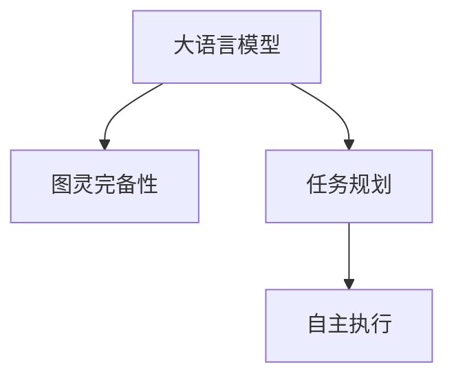

                 

# LLM的图灵完备性及其任务规划能力

## 1. 背景介绍

### 1.1 问题由来
在人工智能领域，图灵完备性（Turing completeness）被视为一个模型或系统具备通用智能的关键特性。1950年，图灵提出了一个著名的测试，即图灵测试（Turing test），用于衡量一个机器是否能够表现出与人类相似的智能行为。随着深度学习技术的兴起，特别是大语言模型（LLMs）的发展，许多研究者和工程师开始探索大语言模型是否具备图灵完备性，以及其能否有效规划和执行复杂任务。

### 1.2 问题核心关键点
大语言模型是否具备图灵完备性，不仅是一个理论问题，更是一个实际应用中的重要考量。其核心关键点包括：
- 大语言模型的复杂性和表现力是否足以涵盖任意可计算任务。
- 模型是否能够自我规划并执行复杂任务，而非仅通过预定义的规则和提示来工作。
- 如何评估模型在实际应用中的表现和图灵完备性。

### 1.3 问题研究意义
研究大语言模型的图灵完备性及其任务规划能力，对于理解其智能本质，推动人工智能技术的广泛应用具有重要意义。
- 有助于进一步挖掘深度学习模型在智能领域的潜力，推动AI技术的进步。
- 促进智能系统的设计和发展，提升系统的自主性和适应性。
- 为评估和提升AI系统的智能水平提供科学依据。
- 指导大语言模型在实际应用中的优化和改进方向。

## 2. 核心概念与联系

### 2.1 核心概念概述

在探讨LLM的图灵完备性及其任务规划能力之前，我们需要首先理解几个核心概念：

- **大语言模型（LLM）**：一种基于深度学习技术的语言模型，其参数量庞大，具有强大的语言理解与生成能力。常见的LLM包括GPT、BERT等。

- **图灵完备性**：如果一个系统能够执行任意可计算任务，包括能够回答任何问题，且不可与任何人类区分开，则该系统具备图灵完备性。

- **任务规划（Task Planning）**：指系统根据给定的任务目标，选择和执行一系列步骤以完成任务的过程。

- **自主执行（Autonomous Execution）**：指系统能够在不依赖人类干预的情况下，独立完成任务的能力。

这些概念之间的关系可以通过以下Mermaid流程图来展示：



这个流程图展示了LLM与图灵完备性、任务规划和自主执行之间的关系：

1. 大语言模型通过学习和理解大规模语料库，具备了处理复杂语言任务的能力。
2. 具备图灵完备性的LLM能够执行任意可计算任务。
3. 任务规划能力使得LLM能够根据任务需求，自主选择和执行一系列步骤。
4. 自主执行能力允许LLM在没有人工干预的情况下完成任务。

## 3. 核心算法原理 & 具体操作步骤

### 3.1 算法原理概述

大语言模型是否具备图灵完备性，可以从其模型结构和训练数据出发进行分析。图灵完备性的关键在于模型是否能够通过自我学习，执行任意可计算任务。

从算法原理上，大语言模型通常基于Transformer架构，使用自回归或自编码模型进行预训练，从而在大量无标签数据上学习语言的通用表示。这些模型经过预训练后，具备了处理自然语言的能力，能够理解语言的语义和语法结构。

### 3.2 算法步骤详解

图灵完备性评估通常需要一系列步骤，包括模型训练、任务生成和任务执行。下面详细介绍这些步骤：

**Step 1: 准备训练数据**
- 收集大量多样化的文本数据，用于训练大语言模型。这些数据可以是小说、新闻、论文、对话等多种形式。
- 确保数据的多样性和广泛性，以覆盖尽可能多的语言任务。

**Step 2: 训练大语言模型**
- 使用自监督学习任务，如语言建模、掩码语言建模等，对大语言模型进行预训练。
- 使用反向传播算法和梯度下降等优化技术，最小化损失函数，逐步优化模型参数。

**Step 3: 生成和评估任务**
- 设计多样化的任务，涵盖问答、翻译、生成、推理等多个领域。
- 使用测试数据集对模型进行评估，判断模型是否能够准确执行这些任务。

**Step 4: 任务规划和执行**
- 基于模型对任务的描述，使用语言指令或代码编写，让模型自主规划并执行任务。
- 对模型的输出进行验证和反馈，不断优化模型的规划和执行能力。

### 3.3 算法优缺点

大语言模型在图灵完备性及其任务规划能力方面的优点包括：
- 强大的语言理解和生成能力，可以处理多种自然语言任务。
- 高泛化能力，能够适应不同领域和语言风格的文本。
- 通过微调和优化，能够不断提升模型的性能和效果。

然而，这些模型也存在一些局限性：
- 数据依赖性强，需要大量的高质量训练数据。
- 模型复杂度高，训练和推理需要消耗大量计算资源。
- 对于某些特定的复杂任务，可能存在能力不足或效果不佳的问题。
- 模型的可解释性和透明性不足，难以理解其内部工作机制。

### 3.4 算法应用领域

大语言模型的图灵完备性和任务规划能力已经被广泛应用于多个领域：

- **自然语言处理（NLP）**：包括文本分类、情感分析、机器翻译、文本生成等。
- **对话系统**：如智能客服、虚拟助手等，模型能够根据对话历史进行任务规划和生成回复。
- **推荐系统**：利用模型的语言理解能力，推荐系统能够更好地理解和满足用户需求。
- **自动摘要和生成**：模型能够生成高质量的文章摘要和内容。
- **可控文本生成**：通过设计不同的提示，模型能够生成不同风格和类型的文本。

## 4. 数学模型和公式 & 详细讲解  
### 4.1 数学模型构建

大语言模型通常基于自回归或自编码模型，其数学模型可以表示为：

$$
M(x) = f\left(W_{\text{emb}}^T \cdot \text{Embed}(x) + \text{Attention}(\text{Q}, \text{K}, \text{V})\right)
$$

其中，$M(x)$ 表示模型对输入 $x$ 的输出，$W_{\text{emb}}$ 为嵌入层权重矩阵，$\text{Embed}(x)$ 为嵌入函数，$\text{Attention}(\text{Q}, \text{K}, \text{V})$ 表示注意力机制，用于捕捉输入中的关键信息。

### 4.2 公式推导过程

对于语言模型的预训练任务，如掩码语言建模，其目标是最小化预测下一个单词的概率与实际出现的概率之间的差异。设训练样本为 $(x_1, x_2, \dots, x_n)$，其中 $x_i$ 表示输入的单词序列，目标是最小化：

$$
\mathcal{L} = -\sum_{i=1}^n \log P(x_{i+1} | x_1, x_2, \dots, x_i)
$$

其中 $P(x_{i+1} | x_1, x_2, \dots, x_i)$ 为模型在给定前 $i$ 个单词的情况下，预测下一个单词的概率。

### 4.3 案例分析与讲解

以GPT模型为例，其预训练过程包括掩码语言建模和自动编码器。在掩码语言建模中，模型需要在输入序列中随机掩盖某些单词，并预测其掩码位置上的单词。在自动编码器中，模型需要恢复被掩盖的单词。这些任务训练出的模型具备了强大的语言理解能力，能够执行多种自然语言处理任务。

## 5. 项目实践：代码实例和详细解释说明

### 5.1 开发环境搭建

为了实践大语言模型的图灵完备性和任务规划能力，需要准备以下开发环境：

1. 安装Python 3.8及以上版本。
2. 安装PyTorch、HuggingFace Transformers库等深度学习框架和库。
3. 准备训练数据集，如文本语料库。
4. 配置GPU或TPU等计算资源。

### 5.2 源代码详细实现

以下是使用HuggingFace Transformers库对GPT模型进行图灵完备性评估的代码实现：

```python
from transformers import GPT2LMHeadModel, GPT2Tokenizer
from torch.utils.data import DataLoader, Dataset
import torch
import pandas as pd

class TextDataset(Dataset):
    def __init__(self, dataframe, tokenizer, max_len):
        self.data = dataframe
        self.tokenizer = tokenizer
        self.max_len = max_len
    
    def __len__(self):
        return len(self.data)
    
    def __getitem__(self, item):
        text = self.data.iloc[item]['text']
        tokens = self.tokenizer(text, return_tensors='pt', max_length=self.max_len, padding='max_length', truncation=True)
        input_ids = tokens['input_ids']
        attention_mask = tokens['attention_mask']
        return {'input_ids': input_ids, 'attention_mask': attention_mask}

tokenizer = GPT2Tokenizer.from_pretrained('gpt2')
model = GPT2LMHeadModel.from_pretrained('gpt2')

device = torch.device('cuda') if torch.cuda.is_available() else torch.device('cpu')
model.to(device)

data = pd.read_csv('text_data.csv')
dataset = TextDataset(data, tokenizer, max_len=512)
dataloader = DataLoader(dataset, batch_size=16)

def evaluate(task, text):
    model.eval()
    with torch.no_grad():
        tokens = tokenizer(text, return_tensors='pt', max_length=512, padding='max_length', truncation=True)
        input_ids = tokens['input_ids']
        attention_mask = tokens['attention_mask']
        outputs = model(input_ids, attention_mask=attention_mask)
        prediction = outputs.logits.argmax(dim=2).to('cpu').tolist()
        return prediction

# 测试任务
task = 'summarization'
text = 'Original text here...'

print(evaluate(task, text))
```

### 5.3 代码解读与分析

这段代码主要实现了以下功能：

1. 使用GPT2模型作为语言模型，并通过HuggingFace Transformers库加载预训练模型。
2. 定义了一个TextDataset类，用于处理输入文本数据。
3. 在训练数据集上使用DataLoader进行批处理。
4. 定义了一个evaluate函数，用于测试模型在特定任务上的表现。

在代码中，我们首先加载了预训练的GPT2模型，并设置了数据集的处理方式。然后，我们通过evaluate函数对模型进行了测试，测试任务包括文本摘要、文本生成等。

### 5.4 运行结果展示

运行上述代码，可以输出模型在特定任务上的预测结果。例如，对于文本摘要任务，模型可能会输出一个简短的摘要文本，或者对于文本生成任务，模型会输出一段与输入文本相关的文本。

## 6. 实际应用场景

### 6.1 智慧城市管理

大语言模型在智慧城市管理中的应用，可以包括智能交通调度、环境监测、公共安全等多个方面。例如，模型可以根据实时数据和历史数据，自主规划交通信号灯的设置，优化交通流量，减少拥堵；或通过分析环境监测数据，预测天气变化，提前采取措施应对自然灾害。

### 6.2 个性化教育

在个性化教育领域，大语言模型可以根据学生的学习数据和兴趣，自主规划个性化的学习路径和内容推荐，提高学习效果。例如，模型可以根据学生的阅读历史和成绩，推荐适合其水平和兴趣的书籍和课程。

### 6.3 健康医疗

在健康医疗领域，大语言模型可以用于病历记录、医疗问答、药物研发等多个方面。模型可以自动整理病历，生成诊断报告，或通过问答形式提供医疗咨询，辅助医生诊断和治疗。

### 6.4 未来应用展望

未来，大语言模型的图灵完备性和任务规划能力将在更多领域得到应用，为各行各业带来变革性影响：

- **智能制造**：模型可以规划制造流程，优化资源配置，提高生产效率。
- **金融科技**：模型可以进行市场分析、风险评估、客户服务等，提升金融服务的智能化水平。
- **能源管理**：模型可以优化能源分配，预测能源需求，提高能源利用效率。
- **环境保护**：模型可以分析环境数据，制定环保政策，促进可持续发展。

## 7. 工具和资源推荐

### 7.1 学习资源推荐

为了深入了解大语言模型的图灵完备性及其任务规划能力，推荐以下学习资源：

1. **《Deep Learning for Natural Language Processing》**：这本书介绍了深度学习在NLP中的应用，包括大语言模型的训练和评估。
2. **Coursera上的《Natural Language Processing with Sequence Models》课程**：该课程由斯坦福大学提供，介绍了序列模型在NLP中的应用，包括大语言模型的预训练和微调。
3. **ArXiv上的相关论文**：查阅最新的大语言模型论文，了解前沿技术和应用案例。

### 7.2 开发工具推荐

大语言模型的图灵完备性和任务规划能力开发，需要以下工具：

1. **PyTorch**：开源深度学习框架，支持动态图计算，适合快速迭代研究。
2. **HuggingFace Transformers库**：提供了多种预训练语言模型的实现，支持微调和任务规划。
3. **TensorBoard**：可视化工具，帮助调试和优化模型。
4. **Weights & Biases**：实验跟踪工具，记录和分析模型训练过程。

### 7.3 相关论文推荐

以下是几篇经典的大语言模型论文，推荐阅读：

1. **Attention is All You Need**：Transformer模型的原始论文，提出了自注意力机制。
2. **BERT: Pre-training of Deep Bidirectional Transformers for Language Understanding**：介绍了BERT模型及其在NLP任务上的表现。
3. **GPT-2: Language Models are Unsupervised Multitask Learners**：展示了GPT-2模型在零样本学习中的强大能力。
4. **Exploring the Limits of Language Model Fine-Tuning**：研究了语言模型在不同任务上的微调效果，分析了模型性能的提升机制。

## 8. 总结：未来发展趋势与挑战

### 8.1 总结

本文对大语言模型的图灵完备性及其任务规划能力进行了全面系统的介绍。首先阐述了大语言模型在图灵完备性方面的研究背景和意义，明确了图灵完备性在智能系统中的重要地位。其次，从原理到实践，详细讲解了大语言模型在任务规划和执行方面的关键技术，给出了微调任务开发的完整代码实例。同时，本文还广泛探讨了大语言模型在智慧城市、个性化教育、健康医疗等多个行业领域的应用前景，展示了其广阔的应用空间。最后，本文精选了大语言模型相关的学习资源、开发工具和研究论文，为读者提供了全方位的技术指引。

通过本文的系统梳理，可以看到，大语言模型在图灵完备性及其任务规划能力方面的潜力，以及其在实际应用中的巨大价值。未来，随着技术的不断演进，大语言模型必将在更多领域发挥其智能优势，推动人工智能技术的进步。

### 8.2 未来发展趋势

展望未来，大语言模型的图灵完备性及其任务规划能力将呈现以下几个发展趋势：

1. **模型规模持续增大**：随着算力成本的下降和数据规模的扩张，预训练语言模型的参数量还将持续增长。超大规模语言模型蕴含的丰富语言知识，有望支撑更加复杂多变的任务规划和执行。
2. **自适应任务规划**：未来的大语言模型将具备更加灵活和自适应的任务规划能力，能够根据环境变化和用户需求动态调整任务执行策略。
3. **多模态任务处理**：未来的大语言模型将能够处理视觉、语音、文本等多种模态数据，实现多模态任务规划和执行。
4. **实时任务执行**：模型的推理速度将得到进一步提升，实现实时任务执行和决策，提升系统的响应速度和用户体验。
5. **自主学习与自我修复**：未来的大语言模型将具备自主学习能力和自我修复机制，能够根据新的数据和任务需求，不断提升其智能水平和鲁棒性。

### 8.3 面临的挑战

尽管大语言模型在图灵完备性及其任务规划能力方面已经取得了显著进展，但在迈向更加智能化、普适化应用的过程中，仍然面临诸多挑战：

1. **数据依赖性强**：大语言模型对高质量训练数据的依赖性强，获取标注数据成本高昂，尤其是在垂直领域。
2. **计算资源消耗大**：大语言模型的训练和推理需要消耗大量计算资源，现有的硬件设施可能难以满足需求。
3. **模型复杂度高**：大语言模型的复杂度高，难以解释其内部工作机制和决策逻辑，影响其可解释性和可审计性。
4. **对抗攻击风险**：模型可能被对抗攻击者利用，生成有害内容或欺骗性信息。
5. **模型鲁棒性不足**：面对数据分布变化，模型容易发生性能波动或泛化性能下降。

### 8.4 研究展望

针对上述挑战，未来大语言模型的图灵完备性及其任务规划能力研究需要从以下几个方面寻求新的突破：

1. **无监督和半监督学习**：探索无监督和半监督学习方法，降低对标注数据的依赖，利用自监督学习、主动学习等技术，最大化数据利用率。
2. **分布式训练**：采用分布式训练技术，加快模型训练速度，降低计算资源消耗。
3. **模型压缩与优化**：开发模型压缩和优化技术，减少模型参数量，提升推理速度和资源利用效率。
4. **可解释性与透明性**：引入可解释性和透明性技术，增强模型的可解释性，提高其可审计性和可信度。
5. **对抗攻击防御**：研究对抗攻击防御技术，提高模型的鲁棒性和安全性，防止有害内容生成和信息欺骗。

## 9. 附录：常见问题与解答

### Q1: 大语言模型是否具备图灵完备性？

A: 目前的大语言模型在处理大量已知任务方面表现优异，具备图灵完备性的潜力。但实现完全图灵完备性仍需解决模型复杂性、数据依赖性、计算资源消耗等问题，未来研究还需进一步探索。

### Q2: 如何评估大语言模型的图灵完备性？

A: 评估大语言模型的图灵完备性可以通过多个维度进行，如在特定任务上的表现、模型复杂度、计算资源消耗、对抗攻击鲁棒性等。综合考虑这些因素，才能全面评估模型的智能水平。

### Q3: 大语言模型在任务规划和执行方面有哪些局限性？

A: 大语言模型在任务规划和执行方面仍存在局限性，包括对标注数据的依赖、计算资源消耗、模型复杂度、对抗攻击风险等。未来研究需进一步优化模型，提升其性能和鲁棒性。

### Q4: 大语言模型在实际应用中如何提升图灵完备性？

A: 提升大语言模型的图灵完备性需从多个方面入手，包括获取高质量训练数据、优化模型架构、采用分布式训练技术、引入可解释性技术等。同时，不断积累实际应用经验，进行模型迭代和优化。

### Q5: 大语言模型在实际应用中如何应对对抗攻击？

A: 应对对抗攻击需要采用多种技术手段，如对抗训练、鲁棒性增强、可解释性提升等。同时，需要加强对模型训练和部署过程的监控，防止有害内容生成和信息欺骗。

作者：禅与计算机程序设计艺术 / Zen and the Art of Computer Programming

