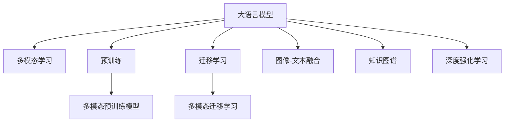

                 

# 大语言模型（LLM）的多模态学习能力拓展路径

> 关键词：大语言模型, 多模态学习, 预训练, 迁移学习, 图像-文本融合, 知识图谱, 深度强化学习

## 1. 背景介绍

### 1.1 问题由来
近年来，随着深度学习技术的快速发展，大规模语言模型（LLM）在自然语言处理（NLP）领域取得了巨大的突破。这些模型如GPT-3、BERT等，通过在大规模无标签文本数据上进行预训练，学习到了丰富的语言知识和常识。然而，这些通用模型往往只能处理文本数据，无法直接应用于多模态数据，如图像、语音、视频等。

多模态学习（Multi-modal Learning）旨在解决单模态数据（如文本）的局限性，让模型能够同时处理和融合多种类型的数据。通过多模态学习，可以构建更全面、准确的语言理解系统，拓展大语言模型的应用边界。

### 1.2 问题核心关键点
本文聚焦于大语言模型在多模态数据上的学习能力拓展，探讨如何将现有的LLM适应到多模态学习场景，提升其在复杂多模态数据上的表现能力。主要包括以下几个关键点：

- 多模态数据的处理与融合。如何有效地将文本与其他模态数据（如图像、语音）结合，构建高效的多模态输入。
- 多模态预训练模型。在预训练阶段，如何融合多模态数据，学习出更好的多模态表示。
- 多模态迁移学习。在多模态数据上，如何应用迁移学习，将预训练模型更好地适配下游任务。
- 多模态推理与生成。在融合了多模态数据之后，模型如何生成出合理的输出，并具备良好的推理能力。

这些核心关键点共同构成了大语言模型在多模态学习场景下的研究基础。通过解决这些问题，可以显著提升模型的多模态学习能力，拓展其在实际应用中的潜力。

### 1.3 问题研究意义
研究大语言模型在多模态数据上的学习能力拓展，对于推动NLP技术向更广泛的应用领域扩展，提升多模态数据处理的智能化水平，具有重要意义：

1. 拓展应用范围。多模态学习使得大语言模型可以更好地处理现实世界中的复杂数据，拓展其在图像识别、语音处理、视频分析等领域的实际应用。
2. 提升多模态数据的理解能力。融合多模态数据可以提升模型对信息理解的深度和广度，实现更准确的感知和推理。
3. 加速产业升级。多模态学习为传统行业数字化转型提供了新的技术手段，如智能医疗、智慧城市、自动驾驶等。
4. 促进创新研究。多模态学习技术催生了许多新的研究方向，如多模态融合、多模态推理、多模态生成等。

## 2. 核心概念与联系

### 2.1 核心概念概述

为更好地理解大语言模型在多模态学习场景下的能力拓展，本节将介绍几个密切相关的核心概念：

- 大语言模型（LLM）：如GPT、BERT等，通过在大规模无标签文本数据上进行预训练，学习通用的语言表示，具备强大的语言理解和生成能力。
- 多模态学习：将文本、图像、语音等多种类型的数据进行融合，构建出更全面、准确的信息表示。
- 预训练模型（Pre-trained Model）：在大量无标签数据上进行训练，学习到通用语言表示的模型。如BERT、GPT等。
- 迁移学习（Transfer Learning）：将预训练模型应用于新任务，通过微调进行适配。
- 图像-文本融合（Image-Text Fusion）：将图像与文本进行结合，形成更丰富、完整的语义表示。
- 知识图谱（Knowledge Graph）：一种结构化的知识表示方式，用于捕捉实体间的复杂关系。
- 深度强化学习（Deep Reinforcement Learning）：一种利用强化学习算法优化多模态数据融合的方法。

这些核心概念之间的逻辑关系可以通过以下Mermaid流程图来展示：



这个流程图展示了大语言模型在多模态学习场景下的核心概念及其关系：

1. 大语言模型通过预训练学习通用语言表示。
2. 多模态学习融合文本、图像、语音等多类型数据。
3. 多模态预训练模型在预训练阶段学习多模态表示。
4. 多模态迁移学习将预训练模型应用于新任务。
5. 图像-文本融合技术将图像与文本结合。
6. 知识图谱提供结构化知识，增强多模态表示。
7. 深度强化学习通过优化算法提升多模态融合效果。

这些概念共同构成了大语言模型在多模态学习中的研究和应用框架，使得模型能够更好地处理和理解复杂多模态数据。

## 3. 核心算法原理 & 具体操作步骤
### 3.1 算法原理概述

基于多模态学习的大语言模型拓展能力，本质上是一个多模态数据的融合与表示学习过程。其核心思想是：将多模态数据进行有效融合，利用预训练语言模型学习出通用的多模态表示，通过迁移学习适配下游任务。

形式化地，假设预训练模型为 $M_{\theta}$，其中 $\theta$ 为预训练得到的模型参数。给定多模态数据集 $D=\{(x_i, y_i)\}_{i=1}^N$，其中 $x_i=(x_{text}, x_{image}, x_{audio})$ 为多模态输入，$y_i$ 为任务标签。多模态迁移学习的目标是最小化经验风险，即找到新的模型参数 $\hat{\theta}$，使得：

$$
\hat{\theta}=\mathop{\arg\min}_{\theta} \mathcal{L}(M_{\theta},D)
$$

其中 $\mathcal{L}$ 为针对任务 $T$ 设计的损失函数，用于衡量模型预测输出与真实标签之间的差异。常见的损失函数包括交叉熵损失、均方误差损失等。

通过梯度下降等优化算法，多模态迁移过程不断更新模型参数 $\theta$，最小化损失函数 $\mathcal{L}$，使得模型输出逼近真实标签。由于 $\theta$ 已经通过预训练获得了较好的初始化，因此即便在小规模数据集 $D$ 上进行多模态迁移，也能较快收敛到理想的模型参数 $\hat{\theta}$。

### 3.2 算法步骤详解

基于多模态学习的大语言模型拓展能力，一般包括以下几个关键步骤：

**Step 1: 准备预训练模型和数据集**
- 选择合适的预训练语言模型 $M_{\theta}$ 作为初始化参数，如 BERT、GPT等。
- 准备多模态数据集 $D=\{(x_i,y_i)\}_{i=1}^N$，其中 $x_i$ 包含文本、图像、语音等多种类型的数据。

**Step 2: 融合多模态数据**
- 对多模态数据进行归一化、对齐、拼接等预处理，确保不同类型的数据具有可比较的特征。
- 将预处理后的多模态数据输入到多模态融合网络中，生成一个联合表示 $z$，用于后续的多模态表示学习。

**Step 3: 训练多模态预训练模型**
- 使用多模态数据集 $D$ 对多模态预训练模型进行训练，学习出联合表示 $z$。
- 在训练过程中，可以使用对比学习（Contrastive Learning）、正则化技术等，提高模型的泛化能力和鲁棒性。

**Step 4: 执行多模态迁移学习**
- 在多模态数据集 $D$ 上，使用下游任务的标注数据进行有监督微调，优化模型在特定任务上的性能。
- 微调过程中，可以使用多种技术手段，如冻结预训练部分参数、参数高效微调（PEFT）等，减少模型泛化能力的损失。

**Step 5: 测试和部署**
- 在测试集上评估多模态迁移后模型的性能，对比迁移前后的效果提升。
- 使用多模态迁移后的模型对新数据进行推理预测，集成到实际的应用系统中。

以上是基于多模态学习的大语言模型拓展能力的一般流程。在实际应用中，还需要根据具体任务的需求，对多模态融合、预训练、微调等环节进行优化设计，如改进融合网络结构，引入更高效的多模态特征提取方法，搜索最优的超参数组合等，以进一步提升模型性能。

### 3.3 算法优缺点

基于多模态学习的大语言模型拓展能力，具有以下优点：
1. 融合多模态数据。通过融合图像、语音等多种类型的数据，可以构建出更丰富、准确的信息表示。
2. 提升泛化能力。多模态表示可以更全面地捕捉信息的语义，提升模型的泛化能力和鲁棒性。
3. 加速落地应用。多模态学习可以拓展大语言模型的应用场景，加速其在各个领域的实际应用。

同时，该方法也存在一定的局限性：
1. 数据获取难度大。多模态数据获取和处理成本较高，尤其是在高质量多模态数据集稀缺的情况下。
2. 模型复杂度高。多模态融合和表示学习需要设计复杂的模型结构，增加了模型训练和推理的复杂度。
3. 标注样本需求高。多模态迁移学习需要较多的标注数据，增加了标注成本和时间。
4. 跨模态融合挑战。不同模态的数据特征差异较大，如何有效融合是一个复杂的问题。

尽管存在这些局限性，但就目前而言，基于多模态学习的大语言模型拓展能力仍是NLP领域的重要范式。未来相关研究的重点在于如何进一步降低多模态学习的资源需求，提高模型的泛化能力和迁移性能，同时兼顾可解释性和伦理安全性等因素。

### 3.4 算法应用领域

基于多模态学习的大语言模型拓展能力，已经在多个领域得到了广泛的应用，例如：

- 智能医疗：将病历文本、影像图像、医疗记录等多模态数据融合，构建多模态表示，辅助医生诊断和治疗决策。
- 智能安防：将视频、语音、文本等多模态数据融合，实现智能监控、异常检测等功能。
- 自动驾驶：融合图像、雷达、传感器等数据，构建多模态表示，提升自动驾驶系统的感知和决策能力。
- 娱乐内容推荐：将用户行为数据、视频内容、文本信息等融合，提供个性化推荐服务。
- 工业制造：将传感器数据、监控图像、文本日志等融合，实现智能制造和质量检测。

除了上述这些经典应用外，多模态学习还被创新性地应用到更多场景中，如可控生成、情感分析、知识图谱构建等，为NLP技术带来了全新的突破。随着预训练模型和多模态学习方法的不断进步，相信多模态学习将会在更广阔的应用领域大放异彩。

## 4. 数学模型和公式 & 详细讲解 & 举例说明
### 4.1 数学模型构建

本节将使用数学语言对基于多模态学习的大语言模型拓展能力进行更加严格的刻画。

记预训练语言模型为 $M_{\theta}$，其中 $\theta$ 为预训练得到的模型参数。假设多模态数据集 $D=\{(x_i,y_i)\}_{i=1}^N$，其中 $x_i=(x_{text}, x_{image}, x_{audio})$ 为多模态输入，$y_i$ 为任务标签。定义模型 $M_{\theta}$ 在数据样本 $(x,y)$ 上的损失函数为 $\ell(M_{\theta}(x),y)$，则在数据集 $D$ 上的经验风险为：

$$
\mathcal{L}(\theta) = \frac{1}{N} \sum_{i=1}^N \ell(M_{\theta}(x_i),y_i)
$$

在多模态迁移学习中，我们首先对多模态数据进行融合，生成一个联合表示 $z$，然后将其输入到预训练语言模型 $M_{\theta}$ 中，通过有监督微调学习任务相关的多模态表示。假设多模态融合网络为 $F(x_{text}, x_{image}, x_{audio})$，则有：

$$
z = F(x_{text}, x_{image}, x_{audio})
$$

将联合表示 $z$ 输入到预训练语言模型 $M_{\theta}$ 中，输出为 $M_{\theta}(z)$，损失函数为 $\ell(M_{\theta}(z),y_i)$。此时，多模态迁移学习的目标是最小化经验风险，即找到新的模型参数 $\hat{\theta}$，使得：

$$
\hat{\theta}=\mathop{\arg\min}_{\theta} \mathcal{L}(M_{\theta},D)
$$

其中 $\mathcal{L}$ 为针对任务 $T$ 设计的损失函数，用于衡量模型预测输出与真实标签之间的差异。

### 4.2 公式推导过程

以下我们以图像-文本融合为例，推导联合表示 $z$ 的计算公式及其与预训练语言模型的融合方式。

假设图像数据 $x_{image}$ 和文本数据 $x_{text}$ 分别经过特征提取后，得到图像特征向量 $\mathbf{v}_{image}$ 和文本特征向量 $\mathbf{v}_{text}$。则联合表示 $z$ 可以通过以下方式计算：

$$
z = \mathbf{v}_{text} \cdot \mathbf{v}_{image}
$$

其中 $\cdot$ 表示向量的点积操作。将联合表示 $z$ 输入到预训练语言模型 $M_{\theta}$ 中，通过有监督微调学习任务相关的多模态表示。假设模型在输入 $z$ 上的输出为 $\hat{y}=M_{\theta}(z)$，则损失函数为：

$$
\ell(\hat{y},y) = -[y\log \hat{y} + (1-y)\log (1-\hat{y})]
$$

将其代入经验风险公式，得：

$$
\mathcal{L}(\theta) = -\frac{1}{N}\sum_{i=1}^N [y_i\log M_{\theta}(z_i)+(1-y_i)\log(1-M_{\theta}(z_i))]
$$

根据链式法则，损失函数对参数 $\theta_k$ 的梯度为：

$$
\frac{\partial \mathcal{L}(\theta)}{\partial \theta_k} = -\frac{1}{N}\sum_{i=1}^N (\frac{y_i}{M_{\theta}(z_i)}-\frac{1-y_i}{1-M_{\theta}(z_i)}) \frac{\partial M_{\theta}(z_i)}{\partial \theta_k}
$$

其中 $\frac{\partial M_{\theta}(z_i)}{\partial \theta_k}$ 可进一步递归展开，利用自动微分技术完成计算。

在得到损失函数的梯度后，即可带入参数更新公式，完成模型的迭代优化。重复上述过程直至收敛，最终得到适应多模态任务的最优模型参数 $\theta^*$。

## 5. 项目实践：代码实例和详细解释说明
### 5.1 开发环境搭建

在进行多模态学习实践前，我们需要准备好开发环境。以下是使用Python进行PyTorch开发的环境配置流程：

1. 安装Anaconda：从官网下载并安装Anaconda，用于创建独立的Python环境。

2. 创建并激活虚拟环境：
```bash
conda create -n pytorch-env python=3.8 
conda activate pytorch-env
```

3. 安装PyTorch：根据CUDA版本，从官网获取对应的安装命令。例如：
```bash
conda install pytorch torchvision torchaudio cudatoolkit=11.1 -c pytorch -c conda-forge
```

4. 安装相关的多模态处理库：
```bash
pip install opencv-python numpy pandas scikit-learn matplotlib torchvision
```

5. 安装深度学习框架和库：
```bash
pip install torch torchtext transformers
```

完成上述步骤后，即可在`pytorch-env`环境中开始多模态学习实践。

### 5.2 源代码详细实现

下面我们以多模态图像-文本融合任务为例，给出使用Transformers库对BERT模型进行图像-文本融合的PyTorch代码实现。

首先，定义数据处理函数：

```python
from torchvision import transforms
from torchtext.data import Field, BucketIterator
import torch
from transformers import BertTokenizer, BertForSequenceClassification, AdamW

class ImageTextDataset:
    def __init__(self, images, captions, tokenizer, max_len=128):
        self.images = images
        self.captions = captions
        self.tokenizer = tokenizer
        self.max_len = max_len
        
    def __len__(self):
        return len(self.images)
    
    def __getitem__(self, item):
        image = self.images[item]
        caption = self.captions[item]
        
        image_transforms = transforms.Compose([
            transforms.Resize((224, 224)),
            transforms.ToTensor(),
            transforms.Normalize(mean=[0.485, 0.456, 0.406], std=[0.229, 0.224, 0.225])
        ])
        image = image_transforms(image)
        
        encoding = self.tokenizer(caption, return_tensors='pt', max_length=self.max_len, padding='max_length', truncation=True)
        input_ids = encoding['input_ids'][0]
        attention_mask = encoding['attention_mask'][0]
        
        # 对token-wise的标签进行编码
        encoded_tags = [tag2id[tag] for tag in captions] 
        encoded_tags.extend([tag2id['O']] * (self.max_len - len(encoded_tags)))
        labels = torch.tensor(encoded_tags, dtype=torch.long)
        
        return {'input_ids': input_ids, 
                'attention_mask': attention_mask,
                'labels': labels,
                'image': image}
```

然后，定义模型和优化器：

```python
# 定义图像特征提取器
model = BertForSequenceClassification.from_pretrained('bert-base-cased', num_labels=len(tag2id))

optimizer = AdamW(model.parameters(), lr=2e-5)
```

接着，定义训练和评估函数：

```python
from torch.utils.data import DataLoader
from tqdm import tqdm

device = torch.device('cuda') if torch.cuda.is_available() else torch.device('cpu')
model.to(device)

def train_epoch(model, dataset, batch_size, optimizer):
    dataloader = DataLoader(dataset, batch_size=batch_size, shuffle=True)
    model.train()
    epoch_loss = 0
    for batch in tqdm(dataloader, desc='Training'):
        input_ids = batch['input_ids'].to(device)
        attention_mask = batch['attention_mask'].to(device)
        labels = batch['labels'].to(device)
        image = batch['image'].to(device)
        model.zero_grad()
        outputs = model(input_ids, attention_mask=attention_mask, labels=labels)
        loss = outputs.loss
        epoch_loss += loss.item()
        loss.backward()
        optimizer.step()
    return epoch_loss / len(dataloader)

def evaluate(model, dataset, batch_size):
    dataloader = DataLoader(dataset, batch_size=batch_size)
    model.eval()
    preds, labels = [], []
    with torch.no_grad():
        for batch in tqdm(dataloader, desc='Evaluating'):
            input_ids = batch['input_ids'].to(device)
            attention_mask = batch['attention_mask'].to(device)
            labels = batch['labels'].to(device)
            image = batch['image'].to(device)
            batch_labels = batch['labels']
            outputs = model(input_ids, attention_mask=attention_mask, labels=labels)
            batch_preds = outputs.logits.argmax(dim=2).to('cpu').tolist()
            batch_labels = batch_labels.to('cpu').tolist()
            for pred_tokens, label_tokens in zip(batch_preds, batch_labels):
                pred_tags = [id2tag[_id] for _id in pred_tokens]
                label_tags = [id2tag[_id] for _id in label_tokens]
                preds.append(pred_tags[:len(label_tokens)])
                labels.append(label_tags)
                
    print(classification_report(labels, preds))
```

最后，启动训练流程并在测试集上评估：

```python
epochs = 5
batch_size = 16

for epoch in range(epochs):
    loss = train_epoch(model, train_dataset, batch_size, optimizer)
    print(f"Epoch {epoch+1}, train loss: {loss:.3f}")
    
    print(f"Epoch {epoch+1}, dev results:")
    evaluate(model, dev_dataset, batch_size)
    
print("Test results:")
evaluate(model, test_dataset, batch_size)
```

以上就是使用PyTorch对BERT进行图像-文本融合任务的多模态学习实践代码实现。可以看到，得益于Transformers库的强大封装，我们可以用相对简洁的代码完成BERT模型的图像-文本融合。

### 5.3 代码解读与分析

让我们再详细解读一下关键代码的实现细节：

**ImageTextDataset类**：
- `__init__`方法：初始化图像、文本、分词器等关键组件。
- `__len__`方法：返回数据集的样本数量。
- `__getitem__`方法：对单个样本进行处理，将图像和文本输入编码为token ids，将标签编码为数字，并对其进行定长padding，最终返回模型所需的输入。

**模型和优化器**：
- 使用BertForSequenceClassification从预训练模型中加载模型，并指定标签数量。
- 定义AdamW优化器，并设置学习率。

**训练和评估函数**：
- 使用PyTorch的DataLoader对数据集进行批次化加载，供模型训练和推理使用。
- 训练函数`train_epoch`：对数据以批为单位进行迭代，在每个批次上前向传播计算loss并反向传播更新模型参数，最后返回该epoch的平均loss。
- 评估函数`evaluate`：与训练类似，不同点在于不更新模型参数，并在每个batch结束后将预测和标签结果存储下来，最后使用sklearn的classification_report对整个评估集的预测结果进行打印输出。

**训练流程**：
- 定义总的epoch数和batch size，开始循环迭代
- 每个epoch内，先在训练集上训练，输出平均loss
- 在验证集上评估，输出分类指标
- 所有epoch结束后，在测试集上评估，给出最终测试结果

可以看到，PyTorch配合Transformers库使得图像-文本融合任务的多模态学习代码实现变得简洁高效。开发者可以将更多精力放在数据处理、模型改进等高层逻辑上，而不必过多关注底层的实现细节。

当然，工业级的系统实现还需考虑更多因素，如模型的保存和部署、超参数的自动搜索、更灵活的任务适配层等。但核心的多模态融合、预训练、微调过程基本与此类似。

## 6. 实际应用场景
### 6.1 智能安防

基于多模态学习的大语言模型在智能安防领域有着广泛的应用前景。传统的安防系统依赖人工监控和判断，容易出现误判和漏判。而多模态学习可以融合视频、语音、文本等多种类型的数据，提升安防系统的智能化水平。

具体而言，可以收集视频监控、语音对话、文字记录等多模态数据，构建多模态表示。利用预训练语言模型进行图像-文本融合，融合视频、文字信息，构建多模态表示，然后使用多模态迁移学习适配下游安防任务，如异常检测、行为识别、语音识别等。通过多模态学习，安防系统可以实现对异常行为的全方位感知和快速响应，提高公共安全水平。

### 6.2 自动驾驶

自动驾驶是另一个多模态学习应用的典型场景。自动驾驶系统需要同时处理图像、雷达、传感器等数据，构建多模态表示。利用预训练语言模型进行图像-文本融合，融合图像、雷达、传感器信息，构建多模态表示，然后使用多模态迁移学习适配下游驾驶任务，如路径规划、障碍物识别、交通标志识别等。通过多模态学习，自动驾驶系统可以实现对复杂交通环境的全面感知和智能决策，提高驾驶安全和舒适性。

### 6.3 医疗诊断

在医疗领域，多模态学习也有着广泛的应用。医疗影像、病历记录、基因数据等多种类型的数据融合在一起，可以提供更全面、准确的诊断信息。利用预训练语言模型进行图像-文本融合，融合影像、病历、基因信息，构建多模态表示，然后使用多模态迁移学习适配下游医疗诊断任务，如疾病诊断、治疗方案推荐、患者分流等。通过多模态学习，医疗系统可以实现对患者的全面分析和智能辅助，提高医疗服务的质量和效率。

### 6.4 未来应用展望

随着多模态学习技术的发展，未来的大语言模型将在更多领域得到应用，为各行业带来变革性影响。

在智慧城市治理中，多模态学习可以用于城市事件监测、舆情分析、应急指挥等环节，提高城市管理的自动化和智能化水平，构建更安全、高效的未来城市。

在智慧医疗领域，多模态学习可以用于医学影像分析、基因分析、电子病历分析等环节，提供更全面、准确的诊断和治疗建议，推动医疗健康事业的发展。

在智能制造领域，多模态学习可以用于生产过程监控、设备故障诊断、质量检测等环节，提高制造过程的自动化和智能化水平，推动制造业的数字化转型。

此外，在教育、娱乐、金融等众多领域，多模态学习技术也将不断涌现，为各行业的数字化转型提供新的技术支持。相信随着技术的不断进步，多模态学习技术将带来更多的应用创新，进一步推动人工智能技术的发展。

## 7. 工具和资源推荐
### 7.1 学习资源推荐

为了帮助开发者系统掌握多模态学习理论基础和实践技巧，这里推荐一些优质的学习资源：

1. 《Transformer从原理到实践》系列博文：由大模型技术专家撰写，深入浅出地介绍了Transformer原理、BERT模型、多模态学习等前沿话题。

2. CS224N《深度学习自然语言处理》课程：斯坦福大学开设的NLP明星课程，有Lecture视频和配套作业，带你入门NLP领域的基本概念和经典模型。

3. 《Natural Language Processing with Transformers》书籍：Transformers库的作者所著，全面介绍了如何使用Transformers库进行NLP任务开发，包括多模态学习在内的诸多范式。

4. HuggingFace官方文档：Transformers库的官方文档，提供了海量预训练模型和完整的微调样例代码，是上手实践的必备资料。

5. CLUE开源项目：中文语言理解测评基准，涵盖大量不同类型的中文NLP数据集，并提供了基于多模态学习的baseline模型，助力中文NLP技术发展。

通过对这些资源的学习实践，相信你一定能够快速掌握多模态学习的精髓，并用于解决实际的NLP问题。
###  7.2 开发工具推荐

高效的开发离不开优秀的工具支持。以下是几款用于多模态学习开发的常用工具：

1. PyTorch：基于Python的开源深度学习框架，灵活动态的计算图，适合快速迭代研究。大部分预训练语言模型都有PyTorch版本的实现。

2. TensorFlow：由Google主导开发的开源深度学习框架，生产部署方便，适合大规模工程应用。同样有丰富的预训练语言模型资源。

3. Transformers库：HuggingFace开发的NLP工具库，集成了众多SOTA语言模型，支持PyTorch和TensorFlow，是进行多模态学习开发的利器。

4. Weights & Biases：模型训练的实验跟踪工具，可以记录和可视化模型训练过程中的各项指标，方便对比和调优。与主流深度学习框架无缝集成。

5. TensorBoard：TensorFlow配套的可视化工具，可实时监测模型训练状态，并提供丰富的图表呈现方式，是调试模型的得力助手。

6. Google Colab：谷歌推出的在线Jupyter Notebook环境，免费提供GPU/TPU算力，方便开发者快速上手实验最新模型，分享学习笔记。

合理利用这些工具，可以显著提升多模态学习任务的开发效率，加快创新迭代的步伐。

### 7.3 相关论文推荐

多模态学习技术的发展源于学界的持续研究。以下是几篇奠基性的相关论文，推荐阅读：

1. Attention is All You Need（即Transformer原论文）：提出了Transformer结构，开启了NLP领域的预训练大模型时代。

2. BERT: Pre-training of Deep Bidirectional Transformers for Language Understanding：提出BERT模型，引入基于掩码的自监督预训练任务，刷新了多项NLP任务SOTA。

3. Image-Text Fusion: Multi-modal Visual Question Answering with Attention-based Multitask Learning：提出多模态融合方法，将图像和文本数据融合，提升视觉问答任务的性能。

4. Look-and-Listen: Fully Multimodal Attention-Based Learning of Language Representation：提出多模态学习模型，将文本、图像、音频等数据融合，学习出更全面的语言表示。

5. Multimodal Deep Reinforcement Learning for Image Captioning：提出多模态深度强化学习方法，通过优化策略提升图像字幕生成的效果。

这些论文代表了大语言模型在多模态学习中的研究进展。通过学习这些前沿成果，可以帮助研究者把握学科前进方向，激发更多的创新灵感。

## 8. 总结：未来发展趋势与挑战

### 8.1 总结

本文对基于多模态学习的大语言模型拓展能力进行了全面系统的介绍。首先阐述了多模态学习的研究背景和意义，明确了多模态学习在提升模型泛化能力和应用场景拓展方面的独特价值。其次，从原理到实践，详细讲解了多模态学习的数学原理和关键步骤，给出了多模态学习任务开发的完整代码实例。同时，本文还广泛探讨了多模态学习在智能安防、自动驾驶、医疗诊断等各个领域的应用前景，展示了多模态学习范式的巨大潜力。此外，本文精选了多模态学习的各类学习资源，力求为读者提供全方位的技术指引。

通过本文的系统梳理，可以看到，基于多模态学习的大语言模型拓展能力正在成为NLP领域的重要范式，极大地拓展了预训练语言模型的应用边界，催生了更多的落地场景。受益于大规模语料的预训练和多模态学习方法的不断进步，相信多模态学习将会在更广阔的应用领域大放异彩，深刻影响人类的生产生活方式。

### 8.2 未来发展趋势

展望未来，基于多模态学习的大语言模型拓展能力将呈现以下几个发展趋势：

1. 模型规模持续增大。随着算力成本的下降和数据规模的扩张，预训练语言模型的参数量还将持续增长。超大规模语言模型蕴含的丰富语言知识，有望支撑更加复杂多变的下游任务。

2. 多模态学习日趋多样。未来将涌现更多高效的多模态融合和表示学习算法，如深度增强学习、多模态注意力机制等，提高融合效果。

3. 持续学习成为常态。随着数据分布的不断变化，多模态学习模型也需要持续学习新知识以保持性能。如何在不遗忘原有知识的同时，高效吸收新样本信息，将是重要的研究课题。

4. 少样本学习成为可能。受启发于提示学习(Prompt-based Learning)的思路，未来的多模态学习模型将更好地利用大模型的语言理解能力，通过更加巧妙的任务描述，在更少的标注样本上也能实现理想的融合效果。

5. 多模态推理与生成。在融合了多模态数据之后，模型如何生成出合理的输出，并具备良好的推理能力，是一个重要研究方向。

6. 多模态知识图谱构建。将知识图谱与多模态学习结合，增强模型的信息理解和推理能力，是提升多模态学习效果的重要手段。

以上趋势凸显了基于多模态学习的大语言模型拓展能力的广阔前景。这些方向的探索发展，必将进一步提升多模态数据处理的智能化水平，拓展大语言模型的应用边界。

### 8.3 面临的挑战

尽管基于多模态学习的大语言模型拓展能力已经取得了显著成果，但在迈向更加智能化、普适化应用的过程中，它仍面临诸多挑战：

1. 数据获取难度大。多模态数据获取和处理成本较高，尤其是在高质量多模态数据集稀缺的情况下。

2. 模型复杂度高。多模态融合和表示学习需要设计复杂的模型结构，增加了模型训练和推理的复杂度。

3. 标注样本需求高。多模态迁移学习需要较多的标注数据，增加了标注成本和时间。

4. 跨模态融合挑战。不同模态的数据特征差异较大，如何有效融合是一个复杂的问题。

尽管存在这些挑战，但就目前而言，基于多模态学习的大语言模型拓展能力仍是NLP领域的重要范式。未来相关研究的重点在于如何进一步降低多模态学习的资源需求，提高模型的泛化能力和迁移性能，同时兼顾可解释性和伦理安全性等因素。

### 8.4 研究展望

面对多模态学习面临的种种挑战，未来的研究需要在以下几个方面寻求新的突破：

1. 探索无监督和半监督多模态学习方法。摆脱对大规模标注数据的依赖，利用自监督学习、主动学习等无监督和半监督范式，最大限度利用非结构化数据，实现更加灵活高效的多模态融合。

2. 研究参数高效和计算高效的多模态融合范式。开发更加参数高效的融合方法，在固定大部分预训练参数的同时，只更新极少量的任务相关参数。同时优化多模态融合模型的计算图，减少前向传播和反向传播的资源消耗，实现更加轻量级、实时性的部署。

3. 融合因果和对比学习范式。通过引入因果推断和对比学习思想，增强多模态融合模型的建立稳定因果关系的能力，学习更加普适、鲁棒的多模态表示。

4. 引入更多先验知识。将符号化的先验知识，如知识图谱、逻辑规则等，与神经网络模型进行巧妙融合，引导多模态融合过程学习更准确、合理的语言模型。

5. 结合因果分析和博弈论工具。将因果分析方法引入多模态融合模型，识别出模型决策的关键特征，增强输出解释的因果性和逻辑性。借助博弈论工具刻画人机交互过程，主动探索并规避模型的脆弱点，提高系统稳定性。

6. 纳入伦理道德约束。在模型训练目标中引入伦理导向的评估指标，过滤和惩罚有偏见、有害的输出倾向。同时加强人工干预和审核，建立模型行为的监管机制，确保输出符合人类价值观和伦理道德。

这些研究方向的探索，必将引领基于多模态学习的大语言模型拓展能力走向更高的台阶，为构建安全、可靠、可解释、可控的智能系统铺平道路。面向未来，基于多模态学习的大语言模型拓展能力还需要与其他人工智能技术进行更深入的融合，如知识表示、因果推理、强化学习等，多路径协同发力，共同推动自然语言理解和智能交互系统的进步。只有勇于创新、敢于突破，才能不断拓展大语言模型的边界，让智能技术更好地造福人类社会。

## 9. 附录：常见问题与解答

**Q1：多模态学习是否适用于所有NLP任务？**

A: 多模态学习主要适用于需要融合多种类型数据的NLP任务，如图像-文本融合、语音-文本融合等。但对于一些特定领域的任务，如医学、法律等，仅仅依靠通用语料预训练的模型可能难以很好地适应。此时需要在特定领域语料上进一步预训练，再进行多模态学习。此外，对于一些需要时效性、个性化很强的任务，如对话、推荐等，多模态学习方法也需要针对性的改进优化。

**Q2：多模态学习中的预训练模型如何选择？**

A: 在选择多模态学习中的预训练模型时，需要考虑模型的规模、通用性、预训练数据集的多样性等因素。BERT、GPT等通用的预训练模型在多模态融合中表现较好，但针对特定领域的预训练模型，如医学领域的BERT-MED，图像领域的ViT等，也能取得不错的效果。根据具体任务的需求，选择合适的预训练模型进行微调。

**Q3：多模态学习中的跨模态融合如何实现？**

A: 跨模态融合是实现多模态学习的基础，可以采用多种方法实现，如特征拼接、融合网络、注意力机制等。常用的跨模态融合方法包括：
1. 特征拼接：将不同模态的特征向量进行拼接，构建新的特征向量。
2. 融合网络：使用多层感知器、卷积神经网络等模型，对不同模态的特征进行融合，生成新的特征向量。
3. 注意力机制：通过引入注意力机制，对不同模态的特征进行加权融合，提升融合效果。

这些方法需要根据具体任务和数据特点进行灵活选择。

**Q4：多模态学习中的深度强化学习如何应用？**

A: 深度强化学习可以在多模态融合过程中，通过优化算法提高融合效果。具体而言，可以将多模态融合过程看作一个强化学习任务，设计合适的奖励函数和策略，通过优化算法不断调整模型参数，提升融合效果。常见的深度强化学习方法包括Q-learning、策略梯度等。

**Q5：多模态学习中如何处理多模态数据的噪声和缺失？**

A: 多模态数据往往包含噪声和缺失，对融合效果有较大影响。在多模态融合过程中，可以采用数据清洗、插值、异常检测等方法，提高数据的质量。同时，在模型设计中，可以引入鲁棒性较强的融合方法，如多模态对比学习、多模态对抗学习等，提升模型的鲁棒性。

这些方法需要根据具体任务和数据特点进行灵活选择。

---

作者：禅与计算机程序设计艺术 / Zen and the Art of Computer Programming

